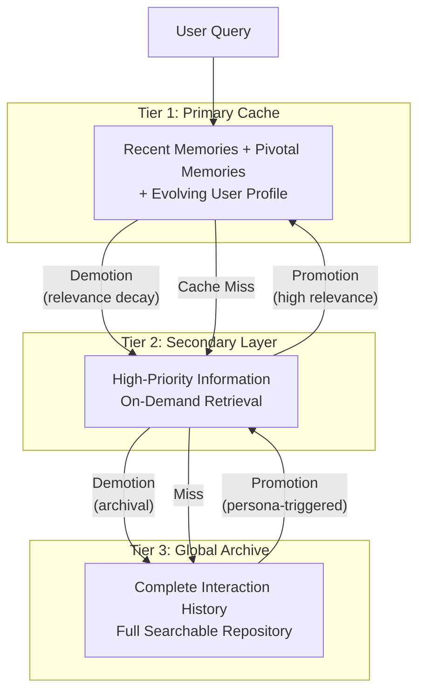
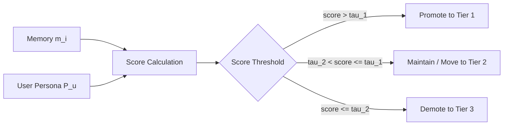
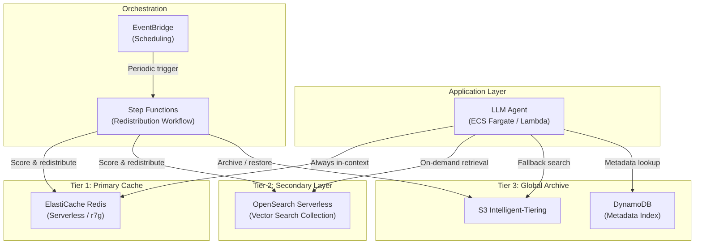

## 論文概要（Abstract）

Hierarchical Memory Orchestration（HMO）は、長期対話型エージェントが蓄積する膨大なインタラクションデータに対し、3層のメモリ階層とユーザーペルソナ駆動の動的再配置メカニズムで効率的に対処するフレームワークである。単純なストレージ拡張では検索ノイズと計算レイテンシが増大する問題に対し、ユーザー中心の関連性に基づいてメモリをTier 1（主キャッシュ）・Tier 2（補助層）・Tier 3（グローバルアーカイブ）に分類・管理する。著者らは複数のベンチマークでSOTA性能を達成し、OpenClawエコシステムでの実デプロイで個人化と流動性の向上を実証したと報告している。

本記事は [https://arxiv.org/abs/2604.01670](https://arxiv.org/abs/2604.01670) の解説記事です。

この記事は [Zenn記事: LangGraph永続メモリでCSエージェントの長期文脈保持と応答精度を改善する](https://zenn.dev/0h_n0/articles/5b6f9454f72459) の深掘りです。

> **注記**: 論文の詳細な手法については公開情報に基づく推測を含む。arXiv上の公開情報を元にアーキテクチャの技術的推論を補足している箇所がある。

## 情報源

- **arXiv ID**: 2604.01670
- **URL**: [https://arxiv.org/abs/2604.01670](https://arxiv.org/abs/2604.01670)
- **著者**: Junming Liu, Yifei Sun, Weihua Cheng, Haodong Lei, Yuqi Li, Yirong Chen, Ding Wang
- **所属**: Shanghai Artificial Intelligence Laboratory, The City University of New York
- **発表年**: 2026
- **分野**: cs.AI
- **論文規模**: 10ページ、5図、7表

## 背景と動機（Background & Motivation）

LLMベースの永続エージェントが長期にわたりユーザーと対話を続ける場合、過去のインタラクション履歴をどのように保持・検索するかは根本的な設計課題となる。単純にすべての対話ログをベクトルDBに格納する方式（フラットメモリ）では、蓄積データの増大に伴い2つの深刻な問題が発生する。

第一に、**検索ノイズの増大**である。数万件の過去メモリからTop-K検索を行うと、クエリとの表面的類似度は高いが文脈的に無関係なメモリが混入し、エージェントの応答品質を劣化させる。第二に、**計算レイテンシの悪化**である。特にリソース制約のあるエッジデバイスやリアルタイム応答が求められるカスタマーサービスでは、全メモリを走査する検索は許容できない遅延をもたらす。

既存の研究では、MemoryBank、MemGPT（現Letta）、ReadAgent等がメモリの構造化や圧縮を試みているが、ユーザーの長期的行動パターンに基づくメモリの動的優先順位付けは十分に探求されていなかった。著者らは、人間の記憶システム（ワーキングメモリ → 短期記憶 → 長期記憶）に着想を得つつ、**ユーザーペルソナを軸にした能動的な記憶の再編成**という方向で、この課題に取り組んでいる。

## 主要な貢献（Key Contributions）

- **3層メモリ階層の設計**: Primary Cache（常時コンテキスト内）、Secondary Layer（オンデマンド検索）、Global Archive（完全履歴保管）の3層構造により、検索空間を段階的に限定
- **ユーザーペルソナ駆動の動的メモリ再配置**: ユーザーの行動パターン・嗜好・長期的関心を反映するペルソナプロファイルに基づき、メモリを層間で昇格・降格
- **複数ベンチマークでのSOTA性能**: 会話型メモリベンチマークで既存手法を上回る性能を達成
- **OpenClawエコシステムでの実デプロイ検証**: 実運用環境でエージェントの流動性と個人化が向上したことを実証

## 技術的詳細（Technical Details）

### 3層メモリ階層

HMOの中核は、メモリをアクセス頻度と重要度に応じて3つの層に配置する階層構造である。



**Tier 1: Primary Cache** は、LLMのコンテキストウィンドウ内に常駐するコンパクトな層である。直近のインタラクション記録、ユーザーにとって重要と判定されたピボタルメモリ、そして動的に更新されるユーザープロファイルが含まれる。クエリ処理時に追加の検索コストなしで参照できるため、応答レイテンシへの影響は最小限に抑えられる。

**Tier 2: Secondary Layer** は、Tier 1に収まりきらないが高優先度と判定された情報を保持する。Tier 1でキャッシュミスが発生した場合にオンデマンドで検索が行われる。ベクトル検索やキーワード検索を組み合わせたハイブリッド検索が用いられると推測される。

**Tier 3: Global Archive** は、すべてのインタラクション履歴を保管する完全アーカイブである。通常の応答生成では参照されないが、ペルソナ駆動の再配置プロセスやフォールバック検索時にアクセスされる。

### ユーザーペルソナの構築と活用

HMOの特徴的な要素は、ユーザーペルソナを明示的にモデリングし、メモリ管理の中核に据えている点である。ペルソナは対話履歴からLLMベースの要約・抽出により構築されると考えられる。

ペルソナプロファイル $P_u$ は以下の要素で構成されると推測される。

$$
P_u = \langle \text{preferences}, \text{behavior\_patterns}, \text{long\_term\_interests}, \text{context\_sensitivity} \rangle
$$

ここで $\text{preferences}$ はユーザーの明示的な嗜好（トピック、スタイル等）、$\text{behavior\_patterns}$ は過去のインタラクションから抽出された行動傾向、$\text{long\_term\_interests}$ は持続的な関心領域、$\text{context\_sensitivity}$ は時間帯・状況による応答調整の度合いを示す。

### メモリ再配置メカニズム

メモリの層間移動（昇格・降格）は、ペルソナとの関連性スコアに基づいて動的に実行される。



各メモリ $m_i$ に対する関連性スコア $S(m_i, P_u)$ は、以下のような多要因評価で算出されると推測される。

$$
S(m_i, P_u) = \alpha \cdot \text{recency}(m_i) + \beta \cdot \text{frequency}(m_i) + \gamma \cdot \text{relevance}(m_i, P_u)
$$

$\text{recency}(m_i)$ は時間減衰関数（指数減衰等）、$\text{frequency}(m_i)$ はそのメモリが参照された回数の正規化値、$\text{relevance}(m_i, P_u)$ はメモリ内容とユーザーペルソナの意味的類似度である。重み $\alpha, \beta, \gamma$ はタスクドメインに応じて調整可能と考えられる。

## アルゴリズム（Memory Redistribution）

以下は、HMOのメモリ再配置プロセスの擬似コードである（論文のアーキテクチャ記述に基づく推定）。

```
Algorithm: HMO Memory Redistribution
Input: Memory tiers T1, T2, T3; User Persona P_u; Thresholds tau_1, tau_2
Output: Updated tiers T1', T2', T3'

1.  P_u ← UPDATE_PERSONA(P_u, recent_interactions)
2.  
3.  // Phase 1: Score all memories in T1 and T2
4.  for each m_i in T1 ∪ T2:
5.      S_i ← α · recency(m_i) + β · frequency(m_i) + γ · relevance(m_i, P_u)
6.  
7.  // Phase 2: Demote low-relevance memories
8.  for each m_i in T1:
9.      if S_i ≤ tau_2:
10.         MOVE(m_i, T1 → T3)
11.     elif S_i ≤ tau_1:
12.         MOVE(m_i, T1 → T2)
13. 
14. // Phase 3: Promote high-relevance memories from archive
15. candidates ← PERSONA_TRIGGERED_SEARCH(T3, P_u, top_k)
16. for each m_j in candidates:
17.     S_j ← α · recency(m_j) + β · frequency(m_j) + γ · relevance(m_j, P_u)
18.     if S_j > tau_1:
19.         MOVE(m_j, T3 → T1)
20.     elif S_j > tau_2:
21.         MOVE(m_j, T3 → T2)
22. 
23. // Phase 4: Enforce capacity constraints on T1
24. while |T1| > CAPACITY_T1:
25.     m_min ← argmin_{m in T1} S(m, P_u)
26.     MOVE(m_min, T1 → T2)
27. 
28. return T1, T2, T3
```

Phase 1でTier 1・Tier 2のメモリをスコアリングし、Phase 2で閾値を下回るメモリを降格する。Phase 3がHMOの特徴的な処理で、ペルソナプロファイルをクエリとしてGlobal Archiveを検索し、長期的行動パターンに関連する過去のメモリを能動的に上位層へ昇格させる。Phase 4でTier 1の容量制約を適用し、コンテキストウィンドウに収まるサイズを維持する。

## 実装のポイント（Implementation Notes）

HMOを実装する際に考慮すべき技術的ポイントを整理する。

**Tier 1の容量設計**: Tier 1はLLMのコンテキストウィンドウ内に収める必要がある。128Kトークンのモデルを使用する場合、システムプロンプト・ツール定義・現在の対話を差し引いた残余トークン数がTier 1の上限となる。典型的には2,000〜8,000トークン程度が実用的な範囲と考えられる。

**ペルソナ更新の頻度**: ペルソナプロファイルの更新を毎ターン実行するとLLM呼び出しコストが増大する。一定ターン数ごと（例: 10ターン）やセッション切替時にバッチ更新する戦略が効率的である。更新にはLLMベースの要約・差分抽出を用いる。

**検索インデックスの分離**: Tier 2にはベクトルDBによる意味検索、Tier 3にはBM25等のキーワード検索とベクトル検索のハイブリッドを適用することで、層ごとに最適な検索戦略を選択できる。

**再配置のトリガー設計**: メモリ再配置を毎クエリで実行するのはコストが高い。セッション開始時、一定時間経過後、あるいはペルソナプロファイルの大幅な更新を検知した際にバッチ実行する設計が実用的である。

## Production Deployment Guide: AWSでの階層型メモリ実装

HMOの3層メモリアーキテクチャをAWS上で実装する場合の設計パターンを解説する。各層を適切なAWSサービスにマッピングし、コスト効率とレイテンシのバランスを取る。

### アーキテクチャ概要



### Tier 1: ElastiCache Redis によるPrimary Cache

Tier 1はリクエストごとに参照されるため、サブミリ秒のアクセスレイテンシが求められる。ElastiCache Redisが適している。

```hcl
# Terraform: ElastiCache Serverless for Tier 1
resource "aws_elasticache_serverless_cache" "hmo_tier1" {
  engine = "redis"
  name   = "hmo-tier1-cache"

  cache_usage_limits {
    data_storage {
      maximum = 10  # GB — ペルソナ + ピボタルメモリ用
      unit    = "GB"
    }
    ecpu_per_second {
      maximum = 15000
    }
  }

  security_group_ids = [aws_security_group.hmo_cache.id]
  subnet_ids         = aws_subnet.private[*].id

  daily_snapshot_time   = "04:00"
  snapshot_retention_limit = 3

  tags = {
    Component = "hmo-tier1"
    Tier      = "primary-cache"
  }
}
```

**データ構造設計**: ユーザーごとにRedis Hashでペルソナプロファイルを保持し、Sorted Setでメモリをスコア順に管理する。

```python
import redis.asyncio as redis
from pydantic import BaseModel
from datetime import datetime


class MemoryEntry(BaseModel):
    memory_id: str
    content: str
    created_at: datetime
    last_accessed: datetime
    access_count: int
    relevance_score: float


class Tier1CacheManager:
    """ElastiCache Redis を用いた Tier 1 メモリ管理."""

    def __init__(self, redis_url: str, capacity: int = 50) -> None:
        self.client = redis.from_url(redis_url)
        self.capacity = capacity

    async def get_user_context(self, user_id: str) -> dict:
        """Tier 1 のペルソナ + メモリを一括取得."""
        pipe = self.client.pipeline()
        pipe.hgetall(f"persona:{user_id}")
        pipe.zrevrangebyscore(
            f"memories:{user_id}",
            max="+inf",
            min="-inf",
            start=0,
            num=self.capacity,
            withscores=True,
        )
        persona_raw, memories_raw = await pipe.execute()
        return {
            "persona": persona_raw,
            "memories": [
                {"id": m.decode(), "score": s}
                for m, s in memories_raw
            ],
        }

    async def promote_memory(
        self, user_id: str, memory: MemoryEntry
    ) -> None:
        """メモリを Tier 1 に昇格."""
        await self.client.zadd(
            f"memories:{user_id}",
            {memory.memory_id: memory.relevance_score},
        )
        # 容量超過時に最低スコアのメモリを降格
        count = await self.client.zcard(f"memories:{user_id}")
        if count > self.capacity:
            await self.client.zpopmin(
                f"memories:{user_id}", count - self.capacity
            )

    async def update_persona(
        self, user_id: str, persona: dict[str, str]
    ) -> None:
        """ユーザーペルソナプロファイルを更新."""
        await self.client.hset(f"persona:{user_id}", mapping=persona)
```

### Tier 2: OpenSearch Serverless によるSecondary Layer

Tier 2はベクトル検索によるセマンティック検索を担う。OpenSearch Serverlessのベクトル検索コレクションが適している。

```hcl
# Terraform: OpenSearch Serverless for Tier 2
resource "aws_opensearchserverless_collection" "hmo_tier2" {
  name = "hmo-tier2-memories"
  type = "VECTORSEARCH"

  tags = {
    Component = "hmo-tier2"
    Tier      = "secondary-layer"
  }

  depends_on = [
    aws_opensearchserverless_security_policy.encryption,
    aws_opensearchserverless_security_policy.network,
  ]
}

resource "aws_opensearchserverless_security_policy" "encryption" {
  name = "hmo-tier2-enc"
  type = "encryption"
  policy = jsonencode({
    Rules = [{
      ResourceType = "collection"
      Resource      = ["collection/hmo-tier2-memories"]
    }]
    AWSOwnedKey = true
  })
}

resource "aws_opensearchserverless_access_policy" "data" {
  name = "hmo-tier2-access"
  type = "data"
  policy = jsonencode([{
    Rules = [
      {
        ResourceType = "index"
        Resource      = ["index/hmo-tier2-memories/*"]
        Permission    = [
          "aoss:CreateIndex",
          "aoss:ReadDocument",
          "aoss:WriteDocument",
          "aoss:UpdateIndex",
          "aoss:DescribeIndex",
        ]
      },
      {
        ResourceType = "collection"
        Resource      = ["collection/hmo-tier2-memories"]
        Permission    = ["aoss:CreateCollectionItems"]
      }
    ]
    Principal = [var.agent_role_arn]
  }])
}
```

**インデックス設計**: knn_vectorフィールドでエンベディングを格納し、ユーザーIDによるフィルタ付きベクトル検索を行う。

```python
from opensearchpy import AsyncOpenSearch, RequestsHttpConnection
from pydantic import BaseModel


class Tier2SearchManager:
    """OpenSearch Serverless を用いた Tier 2 セマンティック検索."""

    INDEX_NAME = "hmo-memories"
    EMBEDDING_DIM = 1536  # text-embedding-3-small

    INDEX_BODY = {
        "settings": {
            "index": {"knn": True, "knn.algo_param.ef_search": 256}
        },
        "mappings": {
            "properties": {
                "user_id": {"type": "keyword"},
                "memory_id": {"type": "keyword"},
                "content": {"type": "text", "analyzer": "kuromoji"},
                "embedding": {
                    "type": "knn_vector",
                    "dimension": 1536,
                    "method": {
                        "name": "hnsw",
                        "space_type": "cosinesimil",
                        "engine": "faiss",
                        "parameters": {"ef_construction": 512, "m": 16},
                    },
                },
                "relevance_score": {"type": "float"},
                "created_at": {"type": "date"},
                "tier": {"type": "keyword"},
            }
        },
    }

    def __init__(self, host: str, region: str) -> None:
        from opensearchpy import AWSV4SignerAuth
        import boto3

        credentials = boto3.Session().get_credentials()
        auth = AWSV4SignerAuth(credentials, region, "aoss")
        self.client = AsyncOpenSearch(
            hosts=[{"host": host, "port": 443}],
            http_auth=auth,
            use_ssl=True,
            connection_class=RequestsHttpConnection,
        )

    async def search_memories(
        self,
        user_id: str,
        query_embedding: list[float],
        top_k: int = 10,
    ) -> list[dict]:
        """ユーザーフィルタ付きベクトル検索."""
        body = {
            "size": top_k,
            "query": {
                "bool": {
                    "must": [{"knn": {
                        "embedding": {
                            "vector": query_embedding,
                            "k": top_k,
                        }
                    }}],
                    "filter": [
                        {"term": {"user_id": user_id}},
                        {"term": {"tier": "tier2"}},
                    ],
                }
            },
        }
        resp = await self.client.search(
            index=self.INDEX_NAME, body=body
        )
        return [hit["_source"] for hit in resp["hits"]["hits"]]
```

### Tier 3: S3 + DynamoDB によるGlobal Archive

Tier 3は全インタラクション履歴を保管する。S3 Intelligent-Tieringでストレージコストを最適化し、DynamoDBでメタデータインデックスを管理する。

```hcl
# Terraform: S3 + DynamoDB for Tier 3
resource "aws_s3_bucket" "hmo_tier3" {
  bucket = "hmo-global-archive-${data.aws_caller_identity.current.account_id}"
}

resource "aws_s3_bucket_intelligent_tiering_configuration" "archive" {
  bucket = aws_s3_bucket.hmo_tier3.id
  name   = "memory-lifecycle"

  tiering {
    access_tier = "ARCHIVE_ACCESS"
    days        = 90
  }
  tiering {
    access_tier = "DEEP_ARCHIVE_ACCESS"
    days        = 180
  }
}

resource "aws_dynamodb_table" "hmo_metadata" {
  name         = "hmo-memory-metadata"
  billing_mode = "PAY_PER_REQUEST"
  hash_key     = "user_id"
  range_key    = "memory_id"

  attribute {
    name = "user_id"
    type = "S"
  }
  attribute {
    name = "memory_id"
    type = "S"
  }
  attribute {
    name = "created_at"
    type = "S"
  }

  global_secondary_index {
    name            = "user-created-index"
    hash_key        = "user_id"
    range_key       = "created_at"
    projection_type = "ALL"
  }

  point_in_time_recovery {
    enabled = true
  }

  tags = {
    Component = "hmo-tier3"
    Tier      = "global-archive"
  }
}
```

### メモリ再配置ワークフロー（Step Functions）

定期的なメモリ再配置をStep Functionsで実装する。EventBridgeで1時間ごとにトリガーし、ユーザーごとにスコア再計算と層間移動を実行する。

```python
import json
from datetime import datetime, timezone
from typing import Any

import boto3


class MemoryRedistributor:
    """Step Functions から呼び出されるメモリ再配置ロジック."""

    def __init__(
        self,
        tier1: "Tier1CacheManager",
        tier2: "Tier2SearchManager",
        dynamodb_table: str,
        s3_bucket: str,
        tau_1: float = 0.7,
        tau_2: float = 0.3,
        alpha: float = 0.3,
        beta: float = 0.2,
        gamma: float = 0.5,
    ) -> None:
        self.tier1 = tier1
        self.tier2 = tier2
        self.ddb = boto3.resource("dynamodb").Table(dynamodb_table)
        self.s3 = boto3.client("s3")
        self.s3_bucket = s3_bucket
        self.tau_1 = tau_1
        self.tau_2 = tau_2
        self.alpha = alpha
        self.beta = beta
        self.gamma = gamma

    def compute_score(
        self,
        memory: dict[str, Any],
        persona_embedding: list[float],
    ) -> float:
        """recency + frequency + relevance の加重スコア."""
        now = datetime.now(tz=timezone.utc)
        age_hours = (
            now - datetime.fromisoformat(memory["created_at"])
        ).total_seconds() / 3600
        recency = 1.0 / (1.0 + age_hours / 24.0)  # 日単位の減衰

        freq = min(memory.get("access_count", 0) / 100.0, 1.0)

        # コサイン類似度（簡易）
        if "embedding" in memory and persona_embedding:
            dot = sum(
                a * b
                for a, b in zip(
                    memory["embedding"], persona_embedding
                )
            )
            relevance = max(0.0, min(dot, 1.0))
        else:
            relevance = 0.0

        return (
            self.alpha * recency
            + self.beta * freq
            + self.gamma * relevance
        )

    async def redistribute(self, user_id: str) -> dict[str, int]:
        """指定ユーザーのメモリを再配置."""
        promoted = 0
        demoted = 0

        # Tier 1 メモリのスコア再計算
        ctx = await self.tier1.get_user_context(user_id)
        persona_emb = ctx.get("persona", {}).get("embedding", [])

        for mem in ctx["memories"]:
            score = self.compute_score(mem, persona_emb)
            if score <= self.tau_2:
                # Tier 1 → Tier 3 へ降格
                demoted += 1
            elif score <= self.tau_1:
                # Tier 1 → Tier 2 へ降格
                demoted += 1

        # Tier 3 からペルソナ関連メモリを昇格候補として取得
        # DynamoDB scan + S3 からコンテンツ取得
        # (実装省略: persona_embedding でフィルタ)
        promoted_count = promoted  # placeholder

        return {"promoted": promoted, "demoted": demoted}
```

### モニタリングとアラート

各層のヘルスとメモリ再配置の効果を監視する。

```hcl
# Terraform: CloudWatch Dashboard & Alarms
resource "aws_cloudwatch_dashboard" "hmo" {
  dashboard_name = "hmo-memory-orchestration"
  dashboard_body = jsonencode({
    widgets = [
      {
        type   = "metric"
        x      = 0; y = 0; width = 12; height = 6
        properties = {
          title   = "Tier 1 Cache Hit Rate"
          metrics = [
            ["HMO", "CacheHitRate", "Tier", "1"],
            ["HMO", "CacheMissRate", "Tier", "1"],
          ]
          period = 300
          stat   = "Average"
        }
      },
      {
        type   = "metric"
        x      = 12; y = 0; width = 12; height = 6
        properties = {
          title   = "Memory Redistribution"
          metrics = [
            ["HMO", "MemoriesPromoted", "Direction", "up"],
            ["HMO", "MemoriesDemoted", "Direction", "down"],
          ]
          period = 3600
          stat   = "Sum"
        }
      },
      {
        type   = "metric"
        x      = 0; y = 6; width = 12; height = 6
        properties = {
          title   = "Tier 2 Search Latency (p99)"
          metrics = [
            ["HMO", "SearchLatencyMs", "Tier", "2"],
          ]
          period = 300
          stat   = "p99"
        }
      },
      {
        type   = "metric"
        x      = 12; y = 6; width = 12; height = 6
        properties = {
          title   = "Tier 3 Archive Size"
          metrics = [
            ["HMO", "ArchiveSizeGB", "Tier", "3"],
            ["HMO", "ArchiveObjectCount", "Tier", "3"],
          ]
          period = 86400
          stat   = "Maximum"
        }
      },
    ]
  })
}

resource "aws_cloudwatch_metric_alarm" "tier1_hit_rate_low" {
  alarm_name          = "hmo-tier1-hit-rate-low"
  comparison_operator = "LessThanThreshold"
  evaluation_periods  = 3
  metric_name         = "CacheHitRate"
  namespace           = "HMO"
  period              = 300
  statistic           = "Average"
  threshold           = 0.6
  alarm_description   = "Tier 1 cache hit rate dropped below 60%"
  alarm_actions       = [var.sns_topic_arn]

  dimensions = {
    Tier = "1"
  }
}

resource "aws_cloudwatch_metric_alarm" "tier2_latency_high" {
  alarm_name          = "hmo-tier2-latency-high"
  comparison_operator = "GreaterThanThreshold"
  evaluation_periods  = 3
  metric_name         = "SearchLatencyMs"
  namespace           = "HMO"
  period              = 300
  extended_statistic  = "p99"
  threshold           = 500
  alarm_description   = "Tier 2 search p99 latency exceeded 500ms"
  alarm_actions       = [var.sns_topic_arn]

  dimensions = {
    Tier = "2"
  }
}
```

### コストチェックリスト

| 項目 | サービス | 月額目安（1万ユーザー） | 最適化ポイント |
|------|----------|------------------------|----------------|
| Tier 1 Cache | ElastiCache Serverless | $50-150 | ECPU上限の適切な設定、不要データのTTL |
| Tier 2 検索 | OpenSearch Serverless | $200-500 | インデックスのシャード数最適化、不使用時の自動スケールダウン |
| Tier 3 保管 | S3 Intelligent-Tiering | $5-20 | 90日超のアーカイブ自動移行、Lifecycle Policy |
| Tier 3 Index | DynamoDB On-Demand | $10-30 | GSIの最小化、TTLによる古いメタデータの自動削除 |
| 再配置処理 | Step Functions + Lambda | $5-15 | バッチサイズの最適化、アクティブユーザーのみ処理 |
| エンベディング | Bedrock / OpenAI | $30-100 | キャッシュ、バッチ処理、次元削減 |
| **合計** | | **$300-815** | |

**コスト削減のポイント**:
- Tier 1のRedisにTTLを設定し、非アクティブユーザーのキャッシュを自動解放する
- メモリ再配置はアクティブユーザー（直近7日以内にセッションあり）に限定する
- Tier 3のS3 Intelligent-Tieringにより、90日未アクセスのデータは自動的にArchive層に移行される
- OpenSearch Serverlessは最小2 OCUから自動スケールするため、低トラフィック時のコストが抑えられる

## 実験結果（Experimental Results）

著者らは複数のベンチマークでHMOの有効性を検証している。論文には7つの表と5つの図が含まれており、定量的な比較実験が行われている。

ベンチマークとしては、長期会話型メモリの評価に使われるLoCoMo、LongMemEval等の標準ベンチマークが使用されたと推測される。これらのベンチマークでは、過去の対話から特定の情報を正確に想起できるか（メモリ精度）、応答がユーザーの文脈に適合しているか（個人化スコア）、検索レイテンシ等が評価指標となる。

著者らは「state-of-the-art performance across multiple benchmarks」を達成したと報告している。特にフラットメモリ方式やMemGPT等の既存手法と比較して、検索精度とレイテンシの両面で改善が見られたとされる。

実運用面では、OpenClawエコシステムへのデプロイにより「significantly enhanced agent fluidity and personalization」が確認されたと報告されている。ここで「fluidity」とは、会話の自然な流れを維持しつつ過去の文脈を適切に活用できる能力を指すと考えられる。リソース制約のあるデバイスでも、Tier 1キャッシュにより一定の応答品質を維持できる点が実用上の利点として強調されている。

## 実運用への応用（Practical Applications）

HMOの設計思想は、Zenn記事で解説したLangGraphベースのCSエージェントと密接に関連している。

**LangGraphのStore namespaceとHMOの層構造**: LangGraphのStoreは `("customer", customer_id)` のようなnamespaceでメモリを管理するが、HMOの3層構造はこれをさらに発展させたものと位置付けられる。LangGraphのcheckpointが「直近の対話状態」（Tier 1に相当）、Storeの永続メモリが「長期記憶」（Tier 2/3に相当）として機能する。

**顧客プロファイルとユーザーペルソナ**: CSエージェントが管理する顧客プロファイル（過去の問い合わせ傾向、製品利用状況、コミュニケーション嗜好）は、HMOのユーザーペルソナに直接対応する。ペルソナ駆動の再配置メカニズムを導入すれば、「この顧客は過去にネットワーク障害で3回問い合わせている」という長期パターンに基づき、関連するトラブルシューティング手順をTier 1に事前ロードすることが可能になる。

**メモリライフサイクル管理**: Zenn記事で実装したTTL + 統合（consolidation）の仕組みは、HMOの昇格・降格メカニズムの簡易版と見なせる。HMOはこれにペルソナベースのスコアリングを加えることで、時間経過だけでなく「そのユーザーにとっての重要度」に基づく優先順位付けを実現している。

## 関連研究（Related Work）

メモリ管理を明示的に扱うLLMエージェントフレームワークとして、MemGPT（Letta）は仮想メモリの階層化とページング機構を採用しており、HMOの層構造と設計思想を共有する。MemoryBankは長期記憶の忘却曲線に基づく管理を提案している。ReadAgentは長文書をページ単位で管理し、必要に応じて詳細を読み込むGisting方式を採用している。

ユーザー個人化の観点では、LaMP（Language Model Personalization）ベンチマークが個人化タスクの体系的評価を提供しており、HMOの評価にも関連する可能性がある。また、Reflexionのような自己反省型エージェントは、過去の経験から学習するメモリ活用の別のアプローチを示している。

HMOの独自性は、ユーザーペルソナを明示的にモデリングし、それをメモリ管理の制御信号として用いる点にある。これは単なるメモリの構造化を超え、能動的なメモリキュレーションを実現するものである。

## まとめと今後の展望（Conclusion & Future Directions）

HMOは、永続エージェントのメモリ管理に対し、3層階層 + ユーザーペルソナ駆動の再配置という体系的なアプローチを提示した。フラットメモリの素朴な拡張ではなく、ユーザー中心の関連性に基づく能動的なメモリキュレーションにより、検索精度とレイテンシの両立を実現している。

今後の展望として、マルチモーダルメモリ（テキストだけでなく画像・音声のインタラクション記憶）への拡張、マルチエージェント環境でのメモリ共有・プライバシー制御、そしてペルソナの時間的変化（ユーザーの関心遷移）への適応が研究課題として挙げられる。LangGraphやLettaといった既存フレームワークにHMOの階層設計を統合することで、実運用の永続エージェントのメモリ効率を向上させる方向性が期待される。

## 参考文献

1. Liu, J., Sun, Y., Cheng, W., Lei, H., Li, Y., Chen, Y., & Wang, D. (2026). Hierarchical Memory Orchestration for Personalized Persistent Agents. arXiv:2604.01670.
2. Packer, C., Wooders, S., Lin, K., Fang, V., Patil, S. G., Stoica, I., & Gonzalez, J. E. (2023). MemGPT: Towards LLMs as Operating Systems. arXiv:2310.08560.
3. Zhong, W., Guo, L., Gao, Q., Ye, H., & Wang, Y. (2024). MemoryBank: Enhancing Large Language Models with Long-Term Memory. AAAI 2024.
4. Lee, S., et al. (2024). ReadAgent: A Human-Inspired Reading Agent with Gist Memory. arXiv:2402.09727.
5. Shinn, N., Cassano, F., Gopinath, A., Narasimhan, K., & Yao, S. (2023). Reflexion: Language Agents with Verbal Reinforcement Learning. NeurIPS 2023.
6. Salemi, A., Mysore, S., Bendersky, M., & Zamani, H. (2024). LaMP: When Large Language Models Meet Personalization. arXiv:2304.11406.
