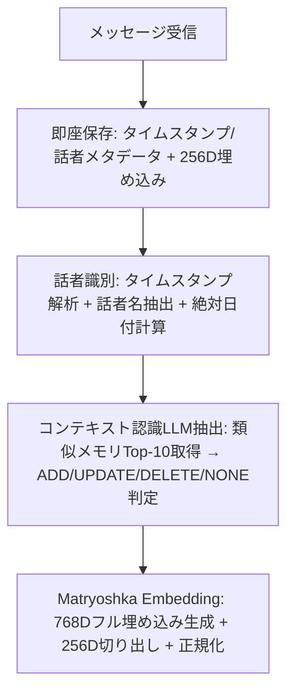
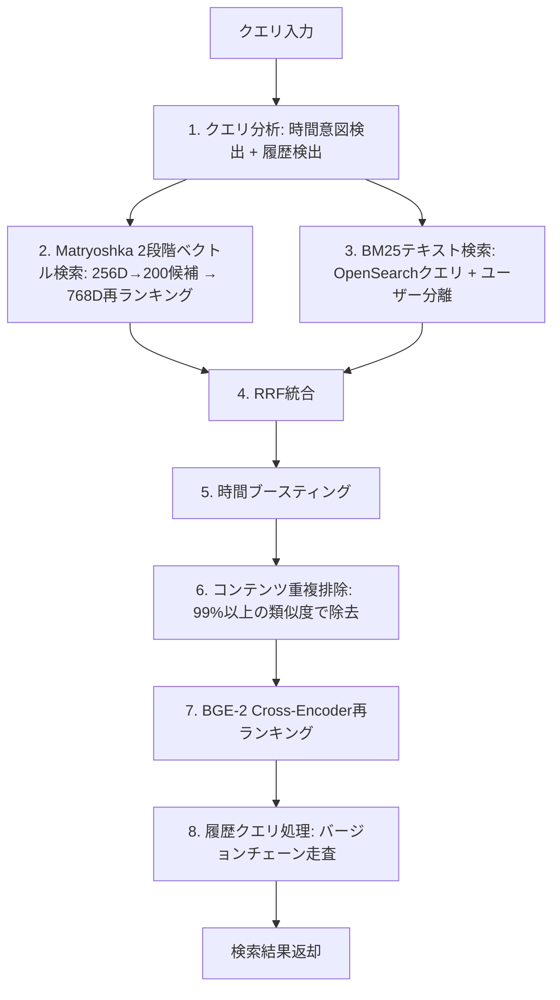
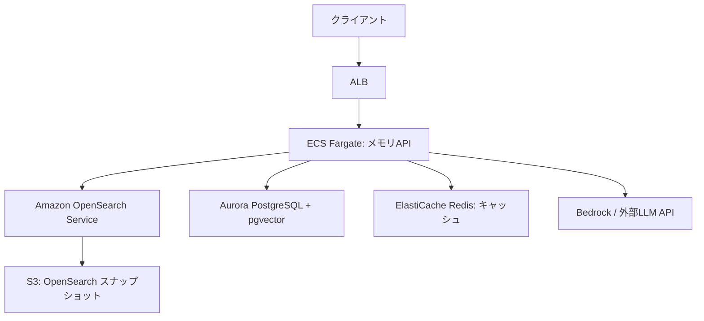

## 論文概要

Cognis は、会話AIエージェント向けのコンテキスト認識型メモリシステムである。OpenSearch BM25 キーワード検索と Matryoshka Embedding によるベクトル検索を Reciprocal Rank Fusion（RRF）で統合した Dual-Store バックエンドを核に、時間ブースティングや BGE-2 Cross-Encoder 再ランキングを含む 8 段階の検索パイプラインを構築している。著者らは LoCoMo ベンチマークで Single-Hop F1 +25.7%、LongMemEval で全体精度 89.2% を報告しており、既存手法（Mem0, Zep, SuperMemory）に対する改善を示している。

本記事は [https://arxiv.org/abs/2604.19771](https://arxiv.org/abs/2604.19771) の解説記事です。

## 情報源

| 項目 | 内容 |
|------|------|
| タイトル | Cognis: Context-Aware Memory for Conversational AI Agents |
| 著者 | Parshva Daftari, Khush Patel, Shreyas Kapale, Jithin George, Siva Surendira (Lyzr Research) |
| 公開日 | 2026年3月27日 |
| arXiv ID | 2604.19771 |
| カテゴリ | cs.AI |
| URL | [https://arxiv.org/abs/2604.19771](https://arxiv.org/abs/2604.19771) |

関連 Zenn 記事: [LangGraph永続メモリでCSエージェントの長期文脈保持と応答精度を改善する](https://zenn.dev/0h_n0/articles/5b6f9454f72459)

## 背景と動機

大規模言語モデル（LLM）を用いた会話AIエージェントは、コンテキストウィンドウの制約により長期的な文脈保持が困難である。ユーザーが過去の会話で言及した情報（個人的な好み、約束の日時、技術的な要件など）を正確に想起・活用するには、LLM の内部パラメータだけでは不十分であり、外部メモリシステムが必要になる。

既存のメモリシステムには以下の課題がある:

- **キーワード検索のみ（BM25）**: 同義語や言い換えへの対応が弱い
- **ベクトル検索のみ**: 固有名詞や数値の正確なマッチングに弱い
- **時間的コンテキストの欠如**: 「先週の会議」「来月の予定」のような時間参照を解決できない
- **メモリの更新管理**: 古い情報と新しい情報の整合性が取れない

Cognis はこれらの課題に対し、BM25 とベクトル検索の Dual-Store、時間ブースティング、Git ライクなバージョン管理を統合的に解決するアーキテクチャを提案している。

## 主要な貢献

著者らが報告している主要な貢献は以下の通りである:

1. **Dual-Store バックエンド**: OpenSearch BM25 と Matryoshka Embedding（768D + 256D）を RRF で統合し、キーワード・意味両面の検索を実現
2. **コンテキスト認識型取り込みパイプライン**: 既存メモリとの重複検知を含む 4 段階のメモリ取り込み処理
3. **8 段階検索パイプライン**: 時間ブースティング、重複排除、Cross-Encoder 再ランキングを含む多段階検索
4. **15 のセマンティックカテゴリ**: メモリの構造化分類（個人情報、専門スキル、健康、嗜好など）
5. **Git ライクなバージョン管理**: `is_current` フラグと `replaces_id` リンクによるメモリの履歴追跡
6. **2 つの永続スコープ**: USER（セッション横断）と CONTEXT（セッション内）の使い分け

## 技術的詳細

### Dual-Store アーキテクチャ

Cognis は OpenSearch 上に BM25 キーワード検索と Matryoshka Embedding ベクトル検索の 2 つの検索パスを構築している。

**Matryoshka Embedding の 2 段階戦略**: 768 次元のフル埋め込みから先頭 256 次元を切り出し、高速な候補絞り込みに使用する。

$$
e_{256} = e_{768}[0:256]
$$

$$
\hat{e}_{256} = \frac{e_{256}}{\|e_{256}\|_2}
$$

256D での候補絞り込みは 5-10ms、768D での再ランキングは 10-20ms で完了し、著者らは p50 レイテンシの 44% 削減を報告している。

### コンテキスト認識型取り込みパイプライン

メモリの取り込みは以下の 4 段階で行われる。



ステップ 3 が Cognis の核心であり、新メッセージの埋め込みから既存メモリ Top-10 を検索し、LLM が ADD（新規追加）、UPDATE（既存更新）、DELETE（削除）、NONE（操作なし）のいずれかを判定する。これにより、「東京に住んでいます」→「大阪に引っ越しました」のような情報の更新を自動的に処理できる。

**15 のセマンティックカテゴリ**: Personal details, Professional, Health, Relationships, Preferences, Hobbies, Goals, Financial, Educational, Travel, Emotional, Technical skills, Dietary, Behavioral patterns, Communication style

### 8 段階検索パイプライン



### RRF（Reciprocal Rank Fusion）

ベクトル検索と BM25 の結果を以下の RRF 式で統合する:

$$
\text{RRF}(d) = \sum_{r \in R} \frac{1}{k + \text{rank}_r(d)}
$$

ここで $$k = 10$$ である。最終的なスコアはベクトル検索と BM25 の重み付きRRF統合となる:

$$
\text{score}_{\text{fused}} = 0.70 \cdot \text{RRF}_{\text{vector}} + 0.30 \cdot \text{RRF}_{\text{BM25}}
$$

著者らは 70/30 のベクトル/BM25 重み配分が Multi-hop および Temporal タスクに対して最適であると報告している。

### 時間ブースティング

時間参照を含むクエリに対し、以下の時間スコアでブースティングを行う:

$$
\text{temporal\_score} = \max\left(0.1,\ 1 - \frac{|t_{\text{event}} - t_{\text{query}}|}{\text{window\_days}}\right)
$$

$$
\text{score}_{\text{final}} = 0.60 \cdot \text{score}_{\text{fused}} + 0.40 \cdot \text{temporal\_score}
$$

時間的に近いイベントほど高スコアとなり、最低スコア 0.1 により完全な除外は防がれる。著者らはこの時間ブースティングにより Temporal タスクで +21.6% の F1 改善を報告している。

## 実装のポイント

### OpenSearch の選択理由

著者らは MongoDB から OpenSearch への移行により Open-Domain Judge で +20.3% の改善を報告している。OpenSearch は BM25 とベクトル検索の両方をネイティブにサポートしており、別々のシステム（例: Elasticsearch + Pinecone）を統合する必要がない。

### Matryoshka Embedding の実用的利点

768D の埋め込みを学習後に 256D に切り出せるため、2 つの異なる埋め込みモデルを管理する必要がない。保存時に 768D を格納し、高速検索時に先頭 256D を使用するだけで 2 段階検索が実現できる。

### バージョン管理の設計

Git ライクなメモリバージョン管理では、更新時に旧メモリの `is_current` フラグを `false` に設定し、新メモリに `replaces_id` で旧メモリへのリンクを保持する。これにより「以前はどう言っていたか」という履歴クエリにも対応できる。

### ユーザー分離

マルチテナント環境では、全検索クエリにユーザー ID フィルタを適用し、他ユーザーのメモリが検索結果に混入しないことを保証する。

## Production Deployment Guide

Cognis のアーキテクチャを実運用環境に展開する際の AWS パターンを示す。ここでは OpenSearch + pgvector を用いたメモリ検索システムの構築を対象とする。

### アーキテクチャ概要



Cognis の Dual-Store を AWS で実現するには、BM25 検索に Amazon OpenSearch Service、ベクトル検索に OpenSearch の k-NN プラグインまたは Aurora PostgreSQL の pgvector 拡張を使う 2 つのパターンがある。以下ではそれぞれの特性を示す。

### パターン A: OpenSearch 統合型

BM25 とベクトル検索の両方を OpenSearch に集約するパターン。Cognis 論文の構成に最も近い。

**Terraform 構成例（OpenSearch ドメイン）**:

```hcl
resource "aws_opensearch_domain" "cognis_memory" {
  domain_name    = "cognis-memory"
  engine_version = "OpenSearch_2.13"

  cluster_config {
    instance_type          = "r6g.large.search"
    instance_count         = 3
    zone_awareness_enabled = true

    zone_awareness_config {
      availability_zone_count = 3
    }
  }

  ebs_options {
    ebs_enabled = true
    volume_size = 100
    volume_type = "gp3"
    throughput  = 250
    iops       = 3000
  }

  encrypt_at_rest {
    enabled = true
  }

  node_to_node_encryption {
    enabled = true
  }

  domain_endpoint_options {
    enforce_https       = true
    tls_security_policy = "Policy-Min-TLS-1-2-PF-2023-10"
  }

  auto_tune_options {
    desired_state = "ENABLED"
  }

  tags = {
    Environment = "production"
    Service     = "cognis-memory"
  }
}
```

**OpenSearch インデックスマッピング**:

```json
{
  "mappings": {
    "properties": {
      "user_id": { "type": "keyword" },
      "content": { "type": "text", "analyzer": "standard" },
      "category": { "type": "keyword" },
      "scope": { "type": "keyword" },
      "is_current": { "type": "boolean" },
      "replaces_id": { "type": "keyword" },
      "timestamp": { "type": "date" },
      "event_time": { "type": "date" },
      "speaker": { "type": "keyword" },
      "embedding_768d": {
        "type": "knn_vector",
        "dimension": 768,
        "method": {
          "name": "hnsw",
          "space_type": "cosinesimil",
          "engine": "nmslib",
          "parameters": {
            "ef_construction": 256,
            "m": 16
          }
        }
      },
      "embedding_256d": {
        "type": "knn_vector",
        "dimension": 256,
        "method": {
          "name": "hnsw",
          "space_type": "cosinesimil",
          "engine": "nmslib",
          "parameters": {
            "ef_construction": 128,
            "m": 16
          }
        }
      }
    }
  }
}
```

### パターン B: OpenSearch + pgvector 分離型

BM25 を OpenSearch、ベクトル検索とメタデータ管理を Aurora PostgreSQL + pgvector に分離するパターン。RDBMS のトランザクション保証が必要な場合に適している。

**Terraform 構成例（Aurora PostgreSQL）**:

```hcl
resource "aws_rds_cluster" "cognis_pg" {
  cluster_identifier     = "cognis-memory-pg"
  engine                 = "aurora-postgresql"
  engine_version         = "16.4"
  master_username        = "cognis_admin"
  manage_master_user_password = true
  database_name          = "cognis"
  storage_encrypted      = true
  deletion_protection    = true

  serverlessv2_scaling_configuration {
    min_capacity = 0.5
    max_capacity = 16
  }

  tags = {
    Environment = "production"
    Service     = "cognis-memory"
  }
}

resource "aws_rds_cluster_instance" "cognis_pg_instances" {
  count              = 2
  identifier         = "cognis-memory-pg-${count.index}"
  cluster_identifier = aws_rds_cluster.cognis_pg.id
  instance_class     = "db.serverless"
  engine             = aws_rds_cluster.cognis_pg.engine
  engine_version     = aws_rds_cluster.cognis_pg.engine_version
}
```

**pgvector テーブル設計**:

```sql
CREATE EXTENSION IF NOT EXISTS vector;

CREATE TABLE memories (
    id UUID PRIMARY KEY DEFAULT gen_random_uuid(),
    user_id UUID NOT NULL,
    content TEXT NOT NULL,
    category VARCHAR(50) NOT NULL,
    scope VARCHAR(10) NOT NULL CHECK (scope IN ('USER', 'CONTEXT')),
    is_current BOOLEAN DEFAULT TRUE,
    replaces_id UUID REFERENCES memories(id),
    speaker VARCHAR(100),
    event_time TIMESTAMPTZ,
    created_at TIMESTAMPTZ DEFAULT NOW(),
    embedding_768d vector(768),
    embedding_256d vector(256)
);

-- 256D での高速候補絞り込み用 HNSW インデックス
CREATE INDEX idx_memories_embedding_256d
    ON memories USING hnsw (embedding_256d vector_cosine_ops)
    WITH (m = 16, ef_construction = 128);

-- 768D での再ランキング用 HNSW インデックス
CREATE INDEX idx_memories_embedding_768d
    ON memories USING hnsw (embedding_768d vector_cosine_ops)
    WITH (m = 16, ef_construction = 256);

-- ユーザー分離 + 現在メモリフィルタ
CREATE INDEX idx_memories_user_current
    ON memories (user_id, is_current)
    WHERE is_current = TRUE;

-- バージョンチェーン走査用
CREATE INDEX idx_memories_replaces
    ON memories (replaces_id)
    WHERE replaces_id IS NOT NULL;
```

### ECS Fargate サービス構成

メモリ API を ECS Fargate で動かす構成例を示す。

```hcl
resource "aws_ecs_service" "cognis_api" {
  name            = "cognis-memory-api"
  cluster         = aws_ecs_cluster.main.id
  task_definition = aws_ecs_task_definition.cognis_api.arn
  desired_count   = 2
  launch_type     = "FARGATE"

  network_configuration {
    subnets         = var.private_subnet_ids
    security_groups = [aws_security_group.cognis_api.id]
  }

  load_balancer {
    target_group_arn = aws_lb_target_group.cognis_api.arn
    container_name   = "cognis-api"
    container_port   = 8080
  }

  deployment_circuit_breaker {
    enable   = true
    rollback = true
  }
}

resource "aws_ecs_task_definition" "cognis_api" {
  family                   = "cognis-memory-api"
  network_mode             = "awsvpc"
  requires_compatibilities = ["FARGATE"]
  cpu                      = "1024"
  memory                   = "2048"
  execution_role_arn       = aws_iam_role.ecs_execution.arn
  task_role_arn            = aws_iam_role.cognis_task.arn

  container_definitions = jsonencode([
    {
      name  = "cognis-api"
      image = "${aws_ecr_repository.cognis.repository_url}:latest"
      portMappings = [
        { containerPort = 8080, protocol = "tcp" }
      ]
      environment = [
        { name = "OPENSEARCH_ENDPOINT", value = aws_opensearch_domain.cognis_memory.endpoint },
        { name = "REDIS_ENDPOINT", value = aws_elasticache_replication_group.cognis.primary_endpoint_address }
      ]
      secrets = [
        { name = "DB_CONNECTION_STRING", valueFrom = aws_secretsmanager_secret.db_conn.arn }
      ]
      logConfiguration = {
        logDriver = "awslogs"
        options = {
          "awslogs-group"         = "/ecs/cognis-memory-api"
          "awslogs-region"        = var.aws_region
          "awslogs-stream-prefix" = "ecs"
        }
      }
    }
  ])
}
```

### モニタリングとアラート

Cognis 論文で報告されているレイテンシ目標（p50: 250ms, p95: 451ms, p99: 770ms）をモニタリングする構成を示す。

**CloudWatch アラーム**:

```hcl
resource "aws_cloudwatch_metric_alarm" "retrieval_p95_latency" {
  alarm_name          = "cognis-retrieval-p95-latency"
  comparison_operator = "GreaterThanThreshold"
  evaluation_periods  = 3
  metric_name         = "RetrievalLatencyP95"
  namespace           = "Cognis/Memory"
  period              = 300
  statistic           = "Average"
  threshold           = 500
  alarm_description   = "検索パイプライン p95 レイテンシが 500ms を超過"
  alarm_actions       = [aws_sns_topic.alerts.arn]
}

resource "aws_cloudwatch_metric_alarm" "opensearch_cpu" {
  alarm_name          = "cognis-opensearch-cpu"
  comparison_operator = "GreaterThanThreshold"
  evaluation_periods  = 2
  metric_name         = "CPUUtilization"
  namespace           = "AWS/ES"
  period              = 300
  statistic           = "Average"
  threshold           = 80
  alarm_description   = "OpenSearch CPU 使用率が 80% を超過"
  alarm_actions       = [aws_sns_topic.alerts.arn]

  dimensions = {
    DomainName = aws_opensearch_domain.cognis_memory.domain_name
    ClientId   = data.aws_caller_identity.current.account_id
  }
}
```

**アプリケーションメトリクス設計**:

構造化ログとして以下のメトリクスを出力し、CloudWatch Logs Insights で分析する:

```json
{
  "event": "memory_retrieval",
  "level": "INFO",
  "ts": "2026-07-08T11:00:00Z",
  "request_id": "req-abc123",
  "user_id": "user-xyz",
  "duration_ms": 245,
  "stage_durations": {
    "query_analysis_ms": 15,
    "vector_256d_ms": 8,
    "vector_768d_ms": 18,
    "bm25_ms": 12,
    "rrf_fusion_ms": 2,
    "temporal_boost_ms": 1,
    "dedup_ms": 3,
    "cross_encoder_ms": 180,
    "version_chain_ms": 6
  },
  "candidates_256d": 200,
  "candidates_768d": 50,
  "results_final": 5,
  "temporal_query": true
}
```

### コスト見積りチェックリスト

| リソース | 構成 | 月額目安 (USD) |
|---------|------|--------------|
| OpenSearch (r6g.large x3) | 3AZ, 100GB gp3 | ~$600 |
| Aurora PostgreSQL Serverless v2 | 0.5-16 ACU, 2 インスタンス | ~$200-800 |
| ECS Fargate (1vCPU, 2GB x2) | 常時稼働 | ~$120 |
| ElastiCache Redis (r6g.large) | 1 ノード | ~$200 |
| CloudWatch Logs | 10GB/月 | ~$5 |
| **合計** | | **~$1,125-1,725** |

コスト最適化の観点では以下を検討する:

- **OpenSearch**: Reserved Instance（1年）で約 30% 削減
- **Aurora**: Serverless v2 の min_capacity を低く設定し、オフピーク時のコストを削減
- **Cross-Encoder**: BGE-2 の推論が全体レイテンシの 70% 以上を占めるため、SageMaker Inference Endpoint に分離してスケーリングを独立させることを検討
- **キャッシュ戦略**: 同一ユーザーの短時間内の類似クエリを Redis でキャッシュし、OpenSearch/LLM 呼び出しを削減

## 実験結果

### LoCoMo ベンチマーク

著者らは LoCoMo ベンチマークで以下の結果を報告している:

| タスク種別 | Cognis F1 | 改善幅 |
|-----------|-----------|--------|
| Single-Hop | 48.66 | +25.7% vs Mem0 |
| Multi-Hop | 31.51 | +10.0% vs Mem0 |
| Open-Domain | 54.77 | +10.5% vs Zep |
| Temporal | 62.68 | +21.6% vs Mem0g |

Single-Hop での +25.7% の改善は、Dual-Store と RRF の統合による直接的な効果と考えられる。Temporal での +21.6% は時間ブースティング機構の寄与が大きい。

### LongMemEval ベンチマーク

500 問からなる LongMemEval での結果は以下の通りである:

| 指標 | Cognis |
|------|--------|
| 全体精度 | 89.2% |
| Claude Opus 4.6 使用時 | 92.4% |
| vs SuperMemory | +10.8pp |
| vs Zep/Graphiti | +21.2pp |

### レイテンシ

| パーセンタイル | レイテンシ |
|--------------|----------|
| p50 | 250ms |
| p95 | 451ms |
| p99 | 770ms |

### アブレーション結果

著者らが報告している主要なアブレーション結果:

- **OpenSearch BM25**: MongoDB 比で Open-Domain Judge +20.3%
- **RRF 重み 70/30（vector/BM25）**: Multi-hop と Temporal で最適
- **Matryoshka 2 段階検索**: p50 レイテンシ 44% 削減
- **BGE-2 Cross-Encoder**: Multi-hop F1 +11.1%

## 実運用への応用

Cognis のアーキテクチャは以下のユースケースに応用できる:

**カスタマーサポートエージェント**: 顧客の過去の問い合わせ履歴、契約プラン、障害対応状況をメモリとして保持し、セッションを跨いだ一貫した対応を実現する。15 のセマンティックカテゴリのうち、Preferences / Communication style / Behavioral patterns が特に有用である。

**パーソナルアシスタント**: ユーザーの予定、好み、行動パターンを USER スコープで永続化し、「先週の会議で決まった件」のような時間参照クエリにも対応する。

**教育・コーチングAI**: 学習者の理解度、弱点、学習履歴を追跡し、セッション毎にリセットされない継続的な指導を行う。

**設計上の留意点**:
- 15 カテゴリの分類粒度がドメインに適合するか検証が必要
- LLM による ADD/UPDATE/DELETE 判定のコスト（取り込み時に LLM 呼び出しが発生）
- Cross-Encoder 再ランキングがレイテンシの支配要因（全体の 70% 以上）であるため、リアルタイム性の要件に応じた取捨選択

## 関連研究

Cognis が比較対象としている既存手法を整理する:

- **Mem0**: メモリ管理フレームワーク。Cognis は Single-Hop で +25.7%、Temporal で +21.6% の改善を報告
- **Zep / Graphiti**: グラフベースのメモリシステム。LongMemEval で Cognis が +21.2pp の改善を報告
- **SuperMemory**: LongMemEval で Cognis が +10.8pp の改善を報告
- **MemGPT (Letta)**: 階層的メモリ管理。Cognis とは異なり OS のページングに着想を得たアプローチ
- **RAG ベースのアプローチ**: 一般的な検索拡張生成。Cognis はメモリの動的更新（ADD/UPDATE/DELETE）を加えた点が差別化要素

## まとめと今後の展望

Cognis は、BM25 + ベクトル検索の Dual-Store、RRF 統合、時間ブースティング、Cross-Encoder 再ランキングを組み合わせた 8 段階検索パイプラインにより、LoCoMo および LongMemEval の両ベンチマークで既存手法を上回る結果を報告している。特に時間参照を含むクエリでの改善幅が大きく（Temporal F1 +21.6%）、実用的な会話AIシステムにおけるメモリ管理の有効なアプローチを示している。

今後の検討事項として、Cross-Encoder によるレイテンシ増加の最適化、ドメイン固有のカテゴリ設計、マルチモーダルメモリへの拡張、そして取り込み時の LLM コスト削減が挙げられる。

## 参考文献

1. Daftari, P., Patel, K., Kapale, S., George, J., & Surendira, S. (2026). Cognis: Context-Aware Memory for Conversational AI Agents. arXiv:2604.19771. [https://arxiv.org/abs/2604.19771](https://arxiv.org/abs/2604.19771)
2. LoCoMo Benchmark — 長期会話メモリの評価ベンチマーク
3. LongMemEval — 長期メモリ評価データセット（500問）
4. Robertson, S. E., & Zaragoza, H. (2009). The Probabilistic Relevance Framework: BM25 and Beyond. Foundations and Trends in Information Retrieval.
5. Kuśmierczyk, T., et al. (2024). Matryoshka Representation Learning. ICLR 2024.
6. Cormack, G. V., Clarke, C. L., & Buettcher, S. (2009). Reciprocal Rank Fusion outperforms Condorcet and individual Rank Learning Methods. SIGIR 2009.
