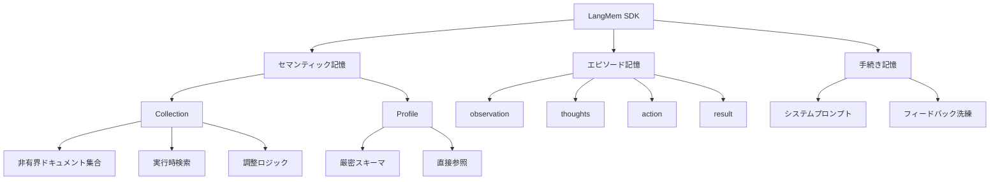
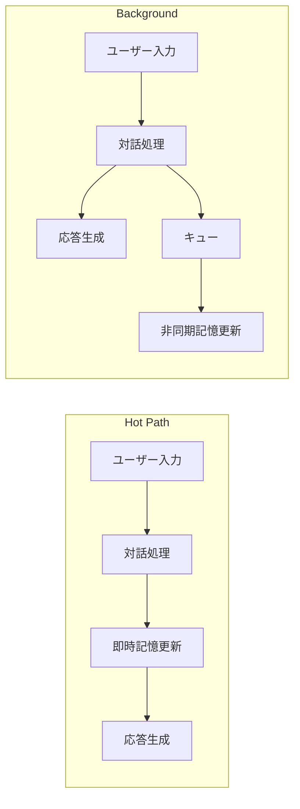
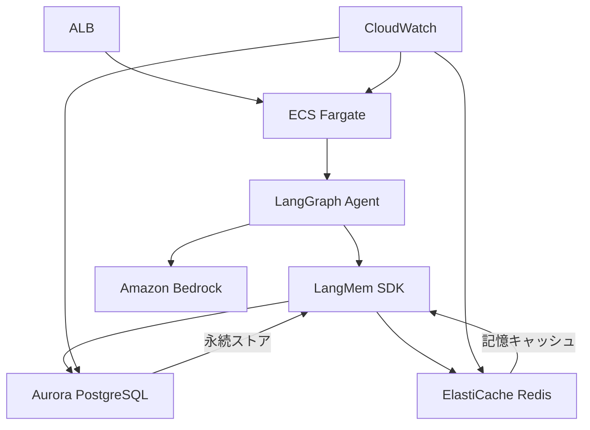

本記事は [https://www.langchain.com/blog/langmem-sdk-launch](https://www.langchain.com/blog/langmem-sdk-launch) の解説記事です。本記事は引用・解説であり、独自の実験は行っていません。

## 1. ブログ概要

LangChainが2025年2月に公開したLangMem SDKは、AIエージェントに長期記憶を付与するためのライブラリである。人間の記憶モデルを参考に、**セマンティック記憶（事実・知識）**、**エピソード記憶（過去の経験）**、**手続き記憶（行動ルール）** の3種類を定義し、エージェントが対話を通じて学習・改善する仕組みを提供している。LangGraphの永続ストア層（BaseStore）とネイティブ統合されており、階層的な名前空間で記憶を整理できる。LangChainのブログによれば、2026年6月時点でPyPI月間ダウンロード数は約74.6万、累計ダウンロード数は500万以上に達している。

## 2. 情報源

| 項目 | 内容 |
|------|------|
| 種別 | 企業テックブログ |
| 発行元 | LangChain |
| タイトル | LangMem SDK for agent long-term memory |
| URL | [https://www.langchain.com/blog/langmem-sdk-launch](https://www.langchain.com/blog/langmem-sdk-launch) |
| 公開日 | 2025年2月18日 |
| 関連Zenn記事 | [LangGraph永続メモリでCSエージェントの長期文脈保持と応答精度を改善する](https://zenn.dev/0h_n0/articles/5b6f9454f72459) |

## 3. 技術的背景

LLMベースのエージェントは、原理的にステートレスな推論エンジンである。各リクエストにおいてコンテキストウィンドウに収まる情報のみを参照するため、過去の対話で得た知識や学習結果を蓄積・再利用することが困難であった。

この制約に対処するため、エージェントフレームワークではRAG（Retrieval-Augmented Generation）パターンが広く使われてきた。しかしRAGは主に静的な外部文書の検索を目的としており、エージェント自身が対話を通じて獲得した知識を体系的に管理する仕組みとしては不十分である。

心理学において、人間の長期記憶は大きく3つに分類される。宣言的知識を扱う **意味記憶（semantic memory）**、個人的な経験を保持する **エピソード記憶（episodic memory）**、手順やスキルを司る **手続き記憶（procedural memory）** である。LangMem SDKはこの分類を計算モデルとして採用し、エージェントの長期記憶を構造化している。LangGraphのBaseStoreとの統合により、状態管理と記憶管理を統一的に扱える設計となっている点が特徴である。

## 4. 実装アーキテクチャ

### 4.1 3種メモリの構造

LangMem SDKにおける3種類の記憶は、それぞれ異なる表現方式と用途を持つ。

**セマンティック記憶** は、エージェントの応答を裏付ける事実や知識を格納する。2つの表現方式がある。**Collection（コレクション）** は非有界のドキュメント集合であり、実行時に検索して取得する。新しい情報と既存の信念の間で、削除・更新・統合といった調整ロジック（reconciliation logic）が必要となる。一方、**Profile（プロファイル）** はタスク固有の厳密なスキーマに従う構造化データであり、ユーザーの好みや設定など、検索不要で直接参照できる情報を保持する。

**エピソード記憶** は、成功した対話を学習例として保存する。各エピソードは `observation`（状況）、`thoughts`（思考プロセス）、`action`（行動）、`result`（結果）の4フィールドで構造化される。ただしLangChainのブログでは、「LangMem doesn't yet support opinionated utilities for episodic memory」と明記されており、2025年2月のリリース時点ではエピソード記憶に対する高レベルAPIは未整備である。

**手続き記憶** は、エージェントの行動ルールや応答パターンをシステムプロンプトとして符号化する。初期値としてシステムプロンプトが設定され、対話経験やフィードバックを通じて段階的に洗練される。



### 4.2 Memory Manager API

LangMem SDKは、記憶の管理に関する主要なファクトリ関数を4つ提供している。

```python
from langmem import (
    create_memory_manager,
    create_memory_store_manager,
    create_manage_memory_tool,
    create_search_memory_tool,
)
from langgraph.store.base import BaseStore


def setup_memory_system(store: BaseStore, user_id: str) -> dict:
    """LangMem SDKの記憶管理システムを構築する。

    Args:
        store: LangGraphのBaseStoreインスタンス。
        user_id: 記憶を紐付けるユーザーID。

    Returns:
        記憶管理コンポーネントの辞書。
    """
    # 記憶の抽出・更新・削除・統合を行うマネージャ
    memory_manager = create_memory_manager(
        "gpt-4o",
        instructions="Extract key facts about the user.",
    )

    # 抽出した記憶をストアに永続化するマネージャ
    store_manager = create_memory_store_manager(
        "gpt-4o",
        store=store,
        namespace=(user_id, "semantic"),
    )

    # エージェントに記憶の直接操作権限を与えるツール
    manage_tool = create_manage_memory_tool(
        namespace=(user_id, "semantic"),
    )

    # 長期記憶を検索するツール
    search_tool = create_search_memory_tool(
        namespace=(user_id, "semantic"),
    )

    return {
        "memory_manager": memory_manager,
        "store_manager": store_manager,
        "manage_tool": manage_tool,
        "search_tool": search_tool,
    }
```

`create_memory_manager` は記憶の抽出・更新・削除・統合を担い、`create_memory_store_manager` は抽出結果をストレージに永続化する。`create_manage_memory_tool` と `create_search_memory_tool` はそれぞれ、エージェントが記憶を直接操作・検索するためのツールとして機能する。

### 4.3 記憶形成パターン

LangMem SDKは、記憶が形成されるタイミングについて2つのパターンを提供している。



**Hot Path（意識的形成）** は、対話中にリアルタイムで記憶を形成する方式である。重要なコンテキストの即時反映に適しているが、記憶処理のオーバーヘッドにより応答レイテンシが増加する。

**Background（無意識的形成）** は、対話の終了後に非同期で記憶処理を行う方式である。対話のパターンを後から分析できるため、より高い再現率（recall）が期待できる。応答速度に影響を与えないため、多くのユースケースで推奨される。

### 4.4 名前空間による記憶の階層管理

LangGraphのBaseStoreは、タプル形式の名前空間（namespace）を用いて記憶を階層的に整理する。この設計により、ユーザー・テナント・タスクなど複数の軸で記憶を分離・管理できる。

```python
from langgraph.store.memory import InMemoryStore


def demonstrate_namespace_hierarchy() -> None:
    """名前空間による記憶の階層管理を示す。"""
    store = InMemoryStore()

    # ユーザー単位のセマンティック記憶
    store.put(
        namespace=("user_123", "semantic"),
        key="pref_lang",
        value={"content": "Pythonを好む", "type": "preference"},
    )

    # テナント単位の手続き記憶
    store.put(
        namespace=("tenant_abc", "procedural"),
        key="tone_rule",
        value={"content": "丁寧語で応答する", "type": "rule"},
    )

    # 検索時は名前空間でスコープを限定
    user_memories = store.search(
        namespace=("user_123", "semantic"),
        query="programming language",
    )
```

テンプレート変数による実行時の名前空間構成も可能であり、マルチテナントのプロダクション環境においても柔軟に対応できる。

## 5. パフォーマンス最適化

### 5.1 プロンプト最適化

LangMem SDKは `create_prompt_optimizer` 関数を通じて、対話のトラジェクトリ（軌跡）とフィードバックに基づくシステムプロンプトの自動改善機能を提供している。

```python
from langmem import create_prompt_optimizer


def optimize_agent_prompt(
    current_prompt: str,
    trajectories: list[dict],
) -> str:
    """対話トラジェクトリに基づきプロンプトを最適化する。

    Args:
        current_prompt: 現在のシステムプロンプト。
        trajectories: フィードバック付き対話履歴のリスト。

    Returns:
        最適化されたシステムプロンプト。
    """
    optimizer = create_prompt_optimizer(
        "gpt-4o",
        kind="metaprompt",  # "gradient", "prompt_memory" も選択可
    )

    optimized = optimizer.invoke(
        {
            "prompt": current_prompt,
            "trajectories": trajectories,
        }
    )
    return optimized
```

最適化アルゴリズムとして、`metaprompt`（メタプロンプトによる自己改善）、`gradient`（勾配的なプロンプト修正）、`prompt_memory`（記憶ベースのプロンプト蓄積）の3種が用意されている。リフレクションステップの回数も設定可能であり、精度とコストのトレードオフを制御できる。

### 5.2 記憶のライフサイクル管理

セマンティック記憶のCollection表現では、新しい情報と既存の記憶が矛盾する場合の調整が不可欠である。LangMem SDKのMemory Managerは以下の操作を自動的に判断する。

- **挿入（insert）**: 既存の記憶と重複しない新規事実の追加
- **更新（update）**: 既存の記憶を新しい情報で上書き
- **削除（delete）**: 古くなった情報や矛盾する情報の除去
- **統合（consolidate）**: 複数の断片的な記憶を一つに集約

この調整ロジックにより、記憶の無秩序な膨張を防ぎつつ、情報の鮮度を維持できる。Background形成パターンと組み合わせることで、応答レイテンシへの影響を最小化しながら記憶の品質を保つ設計となっている。

## 6. 運用での学び

### 6.1 記憶形成パターンの使い分け

実運用においては、Hot PathとBackgroundの選択がユーザー体験に直結する。LangChainのブログでは、Background形成パターンの方が高い再現率を示すと報告している。対話中のリアルタイム処理は応答に「perceivable latency（知覚可能な遅延）」を加えるため、即時反映が不可欠なケース（例：ユーザーが明示的に「これを覚えて」と要求した場合）に限定し、その他の記憶形成はBackgroundに委ねるのが実用的である。

### 6.2 スキーマ設計の重要性

Profile型のセマンティック記憶では、タスク固有の厳密なスキーマを定義する必要がある。スキーマが曖昧であると、記憶の検索精度が低下し、プロンプトへの注入時にノイズとなる。構造化された記憶スキーマの設計は、RAGにおけるチャンキング戦略と同様に、システム全体の品質を左右する要素である。

### 6.3 名前空間の設計指針

マルチテナント環境では、名前空間の粒度設計が記憶の分離性とアクセス効率に影響する。LangGraphのBaseStoreはタプル形式の名前空間を採用しており、`(tenant_id, user_id, memory_type)` のような階層でデータを整理できる。適切な名前空間設計により、テナント間の記憶が混在するリスクを防止しつつ、クロスユーザーの共有記憶（組織レベルの手続き記憶など）も柔軟に実現できる。

## 7. 学術研究との関連

LangMem SDKの3種記憶モデルは、Tulvingが提唱した人間の長期記憶の分類体系（意味記憶・エピソード記憶・手続き記憶）に基づいている（Tulving, 1972）。この心理学的モデルをLLMエージェントに適用する試みは近年活発であり、MemGPT（Packer et al., 2023）は仮想コンテキスト管理による長期記憶を、Generative Agents（Park et al., 2023）は記憶ストリームとリフレクションによるエージェントの自律的行動を報告している。

LangMem SDKはこれらの研究と異なり、プロダクション環境での利用を前提とした永続ストア統合とマルチテナント対応を設計の中心に据えている。学術的なプロトタイプから実用可能なSDKへの橋渡しを行う位置づけであり、記憶の調整ロジック（reconciliation）やプロンプト最適化など、運用上の課題に焦点を当てた機能を提供している。

## 8. Production Deployment Guide

本セクションでは、LangMem SDKをAWS環境にデプロイする際のアーキテクチャパターン、Terraformによるインフラ定義、モニタリング、コスト最適化について解説する。なお、AWS料金の見積もりは2026年7月時点の概算であり、リージョンや利用状況により変動する。

### 8.1 AWSアーキテクチャパターン

LangMem SDKを用いたエージェントの本番構成として、以下の3層アーキテクチャを推奨する。



**APIレイヤー**: ALB + ECS FargateでエージェントAPIをホストする。Fargateのタスク定義でメモリ・CPUを制御し、AutoScalingポリシーで負荷に応じたスケーリングを行う。

**記憶ストアレイヤー**: Aurora PostgreSQLを永続ストアとして使用する。LangGraphのBaseStoreインターフェースを通じてアクセスし、名前空間ごとにパーティションを構成する。頻繁にアクセスされるProfile型の記憶はElastiCache Redisにキャッシュし、読み取りレイテンシを低減する。

**LLMレイヤー**: Amazon BedrockまたはSelf-hosted vLLMを利用する。プロンプト最適化やMemory Managerの内部LLM呼び出しにも同一エンドポイントを使用できる。

### 8.2 Terraformによるインフラ定義

以下にコア部分のTerraform定義を示す。VPCモジュールやセキュリティグループは省略し、記憶ストアとコンピューティングの構成に焦点を当てる。Aurora Serverless v2はmin_capacity 0.5 ACUから起動し、アイドル時のコストを抑制する。ECS FargateにはAutoScalingを設定し、CPU使用率60%を閾値にスケーリングする。

```hcl
# langmem_infra.tf — コアリソース抜粋

resource "aws_ecs_task_definition" "agent" {
  family                   = "langmem-agent"
  requires_compatibilities = ["FARGATE"]
  cpu = "1024"; memory = "2048"
}

resource "aws_rds_cluster" "memory_store" {
  cluster_identifier = "langmem-memory-store"
  engine             = "aurora-postgresql"
  engine_version     = "16.1"
  storage_encrypted  = true
  serverlessv2_scaling_configuration {
    min_capacity = 0.5  # アイドル時コスト抑制
    max_capacity = 4.0
  }
}

resource "aws_elasticache_replication_group" "cache" {
  replication_group_id = "langmem-cache"
  node_type = "cache.t4g.micro"
  engine    = "redis"
}
```

### 8.3 モニタリング設計

LangMem SDKの本番運用では、以下の4カテゴリのメトリクスを監視する。記憶管理システムはLLMへの内部呼び出しを伴うため、通常のCRUDアプリケーションとは異なるモニタリング観点が必要となる。

**記憶操作メトリクス**: 記憶の挿入・更新・削除・統合の各操作について、回数と所要時間を構造化ログ（JSON形式、`event`, `operation`, `namespace`, `duration_ms` フィールド）で記録する。特に統合（consolidate）の頻度は記憶肥大化の先行指標となる。

**LLM呼び出しメトリクス**: Memory ManagerやPrompt Optimizerの内部LLM呼び出しについて、入出力トークン数・レイテンシ・推定コストをリクエスト単位で記録する。ユーザーあたりの日次LLMコストをダッシュボードで可視化し、予算超過のアラートを設定する。

**ストアメトリクス**: Aurora PostgreSQLのクエリレイテンシ（p50, p95, p99）、接続数、ストレージ使用量を監視する。

**キャッシュメトリクス**: Redisのヒット率・メモリ使用量・エビクション数を監視し、ヒット率80%未満でTTL見直しを行う。

### 8.4 コスト最適化チェックリスト

LangMem SDKの運用コストは、主にLLM呼び出し、永続ストア、コンピューティングリソースの3要素で構成される。以下に最適化指針を示す。なお、以下の料金は2026年7月時点の概算である。

**LLM呼び出しコストの削減**:
- Background形成パターンを採用し、バッチ処理で記憶更新を集約する
- Prompt Optimizerのリフレクションステップ数を必要最小限に設定する（デフォルトから1-2ステップに削減で40-60%のトークン節約が見込まれる）
- Memory Managerに軽量モデル（Claude 3.5 Haiku等）を使用し、Prompt Optimizerには高性能モデルを使用する二段構成を検討する

**ストアコストの最適化**:
- Aurora Serverless v2のmin_capacityを0.5 ACUに設定し、アイドル時のコストを抑制する（概算: 月額$40-80）
- ElastiCache Redisはcache.t4g.microから開始し、キャッシュヒット率に基づいてスケールアップする（概算: 月額$15-30）
- 古い記憶の定期的なアーカイブまたは削除ポリシーを設定し、ストレージ肥大化を防止する

**コンピューティングコストの削減**:
- ECS FargateのAutoScalingでmin_capacityを1に設定し、深夜帯のコストを最小化する
- Fargate Spotの活用でBackground記憶処理のコストを最大70%削減できる（ただし中断リスクあり）
- ARM64アーキテクチャ（Graviton）の使用で同等性能を約20%低コストで実現する

**月額コスト概算（小規模構成、1000 DAU想定）**:

| コンポーネント | 概算月額（USD） |
|----------------|----------------|
| ECS Fargate（1タスク常時） | $30-50 |
| Aurora Serverless v2（0.5-2 ACU） | $40-80 |
| ElastiCache Redis（t4g.micro） | $15-30 |
| Amazon Bedrock（LLM呼び出し） | $50-200 |
| CloudWatch（ログ・メトリクス） | $10-20 |
| **合計** | **$145-380** |

LLM呼び出しコストは記憶形成パターンの選択と最適化ステップ数に大きく依存するため、初期段階でのメトリクス収集と継続的な調整が不可欠である。

## 9. まとめと実践への示唆

LangMem SDKは、心理学の長期記憶モデルに基づく3種記憶（セマンティック・エピソード・手続き）を体系的に実装したライブラリであり、LangGraphのBaseStoreとの統合によりプロダクション環境での記憶管理を実現する。Hot PathとBackgroundの2つの記憶形成パターン、Memory ManagerのCRUD+統合操作、Prompt Optimizerによる自動改善など、実用的な機能群が揃っている。運用においては、Background形成パターンの優先採用、記憶スキーマの慎重な設計、LLM呼び出しコストのモニタリングが要点となる。関連記事として、[LangGraph永続メモリでCSエージェントの長期文脈保持と応答精度を改善する](https://zenn.dev/0h_n0/articles/5b6f9454f72459)も参照されたい。

## 10. 参考文献

1. LangChain, "LangMem SDK for agent long-term memory," LangChain Blog, Feb. 18, 2025. [https://www.langchain.com/blog/langmem-sdk-launch](https://www.langchain.com/blog/langmem-sdk-launch)
2. LangChain, "LangMem Documentation." [https://langchain-ai.github.io/langmem/](https://langchain-ai.github.io/langmem/)
3. LangChain, "LangGraph Documentation — BaseStore." [https://langchain-ai.github.io/langgraph/](https://langchain-ai.github.io/langgraph/)
4. Tulving, E., "Episodic and Semantic Memory," *Organization of Memory*, Academic Press, 1972.
5. Packer, C., Wooders, S., Lin, K., Fang, V., Patil, S. G., Stoica, I., & Gonzalez, J. E., "MemGPT: Towards LLMs as Operating Systems," arXiv:2310.08560, 2023.
6. Park, J. S., O'Brien, J. C., Cai, C. J., Morris, M. R., Liang, P., & Bernstein, M. S., "Generative Agents: Interactive Simulacra of Human Behavior," arXiv:2304.03442, 2023.
7. 0h-n0, "LangGraph永続メモリでCSエージェントの長期文脈保持と応答精度を改善する," Zenn. [https://zenn.dev/0h_n0/articles/5b6f9454f72459](https://zenn.dev/0h_n0/articles/5b6f9454f72459)
