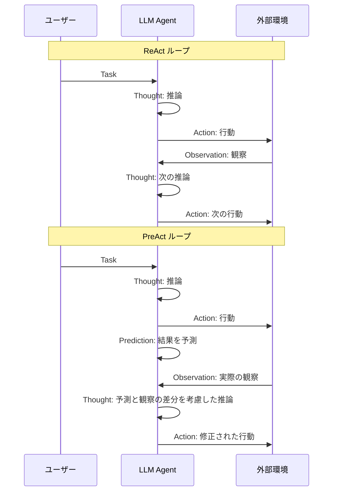

## 論文概要（Abstract）

PreAct（Prediction enhances Agent's planning ability）は、LLMエージェントの推論ループに「予測（Prediction）」ステップを追加することで、計画能力を強化するフレームワークである。従来のReActがThought-Action-Observationの3要素で構成されるのに対し、PreActはActionの結果を事前に予測させることで、予測と実際の観察結果の差分から自己修正的な推論を促す。AgentBenchの4タスク（Householding、Operating System、Database、Lateral Thinking Puzzles）で評価され、特にHouseholdingタスクでReAct比約20%の性能向上を達成したと著者らは報告している。

本記事は [PreAct](https://arxiv.org/abs/2402.11534) の解説記事です。

この記事は [Zenn記事: LLMエージェント推論戦略の選び方：ReAct・ReWOO・Reflexionをタスク別に使い分ける](https://zenn.dev/0h_n0/articles/3d0a1247a810c5) の深掘りです。

## 情報源

- **会議名**: COLING 2025（31st International Conference on Computational Linguistics）
- **開催地**: Abu Dhabi, UAE（2025年1月）
- **URL**: [https://aclanthology.org/2025.coling-main.1/](https://aclanthology.org/2025.coling-main.1/)
- **arXiv**: [https://arxiv.org/abs/2402.11534](https://arxiv.org/abs/2402.11534)
- **著者**: Dayuan Fu, Jianzhao Huang, Siyuan Lu, Guanting Dong, Yejie Wang, Keqing He, Weiran Xu
- **ページ数**: 1-16
- **出版社**: Association for Computational Linguistics

## カンファレンス情報

**COLINGについて**:
COLING（International Conference on Computational Linguistics）は、計算言語学分野における主要な国際会議の一つであり、1965年から続く歴史を持つ。第31回大会（COLING 2025）はアブダビで開催され、自然言語処理（NLP）、計算言語学、言語リソースに関する幅広い研究が発表された。本論文はメイン会議論文として採択されている。

## 背景と動機（Background & Motivation）

### ReActの限界：計画の近視眼性

ReAct（Yao et al., 2023）はThought-Action-Observationの3要素ループにより、LLMエージェントの推論と行動を統合した画期的なフレームワークである。しかし、著者らはReActに以下の構造的な制約があると指摘している。

1. **反応的（Reactive）な計画**: ReActのThoughtは現在の観察結果に基づいて次の行動を決定するため、将来の状態変化を見越した戦略的計画が困難である
2. **推論の多様性不足**: 同じ観察に対して類似のThoughtパターンが繰り返され、探索空間が狭くなる
3. **誤り修正の遅延**: 不適切な行動の結果を観察するまでフィードバックが得られず、自己修正のタイミングが遅れる

著者らは、人間の意思決定プロセスにおいて「行動結果の予測」が計画精度の向上に重要な役割を果たすという認知科学的知見に着目し、この予測メカニズムをLLMエージェントに導入することを提案している。

## 主要な貢献（Key Contributions）

- **貢献1**: ReActのThought-Action-Observationループに「Prediction」ステップを追加し、予測と実際の観察の差分を推論に活用するPreActフレームワークの提案
- **貢献2**: Permanent、Immediate、Reflexion、TOT（Tree of Thoughts）の4種類のメモリ管理戦略を定義し、予測情報の蓄積方法が性能に与える影響を体系的に分析
- **貢献3**: AgentBenchの4タスクでPreActがReActを上回る性能を示し、特にHouseholdingタスクで約20%の改善を達成
- **貢献4**: PreActの推論がReActと比較して多様性（Diversity）と戦略的指向性（Directional Strategy）の両面で優れることを定量的に分析

## 技術的詳細（Technical Details）

### PreActのPrediction-Thought-Action-Observationループ

PreActはReActの方策関数を拡張し、行動（Action）と同時に予測（Prediction）を生成する。形式的には、エージェントの方策は以下のように定義される。

$$
(a_k, p_k) = \pi_{\text{agent}}(o_{k-1}, \mathcal{H}_{k-1})
$$

ここで、
- $a_k$: ステップ$k$における行動
- $p_k$: ステップ$k$における予測（次の観察結果の予測）
- $o_{k-1}$: 前ステップの観察結果
- $\mathcal{H}_{k-1}$: ステップ$k-1$までの履歴
- $\pi_{\text{agent}}$: エージェントの方策関数（LLM）

履歴 $\mathcal{H}$ は以下の系列として管理される。

$$
\mathcal{H}_k = \{o_0, t_1, a_1, p_1, o_1, \ldots, t_k, a_k, p_k, o_k\}
$$

ここで、$t_k$はステップ$k$のThought（推論）、$p_k$はPrediction（予測）である。ReActの履歴 $\{o_0, t_1, a_1, o_1, \ldots\}$ と比較すると、各ステップに$p_k$が追加されている点が本質的な差異である。

### ReActとPreActの構造比較



PreActの核心は、Actionの後にPredictionを挟むことで、LLMに「次に何が起こるか」を明示的に推論させる点にある。Observationが返ってきた際に、事前の予測との差分がThoughtの質を向上させる。

### 予測と推論の相互作用メカニズム

著者らは、予測と観察の差分がもたらす効果を2つの観点から分析している。

**1. 推論の多様性（Diversity）**: 予測を行うことで、エージェントは複数の可能な結果を想定し、それぞれに対応する行動戦略を考えるようになる。これにより、ReActでは到達しなかった解空間の探索が可能となる。

**2. 戦略的指向性（Directional Strategy）**: 予測が外れた場合、エージェントは「なぜ予測が外れたか」を分析し、より正確な方向に計画を修正する。これは人間の学習プロセスにおけるerror-driven learningに類似している。

## アルゴリズム

PreActエージェントの実行ループを以下の擬似コードで示す。

```python
from dataclasses import dataclass, field
from typing import Protocol


@dataclass
class StepRecord:
    """1ステップの記録

    Attributes:
        thought: 推論テキスト
        action: 実行した行動
        prediction: 行動結果の予測
        observation: 実際の観察結果
    """
    thought: str
    action: str
    prediction: str
    observation: str


class LLMClient(Protocol):
    """LLM呼び出しインターフェース"""
    def generate(self, prompt: str) -> str: ...


class Environment(Protocol):
    """外部環境インターフェース"""
    def execute(self, action: str) -> str: ...


@dataclass
class PreActAgent:
    """PreActエージェント

    ReActのThought-Action-Observationループに
    Predictionステップを追加したフレームワーク。

    Args:
        llm: LLMクライアント
        env: 外部環境
        max_steps: 最大ステップ数
        memory_strategy: メモリ戦略 (permanent/immediate/reflexion)
    """
    llm: LLMClient
    env: Environment
    max_steps: int = 10
    memory_strategy: str = "permanent"
    history: list[StepRecord] = field(default_factory=list)

    def run(self, task: str) -> str:
        """タスクを実行し最終回答を返す

        Args:
            task: 入力タスク文字列

        Returns:
            エージェントの最終回答
        """
        context = self._build_initial_context(task)

        for step in range(1, self.max_steps + 1):
            # 1. Thought生成（過去の予測-観察差分を考慮）
            thought = self.llm.generate(
                context + f"\nThought {step}:"
            )
            context += f"\nThought {step}: {thought}"

            # 2. Action生成
            action = self.llm.generate(
                context + f"\nAction {step}:"
            )
            context += f"\nAction {step}: {action}"

            # 3. 終了判定
            if action.startswith("finish["):
                return self._extract_answer(action)

            # 4. Prediction生成（PreActの核心）
            prediction = self.llm.generate(
                context + f"\nPrediction {step}:"
            )
            context += f"\nPrediction {step}: {prediction}"

            # 5. 環境から実際のObservationを取得
            observation = self.env.execute(action)
            context += f"\nObservation {step}: {observation}"

            # 6. 履歴に記録
            record = StepRecord(
                thought=thought,
                action=action,
                prediction=prediction,
                observation=observation,
            )
            self.history.append(record)

            # 7. メモリ戦略に基づくコンテキスト管理
            context = self._apply_memory_strategy(context, task)

        return "Failed to solve within max steps"

    def _apply_memory_strategy(
        self, context: str, task: str
    ) -> str:
        """メモリ戦略に基づきコンテキストを管理する

        Args:
            context: 現在のコンテキスト
            task: 元のタスク

        Returns:
            メモリ戦略適用後のコンテキスト
        """
        if self.memory_strategy == "permanent":
            # 全予測を保持（デフォルト）
            return context
        elif self.memory_strategy == "immediate":
            # 最新の予測のみ保持
            return self._keep_latest_prediction(context)
        elif self.memory_strategy == "reflexion":
            # 失敗時に予測-観察差分を反省文として蓄積
            return self._add_reflexion(context, task)
        else:
            return context

    def _build_initial_context(self, task: str) -> str:
        """初期コンテキストを構築する"""
        return f"Task: {task}"

    def _extract_answer(self, action: str) -> str:
        """finish[answer]からanswerを抽出する"""
        return action[len("finish["):-1]

    def _keep_latest_prediction(self, context: str) -> str:
        """最新の予測のみを保持する"""
        # 実装省略: 過去のPrediction行を除去
        return context

    def _add_reflexion(self, context: str, task: str) -> str:
        """予測-観察差分に基づく反省文を追加する"""
        if not self.history:
            return context
        latest = self.history[-1]
        if latest.prediction != latest.observation:
            reflexion = self.llm.generate(
                f"予測: {latest.prediction}\n"
                f"実際: {latest.observation}\n"
                f"この差分から学んだことを1文で述べよ:"
            )
            context += f"\nReflexion: {reflexion}"
        return context
```

### メモリ管理戦略の詳細

著者らは、予測情報の蓄積方法として4つの戦略を定義している。

| 戦略 | 説明 | 特徴 |
|------|------|------|
| **Permanent** | 全ステップの予測を履歴に保持 | 長期的なパターン学習が可能だが、コンテキスト長が増大 |
| **Immediate** | 直前のステップの予測のみ保持 | コンテキスト効率は良いが、過去の予測パターンを活用できない |
| **Reflexion** | 予測と観察の差分に基づく反省文を蓄積 | Reflexion（Shinn et al., 2023）と組み合わせ |
| **TOT** | 複数の行動-予測ペアを生成し、最適なものを選択 | Tree of Thoughts（Yao et al., 2023b）と組み合わせ |

## 実装のポイント（Implementation）

### 1. Predictionプロンプトの設計

Predictionの品質がPreActの性能を左右する。著者らのリポジトリ（[GitHub](https://github.com/Fu-Dayuan/PreAct)）では、Predictionを生成する際に「次のObservationとして何が返ってくるか」を具体的に記述させるプロンプトを使用している。曖昧な予測（「情報が得られるだろう」）ではなく、具体的な予測（「検索結果にはXの定義が含まれているだろう」）を誘導することが重要である。

### 2. コンテキスト長の管理

Predictionが追加されることで、各ステップのトークン消費が増加する。Permanentメモリ戦略ではステップ数に比例してコンテキストが膨張するため、長いタスクではImmediateメモリ戦略への切り替えやPrediction部分の要約が必要となる。

### 3. Predictionの粒度調整

環境から返るObservationの形式に合わせてPredictionの粒度を調整する必要がある。コーディングタスク（OS、DB）では実行結果の具体的な出力を予測させ、対話的タスク（HH）では状態変化の概要を予測させるなど、タスクに応じた設計が求められる。

### 4. 失敗パターンへの対処

著者らの実験では、GPTのセーフティメカニズムにより回答を拒否されるケースが発生し、特にLateral Thinking Puzzlesタスクで探索ステップ数の減少につながったと報告されている。本番環境では、拒否検出とリトライロジックの実装が不可欠である。

## Production Deployment Guide

### AWS実装パターン（コスト最適化重視）

PreActエージェントをプロダクション環境にデプロイする際のAWS構成を、トラフィック量別に示す。

**トラフィック量別の推奨構成**:

| 構成 | トラフィック | AWS構成 | 月額概算 |
|------|------------|---------|----------|
| Small | ~100 req/日 | Lambda + Bedrock + DynamoDB | $50-150 |
| Medium | ~1,000 req/日 | ECS Fargate + Bedrock + ElastiCache | $300-800 |
| Large | 10,000+ req/日 | EKS + Spot Instances + Bedrock Batch | $2,000-5,000 |

**Small構成の詳細**（~100 req/日）:
- **Lambda**（1024MB, 60s timeout）: エージェントループ実行。1リクエストあたり最大10ステップのPreActループを処理。各ステップでBedrock API呼び出し（Thought + Action + Prediction の3回）
- **Bedrock**（Claude Sonnet 4）: LLM推論。PreActではReAct比で1ステップあたり約1.3倍のトークン消費（Prediction生成分）
- **DynamoDB**（On-Demand）: 履歴・メモリ管理。Permanentメモリ戦略の場合、全予測-観察ペアを永続化
- **月額内訳**: Lambda $5 + Bedrock $30-120（トークン量依存） + DynamoDB $5 + CloudWatch $5 = $45-135

**コスト削減テクニック**:
- **Bedrock Batch API**: 非リアルタイム処理では50%コスト削減
- **Prompt Caching**: 同一タスクタイプのFew-shot例をキャッシュし、30-90%トークン削減
- **Immediateメモリ戦略**: Permanent比でステップあたりのトークン消費を40-60%削減
- **Spot Instances**（Large構成）: EKSワーカーノードに適用で最大90%削減

**コスト試算の注意事項**: 上記は2026年7月時点のAWS ap-northeast-1（東京）リージョン料金に基づく概算値である。実際のコストはトークン使用量、バースト頻度、リージョンにより変動する。最新料金はAWS料金計算ツールで確認を推奨する。

### Terraformインフラコード

**Small構成（Serverless）: Lambda + Bedrock + DynamoDB**

```hcl
# PreAct Agent - Small構成 (Serverless)
# 月額 $50-150 / ~100 req/日

terraform {
  required_version = ">= 1.9"
  required_providers {
    aws = {
      source  = "hashicorp/aws"
      version = "~> 5.60"
    }
  }
}

provider "aws" {
  region = "ap-northeast-1"
}

# --- IAMロール（最小権限） ---
resource "aws_iam_role" "preact_lambda" {
  name = "preact-agent-lambda-role"
  assume_role_policy = jsonencode({
    Version = "2012-10-17"
    Statement = [{
      Action = "sts:AssumeRole"
      Effect = "Allow"
      Principal = { Service = "lambda.amazonaws.com" }
    }]
  })
}

resource "aws_iam_role_policy" "preact_lambda_policy" {
  name = "preact-agent-policy"
  role = aws_iam_role.preact_lambda.id
  policy = jsonencode({
    Version = "2012-10-17"
    Statement = [
      {
        Effect = "Allow"
        Action = [
          "bedrock:InvokeModel",
          "bedrock:InvokeModelWithResponseStream"
        ]
        Resource = "arn:aws:bedrock:ap-northeast-1::foundation-model/anthropic.claude-sonnet-4-20250514-v1:0"
      },
      {
        Effect = "Allow"
        Action = [
          "dynamodb:PutItem",
          "dynamodb:GetItem",
          "dynamodb:Query",
          "dynamodb:UpdateItem"
        ]
        Resource = aws_dynamodb_table.preact_history.arn
      },
      {
        Effect = "Allow"
        Action = [
          "logs:CreateLogGroup",
          "logs:CreateLogStream",
          "logs:PutLogEvents"
        ]
        Resource = "arn:aws:logs:ap-northeast-1:*:*"
      }
    ]
  })
}

# --- DynamoDB（履歴管理） ---
resource "aws_dynamodb_table" "preact_history" {
  name         = "preact-agent-history"
  billing_mode = "PAY_PER_REQUEST" # On-Demand（コスト最適化）
  hash_key     = "session_id"
  range_key    = "step_number"

  attribute {
    name = "session_id"
    type = "S"
  }
  attribute {
    name = "step_number"
    type = "N"
  }

  # KMS暗号化
  server_side_encryption {
    enabled = true
  }

  # 30日でTTL削除（コスト削減）
  ttl {
    attribute_name = "expires_at"
    enabled        = true
  }
}

# --- Lambda関数 ---
resource "aws_lambda_function" "preact_agent" {
  function_name = "preact-agent"
  role          = aws_iam_role.preact_lambda.arn
  handler       = "handler.lambda_handler"
  runtime       = "python3.12"
  timeout       = 120  # PreActループ最大10ステップ
  memory_size   = 1024 # Prediction生成でメモリ必要

  filename         = "lambda_package.zip"
  source_code_hash = filebase64sha256("lambda_package.zip")

  environment {
    variables = {
      DYNAMODB_TABLE    = aws_dynamodb_table.preact_history.name
      MAX_STEPS         = "10"
      MEMORY_STRATEGY   = "permanent"
      BEDROCK_MODEL_ID  = "anthropic.claude-sonnet-4-20250514-v1:0"
    }
  }

  tracing_config {
    mode = "Active" # X-Rayトレーシング有効化
  }
}

# --- CloudWatch アラーム（コスト監視） ---
resource "aws_cloudwatch_metric_alarm" "lambda_duration" {
  alarm_name          = "preact-agent-high-duration"
  comparison_operator = "GreaterThanThreshold"
  evaluation_periods  = 3
  metric_name         = "Duration"
  namespace           = "AWS/Lambda"
  period              = 300
  statistic           = "Average"
  threshold           = 90000 # 90秒（120秒タイムアウトの75%）
  alarm_description   = "PreActエージェントの実行時間が閾値超過"

  dimensions = {
    FunctionName = aws_lambda_function.preact_agent.function_name
  }
}
```

**Large構成（Container）: EKS + Karpenter + Spot**

```hcl
# PreAct Agent - Large構成 (Container)
# 月額 $2,000-5,000 / 10,000+ req/日

module "eks" {
  source  = "terraform-aws-modules/eks/aws"
  version = "~> 20.24"

  cluster_name    = "preact-agent-cluster"
  cluster_version = "1.31"

  vpc_id     = module.vpc.vpc_id
  subnet_ids = module.vpc.private_subnets

  # コントロールプレーンのみ（Karpenterでノード管理）
  eks_managed_node_groups = {}
}

# Karpenter Provisioner（Spot優先）
resource "kubectl_manifest" "karpenter_provisioner" {
  yaml_body = yamlencode({
    apiVersion = "karpenter.sh/v1"
    kind       = "NodePool"
    metadata   = { name = "preact-spot" }
    spec = {
      template = {
        spec = {
          requirements = [
            { key = "karpenter.sh/capacity-type", operator = "In", values = ["spot", "on-demand"] },
            { key = "node.kubernetes.io/instance-type", operator = "In", values = ["m6i.xlarge", "m6a.xlarge", "m5.xlarge"] }
          ]
        }
      }
      limits   = { cpu = "100", memory = "400Gi" }
      disruption = {
        consolidationPolicy = "WhenEmptyOrUnderutilized"
        consolidateAfter    = "30s"
      }
    }
  })
}

# AWS Budgets（予算アラート）
resource "aws_budgets_budget" "preact_monthly" {
  name         = "preact-monthly-budget"
  budget_type  = "COST"
  limit_amount = "5000"
  limit_unit   = "USD"
  time_unit    = "MONTHLY"

  notification {
    comparison_operator       = "GREATER_THAN"
    threshold                 = 80
    threshold_type            = "PERCENTAGE"
    notification_type         = "ACTUAL"
    subscriber_email_addresses = ["alert@example.com"]
  }
}
```

### 運用・監視設定

**CloudWatch Logs Insights クエリ**（コスト異常検知・レイテンシ分析）:

```
# PreActステップあたりのトークン使用量を監視
fields @timestamp, @message
| filter @message like /bedrock_tokens/
| stats sum(input_tokens) as total_input,
        sum(output_tokens) as total_output,
        count(*) as api_calls
  by bin(1h) as hour
| sort hour desc

# P95/P99レイテンシ分析
fields @timestamp, duration_ms, step_count
| filter event = "preact_session_complete"
| stats percentile(duration_ms, 95) as p95,
        percentile(duration_ms, 99) as p99,
        avg(step_count) as avg_steps
  by bin(1h)
```

**CloudWatch アラーム設定**（Python）:

```python
import boto3

cloudwatch = boto3.client("cloudwatch", region_name="ap-northeast-1")


def create_token_spike_alarm(function_name: str) -> None:
    """Bedrockトークン使用量スパイク検知アラームを作成する

    Args:
        function_name: 監視対象のLambda関数名
    """
    cloudwatch.put_metric_alarm(
        AlarmName=f"{function_name}-token-spike",
        MetricName="BedrockInputTokens",
        Namespace="PreActAgent",
        Statistic="Sum",
        Period=3600,
        EvaluationPeriods=1,
        Threshold=500000,  # 1時間あたり50万トークン
        ComparisonOperator="GreaterThanThreshold",
        AlarmActions=["arn:aws:sns:ap-northeast-1:ACCOUNT:preact-alerts"],
    )
```

**X-Ray トレーシング設定**（Python）:

```python
from aws_xray_sdk.core import xray_recorder, patch_all

# boto3自動計装
patch_all()


@xray_recorder.capture("preact_step")
def execute_preact_step(
    step: int, context: str, llm_client: object
) -> dict[str, str]:
    """PreActの1ステップを実行しトレーシングする

    Args:
        step: 現在のステップ番号
        context: 現在のコンテキスト
        llm_client: LLMクライアント

    Returns:
        thought, action, prediction, observationの辞書
    """
    subsegment = xray_recorder.current_subsegment()
    subsegment.put_annotation("step_number", step)
    subsegment.put_metadata("context_length", len(context))
    # ... 実行ロジック
    return {"thought": "", "action": "", "prediction": "", "observation": ""}
```

**Cost Explorer自動レポート**（Python）:

```python
import boto3
from datetime import datetime, timedelta


def get_daily_preact_cost() -> dict[str, float]:
    """前日のPreActエージェント関連コストを取得する

    Returns:
        サービス別コスト辞書
    """
    ce = boto3.client("ce", region_name="us-east-1")
    yesterday = (datetime.utcnow() - timedelta(days=1)).strftime("%Y-%m-%d")
    today = datetime.utcnow().strftime("%Y-%m-%d")

    response = ce.get_cost_and_usage(
        TimePeriod={"Start": yesterday, "End": today},
        Granularity="DAILY",
        Metrics=["UnblendedCost"],
        Filter={
            "Tags": {
                "Key": "Project",
                "Values": ["preact-agent"],
            }
        },
        GroupBy=[{"Type": "DIMENSION", "Key": "SERVICE"}],
    )

    costs: dict[str, float] = {}
    for group in response["ResultsByTime"][0]["Groups"]:
        service = group["Keys"][0]
        amount = float(group["Metrics"]["UnblendedCost"]["Amount"])
        costs[service] = amount

    total = sum(costs.values())
    if total > 100:
        # $100/日超過でSNS通知
        sns = boto3.client("sns", region_name="ap-northeast-1")
        sns.publish(
            TopicArn="arn:aws:sns:ap-northeast-1:ACCOUNT:preact-alerts",
            Subject="PreAct Agent Daily Cost Alert",
            Message=f"Daily cost: ${total:.2f}\nBreakdown: {costs}",
        )
    return costs
```

### コスト最適化チェックリスト

**アーキテクチャ選択**:
- [ ] トラフィック100 req/日以下ならServerless（Lambda + Bedrock）
- [ ] 1,000 req/日以上ならContainer（ECS/EKS）
- [ ] バッチ処理が可能ならBedrock Batch APIを優先

**リソース最適化**:
- [ ] EKS/ECS: Spot Instances優先（最大90%削減）
- [ ] Reserved Instances: 1年コミットで最大72%削減
- [ ] Savings Plans: Compute Savings Plans検討
- [ ] Lambda: メモリサイズをPower Tuningで最適化
- [ ] EKS: Karpenterでアイドル時自動スケールダウン
- [ ] DynamoDB: TTL設定で古い履歴を自動削除

**LLMコスト削減**:
- [ ] Bedrock Batch API使用（非リアルタイム処理で50%削減）
- [ ] Prompt Caching有効化（Few-shot例キャッシュで30-90%削減）
- [ ] Immediateメモリ戦略の検討（トークン消費40-60%削減）
- [ ] タスク複雑度に応じたモデル選択（簡易タスクにはHaiku）
- [ ] max_stepsの適切な設定（不要なステップでのトークン浪費防止）

**監視・アラート**:
- [ ] AWS Budgets設定（月次予算アラート）
- [ ] CloudWatch アラーム（トークンスパイク、レイテンシ異常）
- [ ] Cost Anomaly Detection有効化
- [ ] 日次コストレポート自動化（SNS通知）

**リソース管理**:
- [ ] 未使用Lambda関数・ECRイメージの削除
- [ ] Projectタグ戦略の統一
- [ ] DynamoDBライフサイクルポリシー（TTL 30日）
- [ ] 開発環境の夜間・週末停止
- [ ] CloudWatch Logs保持期間の最適化（90日）

## 実験結果（Results）

### AgentBenchでの評価

著者らはAgentBench（Liu et al., 2023）の4つのタスクで評価を行い、GPT-3.5およびGPT-4ファミリーを使用している。評価指標は成功率（Success Rate: SR）である。

**PreAct vs ReActのタスク別性能比較**（論文の実験結果より）:

| タスク | ReAct | PreAct | 改善幅 | 備考 |
|--------|-------|--------|--------|------|
| Householding (HH) | ベースライン | +約20% | 大幅改善 | 家庭内タスク計画 |
| Operating System (OS) | ベースライン | +約12% | 改善 | CLI操作タスク |
| Database (DB) | ベースライン | +約6% | 改善 | SQL生成タスク |
| Lateral Thinking Puzzles (LTP) | ベースライン | 同等 | 変化なし | GPTの安全機構による制約 |

**Reflexion設定下での改善**:

| タスク | Reflexion + ReAct | Reflexion + PreAct | 改善幅 |
|--------|-------------------|-------------------|--------|
| Operating System (OS) | ベースライン | +約5% | 追加改善 |
| Database (DB) | ベースライン | +約8% | 追加改善 |

著者らは、HHタスクでの約20%という大幅な改善について、家庭内タスクが複数ステップの計画を要するため、予測による先読みの効果が特に顕著であったと分析している。一方、LTPタスクではPreActの優位性が確認されなかったが、これはGPTのセーフティメカニズムにより回答拒否が頻発し、有効な探索ステップ数が減少したことが原因であると報告されている。

### 推論の質に関する分析

著者らは、PreActとReActの1ステップあたりの推論（Thought）の質を2つの軸で評価している。

1. **多様性（Diversity）**: PreActの推論は、ReActと比較してより広範な解空間を探索する傾向が確認された。予測を行うことで、エージェントが複数の可能な経路を考慮するようになったと著者らは報告している。

2. **戦略的指向性（Directional Strategy）**: LLMを評価者として用い、各ステップのThoughtがground truthに向かう正しい方向を示しているかを判定した結果、PreActがReActを上回ったと報告されている。

### メモリ戦略の比較

著者らは、異なる量の過去の予測を履歴に含めた場合の性能変化を分析し、予測情報の蓄積量が増えるほど計画能力が一貫して向上する傾向を確認している。ただし、コンテキスト長の制約があるため、実用上はタスクの複雑度に応じてPermanentとImmediateを使い分けることが推奨される。

## 実運用への応用（Practical Applications）

### LangGraphとの統合

Zenn記事で紹介されているReAct・ReWOO・Reflexionの使い分けにおいて、PreActは特に以下のユースケースで有効である。

1. **複数ステップの計画を要するタスク**: カスタマーサポートでの複数ツール呼び出し、データ分析パイプラインの構築など、先読みが重要なシナリオ
2. **試行コストが高いタスク**: API呼び出し課金やレート制限があるツールを使うエージェントでは、事前予測による無駄な試行の削減が直接的なコスト削減につながる
3. **Reflexionとの組み合わせ**: PreActの予測-観察差分をReflexionの反省メカニズムに入力することで、より精度の高い自己修正が可能

### 実装上の考慮事項

PreActはReActと比較して1ステップあたりのLLM呼び出しが増加する（Prediction生成分）。著者らの実験ではGPT-3.5/4を使用しているが、プロダクション環境では以下の最適化が考えられる。

- **ストリーミング生成**: Thought・Action・Predictionを1回のLLM呼び出しで生成し、パース処理で分離
- **適応的Prediction**: タスクの初期段階ではPredictionを省略し、複雑な分岐点でのみ有効化
- **キャッシュ活用**: 類似タスクの予測パターンをベクトルDBに蓄積し、Predictionの品質を向上

## 関連研究（Related Work）

- **ReAct**（Yao et al., 2023, ICLR 2023）: Thought-Action-Observationの3要素ループを提案した基盤フレームワーク。PreActはこのループにPredictionを追加する拡張として位置づけられる
- **Reflexion**（Shinn et al., 2023, NeurIPS 2023）: タスク失敗時に自然言語の反省文を生成し、次の試行に活用する手法。PreActのReflexionメモリ戦略はこの手法と組み合わせて使用される
- **Tree of Thoughts**（Yao et al., 2023b）: 複数の推論パスを探索し最適なものを選択する手法。PreActのTOTメモリ戦略はこの手法を予測生成に適用している
- **ReWOO**（Xu et al., 2023）: 推論と観察を分離し、計画段階で全ツール呼び出しを事前に決定する手法。PreActは各ステップで予測を生成する点でReWOOのバッチ計画とは異なるアプローチを取る
- **AgentBench**（Liu et al., 2023）: LLMエージェントの包括的ベンチマーク。OS、DB、HH、LTPなど8タスクでエージェントの能力を評価する

## まとめと今後の展望

PreActは、LLMエージェントの推論ループに「予測」という認知的に自然なステップを追加することで、計画能力を向上させるシンプルかつ効果的なフレームワークである。AgentBenchの複数タスクでReActベースラインを上回る性能が報告されており、特に複数ステップの計画を要するタスクで顕著な改善が確認されている。

今後の研究方向として、著者らは予測の精度を向上させるファインチューニング手法や、より効率的なメモリ管理戦略の探索を示唆している。また、Zenn記事で紹介されているReAct・ReWOO・Reflexionのタスク別使い分けの枠組みにPreActを組み込むことで、より広範なタスクに対応可能なエージェントアーキテクチャの構築が期待される。

## 参考文献

- **Conference URL**: [https://aclanthology.org/2025.coling-main.1/](https://aclanthology.org/2025.coling-main.1/)
- **arXiv**: [https://arxiv.org/abs/2402.11534](https://arxiv.org/abs/2402.11534)
- **Code**: [https://github.com/Fu-Dayuan/PreAct](https://github.com/Fu-Dayuan/PreAct)
- **Related Zenn article**: [https://zenn.dev/0h_n0/articles/3d0a1247a810c5](https://zenn.dev/0h_n0/articles/3d0a1247a810c5)
- **ReAct**: Yao, S. et al. "ReAct: Synergizing Reasoning and Acting in Language Models." ICLR 2023. [https://arxiv.org/abs/2210.03629](https://arxiv.org/abs/2210.03629)
- **Reflexion**: Shinn, N. et al. "Reflexion: Language Agents with Verbal Reinforcement Learning." NeurIPS 2023. [https://arxiv.org/abs/2303.11366](https://arxiv.org/abs/2303.11366)
- **Tree of Thoughts**: Yao, S. et al. "Tree of Thoughts: Deliberate Problem Solving with Large Language Models." NeurIPS 2023. [https://arxiv.org/abs/2305.10601](https://arxiv.org/abs/2305.10601)
- **AgentBench**: Liu, X. et al. "AgentBench: Evaluating LLMs as Agents." ICLR 2024. [https://arxiv.org/abs/2308.03688](https://arxiv.org/abs/2308.03688)
