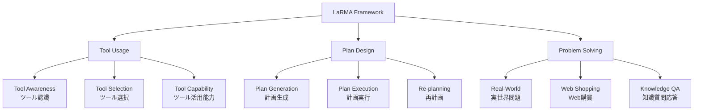

## 論文概要（Abstract）

本記事は [Exploring the Necessity of Reasoning in LLM-based Agent Scenarios](https://arxiv.org/abs/2503.11074) の解説記事です。

著者らは**LaRMA（Large Reasoning Models in Agent scenarios）**フレームワークを提案し、従来型のLLM（Large Language Model）と推論特化型のLRM（Large Reasoning Model）がエージェントシナリオにおいてどのような適性差を示すかを体系的に評価している。9つのタスクをTool Usage、Plan Design、Problem Solvingの3カテゴリに分類し、3種のLLMと5種のLRMを対象に比較実験を実施した。LRMはPlan DesignやProblem Solvingで優位性を示す一方、Tool Usageではむしろ従来型LLMが効率面で上回り、両者のハイブリッド構成が有効であることが報告されている。

この記事は [Zenn記事: LLMエージェント推論戦略の選び方：ReAct・ReWOO・Reflexionをタスク別に使い分ける](https://zenn.dev/0h_n0/articles/3d0a1247a810c5) の深掘りです。

## 情報源

- **arXiv ID**: 2503.11074
- **URL**: [https://arxiv.org/abs/2503.11074](https://arxiv.org/abs/2503.11074)
- **著者**: Xueyang Zhou, Guiyao Tie, Lichao Sun, et al.
- **発表年**: 2025
- **分野**: cs.AI, cs.CL
- **規模**: 71ページ、11図、8テーブル

## 背景と動機（Background & Motivation）

LLMを中核としたエージェントシステムは、ReActやReflexionなどの推論戦略により大きな進展を遂げてきた。しかし、DeepSeek-R1やOpenAI o1に代表されるLRM（Large Reasoning Model）の登場により、「エージェントにおいて推論能力はどの程度必要か」という根本的な問いが浮上している。

従来のLLMベースエージェントは、ツール呼び出しの正確さや実行速度を重視する設計が主流であった。一方でLRMは、Chain-of-Thought（CoT）の拡張やテスト時計算（test-time compute）の増大により、複雑な推論タスクで高い精度を達成する。しかし、この推論能力の増強がすべてのエージェントタスクに有効かどうかは自明ではない。著者らは、タスクの性質によってLLMとLRMの適性が異なるという仮説のもと、LaRMAフレームワークによる体系的な検証を行った。

## 主要な貢献（Key Contributions）

- **LaRMAフレームワークの提案**: エージェントタスクを3カテゴリ9タスクに体系化し、LLMとLRMの適性を比較評価する枠組みを構築
- **タスク特性に応じたモデル選択指針**: Tool UsageではLLM、Plan Design・Problem SolvingではLRMが適するという実証的知見を提示
- **ハイブリッドアーキテクチャの有効性実証**: LLMをActor（実行者）、LRMをReflector（反省者）として組み合わせる構成が、単一モデルを上回る性能を発揮することを確認
- **LRMの課題の定量化**: overthinking（過剰推論）、事実無視傾向、高計算コスト、処理遅延といったLRM固有の問題を体系的に分析

## 技術的詳細（Technical Details）

### LaRMAフレームワークの構造

LaRMAフレームワークは、エージェントの能力を以下の3カテゴリ9タスクに分類している。



**Tool Usage（ツール使用）** は、外部ツールやAPIを正確かつ迅速に呼び出す能力を評価する。Tool Awarenessはどのツールが利用可能かの認識、Tool Selectionは適切なツールの選択、Tool Capabilityはツールの引数設定と実行結果の解釈を含む。

**Plan Design（計画設計）** は、複雑なタスクを分解し、段階的な実行計画を立案・修正する能力を測定する。Plan Generationは初期計画の生成、Plan Executionは計画に沿った逐次実行、Re-planningは失敗時の計画修正を対象とする。

**Problem Solving（問題解決）** は、実世界の複合的な問題への対処能力を評価する。Real-Worldは現実的なシナリオでの判断、Web ShoppingはEC環境での目的達成、Knowledge QAは多段推論を伴う質問応答を含む。

### 評価対象モデル

著者らは以下のモデルを評価対象としている。

| 分類 | モデル名 | 備考 |
|------|----------|------|
| LLM | Claude 3.5 Sonnet | LLM群で最高性能 |
| LLM | GPT-4o | OpenAI汎用モデル |
| LLM | Gemini 2.0 Flash | Google軽量高速モデル |
| LRM | DeepSeek-R1 | LRM群で最高性能 |
| LRM | Claude 3.7 Sonnet | 拡張思考機能搭載 |
| LRM | Gemini 2.0 Flash Thinking | 推論強化版 |
| LRM | QWQ-32B-Preview | Qwen系推論モデル |
| LRM | GLM-Zero | Zhipu AI推論モデル |

### ハイブリッド構成の評価手法

ハイブリッド構成では、エージェントの動作ループを**Actor-Reflector分離**として定式化している。

$$
a_t = \text{Actor}_{\text{LLM}}(o_t, m_t)
$$

$$
m_{t+1} = \text{Reflector}_{\text{LRM}}(o_t, a_t, r_t, m_t)
$$

ここで、
- $o_t$: 時刻$t$における環境からの観測
- $a_t$: Actorが生成する行動（ツール呼び出し、テキスト出力等）
- $r_t$: 行動$a_t$に対する環境からのフィードバック
- $m_t$: Reflectorが保持するメタ認知的メモリ（反省内容、修正方針）

Actorには実行速度に優れるLLMを、Reflectorには深い推論が可能なLRMを配置する。Reflectorは各ステップの結果を分析し、計画の妥当性評価、エラーパターンの検出、戦略の修正指示を生成してActorに伝達する。

## アルゴリズム（Implementation Example）

以下は、論文で提案されているLLM-Actor + LRM-Reflectorのハイブリッド構成を再現する実装例である。

```python
from dataclasses import dataclass, field
from typing import Protocol, Any
from abc import abstractmethod


@dataclass(frozen=True)
class Action:
    """Actorが生成する行動.

    Attributes:
        tool_name: 呼び出すツール名（Noneの場合はテキスト応答）
        arguments: ツール呼び出しの引数
    """
    tool_name: str | None
    arguments: dict[str, Any] = field(default_factory=dict)


@dataclass
class ReflectionMemory:
    """Reflectorが保持するメタ認知的メモリ.

    Attributes:
        strategy_notes: 戦略修正メモ（直近3件を保持）
        revision_count: 計画修正回数
    """
    strategy_notes: list[str] = field(default_factory=list)
    revision_count: int = 0


class ModelClient(Protocol):
    """LLM/LRMクライアントのインターフェース."""

    @abstractmethod
    def generate(self, prompt: str) -> str: ...


def run_hybrid_agent_loop(
    actor: ModelClient,
    reflector: ModelClient,
    task: str,
    environment: Any,
    max_steps: int = 10,
) -> list[Action]:
    """LLM-Actor + LRM-Reflectorのハイブリッドエージェントループ.

    Args:
        actor: 行動生成用LLMクライアント（例: Claude 3.5 Sonnet）
        reflector: 反省用LRMクライアント（例: DeepSeek-R1）
        task: 解決すべきタスクの記述
        environment: ツール実行環境
        max_steps: 最大ステップ数

    Returns:
        実行された行動の履歴
    """
    memory = ReflectionMemory()
    actions: list[Action] = []

    for step in range(max_steps):
        obs = environment.observe()

        # Actor（LLM）: 観測+反省メモから行動を生成
        actor_prompt = (
            f"Task: {task}\nObs: {obs}\n"
            f"Notes: {memory.strategy_notes[-3:]}\n"
            "Select next action."
        )
        action = _parse_action(actor.generate(actor_prompt))
        actions.append(action)

        feedback = environment.execute(action)
        if environment.is_done():
            break

        # Reflector（LRM）: 行動結果を分析し戦略を修正
        ref_prompt = (
            f"Task: {task}\nAction: {action}\n"
            f"Feedback: {feedback}\n"
            "Analyze: was this correct? Strategy revision needed?"
        )
        reflection = reflector.generate(ref_prompt)
        memory.strategy_notes.append(reflection)
        memory.revision_count += 1

    return actions
```

## 実装のポイント（Implementation Notes）

論文の知見を実装に落とし込む際の注意点を整理する。

**モデル選択ロジック**: タスクの性質に応じてActorとReflectorに割り当てるモデルを動的に切り替える設計が重要である。Tool Usage系タスクではActorにLLMを固定し、Reflectorを無効化（または軽量モデルに置換）することで、不要な推論コストを回避できる。

**トークン消費の管理**: 著者らの報告によれば、QWQ-32B-Previewは他モデルと比較して効率・コストの両面で劣る結果を示しており、LRM選定時にはトークン消費量の事前評価が不可欠である。Reflectorの出力長に上限を設けることで、overthinkingによる無駄なトークン消費を抑制できる。

**エラーハンドリング**: LRMはfact-ignoring傾向（推論過程で既知の事実を無視する問題）が報告されている。Reflectorの出力に対してファクトチェック層を挟む、またはGrounding機構を導入して外部知識との整合性を検証する仕組みが実務上必要となる。

**レイテンシの考慮**: LRMの推論時間はLLMの数倍に達する場合がある。リアルタイム応答が求められるシナリオでは、Reflectorの呼び出しを非同期化し、次のActorステップと並行して反省処理を実行するパイプライン設計が有効である。

## Production Deployment Guide

### AWS実装パターン（コスト最適化重視）

LLM-Actor + LRM-Reflectorのハイブリッド推論をAWS上で構築する場合、トラフィック量に応じて以下の3構成を推奨する。

| 構成 | トラフィック | 主要サービス | 月額概算 |
|------|-------------|-------------|---------|
| Small | ~100 req/日 | Lambda + Bedrock | $50-150 |
| Medium | ~1,000 req/日 | ECS Fargate + Bedrock | $300-800 |
| Large | 10,000+ req/日 | EKS + Spot + Bedrock | $2,000-5,000 |

**Small構成**: Lambda関数でActor（Claude 3.5 Sonnet via Bedrock）を呼び出し、Reflectorは条件分岐でPlan Design系タスクのみ起動する。DynamoDBにReflectionMemoryを保存し、Step Functionsでワークフローを管理する。Bedrock Batch APIを活用して非リアルタイム処理は50%コスト削減。

**Medium構成**: ECS Fargateでエージェントランタイムをコンテナ化し、タスクキュー（SQS）経由でリクエストを処理する。Actor/Reflectorの呼び出しを並列化し、ElastiCache（Redis）にメモリをキャッシュしてレイテンシを低減する。

**Large構成**: EKS上にKarpenterを導入し、Spot Instances優先（最大90%コスト削減）で自動スケーリングを実現する。GPU対応ノード（g5.xlarge）でセルフホストLRM（DeepSeek-R1）を運用し、Bedrock呼び出しコストを削減。Reserved Instancesの1年コミットで更に最大72%削減。

**コスト試算の注意事項**: 上記は2026年7月時点のAWS ap-northeast-1（東京）リージョン料金に基づく概算値である。実際のコストはトラフィックパターン、バースト使用量、モデル選択により変動する。最新料金は[AWS料金計算ツール](https://calculator.aws/)で確認を推奨する。

### Terraformインフラコード

**Small構成（Serverless）: Lambda + Bedrock + DynamoDB**

```hcl
# --- Provider & Variables ---
terraform {
  required_version = ">= 1.9"
  required_providers {
    aws = { source = "hashicorp/aws", version = "~> 5.60" }
  }
}

variable "project" { default = "larma-hybrid" }
variable "env"     { default = "prod" }

# --- IAM Role (最小権限) ---
resource "aws_iam_role" "agent_lambda" {
  name = "${var.project}-lambda-role"
  assume_role_policy = jsonencode({
    Version = "2012-10-17"
    Statement = [{
      Effect    = "Allow"
      Principal = { Service = "lambda.amazonaws.com" }
      Action    = "sts:AssumeRole"
    }]
  })
}

resource "aws_iam_role_policy" "bedrock_invoke" {
  name = "bedrock-invoke"
  role = aws_iam_role.agent_lambda.id
  policy = jsonencode({
    Version = "2012-10-17"
    Statement = [{
      Effect   = "Allow"
      Action   = ["bedrock:InvokeModel", "bedrock:InvokeModelWithResponseStream"]
      Resource = "arn:aws:bedrock:*:*:model/anthropic.*"
    }]
  })
}

# --- Lambda Function ---
resource "aws_lambda_function" "hybrid_agent" {
  function_name = "${var.project}-agent"
  runtime       = "python3.12"
  handler       = "handler.main"
  role          = aws_iam_role.agent_lambda.arn
  timeout       = 300  # LRM反省ステップを考慮
  memory_size   = 512  # コスト最適化: 必要最小限

  environment {
    variables = {
      ACTOR_MODEL_ID     = "anthropic.claude-3-5-sonnet-20241022-v2:0"
      REFLECTOR_MODEL_ID = "anthropic.claude-3-7-sonnet-20250219-v1:0"
      MEMORY_TABLE       = aws_dynamodb_table.reflection_memory.name
    }
  }
  filename = "lambda.zip"
}

# --- DynamoDB (On-Demand) ---
resource "aws_dynamodb_table" "reflection_memory" {
  name         = "${var.project}-memory"
  billing_mode = "PAY_PER_REQUEST"  # On-Demand: 低トラフィックでコスト最適
  hash_key     = "session_id"
  range_key    = "step"

  attribute {
    name = "session_id"
    type = "S"
  }
  attribute {
    name = "step"
    type = "N"
  }

  ttl {
    attribute_name = "expires_at"
    enabled        = true
  }

  server_side_encryption { enabled = true }  # KMS暗号化
}

# --- CloudWatch Alarm (コスト監視) ---
resource "aws_cloudwatch_metric_alarm" "bedrock_cost_spike" {
  alarm_name          = "${var.project}-bedrock-token-spike"
  comparison_operator = "GreaterThanThreshold"
  evaluation_periods  = 1
  metric_name         = "Invocations"
  namespace           = "AWS/Bedrock"
  period              = 3600
  statistic           = "Sum"
  threshold           = 500  # 1時間500回超過でアラート
  alarm_actions       = []   # SNS ARNを設定
}
```

### 運用・監視設定

**CloudWatch Logs Insights クエリ（コスト異常検知）**:

```
fields @timestamp, @message
| filter @message like /bedrock/
| stats sum(input_tokens) as total_input, sum(output_tokens) as total_output by bin(1h)
| sort @timestamp desc
```

**CloudWatch Alarm設定（Python boto3）**:

```python
import boto3

def create_token_usage_alarm(sns_topic_arn: str) -> None:
    """Bedrockトークン使用量のスパイク検知アラームを作成する.

    Args:
        sns_topic_arn: 通知先SNSトピックのARN
    """
    cw = boto3.client("cloudwatch")
    cw.put_metric_alarm(
        AlarmName="larma-bedrock-token-spike",
        MetricName="InputTokenCount",
        Namespace="AWS/Bedrock",
        Statistic="Sum",
        Period=3600,
        EvaluationPeriods=1,
        Threshold=100000,
        ComparisonOperator="GreaterThanThreshold",
        AlarmActions=[sns_topic_arn],
    )
```

**X-Rayトレーシング**: `aws_xray_sdk`の`patch_all()`でboto3を自動計装し、`put_annotation("session_id", sid)`でセッション単位のトレースを実現する。Actor/Reflector各呼び出しのレイテンシをサブセグメントで計測し、ボトルネックを可視化する。

**Cost Explorer日次レポート**: `ce.get_cost_and_usage()`でBedrock/Lambda/DynamoDBの日次コストを取得し、$100/日超過でSNS通知を発火する。Reflectorの呼び出し頻度とコストの相関を追跡することで、overthinkingによるコスト増を早期検知する。

### コスト最適化チェックリスト

**アーキテクチャ選択**:
- [ ] トラフィック100 req/日以下ならServerless（Lambda + Bedrock）
- [ ] 1,000 req/日前後ならHybrid（ECS Fargate + Bedrock）
- [ ] 10,000+ req/日ならContainer（EKS + セルフホストLRM）

**リソース最適化**:
- [ ] EC2/EKSノードはSpot Instances優先（最大90%削減）
- [ ] Reserved Instances 1年コミット検討（最大72%削減）
- [ ] Savings Plans適用可否を確認
- [ ] Lambda メモリサイズをPower Tuningで最適化
- [ ] EKS/ECSのアイドル時スケールダウン設定

**LLMコスト削減**:
- [ ] Bedrock Batch APIで非同期処理（50%削減）
- [ ] Prompt Caching有効化（30-90%削減）
- [ ] Tool Usage系タスクではReflector無効化（トークン節約）
- [ ] Reflector出力のmax_tokens制限（overthinking防止）
- [ ] 軽量モデル（Haiku）でのTool Awareness事前フィルタリング

**監視・アラート**:
- [ ] AWS Budgets月次予算アラート設定
- [ ] CloudWatchトークン使用量アラーム設定
- [ ] Cost Anomaly Detection有効化
- [ ] 日次コストレポート自動配信（SNS）
- [ ] X-Rayでレイテンシボトルネック特定

**リソース管理**:
- [ ] 未使用Lambda関数・ECRイメージの定期削除
- [ ] リソースタグ戦略（Project/Env/CostCenter）
- [ ] DynamoDB TTLによる古いメモリ自動削除
- [ ] CloudWatch Logsの保持期間設定（30日）
- [ ] 開発環境の夜間・週末自動停止

## 実験結果（Results）

著者らは8つのモデル（LLM 3種 + LRM 5種）を9タスクで評価し、以下の傾向を報告している。

| カテゴリ | タスク | LLM上位 | LRM上位 | 優位 |
|---------|--------|---------|---------|------|
| Tool Usage | Awareness | Claude 3.5 Sonnet | DeepSeek-R1 | LLM |
| Tool Usage | Selection | Claude 3.5 Sonnet | DeepSeek-R1 | LLM |
| Tool Usage | Capability | Claude 3.5 Sonnet | Gemini 2.0 Flash Thinking | LLM |
| Plan Design | Generation | GPT-4o | DeepSeek-R1 | LRM |
| Plan Design | Execution | Claude 3.5 Sonnet | DeepSeek-R1 | LRM |
| Plan Design | Re-planning | Claude 3.5 Sonnet | DeepSeek-R1 | LRM |
| Problem Solving | Real-World | GPT-4o | DeepSeek-R1 | LRM |
| Problem Solving | Web Shopping | Claude 3.5 Sonnet | DeepSeek-R1 | 混合 |
| Problem Solving | Knowledge QA | Claude 3.5 Sonnet | DeepSeek-R1 | LRM |

**主要な分析結果**（論文Table 1-4 より）:

- **Tool Usage**: LLMが3サブタスク中3つで優位。ツール呼び出しは形式的な正確さと速度が重要であり、深い推論は不要または有害（overthinkingにより誤った判断を導く場合がある）
- **Plan Design**: LRMが3サブタスク全てで優位。特にRe-planningでは、LRMの反復的反省メカニズムが失敗からの回復に寄与
- **Problem Solving**: LRMが概ね優位だが、Web Shoppingなど実行ステップの多いタスクではLLMの効率性が活きる場面もある
- **効率性**: 著者らの報告によれば、QWQ-32B-Previewは効率・コストの両面で他モデルを大きく下回っており、アーキテクチャの非効率性が指摘されている

## 実運用への応用（Practical Applications）

本論文の知見は、LLMエージェントシステムの設計に以下の示唆を与える。

**タスクルーティング**: 受信タスクの性質を分類器で判定し、Tool Usage系はLLM直接実行、Plan Design・Problem Solving系はハイブリッド構成に振り分けるルーティング層を設ける。これにより、計算コストを抑えつつ高精度を維持できる。

**段階的なReflector導入**: 全ステップでLRMを呼び出すのではなく、失敗検出時やN回ステップごとにのみReflectorを起動する「条件付き反省」方式が実務上合理的である。Zenn記事で紹介されているReflexionパターンとの組み合わせが有効である。

**コスト監視の必須化**: LRMのトークン消費はLLMの数倍に達する場合があるため、リクエスト単位でのコスト追跡と、異常検知による自動スロットリングの仕組みが不可欠となる。

**モデル選択の動的切り替え**: 同一エージェント内でも、Zenn記事で解説されているReAct（Tool Usage向き）とReflexion（Plan Design向き）を、タスク分類に基づいて動的に切り替える設計が本論文の知見と整合する。

## 関連研究（Related Work）

- **ReAct** (Yao et al., 2023): 推論（Reasoning）と行動（Acting）を交互に繰り返すフレームワーク。LaRMAのTool Usage評価はReActパターンの延長線上にある
- **Reflexion** (Shinn et al., 2023): 自己反省による学習ループ。LaRMAのReflectorはReflexionの反省メカニズムを分離・モジュール化した構成と解釈できる
- **ReWOO** (Xu et al., 2023): 推論と観測を分離し、計画を先行生成するフレームワーク。LaRMAのPlan Generationタスクと直接対応する
## まとめと今後の展望

本論文は、LLMとLRMのエージェントタスクにおける適性差を体系的に明らかにした。Tool Usageでは従来型LLMの効率性が、Plan Design・Problem Solvingでは推論特化LRMの深い思考能力がそれぞれ有効であり、両者のハイブリッド構成（LLM as Actor + LRM as Reflector）が現時点で実用上の最適解であると著者らは結論づけている。

今後の研究方向として、タスク分類の自動化、Reflectorの呼び出し頻度の適応的制御、LRMのoverthinking問題の軽減手法が挙げられる。推論コストと精度のトレードオフをタスクごとに最適化する「推論予算配分」の研究が、エージェントシステムの実用化に向けた重要な課題となるであろう。

## 参考文献

- **arXiv**: [https://arxiv.org/abs/2503.11074](https://arxiv.org/abs/2503.11074)
- **Related Zenn article**: [LLMエージェント推論戦略の選び方：ReAct・ReWOO・Reflexionをタスク別に使い分ける](https://zenn.dev/0h_n0/articles/3d0a1247a810c5)
- **ReAct**: [https://arxiv.org/abs/2210.03629](https://arxiv.org/abs/2210.03629)
- **Reflexion**: [https://arxiv.org/abs/2303.11366](https://arxiv.org/abs/2303.11366)
- **ReWOO**: [https://arxiv.org/abs/2305.18323](https://arxiv.org/abs/2305.18323)
