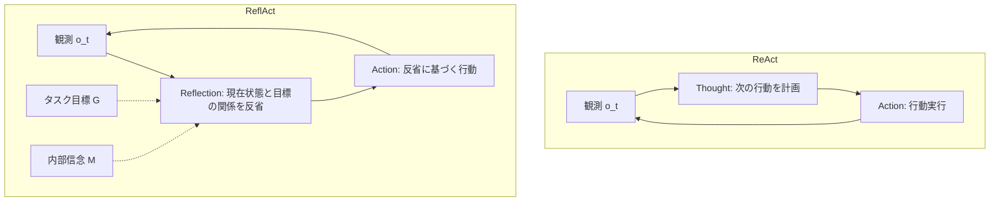

## 論文概要

本記事は [ReflAct: World-Grounded Decision Making in LLM Agents via Goal-State Reflection](https://arxiv.org/abs/2505.15182) の解説記事です。

ReflActは、ReActベースのLLMエージェントが環境の実際の状態と乖離した推論を生成する問題（非接地的推論）を解決するフレームワークである。著者らは、行動計画ではなく**状態-目標反省（goal-state reflection）**に焦点を当てることで、エージェントの内部信念と目標の整合性を維持する手法を提案している。ALFWorldベンチマークで93.3%の成功率を達成し、ReActを平均27.7%上回る性能を報告している。

## 情報源

- **論文**: Kim, J., Rhee, S., Kim, M., Kim, D., Lee, S., Sung, Y., & Jung, K. (2025). ReflAct: World-Grounded Decision Making in LLM Agents via Goal-State Reflection. *Proceedings of the 2025 Conference on Empirical Methods in Natural Language Processing (EMNLP 2025)*, pp.33433-33465. Association for Computational Linguistics.
- **arXiv**: [2505.15182](https://arxiv.org/abs/2505.15182)
- **ACL Anthology**: [2025.emnlp-main.1697](https://aclanthology.org/2025.emnlp-main.1697/)
- **著者所属**: KAIST（韓国科学技術院）

## カンファレンス情報

EMNLP（Conference on Empirical Methods in Natural Language Processing）は、自然言語処理分野における最上位国際会議の一つである。ACL（Association for Computational Linguistics）が主催し、計算言語学および自然言語処理の実証的手法に焦点を当てた研究を採択する。EMNLP 2025は中国・蘇州で開催され、本論文はMain Conferenceに採択されている。

## 背景と動機

### ReActの構造的限界

ReAct（Reasoning + Acting）は、LLMエージェントの推論と行動を交互に実行するフレームワークとして広く採用されている。しかし著者らは、ReActの推論ステップ（Thought）に根本的な問題があることを指摘している。

ReActのThoughtは「次に何をすべきか」という**行動計画**に偏りがちである。例えばALFWorldタスクにおいて、ReActは以下のような推論を生成する。

> "Now I find a spraybottle 2. Next, I need to take it."

この推論は現在の観測に反応して次の行動を予測しているだけであり、以下の問題を引き起こす。

1. **環境状態との非接地性**: エージェントが実際にどこにいて何を持っているかを明示的に把握しない
2. **短視眼的な計画**: 局所的にもっともらしい行動を選択するが、長期的な目標との整合性を確認しない
3. **誤りの累積**: 一度非接地的な推論が生じると、その後の推論も連鎖的に乖離する

### 行動エントロピーによる定量的分析

著者らはLlama-3.1-8B-Instructを用いて、ALFWorldの134タスクにおける行動エントロピーを測定している。NoThinking（推論なし）条件のエントロピーが1.23であるのに対し、ReAct条件では0.30と74%減少することが報告されている。これはThoughtが行動分布を大幅に狭める効果を持つことを示しており、推論の質がエージェントの行動選択に直接影響することを定量的に裏付けている。

## 主要な貢献

著者らは以下の3つの貢献を主張している。

1. **ReflActフレームワークの提案**: 行動計画ではなく状態-目標反省に焦点を当てた新しい推論バックボーン
2. **補助モジュール不要の性能改善**: Reflexion、WKMなどの外部モジュールに頼ることなく、推論バックボーン自体の強化で信頼性を向上
3. **広範なベンチマークでの検証**: ALFWorld、ScienceWorld、Jericho、BabyAIの4つのベンチマークで一貫した改善を実証

## 技術的詳細

### Goal-State Reflectionメカニズム

ReflActの中核は、エージェントの推論空間を**反省空間K**として再定義する点にある。各反省 $k \in K$ は以下の2つの要素を明示的にエンコードする。

- **内部信念状態 $M$**: インタラクション履歴に基づくエージェントの現在の理解
- **タスク目標 $G$**: 達成すべき目的の簡潔な要約

ReflActの推論ステップでは、まず現在の状態を目標との関係で反省し、その上で行動を決定する。具体的な指示は以下の通りである。

> "You should first reflect on the agent's state in relation to the task goal, and then output the action for this turn."

これに対してReActの指示は以下である。

> "Think about the current condition and plan for your future actions."

### 数学的定式化

時刻 $t$ における最適な推論 $\tau_t^*$ は以下のように定義される。

$$
\tau_t^* = \arg\max_{\tau \in T} \mathbb{E}_{a \sim \pi_\theta^{\text{act}}(\cdot \mid c_t \oplus \tau)} \left[ \mathbb{E}[G_t \mid s_t, a] \right]
$$

ここで $G_t = \sum_{k=0}^{\infty} \gamma^k R_{t+k}$ は割引率 $\gamma$ を用いた長期リターンであり、$c_t = (h_t, o_t)$ はインタラクション履歴 $h_t$ と現在の観測 $o_t$ から構成されるコンテキストである。$\oplus$ はコンテキストと推論の結合を表す。

この定式化の重要な点は、推論 $\tau$ が行動方策 $\pi_\theta^{\text{act}}$ を介して長期リターンを最大化するように選択されることである。ReActのThoughtが次の行動のみに着目するのに対し、ReflActのReflectionは長期的な目標達成に寄与する行動を促す推論を生成する。

### ReActとReflActの構造比較

以下のMermaid図でReActとReflActの推論-行動ループの違いを示す。



ReActでは観測から直接次の行動を計画するのに対し、ReflActでは観測に加えてタスク目標と内部信念状態を反省ステップに統合している。

### 具体例による比較

ALFWorldの「スプレーボトルをトイレに置く」タスクにおける推論の違いを示す。

**ReActのThought**:
> "Now I find a spraybottle 2. Next, I need to take it."

**ReflActのReflection**:
> "Currently, I am at cabinet 2 and have found a spraybottle 2, which brings me closer to completing the task of placing it on the toilet."

ReflActの反省では、(1) 現在位置（cabinet 2）、(2) 発見したオブジェクト（spraybottle 2）、(3) タスク目標との関連（トイレに置くタスクの進捗）が明示的に記述されている。

## アルゴリズム

以下にReflActの推論-行動ループをPythonで実装した擬似コードを示す。

```python
from dataclasses import dataclass
from typing import Protocol


@dataclass(frozen=True)
class Observation:
    """環境から受け取る観測データ。

    Attributes:
        text: 環境の状態を記述するテキスト
        done: タスクが完了したかどうか
        reward: 環境から受け取った報酬
    """

    text: str
    done: bool = False
    reward: float = 0.0


@dataclass(frozen=True)
class Reflection:
    """状態-目標反省の結果。

    Attributes:
        belief_state: エージェントの現在の内部信念状態 M
        goal_summary: タスク目標の要約 G
        state_goal_relation: 現在状態と目標の関連性の記述
    """

    belief_state: str
    goal_summary: str
    state_goal_relation: str


class LLMBackend(Protocol):
    """LLM推論バックエンドのインターフェース。"""

    def generate_reflection(
        self, context: str, goal: str, instruction: str
    ) -> Reflection:
        """コンテキストと目標に基づいて状態-目標反省を生成する。"""
        ...

    def generate_action(
        self, context: str, reflection: Reflection
    ) -> str:
        """反省結果に基づいて次の行動を生成する。"""
        ...


@dataclass
class ReflActAgent:
    """ReflActフレームワークに基づくエージェント。

    ReActの行動計画型推論を状態-目標反省に置き換え、
    エージェントの内部信念と目標の整合性を維持する。

    Attributes:
        llm: LLM推論バックエンド
        task_goal: タスクの目標記述
        max_steps: 最大ステップ数
    """

    llm: LLMBackend
    task_goal: str
    max_steps: int = 50

    REFLACT_INSTRUCTION: str = (
        "You should first reflect on the agent's state "
        "in relation to the task goal, "
        "and then output the action for this turn."
    )

    def _build_context(
        self,
        history: list[tuple[Observation, Reflection, str]],
        current_obs: Observation,
    ) -> str:
        """インタラクション履歴と現在の観測からコンテキストを構築する。

        Args:
            history: (観測, 反省, 行動)のタプルのリスト
            current_obs: 現在の観測

        Returns:
            LLMに渡すコンテキスト文字列 c_t = (h_t, o_t)
        """
        context_parts: list[str] = [f"Goal: {self.task_goal}\n"]
        for obs, refl, action in history:
            context_parts.append(f"Observation: {obs.text}")
            context_parts.append(
                f"Reflection: {refl.state_goal_relation}"
            )
            context_parts.append(f"Action: {action}")
        context_parts.append(f"Observation: {current_obs.text}")
        return "\n".join(context_parts)

    def run_episode(
        self,
        env: "Environment",
    ) -> tuple[bool, list[tuple[Observation, Reflection, str]]]:
        """1エピソードを実行する。

        Args:
            env: 環境インスタンス（reset/stepメソッドを持つ）

        Returns:
            (成功フラグ, インタラクション履歴)のタプル
        """
        obs: Observation = env.reset()
        history: list[tuple[Observation, Reflection, str]] = []

        for step in range(self.max_steps):
            if obs.done:
                break

            # Step 1: コンテキスト構築 c_t = (h_t, o_t)
            context = self._build_context(history, obs)

            # Step 2: 状態-目標反省の生成
            reflection = self.llm.generate_reflection(
                context=context,
                goal=self.task_goal,
                instruction=self.REFLACT_INSTRUCTION,
            )

            # Step 3: 反省に基づく行動生成
            action = self.llm.generate_action(
                context=context,
                reflection=reflection,
            )

            # Step 4: 環境での行動実行
            next_obs: Observation = env.step(action)
            history.append((obs, reflection, action))
            obs = next_obs

        success = obs.done and obs.reward > 0
        return success, history
```

## 実装のポイント

### プロンプト設計の簡潔さ

ReflActの実装上の最大の特徴は、プロンプトの変更が極めて小さい点である。ReActの「think about the current condition and plan for your future actions」を「reflect on the agent's state in relation to the task goal」に置き換えるだけで、推論の質が大幅に向上する。これは追加のメモリモジュールやリトライ機構を必要としない。

### トークン効率

著者らは、ReflActの反省テキストがReActのThoughtよりもやや長くなることを報告している。しかし、トークン数の増加は控えめであり、推論の構造化による行動品質の向上がそのコストを上回ると述べている。重要なのはトークンの量ではなく、推論の構造である。

### 既存フレームワークとの互換性

ReflActは推論バックボーンの置き換えであるため、Reflexionなどの外部モジュールと組み合わせることが可能である。実際にReflAct+Reflexionの組み合わせはALFWorldで94.8%を達成しており、両者の効果が相補的であることが示されている。

## Production Deployment Guide

ReflActを実運用システムに組み込む際の設計指針と実装パターンを以下に示す。

### アーキテクチャ設計

ReflActの本番環境への導入では、推論バックボーンの切り替えのみで既存のエージェントパイプラインを改善できる点が最大の利点である。以下に推奨アーキテクチャを示す。

```python
from dataclasses import dataclass, field
from typing import Any


@dataclass
class ReflActConfig:
    """ReflAct本番環境設定。

    Attributes:
        model_name: 使用するLLMモデル名
        max_steps: 1タスクあたりの最大ステップ数
        reflection_timeout_sec: 反省生成のタイムアウト（秒）
        action_timeout_sec: 行動生成のタイムアウト（秒）
        max_retries: API呼び出しのリトライ上限
        enable_reflection_cache: 類似状態の反省キャッシュ有効化
        fallback_to_react: ReflAct失敗時にReActへフォールバック
    """

    model_name: str = "gpt-4o"
    max_steps: int = 50
    reflection_timeout_sec: float = 30.0
    action_timeout_sec: float = 15.0
    max_retries: int = 3
    enable_reflection_cache: bool = False
    fallback_to_react: bool = True
```

### プロンプトテンプレート管理

本番環境では、ReflActの反省指示を環境タイプごとに微調整することが推奨される。論文では単一の汎用指示で複数ベンチマークに対応しているが、ドメイン固有の状態記述を含めることで精度を向上できる。

```python
REFLECTION_TEMPLATES: dict[str, str] = {
    "general": (
        "You should first reflect on the agent's state "
        "in relation to the task goal, "
        "and then output the action for this turn."
    ),
    "web_navigation": (
        "Reflect on your current page state and progress "
        "toward the user's request, "
        "then decide the next browser action."
    ),
    "tool_use": (
        "Assess which tools you have already used, "
        "what information you have gathered, "
        "and how close you are to answering the query. "
        "Then select the next tool call."
    ),
}
```

### エラーハンドリングとフォールバック

ReflActの反省生成が失敗した場合（タイムアウト、トークン上限超過など）のフォールバック戦略を設計しておくことが重要である。著者らの実験では、ReflActがReActの固有の失敗モードを**一切生じさせなかった**（GPT-4oでの134タスク中、ReflActのみが失敗するケースは0%）と報告されている。しかし本番環境ではLLM API自体の障害に備える必要がある。

```python
from dataclasses import dataclass


@dataclass(frozen=True)
class FallbackResult:
    """フォールバック処理の結果。

    Attributes:
        action: 選択された行動
        method: 使用された手法（reflact/react/heuristic）
        reflection_text: 反省テキスト（フォールバック時はNone）
    """

    action: str
    method: str
    reflection_text: str | None = None


def generate_action_with_fallback(
    context: str,
    goal: str,
    config: "ReflActConfig",
    llm: "LLMBackend",
) -> FallbackResult:
    """フォールバック付きで行動を生成する。

    ReflAct → ReAct → ヒューリスティックの順でフォールバックする。

    Args:
        context: 現在のコンテキスト
        goal: タスク目標
        config: ReflAct設定
        llm: LLMバックエンド

    Returns:
        フォールバック結果
    """
    # 1. ReflActによる反省+行動生成を試行
    try:
        reflection = llm.generate_reflection(
            context=context,
            goal=goal,
            instruction=REFLECTION_TEMPLATES["general"],
        )
        action = llm.generate_action(
            context=context,
            reflection=reflection,
        )
        return FallbackResult(
            action=action,
            method="reflact",
            reflection_text=reflection.state_goal_relation,
        )
    except TimeoutError:
        if not config.fallback_to_react:
            raise

    # 2. ReActへのフォールバック
    try:
        thought_and_action = llm.generate_thought_and_action(
            context=context,
        )
        return FallbackResult(
            action=thought_and_action.action,
            method="react",
        )
    except TimeoutError:
        pass

    # 3. ヒューリスティックへのフォールバック
    return FallbackResult(
        action="wait",
        method="heuristic",
    )
```

### モニタリングと観測可能性

ReflActの本番運用では、反省の品質をモニタリングすることが重要である。著者らの行動エントロピー分析に基づき、以下のメトリクスを追跡することが推奨される。

1. **反省の接地性スコア**: 反省テキストが環境状態の要素（位置、所持アイテムなど）を何個含むかを計数
2. **目標言及率**: 反省テキストがタスク目標を明示的に参照する割合
3. **ステップあたりトークン数**: 反省の冗長化を検出
4. **タスク完了までのステップ数**: ReActと比較した効率性

### スケーリング考慮事項

ReflActはプロンプトレベルの変更であるため、スケーリング上の追加コストは最小限である。ただし以下の点に留意する必要がある。

- **コンテキスト長**: 反省テキストの蓄積によりコンテキスト長が増加するため、長いタスクでは履歴の圧縮や要約が必要になる場合がある
- **レイテンシ**: 反省と行動の2段階生成は、ReActの1段階生成と比較してレイテンシが増加する可能性がある。ただし論文の実装では単一のLLM呼び出しで反省と行動を同時に生成しているため、追加のAPI呼び出しは不要である
- **モデル選択**: 著者らの実験によると、小規模モデル（Llama-3.1-8B）でもReflActの恩恵は大きく、ALFWorldでReActの29.1%から60.5%へと31.4ポイントの改善が報告されている。コスト効率の観点から小規模モデル+ReflActは大規模モデル+ReActの代替となり得る

## 実験結果

### ALFWorld（134タスク）

ALFWorldは家庭内のオブジェクト操作タスクを含むテキストベースの環境である。著者らは以下の結果を報告している。

| モデル | NoThinking | ReAct | ReflAct | 改善幅 |
|--------|-----------|-------|---------|--------|
| GPT-4o | 76.1% | 85.1% | **93.3%** | +8.2pt |
| GPT-4o-mini | 43.3% | 53.0% | **66.4%** | +13.4pt |
| Llama-3.1-8B | 21.6% | 29.1% | **60.5%** | +31.4pt |
| Llama-3.1-70B | 53.7% | 81.3% | **83.6%** | +2.3pt |

特にLlama-3.1-8Bでの31.4ポイントの改善は、小規模モデルほどReflActの恩恵が大きいことを示唆している。

### ScienceWorld（211タスク）

ScienceWorldは科学実験のシミュレーション環境である。

| モデル | NoThinking | ReAct | ReflAct |
|--------|-----------|-------|---------|
| GPT-4o | 50.2% | 55.9% | **57.8%** |
| GPT-4o-mini | 21.8% | 37.0% | **37.0%** |
| Llama-3.1-8B | 14.2% | 27.5% | **33.2%** |
| Llama-3.1-70B | 46.4% | 53.1% | **58.8%** |

ScienceWorldでの改善幅はALFWorldほど大きくないが、全モデルでReAct以上の性能を達成している。

### Jericho（20タスク）

Jerichoはテキストアドベンチャーゲームの環境であり、長期的な計画能力を評価する。

| モデル | NoThinking | ReAct | ReflAct |
|--------|-----------|-------|---------|
| GPT-4o | 10.0% | 20.0% | **35.0%** |
| GPT-4o-mini | 5.0% | 15.0% | **20.0%** |
| Llama-3.1-8B | 0.0% | 0.0% | **10.0%** |
| Llama-3.1-70B | 5.0% | 10.0% | **20.0%** |

Jerichoでは全モデルで大幅な改善が見られ、GPT-4oでReActの20.0%からReflActの35.0%へと75%の相対改善を達成している。

### BabyAI

| モデル | ReAct | ReflAct |
|--------|-------|---------|
| GPT-4o | 64.0% | **76.0%** |
| GPT-4o-mini | 40.0% | **48.0%** |
| Llama-3.1-8B | 38.0% | **50.0%** |
| Qwen3-8B | 32.0% | **36.0%** |

### 拡張モジュールとの比較

著者らはReflActを既存の拡張モジュール付きReActと比較している。

- **ReAct+Reflexion**: タスク失敗後にリトライする手法だが、ReflActの単独性能を下回ると報告されている
- **ReAct+WKM（World Knowledge Model）**: 外部の状態知識モジュールを追加する手法だが、Llama-3.1-8BにおいてReflActの性能を下回る
- **ReflAct+Reflexion**: 94.8%（GPT-4o、ALFWorld）を達成し、ReflActとReflexionの効果が相補的であることを示している

### 失敗モードの分析

GPT-4oによるALFWorld 134タスクでの失敗分布は以下の通りである。

- NoThinkingのみ失敗（ReActは成功）: 約45%
- ReActのみ失敗（NoThinkingは成功）: 約10%
- 両方失敗: 約20%
- 両方成功: 約25%

注目すべきは、**ReflActのみが失敗するケースが0%**であったことである。ReActは独自の失敗モード（探索済みの場所を再訪する、オブジェクトを持っていると誤認するなど）を導入するが、ReflActではこのような非接地的な失敗が発生しなかったと著者らは報告している。

## Ablation Study

著者らはLlama-3.1-8Bを用いて、反省の構成要素の効果を検証している。以下の変種を比較している。

1. **ReflAct（状態+目標の反省）**: 最良の性能
2. **状態+目標+Thought**: ReflActにReActのThoughtを追加。やや性能低下
3. **状態+目標（反省なし）**: 状態と目標の情報を与えるが明示的な反省を求めない。ReActを下回る
4. **目標のみ**: 大幅な性能低下
5. **状態のみ**: 大幅な性能低下

この結果から、(1) 状態と目標の**両方**が必要であること、(2) 単に情報を提示するだけでなく**明示的な反省プロセス**を経ることが重要であること、(3) ReActのThoughtを追加しても改善しない（むしろ悪化する）ことが示されている。

## 実運用への応用

### 適用が効果的なユースケース

ReflActの知見は以下のユースケースに応用可能である。

1. **マルチステップのツール利用エージェント**: API呼び出しを連鎖させるエージェントで、各ステップで「何を達成済みで、目標に対してどこにいるか」を反省させることで、不要なAPI呼び出しや堂々巡りを防ぐ
2. **対話型タスク実行**: カスタマーサポートやデータ分析の対話エージェントで、ユーザーの元々の要求を常に反省に含めることで、対話の脱線を防ぐ
3. **コード生成エージェント**: 複数ファイルにまたがるコード生成で、「現在のコードベースの状態」と「実装目標」の関係を反省させることで、整合性のあるコード生成を促す

### 小規模モデルでの活用

著者らの実験結果が示す最も実用的な知見の一つは、小規模モデル（8Bパラメータ）でReflActの改善効果が最大化される点である。ALFWorldでLlama-3.1-8Bは29.1%から60.5%へと改善しており、これはGPT-4oのReAct（85.1%）には及ばないものの、GPT-4o-miniのReAct（53.0%）を上回っている。コスト効率の観点から、小規模モデル+ReflActは実運用における有力な選択肢となる。

## 関連研究

### ReAct（Yao et al., 2023）

ReActはLLMの推論（Chain-of-Thought）と行動を交互に実行するフレームワークである。ReflActはReActのThoughtを状態-目標反省に置き換えることで、推論の接地性を向上させている。

### Reflexion（Shinn et al., 2023）

Reflexionはタスク失敗後に過去の軌跡を振り返り、次回のトライアルで改善する手法である。ReflActとの根本的な違いは、Reflexionが**事後的**な反省（タスク失敗後）であるのに対し、ReflActは**各ステップ内**での即座の反省である点である。両者は相補的であり、ReflAct+Reflexionで94.8%を達成している。

### WKM（World Knowledge Model, Qiao et al., 2024）

WKMはエージェントに外部の世界知識モジュールを追加する手法である。ReflActはこのような外部モジュールを必要とせず、推論バックボーン自体の改善で同等以上の性能を達成する点で異なる。著者らはこの結果を「補助モジュールに頼るのではなく、推論バックボーン自体の強化が信頼性の鍵」と主張している。

### Inner Monologue（Huang et al., 2022）

Inner Monologueはロボティクスにおいて環境フィードバックをLLMの推論に組み込む手法である。ReflActは同様のアイデアをテキストベースのエージェント環境に適用し、明示的な目標との関連付けを追加している。

## まとめ

ReflActは、LLMエージェントの推論ステップを「次の行動の計画」から「現在状態と目標の関係の反省」に転換するフレームワークである。本論文の核心的な主張は、補助モジュール（Reflexion、WKMなど）を追加するよりも、推論バックボーン自体を改善する方が効果的であるという点にある。

実験結果は、ALFWorld（93.3%）、ScienceWorld（57.8%）、Jericho（35.0%）、BabyAI（76.0%）のいずれにおいてもReActを一貫して上回り、平均27.7%の改善を達成したことを示している。特にLlama-3.1-8Bでの31.4ポイントの改善は、小規模モデルでの実用性を示唆している。

プロンプト変更が最小限（1文の指示変更）である点は、既存システムへの導入コストが極めて低いことを意味する。ReflActは推論の質を構造的に改善するための設計原則として、今後のLLMエージェント開発において参照されるべき知見を提供している。

## 参考文献

- Kim, J., Rhee, S., Kim, M., Kim, D., Lee, S., Sung, Y., & Jung, K. (2025). ReflAct: World-Grounded Decision Making in LLM Agents via Goal-State Reflection. *Proceedings of EMNLP 2025*, pp.33433-33465. [arXiv:2505.15182](https://arxiv.org/abs/2505.15182)
- Yao, S., Zhao, J., Yu, D., Du, N., Shafran, I., Narasimhan, K., & Cao, Y. (2023). ReAct: Synergizing Reasoning and Acting in Language Models. *ICLR 2023*. [arXiv:2210.03629](https://arxiv.org/abs/2210.03629)
- Shinn, N., Cassano, F., Gopinath, A., Sheshadri, K. R., Deoras, A., & Trevithick, T. (2023). Reflexion: Language Agents with Verbal Reinforcement Learning. *NeurIPS 2023*. [arXiv:2303.11366](https://arxiv.org/abs/2303.11366)
- Qiao, S., et al. (2024). Agent Workflow Memory for LLM-Based Agents. *arXiv:2409.07429*. [arXiv:2409.07429](https://arxiv.org/abs/2409.07429)
- Huang, W., Abbeel, P., Pathak, D., & Mordatch, I. (2022). Language Models as Zero-Shot Planners: Extracting Actionable Knowledge for Embodied Agents. *ICML 2022*. [arXiv:2201.07207](https://arxiv.org/abs/2201.07207)
