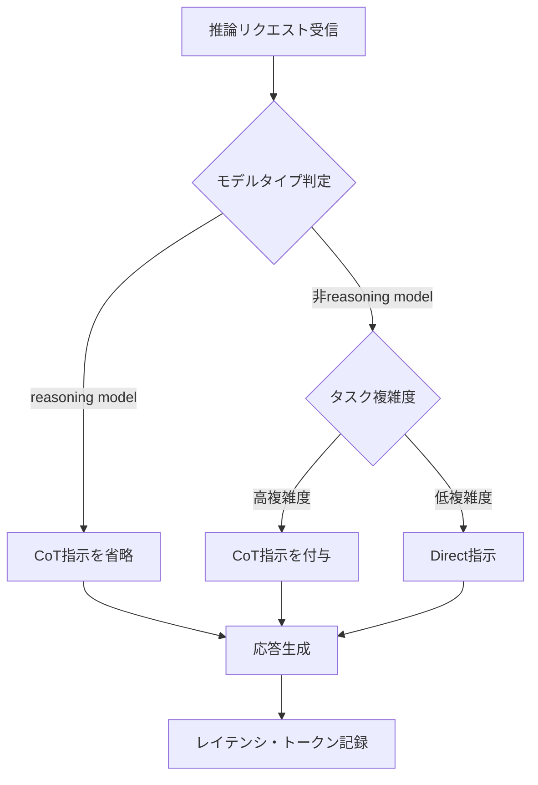

## 論文概要

本記事は [Prompting Science Report 2: The Decreasing Value of Chain of Thought in Prompting](https://arxiv.org/abs/2506.07142) の解説記事です。

Wharton GAIL による本報告は、CoTプロンプティングの有効性を非reasoningモデル5種・reasoningモデル3種で定量評価した研究である。著者らは、非reasoningモデルでのCoT精度向上が限定的（RD +4.4〜+13.5%）であり、reasoningモデルでは効果がさらに縮小（+2.9〜3.1%）する一方、応答時間が35〜600%増加することを報告している。

この記事は [Zenn記事: LLMエージェント推論戦略の選び方：ReAct・ReWOO・Reflexionをタスク別に使い分ける](https://zenn.dev/0h_n0/articles/3d0a1247a810c5) の深掘りです。

## 情報源

- **arXiv ID**: 2506.07142
- **URL**: [https://arxiv.org/abs/2506.07142](https://arxiv.org/abs/2506.07142)
- **著者**: Lennart Meincke, Ethan Mollick, Lilach Mollick, Dan Shapiro
- **所属**: Wharton Generative AI Lab (GAIL), University of Pennsylvania
- **発表年**: 2025
- **分野**: cs.CL, cs.AI

## 背景と動機

Chain-of-Thought（CoT）プロンプティングは、Wei et al. (2022) が提案した手法であり、LLMに「ステップバイステップで考えよ」と指示することで推論精度を向上させる。同論文以降、CoTはプロンプティングの標準的テクニックとして広く採用されてきた。

しかし2024年以降、OpenAI o1/o3/o4-miniやGemini Flash 2.5のような「reasoning model」が登場した。これらはトレーニング段階で推論能力が組み込まれており、明示的なCoT指示なしに内部でステップバイステップ推論を実行する。この状況変化を受け、著者らは以下の未検証の問いに取り組んでいる。

1. 最新モデルでもCoTは本当に精度を向上させるのか
2. CoTによるレイテンシ・コスト増加は精度向上に見合うのか
3. reasoning modelに対するCoT指示は冗長ではないのか

## 主要な貢献

- **貢献1**: 非reasoningモデル5種・reasoningモデル3種を対象に、3つのプロンプト条件での精度・応答時間を包括的に比較
- **貢献2**: CoT効果が限定的で、モデルによっては精度低下を引き起こすことを実証（Gemini Pro 1.5の100%正答率が-17.2%低下）
- **貢献3**: reasoningモデルではCoTの効果が限界的であり、コスト・レイテンシの観点から適用再考を提言

## 技術的詳細

### 実験設計

著者らは3つのプロンプト条件を設計し、各条件でモデルの応答を比較した。

| プロンプト条件 | 指示内容 | 目的 |
|---|---|---|
| **Direct** | "Answer directly without any explanation or thinking" | CoTを抑制し、即答を促す |
| **Step-by-Step** | "Think step by step" | 明示的にCoT推論を要求 |
| **Default** | フォーマット制約なし、特定の指示なし | モデルの自然な振る舞いを観察 |

### ベンチマーク: GPQA Diamond

使用されたベンチマークはGPQA Diamond（Graduate-level Google-Proof Q&A Diamond set）である。

- **問題数**: 198問の多肢選択式問題
- **分野**: 生物学、物理学、化学
- **難易度**: PhD級（博士課程レベル）
- **人間の正答率**: 非専門家34%、専門家65%
- **特徴**: Google検索で答えが見つからない「Google-proof」設計

### 使用モデル

**非reasoningモデル（5種）**: Claude Sonnet 3.5、Gemini 2.0 Flash、GPT-4o、GPT-4o-mini、Gemini Pro 1.5

**reasoningモデル（3種）**: o3-mini、o4-mini、Gemini Flash 2.5

### 評価指標

著者らは4段階の正答率閾値を用いて評価を行っている。

- **100% correct**: 25回の試行全てで正答（zero tolerance）
- **90% correct**: 25回中23回以上正答（高精度閾値）
- **51% correct**: 過半数で正答（majority threshold）
- **Average rating**: 25回の試行の平均正答率

統計的有意性はリスク差（RD）とp値で評価。各モデル・各条件で25回のtrialを実施し、温度は0に固定。

### 精度向上の数学的表現

著者らの評価で用いられたリスク差は以下のように定義される。

$$
\text{RD} = P(\text{correct} \mid \text{CoT}) - P(\text{correct} \mid \text{Direct})
$$

ここで、
- $P(\text{correct} \mid \text{CoT})$: CoTプロンプト使用時の正答確率
- $P(\text{correct} \mid \text{Direct})$: Directプロンプト使用時の正答確率

$\text{RD} > 0$ であればCoTが精度を向上させ、$\text{RD} < 0$ であればCoTが精度を低下させたことを意味する。

## アルゴリズム

以下は、本論文の3つのプロンプト条件を実装し、リスク差を算出するPythonコードである。

```python
from enum import Enum

import numpy as np
from scipy import stats


class PromptCondition(Enum):
    """論文で定義された3つのプロンプト条件."""

    DIRECT = "Answer directly without any explanation or thinking"
    STEP_BY_STEP = "Think step by step"
    DEFAULT = ""  # No specific instruction


def build_prompt(question: str, choices: list[str], condition: PromptCondition) -> str:
    """プロンプト条件に応じたプロンプトを構築する.

    Args:
        question: GPQA Diamondの問題文
        choices: 選択肢リスト
        condition: 適用するプロンプト条件

    Returns:
        モデルに送信するプロンプト文字列
    """
    choices_text = "\n".join(f"({chr(65 + i)}) {c}" for i, c in enumerate(choices))
    base = f"Question: {question}\n\nChoices:\n{choices_text}\n\n"
    suffix_map = {
        PromptCondition.DIRECT: "Answer directly without any explanation. Respond with only the letter.",
        PromptCondition.STEP_BY_STEP: "Think step by step, then provide your answer.",
        PromptCondition.DEFAULT: "What is the correct answer?",
    }
    return base + suffix_map[condition]


def compute_risk_difference(
    cot_results: list[bool], baseline_results: list[bool]
) -> dict[str, float]:
    """CoT条件とベースライン条件のリスク差を計算する.

    Args:
        cot_results: CoT条件での正誤リスト
        baseline_results: ベースライン条件での正誤リスト

    Returns:
        リスク差とp値を含む辞書
    """
    rd = float(np.mean(cot_results) - np.mean(baseline_results))
    contingency = np.array([
        [sum(cot_results), len(cot_results) - sum(cot_results)],
        [sum(baseline_results), len(baseline_results) - sum(baseline_results)],
    ])
    _, p_value = stats.fisher_exact(contingency)
    return {"risk_difference": rd, "p_value": float(p_value), "significant": p_value < 0.05}
```

## 実装のポイント

### Reasoning Modelに対するCoT使用の注意点

本論文の知見を踏まえ、reasoning modelにCoTプロンプトを適用する際には以下の点に注意が必要である。

**1. 冗長な推論指示の回避**

o3-mini、o4-mini、Gemini Flash 2.5のようなreasoning modelは、内部的にCoT推論を実行する設計となっている。明示的に「Think step by step」と指示すると、モデル内部の推論プロセスと外部からの指示が競合し、かえって精度を低下させる場合がある。著者らのデータでは、Gemini Flash 2.5でCoTが100%正答率を-13.1%低下させたと報告されている。

**2. レイテンシバジェットの考慮**

CoTプロンプトの追加により、非reasoningモデルでは応答時間が35〜600%（5〜15秒）、reasoningモデルでは20〜80%（10〜20秒）増加すると報告されている。リアルタイム応答が求められるシステムでは、この増加が許容可能か事前に評価すべきである。

**3. Default条件の活用**

著者らの実験で興味深い点は、多くのモデルがDefault条件（特別な指示なし）でもCoT的推論を自発的に行うことである。Step-by-Step条件とDefault条件の差が統計的に有意でないケースが複数存在し、これは明示的CoT指示の必要性がさらに低下していることを示唆している。

**4. タスク依存性の認識**

CoTの効果はタスクの性質に強く依存する。一律にCoTを適用するのではなく、タスク特性に基づいた選択が推奨される。

## Production Deployment Guide

本論文で実証されたCoT効果の限界を踏まえ、LLM推論パイプラインをプロダクション環境でコスト効率よく運用するための実装指針を示す。CoTの適用判断を自動化し、トークンコスト・レイテンシを最適化する構成をAWS上で実現する。

### AWS実装パターン（コスト最適化重視）

本論文の知見を活用し、CoT有無の判断をモデル種別とタスク特性に基づいて動的に行うルーティングシステムをAWS上に構築する。

**トラフィック量別の推奨構成**:

| 構成 | トラフィック | AWSサービス | 月額目安 |
|---|---|---|---|
| Small | ~100 req/日 | Lambda + Bedrock | $50-150 |
| Medium | ~1,000 req/日 | ECS Fargate + Bedrock | $300-800 |
| Large | 10,000+ req/日 | EKS + Spot + Bedrock | $2,000-5,000 |

**Small構成の詳細（Serverless）**:
- AWS Lambda（256MB RAM、30秒タイムアウト）: CoTルーティング判定
- Amazon Bedrock: Claude Sonnet / Haiku呼び出し（CoT不要時はHaikuで高速応答）
- DynamoDB On-Demand: プロンプト条件別の精度・レイテンシログ保存
- CloudWatch: トークン使用量監視

**コスト削減テクニック**:
- **Bedrock Batch API**: 非リアルタイム処理は50%割引のBatch APIを使用
- **Prompt Caching**: 同一システムプロンプトのキャッシュで30-90%のトークンコスト削減
- **CoT判定によるトークン節約**: reasoning modelへのCoT指示を省略することで、応答トークンを20-80%削減
- **モデル選択ロジック**: 単純タスクはHaiku/mini系、複雑タスクのみSonnet/GPT-4oクラスを使用

*注: 上記は2026年7月時点のap-northeast-1料金に基づく概算値。最新料金はAWS料金計算ツールで確認を推奨。*

### Terraformインフラコード

**Small構成（Serverless）**: Lambda + Bedrock + DynamoDB

```hcl
# CoTルーティングシステム - Small構成
terraform {
  required_version = ">= 1.9"
  required_providers {
    aws = { source = "hashicorp/aws", version = "~> 5.80" }
  }
}

provider "aws" { region = "ap-northeast-1" }

# IAMロール（最小権限: Bedrock + DynamoDB + CloudWatch Logs）
resource "aws_iam_role" "cot_router_lambda" {
  name = "cot-router-lambda-role"
  assume_role_policy = jsonencode({
    Version = "2012-10-17"
    Statement = [{ Action = "sts:AssumeRole", Effect = "Allow",
      Principal = { Service = "lambda.amazonaws.com" } }]
  })
}

# DynamoDB（On-Demand、KMS暗号化、CoT判定ログ保存）
resource "aws_dynamodb_table" "cot_metrics" {
  name = "cot-routing-metrics"; billing_mode = "PAY_PER_REQUEST"
  hash_key = "request_id"; range_key = "timestamp"
  attribute { name = "request_id"; type = "S" }
  attribute { name = "timestamp"; type = "N" }
  server_side_encryption { enabled = true }
  tags = { Project = "cot-router", Paper = "2506.07142" }
}

# Lambda関数（reasoning modelリストで動的CoT判定）
resource "aws_lambda_function" "cot_router" {
  function_name = "cot-routing-handler"
  runtime = "python3.13"; handler = "handler.lambda_handler"
  role = aws_iam_role.cot_router_lambda.arn
  memory_size = 256; timeout = 30; filename = "lambda_package.zip"
  environment {
    variables = {
      METRICS_TABLE       = aws_dynamodb_table.cot_metrics.name
      REASONING_MODELS    = "o3-mini,o4-mini,gemini-flash-2.5"
      DEFAULT_COT_ENABLED = "false"
    }
  }
  tracing_config { mode = "Active" }
}
```

**Large構成（Container）**: EKS + Karpenter + Spot Instances

```hcl
# CoTルーティングシステム - Large構成（主要リソースのみ抜粋）

module "eks" {
  source  = "terraform-aws-modules/eks/aws"
  version = "~> 20.30"

  cluster_name    = "cot-router-cluster"
  cluster_version = "1.31"
  vpc_id          = module.vpc.vpc_id
  subnet_ids      = module.vpc.private_subnets
  # パブリックアクセス最小化
  cluster_endpoint_public_access = false

  eks_managed_node_groups = {
    system = {
      instance_types = ["m7i.large"]
      min_size = 2; max_size = 4; desired_size = 2
      capacity_type = "SPOT"  # 最大90%コスト削減
    }
  }
}

# Karpenter NodePool（Spot優先、自動スケーリング）
resource "kubectl_manifest" "karpenter_provisioner" {
  yaml_body = yamlencode({
    apiVersion = "karpenter.sh/v1"
    kind       = "NodePool"
    metadata   = { name = "cot-router-pool" }
    spec = {
      template.spec.requirements = [
        { key = "karpenter.sh/capacity-type", operator = "In", values = ["spot", "on-demand"] },
        { key = "node.kubernetes.io/instance-type", operator = "In",
          values = ["m7i.xlarge", "m6i.xlarge", "c7i.xlarge"] }
      ]
      limits     = { cpu = "100", memory = "400Gi" }
      disruption = { consolidationPolicy = "WhenEmptyOrUnderutilized" }
    }
  })
}

# AWS Budgets（月額$5,000上限、80%でアラート）
resource "aws_budgets_budget" "cot_monthly" {
  name = "cot-router-monthly"; budget_type = "COST"
  limit_amount = "5000"; limit_unit = "USD"; time_unit = "MONTHLY"
  notification {
    comparison_operator = "GREATER_THAN"; threshold = 80
    threshold_type = "PERCENTAGE"; notification_type = "ACTUAL"
    subscriber_email_addresses = ["admin@example.com"]
  }
}
```

### 運用・監視設定

**CloudWatch Logs Insights クエリ（コスト異常検知）**:

```
fields @timestamp, model_name, cot_enabled, token_count, response_time_ms
| filter cot_enabled = true
| stats avg(token_count) as avg_tokens,
        pct(response_time_ms, 95) as p95_latency,
        count(*) as request_count
  by bin(1h) as hour, model_name
| filter avg_tokens > 2000
| sort hour desc
```

**CloudWatch Logs Insights クエリ（レイテンシ分析）**:

```
fields @timestamp, model_name, cot_enabled, response_time_ms
| stats pct(response_time_ms, 50) as p50,
        pct(response_time_ms, 95) as p95,
        pct(response_time_ms, 99) as p99
  by model_name, cot_enabled
| sort model_name, cot_enabled
```

**X-Ray / Cost Explorer設定**:

```python
from aws_xray_sdk.core import patch_all, xray_recorder


def setup_xray_tracing() -> None:
    """X-Rayトレーシングを設定し、CoTルーティング判定をトレースする."""
    xray_recorder.configure(service="cot-router")
    patch_all()
```

日次コストレポートはCost Explorer APIで取得し、$100/日超過時にSNS通知を送信する構成とする。

### コスト最適化チェックリスト

**アーキテクチャ選択**: トラフィック量に応じた構成選択（Serverless/Hybrid/Container）、reasoning model使用時はCoT省略

**リソース最適化**: Spot Instances優先（最大90%削減）、Reserved Instances 1年コミット（最大72%削減）、Savings Plans検討、Lambda Power Tuning、EKS Karpenter consolidation

**LLMコスト削減**: Bedrock Batch API（50%削減）、Prompt Caching（30-90%削減）、タスク難易度によるモデル動的選択、max_tokens制限、reasoning modelへのCoT省略

**監視・アラート**: AWS Budgets（80%/100%閾値）、CloudWatchアラーム、Cost Anomaly Detection、日次コストレポート+SNS、X-Rayトレーシング

**リソース管理**: 未使用リソース定期削除、Project/Environmentタグ統一、DynamoDB TTL設定、開発環境夜間停止（EventBridge）

## 実験結果

### 非reasoningモデルの結果

著者らの実験結果によると、Direct条件とStep-by-Step条件の比較では、非reasoningモデルにおいてCoTの効果にばらつきがあったと報告されている。

**Direct vs. Step-by-Step（平均正答率のリスク差）**:

| モデル | RD (平均) | p値 | 100%正答率 RD | 解釈 |
|---|---|---|---|---|
| Gemini Flash 2.0 | +0.135 | <.001 | -0.131 | 平均向上するが完全正答率は低下 |
| Sonnet 3.5 | +0.117 | <.001 | +0.101 | 平均・完全正答率ともに向上 |
| GPT-4o-mini | +0.044 | n.s. | -- | 統計的に有意でない |
| GPT-4o | +0.069 | .003 | n.s. | 平均は向上するが完全正答率は変わらず |
| Gemini Pro 1.5 | -- | -- | -0.172 | 完全正答率が大幅に低下 |

特筆すべきは、Gemini Flash 2.0で平均精度は+13.5%向上したが、100%正答率は-13.1%低下した点である。CoTがばらつきを増加させ、以前正答していた問題を誤答に変えるケースがある。

### Default条件との比較

Default条件とStep-by-Step条件の差はDirect条件との差より小さく、多くのモデルがDefault条件でも自発的にCoT的推論を行っていると著者らは解釈している。

| モデル | Default vs. Step-by-Step RD (平均) | p値 |
|---|---|---|
| Gemini Flash 2.0 | +0.062 | <.001 |
| GPT-4o | +0.069 | .003 |

### Reasoningモデルの結果

reasoningモデルでは、CoTプロンプトの効果がさらに限定的であったと報告されている。

| モデル | RD (平均) | p値 | 100%正答率 RD | 90%正答率 RD |
|---|---|---|---|---|
| o3-mini | +0.029 | .024 | n.s. | n.s. |
| o4-mini | +0.031 | .003 | n.s. | +0.056 (51%閾値) |
| Gemini Flash 2.5 | -0.033 | -- | -0.131 | -0.071 |

o3-miniとo4-miniではわずかな平均向上（+2.9%、+3.1%）が報告されているが、Gemini Flash 2.5ではCoTにより精度が全閾値で低下している。

### レイテンシの増加

| モデルタイプ | CoTによる応答時間増加 | 追加秒数 |
|---|---|---|
| 非reasoning | 35〜600% | 5〜15秒 |
| reasoning | 20〜80% | 10〜20秒 |

## 実運用への応用

### ReActのThoughtステップへの影響

関連Zenn記事で解説されているReActフレームワークでは、Thought→Action→Observationのループを実行する。reasoning model（o3-mini、o4-mini等）をReActのバックボーンとして使用する場合、Thoughtステップでの明示的なCoT指示は冗長であり、トークンコストとレイテンシを不必要に増加させる。Zenn記事でも「reasoning modelに対するCoTプロンプトは精度向上に寄与しない」と本論文を引用している。

### 実運用での推奨アプローチ



**具体的な使い分け指針**:

1. **reasoning model（o3-mini、o4-mini等）**: CoTプロンプトを省略。モデル内部の推論に委ねる
2. **非reasoning model + 高難度タスク**: CoTプロンプトを付与。ただしレイテンシ増加を許容できるか確認
3. **非reasoning model + 低難度タスク**: Directプロンプトを使用。CoTのオーバーヘッドが精度向上に見合わない
4. **エージェントシステム**: ReWOOのようにプラン策定とツール実行を分離する場合、プランナーにreasoning modelを使用すればCoT不要

## 関連研究

- **Wei et al. (2022)** "Chain-of-Thought Prompting Elicits Reasoning in Large Language Models": CoTプロンプティングの原論文。本論文はその知見の「賞味期限」を検証する位置づけにある
- **Prompting Science Report 1** (Meincke et al., 2025): 同シリーズの前作。プロンプトエンジニアリングが「複雑で条件依存的」であることを実証
- **Kojima et al. (2022)** "Large Language Models are Zero-Shot Reasoners": zero-shot CoTを提案。本論文では最新モデルでは必ずしも有効でないと示唆
- **Wang et al. (2023)** "Self-Consistency": CoTの拡張である複数パスの多数決手法。CoT自体の効果低下はこの前提も揺るがす

## まとめと今後の展望

本論文は、CoTプロンプティングが「万能のベストプラクティス」ではないことを定量的に実証した研究である。非reasoningモデルでの限定的な精度向上（+4.4〜+13.5%）と大幅なレイテンシ増加（35〜600%）、reasoning modelでの効果縮小（+2.9〜3.1%、一部モデルでは精度低下）が報告されている。

実務への示唆として、モデルのアーキテクチャ特性に応じたCoT適用の動的判断が有効である。LLMエージェント（ReAct、ReWOO等）の設計では、reasoning modelの採用がCoTの必要性を根本的に変える点に留意すべきである。

今後の研究方向として、タスク特性ごとのCoT効果の詳細分析や、reasoning modelの内部推論とCoTプロンプトの相互作用の解明が期待される。

## 参考文献

- **arXiv**: [https://arxiv.org/abs/2506.07142](https://arxiv.org/abs/2506.07142)
- **Wharton GAIL**: [https://gail.wharton.upenn.edu/research-and-insights/tech-report-chain-of-thought/](https://gail.wharton.upenn.edu/research-and-insights/tech-report-chain-of-thought/)
- **Wei et al. (2022)**: [https://arxiv.org/abs/2201.11903](https://arxiv.org/abs/2201.11903)
- **Related Zenn article**: [https://zenn.dev/0h_n0/articles/3d0a1247a810c5](https://zenn.dev/0h_n0/articles/3d0a1247a810c5)
