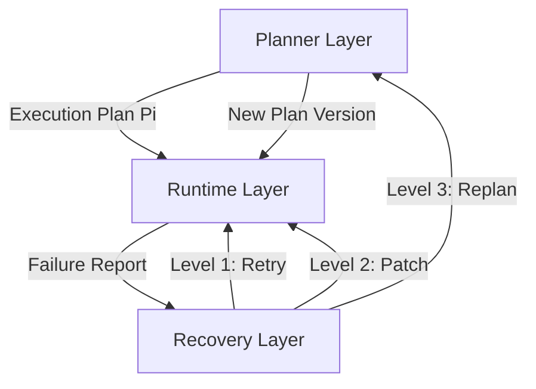
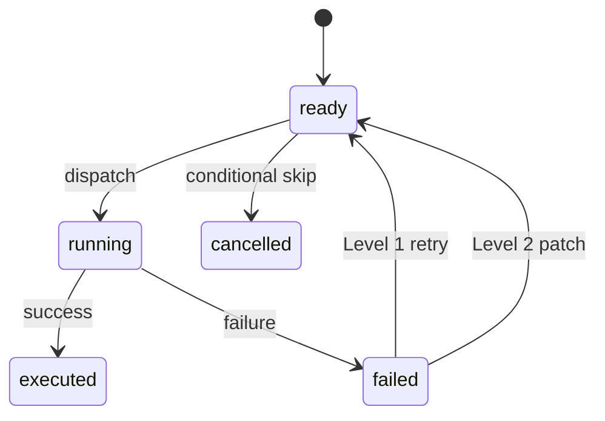

## 論文概要（Abstract）

本記事は [From Agent Loops to Structured Graphs: A Scheduler-Theoretic Framework for LLM Agent Execution](https://arxiv.org/abs/2604.11378) の解説記事です。

著者であるHu Weiは、ReActに代表されるAgent Loopパラダイムが持つ構造的弱点を指摘し、古典的なスケジューラ理論に基づく分析フレームワークを提案している。本論文はポジションペーパーであり、70のLLMエージェントシステムを体系的に調査した上で、制御フローを暗黙的なコンテキストから明示的な静的DAG（有向非巡回グラフ）へ昇格させるStructured Graph Harness（SGH）を設計提案として示している。実験結果の報告ではなく、理論的フレームワークと実験プロトコルの提示に焦点を当てた論文である。

この記事は [Zenn記事: LLMエージェント推論戦略の選び方：ReAct・ReWOO・Reflexionをタスク別に使い分ける](https://zenn.dev/0h_n0/articles/3d0a1247a810c5) の深掘りです。

## 情報源

- **arXiv ID**: 2604.11378
- **URL**: [https://arxiv.org/abs/2604.11378](https://arxiv.org/abs/2604.11378)
- **著者**: Hu Wei
- **発表年**: 2026
- **分野**: cs.AI（人工知能）, eess.SY（システムと制御）
- **ページ数**: 51ページ、図4点

## 背景と動機（Background & Motivation）

LLMエージェントの実行制御において、ReActに代表されるAgent Loopは事実上の標準パラダイムとなっている。Agent Loopでは、LLMが「Thought → Action → Observation」のサイクルを逐次的に繰り返し、文脈ウィンドウ内に蓄積された実行履歴に基づいて次の行動を決定する。

しかし著者は、このパラダイムが以下の3つの構造的弱点を抱えていると指摘している。

1. **暗黙のステップ依存関係**: 実行ステップ間の依存関係がプロンプトのコンテキスト内に埋没し、明示的に定義されていない。どのステップがどのステップの結果に依存しているかが不透明であり、デバッグや検証が困難になる。

2. **無限回復ループ**: エラー発生時にLLMが繰り返しリプラン（再計画）を試みるが、収束条件が定義されていないため、無限にリトライし続ける病理的パターンが発生しうる。

3. **可変実行履歴**: 実行コンテキストが時間とともに変化するため、「どの計画がどの行動を支配していたか」の監査証跡を残すことが困難であり、再現性と説明可能性が損なわれる。

関連するZenn記事で解説したReAct、Plan-and-Execute、ReWOO、Reflexionの各戦略は、このAgent Loopの枠組みの中で異なるトレードオフを選択しているが、著者はそれらの根底にある構造的問題は共通であると論じている。

## 主要な貢献（Key Contributions）

著者は以下の4つの貢献を主張している。

- **貢献1: スケジューラ統一フレームワーク**  
  Agent Loopを「単一レディユニットスケジューラ」（single-ready-unit scheduler）として形式化した。古典的なスケジューリング理論をLLMエージェント実行に適用し、非決定性ノードの課題を統一的に扱うフレームワークを構築している。

- **貢献2: 70システムの比較分析**  
  既存の70のLLMエージェントシステムを体系的に調査し、制御可能性（controllability）、表現力（expressiveness）、実装容易性（implementability）の3軸で分類・比較している。

- **貢献3: SGH（Structured Graph Harness）の設計提案**  
  制御フローを明示的な静的DAGに昇格させるフレームワークSGHを提案。ノード状態マシンによる終了保証と健全性保証を形式仕様として定義している。

- **貢献4: 7グループ実験プロトコル**  
  SGHの各設計決定の効果を分離評価するための実験プロトコルを設計している。ただし、実験の実施結果は報告されておらず、プロトコル提案にとどまっている。

## 技術的詳細（Technical Details）

### 実行システムの形式的モデル

著者は実行システムを以下のタプルとして定義している（Definition 3.1）。

$$
\mathcal{E} = (\mathcal{S}, \mathcal{U}, \mathcal{P}, \mathcal{O}, \Delta)
$$

ここで、
- $\mathcal{S}$: ノード状態の集合。各ノード $v$ は状態 $s_v \in \Sigma$ を持つ
- $\mathcal{U}$: レディセット関数。グローバル状態から実行可能なノード集合へのマッピング
- $\mathcal{P}$: スケジューリングポリシー（決定的関数または非決定的関係）
- $\mathcal{O}$: 結果空間 $= \{success, failure, retry, escalate\}$
- $\Delta$: 状態遷移関数。ノード状態の更新とレディセットの再計算を行う

### Agent Loopの形式化

著者はAgent Loopを「非決定的な単一レディユニットスケジューラ」として特徴づけている（Definition 3.2）。

$$
\forall s \in \mathcal{S}: |\mathcal{U}(s)| \leq 1
$$

つまり、Agent Loopでは各ステップにおいてLLMが正確に1つのアクションのみを生成する（$|\mathcal{U}| = 1$）。しかし、同一のコンテキスト状態であっても異なるアクションを返しうるため、ポリシー $\mathcal{P}$ は関数ではなく関係（非決定的）となる。

この形式化により、ReActやPlan-and-Executeといった既存パターンの制約が統一的に記述できる。

### スケジューラ連続体（Scheduler Continuum）

著者は、実行システムを特徴づける3つの軸を提示している（Section 3.4）。

1. **レディセットの濃度**: $|\mathcal{U}| = 1$（単一レディユニット）か $|\mathcal{U}| \geq 1$（複数レディユニット）か
2. **ポリシーの明示性**: 暗黙的 / プロンプトレベル / 状態機械レベル
3. **ポリシーの決定性**: 非決定的関係 / 関数的

この3軸により、既存システムの位置づけが明確になる。

### SGH（Structured Graph Harness）フレームワーク

SGHは以下の3つの設計原則（コアコミットメント）に基づく。

#### 原則1: バージョン内の不変実行計画

実行計画 $\Pi$ は以下のタプルとして定義される（Definition 5.1）。

$$
\Pi = (id, version, V, E, \sigma, \kappa)
$$

ここで、
- $id$: 計画の一意識別子
- $version$: バージョン番号
- $V, E$: DAGのノード集合と辺集合
- $\sigma: V \rightarrow \text{NodeConfig}$: 各ノードの設定へのマッピング
- $\kappa$: 計画レベルの出力契約

実行計画は「1つのバージョンの期間中は不変なコミットメント」であり、構造的な変更（ノードや辺の追加・削除）にはバージョンの更新が必要となる。これにより「どの計画がどのアクションを支配していたか」の監査証跡が保証される。

#### 原則2: 計画・実行・回復の3層分離



**Planner Layer（計画層）**: DAGトポロジの生成と実行計画 $\Pi$ の構築を担当する。

**Runtime Layer（実行層）**: トポロジカルスケジューリングに従いノードを実行し、レディセットを計算する。レディセットの計算式は以下の通り。

$$
\mathcal{U}(\mathcal{S}) = \{v \in V \mid s_v = \text{ready} \wedge \forall (u, v) \in E: s_u = \text{executed}\}
$$

すなわち、あるノードが「ready」状態であり、かつ全ての先行ノードが「executed」状態であるとき、そのノードは実行可能となる。

**Recovery Layer（回復層）**: エスカレーションプロトコルに基づく段階的な回復を担当する。

著者はさらに「コンテキスト分離」（Definition 5.3）を定義しており、実行コンテキスト（推論履歴を含み、後続ステップに影響しうる文脈）と診断コンテキスト（障害分析のための文脈で、実行には影響しない）を明示的に分離することで、回復処理が進行中の実行を汚染するのを防ぐ。

#### 原則3: 回復の厳格なエスカレーションプロトコル

著者は回復アクション $\mathcal{R}$ に3段階のエスカレーションレベルを定義している（Definition 6.3）。

| レベル | 名称 | 内容 | 適用場面 |
|--------|------|------|----------|
| Level 1 | Mechanical Retry | ノードの動作を変更せずリトライ | 一時的なインフラ障害 |
| Level 2 | Local Patching | ノード設定（プロンプト、パラメータ）を変更。DAG構造は不変 | 推論の失敗 |
| Level 3 | Full Replan | 新しいバージョンの計画を生成 | DAG構造自体が不適切な体系的障害 |

各レベルには明示的な進入・脱出条件が定義されている。Level 1とLevel 2を使い切らない限り、Level 3にエスカレートすることはできない。これにより「LLMが進展なくリプランを繰り返す失敗ループ病理」を防止する。

### ノード状態マシン

著者はノード状態 $\Sigma$ として以下の5つの状態を定義している（Definition 6.1）。



- **ready**: 前提条件が満たされ、ディスパッチ可能
- **running**: 現在実行中
- **executed**: 正常完了
- **failed**: 実行失敗
- **cancelled**: 条件分岐によりスキップ

著者は、明示的な公平性仮定のもとで終了保証と健全性保証が成り立つことを主張している。

### Agent Loop vs SGH: 実行パターンの比較

Agent Loopではレディセットが常に $|\mathcal{U}| = 1$ であるのに対し、SGHでは複数ノードの並列実行が可能である。

著者が論文中で示している動機付けの例では、Agent Loopが逐次実行する処理をSGHが並列化する様子が説明されている。例えば、2つの検索タスクを同時に実行（$|\mathcal{U}| = 2$）した後、2つのパッチ適用と1つのドキュメント生成を並列実行（$|\mathcal{U}| = 3$）するケースが挙げられている。

## アルゴリズム（Algorithm）

SGHの実行モデルをPythonで表現すると、以下のようなコードになる。これは論文の形式仕様に基づく筆者による実装例であり、論文中の実装コードではない点に注意されたい。

```python
from __future__ import annotations

from dataclasses import dataclass, field
from enum import Enum
from typing import Callable


class NodeState(Enum):
    """SGHにおけるノードの状態（Definition 6.1に対応）"""
    READY = "ready"
    RUNNING = "running"
    EXECUTED = "executed"
    FAILED = "failed"
    CANCELLED = "cancelled"


class EscalationLevel(Enum):
    """回復エスカレーションレベル（Definition 6.3に対応）"""
    MECHANICAL_RETRY = 1  # Level 1: インフラ障害向けリトライ
    LOCAL_PATCH = 2       # Level 2: プロンプト/パラメータ変更
    FULL_REPLAN = 3       # Level 3: DAG再構築


@dataclass
class Node:
    """DAG上の実行ノード

    Attributes:
        node_id: ノードの一意識別子
        state: 現在のノード状態
        config: ノード設定（プロンプト等）
        retry_budget: Level 1リトライの上限回数
        patch_budget: Level 2パッチの上限回数
    """
    node_id: str
    state: NodeState = NodeState.READY
    config: dict = field(default_factory=dict)
    retry_budget: int = 3
    patch_budget: int = 2


@dataclass
class ExecutionPlan:
    """不変実行計画（Definition 5.1に対応）

    Attributes:
        plan_id: 計画の一意識別子
        version: バージョン番号（構造変更時にインクリメント）
        nodes: ノードIDからNodeへのマッピング
        edges: 依存関係の辺集合 (src, dst)
    """
    plan_id: str
    version: int
    nodes: dict[str, Node]
    edges: set[tuple[str, str]]


def compute_ready_set(plan: ExecutionPlan) -> set[str]:
    """レディセットを計算する（SGHの核心）

    SGHでは |U| >= 1 が許容される（複数ノード並列実行）。
    Agent Loopでは常に |U| <= 1 となる点が構造的な違い。

    Args:
        plan: 現在の実行計画

    Returns:
        実行可能なノードIDの集合
    """
    predecessors: dict[str, set[str]] = {
        nid: set() for nid in plan.nodes
    }
    for src, dst in plan.edges:
        predecessors[dst].add(src)

    ready: set[str] = set()
    for nid, node in plan.nodes.items():
        if node.state != NodeState.READY:
            continue
        # 全先行ノードがEXECUTED状態であること
        all_predecessors_done = all(
            plan.nodes[pred].state == NodeState.EXECUTED
            for pred in predecessors[nid]
        )
        if all_predecessors_done:
            ready.add(nid)
    return ready


def handle_failure(
    node: Node,
    plan: ExecutionPlan,
    replan_fn: Callable[[ExecutionPlan], ExecutionPlan],
) -> tuple[EscalationLevel, ExecutionPlan]:
    """エスカレーションプロトコルに基づく障害処理

    Level 1 → Level 2 → Level 3 の順に段階的にエスカレートする。
    各レベルの予算を使い切るまで上位レベルには進まない。

    Args:
        node: 障害が発生したノード
        plan: 現在の実行計画
        replan_fn: Level 3で新計画を生成する関数

    Returns:
        (適用されたエスカレーションレベル, 更新後の計画)
    """
    if node.retry_budget > 0:
        # Level 1: 設定変更なしのリトライ
        node.retry_budget -= 1
        node.state = NodeState.READY
        return EscalationLevel.MECHANICAL_RETRY, plan

    if node.patch_budget > 0:
        # Level 2: ノード設定の変更（プロンプト修正等）
        node.patch_budget -= 1
        node.state = NodeState.READY
        return EscalationLevel.LOCAL_PATCH, plan

    # Level 3: 新しいバージョンの計画を生成
    new_plan = replan_fn(plan)
    return EscalationLevel.FULL_REPLAN, new_plan
```

このコードはSGHの核心的な概念 --- レディセット計算による複数ノード並列実行と、段階的エスカレーションによる有界回復 --- を表現している。Agent Loopとの決定的な違いは、`compute_ready_set`が返すノード数が1を超えうる点にある。

## 実装のポイント（Implementation Notes）

### LangGraphとの関連性

著者はLangGraphを「セミ決定的ポリシーを持つ複数レディユニットスケジューラ」として分類している。LangGraphではグラフトポロジがどのノードを並列実行できるかを制約するが、条件付きエッジのルーティングは実行時のLLM出力によって決定される。

SGHとLangGraphの比較を著者はTable 2で示している。

| 特性 | SGH | LangGraph |
|------|-----|-----------|
| グラフ可変性 | バージョン内で不変 | 実行時に変更可能 |
| ルーティング | 決定的（静的トポロジ） | LLM駆動（実行時決定） |
| 設計指針 | 制御可能性最大化 | 柔軟性最大化 |
| 回復メカニズム | 3段階エスカレーション | アドホック |

関連するZenn記事で解説したReWOOの「全ステップを事前生成し並列実行する」アプローチは、SGHの不変計画 + 複数レディユニット実行の考え方と親和性が高い。一方、ReActの逐次的な「Thought → Action → Observation」ループは、まさにSGHが問題視する単一レディユニットスケジューラそのものである。

### 並列性の種類

著者は2種類の並列性を区別している。

- **建設的並列性（Constructive parallelism）**: 全ブランチの完了が必要（all_of join）。SGHはこの種類のみをサポートする。
- **競合的並列性（Competitive parallelism）**: 1つのブランチの完了で十分（any_of join）。SGHは現時点ではサポートしていない。

この制約は設計上の意図的なトレードオフであり、制御可能性と予測可能性を維持するためである。

### 実装上の注意点

1. **DAGの妥当性検証**: 計画生成時にサイクルの不在を検証する必要がある。サイクルが存在するとトポロジカルソートが不可能になり、デッドロックが発生する。

2. **状態管理の永続化**: ノード状態の遷移を永続化することで、障害時のリカバリポイントが明確になる。Agent Loopではコンテキストウィンドウ内の暗黙的状態に依存するため、この永続化が困難である。

3. **コンテキスト分離の実装**: 実行コンテキストと診断コンテキストを物理的に分離するには、別のメモリストアやメッセージキューが必要になる。

## 70システム比較分析の結果

### システム分類

著者は70のLLMエージェントシステムを以下の5カテゴリに分類している。

| カテゴリ | 件数 | 割合 | 代表例 |
|----------|------|------|--------|
| Agent Loop | 41 | 60% | ReAct, AutoGPT |
| Event-driven | 11 | 16% | AutoGenスタイル |
| State-machine | 4 | 6% | --- |
| Graph/Flow orchestration | 5 | 7% | LangGraph, AFlow |
| Hybrid | 7 | 10% | TDP, Plan-and-Act |

注目すべきは、調査対象の60%がAgent Loopカテゴリに属している点である。著者はこれを「Agent Loopの支配的地位」として指摘し、その構造的弱点が広範なシステムに影響を及ぼしていると論じている。

### Agent Loopの3つの変種

著者はAgent Loopをさらに3つの変種に分類している。

1. **Naive Loop**: $|\mathcal{U}| = 1$、非決定的。最も基本的な形態
2. **Parallel Loop**: $|\mathcal{U}| \geq 1$（tool_calls による並列呼び出し）、非決定的。OpenAIのfunction callingによる複数ツール同時呼び出しが該当
3. **Planner Loop**: $|\mathcal{U}| = 1$、セミ決定的（構造化プロンプトによるLLMの制約）

### 13システムの7次元比較

著者はTable 5において、13の代表的システムを以下の7次元で比較している。

1. 複数レディユニットのサポート
2. 決定的ポリシー
3. 有界回復
4. 不変計画
5. 回復プロトコルの種類
6. 契約検証
7. 対象ドメイン

著者によれば、SGHは「複数レディユニットスケジューリング、決定的ポリシー、有界回復、不変計画バージョンの4つのコア制約を同時に満たす唯一のLLMエージェントシステム」であると主張されている。

### 設計原則のトレードオフ

著者は4つの設計原則とそのトレードオフを明示している。

- **原則1（制御可能性優先）**: 明示的・決定的なスケジューリングがLLM駆動のポリシー選択を置き換える。代償として、実行時トポロジ変更が必要な探索的タスクでの表現力を失う。

- **原則2（安定した実行コミットメント）**: 計画はバージョン内で不変。代償として、依存関係が不確定なタスクでの柔軟性が制限される。

- **原則3（有界回復）**: エスカレーションプロトコルに予算制限を設定。代償として、回復可能な障害を途中で諦める可能性がある。

- **原則4（副作用の分類）**: 冪等操作と永続的副作用を持つ操作を区別し、リトライ戦略を決定する。代償として、手動での分類作業が必要となる。

### 7グループ実験プロトコル

著者は各設計決定の効果を分離評価するための実験プロトコルを設計している。測定対象は以下の5つのゲイン変数である。

- $G_{\text{plan}}$: 明示的な計画からの利得
- $G_{\text{scaffold}}$: 構造化プロンプトからの利得
- $G_{\text{graph}}$: 複数レディユニットスケジューリングからの利得
- $G_{\text{patch}}$: Level 2回復からの利得
- $G_{\text{replan}}$: 有界Level 3回復からの利得

制御変数はタスクの複雑さ、LLMモデル、エラー注入であり、測定指標は有効性・効率性・安定性・観測可能性・帰属可能性の5つである。

著者は理論的予測として、$G_{\text{graph}} > 0$（複数レディユニットスケジューリングは計画品質とは独立に測定可能な利得を生む）かつ $G_{\text{graph}}$ はタスクの複雑さとともに増加する、と述べている。ただし、これらは未検証の予測であり、実験結果は報告されていない。

## 実運用への応用（Practical Applications）

### グラフベースフレームワークとの接続

本論文の分析フレームワークは、LangGraphやAutoGenといった既存ツールの設計判断を理解する上で有用な視座を提供している。

関連するZenn記事で解説した4つの推論戦略（ReAct、Plan-and-Execute、ReWOO、Reflexion）は、本論文のスケジューラ連続体上に以下のように位置づけられる。

| 戦略 | レディセット | ポリシー | SGHとの関連 |
|------|-------------|---------|------------|
| ReAct | $\|\mathcal{U}\| = 1$ | 非決定的 | 単一レディユニットスケジューラそのもの |
| Plan-and-Execute | $\|\mathcal{U}\| = 1$ | セミ決定的 | 計画層と実行層の分離を部分的に実現 |
| ReWOO | $\|\mathcal{U}\| \geq 1$ | セミ決定的 | 不変計画 + 並列実行でSGHに最も近い |
| Reflexion | $\|\mathcal{U}\| = 1$ | 非決定的 | メタ評価層は回復層に対応するが、エスカレーション制御がない |

### プロダクション設計への示唆

著者の分析に基づくと、プロダクション環境でのエージェント設計において以下の点が重要となる。

1. **回復戦略の明示化**: エラー時のリトライ予算とエスカレーション条件を事前に定義することで、コスト爆発を防止できる。Zenn記事で指摘した「Reflexionのコスト問題（基本戦略の3〜5倍）」は、SGHの有界回復により緩和される可能性がある。

2. **並列実行の活用**: 独立したサブタスクの特定とDAGトポロジによる表現は、ReWOOの並列実行パターンを構造化・一般化したものと解釈できる。

3. **監査証跡**: 不変計画バージョンにより、エージェントの行動に対する説明可能性が向上する。

## 関連研究（Related Work）

- **ReAct** (Yao et al., 2022): Thought-Action-Observationの逐次ループ。本論文のフレームワークでは単一レディユニット・非決定的スケジューラとして形式化され、SGHが解決を目指す構造的弱点の典型例として位置づけられている。

- **Plan-and-Execute** (Wang et al., 2023): 計画と実行の分離を導入。SGHの3層分離と設計思想を共有するが、計画の不変性保証やエスカレーションプロトコルは持たない。

- **LangGraph** (LangChain): グラフベースのエージェント実行フレームワーク。SGHと同じ複数レディユニット実行をサポートするが、実行時のグラフ変更を許容する点でSGHの不変性原則と異なる。著者はLangGraphを「柔軟性最大化」、SGHを「制御可能性最大化」と対比している。

- **TDP（Task-Decoupled Planning）**: 単一レディユニットだが可変DAGを持つハイブリッドアプローチ。SGHの計画バージョン不変性とエスカレーションプロトコルを欠く点で区別される。

- **AutoGen, CrewAI, Semantic Kernel**: 主に単一レディユニットでアドホックな回復メカニズムを持つシステム群。著者の分類では明示的なDAGスケジューリングを持たないとされている。

## まとめと今後の展望

本論文は、LLMエージェント実行の制御構造を古典的なスケジューラ理論の観点から分析する新たなフレームワークを提案している。Agent Loopの3つの構造的弱点（暗黙の依存関係、無限回復ループ、可変実行履歴）の指摘は、実務でエージェントシステムを構築する際の設計判断に有用な視座を提供する。

SGHの設計提案（不変計画、3層分離、エスカレーションプロトコル）は理論的には整合性が高いが、実験結果が報告されていないポジションペーパーであるため、実用上の有効性については今後の検証が待たれる。著者自身も、7グループ実験プロトコルの実施と工学的詳細の実装を今後の課題として明記している。

70システムの比較分析と分類体系は、エージェントフレームワーク選定の指針として参考になる。特にReAct（単一レディユニット・非決定的）からLangGraph（複数レディユニット・セミ決定的）への移行を検討する際に、制御可能性と表現力のトレードオフを理解する上で本論文のフレームワークは有益である。

## 参考文献

- **arXiv**: [https://arxiv.org/abs/2604.11378](https://arxiv.org/abs/2604.11378)
- **Related Zenn article**: [https://zenn.dev/0h_n0/articles/3d0a1247a810c5](https://zenn.dev/0h_n0/articles/3d0a1247a810c5)
- Yao, S. et al. (2022). "ReAct: Synergizing Reasoning and Acting in Language Models." arXiv:2210.03629
- Wang, L. et al. (2023). "Plan-and-Solve Prompting." ACL 2023
- LangChain. "LangGraph Documentation." [https://langchain-ai.github.io/langgraph/](https://langchain-ai.github.io/langgraph/)
