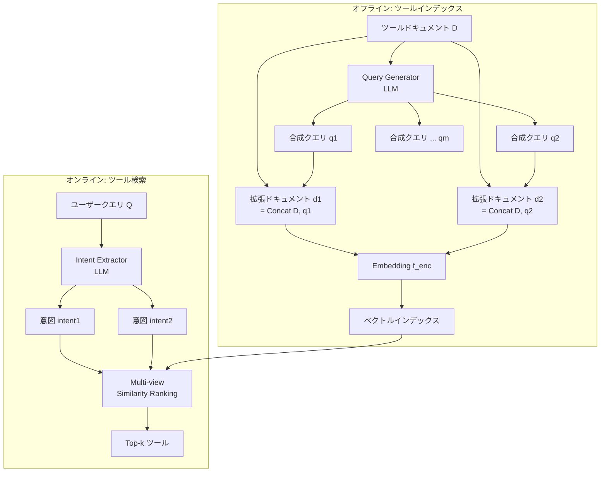

## 論文概要（Abstract）

本記事は [https://arxiv.org/abs/2408.01875](https://arxiv.org/abs/2408.01875) の解説記事です。

LLMベースの自律エージェントにおいて、ツールセットが拡大するにつれて適切なツールの選択が困難になる問題に対し、著者らは教師なしのツール検索手法Re-Invokeを提案している。Re-Invokeは、（1）インデックス時にツールドキュメントから多様な合成クエリを生成してドキュメントを拡張し、（2）推論時にユーザークエリからツール関連の意図を抽出し、（3）マルチビュー類似度ランキングで関連ツールを特定する。ToolEデータセットにおいて、単一ツール検索でnDCG@5を20%、マルチツール検索で39%向上させたと報告されている。

この記事は [Zenn記事: Bedrock AgentCoreで社内ヘルプデスクエージェントのツール選択精度と応答速度を最適化する](https://zenn.dev/0h_n0/articles/ae604dd7a92cc9) の深掘りです。

## 情報源

- **会議名**: EMNLP 2024 Findings（Findings of the Association for Computational Linguistics: EMNLP 2024）
- **年**: 2024年
- **URL**: [https://arxiv.org/abs/2408.01875](https://arxiv.org/abs/2408.01875)
- **著者**: Yanfei Chen, Jinsung Yoon, Devendra Singh Sachan, et al.（Google Cloud AI Research, Google DeepMind, Google）
- **ACL Anthology**: [2024.findings-emnlp.270](https://aclanthology.org/2024.findings-emnlp.270/)（pages 4705-4726）
- **発表形式**: Findings（メインカンファレンスの査読付き論文）

## カンファレンス情報

**EMNLP（Empirical Methods in Natural Language Processing）** は、自然言語処理分野の主要国際会議の1つであり、ACL、NAACLと並ぶトップカンファレンスとして位置づけられている。Findingsは、メインカンファレンスの査読基準を満たしつつも会場の制約により口頭発表に採択されなかった論文が掲載されるトラックであり、学術的な品質は本会議採択論文と同等とみなされている。

## 背景と動機

### ツール過負荷問題

LLMベースのエージェントが外部ツール（API、関数、サービス等）を活用する場面では、適切なツールを正確に選択することが不可欠である。ChatGPTプラグインやBard Extensions（現Gemini Extensions）など、LLMがサードパーティAPIに接続する仕組みが普及するにつれ、利用可能なツール数は急速に拡大している。

しかし、ツール数の増加は以下の3つの課題を引き起こす。

1. **入力トークン長の制約**: LLMにはコンテキストウィンドウの上限があり、数百〜数千のツールドキュメントをすべてプロンプトに含めることは不可能である。さらに、長大なコンテキストでは中間部分の情報が無視される「Lost in the Middle」問題が生じる（Liu et al., 2023）
2. **動的なツールプール**: 実運用環境ではツールの追加・更新・廃止が頻繁に発生する。教師あり検索モデルは学習データに含まれるツールにしか対応できず、新規ツールへの対応には再学習が必要となる
3. **曖昧なユーザー意図**: ユーザーは背景情報を含む冗長なクエリを送信することが多く、真の意図が埋没する。例えば「フランスへの旅行を計画中で、現地でフランス語のスキルを向上させたい」というクエリでは、「旅行手配」と「語学学習」という2つの意図が混在し、検索システムが誤って旅行ツールを選択してしまう（論文Figure 1より）

### 既存手法の限界

従来のツール検索は、大きく2つのアプローチに分かれる。

**教師あり手法**: ToolLLM（Qin et al., 2023）やGorilla（Patil et al., 2023）は、クエリ-ツールのラベル付きペアでSentence-BERTモデルを学習する。高い精度が期待できるが、ラベルデータの構築コストが高く、新規ツール追加のたびに再学習が必要となる。

**教師なし手法（HyDE等）**: HyDE（Gao et al., 2022）はLLMに仮想的なツールドキュメントを生成させ、ドキュメント間の類似度で検索する。しかし、著者らの実験では、仮想ドキュメントと実際のツールドキュメントの間に「概念ドリフト」が発生し、情報損失により性能が低下すると報告されている（論文Table 1より、HyDEはベースラインのDense Retrievalよりも低いnDCG@5を記録）。

## 主要な貢献

著者らは以下の3点を主要な貢献として報告している。

- **Query Generator（合成クエリ生成器）**: ツールドキュメントからLLMを用いて多様な合成クエリを自動生成し、ドキュメントを拡張する。これにより、ツール検索のためのベクトル表現が充実し、検索精度が向上する。教師ありデータは一切不要
- **Intent Extractor（意図抽出器）**: 推論時にユーザークエリからツール関連の意図を抽出し、背景情報やノイズを除去する。複数の意図が含まれるクエリにも対応可能
- **Multi-view Similarity Ranking（マルチビュー類似度ランキング）**: 抽出した各意図に対して独立にツールをランキングし、順位と類似度スコアの両方を考慮する順序関数で統合する。単一ビューのランキングでは捉えきれない複合的なツール要求に対応

## 技術的詳細

### Re-Invokeのアーキテクチャ

Re-Invokeは、オフラインのインデックス段階とオンラインの推論段階の2フェーズから構成される。



### Query Generator（合成クエリ生成）

ツールドキュメントは開発者が作成するため、記述が曖昧・不完全なケースが多い。既存のテキスト埋め込みモデルは情報検索タスク向けに設計されており、ツール利用とユーザークエリの意味的関係を正確に捉えられない場合がある。

Query Generatorは、各ツールドキュメント $d$ を入力としてLLM $\mathcal{L}$ に読み込ませ、そのツールで回答可能な多様な合成クエリ $\{q_1, q_2, \ldots, q_m\}$ を生成する。著者らの実験では $m = 10$ が最適と報告されている（論文Table 3(C)より）。

生成された各合成クエリは、元のツールドキュメントと連結されて拡張ドキュメントを形成する。

$$
d_i = \text{Concat}(d, q_i) = \text{``Documentation: } d \text{ Query: } q_i\text{''}
$$

ここで、
- $d$: 元のツールドキュメント（ツール名、説明、パラメータ等）
- $q_i$: LLMが生成した $i$ 番目の合成クエリ
- $d_i$: $i$ 番目の拡張ドキュメント

各拡張ドキュメントはEmbeddingモデル $f_{\text{enc}}$ でベクトル化され、ツールの表現として平均値が使用される。

$$
\mathbf{e}_d = \frac{1}{m} \sum_{i=1}^{m} f_{\text{enc}}(d_i)
$$

ここで $\mathbf{e}_d$ はツール $d$ の集約ベクトル表現であり、$m$ 個の拡張ドキュメントの埋め込みベクトルを平均したものである。

**多様性の確保**: 合成クエリの多様性を高めるために、LLMのサンプリング温度を高めに設定している。著者らはtext-bison@001モデルで温度0.7を使用し、複数回サンプリングすることで異なる観点のクエリを生成している。

### Intent Extractor（意図抽出）

ユーザークエリには、ツール選択に無関係な背景情報が含まれることが多い。例えば「今週末にニューヨークからサンフランシスコに旅行する予定です。フライトを予約してくれますか？あと、ダウンタウンの評判の良いレストランも探してください」というクエリでは、2つの独立した意図が含まれている。

Intent Extractorは、LLM $\mathcal{L}$ を用いてユーザークエリ $Q$ からツール関連の意図 $\{q_1, q_2, \ldots, q_n\}$ を抽出する。

$$
\{q_1, q_2, \ldots, q_n\} = \mathcal{L}(Q)
$$

著者らはtext-bison@001モデルを温度0.0（決定的生成）で使用し、再現性を確保している。抽出された各意図は、Embeddingモデル $f_{\text{enc}}$ で同一のベクトル空間にエンコードされる。

### Multi-view Similarity Ranking（マルチビュー類似度ランキング）

各意図が異なるツールを必要とする可能性があるため、すべての意図を1つのクエリにまとめて検索するのではなく、各意図に対して独立にツールをランキングする。

まず、各意図 $q_j$ と各ツールの集約ベクトル $\mathbf{e}_d$ の間のコサイン類似度を計算する。

$$
s(q_j, d) = \frac{f_{\text{enc}}(q_j) \cdot \mathbf{e}_d}{\|f_{\text{enc}}(q_j)\| \cdot \|\mathbf{e}_d\|}
$$

ここで、
- $s(q_j, d)$: 意図 $q_j$ とツール $d$ の類似度スコア
- $f_{\text{enc}}(q_j)$: 意図 $q_j$ のEmbeddingベクトル
- $\mathbf{e}_d$: ツール $d$ の集約ベクトル表現

次に、各意図内でツールを類似度スコア順にランキングし、各意図からトップ1のツールを選択する。このプロセスを繰り返し、指定数 $k$ のツールが取得されるまで続ける。

順序関数は、各意図内での**順位**と**類似度スコア値**の両方を考慮する。これにより、特定の意図に対して高い関連性を持つツールが優先的に選択される。

### アルゴリズムの擬似コード

論文Algorithm 1に基づくRe-Invokeの全体フローを以下に示す。

```python
from dataclasses import dataclass
import numpy as np
from numpy.typing import NDArray


@dataclass
class ToolDocument:
    """ツールドキュメントを表すデータクラス

    Attributes:
        name: ツール名
        description: ツールの説明
        parameters: パラメータ仕様（JSON Schema等）
    """
    name: str
    description: str
    parameters: dict


def re_invoke(
    query: str,
    tool_documents: list[ToolDocument],
    k: int,
    llm_generate: callable,
    embed: callable,
    m: int = 10,
) -> list[ToolDocument]:
    """Re-Invokeアルゴリズムの実装

    Args:
        query: ユーザークエリ
        tool_documents: ツールドキュメントのリスト
        k: 取得するツール数
        llm_generate: LLMによるテキスト生成関数
        embed: テキストをベクトルに変換する埋め込み関数
        m: ツールあたりの合成クエリ数（デフォルト: 10）

    Returns:
        関連度の高い上位kツールのリスト
    """
    # Phase 1: Query Generator（オフライン）
    tool_embeddings: dict[str, NDArray] = {}
    for doc in tool_documents:
        doc_text = f"{doc.name}: {doc.description}"
        expanded_vectors: list[NDArray] = []

        for _ in range(m):
            # 合成クエリを生成（温度0.7で多様性確保）
            synthetic_query = llm_generate(
                prompt=f"Generate a user query for this tool: {doc_text}",
                temperature=0.7,
            )
            # 拡張ドキュメントを作成
            expanded_doc = f"Documentation: {doc_text} Query: {synthetic_query}"
            expanded_vectors.append(embed(expanded_doc))

        # 平均ベクトルでツールを表現
        tool_embeddings[doc.name] = np.mean(expanded_vectors, axis=0)

    # Phase 2: Intent Extractor（オンライン）
    intents: list[str] = llm_generate(
        prompt=f"Extract tool-related intents from: {query}",
        temperature=0.0,  # 決定的生成
    ).split("\n")

    # Phase 3: Multi-view Similarity Ranking
    retrieved: list[ToolDocument] = []
    seen: set[str] = set()

    while len(retrieved) < k:
        for intent in intents:
            if len(retrieved) >= k:
                break
            intent_vec = embed(intent)

            # 各意図に対してツールをスコアリング
            scores = []
            for doc in tool_documents:
                if doc.name not in seen:
                    sim = _cosine_similarity(
                        intent_vec, tool_embeddings[doc.name]
                    )
                    scores.append((doc, sim))

            # スコア順にソートし、トップ1を選択
            scores.sort(key=lambda x: x[1], reverse=True)
            if scores:
                best_doc, _ = scores[0]
                retrieved.append(best_doc)
                seen.add(best_doc.name)

    return retrieved


def _cosine_similarity(a: NDArray, b: NDArray) -> float:
    """コサイン類似度を計算する

    Args:
        a: ベクトルA
        b: ベクトルB

    Returns:
        コサイン類似度（-1.0 ~ 1.0）
    """
    return float(np.dot(a, b) / (np.linalg.norm(a) * np.linalg.norm(b)))
```

## 実装のポイント

### Embeddingモデルの選択

著者らはGoogle Vertex AIの`textembedding-gecko@003`をEmbeddingモデルとして使用している。実装時の選択肢として以下を考慮する必要がある。

- **Vertex AI textembedding-gecko@003**: 論文で最も高い性能を記録。768次元のベクトルを出力
- **OpenAI text-embedding-3-small/large**: Vertex AIと同等の性能が期待できるが、API料金体系が異なる
- **Amazon Titan Text Embeddings V2**: AWS環境で利用する場合の選択肢。Bedrock経由で利用可能

### 合成クエリ数の最適化

論文Table 3(C)より、合成クエリ数と性能の関係は以下の通りである。

| 合成クエリ数 | ToolBench I1 | ToolBench I2 | ToolE single-tool |
|------------|-------------|-------------|------------------|
| 1 | 0.5962 | 0.3741 | 0.7388 |
| 5 | 0.6242 | 0.4091 | 0.7777 |
| 10 | 0.6286 | 0.4135 | 0.7813 |

5から10への改善幅は1から5への改善幅より小さいため、コストとのバランスを考慮すると5〜10が実用的な範囲と考えられる。

### 集約関数の選択

論文Table 3(D)より、拡張ドキュメントのEmbeddingを集約する際、平均値（Mean）が最大値（Max）を上回る。平均値は多様な合成クエリの情報を均等に反映するため、特定のクエリに偏らないロバストな表現が得られる。

### 実装時の注意点

1. **温度パラメータの使い分け**: Query Generator（温度0.7）とIntent Extractor（温度0.0）で異なる温度を使用する。多様性が必要なクエリ生成と、一貫性が必要な意図抽出で設計意図が異なる
2. **バッチ処理**: 合成クエリ生成はオフラインで実行するため、LLM APIのバッチ処理を活用してコストを削減できる
3. **インデックスの更新**: ツール追加時は新規ツールの合成クエリ生成とEmbedding計算のみで済み、既存ツールの再計算は不要

## Production Deployment Guide

Re-Invokeのツール検索システムをAWS上にデプロイする場合のアーキテクチャと設定を示す。

### AWS実装パターン（コスト最適化重視）

**トラフィック量別の推奨構成**:

| 構成 | トラフィック | 主要サービス | 月額概算 |
|------|-----------|-----------|---------|
| Small | ~100 req/日 | Lambda + Bedrock + OpenSearch Serverless | $80-200 |
| Medium | ~1,000 req/日 | ECS Fargate + Bedrock + OpenSearch | $400-900 |
| Large | 10,000+ req/日 | EKS + Spot + OpenSearch + ElastiCache | $2,500-6,000 |

**Small構成（Serverless）の詳細**:
- **Lambda**（256MB, ARM64）: 合成クエリ生成のバッチ処理 + 推論時のIntent抽出・検索
- **Amazon Bedrock**（Claude 3.5 Haiku）: 合成クエリ生成（オフライン）とIntent抽出（オンライン）
- **Amazon Bedrock Embeddings**（Titan Text Embeddings V2）: ツールドキュメントとIntentのベクトル化
- **OpenSearch Serverless**（Vector Engine）: 拡張ドキュメントのベクトルインデックス
- **DynamoDB**（On-Demand）: ツールメタデータとキャッシュ

**Large構成（Container）の詳細**:
- **EKS**（Karpenter + Spot Instances）: 推論サービスのオートスケーリング
- **OpenSearch Service**（3ノード, r6g.large.search）: ベクトルインデックスの高可用性
- **ElastiCache for Redis**（cache.r7g.large）: Intent抽出結果とランキング結果のキャッシュ
- **Bedrock Batch API**: 合成クエリの一括生成で50%コスト削減

**コスト削減テクニック**:
- Spot Instances活用: EKSワーカーノードで最大90%削減
- Bedrock Batch API: オフラインの合成クエリ生成で50%削減
- Prompt Caching: Intent抽出のシステムプロンプトキャッシュで30-90%削減
- OpenSearch Serverless: アイドル時自動スケールダウンで低トラフィック環境のコスト最適化

**コスト試算の注意事項**: 上記は2026年7月時点のAWS ap-northeast-1（東京）リージョン料金に基づく概算値である。実際のコストはトラフィックパターン、リージョン、バースト使用量により変動するため、最新料金は[AWS料金計算ツール](https://calculator.aws/)で確認を推奨する。

### Terraformインフラコード

**Small構成（Serverless）**:

```hcl
# Re-Invoke Tool Retrieval - Small構成 (Serverless)
# Lambda + Bedrock + OpenSearch Serverless

terraform {
  required_version = ">= 1.9"
  required_providers {
    aws = {
      source  = "hashicorp/aws"
      version = "~> 5.60"
    }
  }
}

provider "aws" {
  region = "ap-northeast-1"
}

# --- IAM Role (最小権限) ---
resource "aws_iam_role" "re_invoke_lambda" {
  name = "re-invoke-lambda-role"
  assume_role_policy = jsonencode({
    Version = "2012-10-17"
    Statement = [{
      Action = "sts:AssumeRole"
      Effect = "Allow"
      Principal = { Service = "lambda.amazonaws.com" }
    }]
  })
}

resource "aws_iam_role_policy" "re_invoke_policy" {
  name = "re-invoke-policy"
  role = aws_iam_role.re_invoke_lambda.id
  policy = jsonencode({
    Version = "2012-10-17"
    Statement = [
      {
        Effect = "Allow"
        Action = [
          "bedrock:InvokeModel",      # LLM呼び出し
          "bedrock:InvokeModelWithResponseStream"
        ]
        Resource = [
          "arn:aws:bedrock:ap-northeast-1::foundation-model/anthropic.claude-3-5-haiku-*",
          "arn:aws:bedrock:ap-northeast-1::foundation-model/amazon.titan-embed-text-v2*"
        ]
      },
      {
        Effect = "Allow"
        Action = [
          "aoss:APIAccessAll"  # OpenSearch Serverless
        ]
        Resource = "*"
      },
      {
        Effect   = "Allow"
        Action   = ["dynamodb:GetItem", "dynamodb:PutItem", "dynamodb:Query"]
        Resource = aws_dynamodb_table.tool_metadata.arn
      },
      {
        Effect   = "Allow"
        Action   = ["logs:CreateLogGroup", "logs:CreateLogStream", "logs:PutLogEvents"]
        Resource = "arn:aws:logs:*:*:*"
      }
    ]
  })
}

# --- DynamoDB (ツールメタデータ + キャッシュ) ---
resource "aws_dynamodb_table" "tool_metadata" {
  name         = "re-invoke-tool-metadata"
  billing_mode = "PAY_PER_REQUEST"  # On-Demand: 低トラフィック向けコスト最適化
  hash_key     = "tool_id"

  attribute {
    name = "tool_id"
    type = "S"
  }

  server_side_encryption {
    enabled = true  # KMS暗号化
  }

  point_in_time_recovery {
    enabled = true
  }
}

# --- Lambda関数 ---
resource "aws_lambda_function" "re_invoke_retriever" {
  function_name = "re-invoke-retriever"
  role          = aws_iam_role.re_invoke_lambda.arn
  handler       = "handler.lambda_handler"
  runtime       = "python3.12"
  architectures = ["arm64"]  # Graviton: 20%コスト削減
  memory_size   = 256
  timeout       = 30

  filename = "lambda_package.zip"

  environment {
    variables = {
      OPENSEARCH_ENDPOINT   = "https://collection-endpoint.aoss.amazonaws.com"
      DYNAMODB_TABLE        = aws_dynamodb_table.tool_metadata.name
      BEDROCK_MODEL_ID      = "anthropic.claude-3-5-haiku-20241022-v1:0"
      EMBEDDING_MODEL_ID    = "amazon.titan-embed-text-v2:0"
      NUM_SYNTHETIC_QUERIES = "10"
    }
  }

  tracing_config {
    mode = "Active"  # X-Ray有効化
  }
}

# --- CloudWatch アラーム (コスト監視) ---
resource "aws_cloudwatch_metric_alarm" "lambda_duration" {
  alarm_name          = "re-invoke-lambda-duration-high"
  comparison_operator = "GreaterThanThreshold"
  evaluation_periods  = 3
  metric_name         = "Duration"
  namespace           = "AWS/Lambda"
  period              = 300
  statistic           = "p95"
  threshold           = 25000  # 25秒
  alarm_description   = "Lambda実行時間P95が25秒超過"

  dimensions = {
    FunctionName = aws_lambda_function.re_invoke_retriever.function_name
  }
}
```

**Large構成（Container）**:

```hcl
# Re-Invoke Tool Retrieval - Large構成 (Container)
# EKS + Karpenter + Spot Instances

# --- EKSクラスタ ---
module "eks" {
  source  = "terraform-aws-modules/eks/aws"
  version = "~> 20.24"

  cluster_name    = "re-invoke-cluster"
  cluster_version = "1.31"

  vpc_id     = module.vpc.vpc_id
  subnet_ids = module.vpc.private_subnets

  cluster_endpoint_public_access = false  # セキュリティ: パブリックアクセス無効

  eks_managed_node_groups = {
    system = {
      instance_types = ["m7g.medium"]  # Graviton: コスト最適化
      min_size       = 1
      max_size       = 3
      desired_size   = 2
    }
  }
}

# --- Karpenter Provisioner (Spot優先) ---
resource "kubectl_manifest" "karpenter_nodepool" {
  yaml_body = yamlencode({
    apiVersion = "karpenter.sh/v1"
    kind       = "NodePool"
    metadata   = { name = "re-invoke-spot" }
    spec = {
      template = {
        spec = {
          requirements = [
            { key = "karpenter.sh/capacity-type", operator = "In", values = ["spot", "on-demand"] },
            { key = "node.kubernetes.io/instance-type", operator = "In",
              values = ["m7g.medium", "m7g.large", "m6g.medium", "m6g.large"] },
          ]
          nodeClassRef = { name = "default" }
        }
      }
      limits   = { cpu = "100", memory = "200Gi" }
      disruption = {
        consolidationPolicy = "WhenEmptyOrUnderutilized"
        consolidateAfter    = "30s"
      }
    }
  })
}

# --- AWS Budgets (予算アラート) ---
resource "aws_budgets_budget" "re_invoke_monthly" {
  name         = "re-invoke-monthly"
  budget_type  = "COST"
  limit_amount = "6000"
  limit_unit   = "USD"
  time_unit    = "MONTHLY"

  notification {
    comparison_operator       = "GREATER_THAN"
    threshold                 = 80
    threshold_type            = "PERCENTAGE"
    notification_type         = "FORECASTED"
    subscriber_email_addresses = ["ops-team@example.com"]
  }
}
```

### 運用・監視設定

**CloudWatch Logs Insights クエリ（コスト異常検知）**:

```
# 1時間あたりのBedrock呼び出し回数とトークン使用量
fields @timestamp, @message
| filter @message like /bedrock/
| stats count() as invocations,
        sum(input_tokens) as total_input_tokens,
        sum(output_tokens) as total_output_tokens
  by bin(1h)
| sort @timestamp desc
```

```
# Intent抽出のレイテンシ分析（P95, P99）
fields @timestamp, duration_ms, intent_count
| filter event = "intent_extraction"
| stats avg(duration_ms) as avg_latency,
        percentile(duration_ms, 95) as p95,
        percentile(duration_ms, 99) as p99,
        count() as requests
  by bin(1h)
```

**CloudWatch アラーム設定（Python）**:

```python
import boto3

cloudwatch = boto3.client("cloudwatch", region_name="ap-northeast-1")


def create_bedrock_token_alarm(
    function_name: str,
    threshold: float = 100000,
    sns_topic_arn: str = "",
) -> dict:
    """Bedrockトークン使用量スパイク検知アラームを作成する

    Args:
        function_name: Lambda関数名
        threshold: トークン数閾値（デフォルト: 10万トークン/5分）
        sns_topic_arn: 通知先SNSトピックARN

    Returns:
        CloudWatch PutMetricAlarm APIレスポンス
    """
    return cloudwatch.put_metric_alarm(
        AlarmName=f"{function_name}-bedrock-token-spike",
        MetricName="InputTokenCount",
        Namespace="AWS/Bedrock",
        Statistic="Sum",
        Period=300,
        EvaluationPeriods=2,
        Threshold=threshold,
        ComparisonOperator="GreaterThanThreshold",
        AlarmActions=[sns_topic_arn] if sns_topic_arn else [],
    )
```

**X-Rayトレーシング設定（Python）**:

```python
from aws_xray_sdk.core import xray_recorder, patch_all

# boto3の自動計装
patch_all()


def trace_re_invoke_retrieval(query: str, tool_count: int) -> None:
    """Re-Invoke検索のトレーシングにアノテーションとメタデータを記録する

    Args:
        query: ユーザークエリ
        tool_count: 検索対象ツール数
    """
    subsegment = xray_recorder.begin_subsegment("re_invoke_retrieval")
    subsegment.put_annotation("tool_count", tool_count)
    subsegment.put_annotation("intent_count", 0)  # 後で更新
    subsegment.put_metadata("query", query, "re_invoke")
    xray_recorder.end_subsegment()
```

**Cost Explorer自動レポート（Python）**:

```python
import boto3
from datetime import datetime, timedelta


def get_daily_cost_report(
    service_filter: list[str] | None = None,
    alert_threshold: float = 100.0,
    sns_topic_arn: str = "",
) -> dict:
    """日次コストレポートを取得し、閾値超過時にSNS通知する

    Args:
        service_filter: 対象サービス名リスト（デフォルト: Bedrock, Lambda, OpenSearch）
        alert_threshold: アラート閾値（USD/日、デフォルト: $100）
        sns_topic_arn: 通知先SNSトピックARN

    Returns:
        サービス別コスト辞書
    """
    if service_filter is None:
        service_filter = [
            "Amazon Bedrock", "AWS Lambda", "Amazon OpenSearch Service"
        ]

    ce = boto3.client("ce", region_name="us-east-1")
    today = datetime.utcnow().strftime("%Y-%m-%d")
    yesterday = (datetime.utcnow() - timedelta(days=1)).strftime("%Y-%m-%d")

    response = ce.get_cost_and_usage(
        TimePeriod={"Start": yesterday, "End": today},
        Granularity="DAILY",
        Metrics=["UnblendedCost"],
        Filter={
            "Dimensions": {
                "Key": "SERVICE",
                "Values": service_filter,
            }
        },
        GroupBy=[{"Type": "DIMENSION", "Key": "SERVICE"}],
    )

    costs: dict[str, float] = {}
    total = 0.0
    for group in response["ResultsByTime"][0]["Groups"]:
        service = group["Keys"][0]
        amount = float(group["Metrics"]["UnblendedCost"]["Amount"])
        costs[service] = amount
        total += amount

    if total > alert_threshold and sns_topic_arn:
        sns = boto3.client("sns", region_name="ap-northeast-1")
        sns.publish(
            TopicArn=sns_topic_arn,
            Subject=f"Re-Invoke Cost Alert: ${total:.2f}/day",
            Message=f"Daily cost ${total:.2f} exceeded ${alert_threshold}",
        )

    return costs
```

### コスト最適化チェックリスト

**アーキテクチャ選択**:
- [ ] トラフィック量に応じた構成選択（~100 req/日: Serverless、~1000 req/日: Hybrid、10000+ req/日: Container）
- [ ] ベクトルDBの選択（OpenSearch Serverless vs Managed vs セルフホスティング）

**リソース最適化**:
- [ ] EC2/EKS: Spot Instances優先（最大90%削減）
- [ ] Reserved Instances: 1年コミットで最大72%削減
- [ ] Savings Plans: コンピューティング全体での割引
- [ ] Lambda: ARM64（Graviton）+ メモリサイズ最適化
- [ ] EKS: Karpenterによるアイドル時スケールダウン
- [ ] OpenSearch: インスタンスタイプの適正化

**LLMコスト削減**:
- [ ] Bedrock Batch API: オフライン合成クエリ生成で50%削減
- [ ] Prompt Caching: Intent抽出のシステムプロンプトで30-90%削減
- [ ] モデル選択ロジック: 単純なクエリにはHaikuクラス、複雑なクエリにはSonnetクラスを使い分け
- [ ] トークン数制限: Intent抽出の出力トークンを制限（最大256トークン程度）
- [ ] キャッシュ層: 同一Intentの検索結果をElastiCacheにキャッシュ

**監視・アラート**:
- [ ] AWS Budgets: 月次予算アラート設定（80%/100%/120%）
- [ ] CloudWatch アラーム: Bedrockトークン使用量、Lambda実行時間
- [ ] Cost Anomaly Detection: MLベースのコスト異常検知を有効化
- [ ] 日次コストレポート: Cost Explorer APIで自動取得、SNS通知

**リソース管理**:
- [ ] 未使用リソース: 使われていないOpenSearchドメイン・Lambda関数の削除
- [ ] タグ戦略: `project:re-invoke`タグで全リソースを追跡
- [ ] ライフサイクルポリシー: DynamoDB TTLで古いキャッシュを自動削除
- [ ] 開発環境: 夜間・休日のEKSノード縮退（Karpenter disruption設定）
- [ ] ログ保持: CloudWatch Logsの保持期間設定（本番30日、開発7日）

## 実験結果

### ツール検索性能（nDCG@5）

著者らはToolBench（Qin et al., 2023）とToolE（Huang et al., 2023）の2つのベンチマークで評価を行っている。ToolBenchはRapidAPI hubから収集した16,000以上のAPIを含み、I1（単一ツール内API）、I2（同一カテゴリの複数ツール）、I3（異なるカテゴリの複数ツール）の3サブセットで構成される。ToolEは単一ツール検索とマルチツール検索の2つの評価設定を持つ。

**Dense Retrieval（Vertex AI Embedding）での結果**（論文Table 1より）:

| 手法 | バックボーンLLM | ToolBench I1 | I2 | I3 | ToolE single | ToolE multi |
|------|-------------|-------------|------|------|-------------|------------|
| Vertex AI（ベースライン） | - | 0.5962 | 0.3880 | 0.4633 | 0.6522 | 0.5296 |
| HyDE w/ Vertex AI | text-bison@001 | 0.4336 | 0.2221 | 0.2996 | 0.6558 | 0.4910 |
| **Re-Invoke** | text-bison@001 | 0.6110 | **0.5379** | **0.5955** | **0.7821** | **0.7231** |
| **Re-Invoke** | gpt-3.5-turbo | 0.6090 | 0.5068 | 0.5719 | 0.7705 | 0.6957 |
| **Re-Invoke** | Mistral-7B | **0.6150** | 0.5128 | 0.5771 | 0.7770 | 0.6959 |

ToolEデータセットにおいて、Re-Invoke（text-bison@001）はベースラインに対し、単一ツール検索で20%（0.6522 → 0.7821）、マルチツール検索で39%（0.5296 → 0.7231）の相対的な改善を達成している。

HyDEはベースラインよりも低い性能を示しており、仮想ドキュメント生成による概念ドリフトが検索精度を低下させることが示唆されている。

### エンドツーエンド性能（Pass Rate）

著者らはToolLLMのDFSDTエージェントにRe-Invokeを統合し、16,000以上のAPIプールからのツール選択を含むエンドツーエンド評価を行っている（論文Table 2より）。

| ツール検索手法 | I1-Inst | I1-Tool | I1-Cat | I2-Inst | I2-Cat | I3-Inst | 平均 |
|-------------|---------|---------|--------|---------|--------|---------|-----|
| None（参照ツール集合） | 39.70 | 44.72 | 47.50 | 64.50 | 55.33 | 61.00 | 52.13 |
| ToolLLM（教師あり） | 47.50 | 42.00 | 53.00 | 62.50 | 56.78 | 54.00 | 52.63 |
| **Re-Invoke（教師なし）** | **48.00** | **49.75** | **53.03** | **65.33** | **58.29** | **62.00** | **56.07** |

Re-Invokeは教師なしの手法であるにもかかわらず、教師ありのToolLLMの検索モデルを全サブセットで上回っている（平均Pass Rate: 56.07% vs 52.63%）。これは、適切なツールの検索がエージェントのタスク完了率に直接寄与することを示している。

### アブレーション結果

論文Table 3(A)より、各コンポーネントの寄与度は以下の通りである。

| コンポーネント | ToolE single-tool | ToolE multi-tool |
|-------------|------------------|-----------------|
| ベースライン（Dense Retrieval） | 0.6522 | 0.5296 |
| + Query Generator のみ | 0.7813（+19.8%） | 0.6906（+30.4%） |
| + Intent Extractor のみ | 0.6756（+3.6%） | 0.6258（+18.2%） |
| + 両方（Re-Invoke） | 0.7821（+19.9%） | 0.7231（+36.6%） |

Query Generatorはツールドキュメントの表現を充実させることで大幅な性能向上に貢献し、Intent Extractorはマルチツール検索で特に有効であることが確認されている。両者を組み合わせることで最高性能が達成される。

## 実運用への応用

### AgentCoreとの関連

Zenn記事で解説しているBedrock AgentCore GatewayのSemantic Tool Selectionは、Re-Invokeと同じ問題設定（大規模ツールセットからの適切なツール選択）に取り組んでいる。AgentCoreが提供するベクトルインデックスベースの動的ツール検索は、Re-Invokeのアプローチと以下の点で共通する。

- **ツールドキュメントのベクトル化**: AgentCoreはツール定義をEmbeddingベクトルに変換してインデックス化する。Re-InvokeのQuery Generatorによるドキュメント拡張は、このベクトル表現の品質を向上させる手法として位置づけられる
- **意図ベースの検索**: AgentCoreのSemantic SearchはユーザークエリのEmbeddingに基づいてツールを検索する。Re-InvokeのIntent Extractorは、この検索の前段階でクエリを精緻化する手法として応用可能である
- **スケーラビリティ**: AgentCoreは数百〜数千のツールを管理するGateway機能を提供しており、Re-Invokeの教師なしアプローチはツール追加時の運用コストを低減する

### 実運用時の考慮事項

1. **レイテンシ**: Intent抽出にLLM呼び出しが必要なため、推論時に50-200msの追加レイテンシが生じる。レイテンシ要件が厳しい場合は、Intent抽出結果のキャッシュや小型モデルの蒸留を検討する
2. **コスト**: ツールあたり10回のLLM呼び出し（合成クエリ生成）はオフラインで行えるが、大規模ツールセットでは生成コストが無視できない。Bedrock Batch APIの活用で50%削減可能である
3. **ツール更新頻度**: ツールドキュメントが更新された場合、該当ツールの合成クエリとEmbeddingのみ再計算すれば良く、全体の再インデックスは不要である

## 関連研究

- **ToolLLM**（Qin et al., 2023）: 16,000以上のAPIを含むToolBenchベンチマークを提案し、DFSDT（Depth-First Search-based Decision Tree）によるツール利用エージェントを構築した。教師ありのAPI検索モデルを学習しているが、Re-Invokeは教師なしで同等以上の性能を達成している
- **Gorilla**（Patil et al., 2023）: ツールドキュメントをBM25やGPT-Indexで検索してLLMのプロンプトに追加する手法を提案。ドキュメント検索とLLM推論を分離するアーキテクチャはRe-Invokeと共通するが、検索モデル自体の改善には注力していない
- **HyDE**（Gao et al., 2022）: LLMに仮想ドキュメントを生成させ、ドキュメント-ドキュメントの類似度で検索する。Re-Invokeの実験では、HyDEは概念ドリフトにより検索精度が低下することが示されている
- **Toolformer**（Schick et al., 2023）: LLMが自律的にツール利用を学習する手法。LLM自体のファインチューニングが必要であり、Re-Invokeの教師なしアプローチとは異なるアプローチである

## まとめと今後の展望

Re-Invokeは、合成クエリ生成によるドキュメント拡張とユーザー意図抽出を組み合わせた教師なしツール検索手法であり、ToolEデータセットでnDCG@5を20-39%向上させている。教師あり手法を上回るエンドツーエンド性能を達成している点は、ツール検索における教師なしアプローチの実用性を示す重要な成果である。

今後の研究方向として、著者らは合成クエリの品質向上（制御されたプロンプティングや反復的な改善）と、エージェントの実行結果をフィードバックとしたIntent抽出の改善を挙げている。実務的には、AgentCoreやMCPのようなツール管理基盤との統合により、大規模ツールセットの運用効率を向上させる方向が有望である。

## 参考文献

- **Conference URL**: [https://aclanthology.org/2024.findings-emnlp.270/](https://aclanthology.org/2024.findings-emnlp.270/)
- **arXiv**: [https://arxiv.org/abs/2408.01875](https://arxiv.org/abs/2408.01875)
- **Google Research Blog**: [https://research.google/blog/re-invoke-tool-invocation-rewriting-for-zero-shot-tool-retrieval/](https://research.google/blog/re-invoke-tool-invocation-rewriting-for-zero-shot-tool-retrieval/)
- **Related Zenn article**: [https://zenn.dev/0h_n0/articles/ae604dd7a92cc9](https://zenn.dev/0h_n0/articles/ae604dd7a92cc9)
