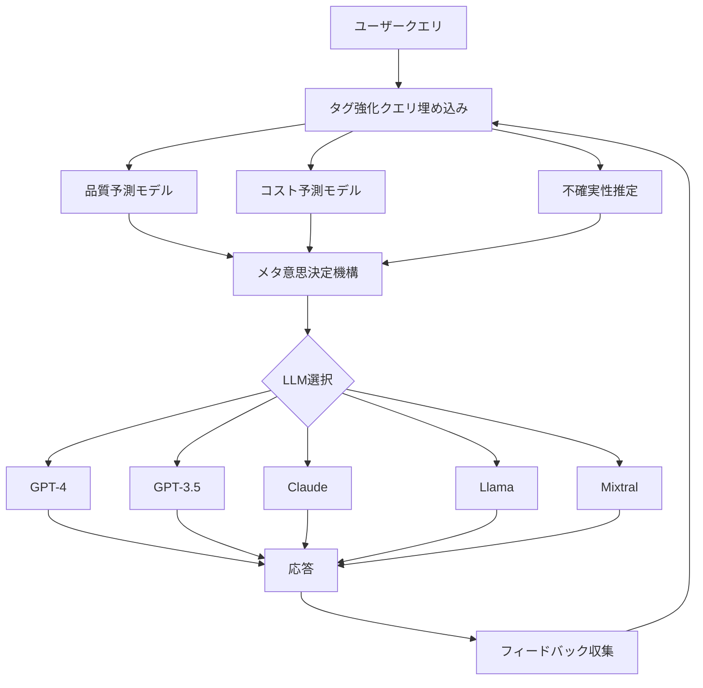

## 論文概要（Abstract）

本記事は <https://arxiv.org/abs/2502.18482> の解説記事です。

MixLLMは、複数のLLM（Large Language Model）へのクエリ割り当てを**コンテキストバンディット問題**として定式化し、品質とコストのトレードオフを動的に最適化するルーティングシステムである。著者らは、クエリタグによる埋め込み強化、LLM別の品質・コスト予測モデル、メタ意思決定機構の3つのコンポーネントを組み合わせることで、GPT-4の品質の97.25%を**コスト24.18%**で達成したと報告している。さらに、オンライン学習機構により、バイナリフィードバック（良い/悪い）のみからも継続的にルーティング精度を改善できる点が特徴である。

この記事は [Zenn記事: Portkey AI Gatewayで実現するLLMルーティング・フォールバック・コスト最適化](https://zenn.dev/0h_n0/articles/18db4ca22ca14d) の1次情報深掘りです。

## 情報源

- **会議名**: NAACL 2025（Annual Conference of the North American Chapter of the Association for Computational Linguistics）
- **URL**: <https://arxiv.org/abs/2502.18482>
- **著者**: Xinyuan Wang, Yanchi Liu, Wei Cheng, Xujiang Zhao, Zhengzhang Chen, Wenchao Yu, Yanjie Fu, Haifeng Chen
- **年**: 2025

## カンファレンス情報

NAACL（North American Chapter of the Association for Computational Linguistics）は、自然言語処理（NLP）分野における主要国際会議の一つである。ACL、EMNLPと並ぶトップカンファレンスとして位置づけられ、特に北米を中心とした研究コミュニティで高い評価を受けている。2025年のNAACLでは、LLMの効率的な運用やコスト最適化に関する研究が注目を集めており、本論文はその中でもマルチLLMルーティングという実用的な課題に取り組んだ研究である。

## 背景と動機

### LLMルーティングの課題

複数のLLMが利用可能な現在、各モデルには品質・コスト・レイテンシのトレードオフが存在する。GPT-4は高品質だがコストが高く、小型モデルは安価だが品質が劣る場合がある。実運用では以下の課題が生じる。

1. **クエリ依存性**: 同じLLMでもクエリの種類によって品質が大きく異なる（例：コード生成が得意なモデル vs. 翻訳が得意なモデル）
2. **コスト予測の困難さ**: 応答長がクエリとモデルの組み合わせで変動するため、事前のコスト見積もりが困難
3. **動的環境への適応**: 新しいLLMの追加やユーザー嗜好の変化に対応する必要がある
4. **レイテンシ制約**: 同時リクエスト時のキュー待ち時間がユーザー体験を大きく左右する

従来のアプローチ（AutoMixのカスケード方式やRouteLLMの二値分類）は、コスト最適化やマルチモデル対応に限界があった。著者らはこれらの課題を統合的に解決するため、コンテキストバンディットに基づくMixLLMを提案している。



## 主要な貢献

著者らは以下の3つの主要な貢献を報告している。

1. **タグ強化クエリ埋め込み**: InsTagシステムを用いてクエリにドメインタグを付与し、教師なしファインチューニングでドメイン内類似性とドメイン間分離性を同時に最適化する手法を提案
2. **統合的なルーティング定式化**: 品質・コスト・不確実性・レイテンシの4要素を単一のスコアリング関数に統合したメタ意思決定機構を設計。パラメータ $$\lambda$$ により品質重視/コスト重視を連続的に制御可能
3. **オンライン継続学習**: バイナリフィードバック（良い/悪い）のみから方策勾配法で動的にルーティングを改善する機構を実装。新しいLLMの追加にも適応的に対応

## 技術的詳細

### タグ強化クエリ埋め込み

MixLLMでは、まずInsTag（Llama-2 13Bベース）を用いてクエリに細粒度タグを付与し、それを20個の粗粒度ドメインに手動クラスタリングする。この分類情報を活用して、クエリ埋め込みモデルを教師なしファインチューニングする。

損失関数は、ドメイン内類似性損失 $$\mathcal{L}_{\text{intra}}$$ とドメイン間分離損失 $$\mathcal{L}_{\text{inter}}$$ の和で構成される。

$$
\mathcal{L} = \mathcal{L}_{\text{intra}} + \mathcal{L}_{\text{inter}}
$$

ここで、$$\mathcal{L}_{\text{intra}}$$ は同一ドメイン内のクエリ埋め込みをドメイン中心に近づけ、$$\mathcal{L}_{\text{inter}}$$ は異なるドメイン中心間の距離を最大化する。これにより、同種のクエリが埋め込み空間で密集し、異種クエリが分離されるため、下流の予測モデルの精度が向上する。

著者らはこの手法により、特に低コスト設定（$$\lambda \ll 1$$）で品質が5.72%向上したと報告している（論文Table 2より）。

### 品質・コスト予測モデル

各LLM $$l$$ に対して個別の予測モデルを訓練する。

**応答品質予測**: クエリ埋め込み $$e_n$$ から品質スコアを回帰予測する。

$$
\hat{p}_{n,l} = f_l^{rq}(e_n; \theta_l^{rq})
$$

ここで、$$\hat{p}_{n,l}$$ はクエリ $$n$$ に対するLLM $$l$$ の予測品質スコア（0-1スケール）、$$\theta_l^{rq}$$ は品質予測モデルのパラメータである。著者らはRandom Forestを品質予測モデルとして使用している。

**財務コスト予測**: 入力トークンコストと出力トークンコストの和として計算する。

$$
\hat{c}_{n,l} = (\text{len}_{n,l}^{\text{prm}} \times \text{price}_l^{\text{prm}}) + (\widehat{\text{len}}_{n,l}^{\text{res}} \times \text{price}_l^{\text{res}})
$$

ここで、$$\text{len}_{n,l}^{\text{prm}}$$ はプロンプト長（既知）、$$\text{price}_l^{\text{prm}}$$ はLLM $$l$$ の入力トークン単価、$$\widehat{\text{len}}_{n,l}^{\text{res}}$$ は応答長の予測値、$$\text{price}_l^{\text{res}}$$ は出力トークン単価である。

**応答長予測**: 応答長はクエリとLLMの組み合わせで大きく異なるため、専用のモデルで予測する。

$$
\widehat{\text{len}}_{n,l}^{\text{res}} = f_l^{rl}(e_n; \theta_l^{rl})
$$

著者らはLLMごとにMLP、Random Forest、KNNなどの組み合わせで最適なモデルを選択している。

### メタ意思決定機構

クエリ $$n$$ に対する各LLM $$l$$ のスコアリング関数は、品質-コストトレードオフ、不確実性ボーナス、レイテンシペナルティの3要素で構成される。

$$
s_{n,l} = s_{n,l}^{\text{trade}} + \alpha \cdot s_{n,l}^{\text{unc}} - \beta \cdot s_l^{\text{pen}}
$$

ここで、$$\alpha = 0.01$$（不確実性の重み）、$$\beta = 0.1$$（レイテンシペナルティの重み）である。

**品質-コストトレードオフ**: パラメータ $$\lambda$$ で品質重視度を制御する。

$$
s_{n,l}^{\text{trade}} = \frac{\lambda}{\lambda + 1} \cdot \hat{p}_{n,l} - \frac{1}{\lambda + 1} \cdot \hat{c}_{n,l}
$$

$$\lambda$$ が大きいほど品質を優先し、小さいほどコストを優先する。$$\lambda = 1$$ で品質とコストが等重要となる。

**不確実性ボーナス**: データが少ないLLM-クエリ組み合わせを探索するため、逆共分散行列を用いる（UCBに類似）。

$$
s_{n,l}^{\text{unc}} = e_n^T \cdot A_l^{-1} \cdot e_n
$$

ここで、$$A_l$$ は過去にLLM $$l$$ に割り当てられたクエリ埋め込みの共分散行列であり、オフライン学習で以下のように更新される。

$$
A_l := A_l + e_n^T \cdot e_n
$$

**レイテンシペナルティ**: 待ち時間が閾値を超えるLLMにペナルティを課す。

$$
s_l^{\text{pen}} = e^{\gamma \cdot (w_l - \xi \cdot \tau)}
$$

ここで、$$w_l$$ はLLM $$l$$ の現在の待ち時間、$$\tau = 30$$ 秒は最大許容待ち時間、$$\gamma = 0.1$$ はペナルティの増加速度、$$\xi$$ はペナルティ開始を制御するスケーリング係数である。最終的にスコアが最大のLLMが選択される。

$$
m_n^* = \arg\max_l(s_{n,l})
$$

### オンライン継続学習

オフライン学習だけでは、新しいドメインやLLMの追加に対応できない。MixLLMではバイナリフィードバック（良い/悪い）から方策勾配法でルーティングを改善する。

共有3層MLPにより動的フィードバックスコアを算出する。

$$
[s_{n,1}^{df}, s_{n,2}^{df}, \dots, s_{n,|M|}^{df}] = f^{df}(e_n; \theta^{df})
$$

このスコアに信頼度係数 $$\kappa_{n,l}$$ を乗じて最終スコアに加算する。

$$
s'_{n,l} = s_{n,l} + \kappa_{n,l} \cdot s_{n,l}^{df}
$$

$$
\kappa_{n,l} = \frac{1}{\text{Var}_n[s_{n,l}^{df}] + \epsilon}
$$

ここで、分散が小さいほど予測が安定しているため信頼度が高くなり、分散が大きいほど信頼度が低くなる。

方策勾配法による更新は以下の通りである。

$$
\theta^{df} := \theta^{df} - \eta_3 \cdot \nabla_{\theta^{df}} \log \pi(m_n^* | e_n; \theta^{df}) \cdot r_n
$$

ここで、$$\pi(l | e_n; \theta^{df}) = \frac{\exp(s_{n,l}^{df})}{\sum_k \exp(s_{n,k}^{df})}$$ は選択確率、$$r_n$$ はバイナリ報酬、$$\eta_3 = 0.001$$ は学習率である。

## アルゴリズム

以下はMixLLMのコアルーティングロジックの簡略化された実装例である。

```python
from dataclasses import dataclass
from typing import Protocol

import numpy as np


class QualityPredictor(Protocol):
    """LLM品質予測モデルのインターフェース."""

    def predict(self, query_embedding: np.ndarray) -> float:
        """クエリ埋め込みから品質スコア(0-1)を予測する."""
        ...


class LengthPredictor(Protocol):
    """応答長予測モデルのインターフェース."""

    def predict(self, query_embedding: np.ndarray) -> float:
        """クエリ埋め込みから応答トークン数を予測する."""
        ...


@dataclass(frozen=True)
class LLMConfig:
    """LLMの設定情報.

    Attributes:
        name: LLM識別名
        prompt_price: 入力トークン単価 (USD/token)
        response_price: 出力トークン単価 (USD/token)
    """

    name: str
    prompt_price: float
    response_price: float


@dataclass
class MixLLMRouter:
    """MixLLMルーティングエンジン.

    コンテキストバンディットに基づき、品質・コスト・不確実性・
    レイテンシを考慮してクエリを最適なLLMに割り当てる。

    Attributes:
        llm_configs: LLM設定のリスト
        quality_predictors: LLM別品質予測モデル
        length_predictors: LLM別応答長予測モデル
        covariance_matrices: LLM別共分散行列(不確実性推定用)
        lambda_param: 品質-コストトレードオフ制御パラメータ
        alpha: 不確実性ボーナスの重み (default: 0.01)
        beta: レイテンシペナルティの重み (default: 0.1)
        gamma: ペナルティ増加速度 (default: 0.1)
        max_wait: 最大許容待ち時間(秒) (default: 30.0)
    """

    llm_configs: list[LLMConfig]
    quality_predictors: dict[str, QualityPredictor]
    length_predictors: dict[str, LengthPredictor]
    covariance_matrices: dict[str, np.ndarray]
    lambda_param: float = 1.4
    alpha: float = 0.01
    beta: float = 0.1
    gamma: float = 0.1
    max_wait: float = 30.0

    def compute_trade_off_score(
        self, predicted_quality: float, predicted_cost: float
    ) -> float:
        """品質-コストトレードオフスコアを計算する.

        Args:
            predicted_quality: 予測品質スコア (0-1)
            predicted_cost: 予測コスト (USD)

        Returns:
            トレードオフスコア
        """
        lam = self.lambda_param
        quality_weight = lam / (lam + 1)
        cost_weight = 1 / (lam + 1)
        return quality_weight * predicted_quality - cost_weight * predicted_cost

    def compute_uncertainty_bonus(
        self, query_embedding: np.ndarray, llm_name: str
    ) -> float:
        """不確実性ボーナスを計算する (UCB的探索).

        Args:
            query_embedding: クエリ埋め込みベクトル
            llm_name: LLM識別名

        Returns:
            不確実性ボーナス値
        """
        a_inv = np.linalg.inv(self.covariance_matrices[llm_name])
        return float(query_embedding.T @ a_inv @ query_embedding)

    def compute_latency_penalty(self, current_wait: float) -> float:
        """レイテンシペナルティを計算する.

        Args:
            current_wait: 現在の待ち時間(秒)

        Returns:
            レイテンシペナルティ値
        """
        return float(np.exp(self.gamma * (current_wait - 0.8 * self.max_wait)))

    def route(
        self,
        query_embedding: np.ndarray,
        prompt_lengths: dict[str, int],
        current_waits: dict[str, float],
    ) -> str:
        """クエリを最適なLLMにルーティングする.

        Args:
            query_embedding: タグ強化済みクエリ埋め込みベクトル
            prompt_lengths: LLM別プロンプトトークン数
            current_waits: LLM別現在待ち時間(秒)

        Returns:
            選択されたLLMの識別名
        """
        best_llm = ""
        best_score = float("-inf")

        for config in self.llm_configs:
            name = config.name
            quality = self.quality_predictors[name].predict(query_embedding)
            pred_length = self.length_predictors[name].predict(query_embedding)
            cost = (
                prompt_lengths[name] * config.prompt_price
                + pred_length * config.response_price
            )
            trade_off = self.compute_trade_off_score(quality, cost)
            uncertainty = self.compute_uncertainty_bonus(query_embedding, name)
            penalty = self.compute_latency_penalty(current_waits.get(name, 0.0))
            score = trade_off + self.alpha * uncertainty - self.beta * penalty

            if score > best_score:
                best_score = score
                best_llm = name

        return best_llm

    def update_covariance(
        self, query_embedding: np.ndarray, selected_llm: str
    ) -> None:
        """選択されたLLMの共分散行列を更新する.

        Args:
            query_embedding: クエリ埋め込みベクトル
            selected_llm: 選択されたLLM識別名
        """
        e = query_embedding.reshape(-1, 1)
        self.covariance_matrices[selected_llm] += e @ e.T
```

## 実装のポイント

### 1. 予測モデルの選択

著者らは品質予測にRandom Forestを採用している。これは線形モデルやニューラルネットに比べて、少ないデータでも安定した予測が得られるためである。応答長予測では、LLMごとにMLP、Random Forest、KNNの中から最適なモデルを選択しており、モデルの応答特性に合わせた柔軟な設計が求められる。

### 2. 共分散行列の管理

不確実性推定に用いる共分散行列 $$A_l$$ は、クエリが割り当てられるたびに更新される。埋め込み次元が大きい場合、逆行列計算のコストが高くなるため、Sherman-Morrison公式による逐次更新が実用的である。

### 3. タグシステムの構築

InsTagによる細粒度タグ（数百カテゴリ）を20個の粗粒度ドメインにクラスタリングするステップは手動で行われている。実運用では、k-meansやトピックモデリングによる自動クラスタリングを検討すべきである。

### 4. ハイパーパラメータチューニング

- $$\lambda$$: 品質-コストのトレードオフ。著者らは $$\lambda = 1.4$$ でGPT-4品質の97.25%をコスト24.18%で達成
- $$\alpha$$: 探索度合い。大きすぎると未知のLLMに過度にルーティングされる
- $$\beta$$: レイテンシ感度。リアルタイムアプリケーションでは大きめに設定
- $$\tau$$: 最大許容待ち時間。著者らは30秒を使用

## Production Deployment Guide

### アーキテクチャパターン

MixLLMの本番デプロイでは、クエリ量とレイテンシ要件に応じて3つのパターンを推奨する。

| 要素 | Small（~100 QPS） | Medium（~1,000 QPS） | Large（~10,000 QPS） |
|---|---|---|---|
| ルーター | Lambda + API Gateway | ECS Fargate（2 vCPU） | EKS + HPA（GPU推論） |
| 埋め込みモデル | Lambda（コールドスタート許容） | ECS sidecar | 専用SageMaker Endpoint |
| 予測モデル | S3 + Lambda ロード | EFS マウント | Redis キャッシュ + モデルサーバー |
| 状態管理 | DynamoDB | DynamoDB + ElastiCache | Aurora + ElastiCache |
| モニタリング | CloudWatch Metrics | CloudWatch + Grafana | Prometheus + Grafana + PagerDuty |
| 月額概算 | ~$200 | ~$1,500 | ~$8,000+ |

### Terraform実装例（Small構成）

```hcl
# MixLLM Router - Small構成 (Lambda + API Gateway)
resource "aws_lambda_function" "mixllm_router" {
  function_name = "mixllm-router"
  runtime       = "python3.12"
  handler       = "router.handler"
  memory_size   = 1024
  timeout       = 30

  environment {
    variables = {
      MODEL_BUCKET     = aws_s3_bucket.models.id
      DYNAMODB_TABLE   = aws_dynamodb_table.routing_state.name
      LAMBDA_PARAM     = "1.4"
      MAX_WAIT_SECONDS = "30"
    }
  }
}

resource "aws_dynamodb_table" "routing_state" {
  name         = "mixllm-routing-state"
  billing_mode = "PAY_PER_REQUEST"
  hash_key     = "llm_name"

  attribute {
    name = "llm_name"
    type = "S"
  }
}

resource "aws_s3_bucket" "models" {
  bucket = "mixllm-prediction-models"
}

resource "aws_apigatewayv2_api" "router_api" {
  name          = "mixllm-router-api"
  protocol_type = "HTTP"
}
```

### Terraform実装例（Large構成）

```hcl
# MixLLM Router - Large構成 (EKS + SageMaker)
module "eks" {
  source          = "terraform-aws-modules/eks/aws"
  cluster_name    = "mixllm-cluster"
  cluster_version = "1.31"

  vpc_id     = module.vpc.vpc_id
  subnet_ids = module.vpc.private_subnets

  eks_managed_node_groups = {
    router = {
      instance_types = ["c7g.xlarge"]
      min_size       = 2
      max_size       = 20
      desired_size   = 4
    }
  }
}

resource "aws_sagemaker_endpoint_configuration" "embedding" {
  name = "mixllm-embedding-endpoint"

  production_variants {
    variant_name           = "primary"
    model_name             = aws_sagemaker_model.embedding.name
    instance_type          = "ml.g5.xlarge"
    initial_instance_count = 2

    serverless_config {
      max_concurrency = 50
      memory_size_in_mb = 4096
    }
  }
}

resource "aws_elasticache_replication_group" "routing_cache" {
  replication_group_id = "mixllm-cache"
  description          = "MixLLM routing state and model cache"
  engine               = "redis"
  node_type            = "cache.r7g.large"
  num_cache_clusters   = 2

  automatic_failover_enabled = true
}
```

### 運用・監視設定

MixLLMの本番運用では、以下のメトリクスを継続的に監視する必要がある。

```python
from dataclasses import dataclass, field


@dataclass
class RoutingMetrics:
    """ルーティング品質の監視メトリクス.

    Attributes:
        quality_scores: LLM別の品質スコア履歴
        cost_per_query: クエリあたりコスト履歴
        routing_distribution: LLM別ルーティング割合
        latency_p99: P99レイテンシ(秒)
    """

    quality_scores: dict[str, list[float]] = field(default_factory=dict)
    cost_per_query: list[float] = field(default_factory=list)
    routing_distribution: dict[str, int] = field(default_factory=dict)
    latency_p99: float = 0.0

    def check_quality_drift(self, threshold: float = 0.05) -> bool:
        """品質ドリフトを検出する.

        直近100件の平均品質が全体平均から閾値以上低下した場合にTrueを返す。

        Args:
            threshold: ドリフト検出閾値

        Returns:
            ドリフトが検出された場合True
        """
        for llm_name, scores in self.quality_scores.items():
            if len(scores) < 200:
                continue
            recent_avg = sum(scores[-100:]) / 100
            overall_avg = sum(scores) / len(scores)
            if overall_avg - recent_avg > threshold:
                return True
        return False
```

**アラート設定の推奨閾値**:
- 品質ドリフト: 直近100件の平均品質が全体平均から5%以上低下
- コスト異常: クエリあたりコストが過去7日平均の2倍を超過
- ルーティング偏り: 単一LLMへの集中度が80%を超過
- レイテンシ: P99が $$\tau$$ （30秒）の50%を超過

### コスト最適化チェックリスト

- [ ] $$\lambda$$ パラメータを業務要件に合わせて調整（コスト重視: 0.1-1.0、品質重視: 1.0-10.0）
- [ ] 応答長予測モデルの精度を定期的に検証（予測誤差が大きいとコスト見積もりが不正確に）
- [ ] 低コストLLMの品質が許容範囲内のクエリカテゴリを特定し、$$\lambda$$ をカテゴリ別に設定
- [ ] 新しいLLM（例: Llama 3.1系）の追加時にはオンライン学習フェーズを十分に確保
- [ ] バッチ処理可能なクエリは非同期キューに回してレイテンシペナルティを回避
- [ ] 共分散行列の定期的なリセット（古い探索データの影響を低減）

## 実験結果

### 全体性能

著者らはRouterBenchデータセット（36,497クエリ、8つのNLPデータセット、11のLLM候補）を用いて評価を行っている。

著者らは、$$\lambda = 1.4$$ の設定において、MixLLMがGPT-4の品質の**97.25%**をコスト**24.18%**で達成したと報告している。これは、比較対象のベースライン手法の中で最良のOptLLM（GPT-4品質の96.39%、コスト32.18%）を品質・コスト両面で上回る結果である（論文Figure 4より）。

### 継続学習の効果

論文Table 1より、オンライン学習の効果を示す。オフライン:オンラインのデータ比率別の品質スコアは以下の通りである。

| オフライン:オンライン比率 | オンライン学習なし | 精緻フィードバック | バイナリフィードバック |
|---|---|---|---|
| 80:20 | 75.54% | 76.45%（+1.21%） | 75.93%（+0.52%） |
| 50:50 | 71.98% | 72.99%（+1.39%） | 72.37%（+0.53%） |
| 30:70 | 69.74% | 71.29%（+2.22%） | 70.65%（+1.31%） |

オフラインデータが少ない条件（30:70）ほどオンライン学習の改善幅が大きく、データ不足を継続学習で補えることが示されている。

### タグ強化埋め込みの効果

論文Table 2より、タグ強化の効果はコストレベルによって異なる。

| コストレベル | 一般埋め込み | タグ強化埋め込み | 改善率 |
|---|---|---|---|
| Low（$$\lambda \ll 1$$） | 53.14% | 56.18% | +5.72% |
| Middle（$$1 \leq \lambda \leq 8$$） | 72.09% | 73.43% | +1.85% |
| High（$$\lambda \gg 8$$） | 75.76% | 76.36% | +0.79% |

低コスト設定で改善が大きい理由は、安価なLLM間での適切な選択にドメイン情報が特に有効であるためと著者らは分析している。

### ドメイン外汎化性能

論文Table 3より、未知ドメインへの汎化性能を示す。

| シナリオ | オフラインのみ | オフライン+オンライン | 低下率 |
|---|---|---|---|
| 通常（80:20） | 75.54% | 76.45% | -- |
| OOD（80:20） | 71.43% | 73.89% | 5.44% / 3.35% |

ドメイン外のクエリに対しては通常時より性能が低下するものの、オンライン学習により低下幅が5.44%から3.35%に縮小されている。

### 新規LLM追加時の適応

著者らは、Llama 3.1（8B, 70B）を候補に追加した実験において、MixLLMが**GPT-4品質の98.55%をコスト16.79%**で達成したと報告している（論文Figure 6より）。安価なLlama 3.1モデルの追加により、コスト効率が大幅に改善されている。

## 実運用への応用

### Portkey AI Gatewayとの関連

関連Zenn記事で紹介されている[Portkey AI Gateway](https://zenn.dev/0h_n0/articles/18db4ca22ca14d)は、複数LLMへのルーティング・フォールバック・負荷分散をプロダクションレベルで実現するツールである。MixLLMの研究知見をPortkeyと組み合わせることで、以下の応用が考えられる。

1. **品質予測モデルの統合**: Portkeyのルーティング設定にMixLLMの品質予測スコアを組み込み、静的な重み付けではなくクエリ依存の動的ルーティングを実現
2. **コスト予測による予算制御**: MixLLMの応答長予測を活用して、Portkeyのコスト制限機能をより精緻に制御
3. **フィードバックループの構築**: PortkeyのログデータからMixLLMのオンライン学習に必要なフィードバックを自動収集

### 実運用における留意事項

著者ら自身が指摘している制約として、以下の点がある。

- 訓練には精緻なフィードバック（品質スコア、コスト）が必要だが、実運用では常に利用可能とは限らない
- 新規ドメインのクエリに対してはルーティング精度が低下する
- 複数LLMを並列に呼び出して最良の応答を選択する戦略は未検討
- ハードウェアの考慮がレイテンシに限定されており、GPU利用率等のリソース制約は未考慮

## 関連研究

### RouteLLM (Ong et al., 2024)

品質の高いLLMと安価なLLMの二値分類によるルーティングを行う。MixLLMとの違いは、RouteLLMが2モデル間の選択に限定されるのに対し、MixLLMは任意数のLLM候補に対応する点である。

### OptLLM

コスト最適化を考慮した予測的ルーティング手法。MixLLMの直接的な比較対象であり、MixLLMは品質面で0.86ポイント、コスト面で8ポイント上回っている（GPT-4品質比で97.25% vs 96.39%、コスト比で24.18% vs 32.18%）。

### AutoMix (Madaan et al., 2024)

カスケード方式のルーティング手法。まず安価なLLMで応答し、品質が不十分な場合に高品質LLMへエスカレーションする。MixLLMとの違いは、AutoMixが逐次的な処理を前提とするのに対し、MixLLMは事前予測に基づく一発選択で低レイテンシを実現する点である。

### FrugalGPT (Chen et al., 2023)

LLMのカスケード利用によるコスト削減を目指す初期の研究。複数のLLMを順番に呼び出し、品質が十分な時点で停止する。MixLLMはカスケードではなく単一選択により、不要なAPI呼び出しを削減している。

## まとめと今後の展望

MixLLMは、複数LLMへのルーティングをコンテキストバンディット問題として統合的に定式化し、品質・コスト・不確実性・レイテンシの4要素を同時に最適化する手法である。著者らの実験結果は、GPT-4品質の97.25%をコスト24.18%で達成できることを示しており、マルチLLM環境でのコスト最適化に対する有望なアプローチである。

今後の展望として、以下の研究方向が考えられる。

1. **階層的ルーティング**: タスクカテゴリ→モデルファミリ→具体的モデルの多段階選択
2. **マルチモーダル対応**: テキスト以外（画像、音声、動画）のクエリへの拡張
3. **分散ルーティング**: 複数リージョンにまたがるLLMクラスタでの最適化
4. **プライバシー考慮**: センシティブなクエリをオンプレミスLLMに、汎用クエリをクラウドLLMにルーティングする方策

Portkey AI Gatewayのような実運用ツールとMixLLMの研究知見を組み合わせることで、コスト効率と品質を両立するLLM運用基盤の構築が現実的になりつつある。

## 参考文献

1. Wang, X., Liu, Y., Cheng, W., Zhao, X., Chen, Z., Yu, W., Fu, Y., & Chen, H. (2025). MixLLM: Dynamic Routing in Mixed Large Language Models. *NAACL 2025*. <https://arxiv.org/abs/2502.18482>
2. Ong, I., Srivatsa, A., Koh, J. Y., & Popa, R. A. (2024). RouteLLM: Learning to Route LLMs with Preference Data. *arXiv preprint*.
3. Madaan, A., Tandon, N., Gupta, P., Hallinan, S., Gao, L., Wiegreffe, S., ... & Clark, P. (2024). AutoMix: Automatically Mixing Language Models. *arXiv preprint*.
4. Chen, L., Zaharia, M., & Zou, J. (2023). FrugalGPT: How to Use Large Language Models While Reducing Cost and Improving Performance. *arXiv preprint*.
5. Hu, S., Lu, Z., & Liu, M. (2024). RouterBench: A Benchmark for Multi-LLM Routing System. *arXiv preprint*.
6. Lu, S., Bigoulaeva, I., Sacchi, R., Gurevych, I., & Glaser, I. (2023). InsTag: Instruction Tagging for Analyzing Supervised Fine-tuning of Large Language Models. *arXiv preprint*.
