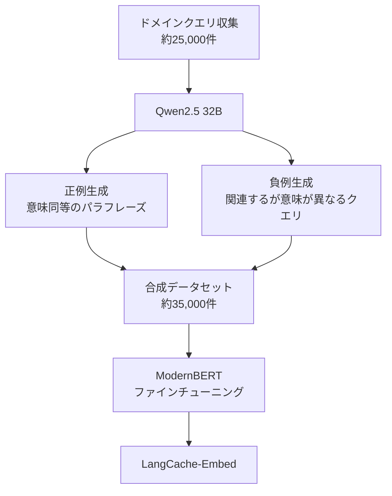

## 論文概要（Abstract）

本記事は [https://arxiv.org/abs/2504.02268](https://arxiv.org/abs/2504.02268) の解説記事です。

LLMの推論コストを削減する手法として注目されるセマンティックキャッシュにおいて、汎用Embeddingモデルではドメイン固有のクエリに対する精度が不十分であるという課題がある。著者らは、ModernBERT（149Mパラメータ）をベースに、ドメイン特化データで1エポックのみファインチューニングすることで、OpenAIやAmazon Titanなどの大規模プロプライエタリモデルを上回る精度を達成している。さらに、Qwen2.5（32Bパラメータ）を用いた合成データ生成パイプラインを提案し、ラベル付きデータが不足するドメインでもファインチューニングを可能にしている。医療ドメインでは、Precisionが78%から92%へ14ポイント向上し、Average Precisionは92%から97%へ改善された。

## 情報源

- **arXiv ID**: 2504.02268
- **URL**: [arXiv:2504.02268](https://arxiv.org/abs/2504.02268)
- **著者**: Waris Gill, Justin Cechmanek, Tyler Hutcherson, Srijith Rajamohan, Jen Agarwal, Muhammad Ali Gulzar, Manvinder Singh, Benoit Dion（Redis, Virginia Tech）
- **発表年**: 2025年4月
- **分野**: Computation and Language (cs.CL) / Artificial Intelligence (cs.AI)

## 背景と動機

### セマンティックキャッシュとは

LLMへのAPIコールはトークン単位の従量課金であり、同様の質問が繰り返し投げられる場面ではコストが線形に増大する。従来の完全一致キャッシュ（Exact Match Cache）は、文字列が完全に一致した場合のみキャッシュヒットとなるため、以下のようなケースではヒットしない。

- 「糖尿病の初期症状は？」と「糖尿病の最初の兆候は何ですか？」
- 「What are symptoms of diabetes?」と「What signs indicate diabetes?」

セマンティックキャッシュは、クエリをEmbeddingベクトルに変換し、ベクトル間のコサイン類似度が閾値を超えた場合にキャッシュヒットと判定する。これにより、意味的に同等だが表現の異なるクエリに対してもキャッシュが機能する。

### 既存手法の課題

汎用Embeddingモデル（OpenAI text-embedding-3-large、Cohere embed-english-v3など）は、一般的な文の類似度タスクでは高い性能を発揮するが、ドメイン固有のクエリでは以下の問題が生じる。

1. **False Positive（偽陽性）**: 「ドキシサイクリンで耳の感染症は治るか？」と「ドキシサイクリンの副作用は？」のように、同じ薬剤名を含むが意味が異なるクエリを同一と判定してしまう
2. **False Negative（偽陰性）**: 意味的に同等だがドメイン用語の表記揺れがあるクエリを別物と判定し、キャッシュヒットを逃す
3. **コスト対効果**: 7Bパラメータ級の大規模Embeddingモデル（gte-Qwen2-7B-instruct等）は高精度だが、推論コストがキャッシュの節約効果を相殺する

### なぜこの研究が重要か

Portkey AI Gatewayのようなゲートウェイサービスは、セマンティックキャッシュ機能を提供してLLMコストを削減している。しかし、キャッシュの精度が低ければ誤った応答を返すリスクがあり、精度が高すぎれば（閾値が厳しすぎれば）ヒット率が下がりコスト削減効果が薄れる。本論文は、小型かつ高精度なドメイン特化Embeddingモデルにより、このトレードオフを改善する具体的な手法を示している。

## 主要な貢献

著者らは以下の3点を主要な貢献として報告している。

1. **ドメイン特化ファインチューニングの有効性実証**: ModernBERT（149Mパラメータ）を1エポックのみファインチューニングすることで、7B級の大規模モデルやプロプライエタリモデルを上回る精度を達成した。医療ドメインでPrecision 0.92、F1 0.94を記録している
2. **合成データ生成パイプライン**: Qwen2.5（32B）を用いて、約25,000件の医療クエリから約35,000件の合成学習データを生成するパイプラインを構築した。合成データのみの学習でもPrecisionが78%から87%へ9ポイント向上している
3. **Catastrophic Forgetting回避手法**: 1エポック学習と勾配ノルム制御（0.5）の組み合わせにより、新ドメインへの適応と既存知識の保持を両立する手法を示した

## 技術的詳細

### Embeddingモデルのファインチューニング

#### ベースモデル: ModernBERT

著者らはModernBERT（149Mパラメータ）をベースモデルとして選択している。選択理由として、効率性と性能のバランスが優れている点を挙げている。比較対象にはBERT、NomicBERT、RoBERTa、MiniLM、MPNet、ALBERTが含まれる。

#### Online Contrastive Loss

学習にはSBERT（Sentence-BERT）フレームワークのOnline Contrastive Lossを使用している。この損失関数はバッチ全体を検査し、以下の「最も困難な」ペアに重点を置いて学習を行う。

- **Hard Positive**: コサイン類似度が低い（ベクトル空間で離れている）にもかかわらず、意味的に同等であるペア
- **Hard Negative**: コサイン類似度が高い（近い）にもかかわらず、意味的に異なるペア

クエリ $$q_i$$ と $$q_j$$ のEmbeddingをそれぞれ $$\mathbf{e}_i = f_\theta(q_i)$$、$$\mathbf{e}_j = f_\theta(q_j)$$ とする（$$f_\theta$$ はパラメータ $$\theta$$ のEmbeddingモデル）。コサイン類似度は次のように定義される。

$$
\text{sim}(\mathbf{e}_i, \mathbf{e}_j) = \frac{\mathbf{e}_i \cdot \mathbf{e}_j}{\|\mathbf{e}_i\| \cdot \|\mathbf{e}_j\|}
$$

ここで $$\mathbf{e}_i \cdot \mathbf{e}_j$$ は内積、$$\|\mathbf{e}_i\|$$ はL2ノルムである。

Online Contrastive Lossは、ラベル $$y \in \{0, 1\}$$（1: 同一意味、0: 異なる意味）に対して次のように定義される。

$$
\mathcal{L} = y \cdot \max(0, d(\mathbf{e}_i, \mathbf{e}_j) - m_p)^2 + (1 - y) \cdot \max(0, m_n - d(\mathbf{e}_i, \mathbf{e}_j))^2
$$

ここで $$d(\mathbf{e}_i, \mathbf{e}_j) = 1 - \text{sim}(\mathbf{e}_i, \mathbf{e}_j)$$ はコサイン距離、$$m_p$$ は正例ペアのマージン、$$m_n$$ は負例ペアのマージンである。

- 正例ペア（$$y=1$$）: 距離が $$m_p$$ を超える場合にペナルティを与え、ベクトルを近づける
- 負例ペア（$$y=0$$）: 距離が $$m_n$$ 未満の場合にペナルティを与え、ベクトルを引き離す

#### ハイパーパラメータ

著者らが報告しているハイパーパラメータは以下の通りである。

| パラメータ | 値 |
|---|---|
| エポック数 | 1 |
| 学習率 | $$6.538 \times 10^{-5}$$ |
| バッチサイズ | 16 |
| オプティマイザ | Adam |
| 勾配ノルム上限 | 0.5 |

1エポックかつ勾配ノルムを0.5に制限する理由は、Catastrophic Forgettingの回避にある。著者らの実験では、6エポックの学習でQuoraデータセットのPrecisionは+22%向上したが、医療データセットのPrecisionは-8%低下した（論文Figure 3より）。1エポック学習ではQuoraでの改善を維持しつつ、医療でも+4%の向上を達成している。

### 合成データ生成パイプライン

ドメイン固有のラベル付きデータが不足する場合に対応するため、著者らはLLMを用いた合成データ生成パイプラインを提案している。



#### Dual-Labeling戦略

**正例生成（is_duplicate=1）**: 元のクエリの意図を保持しつつ、異なる表現に言い換える。

- 元: 「What are the symptoms of early-stage diabetes?」
- 生成: 「How can I tell if someone has diabetes in its initial phase?」

**負例生成（is_duplicate=0）**: トピック的に関連するが、意味的に異なるクエリを生成する。

- 元: 「What are the symptoms of early-stage diabetes?」
- 生成: 「What are common health risks in children with type 1 diabetes?」

負例はランダムなペアではなく、意図的にトピックが近い（Hard Negative）ペアを生成する点が重要である。これにより、モデルは「同じ単語を含むが意味が異なるクエリ」を区別する能力を獲得する。

## アルゴリズム: セマンティックキャッシュの実装例

以下は、本論文のアプローチに基づくセマンティックキャッシュの実装例である。

```python
from __future__ import annotations

import hashlib
from dataclasses import dataclass, field
from typing import Optional

import numpy as np
from numpy.typing import NDArray


@dataclass
class CacheEntry:
    """セマンティックキャッシュの1エントリを表す。

    Attributes:
        query: 元のクエリ文字列
        embedding: クエリのEmbeddingベクトル
        response: キャッシュされたLLM応答
        hit_count: キャッシュヒット回数
    """

    query: str
    embedding: NDArray[np.float32]
    response: str
    hit_count: int = 0


@dataclass
class SemanticCache:
    """コサイン類似度ベースのセマンティックキャッシュ。

    ドメイン特化Embeddingモデルを使用して、意味的に同等な
    クエリに対してキャッシュヒットを判定する。

    Attributes:
        threshold: キャッシュヒット判定の類似度閾値
        max_size: キャッシュの最大エントリ数
        entries: キャッシュエントリのリスト
    """

    threshold: float = 0.85
    max_size: int = 10000
    entries: list[CacheEntry] = field(default_factory=list)

    def _cosine_similarity(
        self,
        vec_a: NDArray[np.float32],
        vec_b: NDArray[np.float32],
    ) -> float:
        """2つのベクトル間のコサイン類似度を計算する。

        Args:
            vec_a: 比較元のベクトル
            vec_b: 比較先のベクトル

        Returns:
            コサイン類似度（-1.0 ~ 1.0）
        """
        norm_a = np.linalg.norm(vec_a)
        norm_b = np.linalg.norm(vec_b)
        if norm_a == 0.0 or norm_b == 0.0:
            return 0.0
        return float(np.dot(vec_a, vec_b) / (norm_a * norm_b))

    def lookup(
        self,
        query_embedding: NDArray[np.float32],
    ) -> Optional[CacheEntry]:
        """キャッシュからセマンティックに一致するエントリを検索する。

        全エントリとのコサイン類似度を計算し、閾値を超える
        最も類似度の高いエントリを返す。

        Args:
            query_embedding: 検索クエリのEmbeddingベクトル

        Returns:
            一致するCacheEntry、またはキャッシュミス時はNone
        """
        best_entry: Optional[CacheEntry] = None
        best_similarity: float = self.threshold

        for entry in self.entries:
            similarity = self._cosine_similarity(
                query_embedding, entry.embedding
            )
            if similarity > best_similarity:
                best_similarity = similarity
                best_entry = entry

        if best_entry is not None:
            best_entry.hit_count += 1

        return best_entry

    def store(
        self,
        query: str,
        embedding: NDArray[np.float32],
        response: str,
    ) -> None:
        """新しいエントリをキャッシュに追加する。

        キャッシュが最大サイズに達している場合、
        ヒット数が最小のエントリを退避（evict）する。

        Args:
            query: クエリ文字列
            embedding: クエリのEmbeddingベクトル
            response: LLMの応答文字列
        """
        if len(self.entries) >= self.max_size:
            self._evict()

        self.entries.append(
            CacheEntry(
                query=query,
                embedding=embedding,
                response=response,
            )
        )

    def _evict(self) -> None:
        """ヒット数が最小のエントリを削除する。"""
        if not self.entries:
            return
        min_idx = min(
            range(len(self.entries)),
            key=lambda i: self.entries[i].hit_count,
        )
        self.entries.pop(min_idx)
```

上記の実装はナイーブな全探索であり、本番環境ではベクトルデータベース（Redis、Qdrant、Pinecone等）による近似最近傍探索を使用する。

## 実装のポイント

### 閾値設定の重要性

セマンティックキャッシュの性能は類似度閾値に大きく依存する。閾値の選択は以下のトレードオフを伴う。

| 閾値 | False Positive | False Negative | ヒット率 |
|---|---|---|---|
| 高い（0.95以上） | 低 | 高 | 低 |
| 中程度（0.85-0.90） | 中 | 中 | 中 |
| 低い（0.80以下） | 高 | 低 | 高 |

著者らのアプローチでは、ドメイン特化ファインチューニングにより、同じ閾値でもFalse Positiveを削減できるため、閾値を下げてヒット率を上げつつ精度を維持することが可能になる。

### False Positive対策

False Positiveは誤った応答をユーザーに返すリスクを伴うため、以下の対策が有効である。

1. **ドメイン特化ファインチューニング**: 本論文の核心であり、汎用モデルでは区別できない微妙な意味の差異を識別可能にする
2. **二段階検証**: Embeddingの類似度が閾値を超えた後、キーワードマッチングや意図分類器による追加検証を行う
3. **TTL（Time-To-Live）**: キャッシュエントリに有効期限を設定し、古い応答が返されるリスクを低減する
4. **キャッシュ無効化**: モデルの更新やデータの変更時にキャッシュを明示的にクリアする

### キャッシュ容量管理

大量のクエリを扱う場合、キャッシュの容量管理が課題となる。以下の退避戦略が考えられる。

- **LRU（Least Recently Used）**: 最も長くアクセスされていないエントリを削除
- **LFU（Least Frequently Used）**: 最もヒット数の少ないエントリを削除
- **TTL-based**: 有効期限切れのエントリを自動削除

## Production Deployment Guide

### AWS実装パターン

本論文のセマンティックキャッシュをAWS上に展開する場合、ワークロード規模に応じて以下の3パターンが考えられる。

| 構成 | 月間クエリ数 | Embeddingモデル | ベクトルDB | コンピュート | 月額概算（USD） |
|---|---|---|---|---|---|
| Small | ~100K | Lambda (SageMaker Serverless) | ElastiCache (Redis OSS) | Lambda | $150-300 |
| Medium | 100K-1M | ECS Fargate | Amazon MemoryDB for Redis | ECS Fargate | $800-2,000 |
| Large | 1M+ | EKS + GPU (g5.xlarge) | Redis Cluster (6ノード) | EKS | $3,000-8,000 |

### Small構成: Lambda + ElastiCache + DynamoDB

月間10万クエリ以下の場合、サーバーレス構成でコストを最小化する。

```hcl
# Terraform: Small構成 - セマンティックキャッシュ

terraform {
  required_version = ">= 1.5"
  required_providers {
    aws = {
      source  = "hashicorp/aws"
      version = "~> 5.0"
    }
  }
}

# VPC（既存VPCを使用する場合はdata sourceに置き換え）
resource "aws_vpc" "cache_vpc" {
  cidr_block           = "10.0.0.0/16"
  enable_dns_hostnames = true
  enable_dns_support   = true

  tags = {
    Name = "semantic-cache-vpc"
  }
}

resource "aws_subnet" "private" {
  count             = 2
  vpc_id            = aws_vpc.cache_vpc.id
  cidr_block        = "10.0.${count.index + 1}.0/24"
  availability_zone = data.aws_availability_zones.available.names[count.index]

  tags = {
    Name = "semantic-cache-private-${count.index}"
  }
}

data "aws_availability_zones" "available" {
  state = "available"
}

# ElastiCache (Redis OSS) - ベクトルストレージ
resource "aws_elasticache_replication_group" "semantic_cache" {
  replication_group_id = "semantic-cache"
  description          = "Semantic cache vector store"
  node_type            = "cache.r7g.large"
  num_cache_clusters   = 2
  engine               = "redis"
  engine_version       = "7.1"
  port                 = 6379
  subnet_group_name    = aws_elasticache_subnet_group.cache.name
  security_group_ids   = [aws_security_group.cache_sg.id]

  at_rest_encryption_enabled = true
  transit_encryption_enabled = true

  tags = {
    Service = "semantic-cache"
  }
}

resource "aws_elasticache_subnet_group" "cache" {
  name       = "semantic-cache-subnet"
  subnet_ids = aws_subnet.private[*].id
}

# DynamoDB - クエリログとメタデータ
resource "aws_dynamodb_table" "cache_metadata" {
  name         = "semantic-cache-metadata"
  billing_mode = "PAY_PER_REQUEST"
  hash_key     = "query_hash"
  range_key    = "timestamp"

  attribute {
    name = "query_hash"
    type = "S"
  }

  attribute {
    name = "timestamp"
    type = "N"
  }

  ttl {
    attribute_name = "expires_at"
    enabled        = true
  }

  tags = {
    Service = "semantic-cache"
  }
}

# Security Group
resource "aws_security_group" "cache_sg" {
  name_prefix = "semantic-cache-"
  vpc_id      = aws_vpc.cache_vpc.id

  ingress {
    from_port       = 6379
    to_port         = 6379
    protocol        = "tcp"
    security_groups = [aws_security_group.lambda_sg.id]
  }

  tags = {
    Service = "semantic-cache"
  }
}

resource "aws_security_group" "lambda_sg" {
  name_prefix = "semantic-cache-lambda-"
  vpc_id      = aws_vpc.cache_vpc.id

  egress {
    from_port   = 0
    to_port     = 0
    protocol    = "-1"
    cidr_blocks = ["0.0.0.0/0"]
  }

  tags = {
    Service = "semantic-cache"
  }
}

# Lambda - Embedding生成 + キャッシュ判定
resource "aws_lambda_function" "cache_handler" {
  function_name = "semantic-cache-handler"
  role          = aws_iam_role.lambda_role.arn
  handler       = "handler.lambda_handler"
  runtime       = "python3.12"
  timeout       = 30
  memory_size   = 1024

  filename = "lambda_package.zip"

  vpc_config {
    subnet_ids         = aws_subnet.private[*].id
    security_group_ids = [aws_security_group.lambda_sg.id]
  }

  environment {
    variables = {
      REDIS_HOST          = aws_elasticache_replication_group.semantic_cache.primary_endpoint_address
      SIMILARITY_THRESHOLD = "0.85"
      MODEL_NAME          = "langcache-embed-medical"
      DYNAMODB_TABLE      = aws_dynamodb_table.cache_metadata.name
    }
  }

  tags = {
    Service = "semantic-cache"
  }
}

resource "aws_iam_role" "lambda_role" {
  name = "semantic-cache-lambda-role"

  assume_role_policy = jsonencode({
    Version = "2012-10-17"
    Statement = [
      {
        Action = "sts:AssumeRole"
        Effect = "Allow"
        Principal = {
          Service = "lambda.amazonaws.com"
        }
      }
    ]
  })
}

resource "aws_iam_role_policy_attachment" "lambda_vpc" {
  role       = aws_iam_role.lambda_role.name
  policy_arn = "arn:aws:iam::aws:policy/service-role/AWSLambdaVPCAccessExecutionRole"
}
```

### Large構成: EKS + Redis Cluster

月間100万クエリ以上の場合、GPU推論とRedis Clusterによるスケーラブルな構成を採用する。

```hcl
# Terraform: Large構成 - EKS + Redis Cluster（主要リソース抜粋）

# EKS Cluster
resource "aws_eks_cluster" "semantic_cache" {
  name     = "semantic-cache-cluster"
  role_arn = aws_iam_role.eks_role.arn
  version  = "1.30"

  vpc_config {
    subnet_ids              = aws_subnet.private[*].id
    endpoint_private_access = true
    endpoint_public_access  = false
  }

  tags = {
    Service = "semantic-cache"
  }
}

# GPU Node Group - Embedding推論用
resource "aws_eks_node_group" "gpu_nodes" {
  cluster_name    = aws_eks_cluster.semantic_cache.name
  node_group_name = "gpu-embedding"
  node_role_arn   = aws_iam_role.node_role.arn
  subnet_ids      = aws_subnet.private[*].id
  instance_types  = ["g5.xlarge"]
  ami_type        = "AL2_x86_64_GPU"

  scaling_config {
    desired_size = 2
    max_size     = 6
    min_size     = 1
  }

  tags = {
    Service   = "semantic-cache"
    Component = "embedding-inference"
  }
}

# CPU Node Group - キャッシュロジック用
resource "aws_eks_node_group" "cpu_nodes" {
  cluster_name    = aws_eks_cluster.semantic_cache.name
  node_group_name = "cpu-cache-logic"
  node_role_arn   = aws_iam_role.node_role.arn
  subnet_ids      = aws_subnet.private[*].id
  instance_types  = ["m7i.xlarge"]

  scaling_config {
    desired_size = 3
    max_size     = 10
    min_size     = 2
  }

  tags = {
    Service   = "semantic-cache"
    Component = "cache-handler"
  }
}

# Redis Cluster (ElastiCache) - 6ノード構成
resource "aws_elasticache_replication_group" "redis_cluster" {
  replication_group_id = "semantic-cache-cluster"
  description          = "Redis cluster for semantic cache vectors"
  node_type            = "cache.r7g.xlarge"
  num_node_groups      = 3
  replicas_per_node_group = 1
  engine               = "redis"
  engine_version       = "7.1"
  port                 = 6379
  subnet_group_name    = aws_elasticache_subnet_group.cache.name
  security_group_ids   = [aws_security_group.redis_sg.id]

  at_rest_encryption_enabled = true
  transit_encryption_enabled = true
  automatic_failover_enabled = true

  tags = {
    Service = "semantic-cache"
  }
}

resource "aws_iam_role" "eks_role" {
  name = "semantic-cache-eks-role"

  assume_role_policy = jsonencode({
    Version = "2012-10-17"
    Statement = [
      {
        Action = "sts:AssumeRole"
        Effect = "Allow"
        Principal = {
          Service = "eks.amazonaws.com"
        }
      }
    ]
  })
}

resource "aws_iam_role" "node_role" {
  name = "semantic-cache-node-role"

  assume_role_policy = jsonencode({
    Version = "2012-10-17"
    Statement = [
      {
        Action = "sts:AssumeRole"
        Effect = "Allow"
        Principal = {
          Service = "ec2.amazonaws.com"
        }
      }
    ]
  })
}
```

### 運用・監視設定

セマンティックキャッシュの運用においては、以下のメトリクスを監視することが重要である。

| メトリクス | 説明 | アラート閾値 |
|---|---|---|
| cache_hit_rate | キャッシュヒット率 | < 30% で警告 |
| false_positive_rate | 誤ったキャッシュヒットの割合 | > 5% で警告 |
| embedding_latency_p99 | Embedding生成のP99レイテンシ | > 100ms で警告 |
| redis_memory_usage | Redisメモリ使用率 | > 80% で警告 |
| eviction_rate | キャッシュ退避率 | > 10%/h で警告 |

### コスト最適化チェックリスト

- [ ] Embeddingモデルのサイズが最小限か（149M vs 7Bで推論コスト50倍差）
- [ ] バッチ推論が可能な場面でリアルタイム推論を使用していないか
- [ ] Redis のメモリ容量が適切か（ベクトル次元数 x エントリ数 x 4バイト）
- [ ] TTLが設定されており、不要なエントリが自動削除されるか
- [ ] GPU インスタンスのスケーリングポリシーが適切か（夜間はスケールダウン）
- [ ] CloudFront等のCDNキャッシュと併用して、静的クエリをエッジで処理しているか
- [ ] Spot Instanceの活用（Embedding推論は中断耐性がある）
- [ ] Reserved InstanceまたはSavings Planの適用

## 実験結果

### データセット

著者らは2つのデータセットで評価を行っている。

| データセット | 学習データ | 評価データ | 特徴 |
|---|---|---|---|
| Quora | 323,491件 | 53,486件 | 一般的な質問の重複検出 |
| Medical | 2,438件 | 610件 | 11人の医療専門家のクエリ |

### 実験環境

著者らが報告した実験環境は、Amazon EC2 G6eインスタンス、48並列プロセス、384GB RAM、NVIDIA L40S GPU 4基（各48GB）である。

### 主要な結果

論文Table 1より、医療データセットでの各モデルの比較結果を示す。

| モデル | ソース | Precision | Recall | F1 | AP |
|---|---|---|---|---|---|
| OpenAI text-embedding-3-small | Closed | 0.83 | 0.89 | 0.86 | 0.94 |
| OpenAI text-embedding-3-large | Closed | 0.85 | 0.87 | 0.86 | 0.94 |
| OpenAI ada-002 | Closed | 0.77 | 0.90 | 0.83 | 0.91 |
| Amazon Titan-embed-v2 (1024) | Closed | 0.80 | 0.89 | 0.84 | 0.92 |
| Amazon Titan-embed-v2 (512) | Closed | 0.84 | 0.86 | 0.85 | 0.92 |
| Cohere embed-english-v3 | Closed | 0.78 | 0.83 | 0.81 | 0.88 |
| Linq-Embed-Mistral | Open | 0.84 | 0.93 | 0.88 | 0.96 |
| multilingual-e5-large-instruct | Open | 0.87 | 0.82 | 0.84 | 0.92 |
| SFR-Embedding-Mistral | Open | 0.80 | 0.90 | 0.85 | 0.92 |
| gte-modernbert-base | Open | 0.78 | 0.89 | 0.84 | 0.92 |
| **LangCache-Embed-Synthetic** | Open | **0.87** | **0.90** | **0.89** | **0.95** |

著者らが報告したところによれば、LangCache-Embed（ファインチューニング済みModernBERT）は以下の改善を達成している。

- **Quora**: Average Precisionが76%から92%へ16ポイント向上
- **Medical**: Average Precisionが92%から97%へ5ポイント向上
- **Medical Precision**: 78%から92%へ14ポイント向上
- 合成データのみの学習でも、Precisionが78%から87%へ9ポイント向上

### Catastrophic Forgetting分析

論文Figure 3より、ファインチューニングのエポック数がCatastrophic Forgettingに与える影響が示されている。

| 条件 | Quora Precision変化 | Medical Precision変化 |
|---|---|---|
| 6エポック（過剰学習） | +22% | **-8%**（Catastrophic Forgetting） |
| 1エポック + 勾配ノルム0.5 | 改善維持 | **+4%**（知識保持） |

この結果は、セマンティックキャッシュのようなタスク特化のファインチューニングでは、大規模な学習が必ずしも有益ではなく、最小限の学習で既存知識を保持することの重要性を示している。

## 実運用への応用: Portkey AI Gatewayとの関連

[Zenn記事: Portkey AI Gatewayで実現するLLMルーティング・フォールバック・コスト最適化](https://zenn.dev/0h_n0/articles/18db4ca22ca14d)で紹介されているPortkey AI Gatewayは、セマンティックキャッシュ機能を含むLLMゲートウェイサービスである。本論文の知見は、以下の点でPortkeyの運用改善に応用可能である。

### キャッシュ精度の向上

Portkeyが内部で使用するEmbeddingモデルを、本論文のアプローチでドメイン特化ファインチューニングすることで、キャッシュの精度を向上させられる。特に、特定の業界（医療、法務、金融等）向けのLLMアプリケーションでは、汎用Embeddingでは区別できない微妙な意味の差異が存在するため、ファインチューニングの効果が大きい。

### コスト最適化の二重効果

1. **LLMコールの削減**: セマンティックキャッシュのヒット率向上により、LLMへのAPIコール数が減少する
2. **Embedding推論コストの削減**: 149Mパラメータの小型モデルは、7B級のモデルと比較して推論コストが大幅に低い

### ルーティングとの組み合わせ

Portkeyのルーティング機能と組み合わせることで、以下のフローが実現できる。

1. クエリ受信 → セマンティックキャッシュ判定
2. キャッシュヒット → キャッシュ応答を返却（コスト0）
3. キャッシュミス → Portkeyのルーティングに基づき、コスト/性能に応じたLLMモデルにリクエスト
4. LLM応答をキャッシュに保存

## 関連研究

1. **GPTCache（Bang, 2023）**: セマンティックキャッシュのフレームワークとして初期に提案されたもの。汎用Embeddingモデルを使用しており、ドメイン特化の課題は未解決である

2. **MeanCache（Gill et al., 2025）**: セマンティックキャッシュの効率性を分析した研究。キャッシュヒット率とレスポンスタイムのトレードオフを定量的に評価している

3. **Sentence-BERT（Reimers & Gurevych, 2019）**: 本論文のファインチューニングに使用されているSBERTフレームワーク。Online Contrastive Lossの提案元である

4. **ModernBERT（Warner et al., 2024）**: 本論文のベースモデル。149Mパラメータでありながら、MTEBベンチマークで競争力のある性能を示す

5. **HuatuoGPT-o1（Chen et al., 2024）**: 本論文の医療データセットの元となった医療クエリデータセット。約25,000件の公開医療クエリと推論を含む

## まとめと今後の展望

### まとめ

本論文は、セマンティックキャッシュにおけるEmbeddingモデルのドメイン特化ファインチューニングが、大規模プロプライエタリモデルを上回る精度を達成できることを示した。主な知見は以下の通りである。

- 149Mパラメータの小型モデルが、適切なファインチューニングにより7B級モデルやOpenAI/Amazon/Cohereのプロプライエタリモデルを上回る
- 1エポックの学習と勾配ノルム制御により、Catastrophic Forgettingを回避しつつドメイン適応が可能
- LLMによる合成データ生成パイプラインにより、ラベル付きデータが不足するドメインでもファインチューニングが実施可能

### 今後の展望

- **マルチドメイン対応**: 複数ドメインに同時に適応するEmbeddingモデルの開発
- **動的閾値調整**: ドメインやクエリの特性に応じて閾値を動的に調整する手法
- **増分学習**: 新しいドメインデータが追加された際に、全体を再学習することなくモデルを更新する手法
- **評価データの自動生成**: 合成データパイプラインを評価データの生成にも応用し、継続的なモデル品質の監視を行う

## 参考文献

1. Gill, W., Cechmanek, J., Hutcherson, T., Rajamohan, S., Agarwal, J., Gulzar, M.A., Singh, M., & Dion, B. (2025). Advancing Semantic Caching for LLMs with Domain-Specific Embeddings and Synthetic Data. arXiv:2504.02268
2. Bang, J. (2023). GPTCache: An Open-Source Semantic Cache for LLM Applications.
3. Gill, W. et al. (2025). MeanCache: User-Centric Semantic Caching for LLM Web Services.
4. Reimers, N., & Gurevych, I. (2019). Sentence-BERT: Sentence Embeddings using Siamese BERT-Networks. EMNLP 2019
5. Warner, B. et al. (2024). ModernBERT: Smarter, Better, Faster.
6. Chen, J. et al. (2024). HuatuoGPT-o1: Medical Complex Reasoning with Verifiable Chain-of-Thought.
7. Muennighoff, N. et al. (2023). MTEB: Massive Text Embedding Benchmark. EACL 2023
