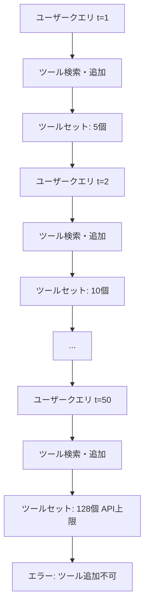
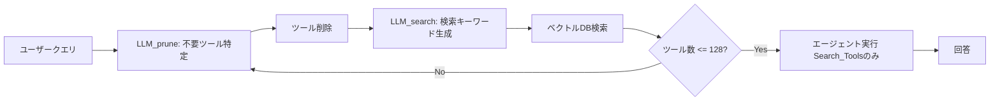

## 論文概要（Abstract）

本記事は [https://arxiv.org/abs/2507.21428](https://arxiv.org/abs/2507.21428) の解説記事です。

LLMエージェントが数百〜数千のツールを利用するマルチターン対話において、固定コンテキストウィンドウが有効性を制限する問題に取り組んだ研究である。著者らは、ツールコンテキストの動的管理フレームワーク「MemTool」を提案し、3つの動作モード（Autonomous Agent Mode、Workflow Mode、Hybrid Mode）を定義している。ScaleMCPベンチマーク（5,000ツール）上で13以上のLLMを用いた100連続ユーザーインタラクション実験を行い、高性能推論モデルはAutonomous Modeでツール削除効率90-94%を達成した一方、中規模モデルでは0-60%に留まったと報告している。Workflow ModeおよびHybrid Modeは、モデル能力に依存せず一貫して90%以上の削除効率を実現している。

この記事は [Zenn記事: Bedrock AgentCoreで社内ヘルプデスクエージェントのツール選択精度と応答速度を最適化する](https://zenn.dev/0h_n0/articles/ae604dd7a92cc9) の深掘りです。

## 情報源

- **arXiv ID**: 2507.21428
- **URL**: [arXiv:2507.21428](https://arxiv.org/abs/2507.21428)
- **著者**: Elias Lumer, Anmol Gulati, Vamse Kumar Subbiah, et al.
- **発表年**: 2025年7月
- **分野**: Computation and Language (cs.CL)

## 背景と動機

### コンテキストウィンドウとツール過負荷問題

Andrej Karparyの比喩「LLMはCPU、コンテキストウィンドウはRAM（作業メモリ）」が示すとおり、LLMの動作はすべてコンテキストウィンドウ内で完結する。現代のLLMは100K〜1Mトークンのコンテキストを持つが、マルチターンエージェントが100回以上の連続対話を処理する場合、以下の問題が顕在化する。

1. **ツール蓄積**: 各ターンで新しいツールを検索・追加するが、不要になったツールを削除する仕組みがない
2. **API制限**: 多くのLLMプロバイダはfunction callingで同時に利用できるツール数に上限を設けている（例: 128ツール）
3. **精度低下**: コンテキスト内のツール数が増えるにつれ、ツール選択の精度が低下する

### 既存研究のギャップ

既存の短期メモリ研究は、**会話メッセージの圧縮**（要約・切り詰め）に焦点を当てており、動的なツールコンテキスト管理は扱っていない。RAGベースのツール検索（Agentic RAG）はツールの**追加**には対応しているが、不要ツールの**削除**メカニズムを持たない。著者らは、この「ツール削除」の欠如が100ターン以上のセッションでボトルネックになると指摘している。



### なぜこの研究が重要か

チャットボット、音声アシスタント、ビデオインタラクションなど、セッションベースのアプリケーションでは、エージェントが数百〜数千の検索可能ツールの中からコンテキストウィンドウを効率的に管理する能力が不可欠である。MemToolは、既存のLLMを修正なしに利用するplug-and-playアプローチを採用しており、OpenAI、Google、Anthropic、Metaの商用モデルに即座に適用可能である。

## 主要な貢献

著者らは以下の3点を主要な貢献として報告している。

1. **3つの動作モードの定義**: エージェントの自律性と決定論的制御のトレードオフを体系化し、Autonomous Agent Mode（完全自律）、Workflow Mode（決定論的制御）、Hybrid Mode（自律と制約の融合）の3モードを提案した
2. **ScaleMCPベンチマークでの大規模評価**: 5,000ツール/MCPサーバから100インスタンスを抽出し、13以上のLLMで100連続ターンの実験を実施した。モデル間の能力差を定量的に示した初の研究である
3. **モード選択ガイドラインの提供**: 各モードの推奨事項、トレードオフ、エラーパターンを詳細に分析し、プロダクション環境でのモード選択に資する知見を提供している

## 技術的詳細

### 評価指標の定義

著者らは5つの評価指標を定義している。

**Removal Ratio**（削除率）:

$$
\text{RemovalRatio} = \frac{\sum_{t=1}^{T} \text{Removed}_t}{\sum_{t=1}^{T} \text{Added}_t} \leq 1
$$

ここで、$\text{Removed}_t$ はターン $t$ で削除されたツール数、$\text{Added}_t$ は追加されたツール数、$T$ は総ターン数である。

**Average Removal Ratio 3T**（3ターン移動平均削除率）:

$$
\text{AvgRemovalRatio}_{3T} = \frac{1}{T-2} \sum_{t=3}^{T} \frac{\sum_{i=t-2}^{t} \text{Removed}_i}{\sum_{i=t-2}^{t} \text{Added}_i}
$$

直近3ターンのウィンドウで削除効率を測定する。この指標がMemToolの中心的な評価基準である。

**Average Residual 3T**（3ターン平均残存ツール数）:

$$
\text{AvgResidual}_{3T} = \frac{1}{K} \sum_{k=1}^{K} \left( \frac{1}{3} \sum_{i=1}^{3} |T_{p_k + i}| \right)
$$

ここで、$K$ はウィンドウ数、$|T_{p_k + i}|$ は特定ターンでのツール数である。値が小さいほどツールコンテキストが効率的に管理されている。

**Task Completion**（タスク完了率）とTool Correctness（ツール正確性）は、LLM-as-judge（GPT-4o mini）による評価である。

### Autonomous Agent Mode

エージェントに完全な裁量を付与するモードである。2つの特殊ツール `Search_Tools(keywords)` と `Remove_Tools(tool_names)` を装備し、エージェント自身がツールの追加・削除を判断する。

```python
def autonomous_agent_mode(
    llm: LLM,
    query: str,
    prev_messages: list[dict],
    prev_tools: set[str],
    vector_db: VectorDB,
    top_k: int = 5,
    limit: int = 128,
) -> str:
    """Autonomous Agent Modeのアルゴリズム

    Args:
        llm: 推論に使用するLLMインスタンス
        query: ユーザークエリ
        prev_messages: 過去のメッセージ履歴
        prev_tools: 前ターンから引き継いだツールセット
        vector_db: ツール検索用ベクトルDB
        top_k: 検索で取得するツール数
        limit: ツール数の上限

    Returns:
        エージェントの最終回答
    """
    messages = history_manager(prev_messages)
    tools = {"Search_Tools", "Remove_Tools"} | prev_tools

    while True:
        response = llm.call(messages=messages, tools=tools)

        if response.is_text:
            return response.text

        if response.tool_name == "Remove_Tools":
            # 管理ツール自体は削除不可
            targets = set(response.args["tool_names"]) - {"Search_Tools", "Remove_Tools"}
            tools -= targets

        elif response.tool_name == "Search_Tools":
            results = vector_db.search(response.args["keywords"], top_k=top_k)
            if len(tools) + len(results) > limit:
                raise ToolLimitError(f"Tool count exceeds {limit}")
            tools |= results

        else:
            # 通常のツール実行
            result = execute_tool(response.tool_name, response.args)
            messages.append({"role": "tool", "content": result})
```

著者らは、Autonomous Modeの実運用において以下の知見を報告している。

- **多くのモデルがツール削除に失敗する**: ツール数がAPI上限に達するまで削除を行わない傾向がある
- **システムプロンプトに現在のツール数を動的に埋め込む**ことで、削除行動が大幅に改善される
- **API上限エラーが発生して初めて**削除を試みるモデルが多い

### Workflow Mode

エージェントの自律性を排除し、決定論的な固定ワークフローでツール管理を行うモードである。



```python
def workflow_mode(
    llm: LLM,
    query: str,
    prev_messages: list[dict],
    prev_tools: set[str],
    vector_db: VectorDB,
    top_k: int = 5,
    limit: int = 128,
) -> str:
    """Workflow Modeのアルゴリズム

    Args:
        llm: 推論に使用するLLMインスタンス
        query: ユーザークエリ
        prev_messages: 過去のメッセージ履歴
        prev_tools: 前ターンから引き継いだツールセット
        vector_db: ツール検索用ベクトルDB
        top_k: 検索で取得するツール数
        limit: ツール数の上限

    Returns:
        エージェントの最終回答
    """
    messages = history_manager(prev_messages)
    tools = prev_tools.copy()

    # Step 1: 決定論的プルーニング
    irrelevant = llm.prune(messages=messages, current_tools=tools)
    tools -= set(irrelevant)

    # Step 2: 検索キーワード生成
    keywords = llm.generate_search_keywords(messages=messages, query=query)

    # Step 3: ツール追加（上限チェック付き）
    if keywords:
        results = vector_db.search(keywords, top_k=top_k)
        tools |= results
        while len(tools) > limit:
            extra = llm.prune(messages=messages, current_tools=tools)
            tools -= set(extra)

    # Step 4: エージェント実行（Remove_Tools無し）
    agent_tools = tools | {"Search_Tools"}  # Remove_Toolsは付与しない
    return run_agent(llm, messages, agent_tools)
```

Workflow Modeの特徴は**一貫性**である。プルーニングを決定論的LLM呼び出しで行うため、モデルの能力に依存せず安定した削除効率を実現する。一方で、エージェント実行開始後にツールを追加検索し直すループがないため、初期のツール選択が不適切だった場合の自己修正能力に欠ける。

### Hybrid Mode

Autonomous ModeとWorkflow Modeの長所を組み合わせたモードである。著者らは「LLMはツール削除が苦手だが、ツール検索・追加は得意」という観察に基づき、**削除を決定論的に、追加を自律的に**行う設計を採用している。

```python
def hybrid_mode(
    llm: LLM,
    query: str,
    prev_messages: list[dict],
    prev_tools: set[str],
    vector_db: VectorDB,
    top_k: int = 5,
    limit: int = 128,
) -> str:
    """Hybrid Modeのアルゴリズム

    Args:
        llm: 推論に使用するLLMインスタンス
        query: ユーザークエリ
        prev_messages: 過去のメッセージ履歴
        prev_tools: 前ターンから引き継いだツールセット
        vector_db: ツール検索用ベクトルDB
        top_k: 検索で取得するツール数
        limit: ツール数の上限

    Returns:
        エージェントの最終回答
    """
    messages = history_manager(prev_messages)
    tools = prev_tools.copy()

    # Step 1: 決定論的プルーニング（Workflow Modeと同じ）
    irrelevant = llm.prune(messages=messages, current_tools=tools)
    tools -= set(irrelevant)

    # Step 2: エージェント実行（Search_Toolsのみ、Remove_Tools無し）
    # エージェントは自律的にSearch_Toolsを呼び出して追加可能
    agent_tools = tools | {"Search_Tools"}
    return run_agent(llm, messages, agent_tools)
```

Hybrid Modeの利点は、Workflow Modeで問題となった「初期ツール選択の自己修正不能」を解決しつつ、Autonomous Modeで問題となった「ツール削除の失敗」を回避できる点にある。

### 3モードの比較

| 特性 | Autonomous | Workflow | Hybrid |
|------|-----------|----------|--------|
| ツール削除 | エージェント自律 | 決定論的LLM呼び出し | 決定論的LLM呼び出し |
| ツール追加 | エージェント自律 | 決定論的LLM呼び出し | エージェント自律 |
| Remove_Tools付与 | あり | なし | なし |
| Search_Tools付与 | あり | あり | あり |
| 自己修正能力 | 高 | 低 | 中 |
| モデル依存度 | 高 | 低 | 中 |

## 実装のポイント

### システムプロンプト設計

著者らは、Autonomous Modeにおいてシステムプロンプトに**現在のツール数を動的変数として埋め込む**ことが極めて重要であると報告している。モデルはAPIのfunction parameterからツール数を推論できないため、明示的に「現在のツール数: 45/128」のような情報を提示する必要がある。

### ベクトルDBの構成

ツール検索にはAzure OpenAIの `text-embedding-ada-002` を使用している。ScaleMCPベンチマークの事前評価では、5つのEmbeddingモデル、3つのリランキングモデル、5つのリトリーバタイプを比較しても性能差は最小限であったと報告されており、Embedding選択は性能のボトルネックではないことを示唆している。

### ツール数上限の設定

本論文ではすべてのモデルで128ツールを上限として統一している。一部のモデルは256〜512のツールをサポートするが、比較の公平性のため128に揃えている。プロダクション環境では、モデルごとの上限に合わせて調整することが推奨される。

### 履歴管理

ツールコンテキスト管理とは別に、会話メッセージの切り詰め（truncation）または要約（summarization）による履歴管理が必要である。これはトークンオーバーフローの防止が目的であり、MemToolのツール管理とは独立した機構である。

## Production Deployment Guide

### AWS実装パターン（コスト最適化重視）

MemToolの3モードをAWS上で実装する際の構成を、トラフィック量別に整理する。以下のコスト試算は2026年7月時点のAWS ap-northeast-1（東京）リージョン料金に基づく概算値であり、実際のコストはトラフィックパターン、リージョン、バースト使用量により変動する。最新料金はAWS料金計算ツールで確認を推奨する。

| 構成 | トラフィック | 主要サービス | 月額目安 |
|------|-------------|-------------|---------|
| Small | ~100 req/日 | Lambda + Bedrock + DynamoDB | $50-150 |
| Medium | ~1,000 req/日 | ECS Fargate + Bedrock + ElastiCache | $300-800 |
| Large | 10,000+ req/日 | EKS + Karpenter + Spot Instances + Bedrock | $2,000-5,000 |

**Small構成の詳細**:
- Lambda（256MB, 30秒タイムアウト）: MemToolのWorkflow/Hybrid Modeを実行
- Bedrock（Claude Sonnet 4）: LLM推論（プルーニング・検索キーワード生成・エージェント実行）
- DynamoDB（On-Demand）: セッション別ツールセットの永続化、ツール定義のキャッシュ
- OpenSearch Serverless: 5,000ツールのベクトル検索

**Large構成の詳細**:
- EKS（m7i.xlarge x 2 コントロールプレーン）: エージェントオーケストレーション
- Karpenter + Spot Instances（c7g.xlarge）: ツール実行ワーカー、最大90%コスト削減
- ElastiCache（Redis r7g.large）: セッション状態・ツールセットのインメモリ管理
- OpenSearch Service: 5,000+ツールのベクトル検索、Auto-Tune有効化

**コスト削減テクニック**:
- Spot Instances活用でワーカーノードを最大90%削減
- Bedrock Batch APIで非リアルタイムのプルーニング処理を50%削減
- Prompt Caching有効化でシステムプロンプト再利用により30-90%削減
- Reserved Instances（1年コミット）でコントロールプレーンを最大72%削減

### Terraformインフラコード

**Small構成（Serverless）**:

```hcl
# MemTool Serverless構成 - Lambda + Bedrock + DynamoDB
# 月額目安: $50-150（~100 req/日）

terraform {
  required_version = ">= 1.9"
  required_providers {
    aws = { source = "hashicorp/aws", version = "~> 5.80" }
  }
}

provider "aws" { region = "ap-northeast-1" }

locals {
  project = "memtool"
  env     = "prod"
  tags    = { Project = local.project, Env = local.env, ManagedBy = "terraform" }
}

# --- DynamoDB: セッション別ツールセット永続化 ---
resource "aws_dynamodb_table" "tool_sessions" {
  name         = "${local.project}-tool-sessions"
  billing_mode = "PAY_PER_REQUEST"  # On-Demand: コスト最適化
  hash_key     = "session_id"
  range_key    = "turn_number"

  attribute {
    name = "session_id"
    type = "S"
  }
  attribute {
    name = "turn_number"
    type = "N"
  }

  ttl { attribute_name = "expires_at", enabled = true }

  server_side_encryption { enabled = true }  # KMS暗号化

  tags = local.tags
}

# --- IAMロール: 最小権限 ---
resource "aws_iam_role" "memtool_lambda" {
  name = "${local.project}-lambda-role"
  assume_role_policy = jsonencode({
    Version = "2012-10-17"
    Statement = [{
      Effect    = "Allow"
      Principal = { Service = "lambda.amazonaws.com" }
      Action    = "sts:AssumeRole"
    }]
  })
  tags = local.tags
}

resource "aws_iam_role_policy" "memtool_permissions" {
  name = "${local.project}-permissions"
  role = aws_iam_role.memtool_lambda.id
  policy = jsonencode({
    Version = "2012-10-17"
    Statement = [
      {
        Effect   = "Allow"
        Action   = ["bedrock:InvokeModel", "bedrock:InvokeModelWithResponseStream"]
        Resource = "arn:aws:bedrock:ap-northeast-1::foundation-model/anthropic.claude-sonnet-4*"
      },
      {
        Effect   = "Allow"
        Action   = ["dynamodb:GetItem", "dynamodb:PutItem", "dynamodb:UpdateItem", "dynamodb:DeleteItem", "dynamodb:Query"]
        Resource = aws_dynamodb_table.tool_sessions.arn
      },
      {
        Effect   = "Allow"
        Action   = ["logs:CreateLogGroup", "logs:CreateLogStream", "logs:PutLogEvents"]
        Resource = "arn:aws:logs:ap-northeast-1:*:*"
      }
    ]
  })
}

# --- Lambda: MemTool実行 ---
resource "aws_lambda_function" "memtool_agent" {
  function_name = "${local.project}-agent"
  role          = aws_iam_role.memtool_lambda.arn
  handler       = "handler.lambda_handler"
  runtime       = "python3.13"
  timeout       = 30
  memory_size   = 256

  environment {
    variables = {
      DYNAMODB_TABLE    = aws_dynamodb_table.tool_sessions.name
      MEMTOOL_MODE      = "hybrid"        # workflow | hybrid | autonomous
      TOOL_LIMIT        = "128"
      TOP_K             = "5"
    }
  }

  tracing_config { mode = "Active" }  # X-Ray有効化

  tags = local.tags
}

# --- CloudWatch アラーム: コスト監視 ---
resource "aws_cloudwatch_metric_alarm" "lambda_duration" {
  alarm_name          = "${local.project}-lambda-duration-high"
  comparison_operator = "GreaterThanThreshold"
  evaluation_periods  = 3
  metric_name         = "Duration"
  namespace           = "AWS/Lambda"
  period              = 300
  statistic           = "Average"
  threshold           = 25000  # 25秒（30秒タイムアウトの83%）
  alarm_actions       = []     # SNSトピックARNを設定
  dimensions          = { FunctionName = aws_lambda_function.memtool_agent.function_name }
  tags                = local.tags
}
```

**Large構成（Container）**:

```hcl
# MemTool Container構成 - EKS + Karpenter + Spot
# 月額目安: $2,000-5,000（10,000+ req/日）

module "eks" {
  source  = "terraform-aws-modules/eks/aws"
  version = "~> 20.31"

  cluster_name    = "${local.project}-cluster"
  cluster_version = "1.32"

  vpc_id     = module.vpc.vpc_id
  subnet_ids = module.vpc.private_subnets

  cluster_endpoint_public_access = false  # セキュリティ: プライベートのみ

  eks_managed_node_groups = {
    system = {
      instance_types = ["m7i.xlarge"]
      min_size       = 2
      max_size       = 2
      desired_size   = 2
    }
  }

  tags = local.tags
}

# --- Karpenter: Spot優先オートスケーリング ---
resource "kubectl_manifest" "karpenter_nodepool" {
  yaml_body = yamlencode({
    apiVersion = "karpenter.sh/v1"
    kind       = "NodePool"
    metadata   = { name = "memtool-workers" }
    spec = {
      template = {
        spec = {
          requirements = [
            { key = "karpenter.sh/capacity-type", operator = "In", values = ["spot", "on-demand"] },
            { key = "node.kubernetes.io/instance-type", operator = "In",
              values = ["c7g.xlarge", "c7g.2xlarge", "m7g.xlarge"] },
          ]
          nodeClassRef = { group = "karpenter.k8s.aws", kind = "EC2NodeClass", name = "default" }
        }
      }
      limits   = { cpu = "64", memory = "128Gi" }
      disruption = {
        consolidationPolicy = "WhenEmptyOrUnderutilized"
        consolidateAfter    = "30s"
      }
    }
  })
}

# --- Secrets Manager: Bedrock設定 ---
resource "aws_secretsmanager_secret" "memtool_config" {
  name = "${local.project}/agent-config"
  tags = local.tags
}

# --- AWS Budgets: 予算アラート ---
resource "aws_budgets_budget" "memtool_monthly" {
  name         = "${local.project}-monthly-budget"
  budget_type  = "COST"
  limit_amount = "5000"
  limit_unit   = "USD"
  time_unit    = "MONTHLY"

  notification {
    comparison_operator       = "GREATER_THAN"
    threshold                 = 80
    threshold_type            = "PERCENTAGE"
    notification_type         = "ACTUAL"
    subscriber_email_addresses = ["alerts@example.com"]
  }
}
```

### 運用・監視設定

**CloudWatch Logs Insightsクエリ** - ツール管理効率の監視:

```
# 1時間あたりのツール削除効率
fields @timestamp, session_id, mode, tools_added, tools_removed
| stats sum(tools_removed) as total_removed,
        sum(tools_added) as total_added,
        avg(tools_removed * 1.0 / tools_added) as avg_removal_ratio
  by bin(1h), mode
| sort @timestamp desc

# レイテンシ分析（P95, P99）
fields @timestamp, @duration, mode
| stats percentile(@duration, 95) as p95_ms,
        percentile(@duration, 99) as p99_ms,
        avg(@duration) as avg_ms
  by bin(1h), mode
```

**CloudWatchアラーム設定**:

```python
import boto3

cloudwatch = boto3.client("cloudwatch", region_name="ap-northeast-1")

def create_bedrock_token_alarm(function_name: str, sns_topic_arn: str) -> None:
    """Bedrockトークン使用量スパイク検知アラームを作成する

    Args:
        function_name: Lambda関数名
        sns_topic_arn: 通知先SNSトピックARN
    """
    cloudwatch.put_metric_alarm(
        AlarmName=f"memtool-{function_name}-token-spike",
        MetricName="InputTokenCount",
        Namespace="AWS/Bedrock",
        Statistic="Sum",
        Period=3600,
        EvaluationPeriods=1,
        Threshold=500000,
        ComparisonOperator="GreaterThanThreshold",
        AlarmActions=[sns_topic_arn],
    )
```

**X-Rayトレーシング設定**:

```python
from aws_xray_sdk.core import xray_recorder, patch_all

patch_all()  # boto3自動計装

@xray_recorder.capture("memtool_prune")
def prune_tools(session_id: str, current_tools: list[str]) -> list[str]:
    """不要ツールのプルーニングをX-Rayトレース付きで実行する

    Args:
        session_id: セッション識別子
        current_tools: 現在のツールリスト

    Returns:
        削除対象のツール名リスト
    """
    xray_recorder.current_subsegment().put_annotation("session_id", session_id)
    xray_recorder.current_subsegment().put_metadata("tool_count", len(current_tools))
    # ... プルーニングロジック
```

**Cost Explorer日次レポート**:

```python
import boto3
from datetime import date, timedelta

ce = boto3.client("ce", region_name="us-east-1")
sns = boto3.client("sns", region_name="ap-northeast-1")

def daily_cost_report(sns_topic_arn: str, threshold_usd: float = 100.0) -> dict:
    """日次コストレポートを取得し、閾値超過時にSNS通知する

    Args:
        sns_topic_arn: 通知先SNSトピックARN
        threshold_usd: 通知閾値（USD/日）

    Returns:
        サービス別コスト辞書
    """
    today = date.today()
    yesterday = today - timedelta(days=1)
    resp = ce.get_cost_and_usage(
        TimePeriod={"Start": str(yesterday), "End": str(today)},
        Granularity="DAILY",
        Metrics=["UnblendedCost"],
        GroupBy=[{"Type": "DIMENSION", "Key": "SERVICE"}],
    )
    costs = {
        g["Keys"][0]: float(g["Metrics"]["UnblendedCost"]["Amount"])
        for r in resp["ResultsByTime"] for g in r["Groups"]
    }
    total = sum(costs.values())
    if total > threshold_usd:
        sns.publish(TopicArn=sns_topic_arn, Subject="MemTool Cost Alert",
                    Message=f"Daily cost ${total:.2f} exceeds ${threshold_usd}")
    return costs
```

### コスト最適化チェックリスト

**アーキテクチャ選択**:
- [ ] トラフィック量でServerless / Hybrid / Container構成を選択
- [ ] MemToolモード選択: 高性能モデル使用時はAutonomous、それ以外はWorkflow/Hybrid

**リソース最適化**:
- [ ] EC2/EKSワーカー: Spot Instances優先（最大90%削減）
- [ ] Reserved Instances: コントロールプレーンに1年コミット（最大72%削減）
- [ ] Savings Plans: Compute Savings Plans検討
- [ ] Lambda: メモリサイズをPower Tuningで最適化
- [ ] EKS: Karpenterでアイドル時自動スケールダウン

**LLMコスト削減**:
- [ ] Bedrock Batch API: 非リアルタイムのプルーニング処理に適用（50%削減）
- [ ] Prompt Caching: システムプロンプト再利用で30-90%削減
- [ ] モデル選択ロジック: プルーニングには軽量モデル、エージェント実行には高性能モデル
- [ ] トークン数制限: ツール説明文の要約によるトークン削減

**監視・アラート**:
- [ ] AWS Budgets: 月次予算アラート（80%/100%閾値）
- [ ] CloudWatch アラーム: Bedrockトークンスパイク、Lambda実行時間
- [ ] Cost Anomaly Detection: サービス別異常検知
- [ ] 日次コストレポート: SNS通知付き

**リソース管理**:
- [ ] 未使用OpenSearch Serverlessコレクション削除
- [ ] タグ戦略: Project/Env/ManagedByタグ必須
- [ ] DynamoDB TTL: セッションデータのライフサイクル管理
- [ ] 開発環境: 夜間・週末の自動停止
- [ ] CloudWatch Logs: 保持期間設定（30日/90日）

## 実験結果

### ScaleMCPベンチマーク設定

著者らは、ScaleMCPベンチマークから5,000ツール/MCPサーバを使用し、ツール呼び出し数に基づく層化抽出で100インスタンスを選択している。各インスタンスは平均5.0ツール呼び出し/ターンである。Embeddingモデルは `text-embedding-ada-002`（Azure OpenAI）を使用し、ツール数の上限は128に統一している。

### Autonomous Agent Mode結果

論文Table 1より、Autonomous Modeでのモデル間の性能差は極めて大きい。

| モデル | Avg Removal Ratio 3T | Avg Residual 3T | Tool Correctness | Task Completion |
|--------|---------------------|-----------------|------------------|-----------------|
| GPT-o3 | 94.1% | 7.44 | 75% | 90% |
| Gemini 2.5 Pro | 92.4% | 6.51 | 81% | 80% |
| Claude 3.7 Sonnet | 90.5% | - | - | - |
| Gemini 2.5 Flash | 90.5% | - | - | - |
| Claude Opus 4 | 87.8% | 13.85 | 86% | 84% |
| Claude Sonnet 4 | 84.0% | - | - | - |
| GPT-4.1 | 83.4% | - | - | - |
| GPT-4.1 Mini | 73.3% | - | - | - |
| GPT-4o | 71.3% | - | - | - |
| GPT-4o Mini | 44.9% | - | - | - |
| LLaMA 3 70B | 24.4% | 123.33 | 42% | 72% |
| Claude 3.5 Sonnet | 6.2% | 124.00 | 38% | 59% |
| GPT-4.1 Nano | 0% | 0.00 | 13% | 60% |

著者らは、高い削除効率を示すモデル（GPT-o3、Gemini 2.5 Pro）は大規模な強化学習予算で訓練された推論モデルであり、ツール削除という「メタ認知的タスク」に対する能力が強化学習の副産物として獲得されている可能性を示唆している。

### Workflow Mode結果

Workflow Modeでは、すべてのモデルが90%以上のAvg Removal Ratio 3Tを達成している（論文Table 1より）。

| モデル | Avg Removal Ratio 3T | Tool Correctness | Task Completion |
|--------|---------------------|------------------|-----------------|
| GPT-4o | 93.8% | 71% | 70% |
| GPT-4.1 | 93.4% | - | - |
| LLaMA 3 70B | 93.2% | 51% | 71% |
| Gemini 2.5 Pro | 92.9% | - | - |
| GPT-o3 | 92.5% | 88% | 84% |
| GPT-4.1 Nano | 90.4% | - | - |

GPT-4.1 NanoがAutonomous Modeで0%だった削除効率を、Workflow Modeでは90.4%に改善している点は注目に値する。決定論的パイプラインがモデル能力の差を吸収していることを示している。

### Hybrid Mode結果

Hybrid Modeは、削除効率とタスク完了率の両面でバランスの取れた結果を示している（論文Table 1より）。

| モデル | Avg Removal Ratio 3T | Tool Correctness | Task Completion |
|--------|---------------------|------------------|-----------------|
| GPT-4o | 94.3% | - | - |
| GPT-4.1 | 94.1% | 82% | 80% |
| LLaMA 3 70B | 93.8% | - | - |
| Gemini 2.5 Pro | 93.8% | - | - |
| Claude 3.5 Sonnet | 93.5% | - | - |
| GPT-o3 | 93.2% | 82% | 87% |
| Claude 3.7 Sonnet | 92.1% | 83% | 88% |

Claude 3.5 SonnetがAutonomous Modeの6.2%からHybrid Modeで93.5%に劇的に改善している。プルーニングを決定論的に行うことで、ツール削除が苦手なモデルでも高い効率を実現できることを示している。

### モード間の比較分析

著者らの分析をまとめると以下のとおりである。

- **ツール削除効率**: Workflow >= Hybrid > Autonomous（モデル依存度の順）
- **タスク完了率**: Autonomous >= Hybrid > Workflow（自律性の順）
- **推奨**: コスト効率と信頼性を重視する場合はWorkflow Mode、タスク完了率を重視する場合はHybrid Modeが推奨される

## 実運用への応用

### AgentCore Memoryとの対応

Zenn記事で解説したBedrock AgentCoreのMemory機能とMemToolの3モードは、以下のように対応する。

| MemToolのコンポーネント | AgentCoreの対応機能 |
|------------------------|-------------------|
| ツールプルーニング（LLM_prune） | AgentCore Memory SEMANTIC戦略 |
| 検索キーワード生成（LLM_search） | Strands Agents tool_registry検索 |
| 動的ツール追加/削除 | AgentCoreの動的ツールスワップ |
| セッション別ツールセット | AgentCore短期メモリ（セッション内） |
| Hybrid Modeの決定論的プルーニング | AgentCore SUMMARY戦略による要約 |

AgentCoreの `SEMANTIC` メモリ戦略は、ユーザー発話のEmbeddingに基づいて関連コンテキストを検索する点で、MemToolのベクトルDB検索と同じアプローチを採用している。MemToolの知見を活用すれば、AgentCoreのメモリ戦略選択（SEMANTIC / USER_PREFERENCE / SUMMARY / EPISODIC）をより適切に行える。

### プロダクション適用時の推奨事項

1. **モード選択**: 使用するLLMの能力に応じてモードを選択する。GPT-o3やClaude Opus 4クラスのモデルを使用する場合はAutonomous Mode、それ以外はHybrid Modeを推奨
2. **フォールバック戦略**: Autonomous Modeでツール数がAPI上限の80%に達した場合、自動的にWorkflow Modeにフォールバックする機構を実装する
3. **ツール数の動的通知**: システムプロンプトに現在のツール数を埋め込むことで、エージェントの削除行動を促進する

## 関連研究

- **Mem0, Zep, Letta**: 長期メモリフレームワーク。セッション間で永続化する知識管理に焦点を当てており、MemToolの短期ツールコンテキスト管理とは相補的な関係にある
- **Agentic RAG**: ツールをベクトルDBに格納し、クエリに応じて動的に装備するアプローチ。MemToolはこのツール検索機構を前提としつつ、ツール削除の仕組みを追加している
- **MOLoRA**: ツール呼び出し精度向上のためのファインチューニング手法。MemToolはファインチューニング不要のplug-and-playアプローチを採用しており、商用モデルへの即座の適用を重視している
- **ScaleMCP**: 5,000ツール/MCPサーバのベンチマークデータセット。MemToolの評価基盤として使用されている

## まとめと今後の展望

MemToolは、LLMエージェントのマルチターン対話におけるツールコンテキスト管理を体系化した研究である。3つの動作モード（Autonomous / Workflow / Hybrid）を定義し、13以上のLLMで100連続ターンの大規模評価を実施している。

実務への示唆として、Workflow ModeまたはHybrid Modeの採用により、モデル能力に依存せず安定したツール管理が可能になる。AgentCoreのMemory機能やStrands Agentsのtool_registryと組み合わせることで、数百〜数千のツールを持つプロダクションエージェントの構築が現実的になる。

著者らは今後の方向性として、MemToolの3モードをマルチセッション（長期メモリ）のツール管理にも部分的に拡張できる可能性を示唆している。また、モデルの進化に伴いAutonomous Modeの信頼性が向上すれば、Hybrid ModeからAutonomous Modeへの段階的な移行が推奨されるとしている。

## 参考文献

- **arXiv**: [https://arxiv.org/abs/2507.21428](https://arxiv.org/abs/2507.21428)
- **ScaleMCP Benchmark**: MemToolの評価に使用された5,000ツールベンチマーク
- **Related Zenn article**: [Bedrock AgentCoreで社内ヘルプデスクエージェントのツール選択精度と応答速度を最適化する](https://zenn.dev/0h_n0/articles/ae604dd7a92cc9)
