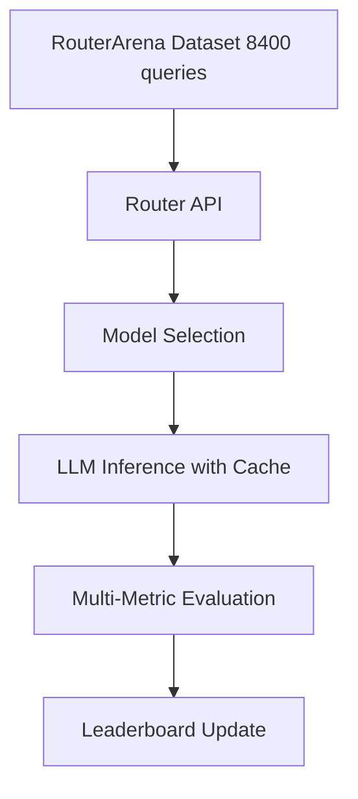

## 論文概要（Abstract）

本記事は [https://arxiv.org/abs/2510.00202](https://arxiv.org/abs/2510.00202) の解説記事です。

RouterArenaは、LLMルーター（クエリに応じて最適なLLMを選択するシステム）を包括的に比較評価するための初のオープンプラットフォームである。著者らは、デューイ十進分類法（DDC）とブルームのタキソノミーに基づく原理的なデータセット構築を行い、44カテゴリ・5認知レベルをカバーする8,400クエリのベンチマークを構築した。正確性・コスト・ルーティング最適性・堅牢性・オーバーヘッドの5軸で12種類のルーターを評価し、自動更新されるリーダーボードを提供している。

この記事は [Zenn記事: Portkey AI Gatewayで実現するLLMルーティング・フォールバック・コスト最適化](https://zenn.dev/0h_n0/articles/18db4ca22ca14d) の深掘りです。

## 情報源

- **arXiv ID**: 2510.00202
- **URL**: [arXiv:2510.00202](https://arxiv.org/abs/2510.00202)
- **著者**: Yifan Lu, Rixin Liu, Jiayi Yuan, Xingqi Cui, Shenrun Zhang, Hongyi Liu, Jiarong Xing
- **発表年**: 2025年9月（2025年11月改訂）
- **分野**: Computation and Language (cs.CL)
- **GitHub**: [RouteWorks/RouterArena](https://github.com/RouteWorks/RouterArena)

## 背景と動機

### LLMルーター選択が困難な理由

GPT-5、Claude-3.5-Sonnet、DeepSeek-V3といった多様なLLMが利用可能な現在、各クエリに対して最適なモデルを動的に選択する**LLMルーター**の重要性が増している。しかし、ルーター選択には以下の課題が存在する。

1. **評価軸の不足**: 既存のベンチマーク（RouterBench、RouterEval等）は正確性のみ、あるいはコストと正確性の2軸でしか評価していない
2. **ドメインカバレッジの偏り**: 多くのベンチマークは科学技術分野に偏っており、人文社会科学を含む幅広い知識領域をカバーしていない
3. **難易度の不均一性**: 困難度レベルが適切に制御されておらず、ルーターの判断品質を正確に測定できない
4. **商用ルーターの評価不在**: Not Diamond、Azure Model Router、GPT-5などの商用ルーターと、オープンソースルーターの公平な比較が行われていない

### 既存ベンチマークの限界

著者らは論文Table 1において、既存ベンチマークとRouterArenaの比較を示している。

| ベンチマーク | カテゴリ数 | 評価軸 | 商用ルーター | ライブリーダーボード |
|:---:|:---:|:---:|:---:|:---:|
| RouterBench | 24 | deferral curve | 0 | なし |
| RouterEval | 27 | accuracy | 0 | なし |
| FusionBench | 26 | LLM-judge | 0 | なし |
| EmbedLLM | 26 | accuracy | 0 | なし |
| **RouterArena** | **44** | **5軸** | **3** | **あり** |

RouterArenaは44カテゴリ、5段階の認知レベル、5つの評価軸、商用ルーター3種を含む初の包括的ベンチマークである。

## 主要な貢献

著者らは以下の3点を主要な貢献として挙げている。

1. **原理的データセット構築**: デューイ十進分類法（DDC）で9ドメイン・44カテゴリ、ブルームのタキソノミーで5認知レベルをカバーする8,400クエリのデータセットを、再帰的欠損再分配アルゴリズムにより均衡化して構築した
2. **5軸の包括的評価体系**: 正確性、コスト、ルーティング最適性（選択比率・精度比率・コスト比率）、堅牢性、レイテンシの5つの評価軸と、それらを統合するArena Scoreを定義した
3. **自動更新リーダーボードを備えたオープンプラットフォーム**: 商用・オープンソースルーターの公平な比較を可能にし、新規ルーターの登録・評価を自動化するフレームワークを公開した

## 技術的詳細

### データセット構築

RouterArenaのデータセットは、23のソースデータセットから約62,000クエリを収集し、以下の3つの原理に基づいて8,400クエリに絞り込んでいる。

#### ドメイン分類（DDC）

デューイ十進分類法の上位レベルから宗教を除く9ドメイン、44カテゴリに分類する。科学:人文社会の比率は2:1に設定されている。

#### 認知レベル分類（ブルームのタキソノミー）

LLM-as-Judge（DeepSeek-V3.1）を用いて、各クエリの認知レベルを5段階に分類する。人間の評価との一致率は54.9%（完全一致）、76.7%（±1レベル以内）と報告されている。

#### 経験的難易度

42の参照モデルの正解数に基づく難易度分類を行う。

$$
\text{difficulty}(q) = \begin{cases}
\text{hard} & \text{if } \sum_{m=1}^{42} \mathbb{1}[\text{correct}(m, q)] \leq 4 \\
\text{medium} & \text{if } 5 \leq \sum_{m=1}^{42} \mathbb{1}[\text{correct}(m, q)] \leq 19 \\
\text{easy} & \text{if } \sum_{m=1}^{42} \mathbb{1}[\text{correct}(m, q)] \geq 20
\end{cases}
$$

ここで、$$\mathbb{1}[\text{correct}(m, q)]$$ はモデル $$m$$ がクエリ $$q$$ に正解した場合に1、それ以外で0となる指示関数である。

#### 再帰的欠損再分配アルゴリズム

ドメイン・認知レベル間の均衡を保つため、過剰に割り当てられたカテゴリの余剰分を不足カテゴリに再帰的に再分配する。さらにcosine類似度ベースの重複排除（sentence-transformers使用）を適用している。

### 評価指標

#### 1. Query-Answer Accuracy（正確性）

データセット全体でのモデル応答の正解率である。

$$
\text{Accuracy} = \frac{1}{|Q|} \sum_{q \in Q} \mathbb{1}[\text{correct}(r(q), q)]
$$

ここで $$r(q)$$ はルーターがクエリ $$q$$ に対して選択したモデル、$$Q$$ はクエリ集合である。

#### 2. Query-Answer Cost（コスト）

各クエリの処理コストを入力・出力トークン数とモデル価格から算出する。

$$
\text{Cost} = \sum_{q \in Q} (c_{\text{input}}(r(q)) \cdot N_{\text{input}}(q) + c_{\text{output}}(r(q)) \cdot N_{\text{output}}(q))
$$

ここで $$c_{\text{input}}$$, $$c_{\text{output}}$$ はモデルごとのトークン単価、$$N_{\text{input}}$$, $$N_{\text{output}}$$ はトークン数である。MoEモデルの特性も考慮に入れている。

#### 3. Routing Optimality（ルーティング最適性）

ルーティングの最適性は3つのサブ指標で評価される。

**Optimal Selection Ratio（最適選択比率）**: 正解可能な最安モデルを選択した割合。

$$
\text{OSR} = \frac{1}{|Q|} \sum_{q \in Q} \mathbb{1}[r(q) = \arg\min_{m \in \mathcal{M}_q^{+}} c(m)]
$$

ここで $$\mathcal{M}_q^{+}$$ はクエリ $$q$$ に正解できるモデルの集合である。

**Optimal Accuracy Ratio（最適精度比率）**: ルーターの精度をオラクル（常に最良モデルを選択する理想的ルーター）の精度で割った値。

$$
\text{OAR} = \frac{\text{Accuracy}(r)}{\text{Accuracy}(\text{oracle})}
$$

**Optimal Cost Ratio（最適コスト比率）**: ルーターのコストを最適ルーティングのコストで割った値。値が1に近いほど効率的である。

$$
\text{OCR} = \frac{\text{Cost}(r)}{\text{Cost}(\text{optimal})}
$$

#### 4. Routing Robustness（堅牢性）

入力の摂動（パラフレーズ、文法変更、同義語置換、タイポ）に対するルーティング決定の一貫性を測定する。

$$
\text{Robustness} = \frac{1}{|Q|} \sum_{q \in Q} \mathbb{1}[r(q) = r(\tilde{q})]
$$

ここで $$\tilde{q}$$ はクエリ $$q$$ の摂動版である。

#### 5. Arena Score（統合スコア）

正確性とコストを統合するスコアとして、正規化コストと加重調和平均を用いる。

まず、コストを対数スケールで正規化する。

$$
C_i = \frac{\log_2(c_{\text{max}}) - \log_2(c_i)}{\log_2(c_{\text{max}}) - \log_2(c_{\text{min}})}
$$

ここで $$c_{\text{min}} = 0.0044$$、$$c_{\text{max}} = 200$$ である。

次に、加重調和平均でArena Scoreを計算する。

$$
S_{i,\beta} = \frac{(1 + \beta) \cdot A_i \cdot C_i}{\beta \cdot A_i + C_i}
$$

ここで $$A_i$$ は正確性、$$\beta = 0.1$$（デフォルト）は正確性重視のパラメータである。

## アルゴリズム: 評価パイプライン

RouterArenaの評価パイプラインは以下の5ステージで構成される。



以下は評価パイプラインの主要部分を示すPythonコード例である。

```python
from dataclasses import dataclass, field
from typing import Protocol, runtime_checkable


@runtime_checkable
class Router(Protocol):
    """LLMルーターのプロトコル定義。

    各ルーター実装はこのプロトコルに準拠する必要がある。
    """

    def select_model(self, query: str, candidates: list[str]) -> str:
        """クエリに対して最適なモデルを選択する。

        Args:
            query: ユーザークエリ文字列
            candidates: 選択可能なモデル名のリスト

        Returns:
            選択されたモデル名
        """
        ...


@dataclass
class EvaluationResult:
    """ルーター評価結果を格納するデータクラス。

    Attributes:
        accuracy: クエリ応答の正確性 (0.0-1.0)
        cost_per_1k: 1000クエリあたりのコスト (USD)
        optimal_selection_ratio: 最適モデル選択比率
        optimal_accuracy_ratio: オラクル比精度比率
        optimal_cost_ratio: 最適コスト比率
        robustness: 摂動入力に対する一貫性
        latency_ms: ルーティングレイテンシ (ミリ秒)
        arena_score: 統合Arena Score
    """

    accuracy: float = 0.0
    cost_per_1k: float = 0.0
    optimal_selection_ratio: float = 0.0
    optimal_accuracy_ratio: float = 0.0
    optimal_cost_ratio: float = 0.0
    robustness: float = 0.0
    latency_ms: float = 0.0
    arena_score: float = 0.0


def compute_arena_score(
    accuracy: float,
    cost: float,
    beta: float = 0.1,
    c_min: float = 0.0044,
    c_max: float = 200.0,
) -> float:
    """Arena Scoreを計算する。

    正確性とコストの加重調和平均により統合スコアを算出する。
    beta < 1 で正確性を重視し、beta > 1 でコストを重視する。

    Args:
        accuracy: モデル正確性 (0.0-1.0)
        cost: 1000クエリあたりのコスト (USD)
        beta: 正確性-コストの重みパラメータ (デフォルト: 0.1)
        c_min: コスト正規化の下限 (USD)
        c_max: コスト正規化の上限 (USD)

    Returns:
        Arena Score (0.0-1.0)

    Raises:
        ValueError: costがc_min未満またはc_max超過の場合
    """
    import math

    if cost < c_min or cost > c_max:
        raise ValueError(
            f"Cost {cost} is out of range [{c_min}, {c_max}]"
        )

    # 対数スケールでコストを正規化
    normalized_cost = (
        (math.log2(c_max) - math.log2(cost))
        / (math.log2(c_max) - math.log2(c_min))
    )

    # 加重調和平均
    if beta * accuracy + normalized_cost == 0:
        return 0.0

    score = (
        (1 + beta) * accuracy * normalized_cost
        / (beta * accuracy + normalized_cost)
    )
    return score


```

## 実装のポイント

### ルーター評価の実践的ノウハウ

RouterArenaの知見から、LLMルーター導入時に考慮すべき点をまとめる。

**1. キャッシュ活用によるコスト削減**

RouterArenaは42モデルの推論結果をキャッシュしており、モデルプール（候補モデル集合）が重複する場合はキャッシュ結果を再利用できる。実運用でも同様に、頻出クエリに対するモデル選択結果をキャッシュすることでルーティングコストを削減できる。

**2. 難易度に応じたルーティング戦略**

論文Table 6より、easy問題では多くのルーターが93-95%の精度を達成する一方、hard問題では精度が8-28%に低下する。これは、easy問題には安価なモデルを割り当て、hard問題にのみ高性能モデルを使う戦略が有効であることを示している。

**3. 堅牢性テストの実施**

著者らは、入力の表層的な変化（パラフレーズ、タイポ等）に対してルーティング決定が一貫しないケースが多いと報告している。BERTベースのルーターは入力の微細な変化に敏感であるため、実運用前に摂動テストを実施すべきである。

**4. レイテンシの考慮**

vLLM Semantic RouterやRouteLLMはAPI呼び出しを含むため200-500msのレイテンシが発生する。一方、KNN/MLPベースのルーターは100ms未満で動作する。リアルタイム要件に応じてルーターを選択する必要がある。

## Production Deployment Guide

### AWS実装パターン: LLMルーター評価基盤

RouterArenaの知見を活かしたルーター評価基盤をAWSで構築するパターンを3つのスケールで示す。

#### デプロイメント規模の選定

| 項目 | Small | Medium | Large |
|:---|:---|:---|:---|
| 評価クエリ数 | ~1,000 | ~5,000 | ~10,000+ |
| 候補モデル数 | 3-5 | 10-20 | 40+ |
| 計算基盤 | Lambda + Fargate | ECS on EC2 | EKS + GPU instances |
| 推論キャッシュ | DynamoDB | ElastiCache (Redis) | ElastiCache Cluster |
| 結果ストレージ | S3 + Athena | S3 + RDS PostgreSQL | S3 + Aurora + OpenSearch |
| リーダーボード | S3 Static Site | CloudFront + API GW | CloudFront + AppSync |
| 月額概算 | $50-200 | $500-2,000 | $3,000-15,000 |
| ユースケース | PoC・個人検証 | チーム利用・定期評価 | 組織横断・自動化パイプライン |

#### Terraform構成例（Medium規模）

以下はMedium規模の主要コンポーネント（ECSタスク + ElastiCacheキャッシュ + S3結果ストレージ）の抜粋である。

```hcl
# 評価ジョブ用 ECS タスク定義
resource "aws_ecs_task_definition" "router_eval" {
  family                   = "router-eval-task"
  requires_compatibilities = ["FARGATE"]
  network_mode             = "awsvpc"
  cpu                      = "2048"
  memory                   = "4096"
  execution_role_arn       = aws_iam_role.ecs_execution.arn
  task_role_arn            = aws_iam_role.ecs_task.arn

  container_definitions = jsonencode([{
    name  = "router-evaluator"
    image = "${aws_ecr_repository.router_eval.repository_url}:latest"
    environment = [
      { name = "CACHE_ENDPOINT", value = aws_elasticache_cluster.eval_cache.cache_nodes[0].address },
      { name = "S3_RESULTS_BUCKET", value = aws_s3_bucket.eval_results.id },
    ]
  }])
}

# 推論結果キャッシュ（ElastiCache Redis）
resource "aws_elasticache_cluster" "eval_cache" {
  cluster_id           = "router-eval-cache"
  engine               = "redis"
  node_type            = "cache.r6g.large"
  num_cache_nodes      = 1
  parameter_group_name = "default.redis7"
}

# 評価結果ストレージ（90日後 Glacier IR へ移行）
resource "aws_s3_bucket" "eval_results" {
  bucket = "router-eval-results-${data.aws_caller_identity.current.account_id}"
}
```

パイプライン全体はStep Functionsで `GeneratePredictions -> RunInference -> Evaluate -> UpdateLeaderboard` の4ステージを直列実行する構成とする。

#### 運用・監視設定

**CloudWatch Alarms（推奨設定）**

| アラーム | 条件 | アクション |
|:---|:---|:---|
| 評価ジョブ失敗 | ECS Task失敗 >= 1 | SNS → PagerDuty |
| キャッシュヒット率低下 | Redis hit rate < 70% | SNS → Slack |
| 推論コスト超過 | 日次コスト > 閾値 | SNS → 自動停止Lambda |
| レイテンシ劣化 | P99 > 500ms | SNS → Slack |

**ログ構造化（JSON形式）**

```json
{
  "event": "router_evaluation_completed",
  "level": "info",
  "ts": "2026-07-10T11:00:00Z",
  "request_id": "eval-20260710-001",
  "duration_ms": 45230,
  "router_name": "vllm-sr",
  "accuracy": 0.673,
  "cost_per_1k": 1.67,
  "arena_score": 0.72
}
```

#### コスト最適化チェックリスト

- [ ] 推論結果キャッシュを有効化し、モデルプール重複時のAPI呼び出しを削減
- [ ] Spot Instancesで評価ジョブを実行（中断許容のバッチ処理）
- [ ] S3 Intelligent-Tieringで評価結果のストレージコストを自動最適化
- [ ] 評価頻度を週次に設定し、差分評価（新規ルーターのみ）を実装
- [ ] API呼び出しにrate limiterを設定し、コスト上限を制御
- [ ] キャッシュTTLを評価期間に合わせて調整（短すぎると再計算、長すぎるとメモリ浪費）

## 実験結果

### ルーター比較（論文Table 6, Figure 6-7より）

著者らが報告した主要ルーターの性能を以下に示す。42の参照モデル上で8,400クエリを用いた評価結果である。

| ルーター | 全体精度 | コスト/1K($) | Easy精度 | Medium精度 | Hard精度 |
|:---|:---:|:---:|:---:|:---:|:---:|
| GPT-5 (内部ルーター) | 74.0% | 14.02 | 95.1% | 68.6% | 27.5% |
| Azure Model Router | 68.1% | 0.54 | 93.3% | 59.5% | 17.9% |
| vLLM Semantic Router | 67.3% | 1.67 | 95.3% | 57.9% | 8.7% |
| CARROT | 67.2% | 2.06 | 95.0% | 58.0% | 9.0% |
| RouterDC | 32.0% | 0.07 | 54.9% | 15.3% | 2.2% |

### 主要な発見

**1. コストと精度のトレードオフ**

著者らは、GPT-5が74.0%の精度を達成するが、コストは$14.02/1Kと高額であると報告している。一方、Azure Model Routerは$0.54/1Kで68.1%の精度を達成しており、コスト効率が高い（論文Figure 6より）。

**2. 難易度別の挙動**

Easy問題では多くのルーターが93-95%の精度を達成する一方、Hard問題ではGPT-5の27.5%が最高であり、他のルーターは10%未満に低下する（論文Table 6より）。これは、Hard問題に対するルーティングの改善余地が大きいことを示している。

**3. 最適性の不足**

著者らは、全てのルーターが安価なモデルの活用が不十分であると指摘している。Optimal Selection Ratioは全ルーターで低い値を示しており、easy問題に対して不必要に高価なモデルを選択する傾向がある（論文Figure 8より）。

**4. 堅牢性の課題**

著者らは、BERTベースの埋め込みを使用するルーターは入力の微細な変化に対して一貫性が低いと報告している。堅牢性スコアは全般的に低い水準にある（論文Figure 9より）。

**5. 長文コンテキストでのコスト増大**

Long-Context評価（論文Table 7より）では、GPT-5が71%の精度で$45.70/1K、Azure Model Routerが67%で$9.54/1Kとなっており、コストが標準設定の3-17倍に膨らむ。

## 実運用への応用: Portkey AI Gatewayの評価

Zenn記事で紹介したPortkey AI Gatewayのルーティング機能を、RouterArenaの評価フレームワークで検証する方法を考える。

### Portkey Gatewayのルーティングを評価する手順

1. **RouterArenaデータセットの取得**: GitHubリポジトリからデータセットをダウンロードし、評価用クエリを準備する
2. **Portkey Gatewayのラッパー実装**: RouterArenaの`BaseRouter`を継承し、Portkey APIを呼び出すルータークラスを実装する
3. **キャッシュ付き評価の実行**: RouterArenaのキャッシュ機構を活用し、既存モデルの推論結果を再利用しつつPortkeyの選択結果を評価する
4. **5軸の比較**: 正確性・コスト・最適性・堅牢性・レイテンシの各指標で既存ルーターと比較する

### ルーティング戦略の最適化ポイント

RouterArenaの実験結果から、Portkey AI Gatewayのルーティング設定を最適化する際のポイントが見えてくる。

- **難易度推定の組み込み**: easy問題には安価モデル、hard問題には高性能モデルを割り当てるルールを設定する
- **フォールバック戦略の検証**: 堅牢性テストにより、入力の摂動でルーティング結果が不安定にならないか確認する
- **コスト上限の設定**: Arena Scoreの $$\beta$$ パラメータを調整し、自社のコスト-精度バランスに合わせた評価を行う

## 関連研究

1. **RouteLLM** (Ong et al.): バイナリ選択（強いモデル/弱いモデル）によるルーティング手法。RouterArenaでは多モデル選択の基準として評価されている
2. **MixLLM**: ワークロード特性に基づくモデル混合選択手法。コスト最適化に重点を置いている
3. **Eagle**: 投機的デコーディングベースのルーティング手法。推論速度の最適化を目的としている
4. **GraphRouter**: グラフニューラルネットワーク（GNN）を用いたルーター。クエリとモデルの関係をグラフ構造で表現する
5. **Router-R1**: 強化学習（RL）ベースのルーター。報酬関数の設計により、コストと精度のバランスを学習する
6. **CARROT Router**: コスト-精度トレードオフを明示的にモデル化したルーター。RouterArenaの評価ではvLLM-SRと同等の精度を達成している

## まとめと今後の展望

RouterArenaは、LLMルーターの評価における3つの重要な課題（ドメインカバレッジの偏り、評価軸の不足、商用ルーターとの公平な比較の欠如）を解決するオープンプラットフォームである。

**本論文の意義**は以下の3点に集約される。

1. DDC + ブルームのタキソノミーに基づく原理的なデータセット構築手法を確立した
2. 5軸の包括的評価体系（正確性・コスト・最適性・堅牢性・レイテンシ）を定義し、Arena Scoreとして統合した
3. 商用・オープンソースルーターを統一的に評価するオープンプラットフォームを公開した

**今後の課題**として、著者らは以下を挙げている。

- 全ルーターで安価なモデルの活用が不十分であり、最適選択比率の改善が必要である
- BERTベース埋め込みの堅牢性の低さは根本的な技術課題であり、摂動に頑健な表現学習が求められる
- Long-Context設定でのコスト増大に対応するため、入力長に応じた動的ルーティング戦略の研究が望まれる

LLMルーターの選定にあたっては、単一指標ではなく複数の評価軸で総合的に判断することが重要である。RouterArenaのフレームワークとリーダーボードは、そのための実用的な基盤を提供している。

## 参考文献

1. Lu, Y., Liu, R., Yuan, J., Cui, X., Zhang, S., Liu, H., & Xing, J. (2025). RouterArena: An Open Platform for Comprehensive Comparison of LLM Routers. arXiv:2510.00202.
2. Ong, I., et al. (2024). RouteLLM: Learning to Route LLMs with Preference Data. arXiv:2406.18665.
3. Shen, T., et al. (2024). GraphRouter: A Graph-based Router for LLM Selections. arXiv preprint.
4. Ding, N., et al. (2024). RouterBench: A Benchmark for Multi-LLM Routing System. arXiv:2403.12031.
5. Portkey AI. (2025). Portkey AI Gateway Documentation. [https://portkey.ai/docs](https://portkey.ai/docs)
6. RouteWorks. (2025). RouterArena GitHub Repository. [https://github.com/RouteWorks/RouterArena](https://github.com/RouteWorks/RouterArena)
