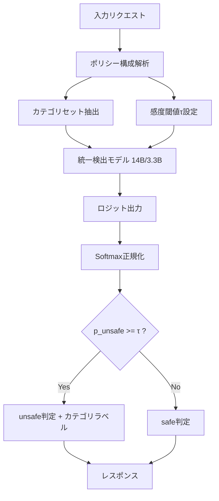

## 論文概要（Abstract）

本記事は [https://arxiv.org/abs/2510.19169](https://arxiv.org/abs/2510.19169) の解説記事です。

OpenGuardrailsは、LLMの安全性に関する3つの主要リスク（有害コンテンツ生成、プロンプトインジェクション/ジェイルブレイク、データ漏洩）に対処するオープンソースのガードレールプラットフォームである。リクエスト単位でポリシーをカスタマイズできる**Configurable Policy Adaptation**機構と、コンテンツ安全性検出と攻撃防御を単一モデルで統合する**統一検出アーキテクチャ**を特徴とする。14Bパラメータの基盤モデルをGPTQ量子化により3.3Bまで圧縮し、ベンチマーク精度の98%以上を維持しつつ、レイテンシを3.7倍削減している。119言語に対応し、Apache 2.0ライセンスで公開されている。

この記事は [Zenn記事: Portkey AI Gatewayで実現するLLMルーティング・フォールバック・コスト最適化](https://zenn.dev/0h_n0/articles/18db4ca22ca14d) の関連1次情報です。

## 情報源

- **arXiv ID**: 2510.19169
- **URL**: [arXiv:2510.19169](https://arxiv.org/abs/2510.19169)
- **著者**: Thomas Wang, Haowen Li
- **発表年**: 2025年10月
- **分野**: Cryptography and Security (cs.CR), Computation and Language (cs.CL)
- **ライセンス**: Apache 2.0（モデル・データ・スクリプト）

## 背景と動機

### LLMの安全性における3つの課題

LLMの商用展開が拡大する中で、以下の3つのリスクカテゴリが実運用上の深刻な課題となっている。

**1. コンテンツ安全性違反（Content-Safety Violations）**

有害、差別的、違法、または性的に露骨なテキストの生成である。ユーザーの入力プロンプトおよびモデルの出力レスポンスの両方で検出が必要となる。

**2. モデル操作攻撃（Model-Manipulation Attacks）**

プロンプトインジェクション、ジェイルブレイク、コードインタプリタの悪用が含まれる。

**3. データ漏洩（Data Leakage）**

モデルが学習データに含まれる個人情報や機密情報を出力するリスクである。

### 既存ガードレールの限界

著者らは、既存のガードレールシステムには以下の問題があると指摘している。

- **静的ポリシー**: 事前定義されたカテゴリに固定され、リクエスト単位のカスタマイズが困難
- **バイナリ制御**: 「strict/loose」の二択のみで連続的な感度調整ができない
- **分散アーキテクチャ**: 安全性と攻撃防御で別モデルが必要となり運用コスト増大
- **多言語不足**: 英語中心の設計でグローバル展開時に精度低下

## 主要な貢献

著者らは以下の3点を主要な貢献として報告している。

1. **Configurable Policy Adaptation**: リクエスト単位で検出すべき安全カテゴリと感度閾値を動的に指定できる機構を導入した。従来のバイナリ制御（strict/loose）に対し、連続的なロジットベースの感度制御を実現している
2. **統一検出アーキテクチャ**: コンテンツ安全性検出とモデル操作防御を単一のLLMでこなす統一アーキテクチャを提案した。複数の専門モデルを組み合わせる従来手法に比べ、運用コストとメンテナンス負荷を低減する
3. **GPTQ量子化による軽量化**: 14Bパラメータモデルを3.3Bまで量子化し、ベンチマーク精度の98%以上を維持しつつ、レイテンシ3.7倍・メモリ使用量4.2倍の削減を達成した

## 技術的詳細

### Configurable Policy Adaptation

OpenGuardrailsのポリシー適応機構は、リクエストごとに2つのパラメータを動的に指定する。

**検出カテゴリセットの指定**: ユーザーは各リクエストで検出対象とする安全カテゴリの集合を明示的に選択できる。例えば、あるAPIコールでは「ヘイトスピーチ」と「暴力的コンテンツ」のみを検出し、別のコールでは「データ漏洩」と「プロンプトインジェクション」を対象とするといった柔軟な制御が可能である。

**連続的感度閾値**: 判定の感度を連続値で制御する閾値 $\tau$ を導入している。

$$\tau \in [0, 1]$$

ここで著者らは意味的マッピングとして以下を定義している。

$$\tau_{\text{low}} = 0.3, \quad \tau_{\text{medium}} = 0.5, \quad \tau_{\text{high}} = 0.7$$

$\tau$ が小さいほど検出感度が高く（多くのコンテンツをunsafeと判定）、大きいほど寛容な判定となる。

### 統一検出アーキテクチャ

OpenGuardrailsは、コンテンツ安全性検出と攻撃防御を単一のファインチューニング済みLLMで処理する。基盤モデルとして14Bパラメータのdenseモデルを採用している。



### 判定の数理的定式化

モデルの出力ロジットから安全性判定を行う確率的な意思決定関数は以下のように定式化される。

まず、モデルは入力 $x$ に対して「safe」と「unsafe」の2つのトークンに対応するロジットを出力する。

$$z_{\text{safe}}, z_{\text{unsafe}} = f_\theta(x)$$

ここで $f_\theta$ はパラメータ $\theta$ を持つガードレールモデル、$z_{\text{safe}}$ および $z_{\text{unsafe}}$ はそれぞれ「safe」「unsafe」トークンに対する非正規化ロジットである。

次に、softmax正規化によりunsafe確率を算出する。

$$p_{\text{unsafe}} = \frac{\exp(z_{\text{unsafe}})}{\exp(z_{\text{safe}}) + \exp(z_{\text{unsafe}})}$$

最終的な判定関数 $D(x)$ は閾値 $\tau$ との比較で決定される。

$$D(x) = \begin{cases} \text{unsafe} & \text{if } p_{\text{unsafe}} \geq \tau \\ \text{safe} & \text{otherwise} \end{cases}$$

この確率的アプローチにより、「トークンロジットに対する微分可能なキャリブレーション」が可能となると著者らは述べている。

### GPTQ量子化

14Bモデルの推論コスト削減のため、GPTQ（Generalized Post-Training Quantization）を適用している。GPTQは学習済みモデルの重みを低ビット精度に変換するポストトレーニング量子化手法であり、追加の学習なしに適用できる。

量子化前後のパラメータ数と精度の関係は以下の通りである（論文Table 2, 3より）。

| モデル | パラメータ数 | 英語プロンプトF1 | 英語レスポンスF1 | P95レイテンシ |
|--------|------------|----------------|----------------|-------------|
| OpenGuardrails-14B | 14B | 87.1 | 88.5 | -- |
| OpenGuardrails-3.3B (GPTQ) | 3.3B | >85.3 | >86.7 | 274.6ms |

量子化により、パラメータ数を約76%削減しつつ、精度低下を2%未満に抑えている。

## アルゴリズム

以下は、OpenGuardrailsのガードレールパイプラインの概念的な実装例である。

```python
from dataclasses import dataclass, field
from enum import Enum

import torch
import torch.nn.functional as F


class SafetyCategory(Enum):
    """検出対象の安全カテゴリ."""

    HATE_SPEECH = "hate_speech"
    VIOLENCE = "violence"
    SEXUAL_CONTENT = "sexual_content"
    PROMPT_INJECTION = "prompt_injection"
    JAILBREAK = "jailbreak"
    DATA_LEAKAGE = "data_leakage"


@dataclass
class GuardrailPolicy:
    """リクエスト単位で指定するガードレールポリシー.

    Attributes:
        categories: 検出対象カテゴリの集合
        threshold: 感度閾値 tau in [0, 1]
    """

    categories: set[SafetyCategory] = field(
        default_factory=lambda: set(SafetyCategory)
    )
    threshold: float = 0.5


@dataclass
class GuardrailResult:
    """ガードレール判定結果.

    Attributes:
        is_safe: 安全と判定されたか
        unsafe_probability: unsafeの確率値
        violated_categories: 違反が検出されたカテゴリのリスト
    """

    is_safe: bool
    unsafe_probability: float
    violated_categories: list[SafetyCategory]


def evaluate_guardrail(
    text: str,
    policy: GuardrailPolicy,
    model: object,
    tokenizer: object,
) -> GuardrailResult:
    """統一検出モデルによるガードレール評価を実行する.

    モデルのロジット出力からsoftmax正規化でunsafe確率を算出し、
    閾値tauとの比較で最終判定を行う。

    Args:
        text: 評価対象のテキスト（プロンプトまたはレスポンス）
        policy: 適用するガードレールポリシー
        model: ガードレールモデル（OpenGuardrails-14B/3.3B）
        tokenizer: 対応するトークナイザー

    Returns:
        判定結果（安全性フラグ、確率値、違反カテゴリ）
    """
    category_names = [cat.value for cat in policy.categories]
    prompt = (
        f"<|system|>Detect: {', '.join(category_names)}.\n"
        f"<|user|>{text}\n<|assistant|>"
    )

    inputs = tokenizer(prompt, return_tensors="pt")
    with torch.no_grad():
        outputs = model(**inputs)

    # safe/unsafeトークンのロジット抽出
    safe_id = tokenizer.encode("safe", add_special_tokens=False)[0]
    unsafe_id = tokenizer.encode("unsafe", add_special_tokens=False)[0]
    logits = outputs.logits[0, -1, :]

    # p_unsafe = softmax(z_unsafe, z_safe)
    probs = F.softmax(torch.tensor([logits[safe_id], logits[unsafe_id]]), dim=0)
    p_unsafe = probs[1].item()

    is_safe = p_unsafe < policy.threshold
    violated = list(policy.categories) if not is_safe else []

    return GuardrailResult(
        is_safe=is_safe,
        unsafe_probability=p_unsafe,
        violated_categories=violated,
    )
```

## 実装のポイント

### Per-Requestカスタマイズ

OpenGuardrailsの設計上の特徴は、各APIリクエストに対して独立したポリシーを適用できる点にある。例えば以下のようなユースケースが考えられる。

- **チャットボット**: ヘイトスピーチと暴力的コンテンツを高感度（$\tau = 0.3$）で検出
- **コード生成**: プロンプトインジェクションとコードインタプリタ悪用を中感度（$\tau = 0.5$）で検出
- **データ分析**: データ漏洩のみを低感度（$\tau = 0.7$）で検出

この柔軟性は、Portkey AI Gatewayのようなルーティングレイヤーとの統合において有用である。ゲートウェイ側でリクエストのコンテキストに応じてポリシーを動的に切り替えることが可能となる。

### レイテンシへの影響

量子化モデル（3.3B）のP95レイテンシは274.6msと報告されている。リアルタイムのチャットアプリケーションでは、ユーザーのメッセージ送信からモデル応答開始までの間にガードレール判定を挟む必要がある。

著者らは、量子化により以下の改善を達成したと報告している。

| 指標 | 14Bモデル | 3.3B (GPTQ) | 改善率 |
|------|----------|-------------|--------|
| レイテンシ | 基準 | 3.7倍削減 | 73% |
| メモリ使用量 | 基準 | 4.2倍削減 | 76% |
| 精度維持率 | 100% | >98% | -2% |

### 多言語対応

OpenGuardrailsは119言語・方言に対応しており、多言語環境での安全性検出において高い性能を示している。論文Table 6, 7より、多言語プロンプトおよびレスポンスの平均F1スコアはそれぞれ97.3、97.2と報告されている。この高い多言語性能は、グローバルに展開するLLMアプリケーションにとって実用上重要な特性である。

## Production Deployment Guide

### AWSデプロイメントパターン

OpenGuardrailsの本番デプロイメントは、トラフィック規模に応じて3つのパターンに分類できる。

| 規模 | リクエスト/秒 | 推奨構成 | GPU | 月額概算（USD） |
|------|-------------|----------|-----|---------------|
| Small | ~10 RPS | Lambda + SageMaker Endpoint | 1x T4 | ~$300-500 |
| Medium | ~100 RPS | ECS Fargate + SageMaker Multi-Model | 2-4x T4 | ~$1,500-3,000 |
| Large | 500+ RPS | EKS + GPU Node Group (Auto Scaling) | 4-16x A10G | ~$5,000-15,000 |

### Terraform構成例（Smallパターン: Lambda + SageMaker）

```hcl
# SageMaker Endpoint for OpenGuardrails 3.3B (GPTQ)
resource "aws_sagemaker_model" "guardrails" {
  name               = "openguardrails-3b-gptq"
  execution_role_arn = aws_iam_role.sagemaker_exec.arn

  primary_container {
    image          = "763104351884.dkr.ecr.ap-northeast-1.amazonaws.com/huggingface-pytorch-tgi-inference:2.4.0-tgi2.4.1-gpu-py311-cu124-ubuntu22.04"
    model_data_url = "s3://${aws_s3_bucket.models.id}/openguardrails-3.3b-gptq/model.tar.gz"
    environment = { SM_NUM_GPUS = "1", GPTQ_BITS = "4", DTYPE = "float16" }
  }
}

resource "aws_sagemaker_endpoint_configuration" "guardrails" {
  name = "openguardrails-endpoint-config"
  production_variants {
    variant_name = "primary"
    model_name   = aws_sagemaker_model.guardrails.name
    instance_type = "ml.g4dn.xlarge"  # T4 GPU
    initial_instance_count = 1
  }
}

# Lambda: API Gateway -> SageMaker
resource "aws_lambda_function" "guardrails_api" {
  function_name = "openguardrails-api"
  runtime       = "python3.12"
  handler       = "handler.lambda_handler"
  timeout       = 30
  role          = aws_iam_role.lambda_exec.arn
  filename      = data.archive_file.lambda_zip.output_path
  environment {
    variables = { SAGEMAKER_ENDPOINT = "openguardrails-endpoint", DEFAULT_THRESHOLD = "0.5" }
  }
}
```

### Terraform構成例（Largeパターン: EKS + GPU Nodes）

```hcl
# EKS Cluster with GPU Node Group
module "eks" {
  source  = "terraform-aws-modules/eks/aws"
  version = "~> 20.0"

  cluster_name    = "guardrails-cluster"
  cluster_version = "1.31"
  vpc_id          = module.vpc.vpc_id
  subnet_ids      = module.vpc.private_subnets

  eks_managed_node_groups = {
    gpu_nodes = {
      instance_types = ["g5.xlarge"]  # A10G GPU
      ami_type       = "AL2_x86_64_GPU"
      min_size       = 4
      max_size       = 16
      desired_size   = 4
      labels = { workload = "guardrails" }
      taints = [{ key = "nvidia.com/gpu", value = "true", effect = "NO_SCHEDULE" }]
    }
  }
}

# GPU utilization-based autoscaling
resource "kubernetes_horizontal_pod_autoscaler_v2" "guardrails" {
  metadata { name = "openguardrails-hpa"; namespace = "guardrails" }
  spec {
    scale_target_ref { api_version = "apps/v1"; kind = "Deployment"; name = "openguardrails-inference" }
    min_replicas = 4
    max_replicas = 16
    metric {
      type = "Pods"
      pods { metric { name = "gpu_utilization" }; target { type = "AverageValue"; average_value = "70" } }
    }
  }
}
```

### 運用・監視設定

CloudWatchアラームの推奨閾値は以下の通りである。

| メトリクス | 警告閾値 | 緊急閾値 | 対応アクション |
|-----------|---------|---------|-------------|
| P95レイテンシ | 400ms | 600ms | スケールアウト / キャッシュ確認 |
| GPU使用率 | 80% | 95% | ノード追加 |
| エラーレート | 1% | 5% | モデル再起動 / ログ確認 |
| unsafe検出率 | -- | 急変時 | ポリシー設定の監査 |

### コスト最適化チェックリスト

- [ ] GPTQモデル（3.3B）を使用し、14Bモデル比で推論コストを約75%削減
- [ ] SageMaker Savings Plansの適用（1年契約で最大64%割引）
- [ ] バッチ推論が可能なユースケース（非リアルタイム）ではSpot Instancesを活用
- [ ] リクエストのキャッシュレイヤー（ElastiCache）を導入し、同一テキストの重複判定を排除
- [ ] 不要なカテゴリを検出対象から外し、モデルの推論負荷を軽減
- [ ] CloudWatch Logs Insightsでレイテンシ分布を分析し、ボトルネックを特定
- [ ] オートスケーリングのクールダウン期間を適切に設定（急激なスケールアウト・インを防止）
- [ ] GPU Instanceの使用率が低い時間帯にはスケジュールベースのスケールインを設定

## 実験結果

### 英語ベンチマーク

論文Table 2（英語プロンプト）およびTable 3（英語レスポンス）より、主要なガードレールシステムとの比較結果は以下の通りである。

**英語プロンプト評価（平均F1スコア）**（論文Table 2より）

| モデル | 平均F1 |
|--------|--------|
| OpenGuardrails-Text-2510 | 87.1 |
| Qwen3Guard-8B-Gen (loose) | 84.3 |
| NemoGuard-8B | 84.2 |

**英語レスポンス評価（平均F1スコア）**（論文Table 3より）

| モデル | 平均F1 |
|--------|--------|
| OpenGuardrails-Text-2510 | 88.5 |
| Qwen3Guard-8B-Gen (loose) | 78.4 |

英語レスポンス評価ではOpenGuardrailsがQwen3Guardを10ポイント以上上回っている。

### 多言語ベンチマーク

論文Table 6, 7より、多言語環境での性能は以下の通りである。

| 評価対象 | 平均F1 |
|---------|--------|
| 多言語プロンプト | 97.3 |
| 多言語レスポンス | 97.2 |

119言語に対応しつつ高い精度を維持している点は注目に値する。

### 量子化後の精度維持

GPTQによる量子化（14B → 3.3B）後もベンチマーク精度の98%以上を維持していると報告されている。ガードレールタスクが二値分類であるため量子化による精度劣化が抑えられたと考えられる。

## 実運用への応用

### Portkey AI Gatewayとの関連

関連Zenn記事で解説されている[Portkey AI Gateway](https://zenn.dev/0h_n0/articles/18db4ca22ca14d)は、50以上のガードレール機能を統合的に管理するプラットフォームである。OpenGuardrailsの設計思想は、Portkeyのようなゲートウェイと以下の点で親和性が高い。

**1. Per-Requestポリシーとルーティングの連携**

Portkeyのルーティング機能は、リクエストのコンテキスト（ユーザー属性、アプリケーション種別、地域）に応じてLLMプロバイダーを切り替える。OpenGuardrailsのConfigurable Policy Adaptationを組み合わせることで、ルーティング先ごとに異なるガードレールポリシーを適用できる。

**2. フォールバックとガードレールの統合**

Portkeyのフォールバック機能は、あるLLMプロバイダーが失敗した場合に別のプロバイダーに切り替える。ガードレールで unsafe と判定された場合にもフォールバックをトリガーし、より制限の厳しいモデルに切り替えるパターンが考えられる。

**3. コスト最適化との両立**

GPTQモデル（3.3B）とPortkeyのコスト最適化ルーティングを組み合わせ、安全性を維持しつつ推論コストを削減できる。

### 競合比較

論文で報告されている機能比較（論文より）は以下の通りである。

| 機能 | OpenGuardrails | Qwen3Guard | LlamaFirewall | NeMo Guardrails |
|------|---------------|------------|---------------|-----------------|
| 動的ポリシー | 対応 | 非対応 | 非対応 | 非対応 |
| ロジット閾値 | 対応 | 非対応 | 非対応 | 非対応 |
| オープンソース | 完全 | 完全 | 部分的 | 完全 |
| 多言語 | 119言語 | 対応 | 英語中心 | 限定的 |
| 操作防御 | 対応 | 部分的 | 対応 | ルールベース |

## 関連研究

### NeMo Guardrails（NVIDIA）

NVIDIAが開発したオープンソースのガードレールフレームワークである。Colangという独自の対話記述言語を用いてルールベースのガードレールを定義する。プログラマブルな制御が可能だが、LLMベースの検出に比べて柔軟性に欠ける面がある。OpenGuardrailsはLLMベースの統一検出により、ルール記述なしで広範なリスクカテゴリに対応している。

### Llama Guard / LlamaFirewall（Meta）

MetaのLlama Guardシリーズは、安全性分類に特化したファインチューニングモデルである。LlamaFirewallはその拡張として、プロンプトインジェクション防御を統合している。ただし、著者らによれば、動的なポリシーカスタマイズやロジットベースの連続的感度制御には対応しておらず、英語中心の設計となっている。

### Qwen3Guard（Alibaba）

Alibabaが公開した8Bパラメータのガードレールモデルである。多言語対応を備えるが、ポリシーのカスタマイズは「strict/loose」の二択に限定されている。論文Table 2, 3より、英語ベンチマークではOpenGuardrailsが特にレスポンス評価で大きな差をつけている。

## まとめと今後の展望

OpenGuardrailsは、LLMの安全性確保において以下の3つの技術的貢献を提示した。

1. **Configurable Policy Adaptation**により、リクエスト単位での動的なポリシーカスタマイズを実現
2. **統一検出アーキテクチャ**により、コンテンツ安全性と攻撃防御を単一モデルで処理
3. **GPTQ量子化**により、精度を98%以上維持しつつ推論コストを大幅に削減

今後の展望として以下が考えられる。

- **マルチモーダル対応**: 画像・音声に対するガードレール機能の拡張
- **リアルタイム適応学習**: 新たな攻撃パターンへのオンライン更新機構
- **ドメイン特化ポリシー**: 医療・金融・教育など業界固有の安全基準テンプレート
- **ストリーミング対応**: トークン生成中にリアルタイム判定を行う低遅延パイプライン

ゲートウェイレイヤーとの統合により、ルーティング・フォールバックと安全性検出を一体的に管理するアーキテクチャが実現可能となる。

## 参考文献

1. Wang, T., & Li, H. (2025). OpenGuardrails: A Configurable, Unified, and Scalable Guardrails Platform for Large Language Models. arXiv:2510.19169. [https://arxiv.org/abs/2510.19169](https://arxiv.org/abs/2510.19169)
2. Inan, H., et al. (2023). Llama Guard: LLM-based Input-Output Safeguard for Human-AI Conversations. arXiv:2312.06674. [https://arxiv.org/abs/2312.06674](https://arxiv.org/abs/2312.06674)
3. Rebedea, T., et al. (2023). NeMo Guardrails: A Toolkit for Controllable and Safe LLM Applications with Programmable Rails. arXiv:2310.10501. [https://arxiv.org/abs/2310.10501](https://arxiv.org/abs/2310.10501)
4. Frantar, E., et al. (2023). GPTQ: Accurate Post-Training Quantization for Generative Pre-trained Transformers. arXiv:2210.17323. [https://arxiv.org/abs/2210.17323](https://arxiv.org/abs/2210.17323)
5. Team Qwen. (2025). Qwen3Guard: Multilingual Content Safety for LLMs. [https://huggingface.co/Qwen](https://huggingface.co/Qwen)
