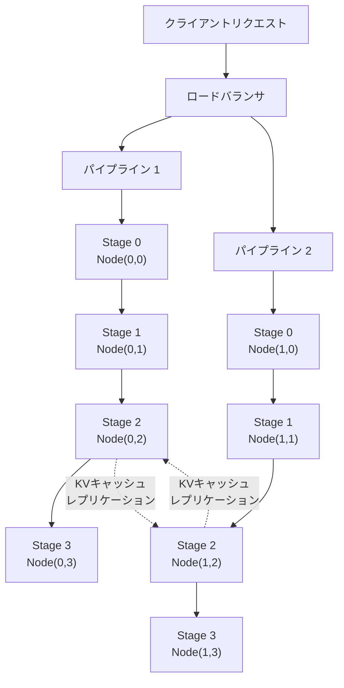
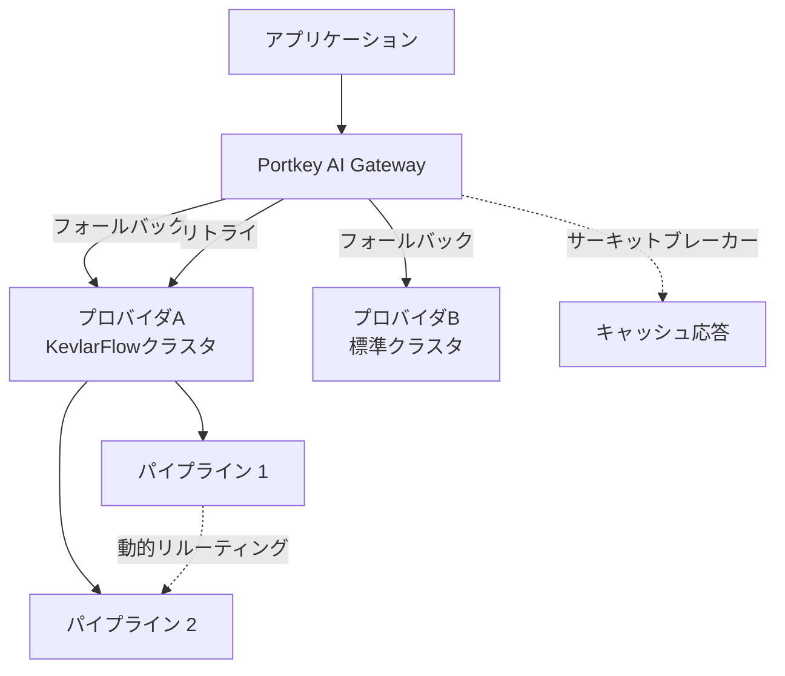

## 論文概要

本記事は [https://arxiv.org/abs/2601.22438](https://arxiv.org/abs/2601.22438) の解説記事です。

KevlarFlowは、大規模言語モデル（LLM）サービングシステムの耐障害性を向上させるアーキテクチャである。ハイパースケールクラスタにおけるハードウェア障害は頻繁に発生し、従来のシステムでは復旧に最大10分を要していた。KevlarFlowは、分離型モデル並列初期化（Decoupled Model Parallelism Initialization）、動的トラフィックリルーティング（Dynamic Traffic Rerouting）、バックグラウンドKVキャッシュレプリケーション（Background KV Cache Replication）の3つの戦略を統合し、平均復旧時間（MTTR）を20倍短縮する。通常運用時のオーバーヘッドは5%未満に抑えられ、障害発生時にはレイテンシを最大574.6倍改善する。

## 情報源

| 項目 | 内容 |
|------|------|
| arXiv ID | 2601.22438 |
| URL | [https://arxiv.org/abs/2601.22438](https://arxiv.org/abs/2601.22438) |
| 著者 | Shangshu Qian, Kipling Liu, P. C. Sruthi, Lin Tan, Yongle Zhang |
| 発表年 | 2026年1月 |
| 分野 | Distributed Computing (cs.DC), Computation and Language (cs.CL), Machine Learning (cs.LG) |

## 背景と動機

### LLMサービングにおける障害の深刻さ

LLMサービングシステムは、数千台のGPUを用いたハイパースケールクラスタ上で動作する。このような環境では、GPU故障、ネットワーク断、電源障害などのハードウェア障害が日常的に発生する。問題は、単一ノードの障害がシステム全体に波及する点にある。

従来のLLMサービングシステム（vLLMやTensorRT-LLMなど）は、テンソル並列やパイプライン並列でモデルを複数GPUに分散配置するが、障害発生時には全ノードを停止し、通信グループを再構築し、モデル重みを再読み込みする必要がある。著者らは、この復旧プロセスに最大10分を要すると報告している。

### 既存の障害対策の限界

Portkey AI GatewayなどのLLMゲートウェイが提供するフォールバック・リトライ・サーキットブレーカーは、アプリケーション層での耐障害性を実現する手段として有効である。しかし、これらはLLMサービングインフラ自体の障害復旧を高速化するものではない。バックエンドのサービングクラスタが10分間停止すれば、いかにゲートウェイ層でリトライやルーティングを行っても、ユーザ体験の劣化は避けられない。

KevlarFlowは、この問題をインフラ層で解決する。ゲートウェイ層のフォールバックとインフラ層のフォールトトレランスを組み合わせることで、多層的な耐障害性アーキテクチャが実現可能となる。

### 従来手法の課題

既存の障害対策手法には以下の制約がある。

- **DejaVu**: KVキャッシュをCPUメモリやリモートストレージにストリーミングするが、サービングインスタンスの再起動が必要
- **SpotServe**: プリエンプション時に状態を移行するが、約30秒の猶予期間が必要であり、トポロジの再起動も避けられない
- **AnchorTP**: ノード内GPU障害のみに対応し、ノード障害には対処できない
- **R2CCL**: NIC障害のみを扱い、ノード障害は対象外

これらの手法は、障害の局所化とサービス継続の両立を達成できていない。

## 主要な貢献

著者らは、KevlarFlowの主要な貢献として以下の3点を挙げている。

1. **分離型モデル並列初期化（Decoupled Model Parallelism Initialization）**: 通信グループの構築とモデル重みのロードを分離し、障害時にクラスタ全体を再起動することなく、動的にトポロジを再構成可能とした
2. **動的トラフィックリルーティング（Dynamic Traffic Rerouting）**: 障害ノードを迂回し、健全なノードのみで新しい通信パスを即座に確立することで、障害の影響を局所化し、処理能力の維持を実現した
3. **バックグラウンドKVキャッシュレプリケーション（Background KV Cache Replication）**: 通常運用中にKVキャッシュを他ノードのGPUメモリにブロック単位でレプリケーションし、障害時にリクエストの再計算なしで推論を継続可能とした

## 技術的詳細

### アーキテクチャ全体像

KevlarFlowは「fail-stutter」モデルを採用している。これは、障害時にシステムが一時的に性能低下するものの、サービスを停止しないアプローチである。クラスタを「固定的なノード集合」ではなく「柔軟なリソースプール」として扱う点が設計の根幹にある。



### 分離型モデル並列初期化

従来のLLMサービングでは、MPI_COMM_WORLDのような静的通信グループがシステム起動時に確定される。ノードの追加・削除には全体の再起動が必要であり、テンソル並列はノードレベルでの単一障害点を生む。

KevlarFlowは、MPICHのMPI_Open_port、MPI_Comm_connect、MPI_Intercomm_merge機能を活用し、単一のマスターコーディネータなしにノード間の自律的接続を実現する。障害発生時、生存ノードは同一モデル重みを保持する代替ノードを特定し、新しいサービングパイプラインを構築する。ノード間のRPC通信にはgRPCが使用される。

初期化フェーズの分離により、通信グループの再構築にかかる時間は、重みの再ロード時間（数分）から切り離され、秒単位で完了する。

### 動的トラフィックリルーティング

パイプライン並列において1ステージが障害を起こすと、そのパイプラインに所属する全ての健全なGPUがアイドル状態になる。KevlarFlowはこれを以下のように回避する。

1. 障害を障害ノードに局所化する
2. 代替ノード（同一モデル重みを保持するロードバランシンググループ内の別ノード）を特定する
3. 新しい通信グループを即座に確立する
4. 全ての健全なノードの処理能力を維持する

パイプライン並列がテンソル並列よりも選択される理由は、複数の独立した障害ドメインを形成し、低帯域幅で高スループットを達成でき、専用インターコネクトハードウェアが不要であるためである。

リルーティング時のレイテンシ変化は以下のように定式化できる。

$$
L_{\text{reroute}} = L_{\text{normal}} + \Delta t_{\text{comm}} + \Delta t_{\text{sync}}
$$

ここで、$$L_{\text{normal}}$$ は通常時のエンドツーエンドレイテンシ、$$\Delta t_{\text{comm}}$$ は新しい通信グループの確立時間、$$\Delta t_{\text{sync}}$$ はノード間の同期オーバーヘッドである。著者らの実験によれば、$$\Delta t_{\text{comm}} + \Delta t_{\text{sync}}$$ は約30秒であり、従来の全再起動（約10分）と比較して大幅に短縮されている。

### バックグラウンドKVキャッシュレプリケーション

KVキャッシュレプリケーションは、通常運用中にKVキャッシュをブロック単位で他ノードのGPUメモリに複製する仕組みである。

レプリケーションの主要な設計判断は以下の通りである。

- **別CUDAストリーム**: 計算ストリームとは独立したCUDAストリームで通信を行い、推論処理とオーバーラップさせる
- **リングトポロジ**: レプリケーション先はロードバランシンググループ内でリングトポロジに基づいて決定される
- **NCCLによるGPU間通信**: KVキャッシュの転送にはNCCLが使用される
- **メモリ管理**: 本番ワークロードでは50-60%のGPU利用率が一般的であり、レプリケーション用のヘッドルームが確保される。メモリ圧迫時には、レプリケートされたキャッシュを破棄し、必要に応じて再計算する

障害発生時、処理中のリクエストはレプリカノード上のレプリケート済みキャッシュから推論を継続でき、リトライや再計算を回避する。これにより、テールレイテンシが劇的に改善される。

レプリケーションのメモリオーバーヘッドは以下で見積もれる。

$$
M_{\text{replica}} = N_{\text{layers}} \times 2 \times d_{\text{model}} \times L_{\text{seq}} \times B \times \text{sizeof(dtype)}
$$

ここで、$$N_{\text{layers}}$$ はレイヤ数、$$d_{\text{model}}$$ はモデル次元、$$L_{\text{seq}}$$ はシーケンス長、$$B$$ はバッチサイズ、$$\text{sizeof(dtype)}$$ はデータ型のバイトサイズである。GPU利用率50-60%の環境では、このオーバーヘッドは残りの40-50%のメモリに収まる。

## アルゴリズム

以下は、KevlarFlowの動的トラフィックリルーティングの中核ロジックをPythonで簡略化したものである。

```python
from dataclasses import dataclass, field
from enum import Enum
from typing import Optional


class NodeStatus(Enum):
    """ノードの状態を表す列挙型。"""
    HEALTHY = "healthy"
    FAILED = "failed"
    RECOVERING = "recovering"


@dataclass
class PipelineNode:
    """パイプラインステージを構成するノード。

    Attributes:
        node_id: ノードの一意識別子 (pipeline_index, stage_index)
        stage: パイプラインステージ番号
        status: ノードの現在の状態
        model_shard_id: 保持しているモデル重みの識別子
    """
    node_id: tuple[int, int]
    stage: int
    status: NodeStatus = NodeStatus.HEALTHY
    model_shard_id: str = ""


@dataclass
class LoadBalancingGroup:
    """同一ステージの重みを保持するノード群。

    Attributes:
        stage: パイプラインステージ番号
        nodes: グループ内のノードリスト
    """
    stage: int
    nodes: list[PipelineNode] = field(default_factory=list)

    def find_replacement(self, failed_node: PipelineNode) -> Optional[PipelineNode]:
        """障害ノードの代替となる健全なノードを検索する。

        Args:
            failed_node: 障害が発生したノード

        Returns:
            代替ノード。見つからない場合はNone。
        """
        for node in self.nodes:
            if (
                node.status == NodeStatus.HEALTHY
                and node.node_id != failed_node.node_id
                and node.model_shard_id == failed_node.model_shard_id
            ):
                return node
        return None


def reroute_traffic(
    failed_node: PipelineNode,
    pipeline: list[PipelineNode],
    lb_groups: dict[int, LoadBalancingGroup],
) -> list[PipelineNode]:
    """障害ノードを迂回する新しいパイプラインを構築する。

    障害が発生したステージのロードバランシンググループから
    同一モデル重みを保持する代替ノードを選択し、
    新しいパイプライン構成を返す。

    Args:
        failed_node: 障害が発生したノード
        pipeline: 現在のパイプライン構成
        lb_groups: ステージごとのロードバランシンググループ

    Returns:
        再構成されたパイプライン

    Raises:
        RuntimeError: 代替ノードが見つからない場合
    """
    failed_stage = failed_node.stage
    lb_group = lb_groups.get(failed_stage)

    if lb_group is None:
        raise RuntimeError(
            f"Stage {failed_stage} のロードバランシンググループが存在しません"
        )

    replacement = lb_group.find_replacement(failed_node)
    if replacement is None:
        raise RuntimeError(
            f"Stage {failed_stage} に利用可能な代替ノードがありません"
        )

    # 新しいパイプラインを構築
    new_pipeline: list[PipelineNode] = []
    for node in pipeline:
        if node.node_id == failed_node.node_id:
            new_pipeline.append(replacement)
        else:
            new_pipeline.append(node)

    # 障害ノードのステータスを更新
    failed_node.status = NodeStatus.FAILED
    replacement.status = NodeStatus.HEALTHY

    return new_pipeline
```

## 実装のポイント

### KVキャッシュレプリケーションの実装上の注意点

1. **CUDAストリームの分離**: レプリケーション通信は推論計算とは別のCUDAストリームで実行する。同一ストリームで実行すると推論レイテンシに直接影響するため、ストリーム分離は必須である

2. **MPICHの選択**: 著者らはTensorRT-LLMをOpenMPIからMPICHに移植している。これは、動的な通信グループ再構成に必要なMPI_Open_port、MPI_Comm_connect、MPI_Intercomm_mergeがMPICHでより安定して動作するためである

3. **分散ロックの実装**: PyTorch TCPStoreを分散ロック機構として使用し、複数ノードが同時に通信グループを再構成する際の競合を防止している

4. **メモリ圧迫時の挙動**: GPU利用率が高い場合、レプリケートされたKVキャッシュを優先的に破棄する。障害発生時にはキャッシュの再計算が必要になるが、システムの安定性が優先される

5. **障害検出**: ノード間のgRPCベースのヘルスチェックにより障害を検出し、検出後即座にリルーティングプロセスを開始する。検出から復旧開始までの遅延を最小化することがMTTR短縮の鍵となる

6. **パイプライン並列の選択理由**: テンソル並列ではノード内の全GPUが単一障害ドメインを形成するが、パイプライン並列では各ステージが独立した障害ドメインとなる。加えて、パイプライン並列は低帯域幅ネットワーク（1Gbps Ethernet）でも高スループットを維持できるため、専用インターコネクト（InfiniBandなど）が不要である

## Production Deployment Guide

### AWS実装パターン

KevlarFlowの設計原則を実運用環境に適用する場合、規模に応じて以下の構成が考えられる。

| 規模 | 構成 | GPU | ユースケース |
|------|------|-----|-------------|
| Small | Lambda + SQS + 単一GPU EC2 | 1-2台 g5.xlarge | 開発・検証環境、低トラフィック |
| Medium | ECS Fargate + ALB + マルチGPU | 4-8台 g5.12xlarge | 中規模プロダクション |
| Large | EKS + NLB + Multi-AZ + パイプライン並列 | 16台以上 p4d.24xlarge | 高可用性プロダクション |

### Small構成: Lambda + SQS

小規模環境では、SQSキューでリクエストをバッファリングし、GPU EC2インスタンスで推論を実行する。障害時はSQSのリトライ機能とデッドレターキューで対応する。

```hcl
# Terraform: Small構成 — Lambda + SQS + GPU EC2
resource "aws_sqs_queue" "inference_queue" {
  name                       = "llm-inference-queue"
  visibility_timeout_seconds = 300
  message_retention_seconds  = 86400

  redrive_policy = jsonencode({
    deadLetterTargetArn = aws_sqs_queue.dlq.arn
    maxReceiveCount     = 3
  })

  tags = {
    Environment = "production"
    Service     = "llm-serving"
  }
}

resource "aws_sqs_queue" "dlq" {
  name                      = "llm-inference-dlq"
  message_retention_seconds = 1209600
}

resource "aws_lambda_function" "request_router" {
  function_name = "llm-request-router"
  runtime       = "python3.12"
  handler       = "handler.route_request"
  timeout       = 30
  memory_size   = 256

  environment {
    variables = {
      INFERENCE_QUEUE_URL = aws_sqs_queue.inference_queue.url
      HEALTH_CHECK_INTERVAL = "10"
    }
  }

  tags = {
    Service = "llm-serving"
  }
}
```

### Large構成: EKS + NLB + Multi-AZ

KevlarFlowの3つの戦略を本格的に実装する場合、EKSとMulti-AZ構成が適している。パイプライン並列の各ステージを独立したPodとして配置し、障害ドメインの分離を実現する。

```hcl
# Terraform: Large構成 — EKS + NLB + Multi-AZ
module "eks" {
  source  = "terraform-aws-modules/eks/aws"
  version = "~> 20.0"

  cluster_name    = "llm-serving-cluster"
  cluster_version = "1.31"

  vpc_id     = module.vpc.vpc_id
  subnet_ids = module.vpc.private_subnets

  # Multi-AZノードグループ（パイプラインステージ用）
  eks_managed_node_groups = {
    gpu_stage_0 = {
      instance_types = ["p4d.24xlarge"]
      min_size       = 2
      max_size       = 4
      desired_size   = 2

      subnet_ids = [module.vpc.private_subnets[0]]

      labels = {
        "pipeline-stage" = "0"
        "role"           = "inference"
      }

      taints = [{
        key    = "nvidia.com/gpu"
        value  = "true"
        effect = "NO_SCHEDULE"
      }]
    }

    gpu_stage_1 = {
      instance_types = ["p4d.24xlarge"]
      min_size       = 2
      max_size       = 4
      desired_size   = 2

      subnet_ids = [module.vpc.private_subnets[1]]

      labels = {
        "pipeline-stage" = "1"
        "role"           = "inference"
      }

      taints = [{
        key    = "nvidia.com/gpu"
        value  = "true"
        effect = "NO_SCHEDULE"
      }]
    }
  }

  tags = {
    Environment = "production"
    Service     = "llm-serving"
  }
}

# NLBによるヘルスチェック付きロードバランシング
resource "aws_lb" "inference_nlb" {
  name               = "llm-inference-nlb"
  internal           = true
  load_balancer_type = "network"
  subnets            = module.vpc.private_subnets

  enable_cross_zone_load_balancing = true

  tags = {
    Service = "llm-serving"
  }
}

resource "aws_lb_target_group" "inference_tg" {
  name        = "llm-inference-tg"
  port        = 8080
  protocol    = "TCP"
  vpc_id      = module.vpc.vpc_id
  target_type = "ip"

  health_check {
    enabled             = true
    interval            = 10
    port                = "8080"
    protocol            = "TCP"
    healthy_threshold   = 2
    unhealthy_threshold = 2
  }
}
```

### 運用・監視設定

KevlarFlowの設計原則に基づく監視指標は以下の通りである。

- **MTTR（Mean Time To Recovery）**: 障害検出から復旧完了までの時間。目標値は30秒以下
- **TTFT（Time To First Token）**: 最初のトークン生成までの時間。P99で監視する
- **パイプラインステージごとのGPU利用率**: 50-60%が正常範囲。80%を超えるとKVキャッシュレプリケーション用のメモリが不足する
- **ノード間通信レイテンシ**: gRPCヘルスチェックの応答時間。10ms以上の継続的な上昇は障害の予兆

CloudWatch Alarmsの設定例として、以下の指標を監視することが推奨される。

```yaml
# CloudWatch Alarm設定例
alarms:
  - name: "LLM-MTTR-High"
    metric: "MeanTimeToRecovery"
    threshold: 60  # 秒
    evaluation_periods: 1
    alarm_actions:
      - "arn:aws:sns:ap-northeast-1:123456789:ops-alert"

  - name: "LLM-TTFT-P99-High"
    metric: "TimeToFirstToken"
    statistic: "p99"
    threshold: 5000  # ミリ秒
    evaluation_periods: 3
    alarm_actions:
      - "arn:aws:sns:ap-northeast-1:123456789:ops-alert"

  - name: "GPU-Memory-Pressure"
    metric: "GPUMemoryUtilization"
    threshold: 80  # パーセント
    evaluation_periods: 2
    alarm_actions:
      - "arn:aws:sns:ap-northeast-1:123456789:ops-alert"
```

### コスト最適化チェックリスト

- [ ] **リザーブドインスタンス**: GPU インスタンスは1年または3年のリザーブドインスタンスで最大60%のコスト削減が可能
- [ ] **スポットインスタンス活用**: ロードバランシンググループの冗長ノードにスポットインスタンスを使用し、コストを削減。ただし、プライマリパイプラインにはオンデマンドインスタンスを維持する
- [ ] **オートスケーリング**: トラフィックパターンに基づくスケジュールドスケーリングとターゲットトラッキングスケーリングの併用
- [ ] **KVキャッシュレプリケーション帯域**: クロスAZ通信のデータ転送料金を考慮し、レプリケーション頻度を調整する。同一AZ内のレプリケーションを優先することで転送コストを最小化
- [ ] **GPU利用率の最適化**: バッチサイズとパイプラインステージ数を調整し、GPU利用率を50-60%に維持する。過度な利用率はKVキャッシュレプリケーションの余地を圧迫する
- [ ] **モニタリングコスト**: CloudWatch Metricsのカスタムメトリクス数とログ量を管理し、不要なメトリクスを削減する

## 実験結果

### 評価環境

著者らは以下の環境で評価を実施している。

- **クラスタ構成**: 8ノードおよび16ノードの仮想クラスタ
- **GPU**: NVIDIA A10（24GB GDDR6）
- **ネットワーク**: 1Gbps Ethernet（専用インターコネクトなし）
- **地理分散**: 米国内4データセンターに分散配置
- **モデル**: Llama-3.1-8B（4ステージパイプライン並列）
- **データセット**: ShareGPTデータセット

### MTTR（Mean Time To Recovery）の改善

著者らは、KevlarFlowのMTTRが全てのシナリオで約30秒であり、ベースラインの約10分と比較して20倍の短縮を達成したと報告している。MTTRはリクエストレートに依存せず、29-35秒の範囲で安定している。

### レイテンシ改善（障害時）

論文のTable/Figure（評価結果セクション）より、各シナリオでの改善倍率を以下にまとめる。

**Scene 1: 8ノード、単一ノード障害**

| 指標 | 改善倍率（最大） |
|------|-----------------|
| 平均レイテンシ | 2.59倍 |
| P99レイテンシ | 2.65倍 |
| 平均TTFT | 378.91倍 |
| P99 TTFT | 574.56倍 |

**Scene 2: 16ノード、単一ノード障害**

| 指標 | 改善倍率（最大） |
|------|-----------------|
| 平均レイテンシ | 1.59倍 |
| P99レイテンシ | 1.57倍 |
| 平均TTFT | 21.58倍 |
| P99 TTFT | 18.85倍 |

**Scene 3: 16ノード、2ノード同時障害**

| 指標 | 改善倍率（最大） |
|------|-----------------|
| 平均レイテンシ | 3.12倍 |
| P99レイテンシ | 2.85倍 |
| 平均TTFT | 344.57倍 |
| P99 TTFT | 479.81倍 |

TTFTの改善が特に顕著であるのは、KevlarFlowがリクエストキューの蓄積を防止するためである。従来手法では、復旧中にキューにリクエストが蓄積し、復旧後もキュー消化に時間を要する。KevlarFlowは障害を局所化し、健全なノードでの処理を継続するため、キュー蓄積が発生しない。

### 通常運用時のオーバーヘッド

論文の評価結果より、通常運用時（障害なし）のオーバーヘッドは以下の通りである。

| クラスタ | 平均レイテンシ | P99レイテンシ |
|---------|--------------|-------------|
| 8ノード | +2.3% | +2.8% |
| 16ノード | +4.0% | +3.6% |

著者らは、一部の計測で負のオーバーヘッド（KevlarFlowの方が高速）が観測されたと報告しており、これは実行の非決定性に起因するとしている。いずれの場合も、5%未満のオーバーヘッドであり、実用上は許容範囲内である。

## 実運用への応用

### Portkey AI Gatewayとの関連

関連するZenn記事「[Portkey AI Gatewayで実現するLLMルーティング・フォールバック・コスト最適化](https://zenn.dev/0h_n0/articles/18db4ca22ca14d)」で解説されているPortkey AI Gatewayは、アプリケーション層でのLLMルーティング・フォールバック・サーキットブレーカーを提供する。KevlarFlowはインフラ層でのフォールトトレランスを提供するため、両者は相互補完的な関係にある。

具体的には、以下のような多層防御アーキテクチャが構築可能である。



- **インフラ層（KevlarFlow）**: ノード障害時に30秒以内で復旧し、サービス継続性を維持
- **ゲートウェイ層（Portkey）**: インフラ層の復旧が間に合わない場合や、クラスタ全体の障害時に別プロバイダへフォールバック
- **アプリケーション層**: リトライポリシーとタイムアウト設定で最終的なユーザ体験を保護

このように、KevlarFlowのインフラ層耐障害性とPortkeyのゲートウェイ層耐障害性を組み合わせることで、単一レイヤーでは達成できない高い可用性を実現できる。

### 実運用での考慮事項

1. **ネットワーク要件**: KevlarFlowは1Gbps Ethernetで動作するため、専用インターコネクトは不要。クラウド環境での導入障壁が低い
2. **GPU利用率の管理**: KVキャッシュレプリケーションのメモリヘッドルームとして40-50%の空きGPUメモリが必要。バッチサイズの上限設定に影響する
3. **地理分散配置**: 著者らは4つのデータセンターに分散した環境で評価しており、マルチリージョン構成との親和性が高い

## 関連研究

1. **DejaVu** — KVキャッシュをCPU/リモートメモリにストリーミングすることで障害時の状態復元を試みるが、サービングインスタンスの再起動が必要であり、MTTRの短縮には限界がある

2. **SpotServe** — スポットインスタンスのプリエンプション時に約30秒の猶予期間を利用して状態を移行するが、猶予期間がない突発障害には対応できず、トポロジの再起動も避けられない

3. **AnchorTP** — テンソル並列環境でのノード内GPU障害に特化し、重みの移行とKVキャッシュの再計算で対応するが、ノードレベルの障害は対象外である

4. **R2CCL** — NIC（ネットワークインターフェースカード）障害に特化した通信ライブラリで、代替NICへの通信切り替えを行うが、ノード障害やGPU障害は扱わない

KevlarFlowはこれらと異なり、「LLMサービングインスタンスを複数の障害ドメインに分割」し、「ノード障害後も継続的なリクエスト処理を実現」する点で差別化される。

## まとめと今後の展望

KevlarFlowは、LLMサービングシステムの耐障害性に対して、分離型モデル並列初期化、動的トラフィックリルーティング、バックグラウンドKVキャッシュレプリケーションの3つの戦略を統合的に適用することで、MTTRを20倍短縮し、障害時のレイテンシを大幅に改善した。通常運用時のオーバーヘッドは5%未満であり、実用的なトレードオフを達成している。

今後の展望として、以下の方向性が考えられる。

- **テンソル並列との統合**: 現在のKevlarFlowはパイプライン並列を前提としているが、テンソル並列環境でのフォールトトレランスとの統合が求められる
- **推論エンジンの汎用化**: 現在はTensorRT-LLMベースであるが、vLLMやDeepSpeed-Inferenceなど他の推論エンジンへの適用可能性の検証が必要
- **障害予測との連携**: 障害検出だけでなく、障害予測に基づくプロアクティブなリルーティングにより、更なるMTTR短縮が期待できる
- **マルチモデルサービングへの拡張**: 複数のモデルを同一クラスタでサービングする場合のリソース管理と障害ドメイン設計

## 参考文献

1. Qian, S., Liu, K., Sruthi, P. C., Tan, L., & Zhang, Y. (2026). Towards Resiliency in Large Language Model Serving with KevlarFlow. arXiv:2601.22438.
2. DejaVu: KV Cache Streaming for Fast, Fault-Tolerant Generative LLM Serving.
3. SpotServe: Serving Generative Large Language Models on Preemptible Instances.
4. AnchorTP: Fault-Tolerant Tensor Parallelism for Large Language Model Inference.
5. R2CCL: Resilient Redundant Collective Communication Library.
6. Kwon, W., et al. Efficient Memory Management for Large Language Model Serving with PagedAttention (vLLM).
7. NVIDIA TensorRT-LLM. [https://github.com/NVIDIA/TensorRT-LLM](https://github.com/NVIDIA/TensorRT-LLM)
