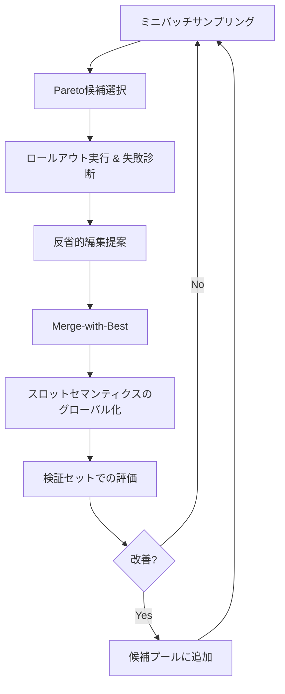

## 論文概要（Abstract）

本記事は [https://arxiv.org/abs/2604.19821](https://arxiv.org/abs/2604.19821) の解説記事です。

JTPRO（Joint Tool-Prompt Reflective Optimization）は、LLMエージェントが大規模ドメイン固有ツールインベントリを扱う際に生じるツール誤選択とスロット/値の不正確なインスタンス化を解決するフレームワークである。著者らは、根本原因を「ツール固有のニュアンスを無視する汎用的な一律プロンプト」と「ツール使用方法のガイダンスが不足したスキーマ」の2点に特定し、ロールアウト駆動の反省（rollout-driven reflection）を用いてグローバル指示文とツールごとのスキーマ/引数記述を共最適化する手法を提案している。3つのベンチマーク（ETID, ToolACE, SEAL-Tools）において、TSA（Tool Selection Accuracy）、SFA（Slot Filling Accuracy）、OSR（Overall Success Rate）で評価し、CoTスタイルエージェントやGEPA等のbaseline比でOSRを5-20%（相対）向上させたと報告している。

この記事は [Zenn記事: Bedrock AgentCoreで社内ヘルプデスクエージェントのツール選択精度と応答速度を最適化する](https://zenn.dev/0h_n0/articles/ae604dd7a92cc9) の深掘りです。

## 情報源

- **会議名**: ACL 2026（Annual Meeting of the Association for Computational Linguistics）
- **年**: 2026
- **URL**: [https://arxiv.org/abs/2604.19821](https://arxiv.org/abs/2604.19821)
- **著者**: Sandip Ghoshal, Anshul Mittal, Jyotika Singh, Miguel Ballesteros, Dan Roth, et al.（Oracle AI）
- **カテゴリ**: cs.AI, cs.SE

## カンファレンス情報

**ACL（Annual Meeting of the Association for Computational Linguistics）について**:
ACLは自然言語処理（NLP）および計算言語学分野の最高峰国際会議の1つである。毎年、世界中から数千件の投稿が集まり、採択率は20-25%程度と高い競争率を誇る。ACL 2026にJTPROが採択されたことは、ツール使用最適化がNLPコミュニティにおいて重要な研究テーマとして認知されていることを示している。

## 技術的詳細（Technical Details）

### 問題設定

LLMエージェントがツールを呼び出す際、エージェントに渡されるコンテキスト$C$は以下のように構成される（論文Equation 1）:

$$
C(P, T, Q) = P \mid T_1 \mid \cdots \mid T_n \mid Q
$$

ここで、
- $P$: グローバル指示文（エージェント全体の振る舞いを規定するプロンプト）
- $T_i$: $i$番目のツールのスキーマ記述（ツール名、説明文、引数定義）
- $Q$: ユーザクエリ
- $n$: ツールインベントリ内のツール総数

JTPROの最適化目標は以下のように定式化される（論文Equation 2）:

$$
(P^{\star}, T^{\star}) = \arg\min_{P, T} \mathbb{E}_{(Q, \tau) \sim \mathcal{D}} [\mathcal{L}(\hat{\tau}(P, T, Q), \tau)]
$$

ここで、
- $\mathcal{D}$: クエリとゴールドツール呼び出しペアのデータセット
- $\hat{\tau}$: エージェントが予測したツール呼び出し
- $\tau$: ゴールド（正解）ツール呼び出し

### 損失関数の設計

著者らは3つの評価軸を統合した損失関数を定義している（論文Equation 3）:

$$
\mathcal{L}(\hat{\tau}, \tau) = \lambda_{\text{tsa}}(1 - \mathbb{1}[\hat{t} = t]) + \lambda_{\text{sfa}} \cdot \mathbb{1}[\hat{t} = t] \cdot (1 - \text{Rec}(\hat{a}, a)) + \lambda_{\text{osr}}(1 - \mathbb{1}[\hat{t} = t \wedge \hat{a} = a])
$$

ここで、
- $\hat{t}, t$: 予測および正解のツール識別子
- $\hat{a}, a$: 予測および正解の引数構造
- $\mathbb{1}[\cdot]$: 指示関数
- $\text{Rec}(\hat{a}, a)$: 正しいツール選択を条件としたスロット/値のRecall
- $\lambda_{\text{tsa}}, \lambda_{\text{sfa}}, \lambda_{\text{osr}}$: 各コンポーネントの重み

この損失関数の設計が重要な理由は、ツール選択が正しくてもスロット充填が誤っていればエンドツーエンドの成功率（OSR）は低下するという、ツール使用における本質的な結合性を捉えている点にある。

### JTPROフレームワークの全体構成

JTPROのアルゴリズムは以下の4つの主要コンポーネントから構成される。



#### 1. 候補プール管理とPareto選択

JTPROは候補コンテキストのプール$\mathcal{C}$を管理する。各反復で、Pareto支配に基づいて最良の候補$(P^o, \{T_i^o\})$を選択する。Pareto選択とは、あるメトリクス（TSA, SFA, OSR）のいずれかで他候補を上回り、かつ他メトリクスで劣らない候補を非支配候補として保持する方式である。これにより、TSAだけ高いがSFAが低い、といった偏った最適化を避けている。

#### 2. 失敗診断と反省的編集

ミニバッチ上でエージェントをロールアウト（実行）し、予測結果$\hat{\tau}$とゴールド$\tau^{\star}$を比較して構造化された失敗信号$\mathcal{F}$を抽出する:

$$
\mathcal{F} = \text{Diagnose}(\hat{\tau}, \tau^{\star})
$$

この診断で検出されるエラーカテゴリは以下の3種類である:
- **ツール混同（Tool confusion）**: 類似ツール間の誤選択
- **必須スロット欠落（Missing required slots）**: 必要な引数が未指定
- **フォーマット/値違反（Formatting/value violations）**: 日付形式、数値範囲等の制約違反

次に、失敗信号に基づいてグローバル指示文とツールスキーマへの編集を提案する:

$$
(\Delta P, \{\Delta T_i\}) = \text{ProposeEdits}(\mathcal{F}, P^o, \{T_i^o\})
$$

#### 3. Merge-with-Best戦略

編集後のドラフト指示文$P^d$を、検証セットでの最良指示文$P^{\star}$とマージする:

$$
P' = \text{Merge}(P^d, P^{\star})
$$

この「growing playbook」アプローチにより、過去の反復で獲得したクロスカッティングルールを保持しつつ、新たなロールアウト駆動のガイダンスを追加する。これは、単純な置換では過去の知見が失われるという問題を回避するための設計判断である。

#### 4. スロットセマンティクスのグローバル化

複数ツールに共通するスロット規約（日付/時刻形式、識別子、数値範囲、ブール値、ソート順、通貨/単位）を検出し、名前付きグローバルルールとしてグローバル指示文に昇格させる:

$$
(P'', \{T_i''\}) = \text{GlobalizeSlots}(P', \{T_i'\})
$$

著者らが報告するところによると、ETIDデータセットでは繰り返し出現するパラメータが124ツール中最大77ツールに渡って存在する（論文Figure 9）。例えば `startDate`, `endDate`, `rangeMinimum`, `rangeMaximum` のようなフィールドはグローバルルールを参照し、ツール固有のフィールドのみローカルに記述を残す。これによりコンテキスト長の肥大化を防ぎつつ、一貫したスロット充填を実現している。

### アルゴリズム擬似コード

論文Algorithm 1に基づく擬似コードを以下に示す:

```python
def jtpro_optimize(
    train_data: list[tuple],
    val_data: list[tuple],
    initial_prompt: str,
    tool_schemas: dict[str, str],
    max_iterations: int,
    pool_size: int,
) -> tuple[str, dict[str, str]]:
    """JTPRO: Joint Tool-Prompt Reflective Optimization

    Args:
        train_data: [(query, gold_tool_call), ...] 訓練データ
        val_data: [(query, gold_tool_call), ...] 検証データ
        initial_prompt: 初期グローバル指示文
        tool_schemas: {tool_name: schema_description} ツールスキーマ辞書
        max_iterations: 最適化反復回数
        pool_size: 候補プールの最大サイズ

    Returns:
        最適化されたグローバル指示文とツールスキーマのタプル
    """
    # 初期化
    pool: list[tuple[str, dict]] = [(initial_prompt, tool_schemas)]
    best_prompt, best_schemas = initial_prompt, tool_schemas
    best_val_score = evaluate(val_data, best_prompt, best_schemas)

    for t in range(max_iterations):
        # ミニバッチサンプリング
        batch = sample_minibatch(train_data)

        # Pareto支配に基づく候補選択
        prompt_old, schemas_old = pareto_select(pool)

        # ロールアウト実行 & メトリクス計算
        predictions = rollout(batch, prompt_old, schemas_old)
        tsa, sfa, osr = compute_metrics(predictions, batch)

        # 失敗診断: 構造化エラー信号の抽出
        failures = diagnose(predictions, batch)

        # 反省的編集: グローバル指示文 + ツールスキーマへの修正提案
        delta_prompt, delta_schemas = propose_edits(
            failures, prompt_old, schemas_old
        )

        # 編集適用
        prompt_draft = apply_edits(prompt_old, delta_prompt)
        schemas_draft = apply_edits(schemas_old, delta_schemas)

        # Merge-with-Best: ドラフトと検証最良を統合
        prompt_merged = merge(prompt_draft, best_prompt)

        # スロットセマンティクスのグローバル化
        prompt_final, schemas_final = globalize_slots(
            prompt_merged, schemas_draft
        )

        # ミニバッチでの改善確認
        new_score = evaluate(batch, prompt_final, schemas_final)
        if new_score > osr:
            # 検証セットでの確認
            val_score = evaluate(val_data, prompt_final, schemas_final)
            if val_score > best_val_score:
                best_val_score = val_score
                best_prompt = prompt_final
                best_schemas = schemas_final

            # プールに追加（サイズ制限あり）
            pool.append((prompt_final, schemas_final))
            if len(pool) > pool_size:
                pool = prune_dominated(pool)

    return best_prompt, best_schemas
```

### 動機付けとなる具体例

著者らは論文中で、`get_all_countries` と `get_countries_list` という説明文が重複する2つのツールがエージェントに混同される例を示している。JTPROの最適化後、グローバル指示文に「`get_all_countries`は一般的な国情報リクエスト用、`get_countries_list`は投資関連クエリ用」という簡潔な優先ルールが追加され、誤選択が解消されたと報告されている。

## 実装のポイント

### Pareto選択の実装

候補プールのPareto選択では、TSA, SFA, OSRの3次元でPareto支配を判定する。ある候補$c_1$が$c_2$をPareto支配するとは、すべてのメトリクスで$c_1 \geq c_2$かつ少なくとも1つで$c_1 > c_2$が成立することを意味する。支配されない候補（Paretoフロント上の候補）のみを残す。

### 失敗診断の構造化

失敗診断（Diagnose）は単純な正誤判定ではなく、エラーの種類を構造化して返す設計が重要である。ツール混同の場合は関連ツールのペアを、スロット欠落の場合は具体的なスロット名を、フォーマット違反の場合は期待される形式と実際の値を報告する。この構造化情報がProposeEditsでの的確な修正提案を可能にしている。

### コンテキスト長の管理

ツール数が1000を超える環境では、全ツールスキーマをコンテキストに含めるとトークン制限に達する。著者らはリトリーバルによるtop-kフィルタリングを併用し、クエリに関連するツール上位20件のみをコンテキストに含めるアプローチを採用している。JTPROの最適化はこのフィルタリング後のスキーマに適用される。

### グローバル化の判断基準

スロットセマンティクスのグローバル化では、同一セマンティクスのパラメータが十分な数のツールに出現する場合のみグローバルルールに昇格させる。閾値の設計は、コンテキスト長の節約とルールの汎用性のトレードオフに依存する。

## Production Deployment Guide

JTPROのアプローチは、大規模ツールインベントリを持つエージェントシステムのプロンプトとスキーマを継続的に改善するバッチ最適化パイプラインとして実装できる。以下では、AWS上でこのパイプラインを構築する方法を示す。

### AWS実装パターン（コスト最適化重視）

JTPROは推論時のリアルタイム処理ではなく、オフラインの最適化パイプラインである。そのため、コンピュートはバッチ処理向けの構成が適する。

**トラフィック量別の推奨構成**:

| 構成 | 想定規模 | アーキテクチャ | 月額概算 |
|------|---------|---------------|---------|
| Small | ツール数~100, 訓練データ~500件 | Lambda + Step Functions + Bedrock | $100-300 |
| Medium | ツール数~500, 訓練データ~2000件 | ECS Fargate + Step Functions + Bedrock | $500-1,500 |
| Large | ツール数~1000+, 訓練データ~10000件 | EKS + Spot + Bedrock Batch API | $2,000-5,000 |

**Small構成の詳細** (~100ツール):
- AWS Lambda（メモリ1024MB, タイムアウト15分）: ロールアウト実行、診断、編集提案の各ステップ
- Step Functions: JTPROの反復ループ制御
- Amazon Bedrock（Claude Sonnet）: LLMエージェントのロールアウトと反省的編集
- DynamoDB: 候補プール、メトリクス履歴の永続化
- S3: 最適化されたプロンプト/スキーマのバージョン管理
- 月額概算: Lambda $5 + Step Functions $10 + Bedrock $80-250 + DynamoDB $5 = $100-300

**Large構成の詳細** (~1000+ツール):
- EKS + Karpenter（Spot Instances優先, g5.xlarge）: 大規模ロールアウトの並列実行
- Bedrock Batch API: 50%コスト削減でバッチ推論
- ElastiCache（Redis）: 候補プールのインメモリ管理
- S3 + DynamoDB: 最適化履歴とバージョン管理
- 月額概算: EKS $200 + Spot EC2 $400-1,500 + Bedrock Batch $1,000-2,500 + Redis $150 + S3/DynamoDB $50 = $2,000-5,000

**コスト削減テクニック**:
- Bedrock Batch APIで50%削減（ロールアウトは非同期処理可能）
- Spot Instancesで最大90%削減（バッチワークロードは中断耐性あり）
- Prompt Cachingで30-90%削減（同一グローバル指示文を多数のクエリで再利用）
- 最適化は日次/週次実行で十分なため、Reserved Instancesよりスケジュール実行が有利

**コスト試算の注意事項**: 上記は2026年7月時点のAWS ap-northeast-1（東京）リージョン料金に基づく概算値である。実際のコストはロールアウト回数、ツール数、LLMトークン消費量により変動する。最新料金はAWS料金計算ツールで確認を推奨する。

### Terraformインフラコード

**Small構成（Serverless: Lambda + Step Functions + Bedrock）**:

```hcl
# JTPRO Optimization Pipeline - Small構成
# Lambda + Step Functions + Bedrock + DynamoDB

terraform {
  required_version = ">= 1.9"
  required_providers {
    aws = {
      source  = "hashicorp/aws"
      version = "~> 5.60"
    }
  }
}

provider "aws" {
  region = "ap-northeast-1"
}

# --- DynamoDB: 候補プール & メトリクス履歴 ---
resource "aws_dynamodb_table" "candidate_pool" {
  name         = "jtpro-candidate-pool"
  billing_mode = "PAY_PER_REQUEST"  # On-Demand: コスト最適化
  hash_key     = "iteration_id"
  range_key    = "candidate_id"

  attribute {
    name = "iteration_id"
    type = "N"
  }
  attribute {
    name = "candidate_id"
    type = "S"
  }

  server_side_encryption {
    enabled = true  # KMS暗号化
  }

  point_in_time_recovery {
    enabled = true
  }

  tags = {
    Project = "jtpro-optimization"
    CostCenter = "ml-pipeline"
  }
}

# --- S3: プロンプト/スキーマバージョン管理 ---
resource "aws_s3_bucket" "artifacts" {
  bucket = "jtpro-optimization-artifacts"

  tags = {
    Project = "jtpro-optimization"
  }
}

resource "aws_s3_bucket_versioning" "artifacts" {
  bucket = aws_s3_bucket.artifacts.id
  versioning_configuration {
    status = "Enabled"
  }
}

resource "aws_s3_bucket_server_side_encryption_configuration" "artifacts" {
  bucket = aws_s3_bucket.artifacts.id
  rule {
    apply_server_side_encryption_by_default {
      sse_algorithm = "aws:kms"
    }
  }
}

# --- IAMロール: Lambda用（最小権限） ---
resource "aws_iam_role" "lambda_jtpro" {
  name = "jtpro-lambda-role"
  assume_role_policy = jsonencode({
    Version = "2012-10-17"
    Statement = [{
      Action = "sts:AssumeRole"
      Effect = "Allow"
      Principal = { Service = "lambda.amazonaws.com" }
    }]
  })
}

resource "aws_iam_role_policy" "lambda_jtpro" {
  name = "jtpro-lambda-policy"
  role = aws_iam_role.lambda_jtpro.id
  policy = jsonencode({
    Version = "2012-10-17"
    Statement = [
      {
        Effect = "Allow"
        Action = ["bedrock:InvokeModel"]
        Resource = [
          "arn:aws:bedrock:ap-northeast-1::foundation-model/anthropic.claude-*"
        ]
      },
      {
        Effect = "Allow"
        Action = [
          "dynamodb:PutItem", "dynamodb:GetItem",
          "dynamodb:Query", "dynamodb:UpdateItem"
        ]
        Resource = [aws_dynamodb_table.candidate_pool.arn]
      },
      {
        Effect = "Allow"
        Action = ["s3:PutObject", "s3:GetObject"]
        Resource = ["${aws_s3_bucket.artifacts.arn}/*"]
      },
      {
        Effect = "Allow"
        Action = [
          "logs:CreateLogGroup", "logs:CreateLogStream",
          "logs:PutLogEvents"
        ]
        Resource = ["arn:aws:logs:*:*:*"]
      }
    ]
  })
}

# --- Lambda: ロールアウト & 診断 ---
resource "aws_lambda_function" "rollout" {
  function_name = "jtpro-rollout"
  role          = aws_iam_role.lambda_jtpro.arn
  runtime       = "python3.12"
  handler       = "rollout.handler"
  timeout       = 900  # 15分（最適化反復は重い）
  memory_size   = 1024
  filename      = "lambda/rollout.zip"

  environment {
    variables = {
      CANDIDATE_TABLE = aws_dynamodb_table.candidate_pool.name
      ARTIFACT_BUCKET = aws_s3_bucket.artifacts.id
      BEDROCK_MODEL   = "anthropic.claude-sonnet-4-20250514"
    }
  }

  tags = {
    Project = "jtpro-optimization"
  }
}

# --- CloudWatch: コスト監視アラーム ---
resource "aws_cloudwatch_metric_alarm" "bedrock_cost" {
  alarm_name          = "jtpro-bedrock-token-spike"
  comparison_operator = "GreaterThanThreshold"
  evaluation_periods  = 1
  metric_name         = "InvocationCount"
  namespace           = "AWS/Bedrock"
  period              = 3600
  statistic           = "Sum"
  threshold           = 1000
  alarm_description   = "Bedrock invocation spike detection"
  alarm_actions       = []  # SNS ARNを設定
}
```

**Large構成（Container: EKS + Karpenter + Spot）**:

```hcl
# JTPRO Optimization Pipeline - Large構成
# EKS + Karpenter + Spot Instances + Bedrock Batch API

module "eks" {
  source  = "terraform-aws-modules/eks/aws"
  version = "~> 20.24"

  cluster_name    = "jtpro-optimization"
  cluster_version = "1.31"

  vpc_id     = module.vpc.vpc_id
  subnet_ids = module.vpc.private_subnets

  # Karpenterによるノード管理
  enable_cluster_creator_admin_permissions = true

  tags = {
    Project    = "jtpro-optimization"
    CostCenter = "ml-pipeline"
  }
}

# --- Karpenter: Spot優先の自動スケーリング ---
resource "kubectl_manifest" "karpenter_nodepool" {
  yaml_body = <<-YAML
    apiVersion: karpenter.sh/v1
    kind: NodePool
    metadata:
      name: jtpro-workers
    spec:
      template:
        spec:
          requirements:
            - key: karpenter.sh/capacity-type
              operator: In
              values: ["spot", "on-demand"]  # Spot優先
            - key: node.kubernetes.io/instance-type
              operator: In
              values: ["m6i.xlarge", "m6i.2xlarge", "c6i.xlarge"]
          nodeClassRef:
            group: karpenter.k8s.aws
            kind: EC2NodeClass
            name: default
      limits:
        cpu: "64"
        memory: "256Gi"
      disruption:
        consolidationPolicy: WhenEmptyOrUnderutilized
        consolidateAfter: 30s  # アイドルノード即回収
  YAML
}

# --- Secrets Manager: Bedrock設定 ---
resource "aws_secretsmanager_secret" "bedrock_config" {
  name        = "jtpro/bedrock-config"
  description = "Bedrock model configuration for JTPRO"
}

# --- AWS Budgets: 月額予算アラート ---
resource "aws_budgets_budget" "jtpro" {
  name         = "jtpro-monthly"
  budget_type  = "COST"
  limit_amount = "5000"
  limit_unit   = "USD"
  time_unit    = "MONTHLY"

  notification {
    comparison_operator       = "GREATER_THAN"
    threshold                 = 80
    threshold_type            = "PERCENTAGE"
    notification_type         = "ACTUAL"
    subscriber_email_addresses = ["team@example.com"]
  }
}
```

### 運用・監視設定

**CloudWatch Logs Insights クエリ** -- 最適化パイプラインのコスト異常検知:

```
# 1時間あたりのBedrock トークン使用量推移
fields @timestamp, @message
| filter @message like /bedrock_tokens/
| stats sum(input_tokens) as total_input,
        sum(output_tokens) as total_output,
        count(*) as invocations
  by bin(1h)
| sort @timestamp desc
```

```
# JTPRO反復ごとのOSR改善トラッキング
fields @timestamp, iteration, osr, tsa, sfa
| filter event_type = "optimization_step"
| stats max(osr) as best_osr,
        avg(osr) as avg_osr
  by iteration
| sort iteration asc
```

**CloudWatch アラーム設定（Python boto3）**:

```python
import boto3

cloudwatch = boto3.client("cloudwatch", region_name="ap-northeast-1")

# Bedrock トークン使用量スパイク検知
cloudwatch.put_metric_alarm(
    AlarmName="jtpro-bedrock-token-spike",
    MetricName="InputTokenCount",
    Namespace="AWS/Bedrock",
    Statistic="Sum",
    Period=3600,
    EvaluationPeriods=1,
    Threshold=500000,
    ComparisonOperator="GreaterThanThreshold",
    AlarmActions=["arn:aws:sns:ap-northeast-1:ACCOUNT:jtpro-alerts"],
    AlarmDescription="JTPRO: Bedrock input token spike (>500K/hour)",
)
```

**X-Ray トレーシング設定（Python）**:

```python
from aws_xray_sdk.core import xray_recorder, patch_all

# boto3自動計装
patch_all()

@xray_recorder.capture("jtpro_rollout")
def execute_rollout(
    prompt: str,
    schemas: dict[str, str],
    queries: list[str],
) -> list[dict]:
    """ロールアウト実行をX-Rayでトレーシング"""
    subsegment = xray_recorder.current_subsegment()
    subsegment.put_annotation("tool_count", len(schemas))
    subsegment.put_annotation("batch_size", len(queries))
    subsegment.put_metadata("prompt_length", len(prompt))
    # ... ロールアウト実行ロジック ...
```

**Cost Explorer 日次レポート（Python）**:

```python
import boto3
from datetime import datetime, timedelta

ce = boto3.client("ce", region_name="us-east-1")
sns = boto3.client("sns", region_name="ap-northeast-1")

def daily_cost_report() -> dict:
    """JTPRO関連の日次コストレポート"""
    end = datetime.utcnow().strftime("%Y-%m-%d")
    start = (datetime.utcnow() - timedelta(days=1)).strftime("%Y-%m-%d")

    response = ce.get_cost_and_usage(
        TimePeriod={"Start": start, "End": end},
        Granularity="DAILY",
        Metrics=["UnblendedCost"],
        Filter={
            "Tags": {
                "Key": "Project",
                "Values": ["jtpro-optimization"],
            }
        },
        GroupBy=[{"Type": "DIMENSION", "Key": "SERVICE"}],
    )

    total = sum(
        float(g["Metrics"]["UnblendedCost"]["Amount"])
        for r in response["ResultsByTime"]
        for g in r["Groups"]
    )

    if total > 100:
        sns.publish(
            TopicArn="arn:aws:sns:ap-northeast-1:ACCOUNT:jtpro-alerts",
            Subject="JTPRO Daily Cost Alert",
            Message=f"Daily cost exceeded $100: ${total:.2f}",
        )
    return {"total_cost": total, "details": response}
```

### コスト最適化チェックリスト

**アーキテクチャ選択**:
- [ ] ツール数100以下 → Serverless (Lambda + Step Functions)
- [ ] ツール数100-500 → Hybrid (ECS Fargate + Step Functions)
- [ ] ツール数500以上 → Container (EKS + Karpenter)

**リソース最適化**:
- [ ] EC2/EKS: Spot Instances優先（バッチ処理は中断耐性あり、最大90%削減）
- [ ] 週次実行の場合はReserved不要、スケジュールベースで起動/停止
- [ ] Lambda: メモリサイズをAWS Lambda Power Tuningで最適化
- [ ] EKS: Karpenter consolidationPolicyで未使用ノード即回収
- [ ] Step Functions Express Workflowsで実行コスト削減

**LLMコスト削減**:
- [ ] Bedrock Batch APIで50%削減（ロールアウトは24時間以内の完了で十分）
- [ ] Prompt Cachingで30-90%削減（同一グローバル指示文を多クエリで再利用）
- [ ] モデル選択: 診断/編集提案はSonnet、ロールアウトはHaikuでコスト最適化
- [ ] トークン数制限: ツールスキーマの冗長記述を圧縮
- [ ] リトリーバルでtop-20にフィルタリングしてコンテキスト長を削減

**監視・アラート**:
- [ ] AWS Budgets: 月額上限アラート設定（80%, 100%閾値）
- [ ] CloudWatch: Bedrockトークンスパイク検知アラーム
- [ ] Cost Anomaly Detection: 自動異常検知有効化
- [ ] 日次コストレポート: Cost Explorer API + SNS通知

**リソース管理**:
- [ ] 最適化完了後のEKSノード自動スケールダウン
- [ ] S3ライフサイクル: 古い候補プールスナップショットを90日後にGlacierへ
- [ ] タグ戦略: Project, CostCenter, Environmentタグ必須
- [ ] 開発環境: 夜間/週末は自動停止（EventBridge Scheduler）
- [ ] 未使用のDynamoDB項目をTTLで自動削除

## 実験結果

### データセット

著者らは3つのベンチマークで評価を行っている（論文Table 1）:

| データセット | ツール数 | 平均引数数 | 最大引数数 | 特徴 |
|-------------|---------|-----------|-----------|------|
| ETID | 124 | 3.4 | 12 | 複雑なスロット充填、企業ドメイン |
| ToolACE-300~1000 | 336~1036 | 2.05~2.17 | 14~23 | ツール数スケーリング |
| SEAL-Tools | 1138 | 2.41 | 8 | 並列マルチツール呼び出し |

### ToolACE結果（ツールスケーリング）

論文Table 2より、ToolACE-500およびToolACE-1000でのOSR結果を示す:

| モデル | ツール数 | Base OSR | GEPA OSR | JTPRO OSR | 改善幅 |
|-------|---------|----------|----------|-----------|-------|
| GPT-4o mini | 500 | 60.0% | 62.0% | 69.4% | +9.4pp |
| GPT-4o mini | 1000 | 58.2% | 60.3% | 63.6% | +5.4pp |
| o3-mini | 500 | 59.5% | 62.0% | 65.3% | +5.8pp |
| o3-mini | 1000 | 51.3% | 58.7% | 64.5% | +13.2pp |
| GPT-5 | 500 | 62.7% | 66.1% | 74.4% | +11.7pp |
| GPT-5 | 1000 | 62.4% | 67.8% | 73.6% | +11.2pp |

著者らは、o3-miniの1000ツール環境でBaselineからOSRが+13.2ポイント向上した結果を「ツール数がスケールするほどJTPROの共最適化が有効に機能する」と分析している。

### ETID結果（複雑なスロット充填）

論文Table 3より、ETIDでの少数ショット設定での結果:

| モデル | 訓練例数 | Base OSR | GEPA OSR | JTPRO OSR |
|-------|---------|----------|----------|-----------|
| GPT-4o mini | 1ex | 44.8% | 50.2% | 60.2% |
| GPT-4o mini | 4ex | 46.5% | 54.3% | 66.8% |
| o3-mini | 1ex | 68.8% | 75.0% | 79.5% |
| o3-mini | 4ex | 67.3% | 77.7% | 82.7% |
| GPT-5 | 1ex | 68.8% | 80.2% | 84.7% |
| GPT-5 | 4ex | 70.5% | 80.7% | 85.2% |

注目すべき点として、GPT-4o miniのTSAは85-88%と比較的高いにもかかわらず、BaselineのOSRは44-46%に留まっている。著者らはこれを「高いTSAがOSRのボトルネックを隠蔽している。スロット充填精度がエンドツーエンド成功率を決定的に左右する」と指摘している。JTPROはSFAを大幅に改善することでこのギャップを埋めている。

### SEAL-Tools結果（並列マルチツール呼び出し）

論文Table 4より、複数ツールを同時に呼び出す設定での結果:

| モデル | Base OSR | GEPA OSR | JTPRO OSR |
|-------|----------|----------|-----------|
| GPT-4o | 23.0% | 24.5% | 27.5% |
| o3-mini | 26.3% | 27.5% | 30.1% |
| GPT-5 | 28.8% | 31.1% | 33.6% |

マルチツール設定ではOSRの絶対値が低い（平均3.2本のツールを並列呼び出し、77%が正確に3本要求）。それでもJTPROはすべてのモデルでSFAとOSRを一貫して改善しており、著者らは「共最適化が強いTSAをエンドツーエンドの成功に変換する」と述べている。

### アブレーション分析

**インスタンスレベルの改善分布**（論文Figures 12-13）:
- ToolACE-500（GPT-5）: 121テスト例中26例（21.48%）でスロット修正
- ETID: 403テスト例中94例（23.33%）でスロット修正

著者らは「改善が多数のテストインスタンスに分散しており、外れ値に依存していない」と報告している。

**ツール曖昧性解消の分析**: ToolACE-500において、JTPROはツール説明文の11%（500中55件）を更新し、最も改善したセマンティクスグループでは、グループ内コサイン類似度が0.668から0.502に低下（-16.6%）した。これは、類似ツール間の説明文が明確に差別化されたことを意味する。

## 実運用への応用 -- AgentCore Optimizationとの対応

JTPROの技術は、Zenn記事で紹介したBedrock AgentCore Optimization機能と本質的に同じアプローチを採用している。

| JTPROの概念 | AgentCore Optimizationの対応機能 |
|------------|-------------------------------|
| ロールアウト駆動の反省 | プロダクショントレースからの継続的改善 |
| グローバル指示文の最適化 | システムプロンプトの改善案提示 |
| ツールスキーマの共最適化 | ツール説明文の改善レコメンデーション |
| Pareto支配による候補選択 | A/Bテストベースの最良構成選択 |
| スロットセマンティクスのグローバル化 | 共通パラメータ規約の標準化 |

**実務での活用ポイント**:

1. **段階的な導入**: まず少数のツール（10-20個）でJTPROスタイルの最適化を実行し、効果を検証してからツール数をスケールさせる。AgentCoreのOptimization機能はこの段階的アプローチをマネージドサービスとして提供している。

2. **スロット充填への注力**: 論文の実験結果が示すように、ツール選択精度が高くてもスロット充填精度が低ければOSRは向上しない。実運用では、ツール選択のミスだけでなく、引数のフォーマット違反や欠落にも注意を払う必要がある。

3. **共通規約のグローバル化**: 日付形式、ページネーション、ソート順などの共通パラメータは、各ツールの説明文に重複して記載するのではなく、グローバル指示文に一度だけ定義すべきである。これはAgentCoreのPrompt Optimization機能でも推奨されるプラクティスである。

### 著者らが指摘する限界

著者らは以下の限界を明示している:
- 評価は単一ツール呼び出しと並列マルチツール呼び出しに限定されており、ツール間依存関係がある逐次ワークフローは未検証
- 深くネストされた引数構造（多層JSON、オブジェクトのリスト）への体系的なストレステストは行われていない
- 評価は呼び出しレベルの正しさに焦点を当てており、応答検証を含むエンドツーエンド実行評価ではない
- ETIDデータセットは未公開であり、外部再現性が制限される

## まとめ

JTPROは、LLMエージェントのツール使用における「ツール選択（TSA）は高いがスロット充填（SFA）が低いためにOSRが伸びない」というボトルネックに対して、グローバル指示文とツールスキーマの共最適化という統合的なアプローチで取り組んだ研究である。3つのベンチマークでの実験により、共最適化が個別最適化より一貫して有効であることが示されている。

実務的には、Bedrock AgentCore Optimizationがこの論文のアプローチをマネージドサービスとして提供しており、プロダクショントレースに基づくシステムプロンプトとツール説明文の継続的改善が利用可能である。大規模ツールインベントリを持つエージェントシステムを運用するエンジニアにとって、JTPROの知見はツール使用最適化の体系的な指針となる。

## 参考文献

- **Conference URL**: [https://arxiv.org/abs/2604.19821](https://arxiv.org/abs/2604.19821)
- **著者**: Sandip Ghoshal, Anshul Mittal, Jyotika Singh, Miguel Ballesteros, Weiyi Sun, Fang Tu, Shailender Singh, Yassine Benajiba, Fahad Shah, Sujeeth Bharadwaj, Sujith Ravi, Dan Roth (Oracle AI)
- **関連手法**: GEPA, MIPRO, AVATAR, DRAFT, Dynamic Cheatsheet
- **Related Zenn article**: [https://zenn.dev/0h_n0/articles/ae604dd7a92cc9](https://zenn.dev/0h_n0/articles/ae604dd7a92cc9)
