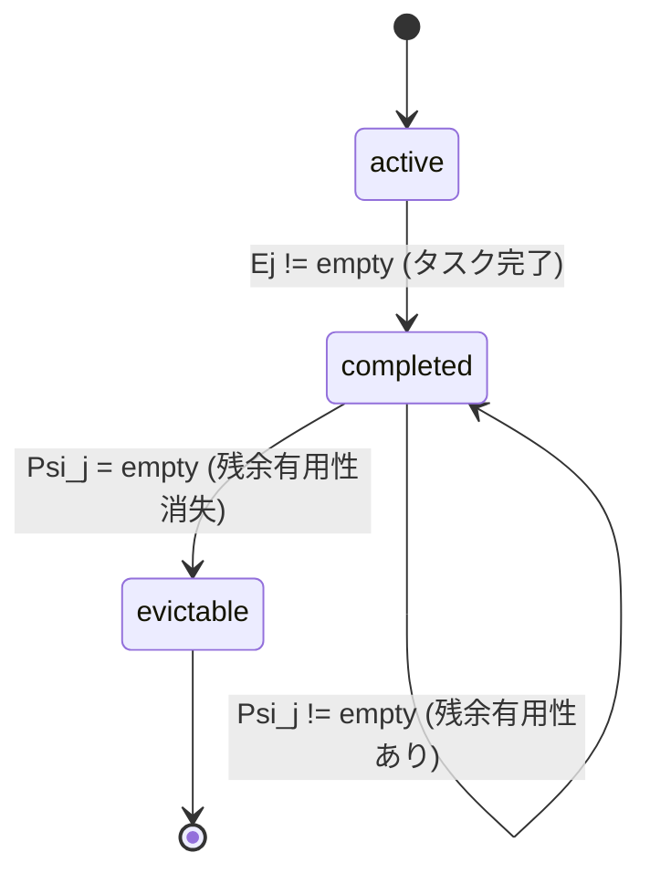

## 論文概要

本記事は [https://arxiv.org/abs/2606.17016](https://arxiv.org/abs/2606.17016) の解説記事です。

TokenPilotは、拡張LLMエージェントセッションにおけるコンテキスト蓄積コストの問題に取り組む2層コンテキスト管理フレームワークである。既存のテキスト圧縮や動的メモリ退去はシーケンスを変更するため、プレフィックスキャッシュの不一致とキャッシュ無効化を引き起こす。TokenPilotは、グローバル層のIngestion-Aware Compaction（取り込み時に環境ノイズを除去しプレフィックスを安定化）とローカル層のLifecycle-Aware Eviction（タスク関連性の期限に基づきセグメントを保守的に削除）を組み合わせ、テキスト疎密性とキャッシュ連続性の両立を実現する。PinchBenchとClaw-Evalにおいて、単独モードで最大61%、連続モードで最大87%のコスト削減を達成している。

この記事は [Zenn記事: Bedrock AgentCoreで社内ヘルプデスクエージェントのツール選択精度と応答速度を最適化する](https://zenn.dev/0h_n0/articles/ae604dd7a92cc9) の深掘りです。

## 情報源

| 項目 | 内容 |
|------|------|
| arXiv ID | 2606.17016 |
| URL | [https://arxiv.org/abs/2606.17016](https://arxiv.org/abs/2606.17016) |
| 著者 | Buqiang Xu, Zirui Xue, Ningyu Zhang, et al.（Zhejiang University） |
| 発表年 | 2026年6月 |
| 分野 | cs.CL, cs.AI, cs.LG, cs.MA |
| コード | [https://github.com/zjunlp/LightMem2](https://github.com/zjunlp/LightMem2) |

## 背景と動機

### LLMエージェントにおけるコンテキスト蓄積コスト

LLMエージェントは、ツール呼び出し・環境観測・思考トレースを繰り返しながら複数ステップのタスクを実行する。各ステップで取得した情報はコンテキストウィンドウに蓄積されるため、セッションが長期化するほど入力トークン数が増大し、推論コストが急激に上昇する。

この問題は、API課金モデルにおいて特に深刻である。論文ではGPT-5.4-miniの料金体系（キャッシュヒット: $0.075/Mトークン、キャッシュミス: $0.75/Mトークン、出力: $4.50/Mトークン）を用いて評価しており、キャッシュヒットとミスの間に10倍の価格差が存在する。この価格差が、キャッシュ効率の最適化を経済的に重要な課題とする根拠となっている。

### 既存手法が引き起こすキャッシュ無効化問題

従来のコンテキスト管理手法は、大きく2つのカテゴリに分類される。

**静的圧縮**（LLMLingua-2、SelectiveContextなど）は、非本質的なトークンや文を刈り込むことでコンテキストを圧縮する。しかし、テキストの一部を削除するとバイト列が変化し、LLMプロバイダのプレフィックスキャッシュ機構がキャッシュミスを返す。結果として、圧縮によるトークン数削減の効果がキャッシュ無効化による再計算コストで相殺される。

**動的スケジューリング**（MemoBrain、AgentSwingなど）は、実行時にコンテキストを動的に再構成するが、やはりシーケンスの変更がプレフィックスの不一致を引き起こす。

著者らはこの問題を「テキスト疎密性（text sparsity）とキャッシュ連続性（cache continuity）の緊張関係」と定式化している。コンテキストを刈り込めばトークン数は減るが、キャッシュが壊れる。キャッシュを保持すればコストは安いが、不要なトークンが蓄積する。TokenPilotは、この二律背反を2層の管理戦略で解決する。

## 主要な貢献

著者らは、TokenPilotの主要な貢献として以下の3点を挙げている。

1. **キャッシュ整合性を保つ圧縮手法（Ingestion-Aware Compaction）**: 取り込み時に環境ノイズを除去し、ランタイム揮発マーカーを静的プレースホルダーに置換することで、バイト同一のプレフィックスを維持しキャッシュヒット率を最大83.1%まで向上させた
2. **ライフサイクルベースの保守的退去（Lifecycle-Aware Eviction）**: コンテキストセグメントを状態機械でモデル化し、タスク完了後も残余有用性がある限り保持する保守的な削除戦略を導入した
3. **実証的コスト削減**: PinchBenchとClaw-Evalの2つのベンチマークにおいて、精度を維持しつつ最大87%のコスト削減を達成し、LightMem2として公開した

## 技術的詳細

### 最適化目標

TokenPilotの目標は、メンテナンスコストに対するコンテキスト有用性を最大化することである。著者らは目的関数を以下のように定式化している（論文 Equation 1）。

$$
\max_{M} \frac{\sum \hat{U}(m \mid C')}{K(C')}
$$

ここで、
- $M$: コンテキスト管理戦略
- $\hat{U}(m \mid C')$: 最適化後のコンテキスト$C'$におけるメッセージ$m$の限界トークン貢献度
- $K(C')$: コンテキスト$C'$のサービングコスト

### コストモデル

サービングコストは、キャッシュヒットとキャッシュミスの重み付き和として定義される（論文 Equation 2）。

$$
K(C') = \alpha \cdot |C'_{\text{hit}}| + |C'_{\text{miss}}|
$$

ここで、
- $C'_{\text{hit}}$: プレフィックスキャッシュにヒットしたトークン群
- $C'_{\text{miss}}$: キャッシュミスしたトークン群（完全なpre-fillが必要）
- $\alpha$: キャッシュヒットの相対コスト（$\alpha \ll 1$、GPT-5.4-miniでは$\alpha = 0.1$）

この定式化により、キャッシュヒット率の向上がコスト削減に直結することが明確になる。$\alpha = 0.1$の場合、100トークンのキャッシュヒットは10トークンのキャッシュミスと等価なコストであり、プレフィックスを安定化してキャッシュヒットに変換することの経済的価値は大きい。

### Ingestion-Aware Compaction（グローバル層）

グローバル層は、メッセージの取り込み時点でコンテキストを圧縮する。2つのサブメカニズムで構成される。

#### メッセージ有用性の分類

著者らは、メッセージを意図的メッセージ（$\Omega_{\text{int}}$）と環境フィードバック（$\Omega_{\text{env}}$）に分類し、それぞれ異なる有用性評価を適用する（論文 Equation 3）。

$$
\hat{U}(m) = \begin{cases}
1 & \text{if } m \in \Omega_{\text{int}} \\
\max(\gamma(m),\; G(m)) & \text{if } m \in \Omega_{\text{env}}
\end{cases}
$$

ここで、
- $\Omega_{\text{int}}$: システムプロンプト、思考トレース、ツール呼び出しなどの意図的メッセージ（常に有用性1）
- $\Omega_{\text{env}}$: ツール実行結果、API応答などの環境フィードバック
- $\gamma(m)$: メッセージ$m$の基底有用性（$\gamma(m) \leq 1$）
- $G(m) = \mathbf{1}[f(h(m)) > \tau]$: アクセス頻度$f$がしきい値$\tau$を超えたとき1となるゲート関数

意図的メッセージは削除・圧縮の対象外であり、環境フィードバックのみが圧縮対象となる。

#### プレフィックス安定化

キャッシュ整合性を保つ中核メカニズムが、正規化演算子$\varphi$によるプレフィックス安定化である（論文 Equation 4）。

$$
\varphi(m^{(t)}) = \varphi(m^{(t+1)}) \implies C'_{\text{prefix}} \subseteq C'_{\text{hit}}
$$

正規化演算子$\varphi$は、ランタイム揮発マーカー（タイムスタンプ、セッションID、一時ファイルパスなど）を静的プレースホルダーに置換する。これにより、異なるタスク間でもプレフィックスのバイト列が同一に保たれ、キャッシュヒットが保証される。

著者らの報告によれば、この安定化によりPinchBenchのキャッシュヒット率が38.7%から79.2%に、Claw-Evalでは67.2%から83.1%に向上した（論文 Table 5, Figure 4）。

#### 観測縮約

環境フィードバックの圧縮は、構造的プレビューとアーティファクトレジストリの2段階で行われる（論文 Equation 5）。

$$
m_{\text{ingest}} = \kappa(m), \quad A[h(m)] \leftarrow m
$$

ここで、
- $\kappa(m)$: メッセージ$m$の構造的プレビュー（コンパクト化された要約）
- $A$: アーティファクトレジストリ（完全なペイロードを格納）
- $h(m)$: メッセージ$m$のコンテンツハッシュ

作業メモリにはコンパクト化されたプレビュー$\kappa(m)$のみを配置し、完全なペイロードはハッシュインデックスでアーティファクトレジストリに格納する。圧縮されたメッセージで重要なシグナルが欠落している場合、回復ツールが完全なペイロードを動的に取得する。

著者らは、この2段階の圧縮によりHTMLスリミングで最大115k文字、実行ログのトランケーションで最大883k文字の構造的ノイズを除去したと報告している（論文 Figure 5）。

### Lifecycle-Aware Eviction（ローカル層）

ローカル層は、コンテキストセグメントのライフサイクルを追跡し、タスク関連性が消失したセグメントのみを保守的に削除する。

#### コンテキストセグメント状態機械

各コンテキストセグメント$c_j$は、3つの状態を持つ状態機械でモデル化される（論文 Equations 6-8）。

$$
\hat{U}(c_j) = \begin{cases}
1 & \text{if } s_j = \text{active} \\
\mathbf{1}[\Psi_j \neq \emptyset] & \text{if } s_j = \text{completed} \\
0 & \text{if } s_j = \text{evictable}
\end{cases}
$$

状態遷移は以下のルールに従う。

$$
\text{active} \xrightarrow{E_j \neq \emptyset} \text{completed} \xrightarrow{\Psi_j = \emptyset} \text{evictable}
$$

ここで、
- $s_j$: セグメント$c_j$の現在の状態
- $E_j$: タスク完了のエビデンス（実行目標の達成を示す証拠）
- $\Psi_j$: セグメント$c_j$の残余有用性（他のアクティブタスクへの参照可能性）

重要な設計判断は、タスクが完了（$E_j \neq \emptyset$）しても、残余有用性$\Psi_j$が存在する限りセグメントをキャッシュに保持する点である。著者らの実験では、残余有用性の推定を省略した場合、各タスクがファイルを最初から再読み込みし、冗長なフルファイルリードと逐次スキャンが発生すると報告されている（論文 Figure 7）。



#### バッチゲート実行

状態推定は毎ターン実行するのではなく、$B$ターンのバッチ単位で保守的にトリガされる（論文 Equation 7）。

$$
\Delta R_i^{(j)} = \langle E_j, \Psi_j \rangle = \mathcal{E}(V_i, R_{i-1})
$$

ここで、
- $\mathcal{E}$: 状態推定器（Qwen3.5-35B-A3Bを軽量ゼロショットバリデータとして使用）
- $V_i$: 圧縮された履歴ビュー
- $R_{i-1}$: 前回のレジストリ状態

著者らは経験的に最適なバッチ間隔を$B = 3$ターンと報告しており、これによりタスク精度、メモリ削減、API呼び出し時間のバランスが取れると述べている（論文 Figure 6）。状態推定器の総コストは連続PinchBench全体で$0.03未満であり、オーバーヘッドは無視できるレベルである。

#### 最終コンテキストの構築

最適化されたコンテキストは、退去可能でないすべてのメッセージから構成される（論文 Equation 9）。

$$
C' = \{m \in C \mid s_j(m) \neq \text{evictable}\}
$$

## 実装のポイント

### ハイパーパラメータ設定

著者らが報告している実装上の重要なパラメータを以下にまとめる（論文 Appendix A.4）。

| パラメータ | 値 | 用途 |
|-----------|-----|------|
| triggerMinChars | 2200 | アクティベーションゲートの最小文字数 |
| maxToolChars | 1200 | ツール出力の最大文字数 |
| 実行出力トランケーション | 50k文字 | グローバル上限 |
| bash出力上限 | 30k文字 | ツール固有しきい値 |
| grep出力上限 | 20k文字 | ツール固有しきい値 |
| 重複排除上限 | 5回 | 連続同一ツール呼び出しの最大回数 |
| プレビューブロック | 600+400文字 | プレフィックス+サフィックス |
| 画像ダウンサンプル | 100KB (bitmap) / 50KB (SVG) | 画像サイズ上限 |
| パストランケーション | 80文字 | ファイルパスの最大長 |
| バッチウィンドウ | 3ターン | 状態推定のトリガ間隔 |

### 実装時の注意点

1. **プレフィックス安定化の実装**: 正規化演算子$\varphi$は、タイムスタンプ・セッションID・一時パスなどの揮発マーカーを正規表現で検出し、固定プレースホルダーに置換する。パターンの網羅性がキャッシュヒット率を直接左右するため、ドメイン固有のパターンを追加することが推奨される
2. **アーティファクトレジストリの設計**: コンテンツハッシュによるインデックスは、同一ペイロードの重複格納を防ぐ。実装ではインメモリハッシュマップで十分だが、長期セッションではLRU的な退去ポリシーの追加を検討する必要がある
3. **状態推定器の選択**: 著者らはQwen3.5-35B-A3B（MoEモデル、アクティブパラメータ3B）を使用しているが、推定精度と推論コストのトレードオフに応じて他の軽量モデルも代替可能である

## Production Deployment Guide

TokenPilotの2層コンテキスト管理をAWS上でプロダクション運用するための実装ガイドを示す。LLMエージェントのコンテキスト管理ミドルウェアとして、Amazon Bedrock AgentCoreと組み合わせた構成を想定する。

### AWS実装パターン（コスト最適化重視）

**トラフィック量別の推奨構成**:

| 構成 | 想定負荷 | 主要サービス | 月額概算 |
|------|---------|-------------|---------|
| Small | ~100 req/日 | Lambda + Bedrock + DynamoDB | $50-150 |
| Medium | ~1000 req/日 | ECS Fargate + Bedrock + ElastiCache | $300-800 |
| Large | 10000+ req/日 | EKS + Spot + ElastiCache Cluster | $2,000-5,000 |

**Small構成の詳細**（~100 req/日）:
- **Lambda** (arm64, 1024MB, 60s timeout): コンテキスト管理ロジック実行。正規化演算子$\varphi$によるプレフィックス安定化と観測縮約$\kappa$を実行
- **DynamoDB** (On-Demand): アーティファクトレジストリ$A$の永続化。コンテンツハッシュ$h(m)$をパーティションキーとして使用
- **Bedrock** (Claude Sonnet): メインLLM推論。Prompt Caching有効化でキャッシュヒット分を90%削減
- 月額内訳: Lambda $5 + DynamoDB $10 + Bedrock $35-135

**Large構成の詳細**（10000+ req/日）:
- **EKS** (Karpenter + Spot): コンテキスト管理ワーカー群。バッチゲート実行の並列処理
- **ElastiCache** (Redis Cluster): セグメント状態機械のリアルタイム管理。状態遷移$\text{active} \to \text{completed} \to \text{evictable}$の高速ルックアップ
- **Bedrock**: Prompt Caching + Batch API併用で最大80%コスト削減
- Spot Instances活用で計算コストを最大90%削減

**コスト削減テクニック**:
- Spot Instances活用でEKSワーカーノードを最大90%削減
- Reserved Instances（1年コミット）でベースライン負荷を最大72%削減
- Bedrock Batch API使用で非リアルタイム処理を50%削減
- Prompt Caching有効化でキャッシュヒット分を90%削減（TokenPilotのプレフィックス安定化と相乗効果）

> **コスト試算の注意事項**: 上記は2026年7月時点のAWS ap-northeast-1（東京）リージョン料金に基づく概算値です。実際のコストはトラフィックパターン、リージョン、バースト使用量により変動します。最新料金は[AWS料金計算ツール](https://calculator.aws/)で確認してください。

### Terraformインフラコード

**Small構成（Serverless）**:

```hcl
# TokenPilot Context Manager - Small構成
# Lambda + Bedrock + DynamoDB

terraform {
  required_version = ">= 1.12"
  required_providers {
    aws = {
      source  = "hashicorp/aws"
      version = "~> 5.90"
    }
  }
}

provider "aws" {
  region = "ap-northeast-1"
}

# --- IAMロール（最小権限） ---
resource "aws_iam_role" "tokenpilot_lambda" {
  name = "tokenpilot-context-manager"
  assume_role_policy = jsonencode({
    Version = "2012-10-17"
    Statement = [{
      Action = "sts:AssumeRole"
      Effect = "Allow"
      Principal = { Service = "lambda.amazonaws.com" }
    }]
  })
}

resource "aws_iam_role_policy" "tokenpilot_policy" {
  name = "tokenpilot-permissions"
  role = aws_iam_role.tokenpilot_lambda.id
  policy = jsonencode({
    Version = "2012-10-17"
    Statement = [
      {
        Effect   = "Allow"
        Action   = ["bedrock:InvokeModel", "bedrock:InvokeModelWithResponseStream"]
        Resource = "arn:aws:bedrock:ap-northeast-1::foundation-model/*"
      },
      {
        Effect   = "Allow"
        Action   = ["dynamodb:GetItem", "dynamodb:PutItem", "dynamodb:Query", "dynamodb:DeleteItem"]
        Resource = aws_dynamodb_table.artifact_registry.arn
      },
      {
        Effect   = "Allow"
        Action   = ["logs:CreateLogGroup", "logs:CreateLogStream", "logs:PutLogEvents"]
        Resource = "arn:aws:logs:*:*:*"
      }
    ]
  })
}

# --- DynamoDB: アーティファクトレジストリ ---
resource "aws_dynamodb_table" "artifact_registry" {
  name         = "tokenpilot-artifact-registry"
  billing_mode = "PAY_PER_REQUEST"  # On-Demand: 低トラフィック時コスト最適
  hash_key     = "content_hash"     # h(m): コンテンツハッシュ

  attribute {
    name = "content_hash"
    type = "S"
  }

  ttl {
    attribute_name = "expires_at"    # セッション終了後に自動削除
    enabled        = true
  }

  server_side_encryption {
    enabled = true  # KMS暗号化
  }
}

# --- Lambda: コンテキスト管理ロジック ---
resource "aws_lambda_function" "context_manager" {
  function_name = "tokenpilot-context-manager"
  role          = aws_iam_role.tokenpilot_lambda.arn
  runtime       = "python3.13"
  handler       = "handler.lambda_handler"
  timeout       = 60
  memory_size   = 1024
  architectures = ["arm64"]  # Graviton: 20%安価

  environment {
    variables = {
      ARTIFACT_TABLE     = aws_dynamodb_table.artifact_registry.name
      BATCH_WINDOW       = "3"       # B=3ターン
      TRIGGER_MIN_CHARS  = "2200"
      MAX_TOOL_CHARS     = "1200"
    }
  }

  tracing_config {
    mode = "Active"  # X-Ray有効化
  }

  filename = "lambda_placeholder.zip"
}

# --- CloudWatch: コスト監視アラーム ---
resource "aws_cloudwatch_metric_alarm" "bedrock_token_spike" {
  alarm_name          = "tokenpilot-bedrock-token-spike"
  comparison_operator = "GreaterThanThreshold"
  evaluation_periods  = 2
  metric_name         = "InputTokenCount"
  namespace           = "AWS/Bedrock"
  period              = 3600
  statistic           = "Sum"
  threshold           = 100000
  alarm_description   = "Bedrock input tokens exceeded 100K/hour"
  alarm_actions       = []  # SNSトピックARNを設定
}
```

**Large構成（Container）**:

```hcl
# TokenPilot Context Manager - Large構成
# EKS + Karpenter + Spot + ElastiCache

module "eks" {
  source          = "terraform-aws-modules/eks/aws"
  version         = "~> 20.35"
  cluster_name    = "tokenpilot-cluster"
  cluster_version = "1.32"

  vpc_id     = module.vpc.vpc_id
  subnet_ids = module.vpc.private_subnets

  eks_managed_node_groups = {
    system = {
      instance_types = ["m7g.medium"]  # Graviton: ベースライン
      min_size       = 1
      max_size       = 2
      desired_size   = 1
    }
  }
}

# --- Karpenter: Spot優先オートスケーリング ---
resource "kubectl_manifest" "karpenter_nodepool" {
  yaml_body = yamlencode({
    apiVersion = "karpenter.sh/v1"
    kind       = "NodePool"
    metadata   = { name = "tokenpilot-workers" }
    spec = {
      template = {
        spec = {
          requirements = [
            { key = "karpenter.sh/capacity-type", operator = "In", values = ["spot", "on-demand"] },
            { key = "node.kubernetes.io/instance-type", operator = "In",
              values = ["m7g.xlarge", "m7g.2xlarge", "c7g.xlarge", "c7g.2xlarge"] }
          ]
        }
      }
      disruption = {
        consolidationPolicy = "WhenEmptyOrUnderutilized"
        consolidateAfter    = "30s"
      }
      limits = { cpu = "64", memory = "256Gi" }
    }
  })
}

# --- ElastiCache: セグメント状態管理 ---
resource "aws_elasticache_replication_group" "segment_state" {
  replication_group_id = "tokenpilot-segment-state"
  description          = "Segment state machine cache"
  engine               = "redis"
  engine_version       = "7.4"
  node_type            = "cache.r7g.large"
  num_cache_clusters   = 2  # Multi-AZ
  at_rest_encryption_enabled = true
  transit_encryption_enabled = true
}

# --- AWS Budgets: 予算アラート ---
resource "aws_budgets_budget" "monthly" {
  name         = "tokenpilot-monthly"
  budget_type  = "COST"
  limit_amount = "5000"
  limit_unit   = "USD"
  time_unit    = "MONTHLY"

  notification {
    comparison_operator       = "GREATER_THAN"
    threshold                 = 80
    threshold_type            = "PERCENTAGE"
    notification_type         = "ACTUAL"
    subscriber_email_addresses = ["ops@example.com"]
  }
}
```

### 運用・監視設定

**CloudWatch Logs Insights クエリ**:

```
# コスト異常検知: 1時間あたりのトークン使用量
fields @timestamp, @message
| filter @message like /token_count/
| stats sum(input_tokens) as total_input,
        sum(cache_hit_tokens) as total_cache_hit,
        (sum(cache_hit_tokens) / sum(input_tokens)) * 100 as cache_hit_rate
  by bin(1h) as hour
| filter cache_hit_rate < 50  # キャッシュヒット率50%未満をアラート
| sort hour desc

# レイテンシ分析: コンテキスト管理のP95/P99
fields @timestamp, duration_ms, context_size_tokens
| filter event = "context_compaction"
| stats percentile(duration_ms, 95) as p95,
        percentile(duration_ms, 99) as p99,
        avg(context_size_tokens) as avg_tokens
  by bin(1h)
```

**CloudWatch アラーム設定**:

```python
import boto3

cloudwatch = boto3.client("cloudwatch", region_name="ap-northeast-1")

# Bedrockトークン使用量スパイク検知
cloudwatch.put_metric_alarm(
    AlarmName="tokenpilot-cache-miss-rate-high",
    MetricName="CacheMissRate",
    Namespace="TokenPilot/ContextManager",
    Statistic="Average",
    Period=3600,
    EvaluationPeriods=2,
    Threshold=60.0,  # キャッシュミス率60%超でアラート
    ComparisonOperator="GreaterThanThreshold",
    AlarmActions=["arn:aws:sns:ap-northeast-1:ACCOUNT:tokenpilot-alerts"],
)
```

**X-Ray トレーシング設定**:

```python
from aws_xray_sdk.core import xray_recorder, patch_all

patch_all()  # boto3自動計装

@xray_recorder.capture("context_compaction")
def compact_context(messages: list[dict]) -> list[dict]:
    """Ingestion-Aware Compactionの実行をトレース"""
    subsegment = xray_recorder.current_subsegment()
    subsegment.put_annotation("input_token_count", sum(len(m["content"]) for m in messages))
    subsegment.put_metadata("batch_window", 3)

    compacted = apply_prefix_stabilization(messages)
    subsegment.put_annotation("output_token_count", sum(len(m["content"]) for m in compacted))
    subsegment.put_annotation("reduction_rate",
        1 - sum(len(m["content"]) for m in compacted) / sum(len(m["content"]) for m in messages))
    return compacted
```

**Cost Explorer自動レポート**:

```python
import boto3
from datetime import datetime, timedelta

ce = boto3.client("ce", region_name="us-east-1")
sns = boto3.client("sns", region_name="ap-northeast-1")

def daily_cost_report() -> None:
    """日次コストレポート取得・アラート"""
    today = datetime.utcnow().strftime("%Y-%m-%d")
    yesterday = (datetime.utcnow() - timedelta(days=1)).strftime("%Y-%m-%d")

    response = ce.get_cost_and_usage(
        TimePeriod={"Start": yesterday, "End": today},
        Granularity="DAILY",
        Metrics=["UnblendedCost"],
        Filter={"Tags": {"Key": "Project", "Values": ["tokenpilot"]}},
        GroupBy=[{"Type": "DIMENSION", "Key": "SERVICE"}],
    )

    total = sum(
        float(g["Metrics"]["UnblendedCost"]["Amount"])
        for r in response["ResultsByTime"]
        for g in r["Groups"]
    )

    if total > 100:  # $100/日超過でSNS通知
        sns.publish(
            TopicArn="arn:aws:sns:ap-northeast-1:ACCOUNT:tokenpilot-cost-alert",
            Subject=f"TokenPilot Cost Alert: ${total:.2f}/day",
            Message=f"Daily cost exceeded $100 threshold: ${total:.2f}",
        )
```

### コスト最適化チェックリスト

**アーキテクチャ選択**:
- [ ] トラフィック~100 req/日 → Serverless（Lambda + Bedrock）
- [ ] トラフィック~1000 req/日 → Hybrid（ECS Fargate + Bedrock）
- [ ] トラフィック10000+ req/日 → Container（EKS + Spot + Bedrock）

**リソース最適化**:
- [ ] EC2/EKS: Spot Instances優先（最大90%削減）
- [ ] ベースライン負荷: Reserved Instances 1年コミット（最大72%削減）
- [ ] Compute Savings Plans検討（柔軟性重視時）
- [ ] Lambda: arm64 (Graviton) で20%安価に
- [ ] Lambda: メモリサイズ最適化（Power Tuning実施）
- [ ] EKS: Karpenter consolidation有効化（アイドルノード自動回収）

**LLMコスト削減**:
- [ ] Bedrock Prompt Caching有効化（TokenPilotのプレフィックス安定化と併用で最大効果）
- [ ] Bedrock Batch API使用（非リアルタイム処理で50%削減）
- [ ] モデル選択ロジック実装（状態推定は軽量モデル、メイン推論は高性能モデル）
- [ ] トークン数制限設定（maxToolChars=1200等）
- [ ] 重複ツール呼び出し排除（max 5回制限）

**監視・アラート**:
- [ ] AWS Budgets設定（月次予算の80%でアラート）
- [ ] CloudWatch キャッシュヒット率アラーム（50%未満で警告）
- [ ] Cost Anomaly Detection有効化
- [ ] 日次コストレポート自動送信（$100/日超過でSNS通知）

**リソース管理**:
- [ ] DynamoDB TTL設定（セッション終了後のアーティファクト自動削除）
- [ ] タグ戦略（Project=tokenpilot でコスト追跡）
- [ ] ElastiCacheライフサイクルポリシー（古いセグメント状態の自動パージ）
- [ ] 開発環境: 夜間・週末の自動停止スケジュール
- [ ] 未使用リソースの定期棚卸し（月次）

## 実験結果

### ベンチマーク概要

著者らはPinchBenchとClaw-Evalの2つのベンチマークで評価を行っている。いずれもLLMエージェントの実タスク実行を模擬し、単独モード（isolated: 各タスク独立実行）と連続モード（continuous: 複数タスクを1セッションで逐次実行）の2条件で測定している。バックボーンモデルはすべてGPT-5.4-miniに統一されている。

### 主要結果

**PinchBench（論文 Table 1）**:

| 手法 | 単独 精度 | 単独 コスト | 連続 精度 | 連続 コスト |
|------|----------|-----------|----------|-----------|
| Vanilla | 80.5 | $8.31 | 79.2 | $7.24 |
| LLMLingua-2 | ― | ― | ― | ― |
| SelectiveContext | ― | ― | ― | ― |
| Keep-Last-N | ― | ― | ― | ― |
| **TokenPilot** | **81.0** | **$3.22** | **81.3** | **$2.79** |

**Claw-Eval（論文 Table 2）**:

| 手法 | 単独 精度 | 単独 コスト | 連続 精度 | 連続 コスト |
|------|----------|-----------|----------|-----------|
| Vanilla | 64.5 | $5.16 | 63.4 | $81.52 |
| **TokenPilot** | **63.1** | **$2.27** | 60.8 | **$10.58** |

Claw-Evalの連続モードでは、Vanillaのコストが$81.52に膨張するのに対し、TokenPilotは$10.58に抑えており、87%のコスト削減を達成している。長期セッションでのコンテキスト蓄積がいかに深刻な問題であるかを示す結果である。

### アブレーション分析

各コンポーネントの寄与を検証するアブレーション実験が、PinchBench連続モードで実施されている（論文 Table 3）。

| 構成 | 精度 | コスト | キャッシュリード (M) | キャッシュミス (M) |
|------|------|--------|-------------------|-----------------|
| Vanilla | 79.2 | $7.24 | 25.015 | 5.943 |
| + Global Level | 79.9 | $4.22 | 26.716 | 1.589 |
| + Local Level | **81.3** | **$2.79** | 8.551 | 1.549 |

グローバル層（Ingestion-Aware Compaction）の追加により、キャッシュミスが5.943Mから1.589Mに73%減少し、コストが42%削減されている。これは、プレフィックス安定化によるキャッシュヒット率の劇的な向上（38.7% → 79.2%）に起因する。

ローカル層（Lifecycle-Aware Eviction）の追加により、キャッシュリードが26.716Mから8.551Mに65%減少し、コストがさらに61%まで削減されている。キャッシュミスはほぼ同水準（1.589M → 1.549M）であることから、ローカル層の主な効果はキャッシュヒットであっても不要なトークンの読み込みを削減する点にあることがわかる。

### ベースライン比較

著者らは10種類のベースライン手法と比較しており、圧縮系（LLMLingua-2、SelectiveContext、Keep-Last-N）、動的/要約系（Summary、LCM、Pichay、MemoBrain、AgentSwing、MemOS）のいずれに対してもコスト効率で優位性を示している。特に、静的圧縮手法がキャッシュ無効化により期待されるほどのコスト削減を達成できていない点は、TokenPilotの設計思想の妥当性を裏付けている。

## 実運用への応用

### AgentCoreのトークン削減との対応

Zenn記事「Bedrock AgentCoreで社内ヘルプデスクエージェントのツール選択精度と応答速度を最適化する」で紹介されているAgentCoreのトークン最適化は、TokenPilotと共通のアーキテクチャパターンを持つ。

| TokenPilot | AgentCore | 共通パターン |
|------------|-----------|-------------|
| Ingestion-Aware Compaction | Semantic Tool Selection | 入力段階で不要情報をフィルタリング |
| Lifecycle-Aware Eviction | Memory短期/長期2層構造 | タスク関連性に基づく保持/退去判断 |
| プレフィックス安定化 | ツールスキーマ最適化 | 構造を安定化してキャッシュ効率を向上 |

AgentCoreが「入力トークン70-92%削減」を実現するSemantic Tool Selectionは、TokenPilotのメッセージ有用性分類（$\Omega_{\text{int}}$ vs $\Omega_{\text{env}}$）と同じ原理に基づいている。すなわち、意図的な入力（必要なツール定義）と環境ノイズ（不要なツールスキーマ）を区別し、後者を取り込み段階で除去する。

### 適用シナリオ

TokenPilotの2層管理は、以下のようなLLMエージェントシステムに適用可能である。

1. **長期対話型エージェント**: カスタマーサポート、社内ヘルプデスクなど、数十ターンにわたる対話でコンテキストが蓄積するシステム
2. **マルチツールエージェント**: コード生成、ファイル操作、Web検索など複数ツールを組み合わせるエージェントで、ツール出力のノイズ除去が有効
3. **バッチ処理パイプライン**: 複数タスクを連続実行するパイプラインで、Claw-Eval連続モードの87%削減が示すように最大の効果を発揮

### 制約と注意点

著者らが認めている制約として、以下の点がある。

- 状態推定器がアンビギュアスなパターンで誤分類する可能性
- 頻度しきい値$\tau$とバッチサイズ$B$のチューニングが必要
- プレフィックスキャッシングにはバックエンドのサポートが前提
- カテゴリが頻繁にシャッフルされるストリームでは、ツールスキーマの変異によりプレフィックス再利用率が低下

## 関連研究

- **LLMLingua-2** (2024): トークンレベルの刈り込みによるプロンプト圧縮。TokenPilotとの差異は、シーケンス変更によるキャッシュ無効化を考慮していない点
- **MemoBrain**: 動的メモリ管理による要約ベースのコンテキスト圧縮。TokenPilotはテキスト疎密性とキャッシュ連続性の両立という新しい視点を導入
- **AgentSwing**: エージェント実行時のコンテキスト動的再構成。同様にキャッシュ無効化の問題を内在
- **MemOS**: 仮想メモリ抽象化によるコンテキスト管理。TokenPilotの2層管理とは異なるアプローチだが、コンテキスト爆発への対処という目標は共通

## まとめと今後の展望

TokenPilotは、LLMエージェントにおけるコンテキスト蓄積コストとプレフィックスキャッシュ無効化の二律背反を、Ingestion-Aware Compaction（グローバル層）とLifecycle-Aware Eviction（ローカル層）の2層管理で解決するフレームワークである。PinchBenchとClaw-Evalにおいて、精度を維持しつつ最大87%のコスト削減を達成しており、特に連続モードでの効果が顕著である。

実務的には、Bedrock AgentCoreのSemantic Tool Selectionと組み合わせることで、入力段階のフィルタリング（グローバル層）とセッション管理（ローカル層）の両面からトークンコストを最適化できる。LightMem2として公開されており、既存のLLMエージェントフレームワークへの統合が可能である。

## 参考文献

- **arXiv**: [https://arxiv.org/abs/2606.17016](https://arxiv.org/abs/2606.17016)
- **Code**: [https://github.com/zjunlp/LightMem2](https://github.com/zjunlp/LightMem2)
- **Related Zenn article**: [https://zenn.dev/0h_n0/articles/ae604dd7a92cc9](https://zenn.dev/0h_n0/articles/ae604dd7a92cc9)
