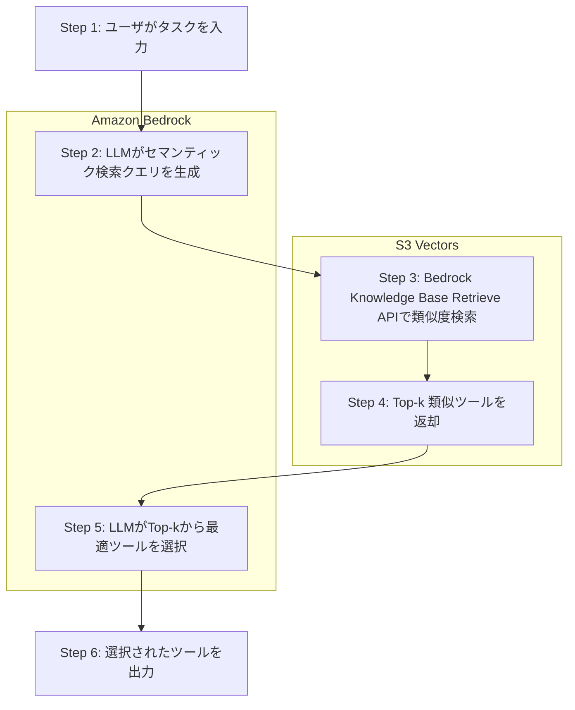

## ブログ概要

本記事は [https://aws.amazon.com/blogs/storage/optimize-agent-tool-selection-using-s3-vectors-and-bedrock-knowledge-bases/](https://aws.amazon.com/blogs/storage/optimize-agent-tool-selection-using-s3-vectors-and-bedrock-knowledge-bases/) の解説記事です。

AIエージェントが利用可能なツール数が増大すると、適切なツールを選択するコストとレイテンシが急増する。AWS公式ブログでは、Amazon S3 VectorsとAmazon Bedrock Knowledge Basesを組み合わせたセマンティック検索により、422ツールからの選択精度を82.3%に向上させ、LLM推論コストを92%以上削減するアーキテクチャを報告している。LangGraph + Claude Haiku 4.5 + Amazon Titan Text Embedding v2を使用し、MCPVerseベンチマークで評価した結果、ベースライン（全ツールをコンテキストに投入）と比較して精度・レイテンシ・コストの全指標で改善を達成している。

この記事は [Zenn記事: Bedrock AgentCoreで社内ヘルプデスクエージェントのツール選択精度と応答速度を最適化する](https://zenn.dev/0h_n0/articles/ae604dd7a92cc9) の深掘りです。

## 情報源

- **種別**: 企業テックブログ（AWS Storage Blog）
- **URL**: [Optimize agent tool selection using Amazon S3 Vectors and Amazon Bedrock Knowledge Bases](https://aws.amazon.com/blogs/storage/optimize-agent-tool-selection-using-s3-vectors-and-bedrock-knowledge-bases/)
- **組織**: Amazon Web Services (AWS) — Yuan Tian, David Kaleko, Rajat Dogra
- **発表日**: 2026年2月10日

## 技術的背景

### ツール過負荷問題（Tool Overload Problem）

AIエージェントにおけるツール選択は、利用可能なツール数の増加に伴い深刻な課題となっている。AWS公式ブログでは、ツールを「明確な説明、定義された入力と出力を持つ関数であり、LLMの能力を拡張するもの」と定義している。ツール数が数百規模になると、全ツールの定義をLLMのコンテキストウィンドウに投入するアプローチには以下の問題がある。

**コンテキストウィンドウの圧迫**: 422ツールの定義を全てプロンプトに含めると、入力トークン数が膨大になる。AWS公式ブログの実験では、ベースラインアプローチで1クエリあたり$0.202のLLM推論コストが発生している。

**精度の低下**: 大量のツール定義がコンテキストに含まれると、LLMが関連性の低いツールに惑わされ、正しいツールを選択できない。ブログの実験ではベースラインの精度が75.8%にとどまっている。

**レイテンシの増大**: 入力トークン数に比例してLLMの推論時間が増加する。ベースラインでは1クエリあたり5.41秒を要している。

### セマンティック検索によるツールフィルタリング

これらの問題に対する解決策として、ブログではベクトル検索によるセマンティックフィルタリングを提案している。ユーザのタスク記述をベクトル化し、ツール定義のベクトルとの類似度計算によって候補を絞り込む。これにより、LLMが処理するツール数を大幅に削減できる。

具体的には、「analyze customer feedback sentiment」というクエリに対して、「emotion analyzer」や「opinion classifier」といった名称の異なるツールもセマンティックな類似性に基づいて検索できる点が重要である。単純なキーワードマッチングでは不可能な、意味的な対応関係を捉えることができる。

なお、Zenn記事で紹介したAmazon Bedrock AgentCore Gatewayにもセマンティックツール選択機能が組み込まれているが、本ブログでは**カスタム実装**として S3 Vectors + Bedrock Knowledge Bases を使用するアプローチを解説している。マネージドサービスを使わずに自前でツール選択パイプラインを構築する必要がある場合に有用な選択肢である。

### 類似度検索の数学的背景

セマンティック検索の中核はベクトル空間での類似度計算である。Embedding モデルがテキストを$d$次元ベクトルに変換し、クエリベクトル$\mathbf{q}$とツール定義ベクトル$\mathbf{t}_i$の類似度をコサイン類似度で計算する。

$$
\text{sim}(\mathbf{q}, \mathbf{t}_i) = \frac{\mathbf{q} \cdot \mathbf{t}_i}{\|\mathbf{q}\| \cdot \|\mathbf{t}_i\|}
$$

ここで、
- $\mathbf{q} \in \mathbb{R}^d$: タスク記述のEmbeddingベクトル
- $\mathbf{t}_i \in \mathbb{R}^d$: $i$番目のツール定義のEmbeddingベクトル
- $d$: Embedding次元数（Amazon Titan Text Embedding v2では1024次元）

上位$k$件のツールを取得し（ブログでは$k=20$）、これをLLMに渡して最終的なツール選択を行う。

## 実装アーキテクチャ

### 6ステップの処理フロー

AWS公式ブログでは、LangGraph + Amazon Bedrock + Bedrock Knowledge Basesを使用した6ステップのツール選択ワークフローを提示している。



**Step 1 — ユーザ入力**: ユーザがタスクを自然言語で記述する。ブログの例では「Is it raining in San Francisco right now?」がタスク入力となる。

**Step 2 — クエリ生成**: Amazon Bedrock上のLLM（Claude Haiku 4.5）がタスク記述をセマンティック検索に適したクエリに変換する。上記の例では「find the current weather in a specific city」に変換される。この変換により、ユーザの自然な質問から、ツール検索に適した一般化された記述が生成される。

**Step 3 — ベクトル検索**: Bedrock Knowledge Base Retrieve APIがクエリをAmazon Titan Text Embedding v2でベクトル化し、S3 Vectorsに格納されたツール定義ベクトルとの類似度検索を実行する。

**Step 4 — 候補返却**: 類似度上位20件のツール定義がJSON形式で返却される。ブログの例では以下のようなツールが返却される。

```json
{
  "tool_name": "check_current_weather",
  "description": "Retrieve current weather forecast for a specific city",
  "parameters": [
    {
      "name": "city",
      "type": "string"
    }
  ]
}
```

**Step 5 — ツール選択**: LLMが返却された20件のツール候補から、タスクに最も適したツールを1つ選択する。全422ツールではなく20ツールを処理するため、推論時間とコストが大幅に削減される。

**Step 6 — 出力**: 選択されたツール名とパラメータが出力される。

### 技術スタック

| コンポーネント | 使用技術 | 役割 |
|---------------|---------|------|
| オーケストレーション | LangGraph | エージェントのワークフロー管理 |
| LLM | Claude Haiku 4.5 (temperature=0.0) | クエリ生成・ツール選択 |
| Embedding | Amazon Titan Text Embedding v2 | テキストのベクトル化 |
| ベクトルストア | Amazon S3 Vectors | ツール定義ベクトルの保存・検索 |
| 検索API | Bedrock Knowledge Base Retrieve API | セマンティック検索の実行 |

### データ準備とチャンキング戦略

ブログでは、MCPVerseデータセットから抽出した422ツールの定義をJSON形式でベクトル化している。チャンキング戦略として「各ツールのドキュメントを1チャンクとして扱う」方式を採用している。ツール定義は一般的に数百トークン程度であるため、1ドキュメント=1チャンクの戦略が自然であり、チャンク分割によるコンテキスト損失のリスクを排除できる。

## Production Deployment Guide

### AWS実装パターン（コスト最適化重視）

本ブログのアーキテクチャをプロダクション環境にデプロイする場合、トラフィック量に応じた3つの構成を推奨する。

**注意**: 以下のコスト試算は2026年7月時点のAWS us-east-1リージョン料金に基づく概算値である。実際のコストはトラフィックパターン、リージョン、バースト使用量により変動する。最新料金は[AWS料金計算ツール](https://calculator.aws/)で確認を推奨する。

#### Small構成（~100 req/日）: Serverless

| サービス | 構成 | 月額概算 |
|---------|------|---------|
| Lambda | 256MB, 30秒タイムアウト | ~$5 |
| S3 Vectors | 422ベクトル, ~3,000クエリ/月 | ~$1 |
| Bedrock (Claude Haiku 4.5) | ~3,000呼び出し/月 | ~$45 |
| Bedrock (Titan Embedding v2) | ~3,000呼び出し/月 | ~$3 |
| CloudWatch | ログ・メトリクス | ~$5 |
| **合計** | | **~$59/月** |

Lambda関数からBedrock Knowledge Base Retrieve APIを呼び出し、S3 Vectorsでベクトル検索を行う。NAT Gateway不使用で固定コストを削減する。VPCエンドポイント経由でBedrock・S3にアクセスする。

#### Medium構成（~1,000 req/日）: ECS Fargate

| サービス | 構成 | 月額概算 |
|---------|------|---------|
| ECS Fargate | 0.5vCPU, 1GB RAM x 2タスク | ~$30 |
| S3 Vectors | 422ベクトル, ~30,000クエリ/月 | ~$3 |
| Bedrock (Claude Haiku 4.5) | ~30,000呼び出し/月 | ~$450 |
| Bedrock (Titan Embedding v2) | ~30,000呼び出し/月 | ~$30 |
| ALB | ロードバランサ | ~$25 |
| CloudWatch | ログ・メトリクス | ~$10 |
| **合計** | | **~$548/月** |

#### Large構成（10,000+ req/日）: EKS + Spot

| サービス | 構成 | 月額概算 |
|---------|------|---------|
| EKS | コントロールプレーン | $73 |
| EC2 Spot (m6i.xlarge) | 3ノード (Karpenter管理) | ~$150 |
| S3 Vectors | 422ベクトル, ~300,000クエリ/月 | ~$3 |
| Bedrock (Claude Haiku 4.5) | ~300,000呼び出し/月 (Batch API 50%OFF) | ~$2,250 |
| Bedrock (Titan Embedding v2) | ~300,000呼び出し/月 | ~$300 |
| ALB + WAF | セキュリティ付きLB | ~$50 |
| CloudWatch + X-Ray | 監視・トレーシング | ~$30 |
| **合計** | | **~$2,856/月** |

Large構成ではBedrock Batch APIで推論コストを50%削減し、Spot Instancesでコンピュートコストを最大70%削減する。Prompt Cachingを有効化すれば、同じツール候補セットに対する繰り返しクエリでさらに30-90%の削減が見込める。

### Terraformインフラコード

#### Small構成（Serverless）

```hcl
# S3 Vectors + Lambda構成
# 2026-07時点のAWSプロバイダ・モジュールバージョン

terraform {
  required_version = ">= 1.9"
  required_providers {
    aws = {
      source  = "hashicorp/aws"
      version = "~> 5.80"
    }
  }
}

provider "aws" {
  region = "us-east-1"
}

# --- IAM Role (最小権限) ---
resource "aws_iam_role" "tool_selector_lambda" {
  name = "tool-selector-lambda-role"
  assume_role_policy = jsonencode({
    Version = "2012-10-17"
    Statement = [{
      Action = "sts:AssumeRole"
      Effect = "Allow"
      Principal = { Service = "lambda.amazonaws.com" }
    }]
  })
}

resource "aws_iam_role_policy" "tool_selector_policy" {
  name = "tool-selector-policy"
  role = aws_iam_role.tool_selector_lambda.id
  policy = jsonencode({
    Version = "2012-10-17"
    Statement = [
      {
        Effect = "Allow"
        Action = [
          "bedrock:InvokeModel",
          "bedrock:Retrieve"
        ]
        Resource = "*"
      },
      {
        Effect = "Allow"
        Action = [
          "s3vectors:QueryVectors",
          "s3vectors:GetVector"
        ]
        Resource = "arn:aws:s3vectors:*:*:vector-bucket/*"
      },
      {
        Effect = "Allow"
        Action = [
          "logs:CreateLogGroup",
          "logs:CreateLogStream",
          "logs:PutLogEvents"
        ]
        Resource = "arn:aws:logs:*:*:*"
      }
    ]
  })
}

# --- Lambda Function ---
resource "aws_lambda_function" "tool_selector" {
  function_name = "tool-selector"
  runtime       = "python3.12"
  handler       = "handler.lambda_handler"
  role          = aws_iam_role.tool_selector_lambda.arn
  timeout       = 30            # Bedrock呼び出し2回分を考慮
  memory_size   = 256           # コスト最適化: 最小限で十分

  filename         = "lambda.zip"
  source_code_hash = filebase64sha256("lambda.zip")

  environment {
    variables = {
      KNOWLEDGE_BASE_ID = var.knowledge_base_id
      MODEL_ID          = "anthropic.claude-haiku-4-5-v1"
      TOP_K             = "20"
    }
  }

  tracing_config {
    mode = "Active"  # X-Ray有効化
  }
}

# --- CloudWatch Alarm (コスト監視) ---
resource "aws_cloudwatch_metric_alarm" "lambda_duration" {
  alarm_name          = "tool-selector-duration-high"
  comparison_operator = "GreaterThanThreshold"
  evaluation_periods  = 3
  metric_name         = "Duration"
  namespace           = "AWS/Lambda"
  period              = 300
  statistic           = "Average"
  threshold           = 10000  # 10秒超過で警告
  alarm_actions       = [var.sns_topic_arn]

  dimensions = {
    FunctionName = aws_lambda_function.tool_selector.function_name
  }
}

variable "knowledge_base_id" {
  type        = string
  description = "Bedrock Knowledge Base ID"
}

variable "sns_topic_arn" {
  type        = string
  description = "SNS topic ARN for alarm notifications"
}
```

#### Large構成（EKS + Karpenter）

```hcl
# EKS + Karpenter + Spot構成
module "eks" {
  source  = "terraform-aws-modules/eks/aws"
  version = "~> 20.30"

  cluster_name    = "tool-selector-cluster"
  cluster_version = "1.31"

  vpc_id     = module.vpc.vpc_id
  subnet_ids = module.vpc.private_subnets

  cluster_endpoint_public_access = false  # プライベートアクセスのみ

  eks_managed_node_groups = {
    system = {
      instance_types = ["m6i.large"]
      min_size       = 1
      max_size       = 2
      desired_size   = 1
    }
  }
}

# Karpenter NodePool (Spot優先)
resource "kubectl_manifest" "karpenter_nodepool" {
  yaml_body = yamlencode({
    apiVersion = "karpenter.sh/v1"
    kind       = "NodePool"
    metadata   = { name = "tool-selector" }
    spec = {
      template = {
        spec = {
          requirements = [
            { key = "karpenter.sh/capacity-type", operator = "In", values = ["spot", "on-demand"] },
            { key = "node.kubernetes.io/instance-type", operator = "In",
              values = ["m6i.xlarge", "m6i.2xlarge", "m7i.xlarge"] }
          ]
        }
      }
      limits   = { cpu = "32" }
      disruption = {
        consolidationPolicy = "WhenEmptyOrUnderutilized"
        consolidateAfter    = "30s"
      }
    }
  })
}

# AWS Budgets (予算アラート)
resource "aws_budgets_budget" "tool_selector" {
  name         = "tool-selector-monthly"
  budget_type  = "COST"
  limit_amount = "3500"
  limit_unit   = "USD"
  time_unit    = "MONTHLY"

  notification {
    comparison_operator       = "GREATER_THAN"
    threshold                 = 80
    threshold_type            = "PERCENTAGE"
    notification_type         = "ACTUAL"
    subscriber_email_addresses = [var.alert_email]
  }
}

variable "alert_email" {
  type        = string
  description = "Email for budget alerts"
}
```

### 運用・監視設定

**CloudWatch Logs Insights — コスト異常検知クエリ**:

```
fields @timestamp, @message
| filter @message like /InvokeModel/
| stats count() as invocations,
        sum(inputTokenCount) as total_input_tokens,
        sum(outputTokenCount) as total_output_tokens
  by bin(1h)
| sort @timestamp desc
```

**CloudWatch Logs Insights — レイテンシ分析クエリ**:

```
fields @timestamp, duration_ms
| filter event = "tool_selection"
| stats avg(duration_ms) as avg_latency,
        percentile(duration_ms, 95) as p95,
        percentile(duration_ms, 99) as p99,
        max(duration_ms) as max_latency
  by bin(1h)
```

**CloudWatch アラーム設定（Python）**:

```python
import boto3

cloudwatch = boto3.client("cloudwatch")

def create_bedrock_token_alarm(sns_topic_arn: str) -> None:
    """Bedrockトークン使用量スパイク検知アラーム"""
    cloudwatch.put_metric_alarm(
        AlarmName="bedrock-token-spike",
        MetricName="InputTokenCount",
        Namespace="AWS/Bedrock",
        Statistic="Sum",
        Period=3600,
        EvaluationPeriods=1,
        Threshold=500000,  # 1時間50万トークン超過で警告
        ComparisonOperator="GreaterThanThreshold",
        AlarmActions=[sns_topic_arn],
    )
```

**X-Ray トレーシング設定（Python）**:

```python
from aws_xray_sdk.core import xray_recorder, patch_all

patch_all()  # boto3自動計装

@xray_recorder.capture("tool_selection")
def select_tool(task: str) -> dict:
    """ツール選択の全工程をX-Rayでトレース"""
    subsegment = xray_recorder.current_subsegment()
    subsegment.put_annotation("task_type", "tool_selection")
    subsegment.put_metadata("input", {"task": task})

    # Step 2: クエリ生成
    query = generate_search_query(task)

    # Step 3-4: ベクトル検索
    candidates = retrieve_tools(query, top_k=20)
    subsegment.put_metadata("candidates_count", len(candidates))

    # Step 5: ツール選択
    selected = llm_select_tool(task, candidates)
    subsegment.put_annotation("selected_tool", selected["tool_name"])

    return selected
```

**Cost Explorer 日次レポート（Python）**:

```python
import boto3
from datetime import datetime, timedelta

ce = boto3.client("ce")

def get_daily_cost_report() -> dict:
    """Bedrock・Lambda・S3 Vectorsの日次コスト取得"""
    end = datetime.now().strftime("%Y-%m-%d")
    start = (datetime.now() - timedelta(days=1)).strftime("%Y-%m-%d")

    response = ce.get_cost_and_usage(
        TimePeriod={"Start": start, "End": end},
        Granularity="DAILY",
        Metrics=["UnblendedCost"],
        Filter={
            "Or": [
                {"Dimensions": {"Key": "SERVICE", "Values": ["Amazon Bedrock"]}},
                {"Dimensions": {"Key": "SERVICE", "Values": ["AWS Lambda"]}},
                {"Dimensions": {"Key": "SERVICE", "Values": ["Amazon Simple Storage Service"]}},
            ]
        },
        GroupBy=[{"Type": "DIMENSION", "Key": "SERVICE"}],
    )
    return response["ResultsByTime"]
```

### コスト最適化チェックリスト

**アーキテクチャ選択**:
- [ ] トラフィック量に基づく構成選定（~100 req/日: Serverless, ~1000: Fargate, 10000+: EKS）
- [ ] S3 Vectorsのpay-per-query課金を活用（固定費なし）

**リソース最適化**:
- [ ] EC2: Spot Instances優先（最大70-90%削減）
- [ ] Reserved Instances: 1年コミットで最大40%削減
- [ ] Savings Plans: 柔軟な割引プラン検討
- [ ] Lambda: メモリサイズ256MBで最適化（Power Tuning実施）
- [ ] ECS/EKS: Karpenterで未使用ノード自動スケールダウン

**LLMコスト削減**:
- [ ] Bedrock Batch API使用（50%削減、リアルタイム不要なバッチ処理時）
- [ ] Prompt Caching有効化（同一ツール候補セットへの繰り返しクエリで30-90%削減）
- [ ] モデル選択: Claude Haiku 4.5で十分（Sonnetは不要）
- [ ] Top-k値の最適化（$k=20$で91.9%リコール確保）
- [ ] 入力トークン制限（ツール定義の要約圧縮）

**監視・アラート**:
- [ ] AWS Budgets: 月額上限設定（80%到達で通知）
- [ ] CloudWatch アラーム: トークン使用量・レイテンシ異常検知
- [ ] Cost Anomaly Detection: 自動異常検知有効化
- [ ] 日次コストレポート: Cost Explorer API + SNS通知

**リソース管理**:
- [ ] 未使用S3 Vectorsインデックスの定期削除
- [ ] タグ戦略: Environment/Service/Ownerタグ必須
- [ ] ログのライフサイクルポリシー: 30日保持→Glacier→削除
- [ ] 開発環境: 夜間・週末のEKSノード停止
- [ ] VPCエンドポイント活用でNAT Gatewayコスト削減

## パフォーマンス最適化

### MCPVerseベンチマーク結果

AWS公式ブログでは、MCPVerseベンチマークデータセットを使用して評価を行っている。MCPVerseは「エージェントのツール選択のための包括的な評価スイート」であり、Model Context Protocol (MCP) サーバから得られた実世界のツールを含む。データセットからAPIキー不要の422ツールを抽出し、62件のシングルツールタスクで評価している。ツールの範囲は「地図や天気からコード実行やファイル操作まで」多岐にわたる。

**ベンチマーク結果**:

| 指標 | S3 Vectors (Top-20) | ベースライン (全422ツール) | 改善 |
|-----|---------------------|------------------------|------|
| 精度 (Accuracy) | 82.3% | 75.8% | +6.5pt |
| リコール (Recall@20) | 91.9% | N/A | — |
| エンドツーエンドレイテンシ | 4.25秒 | 5.41秒 | 21%高速化 |
| 検索時間 (S3 Vectors) | ~0.41秒 | N/A | — |
| LLM推論コスト/クエリ | $0.015 | $0.202 | 92%以上削減 |

**精度向上の要因**: ブログでは「ベクトル検索が82.3%の精度（ベースラインの75.8%に対して）と91.9%のリコールを達成し、エンドツーエンドレイテンシが21%高速化した」と報告している。ベクトル検索のステップで約0.41秒のオーバーヘッドが加わるが、「LLMが20ツールを処理する時間は422ツール全てを処理する時間よりも大幅に短く、検索のオーバーヘッドは推論時間の削減で十分に相殺される」と説明されている。

**Recall@20の意味**: Top-20の検索結果に正解ツールが含まれる確率が91.9%である。残り8.1%のケースでは、正解ツールが21位以下にランクされており、検索段階で取りこぼしている。この値を改善するにはTop-kの増加が考えられるが、$k$を増やすとLLMの処理負荷が増加するため、精度とコストのトレードオフが存在する。

### コスト詳細分析

AWS公式ブログでは、コスト削減の要因について「関連するツールのみをベクトルストアからクエリし、全ツールをコンテキストに含めるのではなく、入力トークンの使用量を劇的に削減した」と説明している。

**S3 Vectorsの料金体系**（us-east-1参考値）:

| 項目 | 単価 |
|-----|------|
| ストレージ | $0.06/GB/月 |
| PUTオペレーション | $0.005/1,000リクエスト |
| Query API | $2.50/100万クエリ |
| Query処理 | $0.004/TB（最初の100Kベクトル） |

**月間100万クエリ・422ベクトルの場合**:

ブログの試算によれば、S3 Vectorsのコストは月額約$2.57である。422ベクトルのデータサイズは極めて小さく（数MB以下）、ストレージコストはほぼ無視できる。主要なコストはQuery APIの$2.50/100万クエリであり、専用のベクトルデータベースと比較して90%低コストであるとブログでは報告されている。

## 運用での学び

### S3 Vectorsのスペック

AWS公式ブログでは、S3 Vectorsの特性について以下のように報告している。

- **スケール**: 1インデックスあたり最大20億ベクトルをサポートし、大規模本番ワークロードに対応
- **一貫性**: 強い整合性を提供し、「新しくインジェストされたベクトルは即座にクエリ可能」
- **書き込みスループット**: 単一ベクトル更新のストリーミングで最大1,000 TPS
- **クエリレイテンシ**: 頻繁なクエリに対して100ms以下
- **コスト**: 専用ベクトルデータベースソリューションと比較して最大90%低コスト
- **アーキテクチャ**: フルサーバレスで従量課金

S3 Vectorsは「クラウドオブジェクトストアとして初めてベクトルの保存とクエリをネイティブにサポート」するサービスであり、既存のS3エコシステムとシームレスに統合できる点が強みである。

### スケーリングに関する考慮事項

本ブログのベンチマークは422ツールでの評価だが、実運用ではツール数が数千〜数万規模に拡大する可能性がある。S3 Vectorsの20億ベクトル対応は、このスケールに十分対応できる。

ツール数の増加に伴い、Top-kの$k$値の調整が必要になる。$k$が小さすぎるとリコールが低下し、大きすぎるとLLM推論コストが増加する。ブログの実験では$k=20$で91.9%のリコールを達成しているが、ツール数が10倍（4,220ツール）になった場合、同等のリコールを維持するには$k$の引き上げが必要になる可能性がある。

また、S3 Vectorsの強い整合性は、ツール定義の動的な追加・更新が頻繁に発生するユースケースにおいて重要である。新しいツールをインジェストした直後からクエリで検出可能になるため、結果整合性モデルのベクトルDBで発生する「追加したツールがしばらく検索できない」問題を回避できる。

## 学術研究との関連

### Re-Invokeとの比較

Re-Invoke (2024) は、LLMのツール選択精度を改善するために、不適切なツール選択を検出して再呼び出しするフレームワークである。ツール選択の結果を検証し、必要に応じて別のツールを試行する「事後修正」アプローチをとる。一方、S3 Vectorsアプローチは「事前フィルタリング」であり、LLMに渡す候補自体を絞り込む。両アプローチは相補的であり、S3 VectorsでTop-20に絞った上でRe-Invokeの検証ループを組み合わせることで、さらなる精度向上が期待できる。

### ToolLLMとの比較

ToolLLM (Qin et al., 2024) は、16,000以上のAPIを含むToolBenchデータセットを構築し、ツール選択・呼び出しの能力をLLMに訓練するアプローチである。モデルのファインチューニングにより内在的なツール選択能力を強化する手法であり、推論時のベクトル検索を必要としない。ただし、新しいツールの追加にはモデルの再訓練が必要である。S3 Vectorsアプローチは再訓練不要でツールの動的追加が可能であり、運用面での柔軟性に優れる。

### Bedrock AgentCore Gatewayとの位置づけ

Zenn記事で紹介したBedrock AgentCore Gatewayは、セマンティックツール選択をマネージドサービスとして提供する。本ブログのS3 Vectors + Knowledge Basesアプローチは、同等の機能をカスタム実装するパターンである。AgentCore Gatewayが対応していないカスタムスコアリングロジックや、特殊なフィルタリング条件が必要な場合に有用な選択肢となる。

## まとめと実践への示唆

AWS公式ブログでは、S3 VectorsとBedrock Knowledge Basesによるセマンティックツール選択が、全ツール投入ベースラインと比較して精度6.5ポイント向上、レイテンシ21%削減、LLM推論コスト92%以上削減を達成したと報告されている。S3 Vectorsのpay-per-query課金モデルは、ツール数が比較的少なく（数百〜数千）クエリ量が変動するユースケースにおいて、専用ベクトルDBと比較して大幅なコスト優位性がある。

実務への示唆として、エージェントのツールセットが50ツールを超えた段階でセマンティック検索の導入を検討する価値がある。S3 Vectorsは既存のAWSエコシステムとの統合が容易であり、専用のベクトルDBインフラを別途管理する必要がない。AgentCore Gatewayの組み込み機能で十分な場合はそちらを使い、カスタム要件がある場合にS3 Vectors + Knowledge Basesの組み合わせを選択するのが合理的なアプローチである。

## 参考文献

- **Blog URL**: [Optimize agent tool selection using Amazon S3 Vectors and Amazon Bedrock Knowledge Bases](https://aws.amazon.com/blogs/storage/optimize-agent-tool-selection-using-s3-vectors-and-bedrock-knowledge-bases/)
- **MCPVerse**: [MCPVerse GitHub](https://github.com/hailsham/mcpverse) — ツール選択ベンチマークデータセット
- **Amazon S3 Vectors**: [S3 Vectors Documentation](https://docs.aws.amazon.com/AmazonS3/latest/userguide/s3-vectors.html)
- **Amazon Bedrock Knowledge Bases**: [Bedrock Knowledge Bases Documentation](https://docs.aws.amazon.com/bedrock/latest/userguide/knowledge-base.html)
- **Related Zenn article**: [Bedrock AgentCoreで社内ヘルプデスクエージェントのツール選択精度と応答速度を最適化する](https://zenn.dev/0h_n0/articles/ae604dd7a92cc9)
