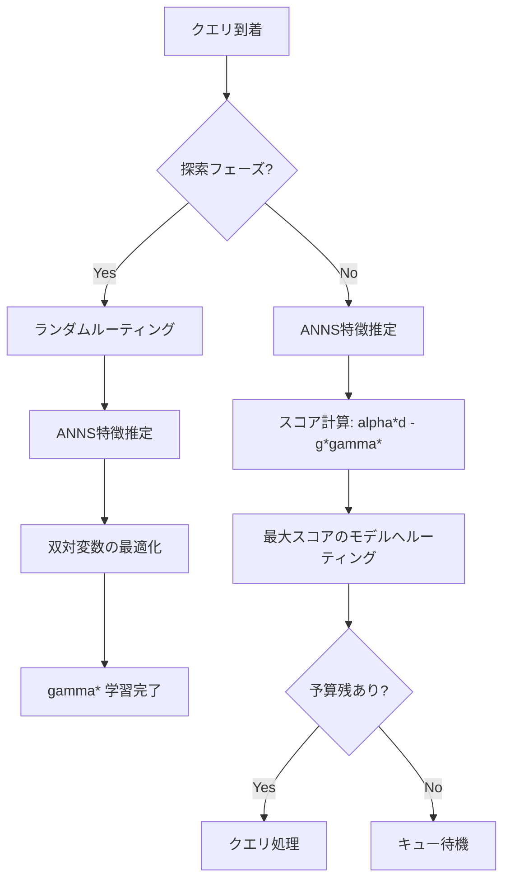
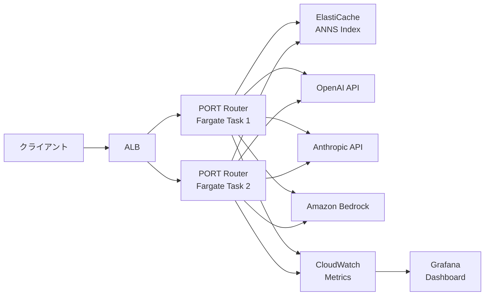

## 論文概要

本記事は [Efficient Training-Free Online Routing for High-Volume Multi-LLM Serving](https://arxiv.org/abs/2509.02718) の解説記事です。

複数のLLMを運用する環境では、各クエリをどのモデルに振り分けるかが性能とコストの両面で重要な課題となる。著者らは **PORT（training-free online routing）** アルゴリズムを提案し、学習データなしで近似最近傍探索（ANNS）によりクエリ特徴を推定し、少数の初期クエリからルーティング戦略を一度だけ最適化して後続クエリに適用する手法を示した。3つのベンチマークにおいて、全体性能3.55倍、コスト効率1.85倍、スループット約4.25倍の改善を報告しており、競合比率 $1 - o(1)$ の理論保証を伴う。

## 情報源

| 項目 | 内容 |
|------|------|
| **論文タイトル** | Efficient Training-Free Online Routing for High-Volume Multi-LLM Serving |
| **著者** | Fangzhou Wu, Sandeep Silwal |
| **カンファレンス** | NeurIPS 2025（採択済み） |
| **分野** | cs.DB, cs.AI, cs.LG |
| **arXiv** | [2509.02718](https://arxiv.org/abs/2509.02718) |
| **GitHub** | [fzwark/PORT](https://github.com/fzwark/PORT) |

## カンファレンス情報

NeurIPS（Neural Information Processing Systems）は機械学習・人工知能分野における最高峰の国際会議の一つである。NeurIPS 2025は第39回にあたり、採択率は例年20%前後と競争率が高い。本論文はオンラインアルゴリズムとLLMサービングの交差領域に位置し、理論計算機科学的なアプローチでLLM運用の実務課題に取り組んでいる点が特徴的である。

## 技術的詳細

### 問題定式化

$M$ 種類のLLMが配備され、各モデル $i \in [M]$ にトークン予算 $B_i$ が割り当てられた環境を考える。クエリ $j$ をモデル $i$ に送信したときの性能スコアを $d_{ij}$、トークン消費量を $g_{ij}$ とする。トークン消費量は以下のように定式化される。

$$g_{ij} = f_i^I \cdot \text{len}(j) + f_i^O \cdot \text{len}(a_{ij})$$

ここで $f_i^I$, $f_i^O$ はモデル $i$ の入力・出力あたりのトークン単価、$\text{len}(j)$, $\text{len}(a_{ij})$ はそれぞれ入力トークン長と出力トークン長である。

オフラインの最適化問題は以下の混合整数線形計画（MILP）として定式化される。

$$\max \sum_{j \in Q} \sum_{i \in [M]} d_{ij} x_{ij}$$

$$\text{s.t.} \quad \sum_j g_{ij} x_{ij} \le B_i, \quad \sum_i x_{ij} \le 1, \quad x_{ij} \in \{0, 1\}$$

オンライン設定では、クエリが逐次到着し、各クエリのルーティング決定時に将来のクエリ情報は利用できない。目標はアルゴリズムの累積性能 $C_{\text{alg}}$ と最適解 $C_{\text{opt}}$ の比である競合比率 $C_{\text{alg}} / C_{\text{opt}} \ge 1 - o(1)$ を達成することである。

### PORTアルゴリズムの3段階

著者らはこの問題に対し、以下の3つのコア技術を組み合わせたアルゴリズムを提案している。



**段階1: 近似最近傍探索による特徴推定**

過去の履歴データ $\mathcal{D} = \{(j, a_j, d_j, g_j)\}_{j=1}^n$ を保持し、新規クエリ $j$ に対してHNSW等のANNSアルゴリズムで近傍集合 $R_j \subset \mathcal{D}$ を検索する。性能・コストの推定値は以下で計算される。

$$\hat{d}_{ij} = \frac{1}{|R_j|} \sum_{q \in R_j} d_{iq}, \quad \hat{g}_{ij} = \frac{1}{|R_j|} \sum_{q \in R_j} g_{iq}$$

HNSWの探索計算量は $O(\log |\mathcal{D}|)$ であり、KNNの $O(|\mathcal{D}|)$ と比較して高スループット環境に適している。

**段階2: 初期クエリからの双対変数学習**

全クエリの最初の $\varepsilon$ 割合（探索フェーズ $P$）をランダムにルーティングし、推定された特徴量を用いて以下の双対問題を解く。

$$\gamma^* \leftarrow \arg\min_\gamma F(\gamma, P) = \varepsilon \sum_i \gamma_i B_i + \sum_{j \in P} \max_i (\alpha \hat{d}_{ij} - \gamma_i \hat{g}_{ij})$$

制御パラメータ $\alpha$ はコストと性能のトレードオフを調整し、$\gamma^*$ がルーティング重みとして機能する。この最適化は凸問題であり、標準的なソルバーで効率的に解ける。

**段階3: 学習済み重みによるオンラインルーティング**

デプロイフェーズ $Y = Q \setminus P$ の各クエリ $j$ に対して、以下の貪欲決定を行う。

$$i^* = \arg\max_i (\alpha \hat{d}_{ij} - \hat{g}_{ij} \gamma_i^*)$$

### 理論保証

著者らは以下の主定理を証明している。

**定理1（競合比率）**: クエリ集合 $Q$ がランダム順序で到着する場合、アルゴリズムは以下を満たす。

$$C_{\text{alg}} / C_{\text{opt}} \ge 1 - O(\varepsilon + \delta)$$

ここで $\delta$ は埋め込み空間における特徴近似の誤差パラメータである。この保証は、オフライン最適値 $C_{\text{opt}}$ が十分大きい高ボリューム設定で成立する。著者らは $\varepsilon = 0.025$（約250クエリ）で十分な探索が行えると報告している。

## アルゴリズム

以下にPORTアルゴリズムの擬似コードを示す。

```python
from dataclasses import dataclass
from typing import Optional
import numpy as np
from scipy.optimize import minimize


@dataclass
class RoutingConfig:
    """PORTアルゴリズムの設定."""

    alpha: float = 0.0001     # コスト-性能制御パラメータ
    epsilon: float = 0.025    # 探索フェーズの割合
    n_neighbors: int = 5      # ANNS近傍数


class PORTRouter:
    """PORT: Training-Free Online Routing for Multi-LLM Serving.

    近似最近傍探索と双対変数最適化により、
    学習不要でマルチLLMルーティングを行うアルゴリズム。
    """

    def __init__(
        self,
        n_models: int,
        budgets: np.ndarray,
        config: RoutingConfig,
    ) -> None:
        self.n_models = n_models
        self.budgets = budgets          # shape: (M,)
        self.config = config
        self.gamma: Optional[np.ndarray] = None
        self.remaining_budgets = budgets.copy()

    def estimate_features(
        self,
        query_embedding: np.ndarray,
        ann_index,
    ) -> tuple[np.ndarray, np.ndarray]:
        """ANNSにより性能スコアとコストを推定."""
        neighbors = ann_index.search(
            query_embedding, self.config.n_neighbors,
        )
        # d_hat: shape (M,), g_hat: shape (M,)
        d_hat = np.mean([n.scores for n in neighbors], axis=0)
        g_hat = np.mean([n.costs for n in neighbors], axis=0)
        return d_hat, g_hat

    def _dual_objective(
        self,
        gamma: np.ndarray,
        observed_features: list[tuple[np.ndarray, np.ndarray]],
    ) -> float:
        """双対目的関数 F(gamma, P) を計算."""
        eps = self.config.epsilon
        alpha = self.config.alpha
        obj = eps * np.dot(gamma, self.budgets)
        for d_hat, g_hat in observed_features:
            scores = alpha * d_hat - g_hat * gamma
            obj += np.max(scores)
        return obj

    def learn_weights(
        self,
        observed_features: list[tuple[np.ndarray, np.ndarray]],
    ) -> np.ndarray:
        """探索フェーズのデータから最適な双対変数 gamma* を学習."""
        gamma_init = np.zeros(self.n_models)
        result = minimize(
            self._dual_objective,
            gamma_init,
            args=(observed_features,),
            method="L-BFGS-B",
            bounds=[(0, None)] * self.n_models,
        )
        self.gamma = result.x
        return self.gamma

    def route(
        self,
        d_hat: np.ndarray,
        g_hat: np.ndarray,
    ) -> Optional[int]:
        """学習済み gamma* を用いて最適モデルを選択."""
        if self.gamma is None:
            msg = "gamma not learned yet; call learn_weights first"
            raise RuntimeError(msg)

        scores = self.config.alpha * d_hat - g_hat * self.gamma
        ranked = np.argsort(scores)[::-1]

        for model_idx in ranked:
            if self.remaining_budgets[model_idx] >= g_hat[model_idx]:
                self.remaining_budgets[model_idx] -= g_hat[model_idx]
                return int(model_idx)
        return None  # 全モデルの予算超過 -> キュー待機
```

## 実装のポイント

PORTの実装にあたり、著者らは以下の設計判断を報告している。

**ANNSライブラリ**: HNSWをメインのインデックスとして使用し、近傍数 $|R_j| = 5$ で十分な推定精度を達成している。$|R_j| \in \{3, 7, 10\}$ でのロバスト性検証では性能差は軽微であった。

**埋め込みモデル**: bge-base-en-v1.5を主要モデルとして使用しているが、SFR-Embedding-2_RやGTE-Qwen2-1.5B-instructでも同等の結果を確認しており、特定の埋め込みモデルに依存しない設計となっている。

**探索フェーズの規模**: $\varepsilon = 0.025$（10,000クエリ中約250件）で十分な探索が行える。これは全クエリの2.5%に過ぎず、実運用での探索コストは限定的である。

**計算オーバーヘッド**: デプロイフェーズのクエリあたりの計算量はANNS検索 $O(\log|\mathcal{D}|)$ とスコア計算 $O(M)$ のみであり、ミリ秒単位で完了する。学習ベースの手法と異なり、モデル構成の変更時に再学習が不要である点が実運用上の大きな利点となる。

## Production Deployment Guide

PORTをマルチLLMルーティングゲートウェイとしてAWS上に構築するパターンを示す。

| 構成 | 月間クエリ数 | 特徴 |
|------|------------|------|
| **Small**: Lambda + API Gateway | ~100万件 | ANNSインデックスをElastiCacheに保持、コールドスタートに注意 |
| **Medium**: ECS Fargate | ~1000万件 | 常駐コンテナでインデックスをメモリ保持、ALB + オートスケール |
| **Large**: EKS | 1億件以上 | Pod展開 + HPA、サイドカーでインデックス分散管理 |



### Terraform（Medium構成）

```hcl
# ECS Fargate + ElastiCache によるPORTルーターデプロイ

resource "aws_ecs_task_definition" "port_router" {
  family                   = "port-router"
  network_mode             = "awsvpc"
  requires_compatibilities = ["FARGATE"]
  cpu                      = "1024"
  memory                   = "4096"  # ANNSインデックス用に十分なメモリ

  container_definitions = jsonencode([{
    name  = "port-router"
    image = "${aws_ecr_repository.port_router.repository_url}:latest"
    portMappings = [{ containerPort = 8080, protocol = "tcp" }]
    environment = [
      { name = "ANNS_INDEX_ENDPOINT", value = aws_elasticache_replication_group.anns.primary_endpoint_address },
      { name = "ALPHA", value = "0.0001" },
      { name = "EPSILON", value = "0.025" },
      { name = "N_NEIGHBORS", value = "5" },
    ]
    secrets = [
      { name = "OPENAI_API_KEY", valueFrom = aws_secretsmanager_secret.openai_key.arn },
      { name = "ANTHROPIC_API_KEY", valueFrom = aws_secretsmanager_secret.anthropic_key.arn },
    ]
  }])
  execution_role_arn = aws_iam_role.ecs_execution.arn
  task_role_arn      = aws_iam_role.ecs_task.arn
}

resource "aws_ecs_service" "port_router" {
  name            = "port-router-service"
  cluster         = aws_ecs_cluster.port_router.id
  task_definition = aws_ecs_task_definition.port_router.arn
  desired_count   = 2
  launch_type     = "FARGATE"

  network_configuration {
    subnets          = var.private_subnet_ids
    security_groups  = [aws_security_group.port_router.id]
    assign_public_ip = false
  }
  load_balancer {
    target_group_arn = aws_lb_target_group.port_router.arn
    container_name   = "port-router"
    container_port   = 8080
  }
}

# オートスケーリング: CPU 60%ターゲット、min=2, max=20
resource "aws_appautoscaling_policy" "cpu" {
  name               = "port-router-cpu-scaling"
  policy_type        = "TargetTrackingScaling"
  resource_id        = aws_appautoscaling_target.port_router.resource_id
  scalable_dimension = "ecs:service:DesiredCount"
  service_namespace  = "ecs"

  target_tracking_scaling_policy_configuration {
    predefined_metric_specification {
      predefined_metric_type = "ECSServiceAverageCPUUtilization"
    }
    target_value = 60.0
  }
}
```

### 運用・監視設定

CloudWatchカスタムメトリクスとして `routing_latency_p99`（50ms）、`model_budget_utilization`（90%）、`anns_search_latency_p99`（10ms）、`routing_error_rate`（1%）、`queue_depth`（100件）を収集しGrafanaで可視化する。

### コスト最適化チェックリスト

1. ANNSインデックスサイズを監視し不要な履歴データを定期パージする
2. 探索フェーズの $\varepsilon$ を最小限に設定する（0.025推奨）
3. バッチAPIを活用し低スループット要件は非同期処理にする
4. Savings Plansを適用しFargateの常駐コストを削減する
5. ElastiCacheノードタイプをインデックスサイズに応じて適正化する
6. ALBアイドルタイムアウトを適切に設定しコネクション効率を改善する
7. CloudWatch Logsの保持期間を制限する（30日推奨）
8. 予算分割をコスト効率ベース（weighted）に設定する
9. 低トラフィック時間帯のスケーリング最小値を下げる
10. LLMプロバイダ単価の定期更新に合わせ $\gamma^*$ を再計算する
11. プロンプトキャッシュで同一・類似クエリのLLM呼び出しを削減する
12. 出力トークン上限（max_tokens）をタスクに応じて設定する
13. 安価なモデルで十分なクエリは事前フィルタで振り分ける
14. リージョン選択はLLM APIレイテンシと転送コストで判断する
15. NAT Gateway通信をVPCエンドポイントで削減する
16. ECRライフサイクルポリシーで古いイメージを自動削除する
17. ElastiCacheリザーブドノードを検討する（1年以上運用時）
18. ルーティングログは構造化JSONで出力し分析コストを抑制する
19. Gravitonを使用しFargateコストを最大20%削減する
20. $\gamma^*$ の再計算間隔をコスト変動頻度に合わせる

## 実験結果

著者らは3つのベンチマークデータセットで8つのベースラインとの比較を報告している。

### 主要結果（テストクエリ10,000件）

| 手法 | RouterBench RP | SPROUT RP | Open LLM v2 RP |
|------|---------------|-----------|-----------------|
| Random | 43.10% | - | - |
| Greedy-Perf | 31.52% | - | - |
| BatchSplit | 57.24% | 66.94% | 55.44% |
| Roberta-Cost | 14.99% | 67.29% | 54.66% |
| **PORT（提案手法）** | **84.66%** | **75.99%** | **76.70%** |
| 近似最適解 | 100% | 100% | 100% |

RP（Relative Performance）は近似最適解に対する達成割合を示す。PORTは全ベンチマークで最強ベースラインを大幅に上回っている。RouterBenchでは最強のBatchSplitに対して性能47.8%増、コスト効率51.7%増、スループット33.0%増を達成したと報告されている。

### ロバスト性検証

著者らは以下の条件でロバスト性を検証し、全条件でPORTが最良の結果を示したと報告している。

- **クエリ量**: 4,000～12,000件でクエリ量増加に伴い優位性が拡大
- **到着順序**: 100通りのランダム順列で一貫した優位性
- **モデル数**: 2～16モデルで性能劣化なし
- **予算水準**: 0.25倍～2.0倍の予算範囲で一貫した改善
- **データ品質**: ノイズラベル・分布シフト下でも安定

## 実運用への応用

PORTアルゴリズムの実運用上の意義は、LLMプロバイダのコスト構造差を活用した最適化にある。関連Zenn記事「[OpenAI・Anthropic・Gemini会話管理パターン比較と統一設計](https://zenn.dev/0h_n0/articles/a2ff7f18b0266b)」で指摘されているように、プロバイダ間の単価差は最大17倍に達する。PORTはこの価格差を予算制約として定式化し、各クエリの特性に応じた最適なプロバイダ選択を自動化する。

LiteLLM等の既存ルーティングツールが静的ルールに基づくのに対し、PORTはクエリの埋め込みベクトルから動的に最適モデルを選択する点で差別化される。ただし、著者らも指摘しているように、現在の定式化ではクエリトラフィックやシステム負荷等の運用状態要素は考慮されていない。実運用ではPORTのルーティング判断とロードバランサーの負荷分散を組み合わせる階層的なアプローチが現実的であると考えられる。

また、探索フェーズが2.5%のクエリで完了する点は、A/Bテストに近い感覚で導入できることを意味し、既存のマルチプロバイダ運用への段階的な適用が可能である。

## まとめ

PORTは、マルチLLMルーティングを学習不要のオンラインアルゴリズムとして定式化し、ANNSによる効率的な特徴推定と双対変数の一度限りの最適化を組み合わせた手法である。理論面では競合比率 $1 - o(1)$ の保証を持ち、実験面では3つのベンチマークで既存手法を大幅に上回る結果が報告されている。LLMの多様化とコスト最適化の要求が高まる中、モデル構成の変更に再学習なしで対応できる点は、プロダクション運用において実用的な利点となる。

## 参考文献

- Wu, F., & Silwal, S. (2025). Efficient Training-Free Online Routing for High-Volume Multi-LLM Serving. In *Proceedings of NeurIPS 2025*. [arXiv:2509.02718](https://arxiv.org/abs/2509.02718)
- [PORT GitHub Repository](https://github.com/fzwark/PORT)
- Ding, D., et al. (2024). Hybrid LLM: Cost-Efficient and Quality-Aware Query Routing. *ICLR 2024*.
- Chen, L., et al. (2023). FrugalGPT: How to Use Large Language Models While Reducing Cost and Improving Performance. *ICML 2023*.
- Hu, S., et al. (2024). RouterBench: A Benchmark for Multi-LLM Routing System. *NeurIPS 2024 Datasets and Benchmarks*.
- [LiteLLM Documentation](https://docs.litellm.ai/)
- Malitesta, A., et al. (2024). hnswlib: Header-Only C++/Python Library for Fast Approximate Nearest Neighbors. [GitHub](https://github.com/nmslib/hnswlib)
