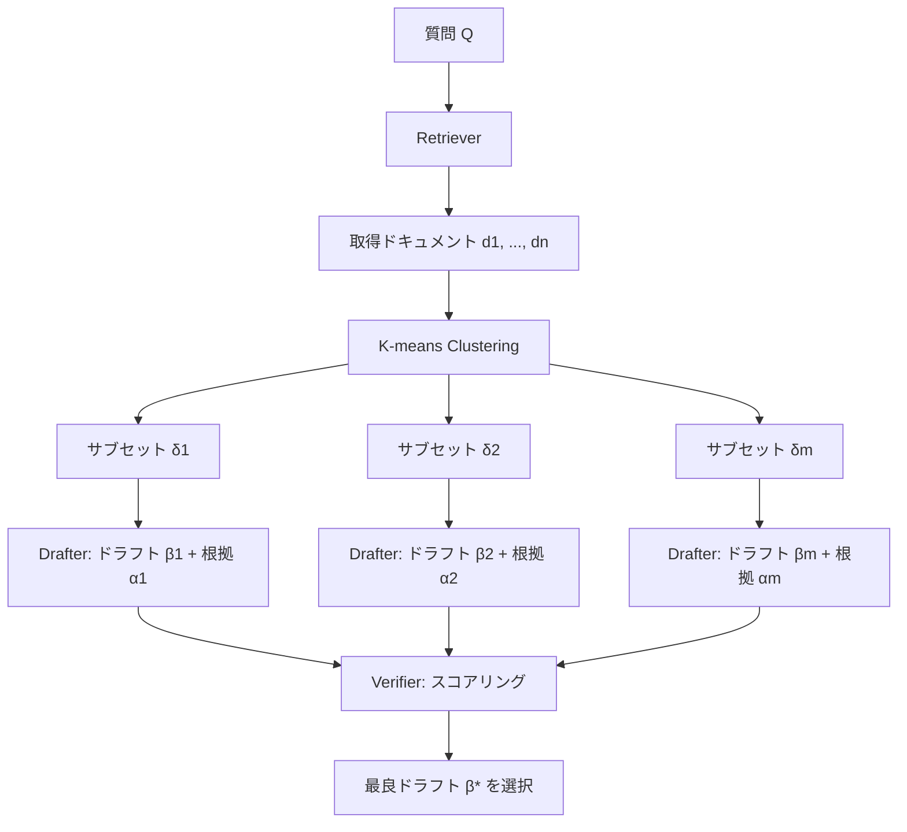

本記事は [Speculative RAG: Enhancing Retrieval Augmented Generation through Drafting](https://arxiv.org/abs/2407.08223)（ICLR 2025採択）の解説記事です。

## 論文概要（Abstract）

Speculative RAGは、小型の専門モデル（RAG Drafter）が取得ドキュメントのサブセットから並列にドラフト回答と根拠（rationale）を生成し、大型の汎用モデル（RAG Verifier）がそれらを言語モデリング確率に基づいてスコアリング・選択する2コンポーネントRAGフレームワークである。著者らは、TriviaQA・MuSiQue・PopQA・PubHealth・ARC-Challengeの5ベンチマークで既存手法を上回る精度を達成しつつ、PubHealthではレイテンシを50.83%削減したと報告している。

この記事は [Zenn記事: Gemini 3.5 Flash×CRAGで社内検索の誤回答を検索評価ループで削減する](https://zenn.dev/0h_n0/articles/798fe16c7d13cd) の深掘りです。Zenn記事で扱ったCRAG（Corrective RAG）が「取得ドキュメントの品質評価と修正」に焦点を当てているのに対し、本論文は「並列ドラフト生成と検証による回答品質向上」という異なるアプローチでRAGの精度とレイテンシの両立を目指している。

## 情報源

- **会議名**: ICLR 2025（International Conference on Learning Representations）
- **年**: 2025
- **URL**: [https://arxiv.org/abs/2407.08223](https://arxiv.org/abs/2407.08223)
- **著者**: Zilong Wang, Zifeng Wang, Long Le, et al.（UC San Diego, Google Cloud AI Research, Google DeepMind）
- **採択率**: 32.08%（11,565件中3,704件採択）
- **発表形式**: Poster

## カンファレンス情報

ICLR（International Conference on Learning Representations）は、深層学習・表現学習分野の最高峰会議の1つである。ICLR 2025の採択率は32.08%であり、11,565件の投稿に対して3,704件が採択された。本論文はPosterとして採択されている。

## 主要な貢献（Key Contributions）

- **2コンポーネントアーキテクチャ**: 小型専門モデル（Drafter）と大型汎用モデル（Verifier）の分離により、ドラフト生成の並列化とVerifierの1回検証を実現
- **Multi-Perspective Document Sampling**: K-meansクラスタリングで取得ドキュメントを多様なサブセットに分割し、各ドラフトが異なる視点を提供
- **3種スコアによる検証**: Self-Consistency Score・Self-Reflection Score・Draft Scoreの積で最適ドラフトを選択

## 技術的詳細（Technical Details）

### 全体アーキテクチャ

Speculative RAGの処理フローは以下の通りである。



従来のRAGは取得した全ドキュメントを1回のLLM呼び出しでコンテキストに詰め込むため、長大なコンテキストによる計算コスト増大と位置バイアス（先頭や末尾のドキュメントが過度に重視される問題）が課題であった。Speculative RAGはこの問題を、ドキュメントをサブセットに分割して小型モデルで並列処理する構成で解消する。

### RAG Drafter（$\mathcal{M}_{\text{Drafter}}$）

Drafterは小型のinstruction-tunedモデルであり、各ドキュメントサブセット$\boldsymbol{\delta}_j = \{d_{j1}, \ldots, d_{jk}\}$から回答ドラフト$\beta_j$と根拠$\alpha_j$を生成する。

$$
(\beta_j, \alpha_j) \sim \mathcal{M}_{\text{Drafter}}(Q, d_{j1}, \ldots, d_{jk})
$$

ここで、
- $Q$: 入力質問
- $d_{j1}, \ldots, d_{jk}$: $j$番目のサブセットに含まれる$k$件のドキュメント
- $\beta_j$: 生成されたドラフト回答
- $\alpha_j$: ドラフトの根拠（rationale）

$m$個のサブセットに対して$m$個のドラフトが**並列に**生成されるため、逐次処理と比較してレイテンシの増加を抑制できる。論文の実験では$m = 5$、$k = 2$が基本設定として使用されている（MuSiQueのみ$m = 10$、$k = 6$）。

### RAG Verifier（$\mathcal{M}_{\text{Verifier}}$）

Verifierは大型の汎用LMであり、ファインチューニングなしでドラフト-根拠ペアの信頼性を評価する。3つのスコアの積で最終スコアを算出する。

#### 1. Draft Score（$\rho_{\text{Draft},j}$）

Drafterモデル自身が生成時に算出する確率であり、ドラフトと根拠の生成尤度を反映する。

$$
\rho_{\text{Draft},j} = P_{\mathcal{M}_{\text{Drafter}}}(\beta_j \mid Q, d_{j1}, \ldots, d_{jk}) + P_{\mathcal{M}_{\text{Drafter}}}(\alpha_j \mid Q, d_{j1}, \ldots, d_{jk}, \beta_j)
$$

ここで、
- $P_{\mathcal{M}_{\text{Drafter}}}(\beta_j \mid Q, d_{j1}, \ldots, d_{jk})$: ドラフト回答の条件付き生成確率
- $P_{\mathcal{M}_{\text{Drafter}}}(\alpha_j \mid Q, d_{j1}, \ldots, d_{jk}, \beta_j)$: 回答が与えられた上での根拠の生成確率

#### 2. Self-Consistency Score（$\rho_{\text{SC},j}$）

Verifierがドキュメントなしでドラフト-根拠ペアを再生成できるかの尤度を測る。ドキュメントに過度に依存したドラフトは、この指標で低スコアとなる。

$$
\rho_{\text{SC},j} = P_{\mathcal{M}_{\text{Verifier}}}(\alpha_j, \beta_j \mid Q)
$$

#### 3. Self-Reflection Score（$\rho_{\text{SR},j}$）

「この根拠は回答を支持しているか？」という自己反省プロンプトに対する肯定確率である。

$$
\rho_{\text{SR},j} = P_{\mathcal{M}_{\text{Verifier}}}(\text{"Yes"} \mid Q, \alpha_j, \beta_j, R)
$$

ここで$R$は「Does the rationale support the answer?」形式のリフレクション用プロンプトである。

#### 最終スコアと回答選択

3つのスコアの積が最終スコアとなり、最高スコアのドラフトが回答として選択される。

$$
\rho_j = \rho_{\text{Draft},j} \cdot \rho_{\text{SC},j} \cdot \rho_{\text{SR},j}
$$

$$
\beta^* = \beta_{\arg\max_j \rho_j}
$$

### Multi-Perspective Document Sampling

取得ドキュメントの多様性を確保するため、K-meansクラスタリングを使用する。

1. instruction-aware埋め込みモデル$\mathcal{E}$を用いて、質問$Q$を考慮した各ドキュメントの埋め込みを計算する

$$
\text{emb}(d_1), \ldots, \text{emb}(d_n) = \mathcal{E}(d_1, \ldots, d_n \mid Q)
$$

2. K-meansで$k$個のクラスタに分割する
3. 各クラスタから1件ずつサンプリングして$k$件のサブセット$\boldsymbol{\delta}$を構成する
4. この手順を$m$回繰り返し、$m$個のサブセットを得る

ランダムサンプリングと比較して、クラスタリングベースの手法は精度を1.22--1.88%向上させると著者らは報告している。

### Instruction Tuning

Drafterは以下の目的関数で訓練される。

$$
\mathbb{E}_{(Q,A,D,E)} \left[ \log P_{\mathcal{M}_{\text{Drafter}}}(A, E \mid Q, D) \right]
$$

ここで、
- $A$: 正解回答
- $E$: 強力なLM（Gemini 1.5 Pro等）が自動生成した根拠
- $D$: ドキュメントサブセット

訓練データの根拠$E$は大型LMによって合成されるため、人手アノテーションは不要である。

## アルゴリズム実装

Speculative RAGの中核処理をPythonで表現すると以下のようになる。

```python
from dataclasses import dataclass
import numpy as np
from sklearn.cluster import KMeans


@dataclass
class DraftResult:
    """ドラフト生成結果を保持するデータクラス

    Attributes:
        answer: ドラフト回答テキスト
        rationale: 回答の根拠テキスト
        draft_score: Drafterの生成確率スコア
    """
    answer: str
    rationale: str
    draft_score: float


def multi_perspective_sampling(
    embeddings: np.ndarray,
    num_clusters: int,
    num_subsets: int,
) -> list[list[int]]:
    """K-meansクラスタリングによるMulti-Perspective Document Sampling

    各クラスタから1件ずつサンプリングして多様なサブセットを構成する。

    Args:
        embeddings: ドキュメント埋め込み行列 (n_docs, embed_dim)
        num_clusters: クラスタ数 k（1サブセットあたりのドキュメント数）
        num_subsets: 生成するサブセット数 m

    Returns:
        各サブセットのドキュメントインデックスリスト
    """
    kmeans = KMeans(n_clusters=num_clusters, random_state=42)
    labels = kmeans.fit_predict(embeddings)

    clusters: dict[int, list[int]] = {}
    for idx, label in enumerate(labels):
        clusters.setdefault(label, []).append(idx)

    subsets: list[list[int]] = []
    for _ in range(num_subsets):
        subset = [
            np.random.choice(clusters[c]) for c in range(num_clusters)
        ]
        subsets.append(subset)

    return subsets


def compute_verification_score(
    draft_score: float,
    self_consistency_score: float,
    self_reflection_score: float,
) -> float:
    """3種スコアの積で最終検証スコアを算出

    Args:
        draft_score: Drafterの生成確率
        self_consistency_score: Verifierの自己一貫性スコア
        self_reflection_score: Verifierの自己反省スコア

    Returns:
        最終検証スコア rho_j
    """
    return draft_score * self_consistency_score * self_reflection_score


def select_best_draft(drafts: list[DraftResult], scores: list[float]) -> str:
    """最高スコアのドラフトを選択

    Args:
        drafts: ドラフト生成結果のリスト
        scores: 各ドラフトの最終検証スコア

    Returns:
        最良ドラフトの回答テキスト
    """
    best_idx = int(np.argmax(scores))
    return drafts[best_idx].answer
```

## 実験結果（Results）

### ベンチマーク比較

著者らは5つのベンチマークで実験を行い、以下の結果を報告している（論文Table 1, Table 2より）。

| ベンチマーク | Standard RAG | Self-RAG | CRAG | Speculative RAG | 精度向上 | レイテンシ削減 |
|:---|:---:|:---:|:---:|:---:|:---:|:---:|
| TriviaQA | 68.29% | 60.76% | 68.29% | 68.62% | +0.33% | 11.90% |
| MuSiQue | 15.19% | 9.85% | 15.19% | 17.34% | +2.15% | 15.07% |
| PopQA | 55.59% | 50.42% | 55.59% | 59.45% | +3.86% | 44.31% |
| PubHealth | 60.50% | 60.00% | 60.50% | 73.47% | +12.97% | 50.83% |
| ARC-Challenge | 69.03% | 67.75% | 69.03% | 71.17% | +2.14% | 22.77% |

Drafterに Mistral-7B-Instruct（instruction-tuned）、VerifierにMixtral-8x7B-Instruct（ファインチューニングなし）を使用した構成での結果である。PubHealthにおいて精度+12.97%・レイテンシ50.83%削減という顕著な改善が確認されている。

### Ablation Study

著者らが報告したAblation結果は以下の通りである（論文Table 3, Table 4より）。

| 変更内容 | 精度変動 |
|:---|:---:|
| Multi-perspective clustering → Random sampling | -1.22% ~ -1.88% |
| Self-Consistency Score除去 | 約 -2.0% |
| Self-Reflection Score除去 | 約 -0.9% |
| 検証なし（ランダム選択） | 約 -5.5% |

検証メカニズム全体を除去した場合の精度低下が最も大きく（約5.5%）、3種スコアの組み合わせが回答品質に寄与していることが示されている。

### ドキュメントサブセットサイズの影響

著者らは、サブセットサイズ$k$を1--6で変化させた実験も報告している。$k = 2$--$4$で最良の精度が得られ、$k$を増やしても一貫した改善は見られなかった。これは、ドキュメント数増加による情報飽和と位置バイアスが原因であると著者らは分析している。

## 実運用への応用（Practical Applications）

### CRAGとの比較

Zenn記事で扱ったCRAG（Corrective RAG）は「取得ドキュメントの品質を評価し、低品質な場合に外部検索で補完する」アプローチであるのに対し、Speculative RAGは「ドキュメントサブセットから並列にドラフトを生成し、最良の回答を選択する」アプローチである。

| 観点 | CRAG | Speculative RAG |
|:---|:---|:---|
| 焦点 | ドキュメント品質の評価・補完 | 回答候補の並列生成・検証 |
| モデル構成 | 単一LM + 評価器 | 小型Drafter + 大型Verifier |
| レイテンシ | 外部検索時に増加 | 並列化で削減 |
| 適用場面 | 検索品質が不安定な環境 | 多様な根拠が必要な場面 |

両手法は相補的であり、CRAGでドキュメント品質を確保した上で、Speculative RAGのドラフト-検証パイプラインを適用する構成も考えられる。

### プロダクション適用時の考慮点

- **Drafter並列化のインフラ要件**: $m$個のDrafterを並列実行するには、十分なGPUメモリまたは推論エンドポイントの水平スケーリングが必要
- **ドキュメント数とサブセットサイズのチューニング**: 論文の知見では$k = 2$--$4$が最適であり、ドメインに応じた調整が求められる
- **Verifierのコスト**: 大型モデル（Mixtral-8x7Bクラス）を1回呼び出すだけで済むため、Standard RAGと比較してVerifier側のコストは同等

## Production Deployment Guide

### AWS実装パターン（コスト最適化重視）

Speculative RAGの2コンポーネント構成（小型Drafter並列実行 + 大型Verifier検証）をAWSで実装する場合の推奨構成を示す。コスト試算は2026年7月時点のap-northeast-1（東京）リージョン料金に基づく概算値であり、実際のコストはトラフィックパターンやバースト使用量により変動する。

**Small構成（~100 req/日）: Serverless** -- 月額$80--200

| サービス | 用途 | 月額概算 |
|:---|:---|:---:|
| Lambda (x2) | Drafter推論 + Verifier推論 | $5--15 |
| Bedrock (Claude Haiku) | Drafter用LLM | $20--50 |
| Bedrock (Claude Sonnet) | Verifier用LLM | $30--80 |
| DynamoDB | ドキュメントキャッシュ | $5--15 |
| S3 + OpenSearch Serverless | ドキュメント格納・検索 | $20--40 |

**Medium構成（~1,000 req/日）: ECS Fargate** -- 月額$400--900

| サービス | 用途 | 月額概算 |
|:---|:---|:---:|
| ECS Fargate (2 Task) | Drafter/Verifierサービス | $60--120 |
| Bedrock | LLM推論 | $200--500 |
| ElastiCache (Redis) | ドラフトキャッシュ | $50--100 |
| OpenSearch | ドキュメント検索 | $80--150 |

**Large構成（10,000+ req/日）: EKS + Spot** -- 月額$2,500--5,500

| サービス | 用途 | 月額概算 |
|:---|:---|:---:|
| EKS + Spot Instances | Drafter並列実行 (g5.xlarge) | $800--1,500 |
| EKS On-Demand | Verifier実行 (g5.2xlarge) | $600--1,200 |
| OpenSearch Service | ドキュメント検索・埋め込み | $300--600 |
| ElastiCache | ドラフト・スコアキャッシュ | $100--200 |
| CloudWatch + X-Ray | 監視・トレーシング | $50--100 |

**コスト削減テクニック**:
- Spot Instances活用（Drafter用GPU）: 最大90%削減。Drafterは並列実行のため、Spot中断時に残りのDrafterで回答を生成可能
- Bedrock Batch API: 非リアルタイム処理で50%削減
- Prompt Caching有効化: 共通のシステムプロンプト部分で30--90%削減
- Reserved Instances（Verifier用On-Demand）: 1年コミットで最大72%削減

### Terraformインフラコード

#### Small構成（Serverless）

```hcl
# Speculative RAG - Small構成 (Lambda + Bedrock)
# 月額$80-200 / ~100 req/日

terraform {
  required_version = ">= 1.5"
  required_providers {
    aws = { source = "hashicorp/aws", version = "~> 5.0" }
  }
}

provider "aws" {
  region = "ap-northeast-1"
}

# --- IAM: 最小権限 ---
resource "aws_iam_role" "drafter_lambda" {
  name = "speculative-rag-drafter"
  assume_role_policy = jsonencode({
    Version = "2012-10-17"
    Statement = [{
      Action = "sts:AssumeRole"
      Effect = "Allow"
      Principal = { Service = "lambda.amazonaws.com" }
    }]
  })
}

resource "aws_iam_role_policy" "drafter_bedrock" {
  name = "bedrock-invoke"
  role = aws_iam_role.drafter_lambda.id
  policy = jsonencode({
    Version = "2012-10-17"
    Statement = [{
      Effect   = "Allow"
      Action   = ["bedrock:InvokeModel"]
      Resource = "arn:aws:bedrock:ap-northeast-1::foundation-model/anthropic.claude-3-haiku-*"
    }]
  })
}

# --- Lambda: Drafter ---
resource "aws_lambda_function" "drafter" {
  function_name = "speculative-rag-drafter"
  runtime       = "python3.12"
  handler       = "drafter.handler"
  role          = aws_iam_role.drafter_lambda.arn
  timeout       = 60
  memory_size   = 512  # コスト最適化: 512MBで十分

  environment {
    variables = {
      BEDROCK_MODEL_ID = "anthropic.claude-3-haiku-20240307-v1:0"
      NUM_DRAFTS       = "5"
      DOCS_PER_DRAFT   = "2"
    }
  }

  tracing_config {
    mode = "Active"  # X-Ray有効化
  }
}

# --- DynamoDB: ドキュメントキャッシュ ---
resource "aws_dynamodb_table" "doc_cache" {
  name         = "speculative-rag-doc-cache"
  billing_mode = "PAY_PER_REQUEST"  # On-Demandでコスト最適化
  hash_key     = "query_hash"

  attribute {
    name = "query_hash"
    type = "S"
  }

  ttl {
    attribute_name = "expires_at"
    enabled        = true
  }

  server_side_encryption {
    enabled = true  # KMS暗号化
  }
}

# --- CloudWatch: コスト監視アラーム ---
resource "aws_cloudwatch_metric_alarm" "bedrock_cost" {
  alarm_name          = "speculative-rag-bedrock-cost-spike"
  comparison_operator = "GreaterThanThreshold"
  evaluation_periods  = 1
  metric_name         = "InvocationCount"
  namespace           = "AWS/Bedrock"
  period              = 3600
  statistic           = "Sum"
  threshold           = 500  # 1時間500回超過でアラート
  alarm_actions       = []   # SNS ARNを設定
}
```

#### Large構成（EKS + Spot）

```hcl
# Speculative RAG - Large構成 (EKS + Karpenter + Spot)
# 月額$2,500-5,500 / 10,000+ req/日

module "eks" {
  source          = "terraform-aws-modules/eks/aws"
  version         = "~> 20.0"
  cluster_name    = "speculative-rag-prod"
  cluster_version = "1.30"

  vpc_id     = module.vpc.vpc_id
  subnet_ids = module.vpc.private_subnets

  # コントロールプレーンのみ管理
  cluster_endpoint_public_access = false
}

# --- Karpenter: Spot優先の自動スケーリング ---
resource "kubectl_manifest" "karpenter_drafter" {
  yaml_body = yamlencode({
    apiVersion = "karpenter.sh/v1beta1"
    kind       = "NodePool"
    metadata   = { name = "drafter-gpu" }
    spec = {
      template = {
        spec = {
          requirements = [
            { key = "karpenter.sh/capacity-type", operator = "In", values = ["spot", "on-demand"] },
            { key = "node.kubernetes.io/instance-type", operator = "In", values = ["g5.xlarge", "g5.2xlarge"] },
          ]
          nodeClassRef = { name = "default" }
        }
      }
      limits   = { cpu = "64", memory = "256Gi" }
      disruption = {
        consolidationPolicy = "WhenUnderutilized"
        expireAfter         = "720h"
      }
    }
  })
}

# --- Secrets Manager: モデル設定 ---
resource "aws_secretsmanager_secret" "model_config" {
  name                    = "speculative-rag/model-config"
  recovery_window_in_days = 7
}

# --- AWS Budgets: 予算アラート ---
resource "aws_budgets_budget" "monthly" {
  name         = "speculative-rag-monthly"
  budget_type  = "COST"
  limit_amount = "6000"
  limit_unit   = "USD"
  time_unit    = "MONTHLY"

  notification {
    comparison_operator       = "GREATER_THAN"
    threshold                 = 80
    threshold_type            = "PERCENTAGE"
    notification_type         = "ACTUAL"
    subscriber_email_addresses = ["alerts@example.com"]
  }
}
```

### 運用・監視設定

#### CloudWatch Logs Insights クエリ

```
# コスト異常検知: 1時間あたりのBedrock呼び出し数
fields @timestamp, @message
| filter @message like /bedrock/
| stats count() as invocations by bin(1h) as hour
| sort hour desc
| limit 24

# レイテンシ分析: Drafter並列実行のP95/P99
fields @timestamp, drafter_latency_ms, verifier_latency_ms, total_latency_ms
| stats
    percentile(drafter_latency_ms, 95) as drafter_p95,
    percentile(verifier_latency_ms, 95) as verifier_p95,
    percentile(total_latency_ms, 99) as total_p99
    by bin(1h)
```

#### CloudWatch アラーム設定

```python
import boto3

cloudwatch = boto3.client("cloudwatch", region_name="ap-northeast-1")


def create_latency_alarm(threshold_ms: int = 5000) -> None:
    """Speculative RAGのレイテンシ異常検知アラームを作成

    Args:
        threshold_ms: アラーム閾値（ミリ秒）
    """
    cloudwatch.put_metric_alarm(
        AlarmName="speculative-rag-latency-p99",
        MetricName="TotalLatency",
        Namespace="SpeculativeRAG",
        Statistic="p99",
        Period=300,
        EvaluationPeriods=3,
        Threshold=threshold_ms,
        ComparisonOperator="GreaterThanThreshold",
        AlarmActions=[],  # SNS ARNを設定
    )
```

#### X-Ray トレーシング設定

```python
from aws_xray_sdk.core import xray_recorder, patch_all

patch_all()  # boto3自動計装


@xray_recorder.capture("speculative_rag_pipeline")
def run_speculative_rag(query: str, documents: list[str]) -> str:
    """Speculative RAGパイプラインをX-Rayでトレース

    Args:
        query: 入力質問
        documents: 取得ドキュメントリスト

    Returns:
        最良ドラフトの回答テキスト
    """
    subsegment = xray_recorder.current_subsegment()
    subsegment.put_annotation("num_documents", len(documents))
    subsegment.put_metadata("query", query)

    # Drafter並列実行（各サブセグメントで計測）
    with xray_recorder.in_subsegment("drafter_parallel"):
        drafts = generate_drafts_parallel(query, documents)

    # Verifier検証
    with xray_recorder.in_subsegment("verifier_scoring"):
        best_answer = verify_and_select(query, drafts)

    subsegment.put_annotation("num_drafts", len(drafts))
    return best_answer
```

#### Cost Explorer自動レポート

```python
import boto3
from datetime import datetime, timedelta


def get_daily_cost_report() -> dict:
    """日次コストレポートを取得しSNS通知

    Returns:
        サービス別コスト辞書
    """
    ce = boto3.client("ce", region_name="us-east-1")
    today = datetime.utcnow().strftime("%Y-%m-%d")
    yesterday = (datetime.utcnow() - timedelta(days=1)).strftime("%Y-%m-%d")

    response = ce.get_cost_and_usage(
        TimePeriod={"Start": yesterday, "End": today},
        Granularity="DAILY",
        Metrics=["UnblendedCost"],
        Filter={
            "Tags": {
                "Key": "Project",
                "Values": ["speculative-rag"],
            }
        },
        GroupBy=[{"Type": "DIMENSION", "Key": "SERVICE"}],
    )

    costs: dict[str, float] = {}
    for group in response["ResultsByTime"][0]["Groups"]:
        service = group["Keys"][0]
        amount = float(group["Metrics"]["UnblendedCost"]["Amount"])
        costs[service] = amount

    total = sum(costs.values())
    if total > 100.0:
        sns = boto3.client("sns", region_name="ap-northeast-1")
        sns.publish(
            TopicArn="arn:aws:sns:ap-northeast-1:ACCOUNT:cost-alert",
            Subject=f"Speculative RAG Daily Cost Alert: ${total:.2f}",
            Message=f"Daily cost exceeded $100: ${total:.2f}\n{costs}",
        )

    return costs
```

### コスト最適化チェックリスト

**アーキテクチャ選択**:
- [ ] トラフィック量に応じた構成選択（~100: Serverless / ~1000: Hybrid / 10000+: Container）
- [ ] Drafter並列数$m$の調整（精度とコストのトレードオフ）
- [ ] サブセットサイズ$k$の最適化（$k = 2$--$4$を推奨）

**リソース最適化**:
- [ ] Drafter用GPU: Spot Instances優先（中断耐性あり）
- [ ] Verifier用: Reserved Instances 1年コミット
- [ ] Savings Plans検討（Compute / EC2 Instance）
- [ ] Lambda: メモリサイズ最適化（Power Tuning）
- [ ] ECS/EKS: Karpenterによるアイドル時スケールダウン

**LLMコスト削減**:
- [ ] Bedrock Batch API使用（非リアルタイム処理）
- [ ] Prompt Caching有効化（共通プロンプト部分）
- [ ] モデル選択ロジック（簡易クエリはHaiku、複雑クエリはSonnet）
- [ ] トークン数制限（ドラフト・根拠の最大長設定）

**監視・アラート**:
- [ ] AWS Budgets設定（月額上限）
- [ ] CloudWatch アラーム（レイテンシ・呼び出し数）
- [ ] Cost Anomaly Detection有効化
- [ ] 日次コストレポート自動送信

**リソース管理**:
- [ ] 未使用リソース定期削除（未アタッチEBS等）
- [ ] タグ戦略（Project / Environment / Owner）
- [ ] ログのライフサイクルポリシー（90日保持）
- [ ] 開発環境の夜間・休日停止
- [ ] DynamoDB TTLによるキャッシュ自動削除

## 関連研究（Related Work）

- **Self-RAG** (Asai et al., 2024): 反省トークン（reflection tokens）を用いてLLM自身が検索の必要性を判断し、取得ドキュメントの品質を評価する手法。Speculative RAGとの違いは、Self-RAGが単一モデルの自己改善に依存するのに対し、Speculative RAGは2コンポーネントの分業で並列化を実現する点にある
- **CRAG** (Yan et al., 2024): 軽量な評価器でドキュメントの関連度を判定し、低品質な場合にWeb検索で補完するCorrective RAG。Zenn記事で詳しく扱っている手法であり、Speculative RAGのドラフト-検証パイプラインと組み合わせることで相補的に機能する可能性がある
- **Speculative Decoding** (Leviathan et al., 2023): 推論高速化のために小型モデルでトークンをドラフト生成し、大型モデルで検証・受理する手法。Speculative RAGはこの概念をRAGのドキュメント処理に拡張したものと位置付けられる

## まとめと今後の展望

Speculative RAGは、小型Drafterの並列ドラフト生成と大型Verifierの検証を組み合わせることで、RAGの精度とレイテンシの両立を実現するフレームワークである。PubHealthで精度+12.97%・レイテンシ50.83%削減という結果は、特にファクトチェック系タスクでの有効性を示している。

実務への示唆として、Drafterの並列化によるレイテンシ削減はリアルタイム性が求められるプロダクション環境で有用であり、CRAGとの組み合わせによるドキュメント品質担保+回答品質向上の統合パイプラインが今後の方向性として考えられる。論文では、より効率的なDrafterの蒸留手法や、動的なドラフト数の決定メカニズムが未探索の研究課題として残されている。

## 参考文献

- **Conference URL**: [https://arxiv.org/abs/2407.08223](https://arxiv.org/abs/2407.08223)
- **OpenReview**: [https://openreview.net/forum?id=xgQfWbV6Ey](https://openreview.net/forum?id=xgQfWbV6Ey)
- **Community Implementation**: [https://github.com/jjovalle99/Speculative-RAG](https://github.com/jjovalle99/Speculative-RAG)
- **Related Zenn article**: [https://zenn.dev/0h_n0/articles/798fe16c7d13cd](https://zenn.dev/0h_n0/articles/798fe16c7d13cd)
