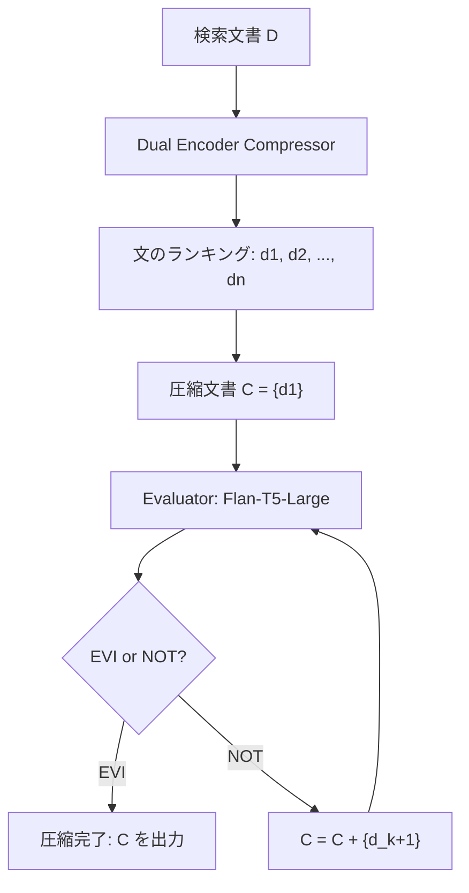

## 論文概要（Abstract）

本記事は [ECoRAG](https://arxiv.org/abs/2506.05167) の解説記事です。

ECoRAG（Evidentiality-guided Compression for RAG）は、Retrieval-Augmented Generation（RAG）で取得した文書を「エビデンス性（evidentiality）」に基づいて圧縮するフレームワークである。著者らは、従来の圧縮手法が「正しい回答生成を支持する証拠かどうか」を考慮していない点を課題として指摘し、文を3層（Strong Evidence / Weak Evidence / Distractors）に階層的にランク付けするDual Encoderと、圧縮結果のエビデンス充足度を判定する軽量評価器（Flan-T5-Large, 770Mパラメータ）を組み合わせた適応的圧縮を提案している。Natural Questions、TriviaQA、WebQuestionsの3データセットにおいて、トークン数を平均96%以上削減しながらStandard RAGと同等以上の精度を達成したと報告されている。ACL 2025 Findingsに採択された研究である。

この記事は [Zenn記事: Gemini 3.5 Flash×CRAGで社内検索の誤回答を検索評価ループで削減する](https://zenn.dev/0h_n0/articles/798fe16c7d13cd) の深掘りです。Zenn記事で扱ったCRAGのknowledge strip概念（取得文書を細粒度の知識単位に分割して関連度を判定する手法）を、エビデンス性という学術的に厳密な基準で発展させた研究として位置付けられる。

## 情報源

- **arXiv ID**: 2506.05167
- **URL**: [https://arxiv.org/abs/2506.05167](https://arxiv.org/abs/2506.05167)
- **著者**: Yeonseok Jeong, Jinsu Kim, Dohyeon Lee, Seung-won Hwang
- **発表年**: 2025
- **採択**: ACL 2025 Findings
- **分野**: cs.CL, cs.AI, cs.IR
- **コード**: [https://github.com/ldilab/ECoRAG](https://github.com/ldilab/ECoRAG)（Apache-2.0ライセンス）

## 背景と動機（Background & Motivation）

RAGでは、検索エンジンから取得した文書をLLMのコンテキストに追加することで、知識の正確性を向上させる。しかし、取得文書が多くなるとコンテキスト長が増大し、推論コストの増加と精度低下の両方が発生する。特に100文書規模（平均14,000トークン）の検索結果をそのまま渡すと、関連性の低い文が「ディストラクタ」として回答品質を劣化させる。

従来の文書圧縮手法（LLMLingua、RECOMP等）は、固定的な圧縮率や回答可能性（answerability）に基づく手法であり、「この文がないと正答できない」「この文が他の証拠を妨害する」といったエビデンス性の階層的な評価を行っていなかった。さらに、圧縮後の文書がLLMにとって十分な証拠を含んでいるかを事後的に検証する機構も欠けていた。

ECoRAGは、CRAGが提案した「knowledge strip」（文書を細粒度の単位に分割して個別に関連度を判定する）という概念を、エビデンス性という情報検索理論に基づく基準で拡張し、3層の階層的ランキングと適応的圧縮を実現した研究である。

## 主要な貢献（Key Contributions）

- **エビデンス性に基づく3層階層ランキング**: 文を「Strong Evidence」「Weak Evidence」「Distractors」の3層に分類し、InfoNCE損失で学習するDual Encoder圧縮器を提案
- **適応的圧縮（Evidentiality Reflection）**: 軽量評価器（Flan-T5-Large, 770Mパラメータ）が圧縮結果のエビデンス充足度を判定し、不足時に証拠を追加する反復的な圧縮機構
- **極端な圧縮率と精度の両立**: TriviaQAにおいてトークン数を14,167から441に削減（圧縮率97%）しつつ、EMスコアを56.21%から65.34%に+9.13ポイント改善

## 技術的詳細（Technical Details）

### エビデンス性の3層定義

ECoRAGの核心は、文書中の各文を以下の3層に分類する点にある。

**Tier 1 — Strong Evidence（強証拠）**: この文なしではLLMが正答を生成できないが、この文があれば正答できる。形式的には、質問$q$、文$d_i$、正答$a$に対して以下の2条件を同時に満たす文を指す。

$$
\text{LLM}(q, D \setminus \{d_i\}) \neq a \quad \land \quad \text{LLM}(q, \{d_i\}) = a
$$

**Tier 2 — Weak Evidence（弱証拠）**: Strong Evidence条件を満たさないが、Strong Evidenceと共存してもその証拠品質を妨害しない文。

**Tier 3 — Distractors（妨害文）**: Strong Evidence条件を満たさず、かつ証拠品質を妨害する文。これらの文がコンテキストに含まれると、LLMの回答精度が低下する。

この3層定義は、CRAGの「knowledge strip」が二値分類（relevant / irrelevant）であったのに対し、証拠としての質を階層的に評価する点で発展的である。

### Dual Encoderアーキテクチャ

圧縮器はContriever（110Mパラメータ）をベースとしたDual Encoderで構成される。質問エンコーダ$E_Q$と文エンコーダ$E_D$がそれぞれ質問と文書中の各文を密ベクトルに変換し、類似度スコアを算出する。

$$
\text{sim}(q, d_i) = E_Q(q) \cdot E_D(d_i)
$$

ここで、
- $E_Q(q)$: 質問$q$の密ベクトル表現
- $E_D(d_i)$: 文書中$i$番目の文$d_i$の密ベクトル表現
- $\cdot$: 内積演算

### 損失関数: 2つのInfoNCE損失の結合

学習には2つのInfoNCE損失を結合した損失関数を使用する。

**Weak Evidentiality Loss $\mathcal{L}_{\text{we}}$**: Weak Evidence（$d^+$）をDistractors（$d^-$）よりも高くランク付けする。

$$
\mathcal{L}_{\text{we}} = -\log \frac{\exp(\text{sim}(q, d^+) / \tau)}{\exp(\text{sim}(q, d^+) / \tau) + \sum_{j=1}^{N^-} \exp(\text{sim}(q, d_j^-) / \tau)}
$$

ここで、
- $d^+$: Weak Evidence文（正例）
- $d_j^-$: $j$番目のDistractor文（負例）
- $N^-$: Distractorsの数
- $\tau$: 温度パラメータ

**Strong Evidentiality Loss $\mathcal{L}_{\text{se}}$**: Strong Evidence（$d^*$）をWeak EvidenceとDistractorsの両方よりも高くランク付けする。

$$
\mathcal{L}_{\text{se}} = -\log \frac{\exp(\text{sim}(q, d^*) / \tau)}{\exp(\text{sim}(q, d^*) / \tau) + \sum_{j=1}^{N^{\pm}} \exp(\text{sim}(q, d_j^{\pm}) / \tau)}
$$

ここで、
- $d^*$: Strong Evidence文
- $d_j^{\pm}$: Weak EvidenceまたはDistractor文（いずれも$d^*$より低くランク付けされるべき文）
- $N^{\pm}$: Weak EvidenceとDistractorsの合計数

**結合損失**:

$$
\mathcal{L} = \mathcal{L}_{\text{se}} + \mathcal{L}_{\text{we}}
$$

この2段階の損失設計により、$s^* > s^+ > s^-$（Strong Evidence > Weak Evidence > Distractors）という順序関係が学習される。従来のAnswerability-based手法（RECOMPなど）が「回答に役立つかどうか」の二値で判定していたのに対し、ECoRAGは証拠の強度を3段階で区別する点が本質的な差異である。

### 学習データの自動生成

3層ラベルの生成にはLLM推論を利用する。各質問-文書ペアについて以下の手順で自動ラベル付けを行う。

1. 各文$d_i$を除外した文書セット$D \setminus \{d_i\}$をLLMに入力し、正答$a$が生成されるか検証（条件1）
2. 文$d_i$のみを入力し、正答$a$が生成されるか検証（条件2）
3. 条件1が不成立かつ条件2が成立 → Strong Evidence
4. Strong Evidence条件を満たさないが他の証拠と干渉しない → Weak Evidence
5. 上記いずれにも該当しない → Distractor

HotpotQAの人間アノテーションとの比較では、ECoRAGの自動ラベリングがNDCG@1で75.53%（Leave-One-Out法の70.67%を上回る）の整合性を示したと著者らは報告している（論文Table 2）。

### Evidentiality Reflection（適応的圧縮）

圧縮器が文をランク付けした後、「圧縮結果がLLMの正答生成に十分なエビデンスを含んでいるか」を事後的に検証する機構がEvidentiality Reflectionである。



**評価器**: Flan-T5-Large（770Mパラメータ）をファインチューニングし、特殊トークン`<EVI>`（十分なエビデンスあり）と`<NOT>`（エビデンス不足）を出力するよう学習する。

**評価器の損失関数**:

$$
\mathcal{L}_{\text{eval}} = -\log p_{\mathcal{M}_{\text{eval}}}(t \mid q, d)
$$

ここで、
- $\mathcal{M}_{\text{eval}}$: 評価器モデル（Flan-T5-Large）
- $t \in \{\texttt{<EVI>}, \texttt{<NOT>}\}$: 出力トークン
- $q$: 質問
- $d$: 圧縮後の文書

**適応的圧縮アルゴリズム**:

1. 圧縮器による全文ランキングを取得
2. 最上位の文$d_1'$のみで初期圧縮文書$C$を構成
3. 評価器に$(q, C)$を入力し、`<EVI>`か`<NOT>`を判定
4. `<EVI>`の場合: 圧縮完了、$C$をLLMに渡す
5. `<NOT>`の場合: 次のランクの文$d_{k+1}'$を$C$に追加し、手順3に戻る
6. トークン上限に達するまで反復

この機構により、質問ごとに最適な圧縮率が動的に決定される。容易な質問では1-2文で充足し、複雑な質問ではより多くの文が追加される。

## 実装のポイント（Implementation）

### 圧縮器の学習

```python
import torch
import torch.nn.functional as F
from transformers import AutoModel, AutoTokenizer


class EvidentialityCompressor:
    """ECoRAG Evidentiality-guided Compressor

    Contriever-based dual encoder that ranks sentences
    by evidentiality using two InfoNCE losses.

    Args:
        model_name: Base encoder model (default: Contriever)
        temperature: InfoNCE temperature parameter
    """

    def __init__(
        self,
        model_name: str = "facebook/contriever",
        temperature: float = 0.05,
    ) -> None:
        self.query_encoder = AutoModel.from_pretrained(model_name)
        self.sentence_encoder = AutoModel.from_pretrained(model_name)
        self.tokenizer = AutoTokenizer.from_pretrained(model_name)
        self.temperature = temperature

    def compute_similarity(
        self,
        query: str,
        sentences: list[str],
    ) -> torch.Tensor:
        """Compute similarity scores between query and sentences.

        Args:
            query: Input question
            sentences: List of document sentences

        Returns:
            Tensor of similarity scores, shape (num_sentences,)
        """
        q_tokens = self.tokenizer(
            query, return_tensors="pt", padding=True, truncation=True
        )
        q_emb = self.query_encoder(**q_tokens).last_hidden_state[:, 0, :]

        s_tokens = self.tokenizer(
            sentences, return_tensors="pt", padding=True, truncation=True
        )
        s_emb = self.sentence_encoder(**s_tokens).last_hidden_state[:, 0, :]

        # Normalized dot product
        q_emb = F.normalize(q_emb, dim=-1)
        s_emb = F.normalize(s_emb, dim=-1)
        scores = torch.matmul(q_emb, s_emb.T).squeeze(0)
        return scores

    def infonce_loss(
        self,
        positive_score: torch.Tensor,
        negative_scores: torch.Tensor,
    ) -> torch.Tensor:
        """Compute InfoNCE loss.

        Args:
            positive_score: Similarity score for positive example
            negative_scores: Similarity scores for negative examples

        Returns:
            Scalar loss value
        """
        logits = torch.cat([
            positive_score.unsqueeze(0),
            negative_scores,
        ]) / self.temperature
        labels = torch.zeros(1, dtype=torch.long, device=logits.device)
        return F.cross_entropy(logits.unsqueeze(0), labels)

    def compute_combined_loss(
        self,
        strong_score: torch.Tensor,
        weak_scores: torch.Tensor,
        distractor_scores: torch.Tensor,
    ) -> torch.Tensor:
        """Compute combined evidentiality loss (L_se + L_we).

        Args:
            strong_score: Score for strong evidence sentence
            weak_scores: Scores for weak evidence sentences
            distractor_scores: Scores for distractor sentences

        Returns:
            Combined loss value
        """
        # L_se: strong > (weak + distractors)
        non_strong = torch.cat([weak_scores, distractor_scores])
        loss_se = self.infonce_loss(strong_score, non_strong)

        # L_we: weak > distractors (for each weak evidence)
        loss_we = torch.tensor(0.0, device=strong_score.device)
        for ws in weak_scores:
            loss_we += self.infonce_loss(ws, distractor_scores)
        if len(weak_scores) > 0:
            loss_we /= len(weak_scores)

        return loss_se + loss_we
```

### 適応的圧縮の推論

```python
from transformers import T5ForConditionalGeneration, T5Tokenizer


class EvidentialityReflector:
    """Evaluator for adaptive compression.

    Uses fine-tuned Flan-T5-Large to assess whether
    compressed content provides sufficient evidence.

    Args:
        model_name: Fine-tuned evaluator model path
        max_tokens: Maximum token budget for compression
    """

    def __init__(
        self,
        model_name: str = "google/flan-t5-large",
        max_tokens: int = 2048,
    ) -> None:
        self.model = T5ForConditionalGeneration.from_pretrained(model_name)
        self.tokenizer = T5Tokenizer.from_pretrained(model_name)
        self.max_tokens = max_tokens

    def is_sufficient(self, query: str, compressed: str) -> bool:
        """Check if compressed content has sufficient evidence.

        Args:
            query: Input question
            compressed: Current compressed document

        Returns:
            True if evaluator outputs <EVI>, False if <NOT>
        """
        prompt = f"Question: {query}\nContext: {compressed}\nIs this sufficient evidence?"
        inputs = self.tokenizer(prompt, return_tensors="pt", truncation=True)
        outputs = self.model.generate(**inputs, max_new_tokens=5)
        prediction = self.tokenizer.decode(outputs[0], skip_special_tokens=True)
        return "<EVI>" in prediction

    def adaptive_compress(
        self,
        query: str,
        ranked_sentences: list[str],
    ) -> str:
        """Iteratively add sentences until evidence is sufficient.

        Args:
            query: Input question
            ranked_sentences: Sentences sorted by evidentiality score (descending)

        Returns:
            Compressed document string
        """
        compressed_parts: list[str] = []
        total_tokens = 0

        for sentence in ranked_sentences:
            compressed_parts.append(sentence)
            compressed = " ".join(compressed_parts)

            token_count = len(self.tokenizer.encode(compressed))
            if token_count > self.max_tokens:
                break

            if self.is_sufficient(query, compressed):
                return compressed

        return " ".join(compressed_parts)
```

### 実装上の注意点

- **Contrieverの選定理由**: 110Mパラメータと軽量であり、推論時のVRAMオーバーヘッドが小さい。BERTベースのエンコーダでも代替可能だが、著者らの実験ではContrieverが最も良い結果を示している
- **温度パラメータ$\tau$**: InfoNCE損失の温度は実験結果から小さい値（0.05程度）が推奨される。大きすぎると3層の分離が不十分になる
- **評価器の学習コスト**: Flan-T5-Largeのファインチューニングは0.03時間（約2分）で完了すると報告されており、計算コストは極めて低い
- **文分割の粒度**: 論文では文（sentence）単位で圧縮を行っているが、CRAGのknowledge stripのように段落やチャンク単位に変更することも実装上可能である

## 実験結果（Results）

### メイン結果（100文書、GPT-4o-miniリーダー）

著者らは3つのOpen-Domain QAデータセットで評価を行い、以下の結果を報告している（論文Table 1）。

| データセット | 手法 | トークン数 | EM | F1 |
|:----------:|:----:|:---------:|:----:|:----:|
| NQ | Standard RAG | 13,905 | 36.09% | 50.18% |
| NQ | RECOMP | 575 | 33.41% | 46.01% |
| NQ | CompAct | 826 | 35.71% | 48.75% |
| NQ | **ECoRAG** | **632** | **36.48%** | **49.81%** |
| TQA | Standard RAG | 14,167 | 56.21% | 64.22% |
| TQA | RECOMP | 403 | 56.62% | 66.63% |
| TQA | CompAct | 1,062 | 63.96% | 73.95% |
| TQA | **ECoRAG** | **441** | **65.34%** | **75.37%** |
| WQ | Standard RAG | 13,731 | 21.11% | 38.72% |
| WQ | RECOMP | 477 | 25.96% | 41.72% |
| WQ | CompAct | 695 | 29.77% | 45.35% |
| WQ | **ECoRAG** | **560** | **30.17%** | **46.13%** |

TriviaQAにおいて、ECoRAGはStandard RAGに対してトークン数を96.9%削減しながら、EMスコアを+9.13ポイント改善している。これは「不要な文がLLMの推論を妨害している」というディストラクタ仮説を強く支持する結果である。

### 圧縮率統計（論文Table 8）

| データセット | 平均圧縮率 | 中央値 | 標準偏差 |
|:----------:|:---------:|:-----:|:-------:|
| NQ | 0.0401 | 0.0446 | 0.0247 |
| TQA | 0.0267 | 0.0161 | 0.0221 |

圧縮率は質問ごとに大きく変動し、適応的圧縮が機能していることが確認できる。TriviaQAの中央値0.0161は、元の文書の約1.6%のみを保持していることを意味する。

### Ablation Study（論文Table 3）

| コンポーネント | NQ EM | TQA EM | 差分 |
|:------------:|:-----:|:------:|:----:|
| Full ECoRAG | 36.48% | 65.43% | -- |
| w/o Answerability | 31.25% | 63.86% | -5.23 / -1.57 |
| w/o Evidentiality | 35.46% | 64.90% | -1.02 / -0.53 |
| w/o Evaluator | 35.71% | 63.63% | -0.77 / -1.80 |

Answerability（回答可能性）の除去が最も大きな影響を与えており、エビデンス性の判定において「この文で回答できるか」という基本条件が前提として重要であることを示している。Evaluator（適応的圧縮）の除去はTriviaQAで-1.80ポイントの低下をもたらし、質問の複雑さに応じた動的な圧縮率調整の有効性が確認されている。

### 効率性分析（論文Table 4、NQテストセット）

| 手法 | 圧縮時間 | 推論時間 | 合計 | スループット |
|:----:|:-------:|:-------:|:----:|:----------:|
| Standard RAG | -- | 12.28h | 12.28h | 0.08 ex/s |
| ECoRAG | 0.73h | 4.23h | 4.96h | 0.20 ex/s |

合計処理時間は60%削減され、スループットは2.5倍に向上している。圧縮器（110M）と評価器（770M）の追加VRAMは合計880Mであり、8Bクラスのリーダーモデルに対して約10%程度のオーバーヘッドにとどまる。

### 1000文書での性能（論文Table 6）

| 手法 | トークン数 | EM | F1 |
|:----:|:---------:|:----:|:----:|
| Standard RAG | 127,880 | 0.44% | 0.63% |
| RECOMP | 661 | 31.39% | 42.29% |
| ECoRAG | 659 | 35.51% | 48.63% |

1000文書規模ではStandard RAGの精度が事実上崩壊（EM 0.44%）する一方、ECoRAGは35.51%を維持している。RECOMPとの差も+4.12ポイントに拡大しており、文書数の増加に対するロバスト性が確認できる。

### 人間アノテーションとの整合性（論文Table 2、HotpotQA）

| 手法 | NDCG@1 | NDCG@10 |
|:----:|:------:|:-------:|
| Answerability | 67.82% | 79.20% |
| Leave-One-Out | 70.67% | 80.80% |
| ECoRAG | 75.53% | 81.92% |

ECoRAGのエビデンス性ランキングは、人間がアノテーションした証拠文と高い整合性を示している。NDCG@1で75.53%は、Leave-One-Out法を+4.86ポイント上回る結果である。

### 評価器の効率性（論文Figure 4）

著者らは、ECoRAGの評価器（Flan-T5-Large, 770M）がCompActの評価器（7Bパラメータ）をF1スコアで+13.96ポイント上回り、Flan-UL2（20Bパラメータ）と-0.08ポイント差の性能を達成したと報告している。パラメータ数が約1/26であることを考慮すると、エビデンス性に特化した学習の効果が際立つ。

## 実運用への応用（Practical Applications）

### CRAGとの連携

Zenn記事で実装したCRAGパイプラインでは、knowledge stripとして文書を分割し、LLMベースの評価で関連度を判定していた。ECoRAGの圧縮器はこの評価プロセスを110Mパラメータの軽量モデルで代替できるため、LLM呼び出しコストを大幅に削減できる。具体的には、CRAGのknowledge strip評価にGemini等のLLMを使用していた部分を、ECoRAGのDual Encoderに置き換えることで、評価のレイテンシが数百ミリ秒から数十ミリ秒に短縮される。

### 社内検索システムへの適用

社内ドキュメント検索のようなエンタープライズRAGでは、検索結果に多数のノイズ文書が含まれることが多い。ECoRAGの適応的圧縮を導入することで、以下の効果が期待できる。

- **コスト削減**: トークン数96%削減により、GPT-4oクラスのLLM呼び出しコストを約1/25に圧縮
- **レイテンシ改善**: コンテキスト長短縮による推論時間の60%削減
- **精度向上**: ディストラクタ除去によるTriviaQAで+9.13ポイント相当の改善
- **スケーラビリティ**: 1000文書規模でもEM 35.51%を維持（Standard RAGは0.44%に崩壊）

## Production Deployment Guide

### AWS実装パターン（コスト最適化重視）

ECoRAGの本番デプロイでは、圧縮器（Contriever 110M）+ 評価器（Flan-T5-Large 770M）+ リーダー（LLM）の3コンポーネントを配置する必要がある。以下にトラフィック量別の推奨構成を示す。

**注意**: 以下のコスト試算は2026年7月時点のAWS ap-northeast-1（東京）リージョン料金に基づく概算値である。実際のコストはトラフィックパターン、リージョン、バースト使用量により変動する。最新料金はAWS料金計算ツールで確認を推奨する。

| 構成 | トラフィック | アーキテクチャ | 月額概算 |
|:----:|:----------:|:------------:|:-------:|
| Small | ~100 req/日 | Lambda + Bedrock + DynamoDB | $50-150 |
| Medium | ~1,000 req/日 | ECS Fargate + Bedrock + ElastiCache | $300-800 |
| Large | 10,000+ req/日 | EKS + Spot + SageMaker Endpoint | $2,000-5,000 |

**Small構成（~100 req/日）**:
- Lambda（ARM64, 2048MB, 30秒タイムアウト）: 圧縮器+評価器の推論。110M+770Mモデルはオンデマンドロード
- Bedrock（Claude Sonnet / Gemini相当）: リーダーLLM。圧縮後の平均500トークン入力でコストを最小化
- DynamoDB（On-Demand）: 圧縮結果キャッシュ。同一クエリの再計算を回避
- 月額内訳: Lambda $5-10、Bedrock $30-100、DynamoDB $5-15、CloudWatch $5

**Medium構成（~1,000 req/日）**:
- ECS Fargate（2 vCPU, 4GB RAM x 2タスク）: 圧縮器+評価器を常時起動。コールドスタート回避
- Bedrock: リーダーLLM
- ElastiCache（Redis, cache.t4g.micro）: 高頻度クエリの圧縮結果キャッシュ
- 月額内訳: Fargate $80-150、Bedrock $150-500、ElastiCache $15-30、その他 $50

**Large構成（10,000+ req/日）**:
- EKS + Karpenter: 圧縮器・評価器をGPUノード（g5.xlarge Spot）でホスト。Spot活用で最大90%削減
- SageMaker Endpoint（ml.g5.xlarge）: 圧縮器+評価器の推論。Auto Scaling設定
- Bedrock Batch API: 非リアルタイム処理で50%コスト削減

**コスト削減テクニック**:
- Spot Instances: g5.xlargeのSpot価格はオンデマンド比で約70-90%削減
- Reserved Instances: 1年コミットで最大72%削減
- Bedrock Batch API: 非同期処理で50%削減
- Prompt Caching: Bedrock Prompt Caching有効化で30-90%削減（圧縮後の短いコンテキストではキャッシュヒット率向上）
- ECoRAG自体の効果: トークン96%削減により、LLM推論コストが約1/25

### Terraformインフラコード

**Small構成（Serverless）**:

```hcl
# ECoRAG Serverless deployment (Small: ~100 req/day)
# VPC不使用でコスト最小化、パブリックエンドポイントのみ

terraform {
  required_version = ">= 1.9"
  required_providers {
    aws = { source = "hashicorp/aws", version = "~> 5.80" }
  }
}

provider "aws" {
  region = "ap-northeast-1"
}

# --- IAM Role (最小権限) ---
resource "aws_iam_role" "ecorag_lambda" {
  name = "ecorag-lambda-role"
  assume_role_policy = jsonencode({
    Version = "2012-10-17"
    Statement = [{
      Action    = "sts:AssumeRole"
      Effect    = "Allow"
      Principal = { Service = "lambda.amazonaws.com" }
    }]
  })
}

resource "aws_iam_role_policy" "ecorag_lambda_policy" {
  name = "ecorag-lambda-policy"
  role = aws_iam_role.ecorag_lambda.id
  policy = jsonencode({
    Version = "2012-10-17"
    Statement = [
      {
        Effect = "Allow"
        Action = [
          "bedrock:InvokeModel",     # リーダーLLM呼び出し
          "bedrock:InvokeModelWithResponseStream"
        ]
        Resource = "arn:aws:bedrock:ap-northeast-1::foundation-model/*"
      },
      {
        Effect = "Allow"
        Action = [
          "dynamodb:GetItem",        # キャッシュ読み取り
          "dynamodb:PutItem",        # キャッシュ書き込み
          "dynamodb:Query"
        ]
        Resource = aws_dynamodb_table.ecorag_cache.arn
      },
      {
        Effect = "Allow"
        Action = [
          "logs:CreateLogGroup",
          "logs:CreateLogStream",
          "logs:PutLogEvents"
        ]
        Resource = "arn:aws:logs:*:*:*"
      },
      {
        Effect   = "Allow"
        Action   = ["s3:GetObject"]  # モデルウェイトの読み込み
        Resource = "${aws_s3_bucket.ecorag_models.arn}/*"
      }
    ]
  })
}

# --- S3: モデルウェイト格納 (KMS暗号化) ---
resource "aws_s3_bucket" "ecorag_models" {
  bucket = "ecorag-models-${data.aws_caller_identity.current.account_id}"
}

resource "aws_s3_bucket_server_side_encryption_configuration" "ecorag_models" {
  bucket = aws_s3_bucket.ecorag_models.id
  rule {
    apply_server_side_encryption_by_default {
      sse_algorithm = "aws:kms"
    }
  }
}

data "aws_caller_identity" "current" {}

# --- Lambda: 圧縮器 + 評価器 ---
resource "aws_lambda_function" "ecorag_compressor" {
  function_name = "ecorag-compressor"
  role          = aws_iam_role.ecorag_lambda.arn
  runtime       = "python3.12"
  handler       = "handler.lambda_handler"
  architectures = ["arm64"]          # Graviton3でコスト20%削減
  memory_size   = 2048               # 110M + 770M モデルに十分
  timeout       = 30
  filename      = "lambda_package.zip"

  environment {
    variables = {
      MODEL_BUCKET      = aws_s3_bucket.ecorag_models.id
      COMPRESSOR_KEY    = "models/contriever-ecorag/"
      EVALUATOR_KEY     = "models/flan-t5-large-ecorag/"
      CACHE_TABLE       = aws_dynamodb_table.ecorag_cache.name
      BEDROCK_MODEL_ID  = "anthropic.claude-sonnet-4-20250514"
      TEMPERATURE       = "0.05"
    }
  }
}

# --- DynamoDB: 圧縮結果キャッシュ (On-Demand) ---
resource "aws_dynamodb_table" "ecorag_cache" {
  name         = "ecorag-compression-cache"
  billing_mode = "PAY_PER_REQUEST"    # On-Demand: 低トラフィックでコスト最小
  hash_key     = "query_hash"

  attribute {
    name = "query_hash"
    type = "S"
  }

  ttl {
    attribute_name = "expires_at"
    enabled        = true
  }

  server_side_encryption {
    enabled = true                    # KMS暗号化
  }
}

# --- CloudWatch: コスト監視アラーム ---
resource "aws_cloudwatch_metric_alarm" "ecorag_cost" {
  alarm_name          = "ecorag-daily-cost-spike"
  comparison_operator = "GreaterThanThreshold"
  evaluation_periods  = 1
  metric_name         = "Duration"
  namespace           = "AWS/Lambda"
  period              = 86400
  statistic           = "Sum"
  threshold           = 300000       # 5分相当のLambda実行時間/日
  alarm_actions       = []           # SNSトピックARNを設定
  dimensions = {
    FunctionName = aws_lambda_function.ecorag_compressor.function_name
  }
}
```

**Large構成（Container）**:

```hcl
# ECoRAG Container deployment (Large: 10,000+ req/day)
# EKS + Karpenter + Spot Instances

module "eks" {
  source  = "terraform-aws-modules/eks/aws"
  version = "~> 20.31"

  cluster_name    = "ecorag-cluster"
  cluster_version = "1.31"

  vpc_id     = module.vpc.vpc_id
  subnet_ids = module.vpc.private_subnets

  cluster_endpoint_public_access = false  # プライベートアクセスのみ

  eks_managed_node_groups = {
    system = {
      instance_types = ["m7g.medium"]     # Graviton3 ARM
      capacity_type  = "ON_DEMAND"
      min_size       = 1
      max_size       = 2
      desired_size   = 1
    }
  }
}

# --- Karpenter: GPU Spot ノードの自動プロビジョニング ---
resource "kubectl_manifest" "ecorag_nodepool" {
  yaml_body = yamlencode({
    apiVersion = "karpenter.sh/v1"
    kind       = "NodePool"
    metadata   = { name = "ecorag-gpu" }
    spec = {
      template = {
        spec = {
          requirements = [
            { key = "karpenter.sh/capacity-type", operator = "In", values = ["spot", "on-demand"] },
            { key = "node.kubernetes.io/instance-type", operator = "In", values = ["g5.xlarge", "g5.2xlarge"] },
          ]
          nodeClassRef = {
            group = "karpenter.k8s.aws"
            kind  = "EC2NodeClass"
            name  = "default"
          }
        }
      }
      limits   = { "nvidia.com/gpu" = 4 }
      disruption = {
        consolidationPolicy = "WhenEmptyOrUnderutilized"
        consolidateAfter    = "30s"
      }
    }
  })
}

# --- Secrets Manager: モデル設定 ---
resource "aws_secretsmanager_secret" "ecorag_config" {
  name = "ecorag/model-config"
}

resource "aws_secretsmanager_secret_version" "ecorag_config" {
  secret_id     = aws_secretsmanager_secret.ecorag_config.id
  secret_string = jsonencode({
    compressor_model = "contriever-ecorag"
    evaluator_model  = "flan-t5-large-ecorag"
    bedrock_model_id = "anthropic.claude-sonnet-4-20250514"
    temperature      = 0.05
  })
}

# --- AWS Budgets: 月次コストアラート ---
resource "aws_budgets_budget" "ecorag_monthly" {
  name         = "ecorag-monthly-budget"
  budget_type  = "COST"
  limit_amount = "5000"
  limit_unit   = "USD"
  time_unit    = "MONTHLY"

  notification {
    comparison_operator       = "GREATER_THAN"
    threshold                 = 80
    threshold_type            = "PERCENTAGE"
    notification_type         = "ACTUAL"
    subscriber_email_addresses = ["ops-team@example.com"]
  }
}
```

### 運用・監視設定

**CloudWatch Logs Insights: コスト異常検知**:

```
# 1時間あたりのBedrock トークン使用量の推移
fields @timestamp, input_tokens, output_tokens, total_cost
| filter component = "ecorag_reader"
| stats sum(input_tokens) as total_input,
        sum(output_tokens) as total_output,
        sum(total_cost) as hourly_cost
  by bin(1h)
| sort @timestamp desc
```

**CloudWatch Logs Insights: 圧縮率分析**:

```
# ECoRAG圧縮率のP50/P95分析
fields @timestamp, compression_ratio, num_sentences_kept, total_sentences
| filter component = "ecorag_compressor"
| stats avg(compression_ratio) as mean_ratio,
        percentile(compression_ratio, 50) as p50_ratio,
        percentile(compression_ratio, 95) as p95_ratio,
        avg(num_sentences_kept) as avg_kept
  by bin(1h)
```

**CloudWatch アラーム（Python boto3）**:

```python
import boto3


def create_ecorag_alarms(sns_topic_arn: str) -> None:
    """Create CloudWatch alarms for ECoRAG monitoring.

    Args:
        sns_topic_arn: SNS topic ARN for alarm notifications
    """
    cw = boto3.client("cloudwatch", region_name="ap-northeast-1")

    # Bedrock トークン使用量スパイク検知
    cw.put_metric_alarm(
        AlarmName="ecorag-bedrock-token-spike",
        MetricName="InputTokenCount",
        Namespace="AWS/Bedrock",
        Statistic="Sum",
        Period=3600,
        EvaluationPeriods=1,
        Threshold=100000,
        ComparisonOperator="GreaterThanThreshold",
        AlarmActions=[sns_topic_arn],
    )

    # 圧縮率異常検知（圧縮が効いていない場合）
    cw.put_metric_alarm(
        AlarmName="ecorag-compression-ratio-high",
        MetricName="CompressionRatio",
        Namespace="ECoRAG",
        Statistic="Average",
        Period=3600,
        EvaluationPeriods=2,
        Threshold=0.3,
        ComparisonOperator="GreaterThanThreshold",
        AlarmActions=[sns_topic_arn],
    )
```

**X-Ray トレーシング設定**:

```python
from aws_xray_sdk.core import xray_recorder, patch_all


patch_all()  # boto3自動計装


@xray_recorder.capture("ecorag_pipeline")
def process_query(query: str, documents: list[str]) -> str:
    """ECoRAG pipeline with X-Ray tracing.

    Args:
        query: User question
        documents: Retrieved documents

    Returns:
        LLM-generated answer
    """
    # 圧縮フェーズのトレーシング
    with xray_recorder.in_subsegment("compression") as seg:
        ranked = compressor.compute_similarity(query, documents)
        seg.put_annotation("num_documents", len(documents))
        seg.put_metadata("scores", ranked.tolist())

    # 適応的圧縮のトレーシング
    with xray_recorder.in_subsegment("reflection") as seg:
        compressed = reflector.adaptive_compress(query, ranked)
        seg.put_annotation("compression_ratio", len(compressed) / len(" ".join(documents)))
        seg.put_annotation("num_iterations", reflector.last_iteration_count)

    # リーダーLLM呼び出し
    with xray_recorder.in_subsegment("reader_llm") as seg:
        answer = invoke_bedrock(query, compressed)
        seg.put_annotation("output_tokens", len(answer.split()))

    return answer
```

**Cost Explorer 日次レポート**:

```python
import boto3
from datetime import datetime, timedelta


def get_ecorag_daily_cost() -> dict:
    """Fetch daily ECoRAG costs from Cost Explorer.

    Returns:
        Dict with service-level cost breakdown
    """
    ce = boto3.client("ce", region_name="us-east-1")
    today = datetime.utcnow().strftime("%Y-%m-%d")
    yesterday = (datetime.utcnow() - timedelta(days=1)).strftime("%Y-%m-%d")

    response = ce.get_cost_and_usage(
        TimePeriod={"Start": yesterday, "End": today},
        Granularity="DAILY",
        Metrics=["UnblendedCost"],
        Filter={
            "Tags": {
                "Key": "Project",
                "Values": ["ecorag"],
            }
        },
        GroupBy=[{"Type": "DIMENSION", "Key": "SERVICE"}],
    )

    costs = {}
    for group in response["ResultsByTime"][0]["Groups"]:
        service = group["Keys"][0]
        amount = float(group["Metrics"]["UnblendedCost"]["Amount"])
        costs[service] = amount

    total = sum(costs.values())
    if total > 100:
        # SNS通知: $100/日超過
        sns = boto3.client("sns", region_name="ap-northeast-1")
        sns.publish(
            TopicArn="arn:aws:sns:ap-northeast-1:ACCOUNT:ecorag-alerts",
            Subject=f"ECoRAG Daily Cost Alert: ${total:.2f}",
            Message=f"Daily cost exceeded $100: {costs}",
        )
    return costs
```

### コスト最適化チェックリスト

**アーキテクチャ選択**:
- [ ] トラフィック量に応じた構成選択（Small: Serverless / Medium: Hybrid / Large: Container）
- [ ] ECoRAGの圧縮効果（トークン96%削減）をLLMコスト試算に反映

**リソース最適化**:
- [ ] EC2/EKS: Spot Instances優先（g5.xlarge Spotで70-90%削減）
- [ ] Reserved Instances: 安定ワークロードで1年コミット（最大72%削減）
- [ ] Savings Plans: Compute Savings Plansの検討
- [ ] Lambda: ARM64（Graviton3）でコスト20%削減
- [ ] Lambda: メモリサイズ最適化（Power Tuning実施）
- [ ] ECS/EKS: アイドル時スケールダウン（Karpenter consolidationPolicy設定）

**LLMコスト削減**:
- [ ] Bedrock Batch API: 非リアルタイム処理で50%削減
- [ ] Prompt Caching有効化: 圧縮後の短コンテキストでキャッシュヒット率向上（30-90%削減）
- [ ] モデル選択ロジック: 簡易クエリにはHaikuクラス、複雑クエリにはSonnetクラスを使い分け
- [ ] トークン数制限: ECoRAGの圧縮上限設定（max_tokens）
- [ ] DynamoDB/Redisキャッシュ: 同一クエリの再圧縮・再推論を回避

**監視・アラート**:
- [ ] AWS Budgets: 月次予算アラート設定（80%/100%閾値）
- [ ] CloudWatch アラーム: Bedrockトークン使用量、Lambda実行時間
- [ ] Cost Anomaly Detection: 異常検知の自動有効化
- [ ] 日次コストレポート: Cost Explorer APIで自動取得、$100/日超過でSNS通知

**リソース管理**:
- [ ] 未使用リソース: 週次で未使用ENI/EBS/Snapshotを確認・削除
- [ ] タグ戦略: `Project=ecorag`タグを全リソースに付与
- [ ] S3ライフサイクル: モデルウェイトの旧バージョンを90日後にGlacierへ移行
- [ ] ログ保持: CloudWatch Logsの保持期間を30日に設定
- [ ] 開発環境: 夜間・週末のEKSノード自動停止

## 関連研究（Related Work）

- **RECOMP** (Xu et al., 2023): 抽出的/抽象的圧縮の2方式を提案。ECoRAGはRECOMPの抽出的手法をエビデンス性で拡張し、NQ/TQA/WQの全データセットで上回る精度を達成している
- **LLMLingua / LLMLingua-2** (Jiang et al., 2023; Pan et al., 2024): トークンレベルのプロンプト圧縮手法。質問非依存またはPPLベースの圧縮であり、エビデンス性の階層的評価は行わない
- **CompAct** (Yoon et al., 2024): 適応的圧縮を導入した先行研究。ECoRAGはCompActの7Bパラメータ評価器を770Mで置き換え、性能を上回っている
- **CRAG** (Yan et al., 2024): Corrective RAGフレームワーク。Knowledge stripとして文書を分割し関連度を評価する概念を提案。ECoRAGのエビデンス性3層分類はこのknowledge strip概念の学術的発展形と位置付けられる

## まとめと今後の展望

ECoRAGは、エビデンス性に基づく3層ランキングと適応的圧縮により、RAGのトークンコストを96%以上削減しながら精度を改善するフレームワークである。特にTriviaQAでのEM +9.13ポイント改善と、1000文書規模での安定した性能は、エンタープライズRAGの実用性を大きく向上させる。

CRAGのknowledge strip概念を学術的に精緻化した点、そして770Mパラメータの軽量評価器が7Bモデルを上回る性能を達成した点は、「小さなモデルでも適切なタスク設計と学習データがあれば大きなモデルに匹敵する」というefficient AI研究のトレンドとも合致する。

今後の研究方向として、著者らは多段推論（multi-hop reasoning）への拡張や、エビデンス性の粒度をサブセンテンスレベルに細分化する可能性に言及している。

## 参考文献

- **arXiv**: [https://arxiv.org/abs/2506.05167](https://arxiv.org/abs/2506.05167)
- **Code**: [https://github.com/ldilab/ECoRAG](https://github.com/ldilab/ECoRAG)
- **Related Zenn article**: [https://zenn.dev/0h_n0/articles/798fe16c7d13cd](https://zenn.dev/0h_n0/articles/798fe16c7d13cd)
