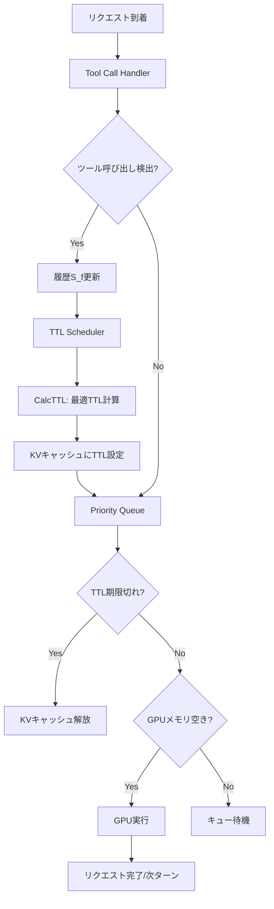

## 論文概要（Abstract）

本記事は [Continuum: Efficient and Robust Multi-Turn LLM Agent Scheduling with KV Cache Time-to-Live](https://arxiv.org/abs/2511.02230) の解説記事です。

マルチターンLLMエージェントがツール呼び出しを行う際、推論エンジンはGPUメモリ上のKVキャッシュを即座に解放してしまう。再開時にはPrefillの再計算が必要となり、ターン数に比例してオーバーヘッドが蓄積する。Continuumは、KVキャッシュに「Time-to-Live（TTL）」を設定し、再ロードコストとキューイング遅延を統合的にモデル化することで最適な保持時間を算出するスケジューラである。著者らは、SWE-Bench・BFCL・OpenHandの各ベンチマークにおいて、ジョブ完了時間を最大8.18倍改善したと報告している。

この記事は [Zenn記事: OpenAI・Anthropic・Gemini会話管理パターン比較と統一設計](https://zenn.dev/0h_n0/articles/a2ff7f18b0266b) の深掘りです。Zenn記事で扱った各プロバイダのキャッシュ機構のTTL設計と、本論文の推論エンジンレベルでのTTL最適化は、異なるレイヤーで同じ課題に取り組んでいる。

## 情報源

- **arXiv ID**: 2511.02230
- **URL**: [https://arxiv.org/abs/2511.02230](https://arxiv.org/abs/2511.02230)
- **著者**: Hanchen Li, Runyuan He, Qiuyang Mang, et al.（UC Berkeley, Ion Stoica研究室）
- **発表年**: 2025年（v6: 2026年5月25日）
- **分野**: cs.OS, cs.AI, cs.NI
- **ライセンス**: CC BY 4.0

## 背景と動機（Background & Motivation）

ReActパターンに代表されるLLMエージェントは、「推論 → ツール呼び出し → 結果取得 → 推論再開」のサイクルを繰り返す。このとき、ツール呼び出し中（数百ミリ秒から数秒）にLLM推論は一時停止するが、既存の推論エンジン（vLLM, SGLang等）はリクエスト完了とみなしてKVキャッシュを解放してしまう。

この解放により2つのコストが生じる。第一に、再開時のPrefill再計算コスト（Reload Cost）である。KVキャッシュが失われると、過去の全トークンを再処理する必要がある。第二に、ターンごとのキューイング遅延（Queueing Delay）である。解放されたメモリを他のリクエストが占有するため、再開時にキューで待機する時間が発生する。著者らは、この2つのコストがターン数に比例して蓄積し、10ターン超のエージェントワークロードではレイテンシが数倍に膨らむことを実験的に示している。

InferCeptのような先行研究はKVキャッシュの保持を試みたが、キューイング遅延の蓄積を考慮していなかった。Continuumは、再ロードコストとキューイング遅延の両方を統合したコストモデルに基づき、TTLを動的に計算する点で差別化される。

## 主要な貢献（Key Contributions）

- **TTLベースのKVキャッシュ管理**: ツール呼び出し中にKVキャッシュを即座に解放せず、最適な保持時間（TTL）を計算して設定するメカニズムを提案
- **統合コストモデル**: Prefill再ロードコストとキューイング遅延を同時に最小化する数理モデルを定式化。「memoryfulness factor（$\eta$）」を導入し、ワークロードの特性を定量化
- **コールドスタート対応**: ツール呼び出し履歴が少ない場合の三段階フォールバック戦略を設計
- **実エージェントベンチマークでの検証**: SWE-Bench（500タスク）、BFCL V4、OpenHandで評価し、vLLMに対して最大8.18倍のジョブ完了時間改善を達成
- **大規模モデルへの適用**: Llama-3.1（8B/70B）、Gemma-3 12B、GLM-4.5 355Bの4モデル・3種のGPU（A100, H100, B200）で動作を確認

## 技術的詳細（Technical Details）

### TTL計算の最適化問題

Continuumの中核は、リクエスト$r$に対する最適TTL $\tau^*$を求める最適化問題である。著者らは以下のように定式化している。

$$
\tau^* = \arg\max_{\tau} \; P(\tau, f) \times \text{Benefit}(r) - \text{Cost}(\tau, r)
$$

ここで各項の意味は次の通りである。

**Benefit（キャッシュヒットの利得）**は、Prefill再ロードコストとキューイング遅延回避の合計である。

$$
\text{Benefit}(r) = T \cdot \eta + \text{PrefillReload}(r)
$$

- $T$: 平均キューイング遅延
- $\eta$: memoryfulness factor（後述）
- $\text{PrefillReload}(r)$: リクエスト$r$のKVキャッシュを再計算するコスト

**Cost（キャッシュ保持のコスト）**は、GPUメモリの占有コストである。

$$
\text{Cost}(\tau, r) = \frac{\text{MemUsage}(r)}{M} \times \tau
$$

- $M$: リクエストあたりの平均GPUメモリ使用量

**$P(\tau, f)$（キャッシュヒット確率）**は、ツール$f$の呼び出しが時間$\tau$以内に完了する確率であり、過去の履歴$S[f]$から経験的CDFとして推定する。

$$
P(\tau, f) = \frac{1}{|S[f]|} \sum_{t \in S[f]} \mathbb{1}[t \leq \tau]
$$

### Memoryfulness Factor（$\eta$）

著者らが提案する$\eta$は、マルチターンワークロードの「記憶性」を定量化する指標である。

$$
\eta = -\text{Corr}(k, N-k)
$$

- $k$: 現在までのターン数
- $N-k$: 残りターン数

$\eta = 0$の場合はmemoryless（残りターン数が現在のターン数と無関係、指数分布的）、$\eta = 1$の場合はmemoryful（総ターン数が固定で、進行に伴い残りが減少）を意味する。この値によってキューイング遅延の見積もりが変化し、TTLの長さに影響する。従来のInferCeptはこの概念を持たず、キューイング遅延の蓄積を過小評価していたと著者らは指摘している。

### コールドスタート対応

ツール呼び出し履歴が不十分な場合の三段階フォールバック戦略が設計されている。

1. $\|S[f]\| \leq 100$: デフォルトTTL（指数分布、$\eta = 1$）を使用
2. $\|S\| \leq 100$（全ツール合計）: グローバルなツール呼び出し分布を使用
3. それ以外: ツールごとの精緻な推定を適用

### スケジューラアーキテクチャ



システムは3つのモジュールで構成される。**Tool Call Handler**がツール呼び出しを検出し履歴を記録、**TTL Scheduler**がコストモデルに基づきTTLを計算してKVキャッシュをピン留め、**Priority Queue**がプリエンプション状態・TTL状態・FCFS順に基づく多キー優先度でリクエストをスケジューリングする。スケジューラのオーバーヘッドは論文Table 4より約2.3ms（CPUオフロード時）と報告されており、GPU実行時間に対して無視できる水準である。

## 実装のポイント

TTLベースのKVキャッシュ管理の基本的な考え方を、Pythonの疑似実装で示す。実際のContinuumはC++/CUDAで実装されているが、コアロジックの構造は以下の通りである。

```python
from dataclasses import dataclass
from typing import Dict, List
import time
import math


@dataclass
class ToolCallRecord:
    tool_name: str
    duration_ms: float
    timestamp: float


@dataclass
class CacheEntry:
    request_id: str
    memory_usage_bytes: int
    ttl_expires_at: float
    kv_cache_ref: object  # GPU上のKVキャッシュへの参照


class TTLScheduler:
    """ContinuumのTTLスケジューラの概念実装."""

    def __init__(self, avg_memory_per_request: int) -> None:
        self.tool_history: Dict[str, List[float]] = {}
        self.cache_entries: Dict[str, CacheEntry] = {}
        self.avg_memory = avg_memory_per_request

    def record_tool_call(self, tool_name: str, duration_ms: float) -> None:
        """ツール呼び出しの所要時間を履歴に記録."""
        if tool_name not in self.tool_history:
            self.tool_history[tool_name] = []
        self.tool_history[tool_name].append(duration_ms)

    def calc_hit_probability(self, tool_name: str, tau_ms: float) -> float:
        """経験的CDFからキャッシュヒット確率を計算."""
        history = self.tool_history.get(tool_name, [])
        if len(history) < 100:
            # コールドスタート: 指数分布でフォールバック
            lambda_param = 1.0 / 2000.0  # デフォルト2秒
            return 1.0 - math.exp(-lambda_param * tau_ms)
        return sum(1 for t in history if t <= tau_ms) / len(history)

    def calc_ttl(
        self,
        request_id: str,
        tool_name: str,
        memory_usage: int,
        prefill_reload_ms: float,
        avg_queue_delay_ms: float,
        eta: float = 0.5,
    ) -> float:
        """最適TTLを計算（論文 Equation 1-2 の簡略実装）."""
        best_tau = 0.0
        best_value = float("-inf")

        for tau_ms in range(100, 30001, 100):
            p_hit = self.calc_hit_probability(tool_name, tau_ms)
            benefit = p_hit * (avg_queue_delay_ms * eta + prefill_reload_ms)
            cost = (memory_usage / self.avg_memory) * tau_ms
            value = benefit - cost
            if value > best_value:
                best_value = value
                best_tau = tau_ms

        return best_tau if best_value > 0 else 0.0
```

この実装では、`calc_ttl`が論文の最適化問題を離散探索で近似している。実際のContinuumでは連続最適化と効率的なデータ構造が使われている。

## Production Deployment Guide

KVキャッシュTTL管理を組み込んだLLM推論サービスをAWS上に構築するための実装パターンを示す。本ガイドは論文の知見をプロダクション環境に適用する際の参考として記載するものであり、論文著者らが推奨する構成ではない点に留意されたい。

### AWS実装パターン

#### Small構成（開発・検証用）

| リソース | スペック | 月額概算 |
|---------|---------|---------|
| SageMaker Endpoint | ml.g5.2xlarge (A10G 24GB) x1 | $1,200 |
| Lambda (オーケストレータ) | 512MB, 30秒タイムアウト | $50 |
| ElastiCache Redis | cache.t3.medium | $70 |
| CloudWatch | メトリクス+ログ | $30 |
| **合計** | | **約$1,350/月** |

- 単一GPU、8Bクラスモデル向け
- RedisでTTL状態とツール呼び出し履歴を管理
- Lambdaがエージェントのターン間オーケストレーションを担当

#### Medium構成（本番・中規模）

| リソース | スペック | 月額概算 |
|---------|---------|---------|
| ECS Fargate (推論) | GPU対応タスク x2-4 | $3,500 |
| EC2 (GPUインスタンス) | g5.12xlarge x2 | $8,400 |
| ALB | リクエストルーティング | $200 |
| ElastiCache Redis Cluster | cache.r6g.large x3 | $600 |
| S3 | モデル重み・ログ保存 | $100 |
| CloudWatch + X-Ray | 監視・トレーシング | $150 |
| **合計** | | **約$12,950/月** |

#### Large構成（本番・大規模）

| リソース | スペック | 月額概算 |
|---------|---------|---------|
| EKS クラスタ | コントロールプレーン | $75 |
| EC2 GPU Nodes | p4d.24xlarge (A100x8) x2 | $48,000 |
| EC2 CPU Nodes | c6i.4xlarge x4 (KVキャッシュオフロード) | $2,000 |
| NVMe Instance Storage | KVキャッシュSSDオフロード用 | 含む |
| ALB + NLB | L7/L4ルーティング | $400 |
| ElastiCache Redis Cluster | cache.r6g.xlarge x6 | $2,400 |
| S3 + EFS | モデル重み・共有ストレージ | $300 |
| CloudWatch + X-Ray + Grafana | 統合監視 | $500 |
| **合計** | | **約$53,675/月** |

### Terraformコード（Small構成）

```hcl
# small_inference_stack.tf
# KVキャッシュTTL管理付きLLM推論 - Small構成

terraform {
  required_version = ">= 1.5"
  required_providers {
    aws = { source = "hashicorp/aws", version = "~> 5.0" }
  }
}

variable "model_s3_uri" {
  description = "S3上のモデルアーティファクトURI"
  type        = string
}

variable "environment" {
  description = "デプロイ環境"
  type        = string
  default     = "dev"
}

# --- SageMaker Endpoint (GPU推論) ---
resource "aws_sagemaker_model" "llm_model" {
  name               = "continuum-llm-${var.environment}"
  execution_role_arn = aws_iam_role.sagemaker_role.arn

  primary_container {
    image          = "763104351884.dkr.ecr.us-east-1.amazonaws.com/djl-inference:0.28.0-lmi11.0.0-cu124"
    model_data_url = var.model_s3_uri
    environment = {
      OPTION_MODEL_ID          = var.model_s3_uri
      OPTION_TENSOR_PARALLEL   = "1"
      OPTION_MAX_MODEL_LEN     = "8192"
      OPTION_GPU_MEMORY_UTILIZATION = "0.85"
      # TTL関連設定
      CONTINUUM_TTL_ENABLED    = "true"
      CONTINUUM_DEFAULT_TTL_MS = "5000"
      CONTINUUM_ETA_DEFAULT    = "0.5"
    }
  }
}

resource "aws_sagemaker_endpoint_configuration" "llm_config" {
  name = "continuum-config-${var.environment}"
  production_variants {
    variant_name           = "primary"
    model_name             = aws_sagemaker_model.llm_model.name
    instance_type          = "ml.g5.2xlarge"
    initial_instance_count = 1
  }
}

resource "aws_sagemaker_endpoint" "llm_endpoint" {
  name                 = "continuum-endpoint-${var.environment}"
  endpoint_config_name = aws_sagemaker_endpoint_configuration.llm_config.name
}

# --- ElastiCache Redis (TTL状態管理) ---
resource "aws_elasticache_cluster" "ttl_state" {
  cluster_id           = "continuum-ttl-${var.environment}"
  engine               = "redis"
  node_type            = "cache.t3.medium"
  num_cache_nodes      = 1
  port                 = 6379
  parameter_group_name = "default.redis7"
  subnet_group_name    = aws_elasticache_subnet_group.main.name
  security_group_ids   = [aws_security_group.redis_sg.id]
}

# --- Lambda (エージェントオーケストレータ) ---
resource "aws_lambda_function" "agent_orchestrator" {
  function_name = "continuum-orchestrator-${var.environment}"
  runtime       = "python3.12"
  handler       = "handler.lambda_handler"
  memory_size   = 512
  timeout       = 30

  environment {
    variables = {
      SAGEMAKER_ENDPOINT = aws_sagemaker_endpoint.llm_endpoint.name
      REDIS_HOST         = aws_elasticache_cluster.ttl_state.cache_nodes[0].address
      TTL_DEFAULT_MS     = "5000"
    }
  }

  filename         = "lambda_package.zip"
  source_code_hash = filebase64sha256("lambda_package.zip")
  role             = aws_iam_role.lambda_role.arn
}
```

### Terraformコード（Large構成 - EKS）

```hcl
# large_eks_inference.tf
# KVキャッシュTTL管理付きLLM推論 - Large構成

# --- EKS Cluster ---
module "eks" {
  source          = "terraform-aws-modules/eks/aws"
  version         = "~> 20.0"
  cluster_name    = "continuum-${var.environment}"
  cluster_version = "1.30"
  vpc_id          = module.vpc.vpc_id
  subnet_ids      = module.vpc.private_subnets

  eks_managed_node_groups = {
    gpu_nodes = {
      instance_types = ["p4d.24xlarge"]
      min_size       = 1
      max_size       = 4
      desired_size   = 2
      labels         = { "nvidia.com/gpu" = "true", role = "inference" }
      taints = [{
        key    = "nvidia.com/gpu"
        value  = "true"
        effect = "NO_SCHEDULE"
      }]
    }
    cpu_offload_nodes = {
      instance_types = ["c6i.4xlarge"]
      min_size       = 2
      max_size       = 8
      desired_size   = 4
      labels         = { role = "kv-cache-offload" }
    }
  }
}

# --- GPU Node向けKubernetes Deployment ---
resource "kubernetes_deployment" "inference_server" {
  metadata {
    name      = "continuum-inference"
    namespace = "llm-serving"
  }
  spec {
    replicas = 2
    selector { match_labels = { app = "continuum-inference" } }
    template {
      metadata { labels = { app = "continuum-inference" } }
      spec {
        node_selector = { role = "inference" }
        toleration {
          key      = "nvidia.com/gpu"
          operator = "Exists"
          effect   = "NoSchedule"
        }
        container {
          name  = "inference"
          image = "continuum-server:latest"
          resources {
            limits   = { "nvidia.com/gpu" = "8" }
            requests = { memory = "128Gi", cpu = "32" }
          }
          env {
            name  = "CONTINUUM_TTL_ENABLED"
            value = "true"
          }
          env {
            name  = "CONTINUUM_CPU_OFFLOAD_ENABLED"
            value = "true"
          }
          env {
            name  = "CONTINUUM_SSD_OFFLOAD_PATH"
            value = "/mnt/nvme/kv-cache"
          }
          volume_mount {
            name       = "nvme-storage"
            mount_path = "/mnt/nvme"
          }
        }
        volume {
          name = "nvme-storage"
          host_path { path = "/mnt/nvme" }
        }
      }
    }
  }
}
```

### 運用・監視設定

```hcl
# monitoring.tf
# CloudWatch + X-Ray 監視設定

resource "aws_cloudwatch_metric_alarm" "ttl_hit_rate" {
  alarm_name          = "continuum-ttl-hit-rate-low"
  comparison_operator = "LessThanThreshold"
  evaluation_periods  = 3
  metric_name         = "TTLCacheHitRate"
  namespace           = "Continuum/Inference"
  period              = 300
  statistic           = "Average"
  threshold           = 0.6
  alarm_description   = "TTLキャッシュヒット率が60%を下回った場合にアラート"
  alarm_actions       = [aws_sns_topic.alerts.arn]
}

resource "aws_cloudwatch_metric_alarm" "gpu_memory_pressure" {
  alarm_name          = "continuum-gpu-memory-high"
  comparison_operator = "GreaterThanThreshold"
  evaluation_periods  = 2
  metric_name         = "GPUMemoryUtilization"
  namespace           = "Continuum/Inference"
  period              = 60
  statistic           = "Average"
  threshold           = 90
  alarm_description   = "GPUメモリ使用率が90%を超えた場合にアラート"
  alarm_actions       = [aws_sns_topic.alerts.arn]
}

resource "aws_cloudwatch_dashboard" "continuum" {
  dashboard_name = "continuum-${var.environment}"
  dashboard_body = jsonencode({
    widgets = [
      {
        type   = "metric"
        properties = {
          title   = "TTL Cache Hit Rate"
          metrics = [["Continuum/Inference", "TTLCacheHitRate"]]
          period  = 300
        }
      },
      {
        type   = "metric"
        properties = {
          title   = "Avg Job Completion Time (ms)"
          metrics = [["Continuum/Inference", "JobCompletionTime", "Stat", "Average"]]
          period  = 300
        }
      },
      {
        type   = "metric"
        properties = {
          title   = "GPU Memory Utilization %"
          metrics = [["Continuum/Inference", "GPUMemoryUtilization"]]
          period  = 60
        }
      },
      {
        type   = "metric"
        properties = {
          title   = "Queue Depth"
          metrics = [["Continuum/Inference", "QueueDepth"]]
          period  = 60
        }
      }
    ]
  })
}
```

### コスト最適化チェックリスト

1. **GPUインスタンス選定**: ワークロードに応じてg5（A10G）/ p4d（A100）/ p5（H100）を選択
2. **Savings Plans活用**: 1年/3年のCompute Savings Plansで最大60%削減
3. **スポットインスタンス**: 開発・バッチ推論にはスポットを活用（推論サービスには非推奨）
4. **TTLデフォルト値の調整**: ワークロード分析に基づきデフォルトTTLを最適化
5. **$\eta$パラメータのチューニング**: エージェントの平均ターン数からmemoryfulness factorを調整
6. **CPUオフロード比率**: GPU:CPU DRAMの最適比率を測定（論文では100-200GB DRAM推奨）
7. **SSDオフロード層の追加**: NVMeインスタンスストレージでコールドKVキャッシュを階層化
8. **バッチサイズ最適化**: 論文の感度分析に基づき256-4096の範囲で調整
9. **Auto Scaling設定**: キュー深度ベースのスケーリングポリシーを設定
10. **Redis接続プーリング**: TTL状態管理のRedis接続数を最適化
11. **CloudWatch Log Insights**: 不要なログの除外でコスト削減
12. **X-Rayサンプリングレート**: 本番は5-10%に設定
13. **EBSボリューム最適化**: モデル重みはgp3（IOPS指定）でコスト削減
14. **S3ストレージクラス**: ログはS3 Intelligent-Tieringに移行
15. **Reserved Capacity**: SageMakerエンドポイントのリザーブドキャパシティ活用
16. **マルチAZ配置の最適化**: 推論レイテンシ要件に基づきAZ数を決定
17. **NAT Gatewayコスト**: VPCエンドポイントでS3/DynamoDBへの通信コスト削減
18. **GPUメモリ使用率閾値**: 85-90%を目標に`gpu_memory_utilization`を設定
19. **モデル量子化**: INT8/FP8量子化でGPUメモリ使用量を半減
20. **Graviton活用**: CPU処理（オーケストレータ、前処理）にはGravitonインスタンスを使用
21. **Cost Explorerタグ戦略**: 推論/オフロード/監視のコストを分離追跡
22. **Karpenter導入**: EKSではKarpenterによるGPUノードの効率的なプロビジョニング

## 実験結果（Experimental Results）

著者らは、3つのエージェントベンチマークと4つのモデルで評価を行っている。

### 主要ベンチマーク結果

| ベンチマーク | 設定 | vLLM比 改善倍率 | InferCept比 改善倍率 |
|------------|------|:--------------:|:------------------:|
| SWE-Bench (Llama-8B, B200) | 単一GPU | 約2x | 1.12x-3.66x |
| SWE-Bench (実タスク500件, H100) | Tensormesh | **最大8.18x** | - |
| BFCL V4 Web Search | Llama-8B | 有意な改善 | 有意な改善 |
| OpenHand (Llama-8B, H100) | P90/P95 | 改善 | 改善 |

### ワークロード特性

| ベンチマーク | 平均ターン数 | 平均ツール呼び出し時間 | プログラムあたりトークン数 |
|------------|:----------:|:------------------:|:---------------------:|
| BFCL V4 | 6.3 (+-2.3) | 1,923ms (+-2,133ms) | 93,256 (+-68,687) |
| SWE-Bench | 10.9 (+-2.1) | 925ms (+-3,550ms) | 70,126 (+-19,732) |

### RL Rolloutスループット（論文Table 5より）

GLM-4.5 355Bモデル、8x H100構成での比較として、vLLMが93.4 steps/minに対し、Continuumは144.9 steps/minを達成したと報告されている（約1.55倍）。

### 感度分析

著者らは、バッチサイズを256から4096まで変化させた場合でも安定した改善が得られること、ターン数を1倍から5倍にスケールした場合にベースラインの性能が急激に劣化する一方でContinuumは低レイテンシを維持することを示している。スケジューラのオーバーヘッドは約2.3ms（CPUオフロード時、論文Table 4より）であり、GPU実行時間に対して無視できる水準である。

## 実運用への応用

Continuumの知見は、以下の実運用シナリオで特に有効と考えられる。

**LLMエージェントサービス**: SWE-agent、Devin、OpenHandsのようなコーディングエージェントでは、ファイル操作やテスト実行などのツール呼び出しが頻発する。TTLベースのKVキャッシュ管理により、ターンごとの蓄積遅延を大幅に削減できる可能性がある。

**マルチテナント推論基盤**: 複数のエージェントが同一GPUクラスタを共有する環境では、KVキャッシュの保持と解放のトレードオフが重要になる。Continuumのコストモデルは、テナント間の公平性を保ちつつメモリ効率を最適化する枠組みを提供する。

**RL学習ループ**: 強化学習のrollout生成においても、環境との対話中にKVキャッシュを保持することでスループットが向上する。論文の実験では、GLM-4.5でのRL rolloutで約1.55倍のスループット改善が報告されている。

Zenn記事で解説した各プロバイダのAPI側TTL（Anthropicの5分、OpenAIのセッション管理等）は、推論エンジン側のTTL管理と組み合わせることで、エンドツーエンドでのキャッシュ最適化が実現し得る。

## 関連研究

著者らは、以下の分類で関連研究を整理している。**LLM推論システム**（vLLM, SGLang, LMCache）はPagedAttentionやRadixAttentionでメモリ管理を改善したが、マルチターンエージェント向けのTTL管理は行っていない。**静的ワークフロースケジューラ**（Teola, Alto, Parrot）はDAGベースの事前計画を前提とし、動的なエージェントワークロードには対応していない。**エージェントスケジューラ**（Autellix, Tempo）はエージェント向けに設計されているが、ツール呼び出し時間の分布変動やキューイング遅延の蓄積を考慮していない。Continuumは、分散システムにおけるTTLの概念（DNS, CDN）をLLM推論に適用した点に新規性がある。

## まとめと今後の展望

Continuumは、マルチターンLLMエージェントにおけるKVキャッシュ管理の課題に対し、TTLメカニズムという明快なアプローチで取り組んだ研究である。再ロードコストとキューイング遅延を統合したコストモデル、memoryfulness factorによるワークロード特性の定量化は、実用的な貢献として評価できる。

一方で、著者らも認めるように、ツール呼び出し時間の分布が安定しているという仮定に依存しており、分布シフトへの対応は今後の課題である。また、ReActパターンの逐次的なエージェントに最適化されており、非同期・分岐型のワークフロー（複数ツールの並列呼び出し等）への拡張も今後の検討事項とされている。

## 参考文献

1. Li, H., He, R., Mang, Q., et al. "Continuum: Efficient and Robust Multi-Turn LLM Agent Scheduling with KV Cache Time-to-Live." arXiv:2511.02230v6, 2026.
2. Kwon, W., et al. "Efficient Memory Management for Large Language Model Serving with PagedAttention." SOSP 2023.
3. Zheng, L., et al. "SGLang: Efficient Execution of Structured Language Model Programs." arXiv:2312.07104, 2023.
4. Reiser, M., et al. "InferCept: Efficient Intercept Support for Augmented-LLM Inference." ICML 2024.
5. Pan, Z., et al. "Autellix: An Efficient Serving Engine for LLM Agents as General Programs." arXiv, 2025.
