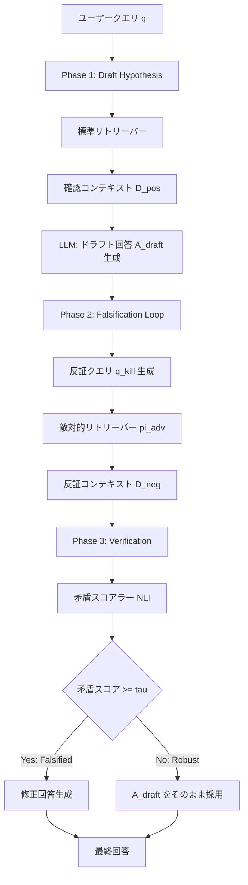

本記事は [FVA-RAG: Falsification-Verification Alignment for Mitigating Sycophantic Hallucinations](https://arxiv.org/abs/2512.07015) の解説記事です。

## 論文概要（Abstract）

RAGシステムは検索されたコンテキストに過度に追従する「検索追従性（retrieval sycophancy）」を示すことがある。ユーザーの前提に合致する証拠を優先的に検索・採用し、反証となる情報を無視する確認バイアスの問題である。FVA-RAGは、Karl Popperの反証主義に着想を得た3段階パイプラインでこの問題に対処する。初期回答をドラフト仮説として扱い、敵対的リトリーバーが反証コンテキストを明示的に検索し、矛盾スコアラーが仮説の棄却・採択を判定する。TruthfulQA-Generationベンチマーク（817問）で79.80%の精度を達成し、CRAGの71.36%を8.44ポイント上回ったと著者は報告している。

この記事は [Zenn記事: Gemini 3.5 Flash×CRAGで社内検索の誤回答を検索評価ループで削減する](https://zenn.dev/0h_n0/articles/798fe16c7d13cd) の深掘りです。

## 情報源

- **arXiv ID**: 2512.07015
- **URL**: [arXiv:2512.07015](https://arxiv.org/abs/2512.07015)
- **著者**: Mayank Ravishankara
- **発表年**: 2025年12月（v2: 2025年12月25日）
- **分野**: cs.CL, cs.AI, cs.IR

## 背景と動機（Background & Motivation）

標準的なRAGパイプラインでは、ユーザークエリに対してベクトル検索で関連文書を取得し、それをコンテキストとしてLLMに渡して回答を生成する。この設計には根本的な問題がある。検索エンジンがクエリの前提に沿った文書を優先的に返すため、LLMは誤った前提であっても検索結果に追従した回答を生成してしまう。これが「検索追従性（retrieval sycophancy）」である。

CRAGは検索結果の品質を評価するループを導入したが、評価の対象は「検索結果がクエリに関連するか」であり、「検索結果が事実として正しいか」ではない。つまり、関連性が高いが事実に反する文書が検索された場合、CRAGはそれを「正しい」と判定してしまう可能性がある。

FVA-RAGの著者は、この問題をKarl Popperの反証主義の観点から捉え直している。科学的仮説は「確認」ではなく「反証の試みに耐えること」で強化される。同様に、RAGの回答も反証的な証拠に晒されることで信頼性が担保されるという着想である。

## 主要な貢献（Key Contributions）

- **反証検索パイプライン**: 初期回答を仮説として扱い、敵対的リトリーバーが反証コンテキストを明示的に検索する3段階アーキテクチャ
- **矛盾スコアリング**: cross-encoder/nli-deberta-v3-largeを用いたNLIベースの矛盾検出により、仮説の棄却・採択を閾値ベースで判定
- **Frozen-corpus評価プロトコル**: 再現性を保証するためにコーパスを固定し、SHA256ハッシュで検証可能にした実験設計
- **統計的有意性の実証**: McNemar検定でSelf-RAG（$p = 3.41 \times 10^{-6}$）およびCRAG（$p = 1.30 \times 10^{-4}$）に対する有意な改善を確認

## 技術的詳細（Technical Details）

### 3段階アーキテクチャ

FVA-RAGのパイプラインは3つのフェーズで構成される。



### Phase 1: Draft Hypothesis（仮説生成）

標準的なRAGと同様に、ユーザークエリ $q$ に対して確認的なコンテキスト $D_{\text{pos}}$ を検索し、初期回答 $A_{\text{draft}}$ を生成する。

$$
D_{\text{pos}} = \text{Retrieve}(q, \mathcal{C}, k)
$$

$$
A_{\text{draft}} = \text{LLM}(q, D_{\text{pos}})
$$

ここで、
- $q$: ユーザークエリ
- $\mathcal{C}$: ドキュメントコーパス
- $k$: 検索件数（論文では $k = 3$）

この段階では意図的に確認バイアスを許容する。ドラフトはあくまで「仮説」であり、次のフェーズで反証される可能性がある。

### Phase 2: Falsification Loop（反証ループ）

ドラフト回答に対する反証クエリ $q_{\text{kill}}$ を生成し、敵対的リトリーバー $\pi_{\text{adv}}$ が反証コンテキストを検索する。

$$
q_{\text{kill}} = \text{LLM}_{\text{query}}(A_{\text{draft}}, q)
$$

$$
D_{\text{neg}} = \pi_{\text{adv}}(A_{\text{draft}}, q_{\text{kill}}, \mathcal{C}, k)
$$

反証クエリの生成では、ドラフト回答の主要な主張を否定する方向でクエリを構築する。例えば、ドラフトが「ビタミンCは風邪を予防する」と主張する場合、反証クエリは「ビタミンC 風邪予防 効果なし エビデンス」のような形になる。

敵対的リトリーバー $\pi_{\text{adv}}$ は、ドラフト回答と反証クエリの両方を考慮して検索を行う。論文ではBAIL/bge-m3による密ベクトル検索とBM25のハイブリッド検索を採用している。

### Phase 3: Verification and Revision（検証と修正）

矛盾スコアラーが反証コンテキスト $D_{\text{neg}}$ とドラフト回答 $A_{\text{draft}}$ の矛盾度を評価する。

$$
s_{\text{contra}} = \text{NLI}(A_{\text{draft}}, D_{\text{neg}})
$$

$$
\text{Decision} =
\begin{cases}
\text{Robust} & \text{if } s_{\text{contra}} < \tau \\
\text{Falsified} & \text{if } s_{\text{contra}} \geq \tau
\end{cases}
$$

ここで、
- $s_{\text{contra}}$: 矛盾スコア（0-1の範囲、1が最大矛盾）
- $\tau$: 閾値（論文では $\tau = 0.5$）
- NLI: Natural Language Inference（cross-encoder/nli-deberta-v3-large）

Falsifiedと判定された場合、元のコンテキスト $D_{\text{pos}}$ と反証コンテキスト $D_{\text{neg}}$ の両方を用いて修正回答を生成する。

$$
A_{\text{final}} =
\begin{cases}
A_{\text{draft}} & \text{if Robust} \\
\text{LLM}(q, D_{\text{pos}}, D_{\text{neg}}, A_{\text{draft}}) & \text{if Falsified}
\end{cases}
$$

### アルゴリズム

```python
from dataclasses import dataclass
from typing import List

@dataclass
class FVAResult:
    """FVA-RAG pipeline result"""
    answer: str
    is_falsified: bool
    contradiction_score: float
    draft_answer: str

def fva_rag_pipeline(
    query: str,
    corpus: List[str],
    retriever: HybridRetriever,
    llm: LLM,
    nli_scorer: NLIScorer,
    k: int = 3,
    tau: float = 0.5,
) -> FVAResult:
    """FVA-RAG 3-phase pipeline

    Args:
        query: User query
        corpus: Document corpus
        retriever: Hybrid retriever (dense + BM25)
        llm: Language model for generation
        nli_scorer: NLI-based contradiction scorer
        k: Number of documents to retrieve
        tau: Contradiction threshold

    Returns:
        FVAResult with final answer and metadata
    """
    # Phase 1: Draft Hypothesis
    d_pos = retriever.retrieve(query, corpus, k=k)
    a_draft = llm.generate(query, context=d_pos)

    # Phase 2: Falsification Loop
    q_kill = llm.generate_falsification_query(a_draft, query)
    d_neg = retriever.retrieve_adversarial(
        a_draft, q_kill, corpus, k=k
    )

    # Phase 3: Verification and Revision
    s_contra = nli_scorer.score(a_draft, d_neg)

    if s_contra >= tau:
        # Falsified: revise with both contexts
        a_final = llm.generate_revised(
            query, d_pos, d_neg, a_draft
        )
        return FVAResult(
            answer=a_final,
            is_falsified=True,
            contradiction_score=s_contra,
            draft_answer=a_draft,
        )
    else:
        # Robust: keep draft
        return FVAResult(
            answer=a_draft,
            is_falsified=False,
            contradiction_score=s_contra,
            draft_answer=a_draft,
        )
```

### 矛盾スコアリングの詳細

矛盾スコアリングにはcross-encoder/nli-deberta-v3-largeを使用する。このモデルはNatural Language Inference（NLI）タスクで訓練されており、2つのテキスト間の関係を「含意（entailment）」「中立（neutral）」「矛盾（contradiction）」の3クラスで分類する。

```python
from transformers import AutoModelForSequenceClassification, AutoTokenizer
import torch

class NLIContradictionScorer:
    """NLI-based contradiction scorer using DeBERTa-v3

    Uses cross-encoder/nli-deberta-v3-large to compute
    contradiction probability between draft answer and
    counter-evidence.
    """

    def __init__(self, model_name: str = "cross-encoder/nli-deberta-v3-large"):
        self.tokenizer = AutoTokenizer.from_pretrained(model_name)
        self.model = AutoModelForSequenceClassification.from_pretrained(
            model_name
        )
        # Label mapping: 0=contradiction, 1=entailment, 2=neutral
        self.contradiction_idx = 0

    def score(self, premise: str, hypothesis: str) -> float:
        """Compute contradiction score

        Args:
            premise: Draft answer text
            hypothesis: Counter-evidence text

        Returns:
            Contradiction probability (0.0 to 1.0)
        """
        inputs = self.tokenizer(
            premise, hypothesis,
            return_tensors="pt",
            truncation=True,
            max_length=512,
        )
        with torch.no_grad():
            logits = self.model(**inputs).logits
        probs = torch.softmax(logits, dim=-1)
        return probs[0, self.contradiction_idx].item()
```

FVA-RAGでは、反証コンテキスト $D_{\text{neg}}$ の各文書とドラフト回答の間で矛盾スコアを計算し、最大値を採用する。これにより、1つでも強い反証が見つかれば仮説が棄却される。

## 実装のポイント（Implementation）

### 検索エンジンの構成

著者はBAIL/bge-m3による密ベクトル検索とBM25のハイブリッド検索を採用している。密ベクトル検索はセマンティックな類似性を、BM25はキーワードの一致を捉えるため、両者の併用により反証クエリに対する検索精度が向上する。検索件数は $k = 3$ に固定されている。

### 閾値の選定

矛盾スコアの閾値 $\tau = 0.5$ は、論文中で明示的なチューニング過程は報告されていない。ただし、実験結果からこの閾値で24.5%〜29.3%のクエリに対して介入（Falsification）が発生しており、介入率が過度に高くも低くもないバランスを示していると著者は述べている。

### 介入率の制御

介入率が高すぎるとレイテンシが増大し、低すぎると確認バイアスの抑制効果が薄れる。実運用では、ドメインごとに閾値 $\tau$ を調整する必要がある。例えば、医療・法務などの高リスクドメインでは閾値を低めに設定し、積極的に反証検索を行うことが考えられる。

### 計算コスト

FVA-RAGはPhase 2-3で追加のリトリーバル呼び出しとNLI推論を行うため、標準RAGと比較してレイテンシが増加する。著者はこの点を限界として認めている。ただし、介入が必要なクエリは全体の24.5〜29.3%であり、大多数のクエリではPhase 3でRobustと判定されるため、修正回答の生成コストは限定的である。

## Production Deployment Guide

### AWS実装パターン（コスト最適化重視）

FVA-RAGの本番環境構築には、検索エンジン、NLIモデル推論、LLM呼び出しの3要素を組み合わせる必要がある。以下はトラフィック量別の推奨構成である。

**コスト試算の注意**: 以下は2026年7月時点のAWS ap-northeast-1（東京）リージョン料金に基づく概算値である。実際のコストはトラフィックパターン、リージョン、バースト使用量により変動する。最新料金はAWS料金計算ツールで確認を推奨する。

| 構成 | トラフィック | 主要サービス | 月額概算 |
|------|-------------|-------------|---------|
| Small | ~100 req/日 | Lambda + Bedrock + OpenSearch Serverless | $120-200 |
| Medium | ~1,000 req/日 | ECS Fargate + Bedrock + OpenSearch | $500-900 |
| Large | 10,000+ req/日 | EKS + Spot + SageMaker Endpoint + OpenSearch | $2,500-5,000 |

**Small構成の内訳**:
- Lambda（検索・NLI推論・オーケストレーション）: $5-15/月
- Bedrock Claude/GPT-4o（LLM呼び出し、Phase 1 + Phase 2 + Phase 3修正）: $60-100/月
- OpenSearch Serverless（ハイブリッド検索、bge-m3 + BM25）: $50-80/月
- DynamoDB（キャッシュ・ログ）: $5/月

**コスト削減テクニック**:
- Bedrock Batch APIで非リアルタイム処理を50%削減
- Prompt Cachingで反復パターンの入力トークンを30-90%削減
- NLIモデルはSageMaker Serverless Inferenceで非ピーク時のコストを削減
- Spot Instances活用でEKSワーカーノードを最大90%削減

### Terraformインフラコード

**Small構成（Serverless）**:

```hcl
# VPC基盤（NAT Gateway不使用でコスト削減）
module "vpc" {
  source  = "terraform-aws-modules/vpc/aws"
  version = "~> 5.0"

  name = "fva-rag-vpc"
  cidr = "10.0.0.0/16"

  azs             = ["ap-northeast-1a", "ap-northeast-1c"]
  private_subnets = ["10.0.1.0/24", "10.0.2.0/24"]
  public_subnets  = ["10.0.101.0/24", "10.0.102.0/24"]

  enable_nat_gateway = false  # コスト削減: VPCエンドポイント使用
}

# Bedrock VPCエンドポイント
resource "aws_vpc_endpoint" "bedrock" {
  vpc_id              = module.vpc.vpc_id
  service_name        = "com.amazonaws.ap-northeast-1.bedrock-runtime"
  vpc_endpoint_type   = "Interface"
  subnet_ids          = module.vpc.private_subnets
  private_dns_enabled = true
}

# IAMロール（最小権限）
resource "aws_iam_role" "fva_rag_lambda" {
  name = "fva-rag-lambda-role"
  assume_role_policy = jsonencode({
    Version = "2012-10-17"
    Statement = [{
      Action = "sts:AssumeRole"
      Effect = "Allow"
      Principal = { Service = "lambda.amazonaws.com" }
    }]
  })
}

resource "aws_iam_role_policy" "bedrock_invoke" {
  name = "bedrock-invoke"
  role = aws_iam_role.fva_rag_lambda.id
  policy = jsonencode({
    Version = "2012-10-17"
    Statement = [{
      Effect   = "Allow"
      Action   = ["bedrock:InvokeModel"]
      Resource = "arn:aws:bedrock:ap-northeast-1::foundation-model/*"
    }]
  })
}

# Lambda関数（FVA-RAGオーケストレーター）
resource "aws_lambda_function" "fva_rag" {
  function_name = "fva-rag-pipeline"
  runtime       = "python3.12"
  handler       = "handler.lambda_handler"
  role          = aws_iam_role.fva_rag_lambda.arn
  timeout       = 120  # 3フェーズ分のタイムアウト
  memory_size   = 1024 # NLIモデル推論用

  environment {
    variables = {
      OPENSEARCH_ENDPOINT  = aws_opensearch_serverless_collection.fva.collection_endpoint
      NLI_THRESHOLD        = "0.5"
      RETRIEVAL_K          = "3"
    }
  }
}

# DynamoDB（キャッシュ + 監査ログ）
resource "aws_dynamodb_table" "fva_cache" {
  name         = "fva-rag-cache"
  billing_mode = "PAY_PER_REQUEST"  # On-Demand
  hash_key     = "query_hash"

  attribute {
    name = "query_hash"
    type = "S"
  }

  ttl {
    attribute_name = "expires_at"
    enabled        = true
  }

  server_side_encryption {
    enabled = true  # KMS暗号化
  }
}

# CloudWatchアラーム（コスト監視）
resource "aws_cloudwatch_metric_alarm" "lambda_duration" {
  alarm_name          = "fva-rag-high-latency"
  comparison_operator = "GreaterThanThreshold"
  evaluation_periods  = 3
  metric_name         = "Duration"
  namespace           = "AWS/Lambda"
  period              = 300
  statistic           = "p95"
  threshold           = 30000  # 30秒
  alarm_actions       = [aws_sns_topic.alerts.arn]

  dimensions = {
    FunctionName = aws_lambda_function.fva_rag.function_name
  }
}
```

**Large構成（Container）**:

```hcl
# EKSクラスタ
module "eks" {
  source  = "terraform-aws-modules/eks/aws"
  version = "~> 20.0"

  cluster_name    = "fva-rag-cluster"
  cluster_version = "1.31"

  vpc_id     = module.vpc.vpc_id
  subnet_ids = module.vpc.private_subnets

  cluster_endpoint_public_access = false  # セキュリティ
}

# Karpenter Provisioner（Spot優先）
resource "kubectl_manifest" "karpenter_nodepool" {
  yaml_body = yamlencode({
    apiVersion = "karpenter.sh/v1"
    kind       = "NodePool"
    metadata   = { name = "fva-rag-pool" }
    spec = {
      template = {
        spec = {
          requirements = [
            { key = "karpenter.sh/capacity-type", operator = "In", values = ["spot", "on-demand"] },
            { key = "node.kubernetes.io/instance-type", operator = "In", values = ["m7i.xlarge", "m6i.xlarge", "m5.xlarge"] },
          ]
        }
      }
      disruption = {
        consolidationPolicy = "WhenEmptyOrUnderutilized"
      }
    }
  })
}

# NLIモデル用GPU NodePool（Spot優先）
resource "kubectl_manifest" "gpu_nodepool" {
  yaml_body = yamlencode({
    apiVersion = "karpenter.sh/v1"
    kind       = "NodePool"
    metadata   = { name = "nli-gpu-pool" }
    spec = {
      template = {
        spec = {
          requirements = [
            { key = "karpenter.sh/capacity-type", operator = "In", values = ["spot"] },
            { key = "node.kubernetes.io/instance-type", operator = "In", values = ["g5.xlarge", "g6.xlarge"] },
          ]
        }
      }
    }
  })
}

# AWS Budgets（予算アラート）
resource "aws_budgets_budget" "fva_rag" {
  name         = "fva-rag-monthly"
  budget_type  = "COST"
  limit_amount = "5000"
  limit_unit   = "USD"
  time_unit    = "MONTHLY"

  notification {
    comparison_operator       = "GREATER_THAN"
    threshold                 = 80
    threshold_type            = "PERCENTAGE"
    notification_type         = "ACTUAL"
    subscriber_email_addresses = ["alerts@example.com"]
  }
}
```

### 運用・監視設定

**CloudWatch Logs Insightsクエリ**（コスト異常検知）:

```
fields @timestamp, @message
| filter @message like /bedrock/
| stats sum(input_tokens) as total_input, sum(output_tokens) as total_output by bin(1h)
| sort @timestamp desc
| limit 24
```

**CloudWatch Logs Insightsクエリ**（介入率分析）:

```
fields @timestamp, is_falsified, contradiction_score
| stats count(*) as total,
        sum(case when is_falsified = true then 1 else 0 end) as falsified,
        avg(contradiction_score) as avg_score
  by bin(1h)
| sort @timestamp desc
```

**CloudWatchアラーム設定**（Python）:

```python
import boto3

cloudwatch = boto3.client("cloudwatch", region_name="ap-northeast-1")

def create_fva_rag_alarms(sns_topic_arn: str) -> None:
    """FVA-RAG用のCloudWatchアラームを作成

    Args:
        sns_topic_arn: 通知先SNSトピックのARN
    """
    # Bedrockトークン使用量スパイク検知
    cloudwatch.put_metric_alarm(
        AlarmName="fva-rag-bedrock-token-spike",
        MetricName="InputTokenCount",
        Namespace="AWS/Bedrock",
        Statistic="Sum",
        Period=3600,
        EvaluationPeriods=2,
        Threshold=100000,
        ComparisonOperator="GreaterThanThreshold",
        AlarmActions=[sns_topic_arn],
    )

    # NLI推論レイテンシ異常検知
    cloudwatch.put_metric_alarm(
        AlarmName="fva-rag-nli-latency-p99",
        MetricName="ModelLatency",
        Namespace="AWS/SageMaker",
        ExtendedStatistic="p99",
        Period=300,
        EvaluationPeriods=3,
        Threshold=5000,  # 5秒
        ComparisonOperator="GreaterThanThreshold",
        AlarmActions=[sns_topic_arn],
    )
```

**X-Rayトレーシング設定**（Python）:

```python
from aws_xray_sdk.core import xray_recorder, patch_all

patch_all()  # boto3自動計装

@xray_recorder.capture("fva_rag_pipeline")
def run_pipeline(query: str) -> dict:
    """FVA-RAGパイプラインのトレーシング付き実行"""
    subsegment = xray_recorder.current_subsegment()
    subsegment.put_annotation("phase", "draft_hypothesis")

    # Phase 1
    d_pos = retrieve(query)
    a_draft = generate_draft(query, d_pos)

    subsegment.put_annotation("phase", "falsification")
    subsegment.put_metadata("draft_length", len(a_draft))

    # Phase 2
    q_kill = generate_kill_query(a_draft, query)
    d_neg = retrieve_adversarial(a_draft, q_kill)

    subsegment.put_annotation("phase", "verification")

    # Phase 3
    score = nli_score(a_draft, d_neg)
    subsegment.put_metadata("contradiction_score", score)
    subsegment.put_annotation("is_falsified", score >= 0.5)

    return {"answer": a_draft if score < 0.5 else revise(query, d_pos, d_neg, a_draft)}
```

**Cost Explorer自動レポート**（Python）:

```python
import boto3
from datetime import datetime, timedelta

ce = boto3.client("ce", region_name="us-east-1")
sns = boto3.client("sns", region_name="ap-northeast-1")

def daily_cost_report(sns_topic_arn: str) -> None:
    """日次コストレポートを生成しSNS通知

    Args:
        sns_topic_arn: 通知先SNSトピックのARN
    """
    end = datetime.utcnow().strftime("%Y-%m-%d")
    start = (datetime.utcnow() - timedelta(days=1)).strftime("%Y-%m-%d")

    response = ce.get_cost_and_usage(
        TimePeriod={"Start": start, "End": end},
        Granularity="DAILY",
        Metrics=["UnblendedCost"],
        Filter={
            "Tags": {
                "Key": "Project",
                "Values": ["fva-rag"],
            }
        },
        GroupBy=[{"Type": "DIMENSION", "Key": "SERVICE"}],
    )

    total = sum(
        float(g["Metrics"]["UnblendedCost"]["Amount"])
        for r in response["ResultsByTime"]
        for g in r["Groups"]
    )

    if total > 100:
        sns.publish(
            TopicArn=sns_topic_arn,
            Subject="FVA-RAG Daily Cost Alert",
            Message=f"Daily cost exceeded $100: ${total:.2f}",
        )
```

### コスト最適化チェックリスト

**アーキテクチャ選択**:
- [ ] トラフィック100 req/日以下ならServerless（Lambda + Bedrock）
- [ ] 1,000 req/日以上ならContainer（ECS/EKS + SageMaker）
- [ ] バッチ処理が多い場合はBedrock Batch APIを検討

**リソース最適化**:
- [ ] EC2/EKSワーカー: Spot Instances優先（最大90%削減）
- [ ] Reserved Instances: NLIモデル常時稼働分は1年コミット（最大72%削減）
- [ ] Savings Plans: 予測可能なBedrock利用分を検討
- [ ] Lambda: メモリサイズをPower Tuningで最適化
- [ ] EKS: Karpenter consolidationでアイドルノードを自動削除

**LLMコスト削減**:
- [ ] Bedrock Batch API: 非リアルタイム処理で50%削減
- [ ] Prompt Caching: 反復パターンで30-90%削減
- [ ] モデル選択ロジック: Phase 1は軽量モデル、Phase 3修正のみ高性能モデル
- [ ] 出力トークン制限: 不要に長い修正回答を抑制

**監視・アラート**:
- [ ] AWS Budgets: プロジェクト別月額予算設定
- [ ] CloudWatch: Bedrockトークン使用量、NLIレイテンシアラーム
- [ ] Cost Anomaly Detection: 異常なコストスパイク自動検知
- [ ] 日次コストレポート: SNS通知で$100/日超過を検知

**リソース管理**:
- [ ] 未使用OpenSearchインデックスの削除
- [ ] タグ戦略: Project/Environment/Ownerタグ必須
- [ ] DynamoDB TTL: キャッシュの自動期限切れ設定
- [ ] 開発環境: 夜間・週末のSageMaker Endpoint停止
- [ ] CloudWatch Logs: 保持期間を30日に設定

## 実験結果（Results）

### TruthfulQA-Generationベンチマーク

著者はTruthfulQA-Generationベンチマーク（817問）で評価を行っている。評価にはgpt-4o（temperature=0）を判定モデルとして使用し、Frozen-corpus設定（コーパスを固定しSHA256ハッシュで検証可能）で再現性を保証している。

**主要結果**（論文Table 1より）:

| 手法 | コーパス | 精度 | 介入率 |
|------|---------|------|-------|
| Self-RAG | Standard | 71.11% | -- |
| Self-RAG | Adversarial | 72.22% | -- |
| CRAG | Standard | 71.36% | -- |
| CRAG | Adversarial | 73.93% | -- |
| FVA-RAG | Standard | 79.80% | 24.5% |
| FVA-RAG | Adversarial | 80.05% | 29.3% |

FVA-RAGはStandardコーパスでCRAGを8.44ポイント、Adversarialコーパスで6.12ポイント上回っている。Adversarialコーパスでは介入率が24.5%から29.3%に上昇しており、誤情報を含むコーパスに対して反証メカニズムがより積極的に機能していることを示している。

### カテゴリ別分析

著者はTruthfulQAのカテゴリ別の分析も報告している。

| カテゴリ | 質問数 | 介入率 | Self-RAG | FVA-RAG | 改善幅 |
|---------|-------|-------|---------|---------|-------|
| Myths/Fairytales | 21 | 23.8% | 47.6% | 85.7% | +38.1 |
| Paranormal | 26 | 23.1% | 57.7% | 88.5% | +30.8 |
| Superstitions | 22 | 59.1% | 63.6% | 81.8% | +18.2 |
| Health | 55 | 12.7% | 80.0% | 90.9% | +10.9 |

特にMyths/Fairytalesカテゴリ（神話・おとぎ話に関する誤解）では38.1ポイントの改善を示している。これらのカテゴリは一般的な誤解や迷信に関する質問が多く、確認バイアスが特に強く作用する領域である。反証検索により、通説に反する科学的根拠を積極的に取得できたことが改善の要因と考えられる。

### 統計的有意性

著者はMcNemar検定により統計的有意性を検証している（Cache B使用）。

- **vs Self-RAG**: $p = 3.41 \times 10^{-6}$（高度に有意）
- **vs CRAG**: $p = 1.30 \times 10^{-4}$（有意）

いずれも $p < 0.001$ であり、FVA-RAGの改善は統計的に有意であると著者は報告している。

## 実運用への応用（Practical Applications）

### CRAGとの統合

Zenn記事で解説したCRAGの検索評価ループとFVA-RAGの反証検索は相補的な関係にある。CRAGは「検索結果が関連するか」を評価し、FVA-RAGは「回答が事実に反しないか」を検証する。両者を組み合わせることで、検索品質と回答品質の両方を担保できる。

具体的には、CRAGのCorrect判定後にFVA-RAGのFalsification Loopを適用するパイプラインが考えられる。CRAGで検索品質を確保した上で、FVA-RAGで確認バイアスを抑制する2段構えの設計である。

### 適用ドメインの選定

FVA-RAGの介入率は24.5〜29.3%であり、全クエリに対して追加の検索・推論コストが発生するわけではない。ただし、レイテンシに敏感なリアルタイムチャットボットよりも、正確性が重視される以下の用途に適している。

- **医療情報検索**: 健康に関する誤情報の抑制（Healthカテゴリで+10.9ポイント改善）
- **法務・コンプライアンス文書検索**: 法解釈の正確性が求められる領域
- **社内ナレッジベース**: 陳腐化した情報に基づく誤回答の防止
- **ファクトチェック支援**: ニュース記事や主張の事実確認

### レイテンシとコストのトレードオフ

FVA-RAGの追加コストは主にPhase 2（反証クエリ生成 + 敵対的検索）とPhase 3（NLI推論）で発生する。NLIモデル（DeBERTa-v3-large、400Mパラメータ）の推論はGPU上で数十ミリ秒程度であり、主要なボトルネックはLLMによる反証クエリ生成と修正回答生成である。介入率を閾値 $\tau$ で制御できるため、ドメインごとにレイテンシと精度のバランスを調整可能である。

## 関連研究（Related Work）

- **CRAG (Corrective RAG)**: Yan et al., 2024。検索結果の品質を評価し、低品質な場合にWeb検索で補完する手法。FVA-RAGとは異なり、回答自体の事実性を検証する仕組みはない。Zenn記事で詳細を解説している。
- **Self-RAG**: Asai et al., 2024。特殊トークンで検索の必要性・関連性・サポート度を自己評価する手法。FVA-RAGの実験で比較対象として使用されている。
- **Chain-of-Verification (CoVe)**: Dhuliawala et al., 2023。LLMが自身の回答に対して検証質問を生成し、矛盾を検出する手法。FVA-RAGは検証をNLIモデルに委託する点で異なる。

## まとめと今後の展望

### まとめ

FVA-RAGは、RAGシステムの確認バイアス（検索追従性）に対し、Popper反証主義に基づく3段階パイプラインで対処する手法である。TruthfulQA-Generationベンチマークで79.80%の精度を達成し、CRAGを8.44ポイント、Self-RAGを8.69ポイント上回ったと著者は報告している。特に神話・迷信・超常現象といった確認バイアスが強い領域で大幅な改善を示している。

### 今後の展望

1. **マルチホップ反証**: 複数ステップの推論を要する質問に対する反証検索の拡張
2. **動的コーパス対応**: 現在のFrozen-corpus制約を緩和し、ライブWeb検索での反証取得
3. **マルチベンチマーク評価**: TruthfulQA以外のベンチマーク（Natural Questions、HotpotQA等）での検証
4. **コスト効率化**: 軽量なNLIモデルやDistillation技術による推論コスト削減

## 参考文献

- **arXiv**: [FVA-RAG: Falsification-Verification Alignment for Mitigating Sycophantic Hallucinations (arXiv:2512.07015)](https://arxiv.org/abs/2512.07015)
- **Related Zenn article**: [Gemini 3.5 Flash×CRAGで社内検索の誤回答を検索評価ループで削減する](https://zenn.dev/0h_n0/articles/798fe16c7d13cd)
- **CRAG**: Yan et al., "Corrective Retrieval Augmented Generation", 2024
- **Self-RAG**: Asai et al., "Self-RAG: Learning to Retrieve, Generate, and Critique through Self-Reflection", 2024
- **cross-encoder/nli-deberta-v3-large**: [Hugging Face Model](https://huggingface.co/cross-encoder/nli-deberta-v3-large)
