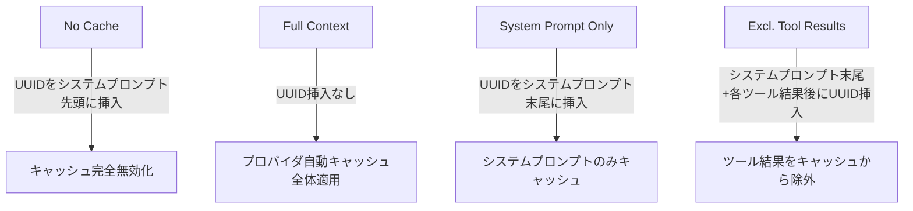

## 論文概要（Abstract）

本記事は [Don't Break the Cache: An Evaluation of Prompt Caching for Long-Horizon Agentic Tasks](https://arxiv.org/abs/2601.06007) の解説記事です。

著者らは、3大LLMプロバイダ（OpenAI、Anthropic、Google）が提供するプロンプトキャッシュ機能を、DeepResearch Benchの500以上のエージェントセッションで体系的に評価している。論文では、戦略的なキャッシュ境界制御によりAPIコストを41-80%削減し、TTFT（Time to First Token）を13-31%改善できると報告されている。一方、ナイーブな全コンテキストキャッシュはかえってレイテンシを増加させる場合があることも示されている。

この記事は [Zenn記事: OpenAI・Anthropic・Gemini会話管理パターン比較と統一設計](https://zenn.dev/0h_n0/articles/a2ff7f18b0266b) の深掘りです。Zenn記事で取り上げた各プロバイダのキャッシュ割引率比較やコスト削減シミュレーションの裏付けとなる実験的エビデンスを、本論文は提供している。

## 情報源

- **arXiv ID**: 2601.06007
- **URL**: [https://arxiv.org/abs/2601.06007](https://arxiv.org/abs/2601.06007)
- **著者**: Elias Lumer, Faheem Nizar, Akshaya Jangiti, et al.
- **発表年**: 2026
- **分野**: cs.CL（Computation and Language）

## 背景と動機（Background & Motivation）

LLMエージェントの普及に伴い、マルチターンの複雑なタスクが一般化している。1つのエージェントセッションで数十回のAPIコールが発生し、コンテキストウィンドウは累積的に拡大する。この結果、APIコストとレイテンシが実運用上の大きな課題となっている。

各LLMプロバイダはプロンプトキャッシュ機能を提供しているが、論文によれば、既存の研究はインファレンスレベルのメモリ管理や圧縮に焦点を当てており、プロバイダAPIを介したプロンプトキャッシュの費用対効果を定量的に評価した先行研究は存在しなかった。特に、どのキャッシュ戦略がエージェントワークロードに対して有効かという実践的な比較は行われていなかった。

本論文はこのギャップを埋めるべく、3プロバイダ・4モデル・3戦略の組み合わせを、制御された実験条件下で網羅的に評価している。

## 主要な貢献（Key Contributions）

- **体系的ベンチマーク**: DeepResearch Benchを用いて、3プロバイダ（OpenAI、Anthropic、Google）の4モデルに対し、500以上のエージェントセッションでプロンプトキャッシュの効果を定量評価
- **戦略比較**: 「全コンテキストキャッシュ」「システムプロンプトのみキャッシュ」「ツール結果除外キャッシュ」の3戦略を比較し、システムプロンプトのみまたはツール結果除外の戦略が一貫して優れることを実証
- **アブレーション分析**: プロンプトサイズ（500-50,000トークン）とツールコール数（3-50回）の2軸で効果を分析し、コスト削減がプロンプトサイズに線形スケールすることを確認
- **実践ガイドライン**: キャッシュ無効化を引き起こすアンチパターン（動的タイムスタンプ、セッションID等）を特定し、回避策を提示

## 技術的詳細（Technical Details）

### 実験設計

著者らは4つのキャッシュモードを設計している。キャッシュの制御にはUUID（Universally Unique Identifier）を利用し、プロンプト内の特定位置にUUIDを挿入することでキャッシュの有効・無効境界を人為的に操作している。



1. **No Cache（ベースライン）**: システムプロンプト先頭にUUIDを付与し、キャッシュを完全に無効化。全トークンの再計算を強制する
2. **Full Context**: UUID挿入なし。プロバイダの自動キャッシュが会話履歴・ツール結果を含む全コンテキストに適用される
3. **System Prompt Only**: システムプロンプト末尾にUUIDを付与。システムプロンプトのみがキャッシュされ、動的な会話コンテンツは除外される
4. **Exclude Tool Results**: システムプロンプト末尾および各ツール結果の後にUUIDを付与。セッション固有の動的コンテンツをキャッシュから排除する

### キャッシュヒットの条件

プロンプトキャッシュはプレフィックスマッチングに基づいて動作する。論文では、キャッシュされたコンテンツの先頭から1トークンでも異なればキャッシュミスが発生すると説明されている。この性質により、システムプロンプトにタイムスタンプやセッションIDなどの動的な値を含めると、キャッシュが無効化される。

$$
\text{CacheHit}(P_{\text{new}}, P_{\text{cached}}) =
\begin{cases}
\text{True} & \text{if } P_{\text{new}}[1..k] = P_{\text{cached}}[1..k] \text{ かつ } k \geq T_{\min} \\
\text{False} & \text{otherwise}
\end{cases}
$$

ここで、
- $P_{\text{new}}$: 新規リクエストのプロンプトトークン列
- $P_{\text{cached}}$: キャッシュ済みプロンプトトークン列
- $k$: プレフィックス一致長
- $T_{\min}$: プロバイダ固有の最小キャッシュトークン数

### プロバイダ別の最小キャッシュトークン数

論文Table 4より、各プロバイダの最小トークン数は以下の通りである。

| プロバイダ | モデル | 最小トークン数 |
|-----------|--------|--------------|
| OpenAI | GPT-4o, GPT-5.2 | 1,024 |
| Anthropic | Claude Sonnet 4.5 | 1,024 |
| Google | Gemini 2.5 Pro | 4,096 |

### 料金体系

論文Table 3より、各プロバイダのトークン料金は以下の構造になっている。

| モデル | 入力 ($/M tokens) | 出力 ($/M tokens) | キャッシュ読取 ($/M tokens) | キャッシュ書込 ($/M tokens) |
|--------|-------------------|-------------------|--------------------------|--------------------------|
| GPT-5.2 | $1.75 | $14.00 | $0.175 | - |
| Claude Sonnet 4.5 | $3.00 | $15.00 | $0.30 | $3.75 |
| Gemini 2.5 Pro | $1.25 (≤200K) | - | $0.125 | - |

OpenAIは自動キャッシュであり書き込み料金は発生しない。Anthropicは明示的なキャッシュ制御を提供し、書き込み時に入力料金の1.25倍が課金される。Googleは暗黙的キャッシュと明示的コンテキストキャッシュの両方を提供している。

## 実装のポイント（Implementation）

論文の知見を実装に落とし込む際の要点を整理する。

### キャッシュフレンドリーなプロンプト設計（Python）

```python
from typing import Any

def build_cache_friendly_prompt(
    system_prompt: str,
    tools: list[dict[str, Any]],
    conversation_history: list[dict[str, str]],
) -> list[dict[str, Any]]:
    """キャッシュヒット率を最大化するプロンプト構築.

    論文の推奨に従い、静的コンテンツ（システムプロンプト+ツール定義）を
    先頭に配置し、動的コンテンツ（会話履歴）を末尾に配置する。

    Args:
        system_prompt: 静的なシステムプロンプト（タイムスタンプ等を含めない）
        tools: 固定のツール定義リスト
        conversation_history: 動的な会話履歴

    Returns:
        キャッシュ最適化されたメッセージリスト
    """
    # 静的コンテンツを先頭に固定（キャッシュ対象）
    messages: list[dict[str, Any]] = [
        {
            "role": "system",
            "content": system_prompt,  # 動的値を含めない
        }
    ]
    # 会話履歴は末尾に配置（キャッシュ対象外）
    messages.extend(conversation_history)
    return messages
```

### Anthropic APIでの明示的キャッシュ制御（TypeScript）

```typescript
import Anthropic from "@anthropic-ai/sdk";

const client = new Anthropic();

// Anthropic APIではcache_controlで明示的にキャッシュ境界を指定できる
const response = await client.messages.create({
  model: "claude-sonnet-4-5-20260514",
  max_tokens: 4096,
  system: [
    {
      type: "text",
      text: staticSystemPrompt, // 10,000トークン以上推奨
      cache_control: { type: "ephemeral" }, // キャッシュ境界の明示指定
    },
  ],
  messages: conversationHistory, // 動的コンテンツはキャッシュ対象外
});
```

論文では、ツール定義を固定セットとして維持し、動的な機能はコード生成で実現する戦略が推奨されている。ツールセットが変更されるとキャッシュプレフィックスが無効化されるためである。

## Production Deployment Guide

### AWS実装パターン（コスト最適化重視）

プロンプトキャッシュを活用したLLM推論サービスのAWS構成を、トラフィック量別に3段階で示す。

**Small構成（~100 req/日）: Lambda + Bedrock + DynamoDB**

| サービス | リソース | 月額コスト |
|---------|---------|-----------|
| Lambda | 256MB, 30秒タイムアウト | ~$5 |
| Bedrock (Claude Sonnet) | ~100K入力トークン/日, キャッシュ有効 | ~$30-80 |
| DynamoDB (On-Demand) | 会話履歴保存, ~1GB | ~$5 |
| CloudWatch Logs | ログ保存 | ~$5 |
| **合計** | | **$50-100/月** |

キャッシュ戦略: システムプロンプトを固定し、DynamoDBに会話状態を保存。Bedrockのプロンプトキャッシュを活用してコストを削減する。

**Medium構成（~1,000 req/日）: ECS Fargate + Bedrock + ElastiCache**

| サービス | リソース | 月額コスト |
|---------|---------|-----------|
| ECS Fargate | 0.5 vCPU, 1GB RAM, 2タスク | ~$50 |
| Bedrock (Claude Sonnet) | ~1M入力トークン/日, キャッシュ有効 | ~$150-500 |
| ElastiCache (Redis) | cache.t4g.micro | ~$15 |
| ALB | ロードバランサ | ~$20 |
| CloudWatch | メトリクス+ログ | ~$15 |
| **合計** | | **$300-600/月** |

ElastiCacheでセッション管理を行い、プロンプトのプレフィックス一致率を向上させる。

**Large構成（10,000+ req/日）: EKS + Karpenter + Spot**

| サービス | リソース | 月額コスト |
|---------|---------|-----------|
| EKS コントロールプレーン | 1クラスタ | ~$75 |
| EC2 Spot (Karpenter管理) | c6i.xlarge x 3-10台 | ~$200-700 |
| Bedrock (Claude Sonnet) | ~10M入力トークン/日, キャッシュ有効 | ~$1,000-3,500 |
| ElastiCache (Redis) | cache.r7g.large クラスタ | ~$150 |
| ALB + WAF | ロードバランシング+セキュリティ | ~$50 |
| CloudWatch + X-Ray | 監視・トレーシング | ~$25 |
| **合計** | | **$2,000-4,500/月** |

Karpenterによる自動スケーリングでSpot Instancesを優先使用し、コンピュートコストを最大90%削減する。

**コスト試算の注意事項**: 上記は2026年7月時点のAWS ap-northeast-1（東京）リージョンの概算値である。実際のコストはトラフィックパターン、バースト使用量、Bedrockモデルの選択により変動する。最新料金は[AWS料金計算ツール](https://calculator.aws/)で確認を推奨する。

### Terraformインフラコード

#### Small構成（Lambda + Bedrock + DynamoDB）

```hcl
# --- Small構成: Serverless LLM推論サービス ---
terraform {
  required_version = ">= 1.9"
  required_providers {
    aws = { source = "hashicorp/aws", version = "~> 5.60" }
  }
}

provider "aws" { region = "ap-northeast-1" }

# DynamoDB: 会話履歴・キャッシュメタデータ保存
resource "aws_dynamodb_table" "conversations" {
  name         = "llm-conversations"
  billing_mode = "PAY_PER_REQUEST" # On-Demand: 低トラフィックでコスト最適
  hash_key     = "session_id"
  range_key    = "turn_id"

  attribute {
    name = "session_id"
    type = "S"
  }
  attribute {
    name = "turn_id"
    type = "N"
  }

  ttl {
    attribute_name = "expires_at"
    enabled        = true
  }

  server_side_encryption {
    enabled = true # KMS暗号化
  }

  tags = { Project = "llm-inference", Environment = "production" }
}

# IAMロール: Lambda用（最小権限）
resource "aws_iam_role" "lambda_exec" {
  name = "llm-inference-lambda-role"
  assume_role_policy = jsonencode({
    Version = "2012-10-17"
    Statement = [{
      Action = "sts:AssumeRole"
      Effect = "Allow"
      Principal = { Service = "lambda.amazonaws.com" }
    }]
  })
}

resource "aws_iam_role_policy" "lambda_policy" {
  name = "llm-inference-policy"
  role = aws_iam_role.lambda_exec.id
  policy = jsonencode({
    Version = "2012-10-17"
    Statement = [
      {
        Effect   = "Allow"
        Action   = ["bedrock:InvokeModel", "bedrock:InvokeModelWithResponseStream"]
        Resource = "arn:aws:bedrock:ap-northeast-1::foundation-model/anthropic.claude-*"
      },
      {
        Effect   = "Allow"
        Action   = ["dynamodb:GetItem", "dynamodb:PutItem", "dynamodb:Query"]
        Resource = aws_dynamodb_table.conversations.arn
      },
      {
        Effect   = "Allow"
        Action   = ["logs:CreateLogGroup", "logs:CreateLogStream", "logs:PutLogEvents"]
        Resource = "arn:aws:logs:ap-northeast-1:*:*"
      }
    ]
  })
}

# Lambda関数
resource "aws_lambda_function" "inference" {
  function_name = "llm-inference"
  role          = aws_iam_role.lambda_exec.arn
  runtime       = "python3.12"
  handler       = "handler.lambda_handler"
  filename      = "lambda.zip"
  memory_size   = 256
  timeout       = 30

  environment {
    variables = {
      DYNAMODB_TABLE = aws_dynamodb_table.conversations.name
      MODEL_ID       = "anthropic.claude-sonnet-4-5-20260514-v1:0"
    }
  }

  tracing_config { mode = "Active" } # X-Ray有効化
}

# CloudWatchアラーム: コスト異常検知
resource "aws_cloudwatch_metric_alarm" "lambda_duration" {
  alarm_name          = "llm-lambda-high-duration"
  comparison_operator = "GreaterThanThreshold"
  evaluation_periods  = 3
  metric_name         = "Duration"
  namespace           = "AWS/Lambda"
  period              = 300
  statistic           = "Average"
  threshold           = 25000 # 25秒（タイムアウト30秒の83%）
  dimensions          = { FunctionName = aws_lambda_function.inference.function_name }
}
```

#### Large構成（EKS + Karpenter + Spot）

```hcl
# --- Large構成: EKS + Karpenter + Spot ---
module "eks" {
  source  = "terraform-aws-modules/eks/aws"
  version = "~> 20.24"

  cluster_name    = "llm-inference-cluster"
  cluster_version = "1.31"

  vpc_id     = module.vpc.vpc_id
  subnet_ids = module.vpc.private_subnets

  cluster_endpoint_public_access = false # セキュリティ: パブリックアクセス無効

  eks_managed_node_groups = {
    system = {
      instance_types = ["t3.medium"]
      min_size       = 2
      max_size       = 3
      desired_size   = 2
    }
  }
}

# Karpenter: Spot優先の自動スケーリング
resource "kubectl_manifest" "karpenter_nodepool" {
  yaml_body = yamlencode({
    apiVersion = "karpenter.sh/v1"
    kind       = "NodePool"
    metadata   = { name = "llm-inference" }
    spec = {
      template = {
        spec = {
          requirements = [
            { key = "karpenter.sh/capacity-type", operator = "In", values = ["spot", "on-demand"] },
            { key = "node.kubernetes.io/instance-type", operator = "In",
              values = ["c6i.xlarge", "c6i.2xlarge", "c7i.xlarge", "c7i.2xlarge"] },
          ]
          nodeClassRef = { group = "karpenter.k8s.aws", kind = "EC2NodeClass", name = "default" }
        }
      }
      disruption = {
        consolidationPolicy = "WhenEmptyOrUnderutilized"
        consolidateAfter    = "30s" # Spot回収時の素早い再配置
      }
      limits = { cpu = "40", memory = "80Gi" }
    }
  })
}

# Secrets Manager: APIキー管理
resource "aws_secretsmanager_secret" "bedrock_config" {
  name       = "llm-inference/bedrock-config"
  kms_key_id = aws_kms_key.secrets.arn
}

# AWS Budgets: 月額予算アラート
resource "aws_budgets_budget" "monthly" {
  name         = "llm-inference-monthly"
  budget_type  = "COST"
  limit_amount = "5000"
  limit_unit   = "USD"
  time_unit    = "MONTHLY"

  notification {
    comparison_operator       = "GREATER_THAN"
    threshold                 = 80
    threshold_type            = "PERCENTAGE"
    notification_type         = "ACTUAL"
    subscriber_email_addresses = ["alerts@example.com"]
  }
}
```

### 運用・監視設定

#### CloudWatch Logs Insightsクエリ

```
# コスト異常検知: 1時間あたりのトークン使用量スパイク
fields @timestamp, @message
| filter @message like /token_usage/
| stats sum(input_tokens) as total_input, sum(cached_tokens) as total_cached,
        (sum(cached_tokens) / sum(input_tokens)) * 100 as cache_hit_rate
  by bin(1h)
| filter cache_hit_rate < 50
| sort @timestamp desc
| limit 24

# レイテンシ分析: TTFT P95/P99
fields @timestamp, ttft_ms
| filter @message like /ttft/
| stats pct(ttft_ms, 95) as p95, pct(ttft_ms, 99) as p99,
        avg(ttft_ms) as avg_ttft by bin(1h)
| sort @timestamp desc
```

#### CloudWatchアラーム（Python）

```python
import boto3

cloudwatch = boto3.client("cloudwatch", region_name="ap-northeast-1")

def create_token_usage_alarm(function_name: str, threshold: float = 1_000_000) -> None:
    """Bedrockトークン使用量のスパイクを検知するアラームを作成する.

    Args:
        function_name: 監視対象のLambda関数名
        threshold: 1時間あたりのトークン使用量閾値
    """
    cloudwatch.put_metric_alarm(
        AlarmName=f"{function_name}-token-spike",
        MetricName="InputTokenCount",
        Namespace="AWS/Bedrock",
        Statistic="Sum",
        Period=3600,
        EvaluationPeriods=1,
        Threshold=threshold,
        ComparisonOperator="GreaterThanThreshold",
        AlarmActions=["arn:aws:sns:ap-northeast-1:123456789012:alerts"],
    )
```

#### X-Rayトレーシング（Python）

```python
from aws_xray_sdk.core import xray_recorder, patch_all

patch_all()  # boto3自動計装

@xray_recorder.capture("invoke_bedrock")
def invoke_with_tracing(model_id: str, prompt: list[dict]) -> dict:
    """X-Rayトレーシング付きでBedrockモデルを呼び出す."""
    subsegment = xray_recorder.current_subsegment()
    subsegment.put_annotation("model_id", model_id)
    subsegment.put_metadata("prompt_length", sum(len(m["content"]) for m in prompt))
    # Bedrock呼び出し処理...
    return {}
```

#### Cost Explorer自動レポート（Python）

```python
import boto3
from datetime import date, timedelta

ce = boto3.client("ce", region_name="us-east-1")
sns = boto3.client("sns", region_name="ap-northeast-1")

def daily_cost_report() -> None:
    """日次コストレポートを取得し、閾値超過時にSNS通知する."""
    today = date.today()
    result = ce.get_cost_and_usage(
        TimePeriod={"Start": str(today - timedelta(days=1)), "End": str(today)},
        Granularity="DAILY",
        Metrics=["UnblendedCost"],
        Filter={
            "Dimensions": {
                "Key": "SERVICE",
                "Values": ["Amazon Bedrock", "AWS Lambda", "Amazon EKS"],
            }
        },
    )
    daily_cost = float(result["ResultsByTime"][0]["Total"]["UnblendedCost"]["Amount"])
    if daily_cost > 100:
        sns.publish(
            TopicArn="arn:aws:sns:ap-northeast-1:123456789012:cost-alerts",
            Message=f"Daily LLM cost alert: ${daily_cost:.2f}",
        )
```

### コスト最適化チェックリスト

**アーキテクチャ選択**
- [ ] トラフィック ~100 req/日 → Serverless（Lambda + Bedrock）
- [ ] トラフィック ~1,000 req/日 → Hybrid（ECS Fargate + Bedrock）
- [ ] トラフィック 10,000+ req/日 → Container（EKS + Karpenter）

**リソース最適化**
- [ ] EC2はSpot Instances優先（最大90%削減）
- [ ] 安定ワークロードにReserved Instances 1年コミット（最大72%削減）
- [ ] Compute Savings Plans検討（最大66%削減）
- [ ] Lambdaメモリサイズを負荷テストで最適化
- [ ] ECS/EKSのアイドル時スケールダウン設定
- [ ] Karpenter consolidationPolicyを有効化

**LLMコスト削減**
- [ ] プロンプトキャッシュを有効化（本論文により41-80%削減を確認）
- [ ] システムプロンプトに動的値を含めない（タイムスタンプ、セッションID除外）
- [ ] ツール定義を固定セットとして維持
- [ ] Bedrock Batch APIを非リアルタイム処理に使用（50%削減）
- [ ] トークン数制限をmax_tokensで設定
- [ ] 低コストモデルへのルーティング（簡易タスクはHaikuクラス）

**監視・アラート**
- [ ] AWS Budgets月額予算アラート設定（80%/100%閾値）
- [ ] CloudWatchアラーム（トークン使用量スパイク）
- [ ] Cost Anomaly Detection有効化
- [ ] 日次コストレポート自動化（SNS通知）
- [ ] キャッシュヒット率モニタリング（50%未満でアラート）

**リソース管理**
- [ ] 未使用リソース（NAT Gateway、EIP等）の定期削除
- [ ] タグ戦略統一（Project, Environment, Owner）
- [ ] DynamoDB TTLでセッションデータ自動削除
- [ ] CloudWatch Logs保持期間設定（30日）
- [ ] 開発環境の夜間・週末自動停止

## 実験結果（Results）

### コスト削減率

論文Table 1およびTable 2より、各モデル・戦略のコスト削減率とTTFT改善率を以下に示す。

| モデル | キャッシュ戦略 | コスト削減率 | TTFT改善率 |
|--------|-------------|------------|-----------|
| GPT-5.2 | Excl. Tool Results | 79.6% | 13.0% |
| GPT-5.2 | System Prompt | 81.4% | - |
| GPT-5.2 | Full Context | 79.3% | - |
| Claude Sonnet 4.5 | System Prompt | 78.5% | 22.9% |
| Claude Sonnet 4.5 | Full Context | 77.8% | - |
| GPT-4o | System Prompt | 45.9% | 30.9% |
| GPT-4o | Full Context | 47.8% | -8.8% |
| Gemini 2.5 Pro | System Prompt | 41.4% | 6.1% |
| Gemini 2.5 Pro | Full Context | 38.3% | - |

注目すべきは、GPT-4oにおいてFull Contextキャッシュが-8.8%のTTFT悪化を示している点である。著者らは、動的なセッション固有コンテンツをキャッシュすることがかえってレイテンシを増加させる場合があると報告している。

### アブレーション: プロンプトサイズの影響

論文のアブレーション分析によれば、コスト削減率はプロンプトサイズに対して線形にスケールする。50,000トークンのシステムプロンプトではGPT-5.2で89%、Claude Sonnet 4.5で88%、GPT-4oで54%の削減が得られている。一方、500トークンでも10-45%の削減が確認されており、全てのプロンプトサイズで一貫してコスト削減効果がある。

### アブレーション: ツールコール数の影響

ツールコール数（3-50回）に対して、コスト削減率は安定している。GPT-5.2は全ツールコール数で77-81%の範囲を維持している。一方、TTFT改善率はツールコール数の増加に伴い変動が大きく、Claude Sonnet 4.5では3回のツールコールで19%の改善が50回では5%に低下すると報告されている。

## 実運用への応用（Practical Applications）

本論文の知見は、Zenn記事「OpenAI・Anthropic・Gemini会話管理パターン比較と統一設計」で解説されている各プロバイダの統一的な会話管理設計と直接的に関連している。

Zenn記事で比較されたキャッシュ割引率（OpenAI: 90%off、Anthropic: 90%off、Google: 75-90%off）の実運用での効果が、本論文によって500以上のエージェントセッションで定量的に裏付けられた。特に以下の実践的示唆がある。

1. **システムプロンプト設計**: 動的値（日時、ユーザーID）をシステムプロンプトから排除し、会話メッセージの末尾に配置する。これだけで一貫したキャッシュヒットが得られる
2. **ツール定義の固定化**: ツールセットを固定し、動的な機能はコード生成で実現する。ツール定義の変更はキャッシュプレフィックスを無効化するためである
3. **プロバイダ選択**: 論文の結果から、OpenAI（GPT-5.2）が最もコスト削減率が高く（79-81%）、Anthropic（Claude Sonnet 4.5）がTTFT改善とのバランスが良い（78.5%コスト削減、22.9% TTFT改善）ことが示唆される

セキュリティ上の留意点として、論文では、プロンプトキャッシュがタイミングサイドチャネルを導入し、キャッシュされたコンテンツに関する情報が漏洩する可能性があるという先行研究にも言及している。

## 関連研究（Related Work）

- **KV-Cacheの効率化手法**: PagedAttention (vLLM)やFlashAttentionなど、推論レベルでのKVキャッシュ管理に関する研究が進んでいる。本論文はこれらの低レベル最適化ではなく、プロバイダAPIレベルのキャッシュ戦略を対象としている点で差別化される
- **LLMエージェントのコスト最適化**: マルチターンエージェントのコスト効率に関する研究は増加しているが、著者らによれば、プロンプトキャッシュの効果をエージェントワークロードで定量評価した先行研究は存在しなかった
- **プロンプトキャッシュのセキュリティ**: キャッシュのタイミングサイドチャネルによる情報漏洩リスクに関する研究が報告されており、本論文でもこの制約が言及されている

## まとめと今後の展望

本論文は、プロンプトキャッシュがLLMエージェントのAPIコストを41-80%削減し、TTFTを13-31%改善できることを、制御された実験で実証した。特に、システムプロンプトのみをキャッシュする戦略が一貫して有効であり、ナイーブな全コンテキストキャッシュは場合によってレイテンシを悪化させるという知見は、実務上の指針となる。

論文の制約として、APIレスポンス時間はサーバー負荷や地理的分散の影響を受けるため、著者らは実務者が自身のワークロードで検証することを推奨している。また、プロバイダの実装詳細は変更される可能性があり、最新のドキュメントの確認が必要である。

## 参考文献

- **arXiv**: [https://arxiv.org/abs/2601.06007](https://arxiv.org/abs/2601.06007)
- **Related Zenn article**: [https://zenn.dev/0h_n0/articles/a2ff7f18b0266b](https://zenn.dev/0h_n0/articles/a2ff7f18b0266b)
- **OpenAI Prompt Caching Documentation**: [https://platform.openai.com/docs/guides/prompt-caching](https://platform.openai.com/docs/guides/prompt-caching)
- **Anthropic Prompt Caching Documentation**: [https://docs.anthropic.com/en/docs/build-with-claude/prompt-caching](https://docs.anthropic.com/en/docs/build-with-claude/prompt-caching)
- **Google Context Caching Documentation**: [https://ai.google.dev/gemini-api/docs/caching](https://ai.google.dev/gemini-api/docs/caching)
