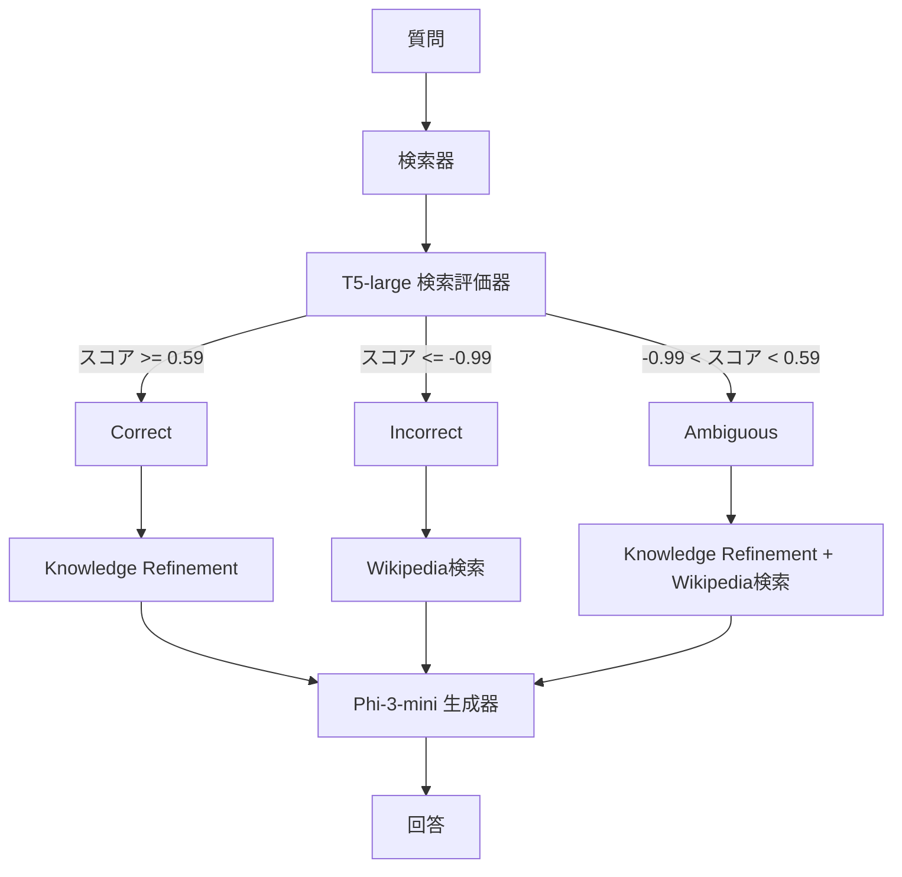

## 論文概要（Abstract）

本記事は [Open-Source Reproduction and Explainability Analysis of Corrective Retrieval Augmented Generation](https://arxiv.org/abs/2603.16169) の解説記事です。

Corrective Retrieval Augmented Generation（CRAG）はRAGシステムの頑健性を向上させる手法として注目されているが、原論文ではGoogle Search APIやクローズドモデルといったプロプライエタリコンポーネントを使用しており、再現性に課題があった。著者はこれらをWikipedia APIとPhi-3-mini-4k-instruct（3.8Bパラメータ）に置換した完全オープンソース版を構築し、PopQAで54.4%（原論文54.9%）、ARC-Challengeで85.2%と同等の性能を達成している。さらに、CRAGの中核であるT5ベース検索評価器に対してSHAPによる初の説明可能性分析を実施し、評価器がセマンティック類似度ではなくエンティティ照合（Named Entity Alignment）に依存していることを明らかにしている。

この記事は [Zenn記事: Gemini 3.5 Flash×CRAGで社内検索の誤回答を検索評価ループで削減する](https://zenn.dev/0h_n0/articles/798fe16c7d13cd) の深掘りです。

## 情報源

- **arXiv ID**: 2603.16169
- **URL**: [arXiv:2603.16169](https://arxiv.org/abs/2603.16169)
- **著者**: Surya Vardhan Yalavarthi
- **発表年**: 2026年3月
- **分野**: Information Retrieval (cs.IR) / Artificial Intelligence (cs.AI) / Computation and Language (cs.CL)
- **コード**: [GitHub: suryayalavarthi/crag-reproduction](https://github.com/suryayalavarthi/crag-reproduction)

## 背景と動機（Background & Motivation）

### CRAGとは何か

CRAG（Corrective Retrieval Augmented Generation）は、Yan et al.（2024, [arXiv:2401.15884](https://arxiv.org/abs/2401.15884)）が提案したRAGの拡張手法である。標準的なRAGでは、検索された文書の品質に関わらずそのまま生成器に渡されるため、無関係な文書や誤情報を含む文書がハルシネーションの原因となる。CRAGは検索評価器（Retrieval Evaluator）を導入し、検索結果の品質を3段階（Correct / Incorrect / Ambiguous）に分類した上で、分類結果に応じた補正アクションを実行する。

### 再現性の壁

原論文の実装には以下のプロプライエタリコンポーネントが含まれており、第三者による検証が困難であった。

1. **Google Search API**: 有料のWeb検索サービス。Incorrectおよび Ambiguous判定時の補完検索に使用
2. **LLaMA-2-7B**: Meta社のモデル。当時の利用規約により一部の研究用途に制限があった
3. **GPT-3.5**: キーワード抽出に使用。APIコストが発生する

著者はこれらの課題に対し、すべてをフリーかつオープンソースの代替コンポーネントに置換することで再現可能な実装を提供している。

### なぜ説明可能性分析が必要か

CRAGの性能はT5ベース検索評価器の判定精度に大きく依存する。しかし、この評価器が「何を根拠に」関連性を判断しているのかは不明であった。評価器の内部動作を理解することは、CRAGの改善点を特定し、実運用での信頼性を確保するために不可欠である。

## 主要な貢献（Key Contributions）

著者は以下の3点を貢献として報告している（論文Section 1）。

- **貢献1: オープンソース再現**: プロプライエタリコンポーネントをすべてフリー代替に置換した実装を公開。Google Search API をWikipedia APIに、LLaMA-2-7BをPhi-3-mini-4k-instruct（3.8B）に、GPT-3.5をルールベースキーワード抽出に置換
- **貢献2: 同等性能の達成**: PopQAで54.4%（原論文54.9%比 -0.5pt）、ARC-Challengeで85.2%（原論文53.7%を大幅に上回る）を達成
- **貢献3: 初のSHAP説明可能性分析**: T5検索評価器に対するトークンレベルのSHAP分析を実施し、評価器がエンティティ照合に依存しているという知見を得た

## 技術的詳細（Technical Details）

### システムアーキテクチャ

CRAGのオープンソース再現実装は、以下の4つのコンポーネントで構成される。



### 検索評価器（T5-large）

検索評価器は原論文でファインチューニングされたT5-largeチェックポイントをそのまま使用している。入力形式は以下の通りである。

```
question [SEP] document
```

T5-largeは質問と文書のペアに対してスカラー値の関連性スコア $s \in [-1, 1]$ を出力する。このスコアに基づき、以下の閾値でアクションが決定される。

$$
\text{action}(s) = \begin{cases}
\text{Correct} & \text{if } s \geq \tau^+ = 0.59 \\
\text{Incorrect} & \text{if } s \leq \tau^- = -0.99 \\
\text{Ambiguous} & \text{otherwise}
\end{cases}
$$

ここで、
- $s$: T5-largeが出力する関連性スコア
- $\tau^+$: Correct判定の上限閾値（0.59）
- $\tau^-$: Incorrect判定の下限閾値（-0.99）

著者はこれらの閾値がPopQAデータセットに対して調整されたものであり、新しい生成器やARC-Challengeデータセットに対しては再調整されていないことを限界として指摘している。

### Knowledge Refinement: decompose-then-recompose

Correct判定された文書に対しては、不要な情報を除去するKnowledge Refinementが適用される。アルゴリズムは以下の手順で動作する。

1. 検索文書を3文ずつの「ストリップ」に分割する
2. 各ストリップをT5評価器で再評価し、スコアが -0.5 未満のストリップを除去する
3. 残ったストリップのうち上位5件を連結して精製コンテキストを構成する

```python
def knowledge_refinement(
    document: str,
    question: str,
    evaluator: T5Evaluator,
    strip_threshold: float = -0.5,
    top_k: int = 5,
) -> str:
    """Decompose-then-recompose による Knowledge Refinement

    Args:
        document: 検索された文書テキスト
        question: ユーザの質問
        evaluator: T5-large 検索評価器
        strip_threshold: ストリップ除去の閾値
        top_k: 連結するストリップの最大数

    Returns:
        精製されたコンテキスト文字列
    """
    sentences = split_into_sentences(document)
    strips = [
        " ".join(sentences[i : i + 3])
        for i in range(0, len(sentences), 3)
    ]

    scored_strips: list[tuple[float, str]] = []
    for strip in strips:
        score = evaluator.score(question, strip)
        if score >= strip_threshold:
            scored_strips.append((score, strip))

    scored_strips.sort(key=lambda x: x[0], reverse=True)
    top_strips = [text for _, text in scored_strips[:top_k]]
    return " ".join(top_strips)
```

### Wikipedia検索パイプライン

Google Search APIの代替として、著者は4段階のフォールバック戦略を持つWikipedia検索パイプラインを構築している。

1. **直接ページ検索**: キーワードでWikipediaページを直接取得
2. **型付きサフィックス検索**: 「X (politician)」「X (film)」のように型情報を付加して検索
3. **Wikipedia Search API**: 検索クエリによるAPI呼び出し
4. **曖昧さ回避ページ解析**: Disambiguationページからリンクを辿る

著者の報告によると、このパイプラインはARC-Challengeで99%、PopQAのAmbiguous質問で82.3%のヒット率を達成している。ただし、商用検索APIと比較してカバレッジにギャップがあることが限界として挙げられている。

### 生成器: Phi-3-mini-4k-instruct

原論文のLLaMA-2-7Bに代わり、Microsoft社のPhi-3-mini-4k-instruct（3.8Bパラメータ）をfloat16精度でロードし、ファインチューニングなしで使用している。プロンプトテンプレートは「与えられたコンテキストと質問に基づき、1-2文の簡潔な回答を生成せよ」という指示形式である。

パラメータ数が約半分（7B → 3.8B）であるにもかかわらず同等以上の性能を達成している点は、instruction-tuningの効果を示唆している。

## SHAP説明可能性分析

### 分析手法

著者はSHAP（SHapley Additive exPlanations）のPartitionExplainerとtext maskerを使用し、T5検索評価器のトークンレベル帰属値を計算している。分析対象は各アクションタイプ（Correct / Incorrect / Ambiguous）から3サンプルずつ、計9サンプルである。

SHAPは各トークン $t_i$ に対してShapley値 $\phi_i$ を割り当てる。$\phi_i > 0$ はそのトークンが関連性スコアを押し上げる方向に寄与し、$\phi_i < 0$ は押し下げる方向に寄与することを意味する。

$$
f(x) = \phi_0 + \sum_{i=1}^{M} \phi_i
$$

ここで、
- $f(x)$: モデルの出力スコア
- $\phi_0$: ベースライン値（全トークンをマスクした場合の出力）
- $\phi_i$: トークン $t_i$ のShapley値
- $M$: 入力トークン数

### 発見された4つのパターン

著者は分析の結果、以下の4パターンを報告している（論文Section 4.4）。

**パターン1: エンティティ優位（Entity Dominance）**

関連文書において、人名や地名などの固有名詞トークンが最も高いSHAP値（最大 +0.150）を示した。著者はこれを「評価器がセマンティックな意味理解ではなく、質問中のエンティティと文書中のエンティティの一致を主要な判断基準としている」と解釈している。

**パターン2: エンティティ不一致による非関連判定（Entity Mismatch）**

質問に含まれるエンティティが文書中に欠落している場合、強い負のSHAP値（最大 -0.280）が観測された。評価器は文書の内容を深く理解するのではなく、エンティティの有無を検出していることを示唆している。

**パターン3: 構造エンコーディング（Structural Encoding）**

`[SEP]` トークンが一貫して正のSHAP値を示した。これはT5がファインチューニング時に質問と文書の境界を構造的な手がかりとして学習していることを意味する。

**パターン4: 分布外ペナルティ（Out-of-Distribution Penalty）**

映画タイトルや曲名など、学習データの分布から外れるエンティティに対して負のSHAP帰属値が観測された。これはGenreカテゴリの精度が22.3%と低い原因を説明する知見である。

### SHAP分析が示すCRAGの本質的課題

SHAP分析の結果は、CRAGの検索評価器がセマンティック類似度を計算する「意味理解モジュール」ではなく、実質的には「エンティティ照合器」として機能していることを示している。この知見は以下の実用的な示唆を持つ。

1. **高精度カテゴリ**（Country: 85.8%, Sport: 73.0%）: 人名・国名・チーム名など明確なエンティティが存在し、照合が容易
2. **低精度カテゴリ**（Genre: 22.3%, Religion: 5.0%）: エンティティが曖昧、または学習データの分布外
3. **改善の方向性**: セマンティック理解を強化するモデル（例: Cross-Encoder系）への置換が性能向上の鍵となる可能性がある

## 実験結果（Results）

### 主要ベンチマーク

著者が報告している主要な実験結果は以下の通りである（論文Table 2）。

| 手法 | PopQA | ARC-Challenge |
|------|-------|---------------|
| Vanilla RAG | 51.4% | 84.8% |
| CRAG（本実装） | 54.4% | 85.2% |
| CRAG（原論文） | 54.9% | 53.7% |

PopQAでは原論文とほぼ同等（-0.5pt）の性能を達成している。ARC-Challengeでは原論文の53.7%を大幅に上回る85.2%を記録しているが、著者はこれについて「生成器の差異（LLaMA-2-7B vs Phi-3-mini）による影響が大きい」と分析している。Phi-3-miniはinstruction-tuningされたモデルであり、科学分野の知識に対するベースライン性能が高いことが要因として考えられる。

### アクション分布分析

PopQAにおけるアクション分布は以下の通りである（論文Table 3）。

| アクション | 件数 | 割合 | 精度 |
|-----------|------|------|------|
| Correct | 754 | 54.4% | 78.1% |
| Ambiguous | 379 | 27.4% | 19.3% |
| Incorrect | 252 | 18.2% | 36.1% |

Correct判定時の精度78.1%は高いが、Ambiguous判定時の精度は19.3%と低い。著者はWikipedia補完後にAmbiguousの精度が23.0%へ改善されたと報告しているが、依然として大きな課題が残っている。Ambiguous判定が全体の27.4%を占めることを考慮すると、このカテゴリの改善が全体精度向上の鍵となる。

### 質問タイプ別精度

著者が報告している質問タイプ別の精度分析は、SHAP分析の知見と整合する（論文Table 4）。

| 質問タイプ | 件数 | 精度 | 主要アクション |
|-----------|------|------|------------|
| Country | 274 | 85.8% | Correct |
| Sport | 196 | 73.0% | Correct |
| Occupation | 121 | 61.2% | Correct |
| City | 175 | 54.3% | Correct |
| Author | 234 | 40.2% | Ambiguous |
| Composer | 46 | 32.6% | Ambiguous |
| Director | 90 | 28.9% | Ambiguous |
| Genre | 112 | 22.3% | Ambiguous |
| Religion | 40 | 5.0% | Correct |

CountryやSportなど明確なエンティティを持つカテゴリでは高精度を達成している一方、AuthorやDirectorなどのカテゴリではAmbiguous判定が支配的となり精度が低下している。Religion（5.0%）は特異なケースであり、Correct判定が多いにもかかわらず精度が極めて低い。これはT5評価器がエンティティ照合に成功しても、生成器が正しい回答を出力できないケースを示している。

## 実装のポイント（Implementation）

### 再現実装の注意点

本論文の実装を参考にCRAGパイプラインを構築する際の注意点を以下に整理する。

1. **閾値の調整**: $\tau^+ = 0.59$, $\tau^- = -0.99$ はPopQAに最適化された値であり、ドメインに応じた再調整が必要である。特に $\tau^-$ が -0.99 と極端に低い値であるため、Incorrect判定が発生しにくい設定になっている
2. **Wikipedia APIの制約**: 82.3%のヒット率は商用検索APIと比較して低い。プロダクション環境ではBrave Search APIやSerp API等の併用を検討すべきである
3. **Knowledge Refinementのストリップサイズ**: 3文単位のストリップ分割は経験的な値であり、文書の種類に応じて調整の余地がある
4. **生成器の選択**: Phi-3-miniの3.8BパラメータはARC-Challengeの科学問題で高い基礎能力を示した。タスクに応じて最適な生成器を選択することが重要である

### SHAP分析の実装

```python
import shap
from transformers import T5ForConditionalGeneration, T5Tokenizer


def run_shap_analysis(
    question: str,
    document: str,
    model_name: str = "t5-large",
    checkpoint_path: str = "path/to/crag-evaluator",
) -> shap.Explanation:
    """T5検索評価器のSHAP分析を実行する

    Args:
        question: ユーザの質問
        document: 検索された文書
        model_name: T5モデル名
        checkpoint_path: ファインチューニング済みチェックポイントのパス

    Returns:
        SHAP Explanationオブジェクト（トークンレベル帰属値を含む）
    """
    tokenizer = T5Tokenizer.from_pretrained(model_name)
    model = T5ForConditionalGeneration.from_pretrained(checkpoint_path)

    input_text = f"{question} [SEP] {document}"

    def predict_fn(texts: list[str]) -> list[float]:
        """モデルの予測関数（SHAPのコールバック用）"""
        scores: list[float] = []
        for text in texts:
            inputs = tokenizer(
                text, return_tensors="pt", truncation=True, max_length=512
            )
            outputs = model.generate(**inputs, output_scores=True)
            score = extract_relevance_score(outputs)
            scores.append(score)
        return scores

    masker = shap.maskers.Text(tokenizer)
    explainer = shap.PartitionExplainer(predict_fn, masker)
    shap_values = explainer([input_text])
    return shap_values
```

## Production Deployment Guide

本論文のCRAGパイプラインをAWS上にデプロイする際の構成ガイドを示す。検索評価器（T5-large, 770Mパラメータ）と生成器（Phi-3-mini, 3.8Bパラメータ）の2つのモデルを効率的にホスティングする必要がある。

### AWS実装パターン（コスト最適化重視）

以下はap-northeast-1（東京）リージョンにおける2026年7月時点の概算コストである。実際のコストはトラフィックパターン、バースト使用量、リージョンにより変動するため、最新料金はAWS料金計算ツールで確認を推奨する。

| 構成 | トラフィック | 主要サービス | 月額概算 |
|------|------------|------------|---------|
| Small | ~100 req/日 | Lambda + SageMaker Serverless | $80-180 |
| Medium | ~1,000 req/日 | ECS Fargate + SageMaker | $400-900 |
| Large | 10,000+ req/日 | EKS + Spot GPU Instances | $2,500-5,500 |

**Small構成（~100 req/日）**:
- Lambda: API Gateway + ルーティングロジック（$5/月）
- SageMaker Serverless Inference: T5-large評価器（$30-60/月）
- SageMaker Serverless Inference: Phi-3-mini生成器（$40-100/月）
- DynamoDB: キャッシュ・履歴保存（$5-15/月）

**Medium構成（~1,000 req/日）**:
- ECS Fargate: T5-large評価器（2 vCPU, 8GB RAM）（$120-200/月）
- SageMaker Real-time Endpoint: Phi-3-mini（ml.g5.xlarge）（$250-600/月）
- ElastiCache Redis: 評価結果キャッシュ（$30-50/月）
- ALB: ロードバランシング（$20-30/月）

**Large構成（10,000+ req/日）**:
- EKS: コンテナオーケストレーション（$75/月）
- Spot GPU Instances: g5.xlarge（Phi-3-mini推論、最大70%削減）（$800-2,000/月）
- EC2 Spot: T5-large評価器（c6i.xlarge）（$100-300/月）
- Karpenter: 自動スケーリング

**コスト削減テクニック**:
- Spot Instances活用でGPUインスタンスコストを最大70%削減
- SageMaker Savings Plans（1年コミット）で最大64%削減
- T5評価器の結果キャッシュにより同一質問-文書ペアの再計算を回避
- Knowledge Refinementの結果もキャッシュし、ストリップ評価の重複を排除

### Terraformインフラコード

**Small構成（Serverless）**:

```hcl
# CRAG Pipeline - Small構成 (Serverless)
# Lambda + SageMaker Serverless + DynamoDB

provider "aws" {
  region = "ap-northeast-1"
}

# --- IAM Role (最小権限) ---
resource "aws_iam_role" "crag_lambda_role" {
  name = "crag-lambda-execution-role"
  assume_role_policy = jsonencode({
    Version = "2012-10-17"
    Statement = [{
      Action = "sts:AssumeRole"
      Effect = "Allow"
      Principal = { Service = "lambda.amazonaws.com" }
    }]
  })
}

resource "aws_iam_role_policy" "crag_lambda_policy" {
  name = "crag-lambda-policy"
  role = aws_iam_role.crag_lambda_role.id
  policy = jsonencode({
    Version = "2012-10-17"
    Statement = [
      {
        Effect   = "Allow"
        Action   = ["sagemaker:InvokeEndpoint"]
        Resource = [
          aws_sagemaker_endpoint.t5_evaluator.arn,
          aws_sagemaker_endpoint.phi3_generator.arn,
        ]
      },
      {
        Effect   = "Allow"
        Action   = ["dynamodb:GetItem", "dynamodb:PutItem", "dynamodb:Query"]
        Resource = aws_dynamodb_table.crag_cache.arn
      },
      {
        Effect   = "Allow"
        Action   = ["logs:CreateLogGroup", "logs:CreateLogStream", "logs:PutLogEvents"]
        Resource = "arn:aws:logs:*:*:*"
      }
    ]
  })
}

# --- DynamoDB Cache (On-Demand, KMS暗号化) ---
resource "aws_dynamodb_table" "crag_cache" {
  name         = "crag-evaluation-cache"
  billing_mode = "PAY_PER_REQUEST"
  hash_key     = "question_doc_hash"

  attribute {
    name = "question_doc_hash"
    type = "S"
  }

  ttl {
    attribute_name = "expires_at"
    enabled        = true
  }

  server_side_encryption {
    enabled = true  # AWS managed KMS key
  }

  tags = {
    Project = "crag-pipeline"
    Env     = "production"
  }
}

# --- Lambda Function ---
resource "aws_lambda_function" "crag_router" {
  function_name = "crag-pipeline-router"
  role          = aws_iam_role.crag_lambda_role.arn
  handler       = "handler.lambda_handler"
  runtime       = "python3.12"
  timeout       = 120
  memory_size   = 512

  filename         = "lambda_package.zip"
  source_code_hash = filebase64sha256("lambda_package.zip")

  environment {
    variables = {
      T5_ENDPOINT    = aws_sagemaker_endpoint.t5_evaluator.name
      PHI3_ENDPOINT  = aws_sagemaker_endpoint.phi3_generator.name
      CACHE_TABLE    = aws_dynamodb_table.crag_cache.name
      TAU_PLUS       = "0.59"
      TAU_MINUS      = "-0.99"
    }
  }

  tags = {
    Project = "crag-pipeline"
  }
}

# --- CloudWatch Alarm (コスト監視) ---
resource "aws_cloudwatch_metric_alarm" "lambda_duration" {
  alarm_name          = "crag-lambda-high-duration"
  comparison_operator = "GreaterThanThreshold"
  evaluation_periods  = 3
  metric_name         = "Duration"
  namespace           = "AWS/Lambda"
  period              = 300
  statistic           = "Average"
  threshold           = 90000  # 90秒
  alarm_actions       = [aws_sns_topic.crag_alerts.arn]

  dimensions = {
    FunctionName = aws_lambda_function.crag_router.function_name
  }
}
```

**Large構成（Container + GPU）**:

```hcl
# CRAG Pipeline - Large構成 (EKS + Spot GPU)

module "eks" {
  source          = "terraform-aws-modules/eks/aws"
  version         = "~> 20.0"
  cluster_name    = "crag-pipeline-cluster"
  cluster_version = "1.31"

  vpc_id     = module.vpc.vpc_id
  subnet_ids = module.vpc.private_subnets

  cluster_endpoint_public_access = false  # セキュリティ: プライベートアクセスのみ

  eks_managed_node_groups = {
    # T5-large 評価器ノード (CPU, Spot優先)
    evaluator = {
      instance_types = ["c6i.xlarge", "c6a.xlarge"]
      capacity_type  = "SPOT"
      min_size       = 1
      max_size       = 10
      desired_size   = 2
      labels = { workload = "t5-evaluator" }
    }
    # Phi-3-mini 生成器ノード (GPU, Spot優先)
    generator = {
      instance_types = ["g5.xlarge"]
      capacity_type  = "SPOT"
      min_size       = 1
      max_size       = 8
      desired_size   = 2
      ami_type       = "AL2_x86_64_GPU"
      labels = { workload = "phi3-generator" }
    }
  }

  tags = {
    Project = "crag-pipeline"
    Env     = "production"
  }
}

# --- AWS Budgets (予算アラート) ---
resource "aws_budgets_budget" "crag_monthly" {
  name         = "crag-pipeline-monthly"
  budget_type  = "COST"
  limit_amount = "6000"
  limit_unit   = "USD"
  time_unit    = "MONTHLY"

  notification {
    comparison_operator       = "GREATER_THAN"
    threshold                 = 80
    threshold_type            = "PERCENTAGE"
    notification_type         = "ACTUAL"
    subscriber_email_addresses = ["ops-team@example.com"]
  }
}
```

### 運用・監視設定

**CloudWatch Logs Insights クエリ（コスト異常検知）**:

```
fields @timestamp, action, evaluator_latency_ms, generator_latency_ms
| filter @message like /crag-pipeline/
| stats count() as req_count,
        avg(evaluator_latency_ms) as avg_eval_ms,
        avg(generator_latency_ms) as avg_gen_ms,
        percentile(generator_latency_ms, 95) as p95_gen_ms
  by bin(1h) as hour
| sort hour desc
```

**CloudWatch アラーム設定（Python）**:

```python
import boto3


def create_crag_alarms(sns_topic_arn: str) -> None:
    """CRAGパイプライン用CloudWatchアラームを作成する

    Args:
        sns_topic_arn: 通知先SNSトピックのARN
    """
    cw = boto3.client("cloudwatch", region_name="ap-northeast-1")

    # SageMaker推論レイテンシ監視
    cw.put_metric_alarm(
        AlarmName="crag-phi3-high-latency",
        MetricName="ModelLatency",
        Namespace="AWS/SageMaker",
        Statistic="p95",
        Period=300,
        EvaluationPeriods=3,
        Threshold=30000,  # 30秒
        ComparisonOperator="GreaterThanThreshold",
        AlarmActions=[sns_topic_arn],
        Dimensions=[
            {"Name": "EndpointName", "Value": "crag-phi3-generator"},
            {"Name": "VariantName", "Value": "AllTraffic"},
        ],
    )
```

**X-Ray トレーシング設定（Python）**:

```python
from aws_xray_sdk.core import xray_recorder, patch_all


def init_tracing() -> None:
    """CRAGパイプラインのX-Rayトレーシングを初期化する"""
    xray_recorder.configure(service="crag-pipeline")
    patch_all()  # boto3, requests等を自動計装


@xray_recorder.capture("evaluate_document")
def evaluate_document(question: str, document: str) -> float:
    """文書評価をX-Rayトレース付きで実行する

    Args:
        question: ユーザの質問
        document: 検索された文書

    Returns:
        関連性スコア (-1.0 to 1.0)
    """
    xray_recorder.current_subsegment().put_annotation("action_type", "evaluate")
    xray_recorder.current_subsegment().put_metadata("question_length", len(question))
    score = call_t5_evaluator(question, document)
    xray_recorder.current_subsegment().put_annotation("score", round(score, 3))
    return score
```

**Cost Explorer自動レポート（Python）**:

```python
import boto3
from datetime import datetime, timedelta


def daily_cost_report(sns_topic_arn: str, threshold: float = 100.0) -> None:
    """日次コストレポートを取得し、閾値超過時にSNS通知する

    Args:
        sns_topic_arn: 通知先SNSトピックのARN
        threshold: 日次コスト閾値（USD）
    """
    ce = boto3.client("ce", region_name="us-east-1")
    sns = boto3.client("sns", region_name="ap-northeast-1")

    today = datetime.utcnow().strftime("%Y-%m-%d")
    yesterday = (datetime.utcnow() - timedelta(days=1)).strftime("%Y-%m-%d")

    response = ce.get_cost_and_usage(
        TimePeriod={"Start": yesterday, "End": today},
        Granularity="DAILY",
        Metrics=["UnblendedCost"],
        Filter={
            "Tags": {
                "Key": "Project",
                "Values": ["crag-pipeline"],
            }
        },
        GroupBy=[{"Type": "DIMENSION", "Key": "SERVICE"}],
    )

    total = sum(
        float(g["Metrics"]["UnblendedCost"]["Amount"])
        for result in response["ResultsByTime"]
        for g in result["Groups"]
    )

    if total > threshold:
        sns.publish(
            TopicArn=sns_topic_arn,
            Subject=f"CRAG Pipeline Cost Alert: ${total:.2f}/day",
            Message=f"Daily cost ${total:.2f} exceeds threshold ${threshold:.2f}",
        )
```

### コスト最適化チェックリスト

**アーキテクチャ選択**:
- [ ] トラフィック量に応じた構成を選択（~100 req/日: Serverless、~1000: Hybrid、10000+: Container）
- [ ] T5評価器はCPUインスタンスで十分（GPUは生成器のみ）

**リソース最適化**:
- [ ] GPU Instances: Spot優先（g5.xlarge で最大70%削減）
- [ ] CPU Instances: Spot + 複数インスタンスタイプ指定（c6i.xlarge, c6a.xlarge）
- [ ] Reserved Instances: 1年コミットで最大40%削減
- [ ] Savings Plans: SageMaker Savings Plansで最大64%削減
- [ ] Lambda: メモリサイズ512MBから開始し、Power Tuningで最適化
- [ ] ECS/EKS: Karpenterによるアイドル時自動スケールダウン

**推論コスト削減**:
- [ ] T5評価器の結果をDynamoDBにキャッシュ（同一ペアの再計算回避）
- [ ] Knowledge Refinementのストリップ評価結果もキャッシュ
- [ ] Phi-3-miniのvLLMバッチ推論で同時リクエスト処理
- [ ] 質問長・文書長の上限設定でトークン数を制限

**監視・アラート**:
- [ ] AWS Budgets: 月額上限設定と80%到達時アラート
- [ ] CloudWatch Alarms: 推論レイテンシP95監視
- [ ] Cost Anomaly Detection: 異常コスト自動検知
- [ ] 日次コストレポート: Cost Explorer APIで自動取得

**リソース管理**:
- [ ] 未使用SageMakerエンドポイントの自動削除
- [ ] タグ戦略: Project / Env / Owner タグを全リソースに付与
- [ ] DynamoDBキャッシュ: TTL設定で古いエントリを自動削除
- [ ] 開発環境: 夜間・休日のGPUインスタンス自動停止
- [ ] ECRイメージ: ライフサイクルポリシーで古いイメージを自動削除

## 実運用への応用（Practical Applications）

### Zenn記事との連携

[Zenn記事](https://zenn.dev/0h_n0/articles/798fe16c7d13cd)ではGemini 3.5 FlashとCRAGを組み合わせた社内検索の改善手法を紹介している。本論文のSHAP分析結果は、CRAGの検索評価器を実運用に組み込む際の設計判断に直接影響する。

1. **評価器の選択**: T5ベースの評価器がエンティティ照合に依存していることを踏まえ、社内文書のようにエンティティが多様なドメインでは、Cross-Encoderやセマンティック類似度に特化したモデルの検討が推奨される
2. **閾値の調整**: ドメインごとに $\tau^+$ と $\tau^-$ を検証データで再調整することが不可欠である。特に $\tau^- = -0.99$ はIncorrect判定をほぼ発生させない設定であり、多くの実運用シナリオでは緩和が必要となる
3. **Wikipedia検索の代替**: 社内システムではElasticsearchやOpenSearchによる社内文書検索がWikipedia APIの代替となる

### スケーリングの課題

T5-large（770Mパラメータ）の推論は比較的軽量だが、Knowledge Refinementでは文書を複数ストリップに分割して各々を評価するため、1リクエストあたりのT5推論回数が増加する。大規模トラフィック環境では、評価結果のキャッシュとバッチ推論の組み合わせが重要となる。

## 関連研究（Related Work）

- **CRAG（原論文）**: Yan et al., 2024（[arXiv:2401.15884](https://arxiv.org/abs/2401.15884)）。本論文の再現対象。検索評価器 + Web検索補完 + Knowledge Refinementの3要素を提案
- **Self-RAG**: Asai et al., 2023。生成器自身が検索の必要性と回答品質を自己評価する手法。CRAGが外部評価器を使用するのに対し、Self-RAGは生成器内部に評価機能を統合
- **FLARE**: Jiang et al., 2023。生成中に能動的に検索を実行する手法。CRAGが生成前に検索品質を評価するのに対し、FLAREは生成途中で追加検索を実行する

## まとめと今後の展望

本論文は、CRAGのオープンソース再現を通じて再現性の課題を解決するとともに、SHAP分析によりT5検索評価器の内部動作を明らかにした。「検索評価器はセマンティック類似度ではなくエンティティ照合に依存している」という発見は、RAGシステムの検索品質評価を設計する際の重要な指針となる。

著者が指摘する今後の課題として、9サンプルのSHAP分析を大規模に拡張すること、ドメインごとの閾値最適化手法の開発、およびエンティティ照合の限界を克服するセマンティック評価器の設計が挙げられる。

## 参考文献

- **arXiv**: [https://arxiv.org/abs/2603.16169](https://arxiv.org/abs/2603.16169)
- **Code**: [https://github.com/suryayalavarthi/crag-reproduction](https://github.com/suryayalavarthi/crag-reproduction)
- **Original CRAG**: [https://arxiv.org/abs/2401.15884](https://arxiv.org/abs/2401.15884)
- **Related Zenn article**: [https://zenn.dev/0h_n0/articles/798fe16c7d13cd](https://zenn.dev/0h_n0/articles/798fe16c7d13cd)
