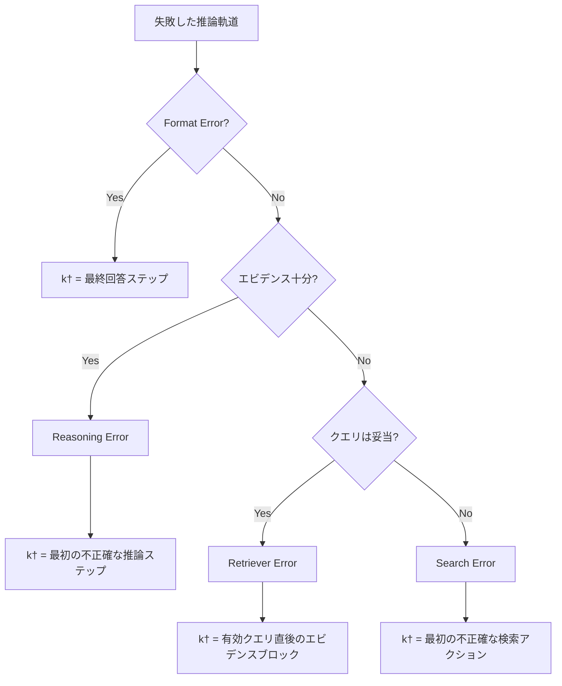

## 論文概要（Abstract）

本記事は [Doctor-RAG](https://arxiv.org/abs/2604.00865) の解説記事です。

Doctor-RAG（DR-RAG）は、Agentic RAGにおける失敗パターンを体系的に診断し、最小コストで修復するフレームワークである。著者らは、推論軌道（trajectory）が長くなるほど失敗が頻発するAgentic RAGの問題に対し、蒸留した診断モデルによるエラータイプ分類と障害点特定、およびエラータイプに応じた局所修復演算子を提案している。3つのマルチホップQAベンチマーク（HotpotQA, 2WikiMultihopQA, MuSiQue）での実験において、DR-RAGは既存手法RAG-Criticと比較して修復率で7-14ポイント上回り、推論時間は10倍以上高速であったと報告されている（論文Table 2, Table 4）。

この記事は [Zenn記事: Gemini 3.5 Flash×CRAGで社内検索の誤回答を検索評価ループで削減する](https://zenn.dev/0h_n0/articles/798fe16c7d13cd) の深掘りです。

## 情報源

- **arXiv ID**: 2604.00865
- **URL**: [https://arxiv.org/abs/2604.00865](https://arxiv.org/abs/2604.00865)
- **著者**: Shuguang Jiao, Chengkai Huang, Shuhan Qi, Xuan Wang, et al.
- **発表年**: 2026（初版: 2026年4月、改訂: 2026年6月12日）
- **分野**: cs.IR（Information Retrieval）

## 背景と動機（Background & Motivation）

Agentic RAGは、検索（retrieval）と推論（reasoning）を交互に実行するパラダイムであり、マルチホップ質問応答や複雑な知識推論タスクにおいて広く採用されている。しかし推論軌道が長くなるほど、途中のステップでの失敗が蓄積し、最終回答の品質が劣化する問題がある。

従来の修復手法には大きく2つのアプローチが存在する。第一に、Self-RAGやCRAGに代表される「パイプライン全体の再実行」アプローチは、失敗箇所を特定せずに全体を再生成するため計算コストが高い。第二に、RAG-Criticのような「粗いエラー分類に基づく再計画・再実行」アプローチは、エラーの根本原因を精密に特定しないため、不必要な再計算が発生する。著者らはこれらの課題に対し、「失敗の診断と修復を明確に分離し、障害点のみに介入する」というDoctor-RAGのアプローチを提案している。

## 主要な貢献（Key Contributions）

- **4タイプのエラー分類法**: Agentic RAGの失敗を、Format Error、Reasoning Error、Retriever Error、Search Errorの4カテゴリに体系化し、各エラーに対する修復戦略を定義した
- **蒸留ベースの診断モデル**: 大規模モデル（Qwen3.5-Plus）の診断能力を8Bクラスのモデルに蒸留し、81.3%の診断精度を達成した
- **プレフィックス再利用による最小コスト修復**: 障害点以前の正常な推論プレフィックスを再利用することで、RAG-Critic比10倍以上の高速化を実現した

## 技術的詳細（Technical Details）

### エラー分類法（Error Taxonomy）

DR-RAGの核心は、Agentic RAGの失敗を4つの明確なカテゴリに分類するエラー分類法にある。各エラータイプは、エビデンスの充足度と障害の発生箇所によって区別される。

| エラータイプ | エビデンス | 障害箇所 | 定義 |
|------------|----------|---------|------|
| Format Error | 十分 | 最終回答 | 意味的に正しいが表面形式の不一致でexact-match失敗 |
| Reasoning Error | 十分 | 推論 | 十分な証拠があるにもかかわらず推論を誤る |
| Retriever Error | 不十分 | 情報検索 | 有効なクエリだが必要な証拠を取得できない |
| Search Error | 不十分 | 検索クエリ | 上流の推論ミスによりクエリの方向性自体が誤っている |

この分類法の設計は階層的な判定プロトコルに基づいている。まずFormat Errorの有無を確認し、次にエビデンス充足度を評価する。エビデンスが十分であればReasoning Errorと判定し、不十分であればクエリの妥当性に基づいてRetriever ErrorとSearch Errorを識別する。

### 診断モジュール（Diagnostic Module）

診断モジュールは以下の3つのタスクを統合的に実行する。

1. **エビデンス充足度の評価**: 検索された文書群が正解導出に必要な情報を含むか判定する
2. **エラータイプの分類**: 階層的判定プロトコルに基づき4タイプのいずれかに分類する
3. **障害点の特定**: 軌道中で最初に失敗が発生した地点 $k^{\dagger}$ を特定する



障害点 $k^{\dagger}$ の定義はエラータイプごとに異なる。

- **Format Error**: $k^{\dagger}$ は最終回答ステップ
- **Reasoning Error**: $k^{\dagger}$ はエビデンスが十分であるにもかかわらず不正確な結論を導出した最初の推論ステップ
- **Retriever Error**: $k^{\dagger}$ は妥当なクエリの直後で必要な情報を含まないエビデンスブロック
- **Search Error**: $k^{\dagger}$ は誤ったエンティティや無根拠な仮定に基づく最初の検索アクション

著者らはクエリの妥当性（query validity）を次のように定義している。「正しいエンティティを使用し、関連情報を対象とし、十分に具体的であるクエリは妥当とみなす」。

### 蒸留による診断モデルの学習

診断モデルの学習には知識蒸留が用いられる。教師モデル（Qwen3.5-Plus, thinking mode）が失敗した推論軌道に対して構造化された診断推論とラベルを生成し、生徒モデル（Qwen3-8BまたはLLaMA-3.1-8B-Instruct）をSFT（教師あり微調整）で学習する。

生徒モデルの出力形式は以下のJSON構造である:

```json
{
  "error_type": "reasoning_error",
  "fault_position": 3,
  "reasoning": "<think>ステップ3で日本の首都を大阪と誤認...</think>"
}
```

診断推論は `<think>` タグ内に展開され、教師と生徒で同一のプロンプト形式を使用する。

### 修復モジュール（Repair Module）

修復モジュールの中核概念は**プレフィックス再利用**である。推論軌道 $y$ の各ステップを $\rho^{(k)}$ として、障害点 $k^{\dagger}$ より前の正常なプレフィックスを保持する:

$$
y_{\text{prefix}} = \{\rho^{(1)}, \ldots, \rho^{(k^{\dagger}-1)}\}
$$

また、軌道中で検索されたすべてのエビデンスの和集合を以下のように定義する:

$$
D_{\text{all}}(y) = \bigcup_{\rho \in D(y)} \rho
$$

ここで $D(y)$ は軌道 $y$ における全ての文書観測アクションの集合である。

この2つの概念に基づき、4つの修復演算子が定義される:

**演算子1: Format-Invalid Repair（書式修復）**

最終回答の表面形式のみを修正する。元の質問と検索済み文書を保持し、回答だけを再生成する。推論と検索は変更しない。

**演算子2: Reasoning Logic Repair（推論修復）**

正常なプレフィックス $y_{\text{prefix}}$ を保持したまま、集約済みエビデンス $D_{\text{all}}(y)$ を根拠として障害点以降の推論を再実行する。追加の検索は行わない。

**演算子3: Retriever Error Repair（検索器修復）**

3段階で修復する。(1) 失敗したクエリ $Q_{\text{failed}}$ を代替表現に書き換える、(2) リトリーバのtop-kを増加させる、(3) 拡張されたエビデンスで回答を再生成する。障害点以前のプレフィックスは条件付きで保持する。

**演算子4: Search Error Repair（検索方向修復）**

2段階で修復する。(1) 高レベルのソリューションプランを生成する、(2) プランに基づき推論と検索の両方を再実行する。障害点以降は推論・検索ともに元の軌道から分岐する。

各修復演算子の計算コストは、Format Repair（最小）からSearch Error Repair（最大）まで段階的に増加する設計となっている。

### アルゴリズムの擬似コード

DR-RAGの全体フローを擬似コードで示す:

```python
from dataclasses import dataclass
from enum import Enum


class ErrorType(Enum):
    """DR-RAGのエラー分類"""
    FORMAT = "format_error"
    REASONING = "reasoning_error"
    RETRIEVER = "retriever_error"
    SEARCH = "search_error"


@dataclass
class Diagnosis:
    """診断結果"""
    error_type: ErrorType
    fault_position: int  # k-dagger
    reasoning: str


def diagnose(
    question: str,
    trajectory: list[dict],
    diagnosis_model: object,
) -> Diagnosis:
    """蒸留済み診断モデルによるエラー診断

    Args:
        question: 元の質問
        trajectory: 推論軌道（アクションのリスト）
        diagnosis_model: SFTで学習した診断モデル

    Returns:
        エラータイプ、障害点位置、診断推論を含む診断結果
    """
    prompt = format_diagnosis_prompt(question, trajectory)
    result = diagnosis_model.generate(prompt)
    return parse_diagnosis(result)


def repair(
    question: str,
    trajectory: list[dict],
    diagnosis: Diagnosis,
    retriever: object,
    llm: object,
) -> str:
    """エラータイプに応じた修復演算子の実行

    Args:
        question: 元の質問
        trajectory: 推論軌道
        diagnosis: 診断結果
        retriever: 検索モデル（BGE-large-en-v1.5 + FAISS）
        llm: 推論用LLM

    Returns:
        修復後の回答
    """
    k_dag = diagnosis.fault_position
    prefix = trajectory[:k_dag - 1]
    all_docs = aggregate_documents(trajectory)

    if diagnosis.error_type == ErrorType.FORMAT:
        # 演算子1: 最終回答の書式のみ再生成
        return reformat_answer(question, all_docs, llm)

    elif diagnosis.error_type == ErrorType.REASONING:
        # 演算子2: プレフィックスを保持し推論を再実行
        return re_reason(question, prefix, all_docs, llm)

    elif diagnosis.error_type == ErrorType.RETRIEVER:
        # 演算子3: クエリ書き換え + top-k増加 + 再生成
        failed_queries = extract_failed_queries(trajectory, k_dag)
        new_queries = rewrite_queries(failed_queries, llm)
        new_docs = retriever.search(new_queries, top_k=10)
        combined_docs = all_docs | new_docs
        return re_reason(question, prefix, combined_docs, llm)

    elif diagnosis.error_type == ErrorType.SEARCH:
        # 演算子4: ソリューションプラン生成 + 全面再実行
        plan = generate_solution_plan(question, prefix, llm)
        return execute_plan(question, plan, retriever, llm)
```

## 実装のポイント（Implementation）

### 検索基盤の構成

著者らの実験環境では、BGE-large-en-v1.5をエンコーダ、FAISSをベクトルインデックスとして使用し、Wikipedia 2018ダンプを知識ベースとしている。デフォルトのtop-kは5であり、Retriever Error修復時にはこの値を増加させる。

### 診断モデルの学習コスト

教師モデル（Qwen3.5-Plus）による診断アノテーションの生成と、生徒モデル（8Bクラス）のSFTが必要となる。プロダクション環境では、ドメイン固有の失敗パターンに対して追加のアノテーション・学習が必要になる点に注意が求められる。

### プレフィックス再利用の実装上の注意

プレフィックスの切り出しには、推論軌道の各ステップが明確に区切られている必要がある。ReAct形式（Thought-Action-Observation）のように構造化された軌道形式を前提としており、自由形式のchain-of-thoughtには直接適用が困難である。

### 修復の打ち切り制御

論文では修復の試行回数制限について明示的な記述はないが、実用上は修復タイムアウトや最大再試行回数の設定が必要となる。特にSearch Error修復は推論と検索の両方を再実行するため、計算コストの上限管理が重要である。

## Production Deployment Guide

DR-RAGのアプローチは、既存のAgentic RAGパイプラインに診断・修復レイヤーを追加する形で実装できる。以下ではAWS上での構築方法を示す。

### AWS実装パターン（コスト最適化重視）

DR-RAGは、(1) 推論軌道の生成、(2) 失敗の診断、(3) エラータイプに応じた修復、の3フェーズから成る。診断・修復はリアルタイム推論パイプラインの後段に配置する。

**トラフィック量別の推奨構成**:

| 構成 | 想定規模 | アーキテクチャ | 月額概算 |
|------|---------|---------------|---------|
| Small | ~100 req/日 | Lambda + Bedrock + DynamoDB | $50-150 |
| Medium | ~1000 req/日 | ECS Fargate + Bedrock + ElastiCache | $300-800 |
| Large | 10000+ req/日 | EKS + Spot + SageMaker Endpoint | $2,000-5,000 |

**Small構成の詳細** (~100 req/日):
- AWS Lambda（メモリ2048MB, タイムアウト5分）: 診断モデル推論 + 修復演算子の実行制御
- Amazon Bedrock（Claude Sonnet 4）: Agentic RAGの推論軌道生成と修復時の再推論
- DynamoDB（On-Demand）: 推論軌道・診断結果・修復履歴の永続化
- S3: 知識ベース文書とFAISSインデックスの格納
- 月額概算: Lambda $5 + Bedrock $30-120 + DynamoDB $5 + S3 $5 = $50-150

**Large構成の詳細** (10000+ req/日):
- EKS + Karpenter（Spot優先, g5.xlarge）: 診断モデル（8B）のGPU推論
- SageMaker Endpoint（ml.g5.xlarge, Spot）: BGE-large-en-v1.5のリアルタイムエンベディング
- Amazon Bedrock: 修復時のLLM推論（Prompt Caching有効化で30-90%削減）
- OpenSearch Serverless: FAISSの代替としてマネージドベクトル検索
- ElastiCache（Redis）: 推論軌道キャッシュ、プレフィックスキャッシュ
- 月額概算: EKS $200 + Spot GPU $500-1,500 + SageMaker $300-800 + Bedrock $500-1,500 + OpenSearch $200 + Redis $150 = $2,000-5,000

**コスト削減テクニック**:
- Spot Instancesで最大90%削減（診断モデルは中断耐性あり、リトライで対応可能）
- Reserved Instancesの1年コミットで最大72%削減
- Bedrock Prompt Cachingで30-90%削減（修復時のプレフィックス再利用と相性が良い）
- Bedrock Batch APIで50%削減（バッチ修復処理に適用）

**コスト試算の注意事項**: 上記は2026年7月時点のAWS ap-northeast-1（東京）リージョン料金に基づく概算値である。実際のコストはトラフィックパターン、リージョン、バースト使用量により変動する。最新料金はAWS料金計算ツールで確認を推奨する。

### Terraformインフラコード

**Small構成（Serverless）: Lambda + Bedrock + DynamoDB**

```hcl
# DR-RAG Small構成 - Serverless
# Lambda + Bedrock + DynamoDB

terraform {
  required_version = ">= 1.9"
  required_providers {
    aws = {
      source  = "hashicorp/aws"
      version = "~> 5.80"
    }
  }
}

provider "aws" {
  region = "ap-northeast-1"
}

# --- IAMロール（最小権限） ---
resource "aws_iam_role" "dr_rag_lambda" {
  name = "dr-rag-lambda-role"
  assume_role_policy = jsonencode({
    Version = "2012-10-17"
    Statement = [{
      Action = "sts:AssumeRole"
      Effect = "Allow"
      Principal = { Service = "lambda.amazonaws.com" }
    }]
  })
}

resource "aws_iam_role_policy" "dr_rag_lambda_policy" {
  name = "dr-rag-lambda-policy"
  role = aws_iam_role.dr_rag_lambda.id
  policy = jsonencode({
    Version = "2012-10-17"
    Statement = [
      {
        Effect   = "Allow"
        Action   = ["bedrock:InvokeModel", "bedrock:InvokeModelWithResponseStream"]
        Resource = "arn:aws:bedrock:ap-northeast-1::foundation-model/anthropic.claude-sonnet-4*"
      },
      {
        Effect = "Allow"
        Action = [
          "dynamodb:PutItem", "dynamodb:GetItem",
          "dynamodb:UpdateItem", "dynamodb:Query"
        ]
        Resource = aws_dynamodb_table.dr_rag_trajectories.arn
      },
      {
        Effect   = "Allow"
        Action   = ["s3:GetObject"]
        Resource = "${aws_s3_bucket.dr_rag_knowledge.arn}/*"
      },
      {
        Effect   = "Allow"
        Action   = ["logs:CreateLogGroup", "logs:CreateLogStream", "logs:PutLogEvents"]
        Resource = "arn:aws:logs:ap-northeast-1:*:*"
      }
    ]
  })
}

# --- DynamoDB（推論軌道・診断結果） ---
resource "aws_dynamodb_table" "dr_rag_trajectories" {
  name         = "dr-rag-trajectories"
  billing_mode = "PAY_PER_REQUEST"
  hash_key     = "request_id"
  range_key    = "timestamp"

  attribute {
    name = "request_id"
    type = "S"
  }
  attribute {
    name = "timestamp"
    type = "N"
  }

  # KMS暗号化
  server_side_encryption { enabled = true }

  point_in_time_recovery { enabled = true }
}

# --- S3（知識ベース・FAISSインデックス） ---
resource "aws_s3_bucket" "dr_rag_knowledge" {
  bucket = "dr-rag-knowledge-base"
}

resource "aws_s3_bucket_server_side_encryption_configuration" "dr_rag_knowledge" {
  bucket = aws_s3_bucket.dr_rag_knowledge.id
  rule {
    apply_server_side_encryption_by_default {
      sse_algorithm = "aws:kms"
    }
  }
}

resource "aws_s3_bucket_public_access_block" "dr_rag_knowledge" {
  bucket                  = aws_s3_bucket.dr_rag_knowledge.id
  block_public_acls       = true
  block_public_policy     = true
  ignore_public_acls      = true
  restrict_public_buckets = true
}

# --- Lambda（診断+修復） ---
resource "aws_lambda_function" "dr_rag_diagnose_repair" {
  function_name = "dr-rag-diagnose-repair"
  role          = aws_iam_role.dr_rag_lambda.arn
  handler       = "handler.lambda_handler"
  runtime       = "python3.12"
  memory_size   = 2048
  timeout       = 300  # 5分: 診断+修復の最大時間

  filename = "lambda_package.zip"

  environment {
    variables = {
      DYNAMODB_TABLE      = aws_dynamodb_table.dr_rag_trajectories.name
      S3_KNOWLEDGE_BUCKET = aws_s3_bucket.dr_rag_knowledge.id
      BEDROCK_MODEL_ID    = "anthropic.claude-sonnet-4-20250514-v1:0"
      MAX_REPAIR_RETRIES  = "2"
    }
  }

  tracing_config { mode = "Active" }  # X-Ray有効化
}

# --- CloudWatchアラーム（コスト監視） ---
resource "aws_cloudwatch_metric_alarm" "lambda_duration" {
  alarm_name          = "dr-rag-lambda-duration-high"
  comparison_operator = "GreaterThanThreshold"
  evaluation_periods  = 3
  metric_name         = "Duration"
  namespace           = "AWS/Lambda"
  period              = 300
  statistic           = "p95"
  threshold           = 240000  # 4分（5分タイムアウトの80%）
  alarm_description   = "DR-RAG Lambda p95 latency exceeds 4 minutes"

  dimensions = {
    FunctionName = aws_lambda_function.dr_rag_diagnose_repair.function_name
  }
}
```

**Large構成（Container）: EKS + Karpenter + Spot Instances**

```hcl
# DR-RAG Large構成 - Container
# EKS + Karpenter + Spot + SageMaker

# --- EKSクラスタ ---
module "eks" {
  source  = "terraform-aws-modules/eks/aws"
  version = "~> 20.31"

  cluster_name    = "dr-rag-cluster"
  cluster_version = "1.31"

  vpc_id     = module.vpc.vpc_id
  subnet_ids = module.vpc.private_subnets

  # Karpenter用のIAM設定
  enable_cluster_creator_admin_permissions = true

  cluster_endpoint_public_access = false  # プライベートアクセスのみ
}

# --- Karpenter Provisioner（Spot優先） ---
resource "kubectl_manifest" "karpenter_nodepool" {
  yaml_body = yamlencode({
    apiVersion = "karpenter.sh/v1"
    kind       = "NodePool"
    metadata   = { name = "dr-rag-gpu" }
    spec = {
      template = {
        spec = {
          requirements = [
            { key = "karpenter.sh/capacity-type", operator = "In", values = ["spot", "on-demand"] },
            { key = "node.kubernetes.io/instance-type", operator = "In", values = ["g5.xlarge", "g5.2xlarge"] },
          ]
          nodeClassRef = { group = "karpenter.k8s.aws", kind = "EC2NodeClass", name = "default" }
        }
      }
      limits   = { cpu = "64", "nvidia.com/gpu" = "8" }
      disruption = {
        consolidationPolicy = "WhenEmptyOrUnderutilized"
        consolidateAfter    = "30s"
      }
    }
  })
}

# --- Secrets Manager（モデル設定） ---
resource "aws_secretsmanager_secret" "dr_rag_config" {
  name = "dr-rag/model-config"
}

resource "aws_secretsmanager_secret_version" "dr_rag_config" {
  secret_id = aws_secretsmanager_secret.dr_rag_config.id
  secret_string = jsonencode({
    diagnosis_model_path   = "s3://dr-rag-models/qwen3-8b-diagnosis/"
    retriever_model        = "BAAI/bge-large-en-v1.5"
    faiss_index_path       = "s3://dr-rag-knowledge-base/faiss/"
    bedrock_model_id       = "anthropic.claude-sonnet-4-20250514-v1:0"
  })
}

# --- AWS Budgets（予算アラート） ---
resource "aws_budgets_budget" "dr_rag_monthly" {
  name         = "dr-rag-monthly-budget"
  budget_type  = "COST"
  limit_amount = "5000"
  limit_unit   = "USD"
  time_unit    = "MONTHLY"

  notification {
    comparison_operator       = "GREATER_THAN"
    threshold                 = 80
    threshold_type            = "PERCENTAGE"
    notification_type         = "ACTUAL"
    subscriber_email_addresses = ["alerts@example.com"]
  }
}
```

### 運用・監視設定

**CloudWatch Logs Insights クエリ**:

```
# DR-RAG修復パフォーマンス分析
fields @timestamp, request_id, error_type, repair_duration_ms, repair_success
| filter event = "dr_rag_repair_complete"
| stats avg(repair_duration_ms) as avg_ms,
        pct(repair_duration_ms, 95) as p95_ms,
        pct(repair_duration_ms, 99) as p99_ms,
        sum(case when repair_success = 1 then 1 else 0 end) / count(*) * 100 as success_rate
  by error_type
| sort error_type

# Bedrockトークン使用量の1時間あたり推移
fields @timestamp, bedrock_input_tokens, bedrock_output_tokens
| filter event = "bedrock_invocation"
| stats sum(bedrock_input_tokens) as total_input,
        sum(bedrock_output_tokens) as total_output
  by bin(1h)
| sort @timestamp desc
```

**CloudWatchアラーム設定コード（Python）**:

```python
import boto3

cloudwatch = boto3.client("cloudwatch", region_name="ap-northeast-1")


def create_dr_rag_alarms() -> None:
    """DR-RAG用CloudWatchアラームを作成する"""
    # Bedrockトークン使用量スパイク検知
    cloudwatch.put_metric_alarm(
        AlarmName="dr-rag-bedrock-token-spike",
        MetricName="InputTokenCount",
        Namespace="AWS/Bedrock",
        Statistic="Sum",
        Period=3600,
        EvaluationPeriods=2,
        Threshold=500000,  # 1時間あたり50万トークン
        ComparisonOperator="GreaterThanThreshold",
        AlarmActions=["arn:aws:sns:ap-northeast-1:ACCOUNT:dr-rag-alerts"],
        Dimensions=[
            {"Name": "ModelId", "Value": "anthropic.claude-sonnet-4-20250514-v1:0"},
        ],
    )

    # 修復失敗率の異常検知
    cloudwatch.put_metric_alarm(
        AlarmName="dr-rag-repair-failure-rate",
        MetricName="RepairFailureRate",
        Namespace="DR-RAG",
        Statistic="Average",
        Period=900,
        EvaluationPeriods=4,
        Threshold=0.85,  # 修復失敗率85%超
        ComparisonOperator="GreaterThanThreshold",
        AlarmActions=["arn:aws:sns:ap-northeast-1:ACCOUNT:dr-rag-alerts"],
    )
```

**X-Ray トレーシング設定コード（Python）**:

```python
from aws_xray_sdk.core import xray_recorder, patch_all

patch_all()  # boto3を自動計装


@xray_recorder.capture("dr_rag_diagnose")
def diagnose_trajectory(
    question: str,
    trajectory: list[dict],
) -> dict:
    """診断処理をX-Rayでトレースする"""
    subsegment = xray_recorder.current_subsegment()
    subsegment.put_annotation("error_type", "pending")
    subsegment.put_metadata("trajectory_length", len(trajectory))

    result = run_diagnosis(question, trajectory)

    subsegment.put_annotation("error_type", result["error_type"])
    subsegment.put_annotation("fault_position", result["fault_position"])
    return result
```

**Cost Explorer自動レポート（Python）**:

```python
import boto3
from datetime import datetime, timedelta

ce = boto3.client("ce", region_name="us-east-1")
sns = boto3.client("sns", region_name="ap-northeast-1")


def daily_cost_report() -> None:
    """日次コストレポートを取得し閾値超過でSNS通知する"""
    end = datetime.utcnow().strftime("%Y-%m-%d")
    start = (datetime.utcnow() - timedelta(days=1)).strftime("%Y-%m-%d")

    response = ce.get_cost_and_usage(
        TimePeriod={"Start": start, "End": end},
        Granularity="DAILY",
        Metrics=["UnblendedCost"],
        Filter={
            "Tags": {
                "Key": "Project",
                "Values": ["dr-rag"],
            }
        },
        GroupBy=[{"Type": "DIMENSION", "Key": "SERVICE"}],
    )

    total = sum(
        float(g["Metrics"]["UnblendedCost"]["Amount"])
        for r in response["ResultsByTime"]
        for g in r["Groups"]
    )

    if total > 100:  # $100/日超過でアラート
        sns.publish(
            TopicArn="arn:aws:sns:ap-northeast-1:ACCOUNT:dr-rag-alerts",
            Subject=f"DR-RAG Daily Cost Alert: ${total:.2f}",
            Message=f"DR-RAG daily cost exceeded $100: ${total:.2f}",
        )
```

### コスト最適化チェックリスト

**アーキテクチャ選択**:
- [ ] トラフィック量に応じた構成選択（~100 req/日: Serverless、~1000: Hybrid、10000+: Container）
- [ ] 診断モデルのデプロイ方式選定（Lambda内蔵 vs SageMaker Endpoint vs EKS Pod）

**リソース最適化**:
- [ ] EC2/EKS: Spot Instances優先（診断モデル推論は中断耐性あり）
- [ ] Reserved Instances: 1年コミットでベースライン分を確保
- [ ] Savings Plans: Compute Savings Plansで柔軟なコスト削減
- [ ] Lambda: メモリサイズ最適化（Power Tuningで最適値を探索）
- [ ] ECS/EKS: アイドル時のスケールダウン（Karpenter consolidation）

**LLMコスト削減**:
- [ ] Bedrock Batch API: 非リアルタイムの修復処理に適用して50%削減
- [ ] Prompt Caching: プレフィックス再利用と組み合わせて30-90%削減
- [ ] モデル選択ロジック: Format Errorは軽量モデル、Search Errorはフルモデルを使い分け
- [ ] トークン数制限: 修復時の最大出力トークンをエラータイプ別に設定
- [ ] 診断モデルの自前デプロイ: 8Bモデルは自前GPU推論がBedrock APIより安価になりうる

**監視・アラート**:
- [ ] AWS Budgets: 月次予算アラート設定
- [ ] CloudWatch アラーム: Bedrockトークン使用量、Lambda実行時間、修復失敗率
- [ ] Cost Anomaly Detection: 自動異常検知の有効化
- [ ] 日次コストレポート: Cost Explorer APIで自動取得・SNS通知

**リソース管理**:
- [ ] 未使用リソース削除: 不要なSageMaker Endpoint、EBS Volume
- [ ] タグ戦略: `Project=dr-rag` タグでコスト追跡
- [ ] ライフサイクルポリシー: S3の古い推論軌道をGlacierに移行
- [ ] 開発環境夜間停止: 非本番環境のGPUインスタンスを夜間停止
- [ ] FAISSインデックスの定期再構築: 不要な文書の除去でストレージ・メモリ節約

## 実験結果（Results）

### 主要な修復性能

著者らは3つのマルチホップQAベンチマーク（HotpotQA, 2WikiMultihopQA, MuSiQue）で実験を行い、修復率（Repair Rate: 初期にEM=0だったインスタンスがEM=1に修正された割合）を報告している。

**Qwen3-8Bバックボーンでの修復率（論文Table 2より）**:

| ベースライン | 修復手法 | HotpotQA $\Delta$EM | 2Wiki $\Delta$EM | MuSiQue $\Delta$EM |
|------------|---------|---------------------|------------------|---------------------|
| ReAct | Rerun | 12.2 | 14.8 | 15.0 |
| ReAct | Step-wise | 8.1 | 11.3 | 12.5 |
| ReAct | RAG-Critic | 13.9 | 16.8 | 12.9 |
| **ReAct** | **DR-RAG** | **21.8** | **26.9** | **24.5** |
| Search-o1 | DR-RAG | 22.5 | 21.1 | 18.1 |
| Search-R1 | DR-RAG | 19.8 | 25.1 | 8.3 |

DR-RAGはReActベースラインにおいて、RAG-Critic比でHotpotQA +7.9、2Wiki +10.1、MuSiQue +11.6ポイントの修復率改善を達成している。

### Ablation Study

**コンポーネント除去実験（論文Table 3より）**:

| 構成 | HotpotQA $\Delta$F1 | 2Wiki $\Delta$EM | MuSiQue $\Delta$EM |
|------|---------------------|------------------|---------------------|
| Full DR-RAG | 28.9 | 23.8 | 11.4 |
| w/o Taxonomy | 17.5 | 16.0 | 6.3 |
| w/o Localization | 19.5 | 18.3 | 8.6 |

エラー分類法を除去すると7-11ポイント低下し、障害点の位置特定を除去すると5-9ポイント低下する。両コンポーネントがともに修復性能に寄与していることが確認されている。

### 効率性

**推論時間の比較（論文Table 4より、秒単位）**:

| ベースライン | 修復手法 | HotpotQA | 2Wiki | MuSiQue |
|------------|---------|----------|-------|---------|
| ReAct | Rerun | 713 | 842 | 927 |
| ReAct | Step-wise | 1,031 | 915 | 990 |
| ReAct | RAG-Critic | 5,036 | 5,003 | 7,111 |
| **ReAct** | **DR-RAG** | **308** | **396** | **233** |

DR-RAGはRerunやStep-wiseと比較して2-3倍高速であり、RAG-Criticと比較して10倍以上高速であると報告されている。この効率性は、プレフィックス再利用により不必要な再計算を回避することに起因する。

### 診断精度とエラータイプ別修復率

診断モデルの全体精度は81.3%であり、構成別では76.0-87.4%の範囲で変動する（論文Figure 4より）。エラータイプ別の診断精度は、Format Error（94.9%）が最も高く、Search Error（62.0%）が最も低い。

**エラータイプ別修復率（論文Table 5より）**:

| エラータイプ | 正確な診断時の修復率 | 誤診断時の修復率 | 全体修復率 |
|------------|------------------|----------------|----------|
| Format Error | 41.3% | 11.1% | 39.5% |
| Reasoning Error | 26.5% | 15.8% | 24.1% |
| Retriever Error | 17.7% | 12.2% | 17.1% |
| Search Error | 16.5% | 7.2% | 13.1% |

正確な診断は全エラータイプにおいて修復率を向上させており、診断精度と修復成功率の正の相関が確認されている。

## 実運用への応用（Practical Applications）

### Zenn記事との関連

Zenn記事「Gemini 3.5 Flash×CRAGで社内検索の誤回答を検索評価ループで削減する」では、CRAGパターンによる検索結果の評価と再検索ループが取り上げられている。DR-RAGはCRAGのアプローチをさらに発展させ、エラーの根本原因を特定した上で最小コストの修復を行う点で差別化される。社内検索システムにDR-RAGを適用すれば、CRAGでは対応困難な推論エラーや検索方向の誤りにも対処可能となる。

### プロダクション適用時の考慮事項

**レイテンシ**: DR-RAGの修復処理は追加のLLM呼び出しを伴うため、リアルタイム応答が必須のユースケースでは非同期修復パイプラインの設計が求められる。著者らの実験ではFormat Repair（最速）でも数秒、Search Error Repair（最遅）では数十秒を要する。

**診断モデルのドメイン適応**: 論文の実験はオープンドメインQA（Wikipedia）で実施されている。社内文書検索やドメイン固有のタスクに適用する場合、診断モデルの追加学習が必要となる可能性がある。

**コスト効率**: Format ErrorやReasoning Errorは追加検索を伴わないため低コストで修復できる一方、Search Error修復は全面的な再実行に近いコストが発生する。エラータイプの分布に応じたコスト予測が運用上重要となる。

## 関連研究（Related Work）

- **CRAG（Corrective RAG）**: 検索結果の信頼度を評価し、低信頼度の場合に再検索を行うアプローチ。DR-RAGと異なり、エラーの根本原因を分類・特定する機構を持たない
- **Self-RAG**: 検索・生成・批評を自己反省的に実行するフレームワーク。パイプライン全体の再実行を前提とするため計算コストが高い
- **RAG-Critic**: 粗いエラーカテゴリに基づく診断・再計画・再実行アプローチ。DR-RAGと比較して診断の粒度が粗く、プレフィックス再利用がないため効率が劣る
- **RAGChecker**: RAGシステムの失敗を体系的に分析する評価フレームワーク。修復機構は提供しない
- **Step-level Verifiers**: 推論軌道の各ステップをオンラインで検証する手法。DR-RAGは事後的な診断・修復であり、軌道構築時ではなく完了後に介入する点で異なる

## まとめと今後の展望

Doctor-RAGは、Agentic RAGの失敗パターンを4タイプに体系的に分類し、障害点の特定とプレフィックス再利用による最小コスト修復を実現したフレームワークである。著者らの実験では、修復率においてRAG-Critic比7-14ポイント、効率性において10倍以上の改善が報告されている。

今後の研究方向として、著者らは以下の課題を示唆している。(1) 診断精度の向上（特にSearch Errorの62.0%からの改善）、(2) 修復の再帰的適用（修復後の軌道に対する再診断）、(3) よりスケーラブルな知識ベースへの対応。プロダクション環境では、診断モデルのドメイン適応とリアルタイム修復のレイテンシ管理が実用化の鍵となる。

## 参考文献

- **arXiv**: [https://arxiv.org/abs/2604.00865](https://arxiv.org/abs/2604.00865)
- **Related Zenn article**: [https://zenn.dev/0h_n0/articles/798fe16c7d13cd](https://zenn.dev/0h_n0/articles/798fe16c7d13cd)
