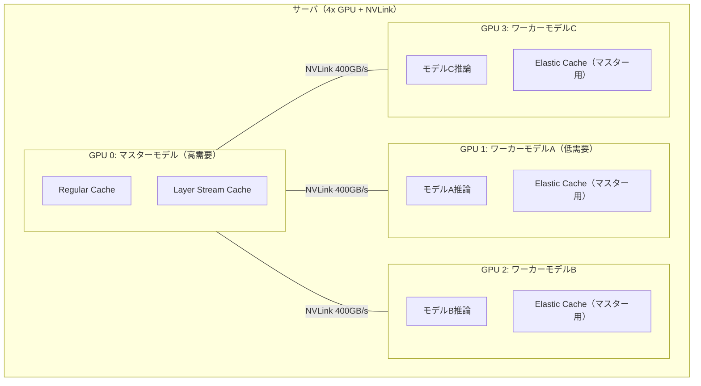

## 論文概要

本記事は [SwiftCache: Efficient LLM Serving for Multi-turn Conversations with Heterogeneous KV Cache Sharing](https://arxiv.org/abs/2606.16135) の解説記事です。

SwiftCacheは、マルチターン会話におけるLLMサービングの2つの課題――KVキャッシュ再読み込みの高レイテンシと、GPU HBM容量に起因する最大コンテキスト長の制限――を解決する協調推論システムである。著者らは、同一サーバ内で稼働する異種LLMモデル間で未使用GPUメモリとNVLink帯域を共有する手法を提案している。実験では、vLLMおよびSGLangと比較してP99 TTFTを最大69%削減し、最大コンテキスト長を最大3.98倍に拡張したと報告されている。

## 情報源

| 項目 | 内容 |
|------|------|
| **arXiv ID** | [2606.16135](https://arxiv.org/abs/2606.16135) |
| **著者** | Jianmin Hu, Minxian Xu, Sa Wang, Chong Ma, Min Shen, Kejiang Ye, Lin Qu, Chengzhong Xu |
| **発表年** | 2026年 |
| **分野** | cs.DC（分散・並列コンピューティング） |
| **実装規模** | Python/Triton 8.6K行 + C++ 1.8K行（計約10.4K行） |

## 背景と動機

マルチターン会話はチャットボットやAIエージェントの基本シナリオであり、会話が進むにつれて過去のトークンが蓄積される。既存システムではKV（Key-Value）ペアをキャッシュして冗長な計算を回避しているが、GPU HBM容量の制約により、KVキャッシュはCPUメモリやSSDにオフロードされることが多い。

著者らは、PCIe経由のKVキャッシュ転送がレイテンシの支配的要因であることを示している。具体的には、5Kトークンのプレフィックスキャッシュ読み込みでPCIe転送がレイテンシの73.2%を占め、50Kトークンでは86.2%に達すると報告している。一方、NVLinkは400 GB/sの双方向帯域を提供し、PCIe 4.0の32 GB/s（4 GPU共有）と比較して桁違いに高速である。

さらに、マルチモデルサービングが一般的な本番環境では、各モデルの負荷は時間帯によって異なり、低需要モデルのGPUメモリが遊んでいるケースが多い。著者らはこの非対称性に着目し、モデル間でGPUメモリを動的に融通する仕組みを設計した。

## 主要な貢献

著者らは以下の4点を主要な貢献として挙げている。

- **異種モデル間KVキャッシュ共有**: 低需要モデルの未使用GPUメモリを高需要モデルのプレフィックスキャッシュストレージとして提供し、NVLink経由でKVキャッシュを共有する仕組みの実現
- **Layer Stream Cache（LSC）**: 現在実行中のレイヤーのKVキャッシュのみをローカルGPUメモリに保持することで、メモリ使用量を大幅に削減し、より長いコンテキスト長での推論を可能にする手法
- **ブロックメジャーレイアウトによるElastic Cache**: O(1)の計算量でキャッシュサイズを動的に変更可能なメモリレイアウトの設計。従来のレイヤーメジャーレイアウトでは $O(n_{\text{layers}} \times n_{\text{blocks}})$ の操作が必要だった
- **実ワークロードでの大幅な性能改善**: P99 TTFT最大69%削減、最大コンテキスト長最大3.98倍拡張を、ワーカーモデルへの影響を最小限（TTFT増加最大9.7%、TPOT増加最大6.5%）に抑えつつ達成

## 技術的詳細

### システムアーキテクチャ

SwiftCacheはマスター・ワーカー型の協調設計を採用している。KVキャッシュ需要が高いモデルを「マスター」、需要が低いモデルを「ワーカー」として、ワーカーの遊休GPUメモリをマスターのプレフィックスキャッシュに転用する。



### KVブロックのメモリフットプリント

著者らは、KVキャッシュの基本単位であるKVブロックのメモリサイズを次式で定義している。

$$
M_{\text{block}} = 2 \times B \times H_{\text{kv}} \times D_{\text{kv}} \times d_{\text{type}}
$$

ここで $B$ はブロックサイズ（トークン数）、$H_{\text{kv}}$ はKVヘッド数、$D_{\text{kv}}$ はヘッドあたりの次元数、$d_{\text{type}}$ はデータ型のバイト数である。

### 3種類のキャッシュ階層

**Regular Cache（RC）** はマスターモデルのローカルGPUメモリに格納される全レイヤーのKVブロックであり、最も低レイテンシでアクセスできる。

**Layer Stream Cache（LSC）** はワーカーGPU上に全レイヤー分のKVブロックを保持しつつ、マスターGPUには現在実行中のレイヤーのKVペアのみをNVLink経由でストリーミングする方式である。ワーカー $i$ が提供可能な全レイヤーブロック数は次式で算出される。

$$
K_i = \left\lfloor \frac{C_{\text{worker}(i)}}{M_{\text{block}} \times L} \right\rfloor
$$

ここで $C_{\text{worker}(i)}$ はワーカー $i$ の空きメモリ容量、$L$ はマスターモデルのレイヤー数である。LSC全体のサイズは以下で決定される。

$$
N_{\text{LSC}} = \min\left(\sum K_i, K_{\text{master}}\right)
$$

**Elastic Cache** はワーカーの負荷変動に応じて動的にサイズを変更可能なキャッシュである。ブロックメジャーレイアウト（shape: `(n_blocks, n_layers, block_elems)`）を採用し、ブロック単位の追加・削除をO(1)で実現している。異種モデル間のブロックサイズ差異を吸収するため、最小弾性単位（MEU）を以下で定義している。

$$
\text{MEU}_m = \frac{\text{lcm}(BE_m, BE_i)}{BE_m}, \quad \text{MEU}_i = \frac{\text{lcm}(BE_m, BE_i)}{BE_i}
$$

ここで $BE_m$, $BE_i$ はそれぞれマスターとワーカーの1ブロックあたりの要素数である。

### KVキャッシュ転送のオーバーヘッド

著者らの実測によると、NVLink経由のKVキャッシュ転送のオーバーヘッドは極めて小さい。Qwen3-32Bにおけるレイテンシ内訳分析では、KVキャッシュのロード時間がプレフィル全体の1.4%未満、ストア時間が1.1%未満であり、パイプライン化により0.1%未満に圧縮されると報告されている。99パーセンタイルのロード時間は11ms、ストア時間は6msであった。

## 実装のポイント

SwiftCacheの実装はPython/Triton（8.6K行）とC++（1.8K行）で構成されている。フロントエンドにFastAPI、GPU間転送にPyTorchの`torch.distributed`、制御メッセージにZeroMQを使用し、FlashAttentionおよびPagedAttentionと統合されている。

以下は、SwiftCacheのLayer Stream Cacheの概念を示す簡易的なPythonコードである。

```python
"""Layer Stream Cache: レイヤー単位のKVキャッシュストリーミング概念実装."""

from dataclasses import dataclass

import torch
import torch.distributed as dist


@dataclass(frozen=True)
class KVBlockConfig:
    """KVブロックの構成パラメータ."""

    block_size: int  # トークン数/ブロック
    num_kv_heads: int
    head_dim: int
    dtype_bytes: int  # fp16=2, bf16=2
    num_layers: int

    @property
    def block_memory_bytes(self) -> int:
        """1ブロックあたりのメモリフットプリント (bytes).

        M_block = 2 * B * H_kv * D_kv * d_type
        """
        return (
            2
            * self.block_size
            * self.num_kv_heads
            * self.head_dim
            * self.dtype_bytes
        )

    def worker_full_layer_blocks(self, free_memory_bytes: int) -> int:
        """ワーカーが提供可能な全レイヤーブロック数 K_i."""
        return free_memory_bytes // (self.block_memory_bytes * self.num_layers)


class LayerStreamScheduler:
    """Layer Stream Cache のスケジューラ概念実装.

    ワーカーGPUに全レイヤー分のKVキャッシュを保持し、
    マスターGPUには実行中レイヤーのKVペアのみをストリーミング。
    """

    def __init__(
        self,
        config: KVBlockConfig,
        master_rank: int,
        worker_ranks: list[int],
    ) -> None:
        self.config = config
        self.master_rank = master_rank
        self.worker_ranks = worker_ranks
        self._layer_buffer: torch.Tensor | None = None

    def prefetch_layer(
        self,
        layer_idx: int,
        worker_rank: int,
        worker_kv_cache: torch.Tensor,
    ) -> torch.Tensor:
        """次レイヤーのKVキャッシュをNVLink経由でプリフェッチ.

        Args:
            layer_idx: 対象レイヤーインデックス
            worker_rank: 送信元ワーカーのGPUランク
            worker_kv_cache: ワーカー上のKVキャッシュテンソル
                             shape: (n_blocks, n_layers, block_elems)

        Returns:
            マスターGPU上のレイヤーKVキャッシュ

        """
        layer_data = worker_kv_cache[:, layer_idx, :]

        if self._layer_buffer is None or self._layer_buffer.shape != layer_data.shape:
            self._layer_buffer = torch.empty_like(
                layer_data,
                device=f"cuda:{self.master_rank}",
            )

        dist.send(tensor=layer_data, dst=self.master_rank, tag=layer_idx)
        dist.recv(tensor=self._layer_buffer, src=worker_rank, tag=layer_idx)

        return self._layer_buffer
```

このコード例はあくまで概念実装であり、実際のSwiftCacheではTritonカーネルによるGPU最適化やZeroMQベースの非同期制御が実装されている。

## Production Deployment Guide

### AWS実装パターン

SwiftCacheの特性を活かした本番デプロイメントでは、NVLink接続を持つマルチGPUインスタンスの選定が最も重要な要素となる。著者らの実験環境（H20 GPU x4, NVLink 400GB/s）に相当するAWS構成を以下に示す。

#### Small構成（開発・検証用）

| 項目 | 仕様 |
|------|------|
| **インスタンスタイプ** | p4d.24xlarge |
| **GPU** | NVIDIA A100 40GB x 8（NVSwitch接続） |
| **用途** | 2-3モデルの同居検証 |
| **月額概算** | 約 $24,000（オンデマンド） |
| **想定スループット** | ~100 req/s（マルチターン会話） |

#### Medium構成（本番・中規模）

| 項目 | 仕様 |
|------|------|
| **インスタンスタイプ** | p5.48xlarge |
| **GPU** | NVIDIA H100 80GB x 8（NVSwitch接続） |
| **用途** | 3-4モデル同居、長コンテキスト対応 |
| **月額概算** | 約 $73,000（オンデマンド）/ ~$44,000（1yr RI） |
| **想定スループット** | ~500 req/s |

#### Large構成（本番・大規模）

| 項目 | 仕様 |
|------|------|
| **インスタンスタイプ** | p5e.48xlarge x 2-4台 |
| **GPU** | NVIDIA H200 141GB x 8/台（NVSwitch接続） |
| **用途** | 高トラフィック、超長コンテキスト |
| **月額概算** | 約 $150,000-$300,000 |
| **想定スループット** | ~2000 req/s |

注意点として、SwiftCacheは現時点でサーバ内NVLinkのみ対応しており、サーバ間のKVキャッシュ共有には対応していない。Large構成では各サーバが独立したSwiftCacheインスタンスとして動作し、ロードバランサで振り分ける形式となる。

### Terraformコード

```hcl
# SwiftCache EKS クラスタ構成
# NVLink対応GPUインスタンスでのマルチモデルサービング

terraform {
  required_version = ">= 1.5"
  required_providers {
    aws = {
      source  = "hashicorp/aws"
      version = "~> 5.0"
    }
  }
}

variable "environment" {
  type    = string
  default = "production"
}

variable "cluster_name" {
  type    = string
  default = "swiftcache-llm-cluster"
}

variable "gpu_instance_type" {
  type        = string
  default     = "p5.48xlarge"
  description = "NVSwitch/NVLink対応GPUインスタンス"

  validation {
    condition     = contains(["p4d.24xlarge", "p5.48xlarge", "p5e.48xlarge"], var.gpu_instance_type)
    error_message = "SwiftCacheにはNVLink/NVSwitch対応インスタンスが必須です。"
  }
}

variable "gpu_node_count" {
  type    = number
  default = 2
}

# --- VPC ---
module "vpc" {
  source  = "terraform-aws-modules/vpc/aws"
  version = "~> 5.0"

  name = "${var.cluster_name}-vpc"
  cidr = "10.0.0.0/16"

  azs             = ["ap-northeast-1a", "ap-northeast-1c"]
  private_subnets = ["10.0.1.0/24", "10.0.2.0/24"]
  public_subnets  = ["10.0.101.0/24", "10.0.102.0/24"]

  enable_nat_gateway   = true
  single_nat_gateway   = false
  enable_dns_hostnames = true

  tags = {
    Environment = var.environment
    System      = "swiftcache"
  }
}

# --- EKS Cluster ---
module "eks" {
  source  = "terraform-aws-modules/eks/aws"
  version = "~> 20.0"

  cluster_name    = var.cluster_name
  cluster_version = "1.31"

  vpc_id     = module.vpc.vpc_id
  subnet_ids = module.vpc.private_subnets

  cluster_endpoint_public_access = true

  eks_managed_node_groups = {
    # GPU Node Group（SwiftCache用）
    gpu-nvlink = {
      name           = "swiftcache-gpu"
      instance_types = [var.gpu_instance_type]
      capacity_type  = "ON_DEMAND"

      min_size     = 1
      max_size     = var.gpu_node_count
      desired_size = var.gpu_node_count

      ami_type = "AL2_x86_64_GPU"

      labels = {
        "nvidia.com/gpu.present" = "true"
        "swiftcache/role"        = "inference"
      }

      taints = [{
        key    = "nvidia.com/gpu"
        value  = "true"
        effect = "NO_SCHEDULE"
      }]

      block_device_mappings = {
        xvda = {
          device_name = "/dev/xvda"
          ebs = {
            volume_size = 500
            volume_type = "gp3"
            throughput  = 500
            iops        = 5000
          }
        }
      }
    }

    # 管理ノード（スケジューラ・モニタリング用）
    system = {
      name           = "system-nodes"
      instance_types = ["m6i.2xlarge"]
      capacity_type  = "ON_DEMAND"

      min_size     = 2
      max_size     = 4
      desired_size = 2

      labels = {
        "swiftcache/role" = "system"
      }
    }
  }

  tags = {
    Environment = var.environment
    System      = "swiftcache"
  }
}

# --- NVIDIA Device Plugin ---
resource "helm_release" "nvidia_device_plugin" {
  name       = "nvidia-device-plugin"
  repository = "https://nvidia.github.io/k8s-device-plugin"
  chart      = "nvidia-device-plugin"
  namespace  = "kube-system"
  version    = "0.17.0"

  set {
    name  = "gfd.enabled"
    value = "true"
  }

  depends_on = [module.eks]
}

# --- CloudWatch Observability ---
resource "helm_release" "cloudwatch_observability" {
  name       = "amazon-cloudwatch-observability"
  repository = "https://aws.github.io/eks-charts"
  chart      = "amazon-cloudwatch-observability"
  namespace  = "amazon-cloudwatch"
  version    = "3.0.0"

  create_namespace = true

  set {
    name  = "clusterName"
    value = var.cluster_name
  }

  depends_on = [module.eks]
}

# --- S3 for KV Cache Overflow (optional) ---
resource "aws_s3_bucket" "kv_cache_overflow" {
  bucket = "${var.cluster_name}-kv-cache-overflow"

  tags = {
    Environment = var.environment
    Purpose     = "KV cache overflow storage"
  }
}

resource "aws_s3_bucket_lifecycle_configuration" "kv_cache_ttl" {
  bucket = aws_s3_bucket.kv_cache_overflow.id

  rule {
    id     = "expire-old-cache"
    status = "Enabled"

    expiration {
      days = 1
    }
  }
}

output "cluster_endpoint" {
  value = module.eks.cluster_endpoint
}

output "cluster_name" {
  value = module.eks.cluster_name
}
```

### Kubernetes Deployment マニフェスト

```yaml
# swiftcache-deployment.yaml
apiVersion: apps/v1
kind: Deployment
metadata:
  name: swiftcache-master
  namespace: llm-serving
  labels:
    app: swiftcache
    role: master
spec:
  replicas: 1
  selector:
    matchLabels:
      app: swiftcache
      role: master
  template:
    metadata:
      labels:
        app: swiftcache
        role: master
    spec:
      nodeSelector:
        swiftcache/role: inference
      tolerations:
        - key: "nvidia.com/gpu"
          operator: "Exists"
          effect: "NoSchedule"
      containers:
        - name: swiftcache
          image: your-registry/swiftcache:latest
          ports:
            - containerPort: 8000
              name: http
            - containerPort: 9090
              name: metrics
          env:
            - name: SWIFTCACHE_ROLE
              value: "master"
            - name: SWIFTCACHE_MASTER_MODEL
              value: "Qwen3-32B"
            - name: SWIFTCACHE_WORKER_MODELS
              value: "Qwen3-8B,Qwen3-14B"
            - name: CUDA_VISIBLE_DEVICES
              value: "0,1,2,3"
          resources:
            limits:
              nvidia.com/gpu: 4
            requests:
              memory: "64Gi"
              cpu: "16"
          readinessProbe:
            httpGet:
              path: /health
              port: 8000
            initialDelaySeconds: 120
            periodSeconds: 10
          livenessProbe:
            httpGet:
              path: /health
              port: 8000
            initialDelaySeconds: 180
            periodSeconds: 30
```

### 運用・監視設定

SwiftCacheの運用では、以下のメトリクスを重点的に監視する必要がある。

```yaml
# prometheus-rules.yaml
apiVersion: monitoring.coreos.com/v1
kind: PrometheusRule
metadata:
  name: swiftcache-alerts
  namespace: llm-serving
spec:
  groups:
    - name: swiftcache.rules
      interval: 15s
      rules:
        - alert: HighP99TTFT
          expr: |
            histogram_quantile(0.99,
              rate(swiftcache_ttft_seconds_bucket[5m])
            ) > 5.0
          for: 5m
          labels:
            severity: warning
          annotations:
            summary: "P99 TTFT exceeds 5s threshold"

        - alert: WorkerMemoryPressure
          expr: |
            swiftcache_worker_donated_memory_ratio > 0.85
          for: 10m
          labels:
            severity: critical
          annotations:
            summary: "Worker GPU memory donation exceeds 85%"

        - alert: NVLinkBandwidthSaturation
          expr: |
            rate(swiftcache_nvlink_bytes_transferred[1m])
              / swiftcache_nvlink_max_bandwidth > 0.90
          for: 3m
          labels:
            severity: warning
          annotations:
            summary: "NVLink bandwidth utilization above 90%"

        - alert: CacheHitRateLow
          expr: |
            rate(swiftcache_cache_hits_total[10m])
              / rate(swiftcache_cache_requests_total[10m]) < 0.5
          for: 15m
          labels:
            severity: info
          annotations:
            summary: "Cache hit rate below 50%"
```

### コスト最適化チェックリスト

SwiftCacheを本番運用する際のコスト最適化項目を以下に示す。著者らの報告に基づく設計判断と、AWS固有の最適化を組み合わせている。

**インスタンス選定**

1. NVLink/NVSwitch対応インスタンス（p4d/p5/p5e）を選定すること。PCIe接続のみのインスタンス（g5等）ではSwiftCacheの性能優位が発揮されない
2. Savings Plans（1年/3年）またはReserved Instancesを検討する。p5.48xlargeで最大40%のコスト削減が見込める
3. ワーカーモデルの負荷パターンを分析し、深夜帯に余剰GPUが増える場合はスケジュールベースのスケーリングを設定する
4. Capacity Reservationsを使用し、GPUインスタンスの可用性を確保する
5. 複数リージョンの価格差を比較し、レイテンシ要件が許す範囲で低コストリージョンを選択する

**メモリ管理**

6. ワーカーモデルへの影響がTTFT増加10%以内に収まるようElastic Cacheの上限を設定する（著者らの報告ではQwen3-14Bで最大9.7%）
7. KVキャッシュの有効期限（TTL）を会話セッションのタイムアウトに合わせて設定し、不要なキャッシュを早期解放する
8. ブロックサイズをモデル構成に応じて最適化する。著者らの実験ではブロックサイズ16が使用されている
9. Elastic CacheのMEU計算でメモリフラグメンテーションが最小化される組み合わせを事前検証する
10. S3へのKVキャッシュオーバーフロー設定は、超長コンテキスト（100K+トークン）のバーストトラフィック対応のみに限定する

**ネットワーク・通信**

11. NVLink帯域の使用率を常時監視し、90%超が持続する場合はモデル配置を再検討する
12. ZeroMQ制御メッセージのポーリング間隔を負荷に応じて調整する
13. GPU間のNUMAアフィニティを最適化し、CPUとGPUの通信パスを短縮する

**スケーリング**

14. HPAのメトリクスにP99 TTFTとキャッシュヒット率を組み込み、需要に応じた自動スケーリングを実現する
15. マスター・ワーカーの役割を負荷パターンに応じて動的に切り替える仕組みを検討する
16. 時間帯別のトラフィックパターンを分析し、CronHPAで予測的スケーリングを設定する

**モデル配置**

17. 共有率の高いモデルペアを同一ノードに配置する。著者らの実験ではShareGPTワークロードで90.7%のキャッシュヒット率が報告されている
18. モデルごとのKVキャッシュフットプリント（Qwen3-8B: 0.141 MB/token、Qwen3-32B: 0.25 MB/token）を考慮してGPU割り当てを最適化する
19. 新しいモデルの追加時はElastic CacheのMEU互換性を事前検証する

**運用**

20. CloudWatch Container Insightsを有効化し、GPU使用率・メモリ使用率・NVLink帯域のダッシュボードを構築する
21. コスト異常検知（AWS Cost Anomaly Detection）を設定し、GPU使用量の急増を早期に検知する
22. Spot Instancesはワーカーモデルにのみ適用を検討する（マスターモデルのキャッシュ喪失は性能劣化に直結するため非推奨）
23. ログレベルをproduction環境ではWARN以上に制限し、CloudWatch Logsのコストを抑制する
24. 定期的にキャッシュヒット率と実際のレイテンシ改善効果を測定し、ROIが閾値を下回る場合はSwiftCacheを無効化して標準のvLLM/SGLang構成に切り替える判断基準を設ける

## 実験結果

著者らは4台のNVIDIA H20 GPU（各96 GB、NVLink 400 GB/s）上で、ShareGPT（90K件のマルチターン会話）およびL-Eval（500件以上の長コンテキストタスク）を用いて評価を実施している。ベースラインはvLLM v0.14.0（LMCache v0.3.15併用）およびSGLang v0.5.3（HiCache併用）である。

### P99 TTFT改善

| ベースライン | ShareGPT | L-Eval |
|-------------|----------|--------|
| vs. SGLang (HiCache) | **67%削減** | **69%削減** |
| vs. vLLM (LMCache) | **54%削減** | **58%削減** |

### 最大コンテキスト長拡張

| GPU | HBM容量 | 拡張倍率 |
|-----|---------|---------|
| NVIDIA H20 | 96 GB | **3.98倍** |
| NVIDIA A100 | 80 GB | 約2.5倍 |
| NVIDIA V100 | 32 GB | 約1.81倍 |
| NVIDIA L4 | 24 GB | 約1.58倍 |

### ワーカーモデルへの影響

著者らは、ワーカーモデルへの干渉が限定的であると報告している。Qwen3-14Bをワーカーとした場合、TTFT増加は最大9.7%、TPOT（Time Per Output Token）増加は最大6.5%にとどまる。NVLink経由のKVキャッシュ転送オーバーヘッドは、パイプライン化によりプレフィル全体の0.1%未満に抑えられている。

ShareGPTワークロードにおけるプレフィックスキャッシュヒット率は90.7%であり、マルチターン会話での有効性が確認されている。一方、要約タスク（6.3%）やコード補完（0.1%）ではヒット率が低く、ワークロード特性に応じた適用判断が必要である。

## 実運用への応用

SwiftCacheのアプローチは、以下のシナリオで特に有効であると考えられる。

**マルチモデルチャットサービス**: 複数のLLMを同一サーバで提供するSaaS基盤において、モデル間の負荷差を活用してコスト効率を向上させられる。著者らの報告するShareGPTでの90.7%キャッシュヒット率は、チャットボットユースケースでの高い実効性を示唆している。

**長期会話セッション**: AIエージェントや顧客サポートなど、数十ターンに及ぶ会話では、コンテキスト長の3.98倍拡張によりコンテキストウィンドウの制約を大幅に緩和できる。[関連Zenn記事](https://zenn.dev/0h_n0/articles/a2ff7f18b0266b)で議論されているマルチターン会話でのトークンコスト累積問題に対しても、プレフィックスキャッシュの再計算回避は直接的な解決策となりうる。

**制約と注意点**: 現時点ではサーバ内NVLink接続のみ対応であり、マルチサーバ構成では各サーバが独立したSwiftCacheインスタンスとして動作する。また、NVLink非搭載のGPU構成（PCIe接続のみ）では本手法の恩恵は得られない。ワークロード特性によってはキャッシュヒット率が低くなるケースがあり（要約タスク6.3%、コード補完0.1%）、導入前のワークロード分析が不可欠である。

## 関連研究

KVキャッシュ最適化の分野では、CachedAttention、Mooncake、Pensieveなどの先行研究がKVキャッシュの再利用に取り組んでいる。長コンテキスト推論ではチャンク化プレフィルやElastic Sequence Parallelismが提案されている。マルチモデルサービングではDistServe、Splitwise、AlpaServeが異なるアプローチを取っている。

著者らは、SwiftCacheの独自性として「異種モデル間のNVLink経由でのKVキャッシュ共有」を挙げている。既存研究が同一モデルの複数インスタンスや同一アーキテクチャ間の共有に留まっていたのに対し、SwiftCacheは異なるモデル構成間でのメモリ融通を実現している点が差別化要素であると主張している。

## まとめ

SwiftCacheは、マルチモデルLLMサービングにおける異種モデル間のGPUメモリ共有という実用的な課題に対して、NVLinkとレイヤーストリーミングを組み合わせた解決策を提示している。P99 TTFT最大69%削減、最大コンテキスト長3.98倍拡張という結果は、マルチターン会話シナリオにおける実効性を示している。一方、サーバ内NVLink接続への依存やワークロード依存のキャッシュヒット率といった制約があり、適用範囲を見極めた上での導入判断が求められる。

## 参考文献

1. Hu, J., Xu, M., Wang, S., Ma, C., Shen, M., Ye, K., Qu, L., Xu, C. (2026). SwiftCache: Efficient LLM Serving for Multi-turn Conversations with Heterogeneous KV Cache Sharing. arXiv:2606.16135. [https://arxiv.org/abs/2606.16135](https://arxiv.org/abs/2606.16135)
2. vLLM Project. [https://github.com/vllm-project/vllm](https://github.com/vllm-project/vllm)
3. SGLang Project. [https://github.com/sgl-project/sglang](https://github.com/sgl-project/sglang)
4. LMCache Project. [https://github.com/LMCache/LMCache](https://github.com/LMCache/LMCache)
5. Dao, T. (2024). FlashAttention-2: Faster Attention with Better Parallelism and Work Partitioning. ICLR 2024.
6. Kwon, W., et al. (2023). Efficient Memory Management for Large Language Model Serving with PagedAttention. SOSP 2023.
