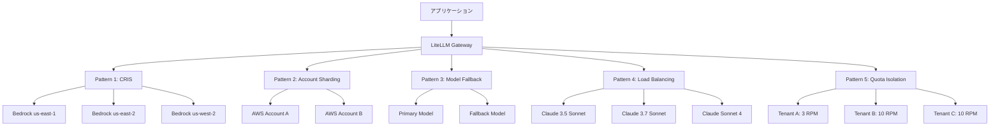

## ブログ概要（Summary）

本記事は [Implementing resilience patterns with Amazon Bedrock and LLM gateway](https://aws.amazon.com/blogs/machine-learning/implementing-resilience-patterns-with-amazon-bedrock-and-llm-gateway/) の解説記事です。

AWS公式MLブログでは、LLMを本番運用する際に直面する可用性・レイテンシ・コスト・スループットの4つの課題に対し、LLMゲートウェイ（LiteLLM）とAmazon Bedrockを組み合わせた5つの耐障害性パターンが紹介されている。Cross-Region Inference、アカウントシャーディング、モデルフォールバック、負荷分散、マルチテナントクォータ分離の各パターンを段階的に導入することで、単一障害点を排除しつつ運用コストを最適化するアプローチが説明されている。

この記事は [Zenn記事: OpenAI・Anthropic・Gemini会話管理パターン比較と統一設計](https://zenn.dev/0h_n0/articles/a2ff7f18b0266b) の深掘りです。

## 情報源

- **種別**: 企業テックブログ（AWS Machine Learning Blog）
- **URL**: [https://aws.amazon.com/blogs/machine-learning/implementing-resilience-patterns-with-amazon-bedrock-and-llm-gateway/](https://aws.amazon.com/blogs/machine-learning/implementing-resilience-patterns-with-amazon-bedrock-and-llm-gateway/)
- **組織**: Amazon Web Services（著者: Marcos Ortiz, Khubyar Behramsha, Sushovan Basak）
- **発表日**: 2026年6月30日

## 技術的背景（Technical Background）

LLMの本番運用では、単一モデル・単一リージョンへの依存が重大なリスクとなる。ブログでは、LLM推論基盤の設計で考慮すべき4つのアーキテクチャ次元として、**可用性**（障害時の推論継続）、**応答時間**（Time to First Token / Time to Last Token）、**コスト**（トークン単価・リクエスト単価の最適化）、**スループット**（同時リクエスト数・秒間トークン数）が挙げられている。

これらの課題に対し、LLMゲートウェイが統一的なプロキシ層として機能する。ブログではLiteLLMというオープンソースのゲートウェイを使用し、Amazon Bedrock、Anthropic、OpenAI、Cohere、Vertex AIといった複数プロバイダへのリクエストルーティングを一元管理するアーキテクチャが紹介されている。ゲートウェイ層の導入により、アプリケーションコードを変更することなく、バックエンドのモデルやプロバイダを柔軟に切り替えることが可能になると説明されている。

## 実装アーキテクチャ（Architecture）

ブログで紹介されている5つの耐障害性パターンは、"crawl, walk, run"（段階的導入）のアプローチに沿って設計されている。ネイティブなBedrock機能から始め、複雑なマルチモデルオーケストレーションへと段階的に進化させることで、アプリケーションの成熟度に応じた導入が可能であると説明されている。



### Pattern 1: Cross-Region Inference（CRIS）

Amazon Bedrockのネイティブ機能であるCRISは、リアルタイムの可用性・レイテンシ・需要状況に基づき、ソースリージョンから最適な宛先リージョンへリクエストを自動ルーティングする。ブログのデモでは、10リクエストが us-east-1（10%）、us-east-2（70%）、us-west-2（20%）に分散された結果が示されている。

CRISプロファイルは地理的に制限されており（US、EU）、データレジデンシを維持しながら単一リージョンのクォータを超えるスループットを実現する。グローバルCross-Region Inferenceプロファイルを使用すれば、複数の商用リージョンにまたがるリクエスト分散も可能であるが、レイテンシが高くなる可能性があると説明されている。

### Pattern 2: AWSアカウントシャーディング

複数のAWSアカウントにリクエストを分散し、各アカウントが独立したクォータとCRISプロファイルを持つことで、自然な障害分離境界を構築する。ブログでは、あるアカウントで問題が発生しても他のアカウントに影響しない点が強調されている。デモでは2つのアカウントがそれぞれ独立して10リクエストを分散処理し、異なるリージョンルーティングパターンを示した。

### Pattern 3: モデルフォールバック

レート制限超過や障害発生時に、プライマリモデルからセカンダリモデルへ自動フェイルオーバーする。ブログのデモでは、プライマリモデルに3 RPM（Requests Per Minute）の制限を設定し、フォールバックモデルに25 RPMの容量を確保した構成が紹介されている。10リクエスト中3件がプライマリに、残り7件がフォールバックにルーティングされ、100%の成功率が達成された。

なお、ブログではAmazon Bedrock Intelligent Prompt Routingが品質とコストの最適化をネイティブに提供するオプションとして言及されている。

### Pattern 4: 負荷分散（Load Balancing）

シャッフル戦略により、複数モデルインスタンスにリクエストを分散する。A/Bテストやリソース最適化に有効であるとされている。デモでは、3 RPMのプライマリモデル2台とフォールバックモデル1台（25 RPM）の構成で、10の同時リクエストが100%成功し、Claude 3.5 Sonnet（40%）、Claude 3.7 Sonnet（30%）、Claude Sonnet 4（30%）に分散された。

### Pattern 5: マルチテナントクォータ分離

コンシューマごとに独立したレート制限バケットを設定し、「ノイジーネイバー」問題を防止する。デモでは、Consumer A（3 RPM、60%成功）、Consumer B（10 RPM、100%成功）、Consumer C（10 RPM、100%成功）という異なるクォータ設定が示され、テナント間の干渉がないことが確認されている。

## Production Deployment Guide

### AWS実装パターン（コスト最適化重視）

ブログで紹介されたパターンをAWSで本番運用する際の、トラフィック量別の推奨構成を以下に示す。

**Small構成（~100 req/日）: Lambda + Bedrock + LiteLLM Serverless**

| サービス | 役割 | 月額概算 |
|---------|------|---------|
| Lambda | LiteLLMプロキシ実行 | $5-15 |
| Bedrock | LLM推論（CRIS有効） | $30-100 |
| DynamoDB | クォータ管理・ログ | $5-10 |
| CloudWatch | 監視・アラート | $5-10 |
| **合計** | | **$45-135** |

**Medium構成（~1,000 req/日）: ECS Fargate + ALB + Bedrock**

| サービス | 役割 | 月額概算 |
|---------|------|---------|
| ECS Fargate（2 task） | LiteLLMプロキシ | $60-120 |
| ALB | ロードバランサ | $20-30 |
| Bedrock（マルチリージョン） | LLM推論（CRIS + フォールバック） | $200-500 |
| ElastiCache | レート制限状態管理 | $30-50 |
| CloudWatch | 監視・ダッシュボード | $10-20 |
| **合計** | | **$320-720** |

**Large構成（10,000+ req/日）: EKS + Spot + マルチアカウント**

| サービス | 役割 | 月額概算 |
|---------|------|---------|
| EKS + Karpenter | LiteLLMクラスタ（Spot優先） | $200-500 |
| Bedrock（マルチアカウント・マルチリージョン） | LLM推論（5パターン全適用） | $1,500-3,500 |
| WAF | APIセキュリティ | $20-50 |
| Secrets Manager | APIキー管理 | $5-15 |
| CloudWatch + X-Ray | 監視・トレーシング | $30-60 |
| **合計** | | **$1,755-4,125** |

なお、上記は記事生成時点のAWS料金に基づく概算値であり、実際のコストはトラフィックパターン、リージョン、バースト使用量により変動する。最新料金はAWS料金計算ツールで確認を推奨する。

### Terraformインフラコード

**CRIS設定（Pattern 1）**:

```hcl
# Cross-Region Inference Profile for Bedrock
resource "aws_bedrock_inference_profile" "cris_us" {
  inference_profile_name = "llm-gateway-cris-us"
  description            = "US Cross-Region Inference Profile"
  type                   = "SYSTEM_DEFINED"

  model_source {
    copy_from = "arn:aws:bedrock:us-east-1::foundation-model/anthropic.claude-sonnet-4-20250514-v1:0"
  }

  tags = {
    Environment = "production"
    Pattern     = "cris"
  }
}

# CloudWatch alarm for CRIS latency monitoring
resource "aws_cloudwatch_metric_alarm" "cris_latency" {
  alarm_name          = "bedrock-cris-latency-high"
  comparison_operator = "GreaterThanThreshold"
  evaluation_periods  = 3
  metric_name         = "InvocationLatency"
  namespace           = "AWS/Bedrock"
  period              = 60
  statistic           = "p99"
  threshold           = 10000
  alarm_description   = "CRIS p99 latency exceeds 10s"
  alarm_actions       = [aws_sns_topic.alerts.arn]

  dimensions = {
    ModelId = aws_bedrock_inference_profile.cris_us.inference_profile_arn
  }
}
```

**LiteLLMプロキシ ECS Fargate デプロイ（Medium構成）**:

```hcl
# ECS Cluster for LiteLLM Gateway
resource "aws_ecs_cluster" "llm_gateway" {
  name = "llm-gateway-cluster"
  setting { name = "containerInsights"; value = "enabled" }
}

# LiteLLM Task Definition (Fargate, 1vCPU, 2GB)
resource "aws_ecs_task_definition" "litellm" {
  family                   = "litellm-proxy"
  network_mode             = "awsvpc"
  requires_compatibilities = ["FARGATE"]
  cpu                      = "1024"
  memory                   = "2048"
  execution_role_arn       = aws_iam_role.ecs_execution.arn
  task_role_arn            = aws_iam_role.litellm_task.arn

  container_definitions = jsonencode([{
    name  = "litellm"
    image = "ghcr.io/berriai/litellm:main-latest"
    portMappings = [{ containerPort = 4000, protocol = "tcp" }]
    secrets = [
      { name = "AWS_ACCESS_KEY_ID",     valueFrom = "${aws_secretsmanager_secret.bedrock_creds.arn}:access_key::" },
      { name = "AWS_SECRET_ACCESS_KEY", valueFrom = "${aws_secretsmanager_secret.bedrock_creds.arn}:secret_key::" }
    ]
    logConfiguration = {
      logDriver = "awslogs"
      options   = { "awslogs-group" = aws_cloudwatch_log_group.litellm.name, "awslogs-region" = var.aws_region, "awslogs-stream-prefix" = "litellm" }
    }
  }])
}

# ECS Service (desired_count=2, ALB連携)
resource "aws_ecs_service" "litellm" {
  name            = "litellm-proxy"
  cluster         = aws_ecs_cluster.llm_gateway.id
  task_definition = aws_ecs_task_definition.litellm.arn
  desired_count   = 2
  launch_type     = "FARGATE"
  network_configuration {
    subnets         = var.private_subnet_ids
    security_groups = [aws_security_group.litellm.id]
  }
  load_balancer {
    target_group_arn = aws_lb_target_group.litellm.arn
    container_name   = "litellm"
    container_port   = 4000
  }
}
```

**マルチアカウント IAMロール（Pattern 2）**:

```hcl
# Cross-account assume role for Bedrock access
resource "aws_iam_role" "bedrock_cross_account" {
  name = "bedrock-cross-account-role"

  assume_role_policy = jsonencode({
    Version = "2012-10-17"
    Statement = [
      {
        Effect = "Allow"
        Principal = {
          AWS = var.gateway_account_role_arn
        }
        Action = "sts:AssumeRole"
        Condition = {
          StringEquals = {
            "sts:ExternalId" = var.external_id
          }
        }
      }
    ]
  })
}

resource "aws_iam_role_policy" "bedrock_invoke" {
  name = "bedrock-invoke-policy"
  role = aws_iam_role.bedrock_cross_account.id

  policy = jsonencode({
    Version = "2012-10-17"
    Statement = [
      {
        Effect   = "Allow"
        Action   = [
          "bedrock:InvokeModel",
          "bedrock:InvokeModelWithResponseStream"
        ]
        Resource = "arn:aws:bedrock:*::foundation-model/*"
      }
    ]
  })
}
```

### LiteLLMプロキシ設定（5パターン統合）

ブログのデモで示されたパターンをLiteLLMの設定ファイルで統合すると、以下のような構成になると考えられる。

```yaml
# litellm_config.yaml - 5パターン統合構成
model_list:
  # Pattern 1: CRIS対応モデル（プライマリ）
  - model_name: claude-sonnet-primary
    litellm_params:
      model: bedrock/anthropic.claude-sonnet-4-20250514-v1:0
      aws_region_name: us-east-1
    model_info:
      id: "cris-primary"

  # Pattern 2: アカウントシャーディング
  - model_name: claude-sonnet-account-b
    litellm_params:
      model: bedrock/anthropic.claude-sonnet-4-20250514-v1:0
      aws_region_name: us-east-1
      aws_access_key_id: "os.environ/ACCOUNT_B_ACCESS_KEY"
      aws_secret_access_key: "os.environ/ACCOUNT_B_SECRET_KEY"
    model_info:
      id: "account-b-primary"

  # Pattern 3: モデルフォールバック
  - model_name: claude-sonnet-fallback
    litellm_params:
      model: bedrock/anthropic.claude-3-5-sonnet-20241022-v2:0
      aws_region_name: us-west-2
    model_info:
      id: "fallback-model"

router_settings:
  # Pattern 4: 負荷分散（シャッフル戦略）
  routing_strategy: "shuffle"
  num_retries: 3
  timeout: 30
  retry_after: 5
  # Pattern 3: フォールバックチェーン
  fallbacks:
    - claude-sonnet-primary: [claude-sonnet-fallback]
    - claude-sonnet-account-b: [claude-sonnet-fallback]

# Pattern 5: マルチテナントクォータ分離
litellm_settings:
  max_budget: 100
  budget_duration: "monthly"
  
general_settings:
  master_key: "os.environ/LITELLM_MASTER_KEY"
  database_url: "os.environ/DATABASE_URL"
```

### 運用・監視設定

**CloudWatch Logs Insights クエリ**（レイテンシ分析・モデル別分散確認）:

```sql
-- Bedrockリクエストのレイテンシ分布（p50/p95/p99）
fields @timestamp, @message
| filter @message like /InvocationLatency/
| stats avg(invocation_latency) as avg_latency,
        pct(invocation_latency, 95) as p95,
        pct(invocation_latency, 99) as p99
  by bin(1h) as time_bucket
| sort time_bucket desc
```

**CloudWatch アラーム**（主要2件）:

```hcl
# Bedrockスロットリング検知（5分間で10回超過時）
resource "aws_cloudwatch_metric_alarm" "bedrock_throttle" {
  alarm_name          = "bedrock-throttling-rate"
  comparison_operator = "GreaterThanThreshold"
  evaluation_periods  = 2
  metric_name         = "InvocationThrottles"
  namespace           = "AWS/Bedrock"
  period              = 300
  statistic           = "Sum"
  threshold           = 10
  alarm_actions       = [aws_sns_topic.alerts.arn]
}
```

**X-Rayトレーシング**: `aws_xray_sdk` の `patch_all()` でboto3を自動計装し、モデルID・パターン種別をアノテーション、トークン使用量をメタデータとして記録することで、リクエストフローの可視化とコスト按分が可能になる。

### コスト最適化チェックリスト

**アーキテクチャ選択**:
- [ ] トラフィック量に応じた構成を選択（Small: Serverless / Medium: Fargate / Large: EKS）
- [ ] CRISプロファイルの地理的制約を確認（US/EU/Global）
- [ ] アカウントシャーディングの必要性を評価（クォータ上限の確認）
- [ ] フォールバック先モデルのコスト差を比較

**リソース最適化**:
- [ ] EKS利用時はSpot Instances優先（Karpenter設定で最大90%削減）
- [ ] ECS Fargateの場合、Savings Plansを検討（最大50%削減）
- [ ] LiteLLMプロキシのCPU/メモリを実測値に基づき調整
- [ ] 夜間・休日のオートスケール最小値を引き下げ
- [ ] NAT Gatewayのコストを確認（VPC Endpointで代替可能か）

**LLMコスト削減**:
- [ ] Bedrock Batch APIの適用可能な処理を特定（最大50%削減）
- [ ] Prompt Cachingの有効化を検討（最大90%削減）
- [ ] 用途別のモデル選択ロジック実装（高品質 vs コスト優先）
- [ ] 入出力トークン上限の適切な設定
- [ ] Bedrock Intelligent Prompt Routingの活用を検討
- [ ] 不要なシステムプロンプトの削減

**監視・アラート**:
- [ ] AWS Budgetsで月次予算アラートを設定
- [ ] CloudWatch Anomaly Detectionでコスト異常を自動検知
- [ ] モデル別・テナント別のコスト按分ダッシュボードを構築
- [ ] スロットリング率の監視と閾値設定
- [ ] 日次コストレポートをSNS/Slackに通知

**リソース管理**:
- [ ] 未使用のBedrock Provisioned Throughputを解除
- [ ] CloudWatch Logsの保持期間を適切に設定（例: 30日）
- [ ] テスト環境のリソースにライフサイクルポリシーを設定
- [ ] タグ戦略の統一（Environment, Team, Pattern, CostCenter）
- [ ] 定期的なコストレビュー会議の設定（月次）

## パフォーマンス最適化

ブログで示されたデモ結果から、各パターンの効果を以下のように整理できる。

CRISによるリージョン分散では、Bedrockがリアルタイムの負荷状況に基づきルーティングするため、特定リージョンの混雑を回避できる。デモでは us-east-2 に70%のリクエストが集中しており、当該時点で最も応答が高速だったリージョンに動的にルーティングされたことが示されている。

負荷分散パターンでは、シャッフル戦略により複数モデル間でリクエストが均等に分散され、個々のモデルのレート制限に到達するまでの時間を延長できる。フォールバックとの組み合わせにより、プライマリモデルのRPM上限（デモでは3 RPM x 2台 = 6 RPM）を超過した場合でも、フォールバックモデル（25 RPM）が受け止め、全体として100%の成功率が維持されている。

ただし、フォールバック先のモデルが異なる場合、出力品質やレイテンシに差が生じる可能性がある点に注意が必要である。

## 運用での学び

ブログから読み取れる運用上の知見として、以下の点が挙げられる。

第一に、パターンの段階的導入が推奨されている。"crawl, walk, run"のアプローチにより、まずCRIS単体から始め、必要に応じてアカウントシャーディングやフォールバックを追加する。全パターンを一度に導入するのではなく、アプリケーションの成熟度に合わせた段階的な導入が現実的である。

第二に、ノイジーネイバー問題への対処としてテナント別クォータ分離が重要である。SaaS環境では特定テナントの大量リクエストが他テナントの可用性を損なうリスクがあり、Pattern 5の適用が不可欠となる。

第三に、ブログではAWS公式のMulti-Provider Generative AI Gatewayソリューションが本番環境向けの選択肢として紹介されている。ECS/EKS上のコンテナ化デプロイ、WAF保護、Secrets Manager連携、CloudWatch監視が統合された構成であり、LiteLLMのローカル実行から本番移行する際の参考になる。

## 学術研究との関連

LLMゲートウェイによる耐障害性パターンは、分散システムにおけるサーキットブレーカー、バルクヘッド、リトライといった耐障害性パターン（Nygard, "Release It!", 2018）を基盤としている。特にアカウントシャーディングはバルクヘッドパターンの、モデルフォールバックはサーキットブレーカーパターンのLLMドメインへの適用と捉えることができる。マルチテナントクォータ分離はFairness-aware resource allocationの実践例であり、クラウドコンピューティングにおけるQoS保証の研究とも関連する。

## まとめ

ブログでは、LLMの本番運用で直面する可用性・コスト・スループットの課題に対し、LiteLLMゲートウェイとAmazon Bedrockを組み合わせた5つの耐障害性パターンが体系的に紹介されている。各パターンは独立して適用可能であり、段階的導入によりリスクを最小化しながら耐障害性を強化できる。特にCRISとモデルフォールバックの組み合わせは、コード変更なしで実現できる即効性の高い施策であると考えられる。実際の導入にあたっては、ブログの[GitHubリポジトリ](https://github.com/aws-samples/sample-resilient-llm-inference)のコードサンプルを参照されたい。

## 参考文献

- **AWS Blog**: [Implementing resilience patterns with Amazon Bedrock and LLM gateway](https://aws.amazon.com/blogs/machine-learning/implementing-resilience-patterns-with-amazon-bedrock-and-llm-gateway/)
- **GitHub**: [aws-samples/sample-resilient-llm-inference](https://github.com/aws-samples/sample-resilient-llm-inference)
- **LiteLLM**: [https://github.com/BerriAI/litellm](https://github.com/BerriAI/litellm)
- **AWS Solution**: [Multi-Provider Generative AI Gateway](https://aws.amazon.com/solutions/)
- **Related Zenn article**: [OpenAI・Anthropic・Gemini会話管理パターン比較と統一設計](https://zenn.dev/0h_n0/articles/a2ff7f18b0266b)
