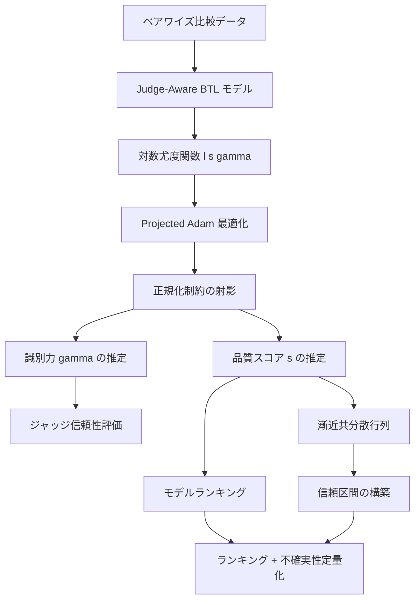

## 論文概要（Abstract）

LLMの性能を比較する際、正解ラベルのないオープンエンドタスクでは「LLM-as-Judge」が広く使われている。しかしジャッジLLM間の信頼性には大きな差があり、全ジャッジを等しく扱うとランキングにバイアスが生じ、信頼区間も誤校正となる。本論文はBradley-Terry-Luce（BTL）モデルをジャッジ固有の識別力パラメータで拡張し、モデルの潜在品質スコアとジャッジの信頼性を正解ラベルなしで同時推定するフレームワークを提案している。著者らは最尤推定量の同定可能性・一貫性・漸近正規性を理論的に証明し、複数のベンチマークで人間評価との一致率向上とデータ効率の改善を報告している。

本記事は [https://arxiv.org/abs/2601.21817](https://arxiv.org/abs/2601.21817) の解説記事です。

この記事は [Zenn記事: Embeddingモデルの精度評価を自社データで実践する：500ペア評価・合成データ・LLM-as-Judge](https://zenn.dev/0h_n0/articles/adcdb688d73a8b) の深掘りです。

## 情報源

- **arXiv ID**: 2601.21817
- **URL**: [https://arxiv.org/abs/2601.21817](https://arxiv.org/abs/2601.21817)
- **著者**: Mingyuan Xu, Xinzi Tan, Jiawei Wu, Doudou Zhou
- **発表年**: 2026（ICML 2026 Poster採択）
- **分野**: stat.ML, cs.LG
- **会議**: ICML 2026（Poster, Hall A #2206）

## 背景と動機（Background & Motivation）

LLMの出力品質を人手で評価するコストは高く、スケーラビリティに課題がある。そこで別のLLMをジャッジとして用いる「LLM-as-Judge」パラダイムが普及した。Chatbot ArenaやAlpacaEvalなどのリーダーボードでは、ペアワイズ比較によるBradley-Terryモデルがランキング基盤として使われている。

しかし、ジャッジLLM間の信頼性には無視できない差がある。例えば、高性能なGPT-4系モデルと小規模なオープンソースモデルでは、同じ比較タスクでも判定の質が大きく異なる。従来のBTLモデルは全ジャッジを等しく扱うため、信頼性の低いジャッジのノイズが高信頼ジャッジの情報を希釈し、ランキングにバイアスを生じさせる。さらに、均一ジャッジ仮定のもとで構築した信頼区間はカバレッジが不足する（サンプルサイズが増えてもアンダーカバレッジが改善しない）という統計的問題も著者らは指摘している。

本論文は、この「ジャッジ間の異質性」を確率モデルに明示的に組み込むことで、ランキング精度と不確実性定量化の両面を改善するフレームワークを提示している。

## 主要な貢献（Key Contributions）

- **ジャッジ固有識別力パラメータの導入**: BTLモデルに各ジャッジの識別力 $\gamma_k > 0$ を導入し、信頼性の低いジャッジを尤度関数内で自動的に重み低下させる仕組みを構築
- **理論的保証の確立**: 最尤推定量の同定可能性（Theorem 3.2）、一貫性と漸近正規性（Theorem 3.4）を厳密に証明し、信頼区間の校正を保証
- **実用的なデータ効率改善**: 複数ベンチマーク（MT-Bench, Chatbot Arena, UltraFeedback, 独自データ）で、非重み付きBTLと比較して信頼区間幅の縮小と人間評価との相関向上を実証
- **ヒューリスティック不要**: 従来手法（GTR/FTR）がジャッジの評判スコアを手動で設定する必要があったのに対し、本手法はデータから信頼性を自動推定

## 技術的詳細（Technical Details）

### Bradley-Terry-Luce（BTL）モデルの基礎

ペアワイズ比較に基づくランキングの古典的モデルであるBTLモデルでは、モデル $i$ がモデル $j$ に勝つ確率を以下のように定義する。

$$
P(i \succ j) = \frac{\exp(s_i)}{\exp(s_i) + \exp(s_j)} = \sigma(s_i - s_j)
$$

ここで $s_i$ はモデル $i$ の潜在品質スコア、$\sigma(\cdot)$ はロジスティック関数 $\sigma(x) = (1 + e^{-x})^{-1}$ である。このモデルでは全ての比較が同じ精度で行われることを暗黙に仮定している。

### ジャッジ固有識別力パラメータ $\gamma_k$ の導入

本論文の核心は、ジャッジ $k$ ごとに識別力パラメータ $\gamma_k > 0$ を導入する拡張にある。

$$
P_k(i \succ j) = \sigma(\gamma_k (s_i - s_j))
$$

$\gamma_k$ の直感的な意味は以下の通りである。

- **$\gamma_k > 1$**: ジャッジ $k$ は品質差を鋭敏に識別できる（高信頼ジャッジ）
- **$\gamma_k = 1$**: 標準BTLモデルと同等
- **$0 < \gamma_k < 1$**: ジャッジ $k$ は品質差を識別しにくい（ノイズの多いジャッジ）
- **$\gamma_k \to 0$**: ジャッジ $k$ の判定はランダム（コイン投げ相当）

全ジャッジで $\gamma_k \equiv 1$ とすると古典的BTLモデルに帰着する。パラメータベクトルは $\boldsymbol{\theta} = (\mathbf{s}, \boldsymbol{\gamma}) = (s_1, \ldots, s_N, \gamma_1, \ldots, \gamma_K)$ である。

### 最尤推定（MLE）の定式化

観測データとして、ジャッジ $k$ がモデル $(i, j)$ を比較した回数 $n_{ijk}$ と、モデル $i$ が選ばれた経験的割合 $\bar{y}_{ijk}$ を用いる。集約対数尤度関数は以下の通りである。

$$
\ell(\mathbf{s}, \boldsymbol{\gamma}) = \sum_{(i,j,k) \in \Omega} n_{ijk} \left[ \bar{y}_{ijk} \log \sigma(z_{ijk}) + (1 - \bar{y}_{ijk}) \log(1 - \sigma(z_{ijk})) \right]
$$

ここで $z_{ijk} = \gamma_k(s_i - s_j)$、$\Omega$ は観測された比較トリプレットの集合である。この尤度関数の構造から、$\gamma_k$ が小さいジャッジは $z_{ijk}$ を $0$ に近づけるため、尤度への寄与が自動的に小さくなる。これが「信頼性の低いジャッジの自動重み低下」メカニズムである。

### 同定可能性と一貫性の証明概要

**Theorem 3.2（同定可能性）**: 2つのパラメータ対 $(\mathbf{s}, \boldsymbol{\gamma})$ と $(\tilde{\mathbf{s}}, \tilde{\boldsymbol{\gamma}})$ が同一の選択確率を生成するための必要十分条件は、定数 $a \in \mathbb{R} \setminus \{0\}$ と $b \in \mathbb{R}$ が存在して以下を満たすことである。

$$
\tilde{\mathbf{s}} = a\mathbf{s} + b\mathbf{1}, \quad \tilde{\boldsymbol{\gamma}} = \boldsymbol{\gamma} / a
$$

すなわち、品質スコアのスケールと位置の自由度が存在する。これは $\gamma_k$ がスコア差のスケーリングとして作用するため、スコア全体を定数倍しても $\gamma_k$ を逆数倍すれば同じモデルになることに対応する。

**Corollary 3.3（正規化による一意性）**: 以下の制約を課すことでパラメータが一意に定まる。

$$
\sum_{i=1}^{N} s_i = 0, \quad \sum_{k=1}^{K} \log \gamma_k = 0
$$

第2条件は $\gamma_k$ の幾何平均を $1$ にすることと等価である。

**Theorem 3.4（一貫性と漸近正規性）**: 比較デザインが全サポート条件（Assumption 3.1）を満たすとき、比較数 $T \to \infty$ で以下が成り立つ。

$$
\hat{\boldsymbol{\theta}}_T \xrightarrow{p} \boldsymbol{\theta}_0, \quad \sqrt{T}(\hat{\boldsymbol{\theta}}_T - \boldsymbol{\theta}_0) \xrightarrow{d} \mathcal{N}(\mathbf{0}, \Sigma_{\boldsymbol{\theta}_0})
$$

### 漸近正規性と信頼区間

漸近正規性により、スコア差 $s_i - s_j$ のWald型信頼区間を構築できる。線形汎関数 $h(\boldsymbol{\theta}) = \mathbf{c}^T \boldsymbol{\theta}$ に対して以下の信頼区間が得られる。

$$
\mathbf{c}^T \hat{\boldsymbol{\theta}}_T \pm z_{1-\varsigma/2} \sqrt{\frac{\mathbf{c}^T \hat{\Sigma}_{\boldsymbol{\theta}} \mathbf{c}}{T}}
$$

ここで $z_{1-\varsigma/2}$ は標準正規分布の分位点、$\hat{\Sigma}_{\boldsymbol{\theta}}$ は漸近共分散行列の推定値である。非重み付きBTLでは $\gamma_k$ のばらつきを無視するため、信頼区間のカバレッジが名目水準（95%）を下回る系統的なアンダーカバレッジが生じるが、本手法ではこの問題が解消されると著者らは報告している。

### フレームワーク全体像



## アルゴリズム（Estimation Procedure）

著者らはProjected Adamオプティマイザを用いた推定手続きを提案している。$\gamma_k > 0$ の制約を自然に満たすため、$\alpha_k = \log \gamma_k$ と再パラメータ化する。

```python
import numpy as np
from scipy.optimize import minimize


def judge_aware_btl(
    comparisons: list[tuple[int, int, int, int]],
    n_models: int,
    n_judges: int,
) -> tuple[np.ndarray, np.ndarray]:
    """Judge-Aware BTLモデルのMLE推定

    Args:
        comparisons: [(judge_id, model_i, model_j, winner)] のリスト
            winner は勝ったモデルのインデックス（i または j）
        n_models: 候補モデル数 N
        n_judges: ジャッジ数 K

    Returns:
        (model_qualities, judge_discriminations)
        model_qualities: 各モデルの潜在品質スコア s (shape: [N])
        judge_discriminations: 各ジャッジの識別力 gamma (shape: [K])
    """

    def neg_log_likelihood(params: np.ndarray) -> float:
        """負の対数尤度を計算

        params[:n_models] = s_1, ..., s_N（品質スコア）
        params[n_models:] = alpha_1, ..., alpha_K（log gamma）
        """
        alphas = params[:n_models]
        # exp で正値制約を自動的に満たす
        gammas = np.exp(params[n_models:])

        nll = 0.0
        for k, i, j, winner in comparisons:
            # z_ijk = gamma_k * (s_i - s_j)
            logit = gammas[k] * (alphas[i] - alphas[j])
            if winner == i:
                # log sigma(z_ijk)
                nll -= logit - np.log1p(np.exp(logit))
            else:
                # log(1 - sigma(z_ijk)) = log sigma(-z_ijk)
                nll -= -np.log1p(np.exp(logit))
        return nll

    # 初期値: 全パラメータ 0（s=0, gamma=1）
    x0 = np.zeros(n_models + n_judges)
    result = minimize(neg_log_likelihood, x0, method="L-BFGS-B")

    alphas = result.x[:n_models]
    gammas = np.exp(result.x[n_models:])

    # 正規化: sum(s) = 0, prod(gamma) = 1（幾何平均 = 1）
    alphas -= alphas.mean()
    log_gammas = np.log(gammas)
    log_gammas -= log_gammas.mean()
    gammas = np.exp(log_gammas)

    return alphas, gammas
```

**計算量**: 1イテレーションあたり $O(|\Omega|)$。$|\Omega| \leq K \binom{N}{2}$ であるため、モデル数 $N$ とジャッジ数 $K$ が中規模であれば十分に高速である。

**引き分け処理**: 引き分け（タイ）は $y = 0.5$ としてエンコードする。著者らはAppendix F.4でこの処理のロバスト性を検証している。

## 実験結果（Results）

著者らは4つのデータセットで評価を実施している。

### データセットと設定

| データセット | 候補モデル数 | ジャッジ数 | 特徴 |
|-------------|------------|-----------|------|
| MT-Bench | 5 | 複数 | 公開ベンチマーク |
| Chatbot Arena | 20 | 10 | 人間評価との比較 |
| UltraFeedback | 複数 | 20 | 大規模ジャッジプール |
| 独自データ | 45 | 18 | Together.aiモデル群 |

### 主要な数値結果

**人間評価との相関**（著者らの報告による）:
- Chatbot Arenaにおける重み付きモデルのSpearman相関: $\rho = 0.9955$（非重み付き: $\rho = 0.9699$）
- 品質の低いジャッジを含むプールでのPearson相関: $0.8992 \to 0.9394$（+0.0403の改善）
- 同条件でのSpearman相関: $0.8316 \to 0.9212$（+0.0896の改善）

**信頼区間幅の縮小**:
- 独自データ: 平均13.5%縮小（重み付き0.185 vs. 非重み付き0.211）
- Chatbot Arena: 5.4%縮小（重み付き0.264 vs. 非重み付き0.278）

**信頼区間カバレッジ**: Judge-Awareモデルは名目水準（95%）を概ね達成するが、非重み付きBTLではサンプルサイズが増えてもアンダーカバレッジが系統的に悪化することが確認されている。

**収束速度**: シミュレーションにおいて、対数-対数プロットの傾きが $-1$ に近く、理論的な $O(1/T)$ 収束速度と整合することが確認されている。

## 実装のポイント（Implementation Notes）

実装にあたって注意すべき点を整理する。

**再パラメータ化**: $\gamma_k$ を直接最適化すると正値制約の処理が煩雑になる。$\alpha_k = \log \gamma_k$ と変換し、正規化制約 $\sum_k \alpha_k = 0$ を射影で実現するのが実用的である。

**数値安定性**: ロジスティック関数の計算では `np.log1p(np.exp(x))` を用いる（`log(1 + exp(x))` の直接計算は $x$ が大きいときオーバーフローする）。さらに $|x|$ が大きい領域では `log_sigmoid(x)` の安定な実装を使うことが望ましい。

**連結性の確認**: 比較グラフ（モデルをノード、比較をエッジとしたグラフ）が連結であることがパラメータの同定可能性の前提条件である。著者らは幅優先探索で連結性を確認している。実務では、全モデルペアに少なくとも1つのジャッジの比較が存在するよう、比較デザインを計画する必要がある。

**スケーラビリティ**: 候補モデル数 $N$ が数十、ジャッジ数 $K$ が数十程度であれば、L-BFGS-Bで数秒以内に収束する。$N$ が数百を超える場合は、確率的最適化やミニバッチ化を検討する必要がある。

## 実運用への応用（Practical Applications）

### Embedding評価でのマルチジャッジ統合

関連Zenn記事「[Embeddingモデルの精度評価を自社データで実践する](https://zenn.dev/0h_n0/articles/adcdb688d73a8b)」で解説されているLLM-as-Judge評価パイプラインでは、単一のジャッジLLMで比較判定を行っている。本論文のフレームワークを適用すれば、複数のジャッジLLM（例: GPT-4o, Claude 3.5 Sonnet, Gemini 2.5 Pro）の判定を統合する際に、各ジャッジの信頼性を自動的に重み付けできる。

具体的な適用手順は以下の通りである。

1. 500ペア評価データセットに対して複数のジャッジLLMでペアワイズ比較を実施
2. Judge-Aware BTLモデルで $\hat{\gamma}_k$ を推定し、各ジャッジの識別力を定量化
3. $\hat{\gamma}_k$ の低いジャッジを除外するか、重み付き推定で信頼性を改善
4. Wald信頼区間でEmbeddingモデル間のスコア差が統計的に有意かを検定

### ジャッジ選定への示唆

$\hat{\gamma}_k$ の推定値は、どのLLMジャッジがドメイン固有タスクで信頼できるかの定量的指標となる。これにより、ジャッジLLMの選定コストを削減し、少数の高信頼ジャッジに集中して評価データを収集するという戦略が可能になる。

### 制約と注意点

本フレームワークは全ジャッジが同一の真のランキングを持つことを仮定しており、ジャッジ間で「正解」が異なるタスク（例: 主観的な文体評価）には直接適用できない。また、比較グラフの連結性が必要であり、特定モデルペアの比較が欠落するとパラメータの同定可能性が崩れる可能性がある。

## 関連研究（Related Work）

- **Zheng et al. (2023)**: MT-BenchとChatbot Arenaを提案し、LLM-as-Judgeパラダイムの基盤を構築
- **Yang et al. (2024)**: REMランキング手法。非重み付きBTLベース
- **Dhurandhar et al. (2024)**: GTR/FTR手法。ヒューリスティックな重み付けでジャッジ品質を反映するが、理論的保証がない
- **Xu et al. (2605.05073)**: 本論文の拡張として、Heterogeneous Judge-Aware Ranking（HJA）がジャッジ固有の感度と不一致を分離するモデルを提案

## まとめと今後の展望

本論文は、LLM-as-Judge評価におけるジャッジ間の異質性という実務上重要な問題に対し、統計的に厳密なフレームワークを提示した。Bradley-Terry-Luceモデルにジャッジ固有の識別力パラメータを導入するという自然な拡張でありながら、同定可能性・一貫性・漸近正規性の理論的保証を備えている点が特筆に値する。

実務的には、複数ジャッジの統合において「どのジャッジをどの程度信頼するか」をデータから自動推定できるため、ヒューリスティックなジャッジ重み付けの属人性を排除できる。Embedding評価やRAGパイプラインの品質評価など、LLM-as-Judgeを活用する場面で広く適用可能なフレームワークである。

## 参考文献

- **arXiv**: [https://arxiv.org/abs/2601.21817](https://arxiv.org/abs/2601.21817)
- **ICML 2026**: [Poster #2206](https://icml.cc/virtual/2026/poster/60635)
- **Related Zenn article**: [https://zenn.dev/0h_n0/articles/adcdb688d73a8b](https://zenn.dev/0h_n0/articles/adcdb688d73a8b)
