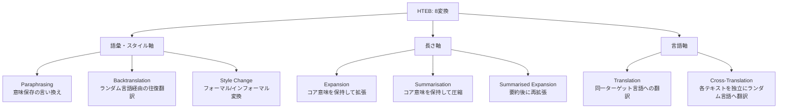

## 論文概要

本記事は [https://arxiv.org/abs/2605.28190](https://arxiv.org/abs/2605.28190) の解説記事です。

HTEB（The Harder Text Embedding Benchmark）は、Embeddingモデルのロバスト性を**語彙・スタイル（Lexical/Stylistic）、長さ（Length）、言語（Language）**の3軸で多次元的に評価するベンチマークである。著者らは、MTEBのような静的ベンチマークが単一スコアによるモデル比較に留まり、実運用で遭遇する入力変動への耐性を測定できていないと主張している。HTEBは8つのLLMベース確率的変換を評価時に動的に適用し、16個のオープンウェイトモデルを32データセット・42言語で評価した結果、モデルが軸ごとに異なるロバスト性プロファイルを示すことを報告している。

## 情報源

| 項目 | 内容 |
|------|------|
| **タイトル** | The Harder Text Embedding Benchmark (HTEB): Beyond One-dimensional Static Robustness |
| **著者** | Manuel Frank, Haithem Afli |
| **arXiv ID** | 2605.28190 |
| **URL** | [https://arxiv.org/abs/2605.28190](https://arxiv.org/abs/2605.28190) |
| **発表時期** | 2026年5月 |
| **分野** | cs.CL（自然言語処理） |

## 背景と動機

Embeddingモデルの評価は、MTEB（Massive Text Embedding Benchmark）の登場以降、リーダーボード形式のスコア比較が主流となった。MTEB v2.8は8タスク・58データセットの英語中心評価を提供し、MMTEB（2025年、ICLR発表）は250以上の言語・500以上のデータセットへ拡張した。しかし、これらの評価は**固定されたデータセット上での静的な性能測定**であり、以下の問題を抱えていると著者らは指摘している。

第一に、ベンチマークスコアが高いモデルであっても、入力テキストの表現が変わった際に性能が大きく低下する場合がある。実運用では、ユーザの入力はフォーマルな文体からカジュアルな文体まで多様であり、テキストの長さも一定ではない。多言語環境ではコードスイッチングや翻訳経由のクエリも発生する。第二に、静的ベンチマークでは**データ汚染（Data Contamination）**のリスクがあり、モデルの事前学習データに評価データが含まれている可能性を排除できない。

PTEBはこの問題に対して評価時にLLMベースの確率的パラフレーズを適用するアプローチを提案したが、パラフレーズという単一の変換軸に限定されていた。著者らは、ロバスト性は多次元的な概念であり、単一軸の評価では不十分であるとして、HTEBを提案している。

## 主要な貢献

著者らが報告しているHTEBの主要な貢献は以下のとおりである。

- **3軸のロバスト性フレームワーク**: 語彙・スタイル、長さ、言語という3つの実用的に解釈可能な軸でEmbeddingモデルのロバスト性を体系化
- **8つのLLMベース確率的変換**: 評価時に動的に適用する8種類の意味保存変換を定義し、静的データセットの固定化問題を回避
- **4,800件の人手評価**: 英語サブサンプルに対する3名のアノテータによる変換品質・流暢性の検証（Gwet's AC2による一致度評価）
- **大規模実験**: 16モデル、32データセット、42言語にわたる包括的評価と、3つのモデルファミリーでのスケーリング分析
- **ロバスト性プロファイルの独立性**: 軸間のロバスト性が部分的に独立しており、ある軸での強さが他の軸での強さを保証しないことを実証

## 技術的詳細

### 3つのロバスト性軸

HTEBは以下の3軸でEmbeddingモデルのロバスト性を評価する。各軸は複数の変換で構成される。

1. **語彙・スタイル軸（Lexical/Stylistic）**: テキストの意味を保持したまま、語彙選択や文体を変化させた際の耐性を測定する。パラフレーズ、バックトランスレーション、スタイル変換の3変換が含まれる。
2. **長さ軸（Length）**: テキストを拡張・圧縮した際に意味的一致度が維持されるかを測定する。拡張、要約、要約後拡張の3変換が含まれる。
3. **言語軸（Language）**: 多言語環境での意味的一致度を測定する。翻訳、クロス翻訳の2変換が含まれる。

### 8つの変換の詳細



各変換の特徴を以下にまとめる。

| 変換名 | 軸 | 操作内容 | 実運用での対応シナリオ |
|--------|-----|---------|---------------------|
| **Paraphrasing** | 語彙・スタイル | 意味を保持した言い換え | ユーザごとの表現の揺れ |
| **Backtranslation** | 語彙・スタイル | ランダム言語を介した往復翻訳 | 翻訳ツール経由のクエリ |
| **Style Change** | 語彙・スタイル | フォーマル/インフォーマル変換 | カジュアル・ビジネスの文体差 |
| **Expansion** | 長さ | コア意味を保持した文章の拡張 | 詳細な質問文、長文ドキュメント |
| **Summarisation** | 長さ | コア意味を保持した文章の圧縮 | キーワード的な短文クエリ |
| **Summarised Expansion** | 長さ | 要約後に再拡張 | 二重変換による情報損失の測定 |
| **Translation** | 言語 | 同一ターゲット言語への翻訳 | 多言語検索システム |
| **Cross-Translation** | 言語 | 各テキストを独立にランダム言語へ翻訳 | 言語混在コーパスでの検索 |

### 評価手法

HTEBの評価は以下の手順で実施されると論文に記載されている。

1. **変換モデルの選定**: 著者らは4段階の選定プロセスを経て、Gemma-3-27B-int4-AWQを変換モデルとして採用した。STS-Bデータセットでのエラー率3.0%が報告されている。
2. **確率的変換の適用**: 各データセットの入力テキストに対し、8種類の変換をランダムシード3回（1337, 1338, 1339）で適用する。Retrieval・Rerankingタスクではクエリ側のみを変換し、現実的なユースケースを反映している。
3. **性能測定**: タスク固有のメトリクス（nDCG@10、コサイン類似度など）で元テキストと変換後テキストの性能を比較する。

Embedding drift（埋め込みのずれ）は以下の式で定量化される。

$$
d_{\text{drift}} = 1 - \cos(\mathbf{e}_{\text{orig}},\, \mathbf{e}_{\text{trans}})
$$

ここで $$\mathbf{e}_{\text{orig}}$$ は元テキストの埋め込みベクトル、$$\mathbf{e}_{\text{trans}}$$ は変換後テキストの埋め込みベクトルである。

統計的検定にはWilcoxon符号順位検定が用いられ、Hodges-Lehmann推定量による95%信頼区間とHolm補正によるp値調整が適用されている。

### 人手評価の設計

変換品質の検証のため、以下のプロトコルで人手評価が実施されたと報告されている。

- **評価規模**: 8変換 x 100テキストペア x 3名のアノテータ x 2基準（品質・流暢性）= 4,800件
- **評価基準**: 5段階リッカート尺度（閾値: 平均3.0以上で「許容可能」）
- **一致度指標**: Gwet's AC2（Krippendorff's alphaよりも安定性が高いとして選択）
- **結果**: 全体の変換品質は平均4.09（SD=1.04）、流暢性は平均4.42（SD=0.86）と報告されている（論文Table 2より）

## 実装のポイント

HTEBの評価パイプラインを自社データに適用する場合の実装例を以下に示す。この実装はHTEBの概念を簡略化して再現したものであり、論文の公式実装とは異なる。

```python
import numpy as np
from dataclasses import dataclass


@dataclass
class RobustnessProfile:
    """Embeddingモデルのロバスト性プロファイル

    HTEBが提案する3軸でモデルのロバスト性をスコア化する。
    各軸のスコアは、元テキストと変換後テキストのタスク性能の
    差分（パーセンテージポイント）を表す。値が小さいほどロバスト。
    """

    model_name: str
    lexical_stylistic: float  # 語彙・スタイル軸の性能低下幅
    length: float             # 長さ軸の性能低下幅
    language: float           # 言語軸の性能低下幅

    @property
    def mean_gap(self) -> float:
        """3軸の平均性能低下幅"""
        return np.mean([
            self.lexical_stylistic,
            self.length,
            self.language,
        ])


def compute_robustness_gap(
    original_scores: dict[str, float],
    transformed_scores: dict[str, float],
) -> dict[str, float]:
    """変換前後のスコアギャップを計算

    Args:
        original_scores: タスク名をキー、元テキストでのスコアを値とする辞書
        transformed_scores: タスク名をキー、変換後テキストでのスコアを値とする辞書

    Returns:
        タスク名をキー、スコア低下幅を値とする辞書（正値 = 性能低下）
    """
    gaps: dict[str, float] = {}
    for task, orig in original_scores.items():
        trans = transformed_scores.get(task, 0.0)
        gaps[task] = orig - trans
    return gaps


def compute_embedding_drift(
    embeddings_orig: np.ndarray,
    embeddings_trans: np.ndarray,
) -> float:
    """Embedding driftを計算（論文の定義に基づく）

    Args:
        embeddings_orig: 元テキストの埋め込み (n, d)
        embeddings_trans: 変換後テキストの埋め込み (n, d)

    Returns:
        平均コサイン距離（0に近いほど安定）
    """
    # コサイン類似度をバッチ計算
    dot = np.sum(embeddings_orig * embeddings_trans, axis=1)
    norm_orig = np.linalg.norm(embeddings_orig, axis=1)
    norm_trans = np.linalg.norm(embeddings_trans, axis=1)
    cos_sim = dot / (norm_orig * norm_trans + 1e-8)
    drift = 1.0 - cos_sim
    return float(np.mean(drift))
```

自社データでHTEBの評価アプローチを活用する際は、以下の手順が考えられる。

1. **評価データセットの準備**: 自社ドメインのクエリ・ドキュメントペアを用意する（関連Zenn記事の500ペア評価プロトコルが参考になる）
2. **変換の適用**: 上記8変換のうち、自社の運用シナリオに関連する変換を選択し、LLMで変換テキストを生成する
3. **性能比較**: 元テキストと変換後テキストでの検索性能・類似度スコアを比較し、軸ごとのロバスト性プロファイルを作成する

論文では最小構成として、**Paraphrasing（アンカー変換）+ Expansion/Summarisation（タスク依存）+ Translation/Cross-Translation（多言語要件がある場合）**が推奨されている。

## 実験結果

### 16モデルの評価概要

著者らは16個のオープンウェイトモデルを英語19データセット・多言語13データセットで評価している。主要な結果を以下にまとめる。

**英語データセットでの結果**（論文Figure 7、Table 4より）:

- 英語データセットでの平均性能低下: **8.4パーセンテージポイント**
- 変換ごとの低下幅: 1.9 -- 18.9ポイント
- 8変換すべてで統計的に有意な低下（p < .001）
- 上位モデルの逆転が発生: F2LLM-v2-4BがHTEB適用後にNV-Embed-v2を上回った

**多言語データセットでの結果**:

- 多言語データセットでの平均性能低下: **2.0パーセンテージポイント**
- 変換ごとの低下幅: 1.4 -- 3.8ポイント
- 8変換中3変換のみが統計的に有意

この差異について、著者らは「英語のベンチマークデータがモデルの訓練分布により近いため、変換による逸脱がより大きな影響を与える」という仮説を提示している。

### 軸ごとのロバスト性プロファイル

軸間のランキング安定性は**Kendall's tau**で評価されている（論文Table 4より）。

| 評価設定 | 語彙・スタイル軸 | 長さ軸 | 言語軸 | 平均tau |
|----------|----------------|--------|--------|---------|
| **英語** | 0.555 | -- | 0.373 | 0.555 |
| **多言語** | 0.769 | -- | -- | 0.769 |

言語軸での変換が最もランキングを撹乱する（英語でのtau = 0.373）ことが報告されており、これはモデルの多言語能力にばらつきが大きいことを示唆している。

軸内のランキング安定性（Split-half reliability）については、英語で語彙・スタイル軸がSpearman rho = +0.92、長さ軸が+0.82、言語軸が+0.96と報告されている（論文Table 3より）。軸内では安定した測定が行われている一方、軸間ではランキングが大きく変動することから、**ロバスト性の多次元性**が実証されている。

### スケーリングとロバスト性

3つのモデルファミリー（F2LLM: 270M/1B/4B、Qwen3-Embedding: 4B/8B/14B、Harrier: 270M+追加チェックポイント）でスケーリングの効果が分析されている（論文Figure 5より）。

著者らの報告によれば:

- モデルサイズの増大は**ベースライン性能を向上**させる
- しかし、元テキストと変換後テキストの**性能ギャップは約5ポイントで維持**され、スケーリングでは解消しない
- 言語軸は他の軸と比較してスケーリングの恩恵を**不均衡に受ける**（大規模モデルほど多言語データで訓練されるため）

この結果は、単にモデルを大きくするだけではロバスト性の問題は解決せず、訓練データの多様性や変換に対する明示的な学習が必要であることを示唆している。

## 実運用への応用

### 500ペア評価プロトコルとの連携

関連Zenn記事で解説されている500ペア評価プロトコルとHTEBのアプローチは相補的に活用できる。500ペア評価はドメイン固有データでの**静的な精度評価**に優れており、HTEBは同じデータに対する**動的なロバスト性評価**を提供する。

具体的な連携手順としては、以下が考えられる。

1. 500ペア評価プロトコルでベースライン精度を測定する
2. 評価ペアのクエリ側にHTEBの変換（パラフレーズ、拡張、要約など）を適用する
3. 変換後の精度と元の精度を比較し、ロバスト性プロファイルを作成する
4. プロファイルに基づき、自社のユースケースで重要な軸での耐性が高いモデルを選定する

### ドメイン固有データでの動的評価の活用

HTEBの知見を踏まえると、以下のシナリオでは動的評価が特に有効である。

- **カスタマーサポート**: ユーザの質問は文体や長さのばらつきが大きいため、語彙・スタイル軸と長さ軸の評価が重要
- **多言語RAGシステム**: 言語軸での評価が必須。論文の結果では英語データセットが変換に対して約4倍敏感であるため、英語中心のベンチマークスコアだけでは多言語性能を予測できない
- **法律・医療ドメイン**: 専門用語のパラフレーズに対するロバスト性が重要。Style Change変換（フォーマル/インフォーマル変換）の適用が有効

論文で採用されている変換モデル（Gemma-3-27B-int4-AWQ）は消費者向けGPU（2x RTX 5090）で動作すると報告されており、自社環境での評価パイプライン構築のハードルは比較的低いと考えられる。

## 関連研究

HTEBは以下の先行研究の流れの中に位置づけられる。

- **MTEB**（Muennighoff et al., 2023）: 英語中心の静的Embeddingベンチマーク。8タスクでの総合スコアを提供する標準的評価として広く利用されている
- **MMTEB**（Enevoldsen et al., 2025）: MTEBの多言語拡張。250+言語・500+データセットに拡張したが、静的評価であることは変わらない
- **PTEB**（Frank & Afli, 2025/2026）: HTEBの前身。評価時にLLMベースの確率的パラフレーズを適用する手法を提案した。EACL 2026で発表されている。HTEBはPTEBのパラフレーズという単一変換を3軸8変換に拡張したものである
- **SAGE**（Goel et al., 2025）: 制御されたperturbationとノイズ注入による英語データセットでのロバスト性評価
- **FLUKE**（Otmakhova et al., 2026）: 最小限の言語的修正によるタスク固有の脆弱性検出

HTEBはPTEBの枠組みを拡張し、解釈可能な多次元分析を導入した点で、動的Embedding評価の研究系譜における進展として位置づけられる。

## まとめと今後の展望

HTEBは、Embeddingモデルのロバスト性を3軸8変換で多次元的に評価するフレームワークとして、静的ベンチマークの限界を補完する手法を提案している。本論文から得られる実務的な示唆は以下のとおりである。

1. **MTEBスコアだけではモデルの実運用性能を予測できない**: 変換適用後にモデルのランキングが逆転するケースが報告されている
2. **ロバスト性は多次元的**: ある軸での強さが他の軸での強さを保証しないため、自社のユースケースに応じた軸での評価が必要
3. **スケーリングはロバスト性の万能薬ではない**: モデルサイズを増大させてもベースラインと変換後の性能ギャップは維持される

著者らは今後の課題として、英語と多言語の感度差の直接的な検証、より広範なスケーリング研究、インストラクションチューニングがロバスト性に与える影響の分析、合成データと非合成データの訓練データ構成の効果を挙げている。Embeddingモデルの選定において、静的ベンチマークのスコアに加えて動的なロバスト性評価を組み合わせることが、より信頼性の高いモデル選定につながると考えられる。
