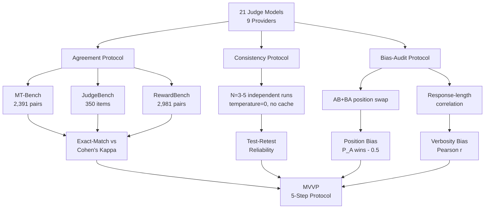
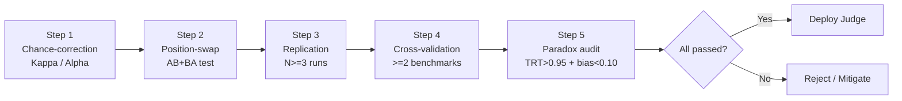

## 論文概要

LLM-as-a-Judge（LLMを評価者として利用する手法）の信頼性検証に関する大規模な系統的評価研究である。著者らは21のジャッジモデル（9プロバイダー）を3つのベンチマーク（MT-Bench、JudgeBench、RewardBench）で評価し、118回の実行で約541,000件の個別判定を分析した。その結果、exact-match精度とCohen's kappaの間に33--41ポイントの乖離（Kappa deflation）が存在すること、ジャッジランキングがベンチマーク間で最大14位変動すること、高い再現性と深刻な位置バイアスが共存するパラドックスがあることを報告している。著者らはこれらの知見をMinimum Viable Validation Protocol（MVVP）として整理し、LLM-as-Judgeの実運用における検証手順を提案した。

本記事は [https://arxiv.org/abs/2606.19544](https://arxiv.org/abs/2606.19544) の解説記事です。筆者自身が実験を行ったものではなく、論文の内容を解説・引用しています。

この記事は [Zenn記事: Embeddingモデルの精度評価を自社データで実践する：500ペア評価・合成データ・LLM-as-Judge](https://zenn.dev/0h_n0/articles/adcdb688d73a8b) の深掘りです。

## 情報源

- **arXiv ID**: 2606.19544
- **URL**: [https://arxiv.org/abs/2606.19544](https://arxiv.org/abs/2606.19544)
- **著者**: Justin D. Norman, Michael U. Rivera, D. Alex Hughes（UC Berkeley School of Information）
- **発表年**: 2026年6月
- **分野**: cs.CL（計算言語学）

## 背景と動機

LLM-as-a-Judgeは、人間の評価者に代わってLLMの出力品質を自動評価する手法として急速に普及している。EmbeddingモデルのRAG検索品質評価、チャットボットの応答品質比較、コード生成の正確性判定など、多くの実務シーンで採用されている。関連するZenn記事「Embeddingモデルの精度評価を自社データで実践する」でも、LLM-as-Judgeを用いたEmbedding評価パイプラインの構築方法が解説されており、500ペアの評価データセットを構築してモデル比較を自動化する手法が紹介されている。

しかし、著者らはこの普及に対して根本的な問題を指摘している。従来のジャッジ検証では、exact-match agreement（人間の正解ラベルとの完全一致率）が主要な評価指標として使われてきた。Zheng et al. (2023) がMT-Benchを発表して以降、「GPT-4のexact-match精度は80%以上」といった報告が広く引用され、LLM-as-Judgeの信頼性が確立されたかのように受け止められてきた。

しかし、この指標は偶然の一致を補正しないため、ジャッジの弁別能力を体系的に過大評価する。著者らは「agreement（一致率）だけでは信頼性の保証にならない」という仮説のもと、agreement、consistency（一貫性）、bias（バイアス）の3軸で21モデルを網羅的に評価する大規模研究を実施した。タイトルの「Reliability without Validity」は心理測定学の用語であり、「同じ答えを安定して返す（信頼性が高い）が、その答えが正しいとは限らない（妥当性が低い）」という状態を指す。

## 主要な貢献

本論文の主要な貢献は以下の通りである。

- **大規模系統的評価**: 21のジャッジモデル（9プロバイダー）を3つのベンチマーク、3つの評価プロトコルで評価し、約541,000件の判定データを生成した。著者らによれば、これはLLM-as-Judge評価研究として最大規模の1つである
- **Kappa deflationの定量化**: exact-match精度とCohen's kappaの間に33--41ポイントの乖離があることを全モデルにわたって実証し、従来の報告値が過大評価であったことを示した
- **ベンチマーク不安定性の発見**: 同一モデルのランキングがベンチマーク間で最大14位変動することを示し、単一ベンチマークでの評価の危険性を実証した
- **一貫性-バイアスのパラドックス**: test-retest信頼性が0.95を超えるモデルでも位置バイアスが0.10を超えるケースを発見し、「信頼性が高い（reliable）」ことが「妥当性が高い（valid）」ことを意味しないことを実証した
- **Minimum Viable Validation Protocol（MVVP）の提案**: 実運用でLLM-as-Judgeを導入する際の5段階検証プロトコルを整理した

## 技術的詳細

### 評価フレームワーク全体像

著者らは3つの評価プロトコルを組み合わせた包括的なフレームワークを設計した。以下のMermaid図にその全体構造を示す。



### 3つのベンチマークの特性

著者らは性質の異なる3つのベンチマークを選択し、ジャッジの汎化性能を評価している。

- **MT-Bench**（2,391ペアワイズ比較）: 専門家による選好ラベル（A勝ち/B勝ち/引き分け）が付与されたデータセット。選好型評価の標準的ベンチマークだが、ラベル分布にA/B/Tieの3値があるため、偶然の一致率が比較的高くなる特性がある
- **JudgeBench**（350アイテム）: 数学、コーディング、創作文、分析の4分野にまたがる客観的正誤ラベル付きデータセット。アイテム数が少ないため統計的な検出力が低い一方、正誤が明確に定義されている
- **RewardBench**（2,981 chosen-versus-rejected ペア）: アイテムごとに位置のランダム化が施されており、位置バイアスの影響を受けにくい設計になっている

著者らは、これらのベンチマークが測定する能力が異なるため、ジャッジのランキングがベンチマーク間で大きく変動することは理論的に予想されると述べつつも、その変動幅が最大14位に達するという事実は、単一ベンチマークでの評価が実務的に信頼できないことを示すものだと主張している。

### Exact-Match精度 vs Cohen's Kappa

LLM-as-Judgeの評価で最もよく使われるexact-match精度（完全一致率）は、偶然の一致を考慮しない。Cohen's Kappaはこの問題を補正する指標である。

$$
\kappa = \frac{p_o - p_e}{1 - p_e}
$$

ここで、
- $p_o$: 観測された一致率（observed agreement）
- $p_e$: 偶然に期待される一致率（expected agreement）

$p_e$ はラベルの周辺分布から計算される。例えば、ジャッジと人間がそれぞれラベルAを60%、ラベルBを40%の割合で付与している場合、偶然の一致率は以下のようになる。

$$
p_e = P_{\text{judge}}(A) \cdot P_{\text{human}}(A) + P_{\text{judge}}(B) \cdot P_{\text{human}}(B) = 0.6 \times 0.6 + 0.4 \times 0.4 = 0.52
$$

この場合、exact-matchが75%であっても、$\kappa = (0.75 - 0.52) / (1 - 0.52) = 0.479$ となり、見かけの一致率から大幅に低下する。著者らはこの乖離を「Kappa deflation」と呼び、MT-Benchにおいて全モデルで33.8--41.3ポイントの乖離が観測されたと報告している。

Kappaの解釈基準としては、Landis & Koch (1977) の分類が広く使われている。$\kappa$ が0.41--0.60は「中程度の一致（moderate agreement）」、0.61--0.80は「実質的な一致（substantial agreement）」とされる。論文で報告されたMT-Benchでの最高値であるGemini 3.1 Proの $\kappa = 0.511$ は「中程度の一致」に分類され、従来のexact-match精度から受ける印象とは大きく異なる。

### Inter-Rater Reliability（IRR）指標

著者らはCohen's Kappaに加え、多重評価者向けのKrippendorff's alphaも使用している。Krippendorff's alphaは2人以上の評価者、欠損データ、順序尺度に対応するため、N回の独立実行における一貫性評価に適している。Cohen's Kappaが2者間の一致度に限定されるのに対し、Krippendorff's alphaはN人の評価者間の一致度を統一的に測定できるため、test-retest信頼性の評価（同一ジャッジのN回実行）に適用された。

### Test-Retest信頼性の測定

同一アイテムに対してN回（N=3または5）の独立した判定を実行し、各回の判定結果の一致度を測定する。全実行でtemperature=0に固定し、APIレスポンスのキャッシュを無効化した状態で評価を行った。temperature=0であっても、APIの内部実装（バッチ処理の順序、浮動小数点演算の非決定性等）により完全に同一の出力が保証されないことがあるため、複数回実行による検証が必要となる。

著者らはMT-Benchでのコホート平均が0.944、JudgeBenchでは0.911（3.3ポイント低下）であったと報告している。JudgeBenchでの低下は、数学やコーディングなど判定が困難なアイテムにおいて判定のゆらぎが大きくなることが原因であると分析されている。

### 位置バイアス（Position Bias）の検出

ペアワイズ評価において、回答の提示順序が判定に影響するかを測定する手法である。同一ペアをAB順とBA順の両方で提示し、以下の指標で位置バイアスを定量化する。

$$
\text{Position Bias} = |P(A \text{ wins}) - 0.5|
$$

バイアスが0であれば順序によらず公平に判定していることを意味する。著者らによれば、Qwen 3 8Bが0.192と最も高い位置バイアスを示し、一方でGemini 2.5 Proは0.002とほぼゼロであった。21モデル中18モデルが0.058未満であったと報告されている。

注目すべきは、同一プロバイダーのモデルファミリー内でもバイアスの大きさに大きな差があることである。著者らはGeminiファミリー内で0.002と0.125のバリアントが存在すると報告しており、「プロバイダー単位でのバイアス評価は不十分であり、個別モデルごとの検証が必要」と結論づけている。

### 冗長バイアス（Verbosity Bias）の測定

回答の長さが判定に影響するかを、回答間の文字数差分と判定結果のPearson相関係数で測定する。著者らの報告では、全21モデルで相関係数が0.011未満、17モデルでは0.005未満であった。2023年の先行研究で報告されていた20--40%の分散と比較して大幅に改善されており、著者らはこの改善をモデルの学習過程における対策（RLHFやDPOでの長さバイアス抑制）が効果を発揮した結果と分析している。ただし、この知見は「単一ペアワイズ評価条件」での結果であり、マルチターン評価やルーブリック付き評価では異なる結果になる可能性があると著者らは注記している。

## 実験結果

### 評価対象の21モデル

著者らが評価した21モデルは、以下のように3つのティアに分類されている。

- **Tier 1（プロダクション展開済み）**: GPT-4o, GPT-4o-mini, GPT-4.1, Gemini 2.5 Pro, Gemini 2.5 Flash, Claude Haiku 4.5, Llama 3.3 70B, Qwen 3 8B
- **Tier 2（コスト最適化）**: Mixtral 8x22B, GPT-4.1-mini, Claude Sonnet 4
- **Tier 3（フロンティア/2026年4月時点）**: GPT-5.4, GPT-5.4-mini, Claude Opus 4.6, Claude Sonnet 4.6, Gemini 3.1 Pro, GPT-oss 120B, Minimax M2.7, DeepSeek V3.2, Kimi K2.5, GLM-5

### 主要モデルの比較

著者らが報告した主要モデルのMT-Benchにおける結果を以下の表にまとめる（論文のデータに基づく）。

| モデル | Cohen's Kappa | Position Bias | Test-Retest | 備考 |
|--------|---------------|--------------|-------------|------|
| Gemini 3.1 Pro | 0.511 | 0.002 (variant) | 高い安定性 | Kappa最高値 |
| Claude Opus 4.6 | 0.489 | -- | -- | Tier 3 |
| GPT-5.4-mini | 0.376 | -- | -- | Kappa最低水準 |
| Qwen 3 8B | -- | 0.192 | 0.992 | パラドックスの典型例 |
| Gemini 2.5 Pro | -- | 0.002 | -- | Position Bias最小 |

注: "--"は論文中で個別の数値が明示されていない箇所を示す。Kappa deflationの範囲はコホート全体でMT-Benchにおいて33.8--41.3 ppである。

### Kappa Deflationのベンチマーク間比較

Kappa deflationの大きさはベンチマークによって大きく異なると報告されている。

| ベンチマーク | Kappa Deflation範囲 (pp) | 判定数 | ラベル形式 |
|-------------|------------------------|--------|-----------|
| MT-Bench | 33.8 -- 41.3 | 2,391 pairs | 選好型（A/B/Tie） |
| JudgeBench | 8.1 -- 38.5 | 350 items | 正誤型 |
| RewardBench | 5.9 -- 21.3 | 2,981 pairs | chosen/rejected |

MT-Benchで特にdeflationが大きい理由として、著者らはpreference-style（選好型）ラベルの分布にA/B/Tieの3値があり、周辺分布の偏りが大きいことを挙げている。特に「Tie」ラベルの出現頻度がジャッジと人間で大きく異なる傾向があり、これが偶然の一致率 $p_e$ を押し上げ、結果として $\kappa$ が低くなる要因となっている。

### 一貫性-バイアスのパラドックス

著者らが「本論文の最も重要な発見」と位置づけているのが、一貫性-バイアスのパラドックスである。具体的には、Qwen 3 8Bがtest-retest信頼性0.992（コホート中最高水準）を達成しつつ、位置バイアスが0.192（コホート中最高）であった。これは、モデルが毎回同じ回答を返す（高い一貫性）にもかかわらず、常に特定の位置を優遇している（低い妥当性）ことを意味する。著者らはこれをタイトルの「Reliability without Validity（妥当性なき信頼性）」として表現している。

この現象が実務上問題となるのは、test-retest信頼性のみでジャッジの品質を判断する運用が一般的だからである。「3回実行して結果が一致するから信頼できる」という論理は、位置バイアスが存在する場合には成立しない。決定論的なモデルは常に同じバイアスのかかった判定を繰り返すため、test-retestは高くなる一方で、その判定が正しいかどうかは別問題である。

## Minimum Viable Validation Protocol（MVVP）

著者らは上記の知見を統合し、LLM-as-Judgeを実運用に導入する際の5段階検証プロトコルを提案している。

### 5つのステップ

1. **偶然補正（Chance-correction）**: exact-match精度だけでなく、Cohen's $\kappa$ またはKrippendorff's $\alpha$ を主要指標として報告する。偶然の一致を補正することで、ジャッジの真の弁別能力を測定する。著者らは $\kappa \geq 0.6$（substantial agreement以上）を推奨閾値として示唆している
2. **位置入れ替えテスト（Position-swap testing）**: 全評価ペアをAB順・BA順の両方で評価し、$|P(A \text{ wins}) - 0.5|$ を計算する。閾値0.10未満であれば許容範囲とされる。この検証は評価コストを2倍にするが、位置バイアスの検出には不可欠である
3. **再現性検証（Replication）**: temperature=0、キャッシュ無効化の条件下で3回以上の独立実行を行い、test-retest信頼性を算出する。著者らは最低3回を必須とし、高リスクな判断に使用する場合は5回を推奨している
4. **クロスバリデーション（Cross-validation）**: 選好型（MT-Bench等）と正誤型（JudgeBench等）の少なくとも2つのベンチマークで評価し、ランキングの安定性を確認する。ランキング変動が5位以内であれば安定とみなせる
5. **パラドックス監査（Paradox auditing）**: test-retestが0.95を超える場合、位置バイアスが0.10未満であることを追加検証する。高い一貫性が高い妥当性を保証しないことへの対策である。著者らはこのステップを「MVVPの中で最も見落とされやすいが、最も重要なステップ」と述べている

### プロトコル実装のフロー



## 実装のポイント

### Kappa Deflation計算の実装

LLM-as-Judgeの信頼性を検証する際に、exact-matchだけでなくCohen's Kappaを算出してdeflationを把握することが重要である。以下に実装例を示す。

```python
from sklearn.metrics import cohen_kappa_score
import numpy as np

def compute_kappa_deflation(
    judge_labels: list[int],
    human_labels: list[int],
) -> dict[str, float]:
    """Exact-match精度とCohen's Kappaの乖離を計算

    Args:
        judge_labels: ジャッジモデルの判定ラベル
        human_labels: 人間の正解ラベル

    Returns:
        exact_match, kappa, deflationの辞書
    """
    exact_match = np.mean(
        [j == h for j, h in zip(judge_labels, human_labels)]
    )
    kappa = cohen_kappa_score(human_labels, judge_labels)
    deflation = exact_match - kappa
    return {
        "exact_match": float(exact_match),
        "kappa": float(kappa),
        "deflation": float(deflation),
    }
```

### 位置バイアス検出パイプライン

位置入れ替えテストを自動実行するパイプラインの骨格を以下に示す。MVVPのStep 2に対応する実装である。

```python
from dataclasses import dataclass

@dataclass
class PairwiseItem:
    """ペアワイズ評価アイテム"""
    item_id: str
    response_a: str
    response_b: str

def measure_position_bias(
    judge_fn: callable,
    items: list[PairwiseItem],
) -> dict[str, float]:
    """AB+BA入れ替えテストで位置バイアスを測定

    Args:
        judge_fn: (response_a, response_b) -> "A" | "B" | "Tie"
        items: 評価対象のペアワイズアイテムリスト

    Returns:
        position_bias, a_win_rate_ab, a_win_rate_ba の辞書
    """
    a_wins_ab = 0
    a_wins_ba = 0
    n = len(items)

    for item in items:
        # AB順で評価
        verdict_ab = judge_fn(item.response_a, item.response_b)
        # BA順で評価（位置を入れ替え）
        verdict_ba = judge_fn(item.response_b, item.response_a)

        if verdict_ab == "A":
            a_wins_ab += 1
        # BA順では"B"がオリジナルのAに対応
        if verdict_ba == "B":
            a_wins_ba += 1

    rate_ab = a_wins_ab / n
    rate_ba = a_wins_ba / n
    position_bias = abs((rate_ab + (1 - rate_ba)) / 2 - 0.5)

    return {
        "position_bias": float(position_bias),
        "a_win_rate_ab_order": float(rate_ab),
        "a_win_rate_ba_order": float(rate_ba),
    }
```

### Test-Retest信頼性の計算

MVVPのStep 3で使用するtest-retest信頼性の計算実装である。複数回の独立実行結果を受け取り、全ペアの平均一致率を返す。

```python
from itertools import combinations

def compute_test_retest(
    run_results: list[list[int]],
) -> float:
    """複数回実行の結果からtest-retest信頼性を計算

    Args:
        run_results: 各実行の判定ラベルリスト
            例: [[0,1,1,0], [0,1,1,0], [0,1,0,0]]
            （3回実行、各4アイテムの判定結果）

    Returns:
        全ペアの平均一致率（test-retest reliability）
    """
    agreements = []
    for run_a, run_b in combinations(run_results, 2):
        match_rate = np.mean(
            [a == b for a, b in zip(run_a, run_b)]
        )
        agreements.append(match_rate)
    return float(np.mean(agreements))
```

### パラドックス監査の自動化

MVVPのStep 5に対応する、一貫性-バイアスのパラドックスを自動検出する実装例を示す。

```python
def paradox_audit(
    test_retest: float,
    position_bias: float,
    trt_threshold: float = 0.95,
    bias_threshold: float = 0.10,
) -> dict[str, bool | str]:
    """一貫性-バイアスのパラドックスを検出

    Args:
        test_retest: test-retest信頼性スコア
        position_bias: 位置バイアススコア
        trt_threshold: test-retest信頼性の閾値（デフォルト0.95）
        bias_threshold: 位置バイアスの閾値（デフォルト0.10）

    Returns:
        パラドックス検出結果と推奨アクション
    """
    high_consistency = test_retest > trt_threshold
    high_bias = position_bias > bias_threshold

    if high_consistency and high_bias:
        return {
            "paradox_detected": True,
            "recommendation": (
                "Reliability without Validity detected. "
                "Do NOT deploy this judge for pairwise evaluation. "
                "Consider using pointwise scoring instead."
            ),
        }
    if high_bias:
        return {
            "paradox_detected": False,
            "recommendation": (
                "High position bias detected. "
                "Apply position-swap averaging as mitigation."
            ),
        }
    return {
        "paradox_detected": False,
        "recommendation": "Judge passed paradox audit.",
    }
```

## 実運用への応用

### Embedding評価でのLLM-as-Judge活用時の注意点

関連するZenn記事「Embeddingモデルの精度評価を自社データで実践する」では、LLM-as-Judgeを使った自動評価パイプラインの構築が解説されている。記事では、500ペアの評価データセットを構築し、LLMに検索結果の関連性を判定させる手法が紹介されている。本論文の知見は、このパイプラインの信頼性を担保する上で直接的に役立つ。

具体的には、以下の点に注意が必要である。

**1. Kappa deflationへの対応**: Zenn記事で構築する500ペア評価データセットでLLM-as-Judgeを使う際、exact-match精度のみでジャッジの精度を報告するのは不十分である。本論文が示した33--41ポイントのdeflationを考慮し、Cohen's Kappaを併用してジャッジの真の弁別能力を評価する必要がある。人間アノテータとの一致率が80%であっても、$\kappa$ が0.4前後（moderate agreement）に留まる可能性がある。

**2. 複数モデルでのクロスバリデーション**: 本論文の報告によれば、ジャッジのランキングがベンチマーク間で最大14位変動する。Embedding評価用のデータセットは特定ドメインに偏りがちなため、少なくとも2つ以上のジャッジモデルで評価を行い、Embeddingモデルのランキングが安定しているかを確認することが推奨される。2つのジャッジで上位モデルの順位が入れ替わる場合、ジャッジの選択がモデル選定結果を左右していることになり、追加の人間評価が必要になる。

**3. 位置バイアスの検出**: Embeddingモデルのペアワイズ比較（モデルAとモデルBの検索結果の比較）を行う場合、提示順序によるバイアスがないかをAB+BAテストで検証する。本論文の報告では、モデルによって0.002から0.192まで大きな差があるため、使用するジャッジモデルの位置バイアスを事前に把握しておくことが重要である。

**4. パラドックス監査の実施**: test-retest信頼性が高いからといって安心してはならない。本論文が発見した一貫性-バイアスのパラドックスは、「毎回同じ回答を返すが、常に間違った方向に偏っている」というケースが実在することを示している。Embedding評価においても、ジャッジが常に最初に提示された検索結果を高く評価する傾向があれば、モデル比較の結果は提示順序で決まってしまう。

## 関連研究

- **Zheng et al. (2023)**: 「Judging LLM-as-a-Judge with MT-Bench and Chatbot Arena」。MT-Benchを提案し、GPT-4をジャッジとして利用する枠組みを確立した先駆的研究。本論文はこのMT-Benchデータセットを評価ベンチマークの1つとして使用し、当時の報告値がKappa deflationにより過大評価であったことを示している
- **Li et al. (2024)**: LLM-as-Judgeの位置バイアスと冗長バイアスを指摘した研究。本論文はこの知見を21モデル規模に拡張し、冗長バイアスが2023年時点と比較して大幅に低減していること（20--40%から0.011未満へ）を報告している
- **arXiv:2602.00521 (2026)**: 「Diagnosing the Reliability of LLM-as-a-Judge via Item Response Theory」。項目応答理論（IRT）を用いてLLM-as-Judgeの信頼性を診断する手法を提案しており、アイテム難易度の観点から信頼性を分析する点で本論文と相補的な関係にある
- **arXiv:2604.11581 (2026)**: 「Hidden Measurement Error in LLM Pipelines Distorts Annotation, Evaluation, and Benchmarking」。LLMパイプライン全般における測定誤差の問題を指摘しており、本論文のKappa deflationの発見と整合する

## まとめ

本論文は、LLM-as-Judgeの評価において従来広く使われてきたexact-match精度が弁別能力を過大評価すること、ジャッジのランキングが単一ベンチマークでは不安定であること、そして高い一貫性が必ずしも高い妥当性を意味しないことを、21モデル・541,000件の判定データで実証した。提案されたMinimum Viable Validation Protocolは、Embedding評価やRAG検索品質の自動判定など、LLM-as-Judgeを実務で活用するすべてのケースにおいて、導入前の検証手順として参考になる。特に、Cohen's Kappaによる偶然補正、AB+BAの位置入れ替えテスト、パラドックス監査の3点は、追加コストが比較的低く、既存の評価パイプラインに段階的に組み込むことが可能である。

## 参考文献

- **arXiv**: [https://arxiv.org/abs/2606.19544](https://arxiv.org/abs/2606.19544)
- **Related Zenn article**: [https://zenn.dev/0h_n0/articles/adcdb688d73a8b](https://zenn.dev/0h_n0/articles/adcdb688d73a8b)
