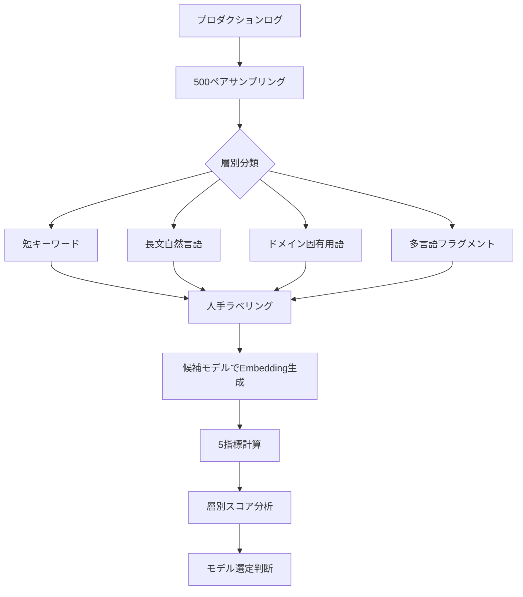

## ブログ概要（Summary）

FutureAGI社が2026年に公開した「Evaluating Embedding Models in 2026」は、自社のプロダクションデータでEmbeddingモデルを評価するための実践ガイドである。500ペアのラベル付き評価セットを4つの層から構成し、Recall@10・MRR・NDCG@10・p95レイテンシ・コストの5指標で比較する手法を提案している。ドメイン別推奨モデル、次元削減・量子化のトレードオフ、セマンティックキャッシングについても整理されている。

本記事は [https://futureagi.com/blog/evaluating-embedding-models-2026/](https://futureagi.com/blog/evaluating-embedding-models-2026/) の解説記事です。

この記事は [Zenn記事: Embeddingモデルの精度評価を自社データで実践する：500ペア評価・合成データ・LLM-as-Judge](https://zenn.dev/0h_n0/articles/adcdb688d73a8b) の深掘りです。

## 情報源

- **種別**: 企業テックブログ
- **URL**: [https://futureagi.com/blog/evaluating-embedding-models-2026/](https://futureagi.com/blog/evaluating-embedding-models-2026/)
- **組織**: FutureAGI
- **発表時期**: 2026年

## 技術的背景（Technical Background）

### MTEBの3つの限界

MTEB（Massive Text Embedding Benchmark）は56タスクのスコアを集約した汎用ベンチマークである。FutureAGI社はMTEBに以下の構造的問題があると指摘している。

**分布不一致**: MTEBはWeb文書・科学論文等を集約しているが、特定ドメイン（医療コード、法律条文、製品SKU等）のクエリ分布とは乖離している。FutureAGI社は「MTEBの平均からは自社クエリ分布での振る舞いはわからない」と述べている。

**ベンチマーク汚染**: フロンティアモデルはMTEBデータと重複するコーパスで学習されており、スコア上昇がプロダクションでのRecall改善に直結しないケースがある。

**タスク陳腐化**: MTEBは2022-2023年に構築されており、2026年のプロダクションで多い短クエリ、多言語混在、コード混在が十分にカバーされていない。

これらを背景に、FutureAGI社はドメイン固有の評価セット構築を推奨している。「リーダーボードで1ポイント差のモデル同士が、実トラフィック500クエリでは8-12ポイント差になることが日常的にある」と報告しており、多言語クエリで15ポイント低下するモデルは多言語トラフィックが20%の環境では不適切と指摘している。

## 500ペア評価プロトコルの詳細

### 層別サンプリング手法

FutureAGI社はプロダクションログから500ペアのクエリ-ドキュメント対を抽出することを推奨している。500ペアで95%信頼区間でのモデル間順位分離が達成できるとしている。以下の4コホートに層別化する。

| コホート | 定義 | 特性 |
|----------|------|------|
| 短キーワード | 5トークン未満 | 文脈が乏しくEmbeddingが曖昧になりやすい |
| 長文自然言語 | 15トークン以上 | 情報量が多い文章形式のクエリ |
| ドメイン固有用語 | SKU、ICD、法律条文番号等 | 汎用モデルが弱い領域 |
| 多言語フラグメント | 非英語テキストを含む | コードスイッチング、多言語混在 |

ラベリングは人手で行い、各クエリに対して「回答スパンを含むチャンクID」を特定する。FutureAGI社は「チャンクが回答テキストを含む場合にのみヒットとカウントする」と明記している。

### 5つの評価指標の定義

**Recall@k**: 上位 $k$ 件に正解が含まれる割合。$\text{Recall@}k = \frac{1}{|Q|} \sum_{q \in Q} \mathbb{1}[d_q^* \in \text{top-}k(q)]$（$d_q^*$: 正解ドキュメント）。

**MRR**: 正解順位の逆数の平均。$\text{MRR} = \frac{1}{|Q|} \sum_{q \in Q} \frac{1}{\text{rank}(d_q^*)}$

**NDCG@k**: 段階的関連度を考慮した指標。$\text{NDCG@}k = \text{DCG@}k / \text{IDCG@}k$、$\text{DCG@}k = \sum_{i=1}^{k} (2^{rel_i} - 1) / \log_2(i + 1)$（$rel_i$: 位置 $i$ の関連度）。

**p95レイテンシ**: 95パーセンタイルの応答時間（ms）。**コスト**: 1Mトークンあたりの推論コスト（USD）。

### 評価フロー全体像



## 実装アーキテクチャ（Architecture）

### 層別評価パイプラインのコード例

```python
import numpy as np
from dataclasses import dataclass
from typing import Protocol
import time

class Embedder(Protocol):
    """Embeddingモデルのインターフェース"""
    def encode(self, texts: list[str]) -> np.ndarray: ...

@dataclass
class StratifiedEvalResult:
    """層別評価結果"""
    stratum: str
    recall_at_10: float
    mrr: float
    ndcg_at_10: float
    p95_latency_ms: float
    cost_per_million: float
    sample_count: int

def stratified_evaluation(
    queries: list[dict], embedder: Embedder,
    corpus_embeddings: np.ndarray, corpus_ids: list[str],
    relevant_docs: dict[str, str], k: int = 10,
    cost_per_million: float = 0.13,
) -> list[StratifiedEvalResult]:
    """層別評価を実行する"""
    # 4コホートに分類
    strata: dict[str, list[dict]] = {
        "short_keyword": [], "long_natural_language": [],
        "domain_jargon": [], "multilingual": [],
    }
    for q in queries:
        if q.get("has_multilingual"):    strata["multilingual"].append(q)
        elif q.get("has_domain_jargon"): strata["domain_jargon"].append(q)
        elif q["token_count"] < 5:       strata["short_keyword"].append(q)
        else:                            strata["long_natural_language"].append(q)

    results = []
    for name, sq in strata.items():
        if not sq: continue
        latencies, all_retrieved = [], []
        for q in sq:
            t0 = time.perf_counter()
            emb = embedder.encode([q["text"]])
            latencies.append((time.perf_counter() - t0) * 1000)
            sims = emb @ corpus_embeddings.T
            top_idx = np.argsort(sims[0])[::-1][:k]
            all_retrieved.append([corpus_ids[i] for i in top_idx])

        rel = [relevant_docs.get(q["text"], "") for q in sq]
        hits = sum(1 for r, g in zip(all_retrieved, rel) if g in r[:k])
        rrs = [1/(r.index(g)+1) if g in r else 0.0
               for r, g in zip(all_retrieved, rel)]
        results.append(StratifiedEvalResult(
            stratum=name, recall_at_10=hits/len(rel),
            mrr=float(np.mean(rrs)), ndcg_at_10=0.0,
            p95_latency_ms=float(np.percentile(latencies, 95)),
            cost_per_million=cost_per_million, sample_count=len(sq),
        ))
    return results
```

### ドメイン別推奨モデル

FutureAGI社は、ドメイン特性ごとに以下のモデルを推奨している。

| ドメイン | 推奨モデル | 備考 |
|----------|-----------|------|
| 英語散文RAG | OpenAI text-embedding-3-large @ 1024 | Matryoshka対応、約2ポイントのRecall@10低下で3倍ストレージ削減 |
| 多言語 | Cohere Embed v4 | 100+言語対応、低リソース言語でのフロア性能が高い |
| コード混在 | Voyage voyage-3-large（code variant） | OpenAI比でRecall@10が4-8ポイント向上と報告 |
| 法律・金融 | Voyage domain variants | 識別子クエリで2-5ポイントの改善 |
| セルフホスト | Mixedbread mxbai-embed-large-v2 | オープンウェイト、量子化対応、シングルGPU |
| コスト重視 | Stella v5（1.5B） | OSS軽量モデル |
| ハイブリッド検索 | BGE bge-m3 | Dense + Sparse + Late-interactionの3信号 |

コスト面では、text-embedding-3-largeが$0.13/1Mトークン、セルフホストBGEが約$0.01/1Mトークンで、損益分岐点は日200-500万トークンである。

## Production Deployment Guide

### AWS実装パターン（コスト最適化重視）

コスト概算は2026年7月ap-northeast-1料金に基づく。実際のコストは変動するためAWS料金計算ツールで確認を推奨する。

| 構成 | 想定規模 | 主要サービス | 月額概算 |
|------|---------|-------------|---------|
| Small | 週次評価、2-3モデル | Lambda + S3 + DynamoDB | $50-150 |
| Medium | 日次評価、5-10モデル | ECS Fargate + SageMaker Endpoint | $300-800 |
| Large | 継続的評価 + A/Bテスト | EKS + SageMaker Multi-Model Endpoint | $2,000-5,000 |

**Small**: Lambda + S3 + DynamoDB。API経由のためGPU不要。**Medium**: ECS Fargate + SageMaker Endpoint。日次バッチ比較が可能。**Large**: EKS + Karpenter（Spot優先）+ SageMaker Multi-Model Endpoint。

**コスト削減テクニック**:
- Spot Instancesで推論コスト最大90%削減
- SageMaker Savings Plans最大64%削減（1年コミット）
- セマンティックキャッシングで30-60%削減
- EmbeddingをS3キャッシュ、モデル変更時のみ再計算

### Terraformインフラコード

**Small構成（Serverless）**:

```hcl
# Embedding評価パイプライン - Small構成（2026年7月時点）
terraform {
  required_version = ">= 1.9"
  required_providers {
    aws = { source = "hashicorp/aws", version = "~> 5.60" }
  }
}
provider "aws" { region = "ap-northeast-1" }
data "aws_caller_identity" "current" {}

# S3: 評価データ・コーパスEmbedding格納（KMS暗号化）
resource "aws_s3_bucket" "eval_data" {
  bucket = "embedding-eval-${data.aws_caller_identity.current.account_id}"
}
resource "aws_s3_bucket_server_side_encryption_configuration" "eval_data" {
  bucket = aws_s3_bucket.eval_data.id
  rule { apply_server_side_encryption_by_default { sse_algorithm = "aws:kms" } }
}

# DynamoDB: 評価結果蓄積（On-Demand課金、暗号化・PITR有効）
resource "aws_dynamodb_table" "eval_results" {
  name = "embedding-eval-results"; billing_mode = "PAY_PER_REQUEST"
  hash_key = "model_id"; range_key = "eval_timestamp"
  attribute { name = "model_id"; type = "S" }
  attribute { name = "eval_timestamp"; type = "S" }
  server_side_encryption { enabled = true }
  point_in_time_recovery { enabled = true }
}

# IAMロール: S3・DynamoDB・CloudWatch Logsのみ許可
resource "aws_iam_role" "eval_lambda" {
  name = "embedding-eval-lambda-role"
  assume_role_policy = jsonencode({
    Version = "2012-10-17"
    Statement = [{ Action = "sts:AssumeRole", Effect = "Allow",
      Principal = { Service = "lambda.amazonaws.com" } }]
  })
}

# Lambda: 評価ジョブ（15分タイムアウト、1024MB、X-Ray有効）
resource "aws_lambda_function" "eval_runner" {
  function_name = "embedding-eval-runner"
  runtime = "python3.12"; handler = "handler.lambda_handler"
  role = aws_iam_role.eval_lambda.arn
  timeout = 900; memory_size = 1024; filename = "lambda_package.zip"
  environment { variables = {
    EVAL_BUCKET = aws_s3_bucket.eval_data.id
    RESULTS_TABLE = aws_dynamodb_table.eval_results.name
  } }
  tracing_config { mode = "Active" }
}
```

**Large構成（EKS + Karpenter + SageMaker）**:

```hcl
# Large構成（2026年7月時点）
module "eks" {
  source = "terraform-aws-modules/eks/aws"; version = "~> 20.24"
  cluster_name = "embedding-eval"; cluster_version = "1.31"
  vpc_id = module.vpc.vpc_id; subnet_ids = module.vpc.private_subnets
  eks_managed_node_groups = {
    system = { instance_types = ["m7i.large"]; min_size = 1; max_size = 3 }
  }
}

# Karpenter: Spot優先GPU自動スケーリング
resource "kubectl_manifest" "karpenter_nodepool" {
  yaml_body = yamlencode({
    apiVersion = "karpenter.sh/v1"; kind = "NodePool"
    metadata = { name = "eval-workers" }
    spec = {
      template = { spec = { requirements = [
        { key = "karpenter.sh/capacity-type", operator = "In",
          values = ["spot", "on-demand"] },
        { key = "node.kubernetes.io/instance-type", operator = "In",
          values = ["g5.xlarge", "g5.2xlarge"] },
      ] } }
      limits = { cpu = "64", memory = "256Gi" }
      disruption = { consolidationPolicy = "WhenEmptyOrUnderutilized" }
    }
  })
}

# AWS Budgets: $5,000/月で80%アラート
resource "aws_budgets_budget" "eval_pipeline" {
  name = "embedding-eval-monthly"; budget_type = "COST"
  limit_amount = "5000"; limit_unit = "USD"; time_unit = "MONTHLY"
  notification {
    comparison_operator = "GREATER_THAN"; threshold = 80
    threshold_type = "PERCENTAGE"; notification_type = "ACTUAL"
    subscriber_email_addresses = ["ops-team@example.com"]
  }
}
```

### 運用・監視設定

**CloudWatch Logs Insights クエリ**:

```
# モデル別・コホート別のRecall分析
fields @timestamp, model_id, stratum, recall_at_10, p95_latency_ms
| filter event = "eval_complete"
| stats avg(recall_at_10) as avg_recall, pct(p95_latency_ms, 95) as p95
  by model_id, stratum
| sort avg_recall desc
```

**CloudWatch アラーム・X-Ray・Cost Explorer設定（Python）**:

```python
import boto3
from aws_xray_sdk.core import xray_recorder, patch_all
from datetime import datetime, timedelta

patch_all()  # boto3自動計装
cw = boto3.client("cloudwatch", region_name="ap-northeast-1")

def create_eval_alarms(func_name: str, sns_arn: str) -> None:
    """Lambda実行時間・エラー率の監視アラームを作成する"""
    for metric, th in [("Duration", 600000), ("Errors", 3)]:
        cw.put_metric_alarm(
            AlarmName=f"{func_name}-{metric.lower()}",
            MetricName=metric, Namespace="AWS/Lambda",
            Statistic="p95" if metric == "Duration" else "Sum",
            Period=300, EvaluationPeriods=1, Threshold=th,
            ComparisonOperator="GreaterThanThreshold",
            Dimensions=[{"Name": "FunctionName", "Value": func_name}],
            AlarmActions=[sns_arn],
        )

@xray_recorder.capture("evaluate_model")
def evaluate_model(model_id: str, eval_set_key: str) -> dict:
    """モデル評価をX-Rayトレース付きで実行する"""
    sub = xray_recorder.current_subsegment()
    sub.put_annotation("model_id", model_id)
    results = run_stratified_evaluation(model_id, eval_set_key)
    sub.put_metadata("recall_at_10", results["recall_at_10"])
    return results

def daily_cost_report(sns_arn: str, threshold: float = 100.0) -> None:
    """日次コスト閾値超過時にSNS通知する"""
    ce = boto3.client("ce", region_name="us-east-1")
    today = datetime.utcnow().strftime("%Y-%m-%d")
    yest = (datetime.utcnow() - timedelta(days=1)).strftime("%Y-%m-%d")
    resp = ce.get_cost_and_usage(
        TimePeriod={"Start": yest, "End": today},
        Granularity="DAILY", Metrics=["BlendedCost"],
        Filter={"Tags": {"Key": "Project", "Values": ["embedding-eval"]}},
        GroupBy=[{"Type": "DIMENSION", "Key": "SERVICE"}],
    )
    total = sum(float(g["Metrics"]["BlendedCost"]["Amount"])
                for g in resp["ResultsByTime"][0]["Groups"])
    if total > threshold:
        boto3.client("sns", region_name="ap-northeast-1").publish(
            TopicArn=sns_arn,
            Subject=f"Embedding Eval Cost: ${total:.2f}/day",
            Message=f"Daily cost exceeded ${threshold}: ${total:.2f}",
        )
```

### コスト最適化チェックリスト

**アーキテクチャ選択**:
- [ ] 週次以下の評価 → Serverless（Lambda）構成
- [ ] モデル5個以上 or 日次評価 → Hybrid（ECS + SageMaker）
- [ ] 継続的モニタリング + A/Bテスト → Container（EKS）

**リソース最適化**:
- [ ] GPU推論はSpot優先（約70%割引）
- [ ] SageMaker Savings Plans（最大64%）
- [ ] Lambda Power Tuning（1024MB推奨）
- [ ] Karpenterでアイドル時スケールダウン
- [ ] S3 Intelligent-Tieringで自動アーカイブ

**Embedding APIコスト削減**:
- [ ] コーパスEmbeddingをS3キャッシュ
- [ ] セマンティックキャッシングで30-60%削減
- [ ] バッチAPI活用（50%削減）
- [ ] 次元削減3072->1024でストレージ3倍削減

**監視・アラート**:
- [ ] AWS Budgets月次アラート
- [ ] CloudWatch Lambda監視
- [ ] Cost Anomaly Detection有効化
- [ ] 日次コストレポートSNS通知

**リソース管理**:
- [ ] 未使用Endpoint定期削除
- [ ] Project/Environment/Ownerタグ統一
- [ ] S3: 90日後Glacier移行
- [ ] 開発環境: 夜間スケールダウン
- [ ] CloudTrail監査ログ有効化

## パフォーマンス最適化（Performance）

### 次元削減のトレードオフ

Matryoshka対応モデル（OpenAI text-embedding-3、BGE bge-m3等）ではEmbedding次元を後から切り詰められる。FutureAGI社は以下のデータを報告している。

| モデル | 次元 | Recall@10 | Post-Rerank | ストレージ/1M docs |
|--------|------|-----------|-------------|-------------------|
| text-embedding-3-large | 3072 | 0.87 | 0.92 | 11.7 GB |
| text-embedding-3-large | 1024 | 0.85 | 0.91 | 3.9 GB |
| text-embedding-3-large | 256 | 0.79 | 0.88 | 1.0 GB |

FutureAGI社は「3072-1024次元の差は2ポイント程度だが、1024-256次元では6ポイントに広がる」と報告している。リランカー併用で2-3ポイント回復するため、1024次元 + リランカーが実用的なバランスポイントとなる。

### 量子化の効果

- **バイナリ量子化**: ストレージ32倍削減、Recall@10が2-5ポイント低下
- **スカラー量子化（8ビット）**: ストレージ4倍削減、Recall@10低下は1ポイント未満

FutureAGI社は「フル精度で評価後に量子化スイープを行う」手順を推奨している。MixedbreadとBGEが量子化に適したウェイトを提供していると述べている。

### セマンティックキャッシング

FutureAGI社は2層のキャッシング戦略を提案している。第1層はExactキャッシュ（正規化テキスト + モデル名 + 次元数をキー）、第2層はSemanticキャッシュ（コサイン類似度閾値、英語Q&Aで0.95）である。「コストを30-60%削減し、キャッシュヒット時のp50レイテンシを5ms未満に短縮できる」と報告している。

## 運用での学び（Production Lessons）

FutureAGI社のガイドから読み取れる運用上の教訓を整理する。

**実トラフィックから評価セットを構築する**: 合成データで高スコアのモデルが実クエリ分布では低スコアになるケースがある。

**層別分析なしの比較は危険**: FutureAGI社は「平均で勝って多言語で15ポイント負けるモデルは、多言語がトラフィックの20%なら勝者ではない」と指摘している。

**評価は定期的に再実行する**: モデル更新やクエリ分布の変化に応じて再評価が必要である。CI/CDへの組み込みが推奨されている。

**コスト計算を忘れない**: Recall@10が2ポイント高くてもコストが10倍なら実用的でない場合がある。5指標を総合的に評価し、ビジネス要件に応じた重み付けが求められる。

## 学術研究との関連（Academic Connection）

**MTEB**（Muennighoff et al., 2022）は56タスクの汎用ベンチマークであり、FutureAGI社はその限界を指摘しつつ出発点としての価値は認めている。**MMTEB**はMTEBの多言語拡張であり、多言語評価の重要性という点でFutureAGI社の主張と方向が一致する。**HTEB**（2025年）はLLMベースの変換でロバスト性を測定するベンチマークであり、MTEBの「タスク陳腐化」問題に対するアカデミアからのアプローチである。

## まとめと実践への示唆

FutureAGI社のガイドの要点は、リーダーボードスコアだけでなく自社データで系統的に評価することの重要性にある。500ペアの層別評価セットで5指標を多角的に比較し、ドメイン固有の性能差を可視化する。次元削減・量子化・セマンティックキャッシングは、フル精度での評価後に段階的に適用することが推奨される。

## 参考文献

- **Blog URL**: [https://futureagi.com/blog/evaluating-embedding-models-2026/](https://futureagi.com/blog/evaluating-embedding-models-2026/)
- **MTEB**: [https://arxiv.org/abs/2210.07316](https://arxiv.org/abs/2210.07316)
- **HTEB**: [https://arxiv.org/abs/2605.28190](https://arxiv.org/abs/2605.28190)
- **Related Zenn article**: [https://zenn.dev/0h_n0/articles/adcdb688d73a8b](https://zenn.dev/0h_n0/articles/adcdb688d73a8b)
