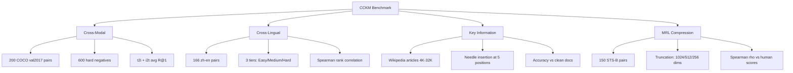
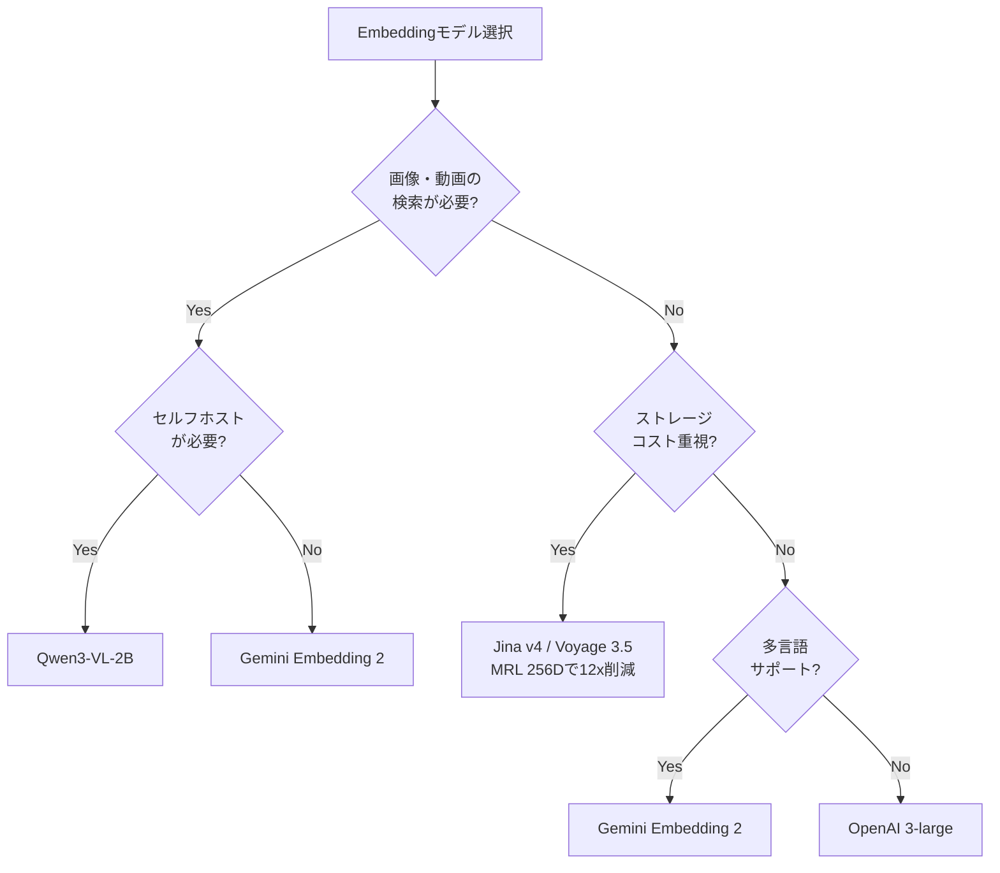

## ブログ概要

Milvus（Zilliz社）が公開したブログ記事 "Best Embedding Model for RAG 2026: 10 Models Compared" は、既存のMTEB（Massive Text Embedding Benchmark）が評価しないプロダクション要件を補完する独自ベンチマーク**CCKM**を設計し、10種のEmbeddingモデルを4つの軸で定量比較している。クロスモーダル検索ではオープンソースのQwen3-VL-2Bが0.945でAPI勢を上回り、クロスリンガル検索ではGemini Embedding 2が慣用句を含む難問で唯一1.000を達成した。

本記事は [https://milvus.io/blog/choose-embedding-model-rag-2026.md](https://milvus.io/blog/choose-embedding-model-rag-2026.md) の解説記事です。

この記事は [Zenn記事: Embeddingモデルの精度評価を自社データで実践する：500ペア評価・合成データ・LLM-as-Judge](https://zenn.dev/0h_n0/articles/adcdb688d73a8b) の深掘りです。

## 情報源

- **種別**: 企業テックブログ（ベクトルデータベースベンダー）
- **URL**: [https://milvus.io/blog/choose-embedding-model-rag-2026.md](https://milvus.io/blog/choose-embedding-model-rag-2026.md)
- **組織**: Milvus / Zilliz
- **対象**: RAG用Embeddingモデル選定

## 技術的背景 -- MTEBの限界とCCKMの必要性

MTEB（Massive Text Embedding Benchmark）は2022-2023年に設計された56タスクのベンチマークスイートであり、テキストEmbeddingモデルの標準的な評価基盤として広く利用されている。しかしZilliz社は、プロダクション環境のRAGパイプラインが直面する以下の要件をMTEBが十分にカバーしていないと指摘している。

1. **クロスモーダル検索**: テキストクエリに対して画像・動画を検索するユースケース。MTEBはテキスト同士の比較が中心であり、モダリティをまたぐ検索精度を評価していない。
2. **クロスリンガル検索**: 多言語RAGにおいて、言語をまたいだ意味的一致が求められる。MTEBの多言語評価は限定的であり、慣用句や意訳レベルの言語横断理解は測定対象外である。
3. **長文書のキー情報抽出**: 4K-32Kトークンの文書から特定の情報を正確にEmbeddingに反映できるか。MTEBのタスクは短文中心であり、長文書での情報損失を定量化していない。
4. **次元圧縮（MRL）耐性**: Matryoshka Representation Learning（MRL）によるベクトル次元の削減時に、検索精度がどの程度維持されるか。ストレージコスト最適化の観点で重要だが、MTEBでは未評価である。

これらの課題に対して、Zilliz社はCCKM（Cross-modal, Cross-lingual, Key information, MRL）ベンチマークを独自に設計・公開した。

## CCKMベンチマークの設計

CCKMは上述の4カテゴリで構成されており、各カテゴリはプロダクション環境で実際に問題となるシナリオを想定して設計されている。以下にMermaid図で全体構成を示す。



### Cross-Modal検索評価

COCO val2017から200組の画像-テキストペアを使用し、各ペアに対して1-2か所のみ異なる3つのハードネガティブ（計600ディストラクタ）を追加する。テキストから画像（t2i）と画像からテキスト（i2t）の双方向でRecall@1を計算し、平均値を`hard_avg_R@1`として報告している。ハードネガティブが細部のみ異なる設計により、細粒度の視覚-言語対応を評価できる。

### Cross-Lingual検索評価

166組の中国語-英語パラレル文を3つの難易度に分類している。

- **Easy（直訳）**: 「我爱你」と「I love you」のような直接対訳
- **Medium（意訳）**: 意味は同じだが表現が異なるペア。ハードネガティブとして類似表現を追加
- **Hard（慣用句）**: 「画蛇添足」と「gilding the lily」のように、文化的背景を理解しなければ対応付けできないペア

各言語に152のハードネガティブを追加し、zh→enとen→zhの双方向検索をSpearman順位相関で評価する。

### Key Information（長文書）評価

Wikipedia記事（4K-32Kトークン）に架空の事実（needle）を5つの位置（先頭、25%、50%、75%、末尾）に挿入し、クエリのEmbeddingがneedle挿入版とクリーン版を正しく識別できるかを測定する。コンテキストウィンドウの制約で情報が欠落するかを定量的に検証する手法である。

### MRL次元圧縮評価

STS-Bの150文ペアを使用し、人間が付与した類似度スコア（0-5）との相関を測定する。フル次元のEmbeddingを1024、512、256次元に切り詰め（truncation）、各次元でのSpearman相関係数 $\rho$ を報告する。MRLで明示的に訓練されたモデルとそうでないモデルの間で、次元圧縮耐性に差が生じるかを検証している。

## 実装アーキテクチャ -- 10モデルの評価結果

### モデル比較表

Zilliz社が報告している10モデルの各カテゴリスコアを以下に示す。

| モデル | 提供形態 | 次元数 | Cross-Modal | Cross-Lingual | Key Info | MRL $\rho$ (256D) |
|--------|---------|--------|-------------|---------------|----------|-------------------|
| Gemini Embedding 2 | API (Google) | 3072 | 0.928 | 0.997 | 1.000 | 0.683 |
| Qwen3-VL-2B | OSS (Alibaba) | 2048 | **0.945** | 0.988 | 1.000 | 0.774 |
| Voyage Multimodal 3.5 | API (Voyage AI) | 1024 | 0.900 | 0.982 | 1.000 | **0.880** |
| Jina Embeddings v4 | OSS (Jina AI) | 2048 | -- | 0.985 | 1.000 | 0.833 |
| OpenAI text-embedding-3-large | API (OpenAI) | 3072 | -- | 0.967 | 1.000 | 0.760 |
| Cohere Embed v4 | API (Cohere) | -- | -- | 0.955 | 1.000 | -- |
| Jina CLIP v2 | OSS (Jina AI) | -- | 0.873 | 0.934 | 1.000 | -- |
| BGE-M3 | OSS (BAAI) | -- | -- | 0.940 | 0.973 | 0.744 |
| mxbai-embed-large | OSS | -- | -- | 0.120 | 0.660 | 0.815 |
| nomic-embed-text | OSS | -- | -- | 0.154 | 0.633 | 0.780 |

### クロスモーダル評価 -- モダリティギャップ分析

Zilliz社はクロスモーダル検索精度とモダリティギャップ（テキストEmbeddingクラスタと画像Embeddingクラスタ間のL2距離）の関係を分析している。ブログによれば、Qwen3-VL-2Bのモダリティギャップは0.25であり、Gemini Embedding 2の0.73と比較して約3分の1であった。

$$
\text{Modality Gap} = \| \bar{\mathbf{e}}_{\text{text}} - \bar{\mathbf{e}}_{\text{image}} \|_2
$$

ここで $\bar{\mathbf{e}}_{\text{text}}$ はテキストEmbeddingの重心、$\bar{\mathbf{e}}_{\text{image}}$ は画像Embeddingの重心を表す。

モダリティギャップが小さいほど、テキストと画像のEmbeddingがベクトル空間内でより近い領域に分布し、クロスモーダル検索の精度向上に寄与する。2Bパラメータのオープンソースモデルが全API提供モデルを上回った点は注目に値するが、CCKMベンチマーク上のスコアであり、特定ドメインでは異なる結果となる可能性がある。

### MRL次元圧縮のトレードオフ

MRL（Matryoshka Representation Learning）で明示的に訓練されたモデルは、次元圧縮時の精度低下が著しく小さいとZilliz社は報告している。

| モデル | フル次元 $\rho$ | 256D $\rho$ | 低下率 |
|--------|----------------|-------------|--------|
| Voyage Multimodal 3.5 | 0.886 | 0.880 | 0.7% |
| Jina Embeddings v4 | 0.833 | 0.828 | 0.6% |
| OpenAI 3-large | 0.766 | 0.762 | 0.5% |
| nomic-embed-text | 0.780 | 0.774 | 0.8% |
| mxbai-embed-large | 0.815 | 0.795 | 2.5% |

3072次元から256次元への切り詰めはストレージを12倍削減する。MRL訓練済みモデルでは1%未満の精度低下で済む一方、非対応モデルでは2.5%以上の低下が発生する。MRLの原理は、先頭次元に意味的に重要な情報を集中させるマルチスケール損失関数にある。

$$
\mathcal{L}_{\text{MRL}} = \sum_{d \in \{256, 512, 1024, D\}} \mathcal{L}_{\text{contrastive}}(\mathbf{e}_{[:d]})
$$

ここで $\mathbf{e}_{[:d]}$ はEmbeddingの先頭 $d$ 次元を切り出したベクトル、$D$ はフル次元数を表す。

### モデル選択フローチャート

Zilliz社が提案する選択フローチャートをMermaid図で再構成する。



## Production Deployment Guide

ここではCCKMベンチマークの結果を踏まえ、Milvusベースのベクトル検索インフラをAWS上に構築する際の設計パターンを示す。

### AWS実装パターン（コスト最適化重視）

**トラフィック量別の推奨構成**:

| 構成 | トラフィック | アーキテクチャ | 月額概算 |
|------|-------------|---------------|---------|
| Small | ~100 req/日 | Milvus Lite + Lambda + S3 | $50-150 |
| Medium | ~1,000 req/日 | Milvus Standalone + ECS Fargate + S3 | $300-800 |
| Large | 10,000+ req/日 | Milvus Cluster + EKS + S3 + MSK | $2,000-5,000 |

> **注意**: 上記は2026年7月時点のAWS ap-northeast-1（東京）リージョン料金に基づく概算値です。実際のコストはトラフィックパターン、バースト使用量、リージョンにより変動します。最新料金は [AWS料金計算ツール](https://calculator.aws/) で確認してください。

**Small構成の詳細**:
- pymilvusのMilvus Lite（インプロセス、サーバー不要）をLambda上で実行
- S3にベクトルデータを永続化
- Embeddingモデルの推論はBedrock（Cohere Embed v4）またはSageMaker Endpoint
- 月額内訳: Lambda $5 + S3 $3 + Bedrock $40-100 + CloudWatch $2

**Large構成の詳細**:
- EKS（3ノード m6i.2xlarge）上にMilvus Clusterをデプロイ
- etcd、MinIO（S3互換）、Pulsarの依存コンポーネントもPod内で稼働
- MRL 256D対応モデル（Jina v4/Voyage）を選択し、ストレージコストを12倍削減
- Karpenterによるスポットインスタンス自動スケーリング
- 月額内訳: EKS $73 + EC2 m6i.2xlarge x3 $700 + S3 $50 + MSK $400 + ALB $30

**コスト削減テクニック**:
- Spot Instances活用でEC2コストを最大90%削減
- Reserved Instances 1年コミットで最大72%削減
- MRL 256D切り詰めでベクトルストレージを12倍削減（3072D→256D）
- Milvusのパーティション機能でホットデータとコールドデータを分離

### Terraformインフラコード

**Large構成（Container: EKS + Milvus Cluster）** の主要部分を示す。

```hcl
# large_milvus_eks.tf -- Milvus Cluster on EKS（10,000+ req/日向け）

module "eks" {
  source  = "terraform-aws-modules/eks/aws"
  version = "~> 20.31"

  cluster_name    = "milvus-rag-cluster"
  cluster_version = "1.32"
  vpc_id          = module.vpc.vpc_id
  subnet_ids      = module.vpc.private_subnets

  enable_cluster_creator_admin_permissions = true

  eks_managed_node_groups = {
    milvus = {
      instance_types = ["m6i.2xlarge"]
      capacity_type  = "SPOT"  # Spot優先でコスト最大90%削減
      min_size = 2; max_size = 6; desired_size = 3
      labels = { workload = "milvus" }
    }
  }

  tags = { Project = "milvus-rag", Env = "production" }
}

module "vpc" {
  source  = "terraform-aws-modules/vpc/aws"
  version = "~> 5.16"
  name    = "milvus-rag-vpc"
  cidr    = "10.0.0.0/16"

  azs             = ["ap-northeast-1a", "ap-northeast-1c", "ap-northeast-1d"]
  private_subnets = ["10.0.1.0/24", "10.0.2.0/24", "10.0.3.0/24"]
  public_subnets  = ["10.0.101.0/24", "10.0.102.0/24", "10.0.103.0/24"]

  enable_nat_gateway   = true
  single_nat_gateway   = true  # コスト削減: 本番では冗長NAT推奨
  enable_dns_hostnames = true
}

# AWS Budgets（月額アラート）
resource "aws_budgets_budget" "milvus_monthly" {
  name         = "milvus-rag-monthly"
  budget_type  = "COST"
  limit_amount = "3000"
  limit_unit   = "USD"
  time_unit    = "MONTHLY"

  notification {
    comparison_operator        = "GREATER_THAN"
    threshold                  = 80
    threshold_type             = "PERCENTAGE"
    notification_type          = "ACTUAL"
    subscriber_email_addresses = ["ops-team@example.com"]
  }
}
```

EKSクラスタへのMilvusデプロイはHelm Chart（v5.0.0）で行う。

```bash
helm repo add zilliztech https://zilliztech.github.io/milvus-helm/
helm repo update
helm install milvus zilliztech/milvus \
  --namespace milvus --create-namespace \
  --set cluster.enabled=true \
  --set etcd.replicaCount=3 \
  --set pulsar.enabled=true \
  --set metrics.enabled=true
```

### 運用・監視設定

**CloudWatch Logs Insights -- Milvus検索レイテンシ分析**:

```
fields @timestamp, @message
| filter @message like /search_latency/
| stats avg(search_latency_ms) as avg_latency,
        pct(search_latency_ms, 95) as p95_latency,
        pct(search_latency_ms, 99) as p99_latency
  by bin(1h)
| sort @timestamp desc
```

**X-Rayトレーシング + Milvus検索の計装（Python）**:

```python
from aws_xray_sdk.core import xray_recorder, patch_all
from pymilvus import MilvusClient

patch_all()  # boto3, requests等を自動計装

@xray_recorder.capture("milvus_search")
def search_vectors(
    client: MilvusClient,
    collection_name: str,
    query_vector: list[float],
    top_k: int = 10,
) -> list[dict]:
    """Milvusでベクトル検索を実行し、X-Rayでトレースする。

    Args:
        client: MilvusClientインスタンス
        collection_name: 検索対象コレクション名
        query_vector: クエリベクトル
        top_k: 返却する上位件数

    Returns:
        検索結果のリスト
    """
    subsegment = xray_recorder.current_subsegment()
    subsegment.put_annotation("collection", collection_name)
    subsegment.put_metadata("vector_dim", len(query_vector))

    results = client.search(
        collection_name=collection_name,
        data=[query_vector],
        limit=top_k,
        output_fields=["text"],
    )
    return results[0]
```

Container Insightsを有効化し、CPU 80%超・メモリ85%超でSNS通知するCloudWatchアラームを設定する。Milvusはメモリ集約型のため、閾値は一般より低めに設定する。Cost Explorer APIで`Project=milvus-rag`タグの日次コストを集計し、$100/日超過時に通知する構成も推奨する。

### コスト最適化チェックリスト

**アーキテクチャ選択**:
- [ ] トラフィック量を計測しSmall/Medium/Large構成を判断済み
- [ ] MRL対応モデル選択でストレージコストを試算済み

**リソース最適化**:
- [ ] EC2 Spot Instances優先（Karpenter設定）
- [ ] Reserved Instances 1年コミットで72%削減を検討
- [ ] Lambda Power Tuningでメモリサイズ最適化
- [ ] EKS KarpenterでPod数を自動調整

**ベクトルストレージ削減**:
- [ ] MRL 256D切り詰めで12倍削減（3072D→256D）
- [ ] IVF_FLATインデックスのnlist値を最適化
- [ ] パーティション分割でホット/コールドデータを分離
- [ ] S3 Intelligent-Tieringでコールドベクトルのコスト削減

**監視・アラート**:
- [ ] AWS Budgets月額アラート設定済み
- [ ] Container Insightsでメモリ/CPU監視
- [ ] Cost Anomaly Detection有効化
- [ ] 日次コストレポートをSNS通知

**リソース管理**:
- [ ] Projectタグによるコスト配分
- [ ] S3ライフサイクルポリシー設定
- [ ] 開発環境EKSノードの夜間ゼロスケール
- [ ] Terraform Stateの定期バックアップ

## パフォーマンス最適化 -- 次元圧縮とレイテンシ

### 次元圧縮によるストレージ最適化

CCKMの評価結果に基づくと、MRL対応モデル（Voyage Multimodal 3.5、Jina Embeddings v4）は256次元への切り詰めで1%未満の精度低下に抑えられるとZilliz社は報告している。100万ベクトルを格納する場合のストレージ削減効果を試算する。

- **3072次元（float32）**: $3072 \times 4 \text{ bytes} \times 10^6 = 11.4 \text{ GB}$
- **256次元（float32）**: $256 \times 4 \text{ bytes} \times 10^6 = 0.95 \text{ GB}$

約12倍のストレージ削減となりEBSやS3のコストに直接反映される。検索時のメモリ使用量も同比率で削減されるため、より小さいインスタンスタイプでの運用が可能になる。

### モデル選択による推論レイテンシ

セルフホストモデル（Qwen3-VL-2B、Jina v4）はネットワークレイテンシがなくGPU上で数ミリ秒で推論が完了するが、API提供モデル（Gemini、Voyage、OpenAI）はネットワーク往復時間（50-200ms）が加算される。大量バッチ処理ではセルフホストが有利だが、インフラ運用コストとのトレードオフがある。

## 運用での学び

### 軽量モデルの限界

CCKMの結果から、335Mパラメータ以下の軽量モデル（mxbai-embed-large、nomic-embed-text）はKey Information評価で4Kトークンを超えると急激に精度が低下することが示されている。mxbai-embed-largeは4Kで0.600、8Kで0.400まで低下し、ブログによれば58%の精度劣化が発生している。

プロダクション環境で長文書を扱うRAGパイプラインでは、コンテキストウィンドウの制約を事前に検証することが不可欠である。関連Zenn記事の「自社データによるEmbeddingモデル評価」アプローチを適用し、実際のドキュメント長分布に対するモデル精度を計測すべきである。

### クロスリンガル検索の落とし穴

英語中心のモデル（mxbai: 0.120、nomic: 0.154）はCross-Lingual評価でほぼ機能しないとZilliz社は報告している。多言語RAG構築時はターゲット言語ペアでの事前評価が必須であり、MTEB英語スコアだけで多言語性能を推定することは危険である。

## 学術研究との関連

CCKMの4つの評価軸は学術研究の課題に対応している。クロスモーダル検索はCLIP（Radford et al., 2021）以降の流れを受け、モダリティギャップはLiang et al. (2022) "Mind the Gap"で定式化された。MRLはKusupati et al. (2022)の提案に基づき、OpenAI text-embedding-3シリーズ（2024年1月）で商用モデルとして初めて採用された。SMEC（EMNLP 2025）がMRLの圧縮効率を再検討しており、次元圧縮と検索精度のトレードオフは活発な研究領域である。

## まとめ

Zilliz社のCCKMベンチマークは、MTEBが未評価のプロダクション要件を4軸で定量評価する試みである。10モデルの比較から用途に応じた選択指針が示されている。ただしCCKMはZilliz社の独自ベンチマークであり、タスク設計やデータセットの偏りが結果に影響する可能性がある。自社データでの評価（関連Zenn記事参照）と組み合わせることで、より信頼性の高いモデル選定が可能になる。

```python
from pymilvus import MilvusClient, DataType
import numpy as np


def create_embedding_collection(
    client: MilvusClient,
    collection_name: str,
    dim: int = 1024,
) -> None:
    """Milvusコレクションを作成（MRL対応次元設定）。

    MRL対応モデル使用時は dim=256 に設定することで、
    ストレージコストを最大12倍削減できる。

    Args:
        client: MilvusClientインスタンス
        collection_name: コレクション名
        dim: ベクトル次元数（デフォルト1024、MRL使用時は256推奨）
    """
    schema = client.create_schema(auto_id=True)
    schema.add_field("id", DataType.INT64, is_primary=True)
    schema.add_field("embedding", DataType.FLOAT_VECTOR, dim=dim)
    schema.add_field("text", DataType.VARCHAR, max_length=65535)

    index_params = client.prepare_index_params()
    index_params.add_index(
        field_name="embedding",
        index_type="IVF_FLAT",
        metric_type="COSINE",
        params={"nlist": 1024},
    )
    client.create_collection(
        collection_name=collection_name,
        schema=schema,
        index_params=index_params,
    )
```

## 参考文献

- **Blog URL**: [https://milvus.io/blog/choose-embedding-model-rag-2026.md](https://milvus.io/blog/choose-embedding-model-rag-2026.md)
- **Milvus EKS Deployment Guide**: [https://milvus.io/docs/eks.md](https://milvus.io/docs/eks.md)
- **Matryoshka Representation Learning (Kusupati et al., 2022)**: [https://arxiv.org/abs/2205.13147](https://arxiv.org/abs/2205.13147)
- **MTEB Benchmark**: [https://www.codesota.com/benchmarks/mteb](https://www.codesota.com/benchmarks/mteb)
- **Related Zenn article**: [https://zenn.dev/0h_n0/articles/adcdb688d73a8b](https://zenn.dev/0h_n0/articles/adcdb688d73a8b)
