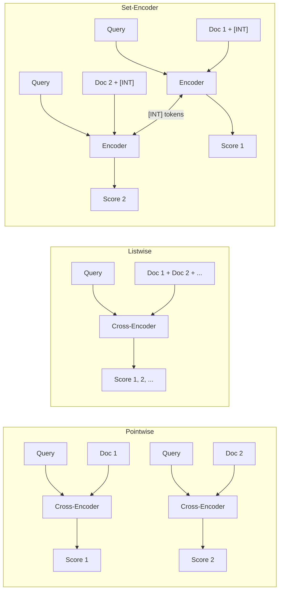

本記事は [Set-Encoder: Permutation-Invariant Inter-Passage Attention for Listwise Passage Re-Ranking with Cross-Encoders](https://arxiv.org/abs/2404.06912) の解説記事です。

## 論文概要（Abstract）

Set-Encoderは、Cross-Encoderによるリランキングにおいて、複数文書間の相互参照（inter-passage attention）を順序不変（permutation-invariant）に実現する新しいアーキテクチャである。従来のlistwise Cross-Encoderは文書を連結して入力するため入力順序にスコアが依存する問題があったが、Set-Encoderは各文書を独立した入力系列として処理しつつ、専用の[INT]トークンを介して文書間の情報交換を可能にする。著者らは、TREC Deep LearningおよびTIRExベンチマークにおいてSOTA並の有効性を維持しつつ、RankZephyrと比較して110倍の高速化と順序ロバスト性の向上を達成したと報告している。

この記事は [Zenn記事: Gemini Embedding×Contextual Retrieval×クエリ拡張でセマンティック検索精度を段階的に改善する](https://zenn.dev/0h_n0/articles/bd095b4bd8a798) の深掘りです。

## Zenn記事との関連

Zenn記事ではセマンティック検索パイプラインの3層改善（クエリ最適化・インデックス改善・Reranking）を解説しており、Layer 3としてCross-Encoderによるリランキングを取り上げている。Set-Encoderは、このLayer 3の実装において「文書間の相互参照を活用しつつ順序依存性を排除する」という実用上の課題を解決するアーキテクチャである。Zenn記事で示されたCross-Encoderの候補数とレイテンシのトレードオフに対して、Set-Encoderは100文書のリランキングを0.219秒（GPU）で実行可能という効率性を提供する。

## 情報源

- **会議名**: ECIR 2025（European Conference on Information Retrieval）
- **年**: 2025
- **URL**: [https://arxiv.org/abs/2404.06912](https://arxiv.org/abs/2404.06912)
- **著者**: Ferdinand Schlatt, Maik Frobe, Harrisen Scells, et al.
- **コード**: [https://github.com/webis-de/set-encoder](https://github.com/webis-de/set-encoder)
- **採択率**: 約23%

## カンファレンス情報

ECIR（European Conference on Information Retrieval）は、情報検索分野における欧州の主要会議であり、CORE Aランクに位置づけられている。第47回となるECIR 2025は2025年4月6日から10日にかけてイタリア・ルッカで開催され、207件の論文が5巻にわたって出版された。採択率は約23%であり、情報検索・自然言語処理・推薦システムなど幅広いトピックを扱う。

## 背景と動機（Background & Motivation）

検索システムにおけるリランキング（re-ranking）は、初段検索（BM25やDense Retrieval）で取得した候補文書群を精緻にスコアリングし直す処理である。Cross-Encoderはクエリと文書を同時にTransformerに入力するため、Bi-Encoderと比較して高い精度が得られる一方、計算コストが大きい。

従来のCross-Encoderは以下の3パターンに分類される。

1. **Pointwise**: クエリと各文書を個別にスコアリング。順序不変だが文書間の相互参照ができない
2. **Pairwise**: 2文書を比較してスコアリング。文書間の比較が可能だが組み合わせ数が$O(k^2)$で増大
3. **Listwise**: 複数文書を連結して一度にスコアリング。文書間の相互参照が可能だが入力順序にスコアが依存

listwise手法（RankGPT、RankZephyr等）は文書間の比較が可能であるため高い有効性を示す一方、入力文書の並び順によってスコアが変動する**順序バイアス**の問題を抱えている。特にautoregressive LLMベースの手法（RankGPT等）では、先頭に配置された文書が高くランク付けされやすいバイアスが観察されている。

Set-Encoderは「文書間の相互参照を可能にしつつ、入力順序への依存を排除する」という、従来のpointwiseとlistwiseの利点を統合するアプローチとして提案された。

## 主要な貢献（Key Contributions）

1. **Inter-passage attention機構の提案**: 各文書に付与した[INT]（interaction）トークンを介して文書間の情報交換を実現。従来のlistwise手法のように文書を連結せず、各文書を独立した入力系列として処理する
2. **順序不変性の達成**: 全入力系列の位置エンコーディングを0から開始することで、文書の入力順序がスコアに影響しないことを保証
3. **効率性の大幅向上**: 330Mパラメータモデルで100文書のリランキングを0.219秒（GPU）で実行。RankZephyrの24.047秒と比較して110倍高速
4. **Novelty-aware ranking**: Duplicate-Aware InfoNCEとNovelty-Aware RankNetの2段階学習により、重複文書を考慮したランキングを実現

## 技術的詳細（Technical Details）

### Cross-Encoderの3パターン比較

まず、既存のCross-Encoderアプローチの違いを整理する。



**Pointwise**はクエリと各文書を独別にスコアリングするため順序不変だが、文書間の情報（例: 文書Aと文書Bの内容が重複しているかどうか）を考慮できない。**Listwise**は複数文書を連結入力するため文書間の相互参照が可能だが、連結順序によって位置エンコーディングが変わり、スコアが順序に依存する。**Set-Encoder**は各文書を独立系列として処理しつつ、[INT]トークンを介して文書間の情報を交換することで、順序不変性と文書間相互参照を両立する。

### Inter-Passage Attention機構

Set-Encoderの核心は、各入力系列に[INT]（interaction）トークンを挿入し、このトークンを介して文書間の情報交換を行う仕組みである。

各入力系列は以下の形式で構成される。

$$
\text{input}_i = [\text{[CLS]}, \text{[INT]}, q_1, \ldots, q_{m_q}, d_{i,1}, \ldots, d_{i,m_d}]
$$

ここで、
- $\text{[CLS]}$: 分類トークン（最終的なスコア算出に使用）
- $\text{[INT]}$: インタラクショントークン（文書間情報交換用）
- $q_1, \ldots, q_{m_q}$: クエリトークン（最大32トークン）
- $d_{i,1}, \ldots, d_{i,m_d}$: $i$番目の文書トークン（最大256トークン）

通常のSelf-Attentionでは、各系列内のトークン同士でのみAttentionが計算される。Set-Encoderでは、各系列のAttention計算時に**他の全系列の[INT]トークンのKey・Value表現**を追加する。

系列$i$に対するAttention計算は以下のように拡張される。

$$
\bar{K}^{(i)} = [K_{\text{[INT]}}^{(j)} : j \neq i], \quad \bar{V}^{(i)} = [V_{\text{[INT]}}^{(j)} : j \neq i]
$$

$$
\text{Attention}^{(i)} = \text{softmax}\left(\frac{Q^{(i)} [K^{(i)} \| \bar{K}^{(i)}]^T}{\sqrt{d_h}}\right) [V^{(i)} \| \bar{V}^{(i)}]
$$

ここで、
- $Q^{(i)}, K^{(i)}, V^{(i)}$: 系列$i$のQuery, Key, Value行列
- $K_{\text{[INT]}}^{(j)}$: 系列$j$の[INT]トークンに対応するKey表現
- $d_h$: Attentionヘッドの次元数
- $\|$: 行列の連結（concatenation）

この設計により、各系列は自身の全トークンに加えて、他の全系列の[INT]トークンにもAttentionを向けることができる。[INT]トークンは各系列の「要約表現」として機能し、文書間の情報交換の軽量なブリッジとなる。

### 順序不変性（Permutation Invariance）の実現

Set-Encoderの順序不変性は、以下のアーキテクチャ上の設計により保証される。

**位置エンコーディングの統一**: 全ての入力系列で位置エンコーディングが0から開始される。すなわち、[CLS]は常に位置0、[INT]は常に位置1、クエリの最初のトークンは常に位置2に配置される。これにより、文書がリスト中のどの位置にあるかという情報が位置エンコーディングに含まれなくなる。

**数学的定義**: 文書集合$D = \{d_1, \ldots, d_k\}$に対する任意の順列$\pi$について、以下が成り立つ。

$$
\text{score}(q, d_i, D) = \text{score}(q, d_i, \pi(D)) \quad \forall i, \forall \pi
$$

従来のlistwise手法では、文書を連結する際の順序が位置エンコーディングに反映されるため、同じ文書でもリスト内の位置によって異なるスコアが割り当てられる。著者らの実験（論文Figure 2）では、RankZephyrには「階段状」の位置バイアスパターンが、RankGPT-4oには「対角線状」のautoregressive特有のバイアスが観察された一方、Set-Encoderには明確な位置バイアスが確認されなかったと報告されている。

### Self-Attention行列のマスキング戦略

Set-Encoderでは、文書を連結するのではなく独立した入力系列として処理するため、従来のcausal maskingは不要である。代わりに、各系列のSelf-Attention行列に以下のマスキング規則を適用する。

1. **系列内**: 全トークン間で双方向（bidirectional）Attentionを許可
2. **系列間**: [INT]トークンのKey・Valueのみが他系列からアクセス可能。一般トークン（クエリ・文書トークン）へのアクセスは遮断

この設計により、各系列はフルの双方向コンテキストを保持しつつ、文書間の情報交換は[INT]トークン1つに集約される。[INT]トークンは全系列で同じ位置（位置1）に配置されるため、他系列の[INT]トークンに対するAttentionは位置情報に依存しない。

### 学習手法

Set-Encoderの学習は2段階で行われる。

**Stage 1: Pre-fine-tuning（InfoNCE損失）**

MS MARCOのrelevance labelsを使用し、InfoNCE損失で初期学習を行う。

$$
\mathcal{L}_{\text{InfoNCE}} = -\log \frac{\exp(s^+)}{\exp(s^+) + \sum_{j=1}^{7} \exp(s_j^-)}
$$

ここで、$s^+$は正例文書のスコア、$s_j^-$は7つの負例文書のスコアである。

Novelty-aware variantでは、重複文書検出能力を獲得するためにDuplicate-Aware InfoNCE（DA-InfoNCE）を追加する。

$$
\mathcal{L}_{\text{DA-InfoNCE}} = \mathcal{L}_{\text{InfoNCE}} + \sum_{i=1}^{k} \left[ \mathbb{1}_{d_i = d^{\times}} \log p_i + \mathbb{1}_{d_i \neq d^{\times}} \log(1 - p_i) \right]
$$

ここで、$d^{\times}$は重複文書、$p_i$は文書$i$が重複であるかの予測確率である。

**Stage 2: Distillation（RankNet損失）**

Rank-DistiLLM（ColBERTv2-RankZephyr）のスコアを教師信号とし、RankNet損失で蒸留を行う。

$$
\mathcal{L}_{\text{RankNet}} = \sum_{i=1}^{k} \sum_{j=1}^{k} \mathbb{1}_{\bar{r}_i < \bar{r}_j} \log(1 + e^{s_i - s_j})
$$

ここで、$\bar{r}_i$は文書$i$の目標ランク、$s_i$はモデルが出力するスコアである。

Novelty-Aware RankNet（NA-RankNet）では、近接重複が上位にランク付けされている場合に目標relevanceを0に調整する。

### アルゴリズム（Pythonコード）

以下は、Set-Encoderのinter-passage attention機構の概念的な実装である。

```python
import torch
import torch.nn as nn
import torch.nn.functional as F


class InterPassageAttention(nn.Module):
    """Set-Encoderのinter-passage attention層。

    各系列の[INT]トークン表現を他系列と共有し、
    文書間の相互参照を順序不変に実現する。

    Args:
        d_model: モデルの隠れ層次元数
        n_heads: Attentionヘッド数
    """

    def __init__(self, d_model: int, n_heads: int) -> None:
        super().__init__()
        self.d_model = d_model
        self.n_heads = n_heads
        self.d_k = d_model // n_heads
        self.W_q = nn.Linear(d_model, d_model)
        self.W_k = nn.Linear(d_model, d_model)
        self.W_v = nn.Linear(d_model, d_model)
        self.W_o = nn.Linear(d_model, d_model)

    def forward(
        self,
        hidden_states: torch.Tensor,
        int_token_idx: int = 1,
    ) -> torch.Tensor:
        """Inter-passage attentionを計算する。

        Args:
            hidden_states: 全系列の隠れ状態
                shape: (num_passages, seq_len, d_model)
            int_token_idx: [INT]トークンの位置インデックス

        Returns:
            更新後の隠れ状態 (num_passages, seq_len, d_model)
        """
        num_passages, seq_len, _ = hidden_states.shape

        Q = self.W_q(hidden_states)
        K = self.W_k(hidden_states)
        V = self.W_v(hidden_states)

        # 各系列の[INT]トークンのKey/Valueを抽出
        int_K = K[:, int_token_idx, :]  # (num_passages, d_model)
        int_V = V[:, int_token_idx, :]  # (num_passages, d_model)

        outputs = []
        for i in range(num_passages):
            # 他系列の[INT]トークンを収集
            other_idx = [j for j in range(num_passages) if j != i]
            ext_K = int_K[other_idx]  # (num_passages-1, d_model)
            ext_V = int_V[other_idx]  # (num_passages-1, d_model)

            # 系列内のKey/Valueと結合
            K_cat = torch.cat([K[i], ext_K], dim=0)
            V_cat = torch.cat([V[i], ext_V], dim=0)

            # Scaled dot-product attention
            scores = torch.matmul(
                Q[i], K_cat.transpose(-2, -1)
            ) / (self.d_k ** 0.5)
            attn_weights = F.softmax(scores, dim=-1)
            out = torch.matmul(attn_weights, V_cat)
            outputs.append(out)

        result = torch.stack(outputs, dim=0)
        return self.W_o(result)
```

このコードは論文のアーキテクチャの概念を示すものであり、実際のマルチヘッド分割やバッチ処理の最適化は省略している。論文著者らの実装は[lightning-ir](https://github.com/webis-de/set-encoder)ライブラリに基づいている。

## 実装のポイント

### HuggingFace Transformersでの利用

著者らはHuggingFace Hub上に学習済みモデルを公開している。

- `webis/set-encoder-base`: ELECTRA-Base（110M）ベース
- `webis/set-encoder-large`: ELECTRA-Large（330M）ベース
- `webis/set-encoder-novelty-base`: Novelty-aware variant

実行には`lightning-ir`ライブラリが必要であり、以下のコマンドでリランキングを実行できる。

```bash
# lightning-irをインストール
pip install lightning-ir

# 設定ファイルを使用してリランキング実行
lightning-ir re_rank \
    --config ./configs/re-rank.yaml \
    --model.model_name_or_path webis/set-encoder-large
```

### バッチ処理の最適化

Set-Encoderの計算効率の鍵は、各文書を独立した入力系列として処理できる点にある。100文書のリランキングは以下のように効率的に実行される。

1. 各文書に対して `[CLS] [INT] query_tokens doc_tokens` の入力系列を構成
2. 全系列を1つのバッチとして並列処理
3. 各Transformer層で[INT]トークンのKey/Valueを系列間で共有
4. [CLS]トークンの最終表現からスコアを算出

著者らの報告によると、[INT]トークンの追加によるオーバーヘッドは最小限であり、pointwiseのmonoELECTRAとほぼ同等の推論速度を維持している。

### 学習時の設定

論文Table 5より、主要なハイパーパラメータは以下の通りである。

| パラメータ | 値 |
|-----------|-----|
| ベースモデル | ELECTRA-Base (110M) / Large (330M) |
| クエリ最大長 | 32トークン |
| 文書最大長 | 256トークン |
| Stage 1 学習ステップ | 20,000 |
| Stage 1 バッチサイズ | 32 |
| Stage 1 負例数 | 7/query |
| Stage 2 エポック数 | 3 |
| Stage 2 文書数/query | 100 |
| オプティマイザ | AdamW (lr=1e-5) |
| GPU | NVIDIA A100 40GB x 1 |

## Production Deployment Guide

Set-Encoderは330Mパラメータという比較的小型のモデルであり、100文書のリランキングを0.219秒で処理できるため、プロダクション環境での利用に適している。以下では、RAGパイプラインのリランキング層としてSet-Encoderをデプロイするためのパターンを示す。

### AWS実装パターン（コスト最適化重視）

**トラフィック量別の推奨構成**:

| 構成 | トラフィック | アーキテクチャ | 月額コスト（概算） |
|------|------------|---------------|------------------|
| Small | ~100 req/日 | Lambda + SageMaker Serverless | $50-150 |
| Medium | ~1,000 req/日 | ECS Fargate (GPU) + ElastiCache | $400-900 |
| Large | 10,000+ req/日 | EKS + Spot GPU Instances + Karpenter | $2,500-6,000 |

**Small構成の詳細**: API GatewayでリクエストをLambdaに受け、SageMaker Serverless Inference（ml.g5.xlarge）でSet-Encoder推論を実行する。SageMaker Serverless Inferenceはアイドル時にスケールダウンするため、低トラフィック環境での費用対効果が高い。DynamoDBにキャッシュ結果を保存し、同一クエリ・候補の再計算を回避する。

**Medium構成の詳細**: ECS Fargate上でGPU対応コンテナを実行し、ElastiCacheでリランキング結果をキャッシュする。330Mパラメータモデルはml.g5.xlargeインスタンス（NVIDIA A10G 24GB）で動作可能であり、1リクエストあたりの推論時間は0.2秒程度である。

**Large構成の詳細**: EKSクラスタにKarpenterを導入し、GPU Spot Instances（g5.xlarge）を優先的に利用する。Spot中断時のフォールバックとしてOn-Demand Instancesを設定し、Horizontal Pod Autoscalerでリクエスト数に応じたスケーリングを実現する。

**コスト削減テクニック**:
- GPU Spot Instances活用で最大73%削減（g5.xlarge: On-Demand $1.006/h vs Spot $0.27/h程度、ap-northeast-1）
- リランキング結果のキャッシュ（同一クエリ・候補セットは再計算不要）
- バッチリクエストの集約（複数リクエストを1バッチにまとめて推論効率を向上）

**コスト試算の注意事項**: 上記は2026年7月時点のAWS ap-northeast-1（東京）リージョン料金に基づく概算値である。実際のコストはトラフィックパターン、リージョン、バースト使用量により変動する。最新料金はAWS料金計算ツールで確認を推奨する。

### Terraformインフラコード

**Small構成（Serverless）: Lambda + SageMaker Serverless**

```hcl
# small_reranking_infra.tf
# Set-Encoder リランキング - Small構成（~100 req/日）

terraform {
  required_version = ">= 1.9"
  required_providers {
    aws = {
      source  = "hashicorp/aws"
      version = "~> 5.60"
    }
  }
}

provider "aws" {
  region = "ap-northeast-1"
}

# --- IAM ---
resource "aws_iam_role" "lambda_reranker" {
  name = "set-encoder-reranker-lambda"
  assume_role_policy = jsonencode({
    Version = "2012-10-17"
    Statement = [{
      Action    = "sts:AssumeRole"
      Effect    = "Allow"
      Principal = { Service = "lambda.amazonaws.com" }
    }]
  })
}

resource "aws_iam_role_policy" "lambda_reranker" {
  name = "set-encoder-reranker-policy"
  role = aws_iam_role.lambda_reranker.id
  policy = jsonencode({
    Version = "2012-10-17"
    Statement = [
      {
        Effect   = "Allow"
        Action   = ["sagemaker:InvokeEndpoint"]
        Resource = aws_sagemaker_endpoint.set_encoder.arn
      },
      {
        Effect = "Allow"
        Action = [
          "dynamodb:GetItem",
          "dynamodb:PutItem",
          "dynamodb:Query"
        ]
        Resource = aws_dynamodb_table.rerank_cache.arn
      },
      {
        Effect = "Allow"
        Action = [
          "logs:CreateLogGroup",
          "logs:CreateLogStream",
          "logs:PutLogEvents"
        ]
        Resource = "arn:aws:logs:*:*:*"
      }
    ]
  })
}

# --- DynamoDB キャッシュ ---
resource "aws_dynamodb_table" "rerank_cache" {
  name         = "set-encoder-rerank-cache"
  billing_mode = "PAY_PER_REQUEST"  # On-Demand: 低トラフィックでコスト最適
  hash_key     = "cache_key"

  attribute {
    name = "cache_key"
    type = "S"
  }

  ttl {
    attribute_name = "expires_at"
    enabled        = true
  }

  server_side_encryption {
    enabled = true  # KMS暗号化
  }
}

# --- CloudWatch アラーム ---
resource "aws_cloudwatch_metric_alarm" "lambda_errors" {
  alarm_name          = "set-encoder-lambda-errors"
  comparison_operator = "GreaterThanThreshold"
  evaluation_periods  = 2
  metric_name         = "Errors"
  namespace           = "AWS/Lambda"
  period              = 300
  statistic           = "Sum"
  threshold           = 5
  alarm_description   = "Set-Encoder Lambda error rate alert"
}
```

**Large構成（Container）: EKS + Karpenter + Spot GPU**

```hcl
# large_reranking_infra.tf
# Set-Encoder リランキング - Large構成（10,000+ req/日）

module "eks" {
  source  = "terraform-aws-modules/eks/aws"
  version = "~> 20.24"

  cluster_name    = "set-encoder-reranker"
  cluster_version = "1.31"

  vpc_id     = module.vpc.vpc_id
  subnet_ids = module.vpc.private_subnets

  # Karpenter用のIAMロール
  enable_cluster_creator_admin_permissions = true
}

# Karpenter Provisioner - Spot GPU優先
resource "kubectl_manifest" "karpenter_nodepool" {
  yaml_body = yamlencode({
    apiVersion = "karpenter.sh/v1"
    kind       = "NodePool"
    metadata   = { name = "gpu-spot" }
    spec = {
      template = {
        spec = {
          requirements = [
            {
              key      = "karpenter.sh/capacity-type"
              operator = "In"
              values   = ["spot", "on-demand"]  # Spot優先
            },
            {
              key      = "node.kubernetes.io/instance-type"
              operator = "In"
              values   = ["g5.xlarge", "g5.2xlarge"]
            }
          ]
          nodeClassRef = {
            group = "karpenter.k8s.aws"
            kind  = "EC2NodeClass"
            name  = "default"
          }
        }
      }
      limits   = { "nvidia.com/gpu" = 8 }
      disruption = {
        consolidationPolicy = "WhenEmptyOrUnderutilized"
        consolidateAfter    = "30s"
      }
    }
  })
}

# AWS Budgets - 月次予算アラート
resource "aws_budgets_budget" "reranker_monthly" {
  name         = "set-encoder-monthly"
  budget_type  = "COST"
  limit_amount = "6000"
  limit_unit   = "USD"
  time_unit    = "MONTHLY"

  notification {
    comparison_operator       = "GREATER_THAN"
    threshold                 = 80
    threshold_type            = "PERCENTAGE"
    notification_type         = "ACTUAL"
    subscriber_email_addresses = ["ops-team@example.com"]
  }
}
```

### 運用・監視設定

**CloudWatch Logs Insights クエリ（レイテンシ分析）**:

```
# Set-Encoder リランキングのP95/P99レイテンシ
fields @timestamp, rerank_latency_ms, num_passages
| filter event = "rerank_complete"
| stats percentile(rerank_latency_ms, 95) as p95,
        percentile(rerank_latency_ms, 99) as p99,
        avg(rerank_latency_ms) as avg_latency,
        count(*) as request_count
  by bin(1h)
| sort @timestamp desc
```

**CloudWatch アラーム設定（Python）**:

```python
import boto3


def create_reranker_alarms(
    endpoint_name: str = "set-encoder-reranker",
    sns_topic_arn: str = "",
) -> None:
    """Set-Encoderリランカーの監視アラームを作成する。

    Args:
        endpoint_name: SageMakerエンドポイント名
        sns_topic_arn: 通知先SNSトピックARN
    """
    cw = boto3.client("cloudwatch")

    # レイテンシ異常検知（P99 > 500ms）
    cw.put_metric_alarm(
        AlarmName=f"{endpoint_name}-latency-p99",
        MetricName="ModelLatency",
        Namespace="AWS/SageMaker",
        Statistic="p99",
        Period=300,
        EvaluationPeriods=2,
        Threshold=500000,  # マイクロ秒
        ComparisonOperator="GreaterThanThreshold",
        Dimensions=[
            {"Name": "EndpointName", "Value": endpoint_name},
        ],
        AlarmActions=[sns_topic_arn],
    )

    # GPU使用率異常（> 90%が5分以上継続）
    cw.put_metric_alarm(
        AlarmName=f"{endpoint_name}-gpu-utilization",
        MetricName="GPUUtilization",
        Namespace="/aws/sagemaker/Endpoints",
        Statistic="Average",
        Period=300,
        EvaluationPeriods=2,
        Threshold=90,
        ComparisonOperator="GreaterThanThreshold",
        Dimensions=[
            {"Name": "EndpointName", "Value": endpoint_name},
        ],
        AlarmActions=[sns_topic_arn],
    )
```

**X-Ray トレーシング設定（Python）**:

```python
from aws_xray_sdk.core import xray_recorder, patch_all

patch_all()  # boto3自動計装


@xray_recorder.capture("rerank_set_encoder")
def rerank_handler(query: str, passages: list[str]) -> list[float]:
    """Set-Encoderリランキングのトレーシング付きハンドラ。"""
    subsegment = xray_recorder.current_subsegment()
    subsegment.put_annotation("num_passages", len(passages))
    subsegment.put_metadata("query_length", len(query))
    # ... リランキング処理 ...
    return scores
```

**Cost Explorer自動レポート（Python）**:

```python
import datetime

import boto3


def get_daily_reranker_cost() -> dict:
    """Set-Encoderリランカーの日次コストレポートを取得する。"""
    ce = boto3.client("ce")
    today = datetime.date.today()
    yesterday = today - datetime.timedelta(days=1)

    response = ce.get_cost_and_usage(
        TimePeriod={
            "Start": yesterday.isoformat(),
            "End": today.isoformat(),
        },
        Granularity="DAILY",
        Metrics=["UnblendedCost"],
        Filter={
            "Tags": {
                "Key": "Project",
                "Values": ["set-encoder-reranker"],
            }
        },
        GroupBy=[{"Type": "DIMENSION", "Key": "SERVICE"}],
    )

    costs = {}
    for group in response["ResultsByTime"][0]["Groups"]:
        service = group["Keys"][0]
        amount = float(group["Metrics"]["UnblendedCost"]["Amount"])
        costs[service] = amount

    total = sum(costs.values())
    if total > 100:
        sns = boto3.client("sns")
        sns.publish(
            TopicArn="arn:aws:sns:ap-northeast-1:ACCOUNT:cost-alert",
            Subject="Set-Encoder daily cost exceeds $100",
            Message=f"Total: ${total:.2f}\nBreakdown: {costs}",
        )
    return costs
```

### コスト最適化チェックリスト

**アーキテクチャ選択**:
- [ ] トラフィック量に応じた構成を選択（Small: Serverless / Medium: Fargate / Large: EKS）
- [ ] GPU要件を確認（330Mモデルは4GB VRAM程度で動作）
- [ ] CPU推論の可否を評価（低レイテンシ要件がなければCPUでも実用可能）

**リソース最適化**:
- [ ] GPU: Spot Instances優先（g5.xlarge: 最大73%削減）
- [ ] Reserved Instances: 安定ワークロードには1年コミット（最大40%削減）
- [ ] Savings Plans: コンピューティング全体で検討
- [ ] SageMaker Serverless: 低トラフィック時のアイドルコスト削減
- [ ] Karpenter: 未使用ノードの自動統合・終了

**推論コスト削減**:
- [ ] リランキング結果のキャッシュ（DynamoDB TTL付き）
- [ ] バッチ推論の集約（複数リクエストを同一バッチで処理）
- [ ] 候補文書数の適応的制限（初段スコア上位50件に絞る等）
- [ ] モデルサイズ選択ロジック（簡易クエリはBaseモデル、複雑クエリはLargeモデル）

**監視・アラート**:
- [ ] AWS Budgets設定（月次予算の80%でアラート）
- [ ] CloudWatch アラーム（レイテンシP99、GPU使用率）
- [ ] Cost Anomaly Detection有効化
- [ ] 日次コストレポートの自動送信

**リソース管理**:
- [ ] 未使用SageMakerエンドポイントの自動停止
- [ ] Projectタグ戦略（コスト配賦の明確化）
- [ ] S3モデルアーティファクトのライフサイクルポリシー
- [ ] 開発環境の夜間・週末自動停止
- [ ] CloudWatch Logsの保持期間設定（30日等）

## 実験結果（Results）

### TREC Deep Learning 2019/2020

著者らは、TREC Deep Learning 2019および2020タスクにおいて、BM25およびColBERTv2の初段検索結果に対するリランキング性能を評価している。論文Table 1より、主要な結果は以下の通りである。

| モデル | パラメータ | TREC DL 19 (BM25) | TREC DL 19 (CBv2) | TREC DL 20 (BM25) | TREC DL 20 (CBv2) |
|--------|----------|-------------------|-------------------|-------------------|-------------------|
| RankGPT-4o | - | 0.725 | 0.784 | 0.719 | 0.793 |
| RankZephyr | 7B | 0.719 | 0.749 | 0.720 | 0.798 |
| monoELECTRA | 330M | 0.733 | 0.765 | 0.727 | 0.790 |
| **Set-Encoder** | **330M** | **0.733** | **0.789** | **0.735** | **0.799** |

nDCG@10で評価。Set-Encoder（330M）は、7BパラメータのRankZephyrおよびGPT-4oベースのRankGPTと同等以上の性能を330Mパラメータで達成している。特にColBERTv2の初段検索結果に対するリランキングでは、TREC DL 19で0.789、TREC DL 20で0.799と、RankGPT-4oを上回る結果が報告されている。

### TIRExベンチマーク

TIRExは13のコレクションにまたがるベンチマークであり、著者らはSet-EncoderがRankZephyrを13コレクション中6コレクションで上回ったと報告している（論文Table 2）。幾何平均nDCG@10は0.321であり、多くの設定で統計的に有意な差は認められなかった（p < 0.05）。

### Novelty-Aware Ranking

文書の重複・近接重複を考慮したランキングでは、Set-Encoderが顕著な優位性を示している。論文Table 3より、alpha-nDCG@10の結果は以下の通りである。

| モデル・構成 | alpha-nDCG@10 (DL 19) | alpha-nDCG@10 (DL 20) |
|-------------|----------------------|----------------------|
| RankGPT-4o Novelty | 0.741 | 0.773 |
| monoELECTRA + NA-RankNet | 0.718 | 0.745 |
| **Set-Encoder + DA-InfoNCE + NA-RankNet** | **0.821** | **0.803** |

Set-Encoderの[INT]トークンを介した文書間情報交換は、重複文書の検出に特に有効であることが示されている。著者らは、DA-InfoNCEによる事前学習（priming）がなければ文書間相互参照を有効活用できず、標準的なrelevance rankingでは文書間相互参照の必要性がないことを指摘している。

### 効率性の比較

論文Table 4より、100文書のリランキングに要する時間とメモリ使用量は以下の通りである。

| モデル | 推論時間（秒） | メモリ（GB） | 対RankZephyr速度比 |
|--------|-------------|------------|-------------------|
| RankGPT-4o | 18.773 | - | 0.8x |
| RankZephyr | 24.047 | 15.48 | 1x |
| LiT5-Distill | 2.054 | 2.69 | 12x |
| **Set-Encoder (330M)** | **0.219** | **2.60** | **110x** |
| monoELECTRA (330M) | 0.211 | 2.55 | 114x |

Set-EncoderはmonoELECTRA（pointwise）とほぼ同等の推論速度を維持しつつ、inter-passage attentionによる文書間相互参照機能を追加している。[INT]トークン1つの追加によるオーバーヘッドは0.008秒（100文書処理時）と報告されている。

### 順序ロバスト性

論文Figure 3より、Set-Encoderは入力文書の順序（ランダム、逆理想順、理想順、元のBM25順）によらず一定のnDCG@10（約0.789）を維持する。一方、RankGPT-4oやLiT5-Distillは入力順序によって性能が変動し、特にRankGPT-4oは理想順入力時に最高性能を示すが、逆順入力時に性能が低下するバイアスが観察されている。

## 実運用への応用

### RAGパイプラインのLayer 3としての活用

Zenn記事で解説されている3層改善パイプラインにおいて、Set-EncoderはLayer 3（Reranking）の実装として以下の利点を持つ。

**順序不変性による安定した検索品質**: 従来のlistwise手法では、初段検索のスコア順序がリランキング結果に影響するため、BM25とDense検索のスコア融合方法によって最終結果が変動しうる。Set-Encoderはこの問題を排除し、初段検索の出力順序に依存しない安定した結果を提供する。

**効率性と精度のバランス**: 330Mパラメータで100文書を0.219秒で処理できるため、Zenn記事で示されたCross-Encoderのレイテンシ目安（100件: 50-100ms GPU）とおおむね整合する。7BのRankZephyrと比較して20分の1のメモリ使用量（2.60GB vs 15.48GB）で動作するため、小型GPUやCPU環境でも実用的である。

**重複文書の除去**: RAGでは初段検索で類似チャンクが複数ヒットしやすいが、Set-EncoderのNovelty-aware variantは重複文書のスコアを自動的に下げることで、多様な情報をLLMに提供できる。

### 適用時の注意点

Set-Encoderの効果が限定的な場面もある。著者らの分析によれば、標準的なrelevance ranking（TREC DL）では文書間相互参照のメリットは小さく、pointwiseのmonoELECTRAと同等の性能にとどまる。inter-passage attentionが真価を発揮するのは、Novelty-aware rankingのように**文書間の関係性を考慮する必要があるタスク**である。

## 関連研究

- **RankGPT** (Sun et al., 2023): GPT-4等のLLMを用いたlistwiseリランキング。高い有効性を示すが、autoregressive生成に由来する位置バイアスがあり、推論コストも高い。Set-Encoderは同等以上の性能を330Mパラメータで達成している
- **RankVicuna / RankZephyr** (Pradeep et al., 2023-2024): オープンソースLLMのlistwiseリランキング。RankZephyrは7Bパラメータでlistwise SOTA級の性能を示すが、推論時間が24秒/100文書と実用上の制約がある
- **monoT5** (Nogueira et al., 2020): T5ベースのpointwiseリランキング。効率的だが文書間相互参照ができない。Set-Encoderはpointwise同等の効率性で文書間相互参照を追加した位置づけにある
- **LiT5** (Tamber et al., 2023): T5ベースのlistwiseリランキング。蒸留により効率化されているが、Set-Encoderと比較して9.5倍低速であり、順序バイアスも残存する

## まとめと今後の展望

Set-Encoderは、Cross-Encoderリランキングにおける「文書間相互参照」と「順序不変性」を両立する実用的なアーキテクチャである。著者らの実験結果によれば、330Mパラメータで7Bのlistwiseモデルと同等の有効性を達成しつつ、110倍の高速化と順序バイアスの排除を実現している。

実務上の示唆として、標準的なrelevance rankingではpointwiseのmonoELECTRAで十分な性能が得られるが、RAGパイプラインにおける重複チャンクの除去やDiversity-aware rankingが求められる場面ではSet-Encoderの文書間相互参照機能が有効である。将来の研究方向として、著者らは検索結果の多様化（MMR等との統合）やより大規模なSet-Encoderモデルの可能性に言及している。

## 参考文献

- **Conference URL**: [https://arxiv.org/abs/2404.06912](https://arxiv.org/abs/2404.06912)
- **Code**: [https://github.com/webis-de/set-encoder](https://github.com/webis-de/set-encoder)
- **Related Zenn article**: [https://zenn.dev/0h_n0/articles/bd095b4bd8a798](https://zenn.dev/0h_n0/articles/bd095b4bd8a798)
- **ECIR 2025 Proceedings**: [https://link.springer.com/conference/ecir](https://link.springer.com/conference/ecir)
- **lightning-ir Library**: [https://github.com/webis-de/set-encoder](https://github.com/webis-de/set-encoder)

---

:::message
この記事はAI（Claude Code）により自動生成されました。内容の正確性については論文原文で検証していますが、最新情報は公式リポジトリおよび論文をご確認ください。
:::
