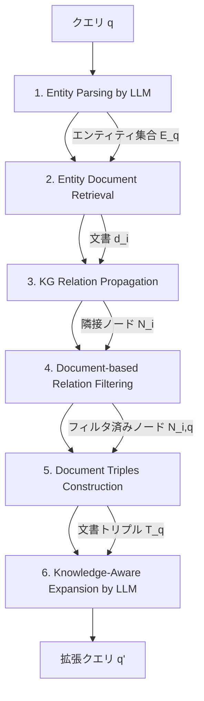

本記事は [Knowledge-Aware Query Expansion with Large Language Models for Textual and Relational Retrieval](https://aclanthology.org/2025.naacl-long.216/) の解説記事です。

## 論文概要（Abstract）

LLMを用いたクエリ拡張は検索精度の向上に有効であるが、既存手法はテキスト類似度の向上にのみ着目し、文書間の構造的関係を無視している。著者らは、知識グラフ（KG）の構造化された文書関係をLLMに統合するKnowledge-Aware Retrieval（KAR）フレームワークを提案している。文書テキストをKGノードの豊かな表現として活用し、document-based relation filteringによりentity-basedスコアリングの限界を克服する。3つの異なるドメインのデータセット（商品検索、学術論文、精密医療）で既存手法を上回る性能が報告されている。

この記事は [Zenn記事: Gemini Embedding×Contextual Retrieval×クエリ拡張でセマンティック検索精度を段階的に改善する](https://zenn.dev/0h_n0/articles/bd095b4bd8a798) の深掘りです。

## Zenn記事との関連

Zenn記事では、RAGパイプラインを「Layer 1: クエリ最適化」「Layer 2: インデックス改善」「Layer 3: 検索リランキング」の3層で段階的に改善するアプローチを解説している。本論文が対象とするクエリ拡張はまさにLayer 1に該当する技術である。Zenn記事ではLLMによるクエリ拡張でPrecision@20を80.6%に引き上げた結果を紹介しているが、KARはこのクエリ拡張をさらに一歩進め、知識グラフの関係情報を統合することでテキスト類似度だけでは捉えられない文書間の構造的関係も考慮する手法を提案している。

## 情報源

- **会議名**: NAACL 2025（The 2025 Conference of the Nations of the Americas Chapter of the Association for Computational Linguistics）
- **年**: April 2025
- **URL**: [https://aclanthology.org/2025.naacl-long.216/](https://aclanthology.org/2025.naacl-long.216/)
- **著者**: Yu Xia, Junda Wu（UC San Diego）, Sungchul Kim, Tong Yu, Ryan A. Rossi, Haoliang Wang（Adobe Research）, Julian McAuley（UC San Diego）
- **ページ**: 4275-4286
- **DOI**: 10.18653/v1/2025.naacl-long.216
- **arXiv**: [2410.13765](https://arxiv.org/abs/2410.13765)

## カンファレンス情報

NAACL（Nations of the Americas Chapter of the Association for Computational Linguistics）は、計算言語学・自然言語処理分野における主要な国際会議の1つであり、ACL（Association for Computational Linguistics）の北米支部が主催する。NAACL 2025はAlbuquerque, New Mexicoで2025年4月29日〜5月4日に開催された。Long Papersは査読を経て厳選されるため、採択された論文は自然言語処理分野における重要な技術的貢献を含むと位置づけられている。

## 背景と動機（Background & Motivation）

LLMを活用したクエリ拡張は情報検索の精度向上に有効な手法として広く研究されている。HyDE（Gao et al., 2023）はLLMに仮想文書を生成させ、Query2Doc（Wang et al., 2023）はfew-shot例を通じて拡張品質を改善し、RAR（Shen et al., 2024）は初期検索結果をLLMの文脈として活用する。

しかし、これらの手法はいずれもテキスト類似度の向上のみに焦点を当てている。実世界の検索クエリは、テキスト的要件と関係的要件の両方を含む半構造化クエリであることが多い。著者らは論文中で次の例を挙げている：「Find me a highly rated camera for wildlife photography compatible with my Nikon F-Mount lenses」というクエリでは、「highly rated」「wildlife photography」がテキスト的要件、「compatible with Nikon F-Mount lenses」が関係的要件に該当する。

既存手法はこのようなクエリに対し、テキスト的に類似した拡張を生成するが、文書間の構造的関係（レンズ互換性など）を見落とし、意味的に近いが関係的には無関係な拡張を生成してしまう問題がある。例えば、HyDEやRARは「Nikon Coolpix P1000」を拡張として生成するが、このカメラはF-Mountレンズと互換性がない。

## 主要な貢献（Key Contributions）

1. **知識認識クエリ拡張フレームワークの提案**: テキスト的要件と関係的要件の両方を持つ半構造化クエリに対応するため、LLMに知識グラフの構造的文書関係を統合するKARフレームワークを提案
2. **Document-based Relation Filtering（DRF）**: 従来のentity名ベースのスコアリングに代わり、文書テキスト全体をKGノード表現として活用するフィルタリング手法を提案。エンティティ名だけでは捉えられない詳細な文書情報をクエリとの関連度評価に利用
3. **3ドメインでの実証実験**: Amazon商品検索、学術論文検索（MAG）、精密医療検索（PRIME）の3つの異なるドメインで、ゼロショット設定で既存手法を上回る性能を達成

## 技術的詳細（Technical Details）

### 問題定義

知識ベースは、テキスト文書集合$\mathcal{D}$と知識グラフ$\mathcal{G} = (\mathcal{V}, \mathcal{R})$から構成される。$d_i \in \mathcal{D}$はエンティティ$i$を記述するテキスト文書、$v_i \in \mathcal{V}$は対応するKGノード、$\mathcal{R}$はノード間の関係集合である。クエリ$q$に対し、テキスト的要件と関係的要件の両方を満たす文書集合$\mathcal{A} \subseteq \mathcal{D}$を出力することが目標となる。

クエリ拡張関数$f$と拡張クエリ$q'$は以下のように定義される：

$$
\mathcal{Q}_e = f(q, \mathcal{D}, \mathcal{G})
$$

$$
q' = \text{Concat}(q, \mathcal{Q}_e)
$$

ここで、$\mathcal{Q}_e$は生成された拡張テキスト、$q'$は元のクエリ$q$に拡張を連結した最終クエリである。

### KARフレームワークの全体像

KARは6つのステップで構成される。以下のフローチャートに全体像を示す。



### Step 1: Entity Parsing by LLM

最初のステップでは、LLMを使用してクエリ$q$から明示的に言及されているエンティティを抽出する。文書構造（属性名やフィールド名）をプロンプトに含め、構造化された形式でエンティティを出力させる。Gao et al.（2023）と同様に、元のクエリ$q$自体も検索対象のエンティティ文書を代表する擬似エンティティとして扱う。

$$
\mathcal{E}_q = \{q, \text{LLM}(q)\}
$$

ここで$\mathcal{E}_q$はクエリから抽出されたエンティティの集合である。例えば、学術論文検索のクエリからは著者名、論文タイトル、クエリ自体が抽出される。

### Step 2: Entity Document Retrieval

抽出された各エンティティ$i \in \mathcal{E}_q$に対し、テキスト埋め込みモデルを用いて文書集合$\mathcal{D}$から関連するテキスト文書$d_i$を検索する。例えば、著者エンティティに対しては著者名・論文数・被引用数を含む文書、論文エンティティに対してはアブストラクト・出版情報を含む文書が取得される。

### Step 3: KG Relation Propagation

取得した文書に対応するKGノード$v_i \in \mathcal{V}$を特定し、KG上で$h$-hop近傍ノードとそれらとの関係を抽出する。具体的には、ノード$v_i$から$h$ホップ以内に到達可能な隣接ノード集合$\mathcal{N}_i$とそれらへの関係集合$\mathcal{R}_i$を取得する。各隣接ノード$v_j \in \mathcal{N}_i$についても、対応するテキスト文書$d_j$をリンクする。

著者らは計算量と情報量のバランスから$h = 2$を採用している。

### Step 4: Document-based Relation Filtering（DRF）

KARの核となるステップである。密なKGではノードの隣接ノード数が膨大になるため、クエリに関連するノードのみをフィルタリングする必要がある。

既存のKGベース手法（Yasunaga et al., 2021; Zhang et al., 2022; Taunk et al., 2023）はエンティティ名のみに基づくスコアリングを行う。しかし、エンティティ名は「Nikon camera」のように簡潔であり、ユーザーが実際に検索する「highly rated」「wildlife」といったテキスト的詳細を含まない。

KARは、隣接ノードの対応テキスト文書$d_j$をそのまま埋め込み空間にマッピングし、クエリとの意味的類似度を計算する：

$$
s_{j,q} = \text{Sim}(\mathbf{x}_j, \mathbf{x}_q)
$$

ここで、
- $\mathbf{x}_j = \text{Embed}(d_j)$: 隣接ノード$v_j$に対応する文書$d_j$の埋め込みベクトル
- $\mathbf{x}_q = \text{Embed}(q)$: クエリ$q$の埋め込みベクトル
- $\text{Sim}$: コサイン類似度（内積）

類似度スコアに基づき、上位$k$個のノードを選択する：

$$
\mathcal{N}_{i,q} = \{v_j \in \mathcal{N}_i \mid s_{j,q} \in \text{TopK}(s_q)\}
$$

対応するクエリに焦点を当てた関係集合$\mathcal{R}_{i,q} \subseteq \mathcal{R}_i$も導出される。このフィルタリングは既存のテキスト埋め込みモデルをそのまま使用するため、追加の学習やファインチューニングが不要であり、新しいノードがKGに追加された際にも再学習なしで対応できるスケーラビリティを持つ。

### Step 5: Document Triples Construction

フィルタリング済みの隣接ノードと関係から、文書ベースの知識トリプルを構築する：

$$
\mathcal{T}_{i,q} = \{(d_i, r_{i,j}, d_j) \mid v_j \in \mathcal{N}_{i,q}, r_{i,j} \in \mathcal{R}_{i,q}\}
$$

ここで$r_{i,j}$はKG上のノード$v_i$から$v_j$への関係（例：「author writes paper」「paper cites paper」）、$d_i$と$d_j$はそれぞれ各ノードに対応するテキスト文書である。従来のentity-basedトリプル（エンティティ名のみ）と異なり、文書ベースのトリプルはアブストラクト、出版日、ベニューなどの詳細情報を含むため、LLMがより正確な拡張を生成するための豊かな文脈を提供する。

### Step 6: Knowledge-Aware Expansion

最終ステップでは、構築した文書トリプル$\mathcal{T}_q$と元のクエリ$q$をLLMに入力し、知識認識クエリ拡張を生成する：

$$
\mathcal{Q}_e = \text{LLM}(q, \mathcal{T}_q)
$$

Shen et al.（2024）およびChen et al.（2024）に従い、単一のLLM推論から$n$個の応答をサンプリングし、それらを連結して最終的な拡張テキストとする。著者らはデフォルトで$n = 3$を使用している。

### クエリ拡張アルゴリズムの実装例

以下に、KARフレームワークの中核ロジックをPythonで示す。

```python
from dataclasses import dataclass
import numpy as np


@dataclass
class DocumentTriple:
    """文書ベースの知識トリプル

    Attributes:
        source_doc: ソースノードのテキスト文書
        relation: KG上の関係タイプ
        target_doc: ターゲットノードのテキスト文書
    """
    source_doc: str
    relation: str
    target_doc: str


def document_based_relation_filtering(
    query: str,
    neighbor_docs: list[str],
    embed_fn: callable,
    top_k: int = 10,
) -> list[int]:
    """Document-based Relation Filtering (DRF)

    エンティティ名ではなく文書テキスト全体の埋め込みを用いて
    クエリに関連する隣接ノードをフィルタリングする。

    Args:
        query: 元の検索クエリ
        neighbor_docs: 隣接ノードに対応する文書テキストのリスト
        embed_fn: テキスト埋め込み関数 (str -> np.ndarray)
        top_k: 選択する上位ノード数

    Returns:
        選択されたノードのインデックスリスト
    """
    # クエリと各隣接文書の埋め込みを計算
    query_emb = embed_fn(query)  # shape: (d,)
    doc_embs = np.array([embed_fn(doc) for doc in neighbor_docs])  # shape: (n, d)

    # コサイン類似度によるスコアリング
    scores = doc_embs @ query_emb / (
        np.linalg.norm(doc_embs, axis=1) * np.linalg.norm(query_emb)
    )

    # Top-k 選択
    top_k = min(top_k, len(scores))
    selected_indices = np.argsort(scores)[-top_k:][::-1].tolist()
    return selected_indices


def build_document_triples(
    entity_doc: str,
    neighbor_docs: list[str],
    relations: list[str],
    selected_indices: list[int],
) -> list[DocumentTriple]:
    """フィルタリング済みノードから文書トリプルを構築する

    Args:
        entity_doc: ソースエンティティのテキスト文書
        neighbor_docs: 隣接ノードの文書リスト
        relations: 各隣接ノードとの関係タイプ
        selected_indices: DRFで選択されたインデックス

    Returns:
        文書トリプルのリスト
    """
    triples = []
    for idx in selected_indices:
        triples.append(DocumentTriple(
            source_doc=entity_doc,
            relation=relations[idx],
            target_doc=neighbor_docs[idx],
        ))
    return triples
```

### LLMプロンプト設計

KARは2箇所でLLMを使用する。論文のAppendix Aに記載されたプロンプトテンプレートを以下にまとめる。

**Entity Parsingプロンプト**:

```
Given the document structures: {doc_struct}, identify named
entities in the following user query. Follow the document
structures, write a document for each entity in the format:
{document type: {document attributes}}.
Query: {query}
```

**Knowledge-Aware Expansionプロンプト**:

```
Given the document structures: {doc_struct} and retrieved
textual and relational documents: {KAR_document_triples},
extract useful information that help answer the following
user query. Then, write a document that answers the following
user query. Return the document only without any additional
text.
Query: {query}
```

ここで`{doc_struct}`はデータセット固有の文書構造定義（商品の場合はTitle, Features, Description, Reviews等）、`{KAR_document_triples}`はStep 5で構築した文書トリプルのテキスト表現である。

## 実装のポイント

### 知識グラフの構築方法

本論文ではSTaRKベンチマーク（Wu et al., 2024b）の既存KGを使用しているが、実運用では独自のKG構築が必要になる。著者らの実装から読み取れる設計指針は以下の通りである。

**ノード表現**: 各ノードには構造化されたテキスト文書を対応させる。商品の場合はタイトル・特徴・説明・レビュー、論文の場合はタイトル・アブストラクト・出版日・ベニューなど、ユーザークエリに頻出する属性を含める。

**関係タイプの設計**: AMAZONでは「together viewed」「together purchased」「brand」「color」、MAGでは「citation」「authorship」「field of study」、PRIMEでは「disease-gene」「drug-protein interaction」が使用されている。ドメインに応じた関係タイプの適切な設計が性能に影響する。

**h-hopパラメータ**: $h = 2$が採用されている。$h$を増やすと探索範囲が指数的に拡大するが、ノイズも増加するため、著者らはZhang et al.（2022）およびTaunk et al.（2023）に従い$h = 2$を推奨している。

**Top-k フィルタリング**: $k = 10$がデフォルト値である。論文のFigure 3のablation studyによれば、$k$が小さすぎると関連情報の欠落、大きすぎるとノイズの混入が発生し、$k = 10$が3データセットで安定した性能を示している。

### ゼロショット設定の利点

KARはゼロショット手法であり、追加の学習やファインチューニングを必要としない。これは以下の3点で実運用上の利点がある：(1) 既存のLLMとテキスト埋め込みモデルをそのまま使用可能、(2) 新しいドメインへの適用時にトレーニングデータの準備が不要、(3) KGにノードが追加されても再学習なしでDRFが機能する。

## Production Deployment Guide

KARフレームワークを本番環境にデプロイする際のAWS実装パターンを示す。KARはLLM推論（2回: Entity Parsing + Expansion）、テキスト埋め込み計算、KGクエリの3種類の処理を含むため、これらのコンポーネントを効率的に組み合わせる構成が必要になる。

### AWS実装パターン（コスト最適化重視）

**トラフィック量別の推奨構成**:

| 構成 | トラフィック | 主要サービス | 月額概算 |
|------|------------|------------|---------|
| Small | ~100 req/日 | Lambda + Bedrock + Neptune Serverless | $80-200 |
| Medium | ~1,000 req/日 | ECS Fargate + Bedrock + Neptune | $400-900 |
| Large | 10,000+ req/日 | EKS + Spot + Neptune + OpenSearch | $2,500-6,000 |

**Small構成（~100 req/日）の詳細**:
- **Lambda**: KAR パイプラインの実行（メモリ1024MB、タイムアウト60秒）
- **Bedrock（Claude 3.5 Haiku）**: Entity ParsingとKnowledge-Aware Expansion（2回/クエリ）
- **Neptune Serverless**: KGの格納とh-hop近傍クエリ（2 NCU minimum）
- **Bedrock Embeddings（Titan Embeddings V2）**: DRFのベクトル計算
- **DynamoDB**: 文書テキストのキーバリューストア
- 月額内訳: Lambda $5 + Bedrock LLM $20-50 + Bedrock Embeddings $10 + Neptune $50-80 + DynamoDB $5-10

**Medium構成（~1,000 req/日）の詳細**:
- **ECS Fargate**: KARパイプラインのコンテナ実行（2vCPU/4GB RAM、2タスク）
- **Bedrock**: LLMとEmbeddings（Batch APIで50%コスト削減）
- **Neptune**: プロビジョニングインスタンス（db.r6g.large）
- **ElastiCache（Redis）**: 埋め込みベクトルキャッシュ（DRF高速化）
- 月額内訳: ECS $120-200 + Bedrock $100-300 + Neptune $200-300 + ElastiCache $50-80

**Large構成（10,000+ req/日）の詳細**:
- **EKS**: Karpenterによるオートスケーリング（Spot Instances優先で最大90%コスト削減）
- **Bedrock + Prompt Caching**: doc_struct部分のキャッシュで30-90%のLLMコスト削減
- **Neptune + OpenSearch**: KGクエリとベクトル検索の分離（OpenSearchでDRFベクトル検索を高速化）
- **S3 + Athena**: 文書テキストの大規模ストレージとアドホック分析
- Spot Instancesの活用でEC2コストを最大90%削減、Reserved Instancesで最大72%削減

**コスト試算の注意事項**: 上記はAWS ap-northeast-1（東京）リージョンの2026年7月時点の概算値である。実際のコストはトラフィックパターン、バースト使用量、Bedrockモデルの選択により変動する。最新料金はAWS Pricing Calculatorで確認を推奨する。

### Terraformインフラコード

**Small構成（Serverless）**:

```hcl
# KAR Pipeline - Small構成 (Lambda + Bedrock + Neptune Serverless)
# 2026-07時点の最新安定版モジュール使用

terraform {
  required_version = ">= 1.9"
  required_providers {
    aws = {
      source  = "hashicorp/aws"
      version = "~> 5.60"
    }
  }
}

provider "aws" {
  region = "ap-northeast-1"
}

# --- VPC基盤（NAT Gateway不使用でコスト削減）---
resource "aws_vpc" "kar" {
  cidr_block           = "10.0.0.0/16"
  enable_dns_hostnames = true
  tags = { Name = "kar-pipeline-vpc" }
}

resource "aws_subnet" "private" {
  count             = 2
  vpc_id            = aws_vpc.kar.id
  cidr_block        = cidrsubnet("10.0.0.0/16", 8, count.index)
  availability_zone = data.aws_availability_zones.available.names[count.index]
  tags = { Name = "kar-private-${count.index}" }
}

data "aws_availability_zones" "available" {
  state = "available"
}

# --- IAMロール（最小権限原則）---
resource "aws_iam_role" "kar_lambda" {
  name = "kar-lambda-role"
  assume_role_policy = jsonencode({
    Version = "2012-10-17"
    Statement = [{
      Action = "sts:AssumeRole"
      Effect = "Allow"
      Principal = { Service = "lambda.amazonaws.com" }
    }]
  })
}

resource "aws_iam_role_policy" "kar_lambda" {
  name = "kar-lambda-policy"
  role = aws_iam_role.kar_lambda.id
  policy = jsonencode({
    Version = "2012-10-17"
    Statement = [
      {
        Effect   = "Allow"
        Action   = ["bedrock:InvokeModel"]
        Resource = "arn:aws:bedrock:ap-northeast-1::foundation-model/*"
      },
      {
        Effect   = "Allow"
        Action   = ["neptune-db:*"]
        Resource = aws_neptune_cluster.kar.arn
      },
      {
        Effect   = "Allow"
        Action   = ["dynamodb:GetItem", "dynamodb:Query", "dynamodb:BatchGetItem"]
        Resource = aws_dynamodb_table.documents.arn
      },
      {
        Effect   = "Allow"
        Action   = ["logs:CreateLogGroup", "logs:CreateLogStream", "logs:PutLogEvents"]
        Resource = "arn:aws:logs:*:*:*"
      }
    ]
  })
}

# --- Lambda関数 ---
resource "aws_lambda_function" "kar_pipeline" {
  function_name = "kar-query-expansion"
  runtime       = "python3.12"
  handler       = "kar_handler.lambda_handler"
  role          = aws_iam_role.kar_lambda.arn
  memory_size   = 1024  # DRF埋め込み計算に十分なメモリ
  timeout       = 60    # KG探索 + LLM推論2回の時間
  filename      = "lambda_package.zip"

  environment {
    variables = {
      NEPTUNE_ENDPOINT  = aws_neptune_cluster.kar.endpoint
      DOCUMENTS_TABLE   = aws_dynamodb_table.documents.name
      BEDROCK_MODEL_ID  = "anthropic.claude-3-5-haiku-20241022-v1:0"
      EMBED_MODEL_ID    = "amazon.titan-embed-text-v2:0"
      KG_HOP_COUNT      = "2"   # h-hop近傍
      DRF_TOP_K         = "10"  # フィルタリングTop-k
    }
  }

  vpc_config {
    subnet_ids         = aws_subnet.private[*].id
    security_group_ids = [aws_security_group.lambda.id]
  }
}

# --- DynamoDB（文書テキストストア）---
resource "aws_dynamodb_table" "documents" {
  name         = "kar-documents"
  billing_mode = "PAY_PER_REQUEST"  # On-Demandでコスト最適化
  hash_key     = "entity_id"

  attribute {
    name = "entity_id"
    type = "S"
  }

  server_side_encryption {
    enabled = true  # KMS暗号化
  }
}

# --- Neptune Serverless（KGストア）---
resource "aws_neptune_cluster" "kar" {
  cluster_identifier = "kar-knowledge-graph"
  engine             = "neptune"
  serverless_v2_scaling_configuration {
    min_capacity = 2.0   # 最小NCU（コスト削減）
    max_capacity = 16.0
  }
  storage_encrypted = true  # KMS暗号化
}

# --- CloudWatchアラーム（コスト監視）---
resource "aws_cloudwatch_metric_alarm" "lambda_duration" {
  alarm_name          = "kar-lambda-duration-high"
  comparison_operator = "GreaterThanThreshold"
  evaluation_periods  = 3
  metric_name         = "Duration"
  namespace           = "AWS/Lambda"
  period              = 300
  statistic           = "Average"
  threshold           = 30000  # 30秒超でアラート
  dimensions = {
    FunctionName = aws_lambda_function.kar_pipeline.function_name
  }
}
```

**Large構成（Container）**:

```hcl
# KAR Pipeline - Large構成 (EKS + Karpenter + Spot)

module "eks" {
  source          = "terraform-aws-modules/eks/aws"
  version         = "~> 20.24"
  cluster_name    = "kar-pipeline-cluster"
  cluster_version = "1.31"
  vpc_id          = aws_vpc.kar.id
  subnet_ids      = aws_subnet.private[*].id

  # Karpenter用IAM設定
  enable_cluster_creator_admin_permissions = true
}

# --- Karpenter Provisioner（Spot優先）---
resource "kubectl_manifest" "karpenter_nodepool" {
  yaml_body = yamlencode({
    apiVersion = "karpenter.sh/v1"
    kind       = "NodePool"
    metadata   = { name = "kar-workers" }
    spec = {
      template = {
        spec = {
          requirements = [
            { key = "karpenter.sh/capacity-type", operator = "In", values = ["spot", "on-demand"] },
            { key = "node.kubernetes.io/instance-type", operator = "In",
              values = ["m6i.xlarge", "m6i.2xlarge", "m7i.xlarge", "m7i.2xlarge"] }
          ]
        }
      }
      disruption = {
        consolidationPolicy = "WhenEmptyOrUnderutilized"
        consolidateAfter    = "30s"
      }
    }
  })
}

# --- Secrets Manager（Bedrock設定）---
resource "aws_secretsmanager_secret" "bedrock_config" {
  name                    = "kar-bedrock-config"
  recovery_window_in_days = 7
}

# --- AWS Budgets（予算アラート）---
resource "aws_budgets_budget" "kar_monthly" {
  name         = "kar-monthly-budget"
  budget_type  = "COST"
  limit_amount = "6000"
  limit_unit   = "USD"
  time_unit    = "MONTHLY"

  notification {
    comparison_operator       = "GREATER_THAN"
    threshold                 = 80
    threshold_type            = "PERCENTAGE"
    notification_type         = "ACTUAL"
    subscriber_email_addresses = ["alert@example.com"]
  }
}
```

### 運用・監視設定

**CloudWatch Logs Insights クエリ（コスト異常検知）**:

```
# 1時間あたりのBedrock トークン使用量のスパイク検知
fields @timestamp, @message
| filter @message like /bedrock/
| stats sum(input_tokens) as total_input, sum(output_tokens) as total_output by bin(1h)
| filter total_input > 100000
| sort @timestamp desc
```

**CloudWatch アラーム設定（Python）**:

```python
import boto3

cloudwatch = boto3.client("cloudwatch", region_name="ap-northeast-1")

def create_kar_alarms() -> None:
    """KARパイプライン用CloudWatchアラームを設定する"""
    # Bedrockトークン使用量スパイク検知
    cloudwatch.put_metric_alarm(
        AlarmName="kar-bedrock-token-spike",
        MetricName="InputTokenCount",
        Namespace="AWS/Bedrock",
        Statistic="Sum",
        Period=3600,
        EvaluationPeriods=1,
        Threshold=50000,
        ComparisonOperator="GreaterThanThreshold",
        AlarmActions=["arn:aws:sns:ap-northeast-1:ACCOUNT:kar-alerts"],
    )
    # Lambda実行時間異常検知
    cloudwatch.put_metric_alarm(
        AlarmName="kar-lambda-latency-p99",
        MetricName="Duration",
        Namespace="AWS/Lambda",
        ExtendedStatistic="p99",
        Period=300,
        EvaluationPeriods=3,
        Threshold=45000,  # 45秒（タイムアウト60秒の75%）
        ComparisonOperator="GreaterThanThreshold",
        Dimensions=[{"Name": "FunctionName", "Value": "kar-query-expansion"}],
        AlarmActions=["arn:aws:sns:ap-northeast-1:ACCOUNT:kar-alerts"],
    )
```

**X-Ray トレーシング設定（Python）**:

```python
from aws_xray_sdk.core import xray_recorder, patch_all

# boto3を含む全ライブラリを自動計装
patch_all()

@xray_recorder.capture("kar_pipeline")
def run_kar_pipeline(query: str) -> str:
    """KARパイプラインをX-Rayトレーシング付きで実行する"""
    subsegment = xray_recorder.current_subsegment()
    subsegment.put_annotation("query_length", len(query))

    # Step 1: Entity Parsing
    with xray_recorder.in_subsegment("entity_parsing"):
        entities = parse_entities(query)
        xray_recorder.current_subsegment().put_metadata(
            "entity_count", len(entities)
        )

    # Step 4: Document-based Relation Filtering
    with xray_recorder.in_subsegment("drf_filtering"):
        filtered = document_based_relation_filtering(query, neighbor_docs)
        xray_recorder.current_subsegment().put_metadata(
            "filtered_count", len(filtered)
        )

    # Step 6: Knowledge-Aware Expansion
    with xray_recorder.in_subsegment("knowledge_aware_expansion"):
        expansion = generate_expansion(query, triples)

    return expansion
```

**Cost Explorer自動レポート（Python）**:

```python
import boto3
from datetime import datetime, timedelta

ce = boto3.client("ce", region_name="us-east-1")
sns = boto3.client("sns", region_name="ap-northeast-1")

def daily_cost_report() -> None:
    """日次コストレポートを取得し、閾値超過時にSNS通知する"""
    end = datetime.utcnow().strftime("%Y-%m-%d")
    start = (datetime.utcnow() - timedelta(days=1)).strftime("%Y-%m-%d")

    response = ce.get_cost_and_usage(
        TimePeriod={"Start": start, "End": end},
        Granularity="DAILY",
        Metrics=["UnblendedCost"],
        Filter={
            "Tags": {"Key": "Project", "Values": ["kar-pipeline"]}
        },
        GroupBy=[{"Type": "DIMENSION", "Key": "SERVICE"}],
    )

    total = sum(
        float(g["Metrics"]["UnblendedCost"]["Amount"])
        for r in response["ResultsByTime"]
        for g in r["Groups"]
    )

    if total > 100:
        sns.publish(
            TopicArn="arn:aws:sns:ap-northeast-1:ACCOUNT:kar-alerts",
            Subject="KAR Pipeline Cost Alert",
            Message=f"Daily cost ${total:.2f} exceeds $100 threshold",
        )
```

### コスト最適化チェックリスト

**アーキテクチャ選択**:
- [ ] トラフィック量に応じた構成選択（~100 req/日: Serverless、~1,000: Hybrid、10,000+: Container）
- [ ] Neptune ServerlessとプロビジョニングのNCU最適化

**リソース最適化**:
- [ ] EC2/EKS: Spot Instances優先（最大90%削減）
- [ ] Reserved Instances: 1年コミットで最大72%削減
- [ ] Savings Plans: Compute Savings Plansの検討
- [ ] Lambda: メモリサイズ最適化（Power Tuningで最適値特定）
- [ ] EKS: Karpenterで未使用ノード自動削除（consolidateAfter: 30s）
- [ ] Neptune: 夜間のNCUスケールダウン

**LLMコスト削減**:
- [ ] Bedrock Batch API使用で50%削減（非リアルタイム処理時）
- [ ] Prompt Caching有効化（doc_structテンプレート部分で30-90%削減）
- [ ] モデル選択ロジック（Entity Parsing: Haiku、Expansion: Sonnet等の使い分け）
- [ ] 入力トークン数制限（文書テキストの切り捨て長を設定）
- [ ] DRF埋め込みキャッシュ（同一文書の再計算回避）

**監視・アラート**:
- [ ] AWS Budgets設定（月額上限アラート）
- [ ] CloudWatch アラーム（Bedrockトークン使用量、Lambda実行時間）
- [ ] Cost Anomaly Detection有効化
- [ ] 日次コストレポート（SNS通知）
- [ ] X-Rayトレーシングでボトルネック特定

**リソース管理**:
- [ ] 未使用リソース定期削除（不要なNeptuneスナップショット等）
- [ ] タグ戦略（Project: kar-pipeline タグで全リソースにコスト配分）
- [ ] S3ライフサイクルポリシー（ログデータの自動アーカイブ）
- [ ] 開発環境の夜間停止（Neptune / EKSノード）
- [ ] DynamoDB TTL設定（期限切れキャッシュの自動削除）

## 実験結果（Results）

### データセット

著者らはSTaRKベンチマーク（Wu et al., 2024b）の3つのデータセットで評価を行っている。

| データセット | エンティティ数 | テキストトークン数 | 関係数 | 平均次数 | ドメイン |
|-------------|------------|--------------|--------|--------|---------|
| AMAZON | 1,035,542 | 592M | 9,443,802 | 18.2 | 商品検索 |
| MAG | 1,872,968 | 212M | 39,802,116 | 43.5 | 学術論文 |
| PRIME | 129,375 | 31.8M | 8,100,498 | 125.2 | 精密医療 |

Table 1より。AMAZONはテキスト情報が豊富（592Mトークン）だが関係は疎（平均次数18.2）、PRIMEはエンティティ数が少ないが関係が非常に密（平均次数125.2）という特徴がある。

評価指標はHit@1、Hit@5、Recall@20（R@20）、Mean Reciprocal Rank（MRR）の4つである。

### 合成クエリでの結果（Table 2）

| 手法 | AMAZON Hit@1 | AMAZON MRR | MAG Hit@1 | MAG MRR | PRIME Hit@1 | PRIME MRR |
|------|------------|-----------|----------|--------|------------|----------|
| Base | 39.16 | 29.08 | 29.08 | 38.62 | 12.63 | 21.41 |
| PRF | 40.07 | 29.04 | 29.04 | 20.06 | 12.46 | 20.06 |
| HyDE | 40.31 | 29.98 | 29.98 | 26.56 | 16.85 | 26.56 |
| RAR | 51.52 | 39.02 | 39.02 | 30.93 | 22.53 | 30.93 |
| AGR | 49.82 | 39.29 | 39.29 | 35.04 | 25.85 | 35.04 |
| KAR w/o KG | 43.54 | 31.14 | 31.14 | 26.84 | 18.03 | 26.84 |
| KAR w/o DRF | 47.99 | 45.44 | 45.44 | 35.52 | 25.85 | 35.52 |
| **KAR** | **54.20** | **50.47** | **50.47** | **39.22** | **30.35** | **39.22** |

Table 2より（主要指標を抜粋）。KARは全データセットのHit@1およびMRRで最高値を達成している。特にMAGデータセットでは、KARのHit@1（50.47）が次点のKAR w/o DRF（45.44）を約5ポイント上回っており、DRFの効果が顕著である。

### 人間生成クエリでの結果（Table 3）

| 手法 | AMAZON Hit@1 | AMAZON MRR | MAG Hit@1 | MAG MRR | PRIME Hit@1 | PRIME MRR |
|------|------------|-----------|----------|--------|------------|----------|
| Base | 39.50 | 52.65 | 28.57 | 35.95 | 22.02 | 30.63 |
| HyDE | 45.68 | 57.56 | 29.76 | 35.51 | 24.77 | 33.65 |
| RAR | 55.56 | 62.15 | 38.10 | 42.04 | 31.19 | 37.72 |
| AGR | 55.56 | 63.54 | 33.33 | 38.95 | 32.11 | 39.27 |
| KAR w/o KG | 49.38 | 57.77 | 30.95 | 35.16 | 29.36 | 37.80 |
| KAR w/o DRF | 56.79 | 65.72 | 41.67 | 48.99 | 34.86 | 44.51 |
| **KAR** | **61.73** | **66.32** | **51.20** | **54.52** | **44.95** | **51.85** |

Table 3より（主要指標を抜粋）。人間生成クエリにおいても、KARは全データセットで一貫して最高またはそれに準ずる性能を達成している。特にMAGでのHit@1がKAR w/o DRFの41.67から51.20へと約10ポイント向上しており、実世界のクエリにおけるDRFの有効性が確認できる。

### Ablation Study

著者らは2つのablation変種を検証している（Table 2, 3）：

**KAR w/o KG**（KG関係情報なし）: KG関係にアクセスせず、取得したエンティティのテキスト文書のみに基づいて拡張を生成する変種。PRIMEデータセット（人間生成クエリ）でMRRが51.85から37.80へ約27%低下しており、関係情報の重要性が示されている。

**KAR w/o DRF**（エンティティ名ベースフィルタリング）: Yasunaga et al.（2021）やZhang et al.（2022）と同様にエンティティ名のみに基づく関係フィルタリングを行う変種。KAR w/o KGよりは高い性能を示すが、完全なKARには及ばない。MAGデータセット（合成クエリ）でHit@1が45.44から50.47へ、DRFの導入により約5ポイント改善している。

著者らは、KAR w/o DRFがKAR w/o KGよりも一般的に高い性能を示す点について、LLMの内在的知識がテキスト的なセマンティックギャップをある程度補完できる一方、構造化された関係知識はKGからの導出が不可欠であると分析している。

### Top-k近傍数の影響（Figure 3）

著者らはDRFのTop-k値を$k \in \{3, 5, 10, 20, 40\}$で変化させたablation studyを実施している。$k$の増加に伴い初期は検索精度が向上するが、$k = 10$を超えると性能が頭打ちまたは低下する傾向が3データセット全てで確認されている。$k = 40$では無関係なノイズ関係が混入し、LLMの拡張品質を低下させると著者らは報告している。

### レイテンシ比較（Figure 5）

著者らはFigure 5で各手法のレイテンシを相対比較している。PRFとHyDEは追加の検索1回またはLLM推論1回のみで最もレイテンシが低い。RARは初期検索を文脈として使用するため追加のレイテンシが発生する。AGRは5回のLLM推論を含む多段階フレームワークであり、RARの約2倍のレイテンシが報告されている。KARはKGクエリのオーバーヘッドがあるものの、追加のLLM推論は不要なため、AGRと比較して大幅にレイテンシが低く、RARと同等程度のレイテンシで大きな性能向上を達成していると報告されている。

## 実運用への応用（Practical Applications）

### RAGパイプラインのLayer 1としての活用

Zenn記事で解説されている3層改善アーキテクチャのLayer 1（クエリ最適化）として、KARは以下の場面で活用できる。

**Eコマース検索**: 「防水で軽量なカメラバッグ、Canon EOS R5に対応」のようなクエリでは、テキスト的要件（防水、軽量）に加え、特定カメラとの互換性という関係的要件がある。KARはKGから製品間の互換性関係を抽出し、的確なクエリ拡張を生成できる。

**学術論文検索**: 「特定著者の最新の自然言語処理論文で、Transformerアーキテクチャを引用しているもの」のように、著者関係と引用関係を組み合わせた検索にKARは有効である。

**医療・バイオ情報検索**: PRIMEデータセットで実証されたように、疾患-遺伝子-タンパク質-医薬品間の複雑な関係ネットワーク上での検索にKARは適用可能である。

### 導入時の考慮事項

KARの導入には既存のKGまたはKGの構築が前提となる。KGが存在しない環境では、まずドメイン固有の関係を定義し、文書間の関係をグラフとして構築する必要がある。ただし、KARのDRFは既存のテキスト埋め込みモデルをそのまま利用するため、GNN等の追加学習は不要であり、導入障壁は比較的低いと考えられる。

レイテンシについては、KGクエリとDRFの埋め込み計算が追加されるが、LLM推論は2回（Entity Parsing + Expansion）で済むため、5回のLLM推論を行うAGRよりも効率的である。

## 関連研究（Related Work）

- **HyDE（Gao et al., 2023）**: LLMにクエリに回答する仮想文書を生成させ、その埋め込みで類似文書を検索する手法。KARと異なり、文書間の関係情報を使用しないため、半構造化クエリへの対応が限定的
- **Query2Doc（Wang et al., 2023）**: LLMにfew-shot例を提示して拡張品質を改善する手法。PRF的アプローチの発展形
- **RAR（Shen et al., 2024）**: 初期検索結果をLLMの文脈として使用する retrieval-augmented retrieval。KARの比較対象としてTable 2, 3で一貫してKARに劣る性能が報告されている
- **AGR（Chen et al., 2024）**: Analyze-Generate-Refineの多段階フレームワーク。性能面ではKARに劣り、レイテンシ面でもRARの約2倍と報告されている
- **AvaTaR（Wu et al., 2024a）**: LLMベースの検索エージェント。教師あり手法として高い性能を示すが、学習データとコストが必要

## まとめと今後の展望

本論文は、LLMベースのクエリ拡張に知識グラフの構造的関係を統合するKARフレームワークを提案し、テキスト類似度だけでは不十分な半構造化検索タスクにおける有効性を3つの異なるドメインで実証している。DRFにより文書テキスト全体をKGノード表現として活用することで、エンティティ名のみに依存する従来手法の限界を克服している。

著者らは制約として、検索効率（レイテンシ）の課題を挙げている。LLM推論のAPIレイテンシはサーバー負荷により変動し、本番環境での安定的な応答時間の確保が課題となる。今後の方向性として、LLM推論の並列化やコスト最適化が挙げられている。

## 参考文献

- **Conference URL**: [https://aclanthology.org/2025.naacl-long.216/](https://aclanthology.org/2025.naacl-long.216/)
- **arXiv**: [https://arxiv.org/abs/2410.13765](https://arxiv.org/abs/2410.13765)
- **STaRK Benchmark**: Wu et al., 2024b. "Knowledge Bases: Semi-structured Textual and Relational Knowledge Base"
- **Related Zenn article**: [https://zenn.dev/0h_n0/articles/bd095b4bd8a798](https://zenn.dev/0h_n0/articles/bd095b4bd8a798)
