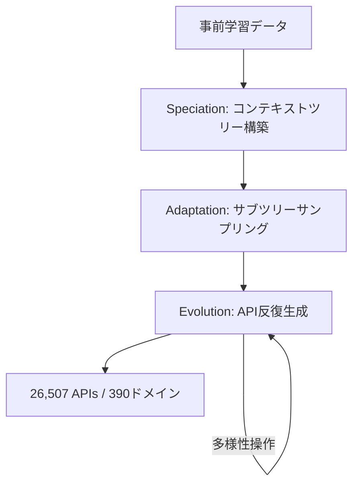
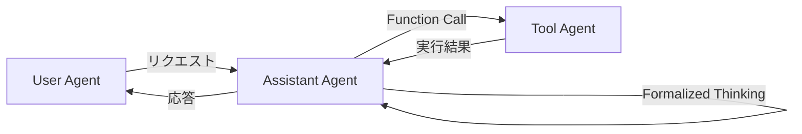

本記事は [ICLR 2025 採択論文 ToolACE (arXiv:2409.00920)](https://arxiv.org/abs/2409.00920) の解説記事です。

## 論文概要（Abstract）

ToolACEは、LLMのfunction calling能力を向上させるための高品質トレーニングデータを自動合成するパイプラインである。26,507の多様なAPIを含むリポジトリを構築し、Self-evolution合成プロセスでAPIプールを拡張、マルチエージェント対話生成で多様なfunction callingシナリオを作成、さらに二重層検証システム（ルールベース＋モデルベース）でデータの正確性を担保する。著者らは、この合成データでファインチューニングした8BパラメータモデルがBerkeley Function-Calling Leaderboard（BFCL）で上位の性能を達成したと報告している。

この記事は [Zenn記事: MCPサーバー自作でトークン消費94%削減：ツール定義設計の実装パターン](https://zenn.dev/0h_n0/articles/81a560d7731697) の深掘りです。

## Zenn記事との関連

Zenn記事では、MCPサーバーのツール定義（スキーマ設計）がLLMのツール選択精度に大きく影響することを実践的に示している。ToolACEはこの観点を学術的に裏付ける研究である。具体的には、API定義の品質（パラメータ記述の精緻さ、ドメインの多様性）がfunction callingの精度に直結することをデータ合成パイプラインの設計を通じて定量的に検証している。Zenn記事が「ツール定義をどう設計すべきか」という実装者視点の知見を提供するのに対し、ToolACEは「高品質なツール定義とその使用例をどう大規模に生成するか」というデータ生成の観点からfunction callingの精度向上に取り組んでいる。

## 情報源

- **会議名**: ICLR 2025（International Conference on Learning Representations）
- **年**: 2025
- **URL**: [https://arxiv.org/abs/2409.00920](https://arxiv.org/abs/2409.00920)
- **著者**: Weiwen Liu, Xu Huang, Xingshan Zeng, et al.（27名）
- **採択率**: 32.08%（11,565件中採択）

## カンファレンス情報

ICLR（International Conference on Learning Representations）は、深層学習・表現学習分野の最高峰国際会議の1つである。2025年は11,565件の投稿に対し採択率32.08%であった。ICLR 2025ではOral 213件、Spotlight Poster 85件が選出されている。査読はOpenReviewプラットフォームで公開される透明性の高いプロセスを採用している。

## 背景と動機（Background & Motivation）

LLMのfunction calling（ツール呼び出し）能力は、外部APIやツールとの統合において不可欠な技術である。しかし、高品質なfunction callingトレーニングデータの取得には以下の課題がある。

第一に、**実世界のfunction callingデータの収集コストが高い**点がある。実際のAPI呼び出しログは企業の機密データであり、公開されることが少ない。手動でのアノテーションも、APIの仕様理解と正確なパラメータ設定が必要なため、専門知識を要する高コストな作業となる。

第二に、**既存の合成データは品質面で課題が多い**点がある。単純なテンプレートベースの生成ではAPI呼び出しパターンの多様性が不足し、パラメータのハルシネーション（存在しないパラメータの生成）や型の不整合といった誤りが頻発する。

第三に、**APIの多様性とカバレッジの確保が困難**である。実世界のAPIは数十万種類以上存在し、ネストされたパラメータ、並列呼び出し、依存関係のある逐次呼び出しなど、多様なパターンを網羅する必要がある。

ToolACEはこれらの課題に対し、自動エージェンティックパイプラインによるデータ合成アプローチで取り組んでいる。

## 主要な貢献（Key Contributions）

1. **Self-evolution合成プロセス（TSS）**: 階層的なAPIコンテキストツリーを構築し、26,507の多様なAPIを自動生成。Speciation、Adaptation、Evolutionの3フェーズで反復的にAPIプールを拡張する
2. **マルチエージェント対話生成**: User Agent、Assistant Agent、Tool Agentの3つのLLMエージェントが協調し、単一呼び出し・並列呼び出し・依存呼び出し・非ツール使用の4カテゴリの対話を生成する
3. **二重層検証システム（DLV）**: ルールベース検証（JSON Schema準拠、パラメータ整合性）とモデルベース検証（ハルシネーション検出、一貫性確認）を組み合わせたデータ品質保証
4. **8Bモデルでの上位性能達成**: LLaMA-3.1-8B-InstructをベースにLoRAファインチューニングし、BFCL-v1でGPT-4 Turboに匹敵する性能を達成

## 技術的詳細（Technical Details）

### Self-evolution合成プロセス（TSS）

TSSはAPIプールを自動構築する3フェーズのパイプラインである。

**Phase 1: Speciation（種分化）** では、LLMの事前学習データ（技術マニュアル、ドキュメント）からAPIドメインと機能を抽出し、階層的なコンテキストツリーを構築する。ツリーの各ノードは特定のAPI機能を表し、子ノードは再帰的に生成される。

**Phase 2: Adaptation（適応）** では、サブツリーをサンプリングし、異なるドメイン特化度で各APIに固有の機能を割り当てる。これにより、汎用的なAPIから高度に特化したAPIまで、幅広いスペクトラムを実現する。

**Phase 3: Evolution（進化）** では、LLMにサンプリングしたサブツリーとAPIの例を提示し、新しいAPIを反復的に合成する。多様性を確保するため、機能追加、パラメータ追加、制約追加、パラメータ型の変異といった操作を適用する。



最終的に390ドメインにわたる26,507のAPIが生成される。各APIはOpenAI互換のJSON Schema形式で定義され、ネストされたパラメータや複雑な型制約を含む。

### マルチエージェント対話生成

3つのLLMエージェントが協調して対話を生成する。



- **User Agent**: ユーザのリクエストを生成する。自己誘導型の複雑度調整により、単純な質問から複雑なマルチステップのリクエストまで段階的に生成する
- **Assistant Agent**: リクエストに対してAPI呼び出しの要否を判断する。API呼び出しが必要な場合はFormalized Thinking（構造化された思考プロセス）に従い、どのAPIをどのパラメータで呼ぶかを決定する。複数インスタンスで生成し、一貫した判断のみを採用する
- **Tool Agent**: API実行をシミュレートし、結果を返す。実際のAPIエンドポイントを呼ぶのではなく、API定義に基づいた妥当な応答を生成する

対話は以下の4カテゴリで生成される:
- **Single call**: 単一のAPI呼び出し
- **Parallel call**: 複数APIの並列呼び出し
- **Dependent call**: 前のAPI結果に依存する逐次呼び出し
- **Non-tool-use**: API呼び出しが不要なケース

### 二重層検証システム（DLV）

データ品質を保証するため、2段階の検証を実施する。

**ルールベース検証**では、以下の項目を機械的にチェックする:
- API定義のJSON Schema準拠性
- Function call実行可能性（API名の一致、必須パラメータの存在、フォーマットの正当性）
- 対話の整合性（ツール応答とAPI定義の対応関係）

**モデルベース検証**では、LLMを用いてタスクをサブクエリに分解し、以下を判定する:
- ハルシネーション検出（存在しないパラメータ値の検出）
- 一貫性検証（タスク完了度との整合性）
- ツール応答のAPI定義との整合性

### 複雑度指標

著者らは、データの複雑度を以下の式で定義している（論文Section 4.3より）:

$$
H_{\mathcal{M}}(x, y) = -\frac{1}{n_y} \sum_{i=1}^{n_y} \log p(t_i \mid x, t_1, \ldots, t_{i-1})
$$

ここで、
- $x$: 入力クエリ
- $y$: 応答（$n_y$トークンからなる）
- $t_i$: $i$番目のトークン
- $p(t_i \mid x, t_1, \ldots, t_{i-1})$: モデル$\mathcal{M}$による条件付きトークン予測確率

この値が高いほど、モデルにとって予測が困難なサンプルであることを意味する。著者らは、候補API数の増加、使用API数の増加、クエリとAPI説明文の乖離度が高いほど複雑度が上昇することを確認している。

### BFCL評価手法

Berkeley Function-Calling Leaderboard（BFCL）では、**Abstract Syntax Tree（AST）評価**が採用されている。これはモデルの出力をASTに変換し、正解のASTおよびAPI定義と構造的に比較する手法である。パラメータの値だけでなく、関数名、パラメータ名、型の一致を構造的に検証するため、文字列一致よりも堅牢な評価が可能となる。

## 実装のポイント（Implementation）

ToolACE-8Bの訓練では、LLaMA-3.1-8B-Instructをベースモデルとし、LoRA（Low-Rank Adaptation）によるファインチューニングを行っている。

主要なハイパーパラメータは以下の通り:
- **LoRAランク**: 16
- **LoRA alpha**: 32
- **学習率**: $10^{-4}$
- **バッチサイズ**: 48
- **エポック数**: 3
- **スケジューラ**: Cosine

モデルの出力形式は `[func_name(param1=value1, param2=value2)]` であり、OpenAI互換のJSON Schema形式でツール定義を受け取る。

```python
from transformers import AutoModelForCausalLM, AutoTokenizer
from peft import PeftModel

def load_toolace_model(
    base_model: str = "meta-llama/Llama-3.1-8B-Instruct",
    adapter_path: str = "Team-ACE/ToolACE-8B",
) -> tuple:
    """ToolACE-8Bモデルのロード

    Args:
        base_model: ベースモデルのHuggingFace ID
        adapter_path: LoRAアダプタのパス

    Returns:
        (model, tokenizer) のタプル
    """
    tokenizer = AutoTokenizer.from_pretrained(adapter_path)
    model = AutoModelForCausalLM.from_pretrained(
        base_model,
        torch_dtype="auto",
        device_map="auto",
    )
    model = PeftModel.from_pretrained(model, adapter_path)
    return model, tokenizer
```

実装上の注意点として、ToolACEのデータ合成パイプラインを自社で再現する場合、APIコンテキストツリーの構築にはドメイン知識が必要となる。また、二重層検証のモデルベース検証には追加のLLM推論コストが発生するため、検証対象のサンプリング戦略を検討する必要がある。

## Production Deployment Guide

ToolACEの知見を活用してfunction calling対応のLLM推論サービスを本番環境にデプロイする際のAWS構成を示す。ToolACEの合成データでファインチューニングしたモデル、またはfunction callingに特化したモデルを提供するサービスを想定する。

### AWS実装パターン（コスト最適化重視）

**トラフィック量別の推奨構成**:

| 構成 | トラフィック | アーキテクチャ | 月額コスト概算 |
|------|-------------|--------------|--------------|
| Small | ~100 req/日 | Lambda + SageMaker Serverless | $80-200 |
| Medium | ~1,000 req/日 | ECS Fargate + SageMaker | $500-1,500 |
| Large | 10,000+ req/日 | EKS + Spot GPU Instances | $3,000-8,000 |

**Small構成（~100 req/日）**:
- API Gateway + Lambda（リクエストルーティング、前処理）
- SageMaker Serverless Inference（8Bモデル推論）
- DynamoDB（ツール定義キャッシュ、呼び出しログ）
- CloudWatch（監視・アラーム）
- 月額内訳: Lambda $5 + SageMaker $50-150 + DynamoDB $10 + CloudWatch $15

**Medium構成（~1,000 req/日）**:
- ALB + ECS Fargate（APIサーバ、前処理・後処理）
- SageMaker Real-time Inference（ml.g5.xlarge、8Bモデル）
- ElastiCache Redis（ツール定義キャッシュ、レスポンスキャッシュ）
- DynamoDB（呼び出しログ、メトリクス）
- 月額内訳: ECS $80 + SageMaker $800-1,200 + ElastiCache $100 + DynamoDB $20

**Large構成（10,000+ req/日）**:
- EKS + Karpenter（自動スケーリング）
- Spot GPU Instances（g5.xlarge、最大70%削減）
- vLLM on EKS（高スループット推論）
- ElastiCache Redis Cluster（分散キャッシュ）
- S3（モデルアーティファクト、ログ）
- 月額内訳: EKS $75 + GPU Spot $1,500-4,000 + ElastiCache $200 + S3 $50

**コスト削減テクニック**:
- Spot GPU Instances活用でオンデマンド比最大70%削減
- SageMaker Savings Plans（1年コミット）で最大64%削減
- ツール定義のキャッシュ化で重複推論を回避（Redis TTL: 1時間）
- 同一ツール定義セットに対するバッチ推論で30-50%削減

> **注意**: 上記コストは2026年7月時点のAWS ap-northeast-1（東京）リージョン料金に基づく概算値です。実際のコストはトラフィックパターン、リージョン、バースト使用量により変動します。最新料金は[AWS料金計算ツール](https://calculator.aws/)で確認してください。

### Terraformインフラコード

**Small構成（Serverless）**:

```hcl
# ToolACE Function Calling Service - Small構成
# Lambda + SageMaker Serverless + DynamoDB

terraform {
  required_version = ">= 1.9"
  required_providers {
    aws = {
      source  = "hashicorp/aws"
      version = "~> 5.60"
    }
  }
}

provider "aws" {
  region = "ap-northeast-1"
}

# --- IAM ---
resource "aws_iam_role" "lambda_role" {
  name = "toolace-fc-lambda-role"
  assume_role_policy = jsonencode({
    Version = "2012-10-17"
    Statement = [{
      Action    = "sts:AssumeRole"
      Effect    = "Allow"
      Principal = { Service = "lambda.amazonaws.com" }
    }]
  })
}

resource "aws_iam_role_policy" "lambda_policy" {
  name = "toolace-fc-lambda-policy"
  role = aws_iam_role.lambda_role.id
  policy = jsonencode({
    Version = "2012-10-17"
    Statement = [
      {
        Effect   = "Allow"
        Action   = ["logs:CreateLogGroup", "logs:CreateLogStream", "logs:PutLogEvents"]
        Resource = "arn:aws:logs:*:*:*"
      },
      {
        Effect   = "Allow"
        Action   = ["dynamodb:GetItem", "dynamodb:PutItem", "dynamodb:Query"]
        Resource = aws_dynamodb_table.tool_cache.arn
      },
      {
        Effect   = "Allow"
        Action   = ["sagemaker:InvokeEndpoint"]
        Resource = "*"
      }
    ]
  })
}

# --- DynamoDB（ツール定義キャッシュ + 呼び出しログ） ---
resource "aws_dynamodb_table" "tool_cache" {
  name         = "toolace-tool-definitions"
  billing_mode = "PAY_PER_REQUEST"  # On-Demand: 低トラフィックに最適
  hash_key     = "tool_set_hash"

  attribute {
    name = "tool_set_hash"
    type = "S"
  }

  ttl {
    attribute_name = "expires_at"
    enabled        = true
  }

  server_side_encryption {
    enabled = true  # KMS暗号化
  }

  tags = {
    Project = "toolace-fc"
    Env     = "production"
  }
}

# --- Lambda関数 ---
resource "aws_lambda_function" "fc_handler" {
  function_name = "toolace-fc-handler"
  runtime       = "python3.12"
  handler       = "handler.lambda_handler"
  role          = aws_iam_role.lambda_role.arn
  timeout       = 30
  memory_size   = 256

  filename         = "lambda.zip"
  source_code_hash = filebase64sha256("lambda.zip")

  environment {
    variables = {
      SAGEMAKER_ENDPOINT = "toolace-8b-endpoint"
      DYNAMODB_TABLE     = aws_dynamodb_table.tool_cache.name
      LOG_LEVEL          = "INFO"
    }
  }

  tracing_config {
    mode = "Active"  # X-Ray有効化
  }

  tags = {
    Project = "toolace-fc"
  }
}

# --- CloudWatch アラーム ---
resource "aws_cloudwatch_metric_alarm" "lambda_errors" {
  alarm_name          = "toolace-fc-lambda-errors"
  comparison_operator = "GreaterThanThreshold"
  evaluation_periods  = 2
  metric_name         = "Errors"
  namespace           = "AWS/Lambda"
  period              = 300
  statistic           = "Sum"
  threshold           = 5
  alarm_description   = "Lambda function error rate exceeded"

  dimensions = {
    FunctionName = aws_lambda_function.fc_handler.function_name
  }
}
```

**Large構成（Container + GPU）**:

```hcl
# ToolACE Function Calling Service - Large構成
# EKS + Karpenter + Spot GPU

module "eks" {
  source          = "terraform-aws-modules/eks/aws"
  version         = "~> 20.24"
  cluster_name    = "toolace-fc-cluster"
  cluster_version = "1.31"

  vpc_id     = module.vpc.vpc_id
  subnet_ids = module.vpc.private_subnets

  # コントロールプレーンのみ（ワーカーノードはKarpenter管理）
  cluster_endpoint_public_access = false

  tags = {
    Project = "toolace-fc"
    Env     = "production"
  }
}

# --- Karpenter（Spot GPU優先スケーリング） ---
resource "kubectl_manifest" "karpenter_nodepool" {
  yaml_body = <<-YAML
    apiVersion: karpenter.sh/v1
    kind: NodePool
    metadata:
      name: gpu-spot-pool
    spec:
      template:
        spec:
          requirements:
            - key: karpenter.sh/capacity-type
              operator: In
              values: ["spot", "on-demand"]  # Spot優先
            - key: node.kubernetes.io/instance-type
              operator: In
              values: ["g5.xlarge", "g5.2xlarge"]  # GPU instances
          nodeClassRef:
            group: karpenter.k8s.aws
            kind: EC2NodeClass
            name: default
      limits:
        cpu: "64"
        nvidia.com/gpu: "8"
      disruption:
        consolidationPolicy: WhenEmptyOrUnderutilized
        consolidateAfter: 30s
  YAML
}

# --- AWS Budgets（コストアラート） ---
resource "aws_budgets_budget" "monthly" {
  name         = "toolace-fc-monthly"
  budget_type  = "COST"
  limit_amount = "5000"
  limit_unit   = "USD"
  time_unit    = "MONTHLY"

  notification {
    comparison_operator       = "GREATER_THAN"
    threshold                 = 80
    threshold_type            = "PERCENTAGE"
    notification_type         = "ACTUAL"
    subscriber_email_addresses = ["ops@example.com"]
  }
}

# --- Secrets Manager（モデル設定） ---
resource "aws_secretsmanager_secret" "model_config" {
  name                    = "toolace-fc/model-config"
  recovery_window_in_days = 7

  tags = {
    Project = "toolace-fc"
  }
}
```

### 運用・監視設定

**CloudWatch Logs Insights クエリ**（コスト異常検知）:

```
# 1時間あたりのfunction call回数とレイテンシ分析
fields @timestamp, @message
| filter @message like /function_call/
| stats count(*) as call_count,
        avg(duration_ms) as avg_latency,
        pct(duration_ms, 95) as p95_latency,
        pct(duration_ms, 99) as p99_latency
  by bin(1h) as time_bucket
| sort time_bucket desc
```

**CloudWatch アラーム設定**（Python）:

```python
import boto3

def create_fc_alarms(function_name: str, sns_topic_arn: str) -> None:
    """Function Callingサービスの監視アラームを設定

    Args:
        function_name: Lambda関数名
        sns_topic_arn: 通知先SNSトピックARN
    """
    cw = boto3.client("cloudwatch", region_name="ap-northeast-1")

    # レイテンシ異常検知（P95 > 5秒）
    cw.put_metric_alarm(
        AlarmName=f"{function_name}-high-latency",
        MetricName="Duration",
        Namespace="AWS/Lambda",
        Statistic="p95",
        Period=300,
        EvaluationPeriods=2,
        Threshold=5000,
        ComparisonOperator="GreaterThanThreshold",
        Dimensions=[{"Name": "FunctionName", "Value": function_name}],
        AlarmActions=[sns_topic_arn],
    )

    # エラー率異常検知（5分間で5回以上）
    cw.put_metric_alarm(
        AlarmName=f"{function_name}-error-spike",
        MetricName="Errors",
        Namespace="AWS/Lambda",
        Statistic="Sum",
        Period=300,
        EvaluationPeriods=1,
        Threshold=5,
        ComparisonOperator="GreaterThanThreshold",
        Dimensions=[{"Name": "FunctionName", "Value": function_name}],
        AlarmActions=[sns_topic_arn],
    )
```

**X-Ray トレーシング設定**:

```python
from aws_xray_sdk.core import xray_recorder, patch_all

patch_all()  # boto3自動計装

@xray_recorder.capture("function_call_handler")
def handle_function_call(tool_definitions: list[dict], query: str) -> dict:
    """Function Call処理のトレーシング

    Args:
        tool_definitions: ツール定義リスト
        query: ユーザクエリ

    Returns:
        Function call結果
    """
    subsegment = xray_recorder.current_subsegment()
    subsegment.put_annotation("tool_count", len(tool_definitions))
    subsegment.put_metadata("query", query)

    # SageMakerエンドポイント呼び出し（自動計装済み）
    result = invoke_sagemaker_endpoint(tool_definitions, query)

    subsegment.put_annotation("call_type", result.get("call_type", "unknown"))
    return result
```

**Cost Explorer自動レポート**:

```python
import boto3
from datetime import datetime, timedelta

def daily_cost_report(sns_topic_arn: str) -> None:
    """日次コストレポートを生成しSNS通知

    Args:
        sns_topic_arn: 通知先SNSトピックARN
    """
    ce = boto3.client("ce", region_name="us-east-1")
    sns = boto3.client("sns", region_name="ap-northeast-1")

    end = datetime.utcnow().strftime("%Y-%m-%d")
    start = (datetime.utcnow() - timedelta(days=1)).strftime("%Y-%m-%d")

    response = ce.get_cost_and_usage(
        TimePeriod={"Start": start, "End": end},
        Granularity="DAILY",
        Metrics=["UnblendedCost"],
        Filter={
            "Tags": {
                "Key": "Project",
                "Values": ["toolace-fc"],
            }
        },
        GroupBy=[{"Type": "DIMENSION", "Key": "SERVICE"}],
    )

    total = sum(
        float(g["Metrics"]["UnblendedCost"]["Amount"])
        for r in response["ResultsByTime"]
        for g in r["Groups"]
    )

    if total > 100:
        sns.publish(
            TopicArn=sns_topic_arn,
            Subject="ToolACE FC Cost Alert",
            Message=f"Daily cost: ${total:.2f} (threshold: $100)",
        )
```

### コスト最適化チェックリスト

**アーキテクチャ選択**:
- [ ] トラフィック量でServerless/Hybrid/Container構成を選択
- [ ] GPU推論が必要な場合はSageMaker vs 自前EKSを比較検討

**リソース最適化**:
- [ ] GPU: Spot Instances優先（g5.xlarge Spot: 最大70%削減）
- [ ] SageMaker: Savings Plans（1年コミットで最大64%削減）
- [ ] Lambda: メモリサイズ最適化（256MB-512MB、Power Tuningで検証）
- [ ] EKS: Karpenterでアイドル時自動スケールダウン
- [ ] ElastiCache: Reserved Nodes（1年コミット）

**LLMコスト削減**:
- [ ] ツール定義キャッシュ（Redis TTL: 1時間、同一定義セットの再推論回避）
- [ ] バッチ推論（同一ツールセットのリクエストを集約）
- [ ] 軽量モデルによるルーティング（単純なクエリは小モデルで処理）
- [ ] トークン数制限（ツール定義の最大長を設定）
- [ ] 不要ツールのフィルタリング（関連APIのみをコンテキストに含める）

**監視・アラート**:
- [ ] AWS Budgets設定（月額上限の80%で通知）
- [ ] CloudWatch アラーム（レイテンシP95、エラー率）
- [ ] Cost Anomaly Detection有効化
- [ ] 日次コストレポート（SNS通知）

**リソース管理**:
- [ ] 未使用SageMakerエンドポイント削除
- [ ] タグ戦略（Project, Env, Owner）
- [ ] S3ライフサイクルポリシー（ログ90日で削除）
- [ ] 開発環境の夜間・週末停止
- [ ] ECRイメージの世代管理（最新5世代のみ保持）

## 実験結果（Results）

著者らはBFCL-v1ベンチマークで以下の結果を報告している（論文Table 2より）:

| モデル | Non-live AST | Non-live Exec | Hallucination (Rel) | Hallucination (Irrel) | 総合順位 |
|--------|-------------|---------------|--------------------|--------------------|---------|
| GPT-4 Turbo | 82.65% | 83.80% | 70.73% | 79.79% | 1位 |
| GPT-4o | 85.52% | 82.96% | 63.41% | 82.91% | 2位 |
| **ToolACE-8B** | **89.27%** | **90.07%** | **85.37%** | **83.81%** | **3位** |
| xLAM-7b-fc-r | 86.83% | - | - | - | - |

ToolACE-8Bは、Non-live ASTおよびNon-live Exec評価でGPT-4 TurboおよびGPT-4oを上回る性能を示している。特にハルシネーション検出（Relevance）では85.37%と、GPT-4 Turboの70.73%を大きく上回っている。ツール関連性の判定（Irrelevance）においても89.17%を達成し、全モデル中で最高のスコアを記録したと報告されている。

アブレーション実験では、以下の知見が得られている:
- **検証の効果**: 二重層検証なしの場合と比較して、ルールベースのみで中程度の改善、二重層で最適な精度を達成
- **複雑度の影響**: 中程度の複雑度のデータが最も効果的（モデルの現在の能力を「わずかに超える」難易度が最適）
- **多様性の効果**: APIの多様性と精度に正の相関があり、特にIrrelevance検出で顕著
- **汎化性**: LLaMA-3、LLaMA-3.1、Qwen-1.5の各ベースモデルで一貫した性能向上を確認

また、ToolACEデータでのファインチューニングは汎用タスク（MMLU、GSM8K、CommonSenseQA）の性能を損なわないことも報告されている。

## 実運用への応用（Practical Applications）

ToolACEの知見は、以下の実運用シナリオで活用可能である。

**ツール定義の品質改善**: Zenn記事が示すように、ツール定義のスキーマ設計はLLMの呼び出し精度に直結する。ToolACEのAPIコンテキストツリーの設計思想を参考に、自社のツール定義を階層的に整理し、パラメータの記述を精緻化することで、function callingの精度向上が期待できる。

**社内ツール対応のファインチューニング**: ToolACEのデータ合成パイプラインを応用し、社内APIに特化したトレーニングデータを自動生成できる。8Bクラスのモデルで十分な性能が得られるため、GPU コストを抑えた運用が可能である。

**品質保証プロセスの導入**: 二重層検証システムの考え方は、function callingに限らず、LLMの出力品質保証全般に応用可能である。ルールベースの形式チェックとモデルベースの意味的検証を組み合わせることで、プロダクション環境での信頼性を向上させられる。

**コスト効率の高いモデル選択**: 著者らの結果は、8Bパラメータモデルでも適切なトレーニングデータがあればGPT-4クラスの性能を達成できることを示唆している。APIコスト削減の観点から、自社ファインチューニングモデルの採用を検討する根拠となる。

## 関連研究（Related Work）

- **Gorilla** (Patil et al., 2023): LLMにAPI呼び出し能力を付与するファインチューニング手法。ToolACEはGorillaのアプローチをデータ合成の自動化とスケールで拡張している
- **Berkeley Function-Calling Leaderboard（BFCL）** (Patil et al., 2025, ICML 2025): function calling能力の標準的な評価ベンチマーク。AST評価とExec評価の両面でモデルを評価する。BFCL-v2以降はライブデータでの評価も含む
- **xLAM** (Zhang et al., 2024): Salesforce提案のfunction callingモデル。ToolACE-8BはxLAM-7b-fc-rと比較して、特にハルシネーション検出で優位性を示している
- **ToolFlow** (2024): 自然で一貫性のある対話合成によるfunction callingデータ生成。ToolACEのマルチエージェント対話生成と類似のアプローチだが、検証システムの設計に差異がある

## まとめと今後の展望

ToolACEは、function callingトレーニングデータの自動合成において、APIプール構築（TSS）、対話生成（マルチエージェント）、品質保証（DLV）の3段階を統合したパイプラインを提案した。8Bパラメータモデルで主要なプロプライエタリモデルに匹敵する性能を達成したことは、適切なデータがあれば小型モデルでも実用的なfunction calling能力を獲得できることを示している。

今後の展望として、著者らはBFCL-v2以降のマルチターン対話への対応強化、より複雑なツールチェーンのシナリオ対応、そして合成データの品質をさらに向上させるための検証手法の改善を挙げている。後続研究のToolACE-DEV（2025年）では、Self-Improvingメカニズムによるさらなる性能向上が報告されている。

## 参考文献

- **ICLR 2025 論文**: [https://arxiv.org/abs/2409.00920](https://arxiv.org/abs/2409.00920)
- **HuggingFace Model**: [https://huggingface.co/Team-ACE/ToolACE-8B](https://huggingface.co/Team-ACE/ToolACE-8B)
- **BFCL**: [https://gorilla.cs.berkeley.edu/leaderboard.html](https://gorilla.cs.berkeley.edu/leaderboard.html)
- **Related Zenn article**: [https://zenn.dev/0h_n0/articles/81a560d7731697](https://zenn.dev/0h_n0/articles/81a560d7731697)
