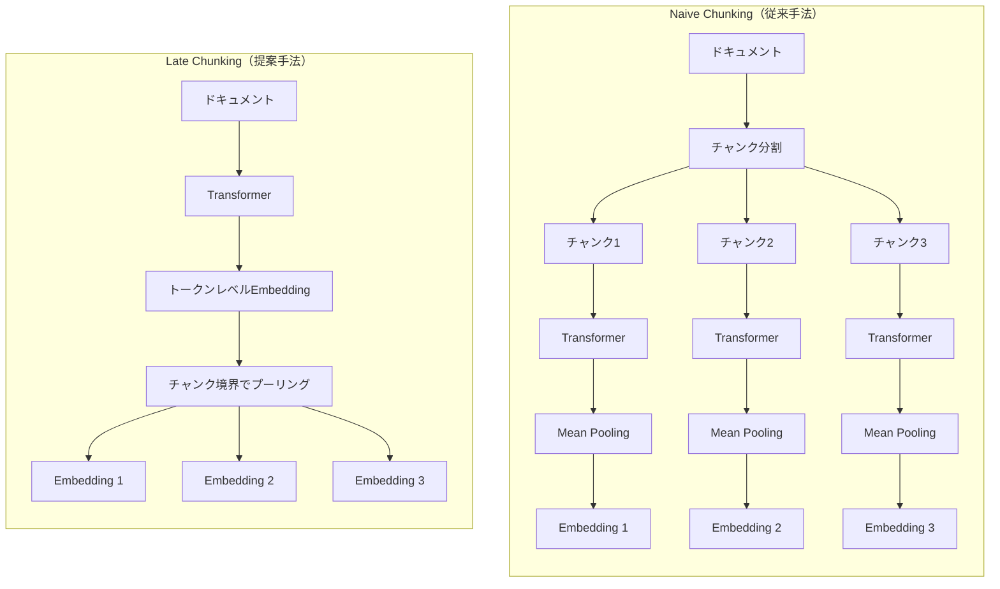

本記事は [Late Chunking: Contextual Chunk Embeddings Using Long-Context Embedding Models](https://arxiv.org/abs/2409.04701) の解説記事です。

## 論文概要（Abstract）

RAGパイプラインにおいて、ドキュメントを小さなチャンクに分割して個別にEmbeddingする従来手法では、チャンク境界を跨ぐ文脈情報が失われる問題がある。著者らは「Late Chunking」と呼ばれる手法を提案し、長文脈Embeddingモデルでドキュメント全体のトークンを先にエンコードした後、Mean Pooling直前にチャンク分割を行うことで、各チャンクEmbeddingに文脈情報を保持させる。追加の学習を必要とせず、長文脈モデル全般に適用可能な手法である。

この記事は [Zenn記事: Gemini Embedding×Contextual Retrieval×クエリ拡張でセマンティック検索精度を段階的に改善する](https://zenn.dev/0h_n0/articles/bd095b4bd8a798) の深掘りです。

## 情報源

- **arXiv ID**: 2409.04701
- **URL**: [https://arxiv.org/abs/2409.04701](https://arxiv.org/abs/2409.04701)
- **著者**: Michael Gunther, Isabelle Mohr, Daniel James Williams, Bo Wang, Han Xiao（Jina AI）
- **発表年**: 2024年（初版: 2024年9月、最新改訂: 2025年7月）
- **分野**: cs.CL（Computation and Language）, cs.IR（Information Retrieval）

## 背景と動機（Background & Motivation）

密なベクトル検索では、テキストを小さなチャンクに分割してから各チャンクを独立にEmbeddingモデルへ入力する「Naive Chunking」が広く用いられている。しかし、この手法には構造的な問題がある。チャンク境界で分断されたテキストは、前後の文脈から切り離され、代名詞の照応先や暗黙の主語が失われてしまう。

例えば、Wikipediaの「Berlin」に関する記事を考える。「Berlin is the capital and largest city of Germany」という文が最初のチャンクにあり、「Its more than 3.85 million inhabitants make it the European Union's most populous city」という文が次のチャンクに分かれた場合、後者のチャンクだけを見ると「Its」が何を指すかの情報が欠落する。論文のTable 1によれば、このチャンクと"Berlin"というクエリの類似度は、Naive Chunkingで0.7084であるのに対し、Late Chunkingでは0.8249まで向上すると報告されている。

この問題に対する従来のアプローチとして、チャンクを重複させるオーバーラップ方式（計算コスト増大）、AnthropicのContextual Retrieval（LLMによる文脈説明の付与、APIコスト発生）がある。Late Chunkingは、長文脈Embeddingモデルのアテンション機構を活用し、追加のLLM呼び出しなしで文脈を保持する点で、これらと差別化される。

## 主要な貢献（Key Contributions）

著者らは以下の3つの貢献を報告している。

- **Late Chunking手法の提案**: ドキュメント全体をTransformerに通した後にチャンク分割を行い、Mean Poolingをチャンク単位で適用する手法。追加の学習なしで長文脈Embeddingモデル全般に適用可能。
- **Long Late Chunking（Algorithm 2）の提案**: モデルのコンテキスト長を超えるドキュメントに対して、オーバーラップ付きマクロチャンクへの分割と結合により、Late Chunkingを拡張する手法。
- **Span Poolingによるファインチューニング戦略**: InfoNCE損失にスパン情報を組み込むことで、Late Chunkingに最適化された学習手法。TriviaQAおよびFEVERのスパン注釈付きデータセットをHuggingFaceで公開。

## 技術的詳細（Technical Details）

### 従来のチャンキング vs Late Chunking のアーキテクチャ

以下の図は、Naive ChunkingとLate Chunkingの処理順序の違いを示す。



Naive Chunkingでは各チャンクが独立にTransformerを通過するため、チャンク間のアテンションが計算されない。一方、Late Chunkingではドキュメント全体がTransformerを通過してからチャンク境界でプーリングされるため、全トークンが相互にアテンションを計算した結果を保持できる。

### 数式: Mean PoolingとLate Chunkingのプーリング

従来のEmbeddingモデルでは、入力テキストのトークン列 $t_1, t_2, \ldots, t_m$ をTransformerに通して得られるトークンレベルEmbedding $\vartheta_1, \vartheta_2, \ldots, \vartheta_m$ に対し、全体のMean Poolingを行う。

$$
\mathbf{e} = \frac{1}{m} \sum_{j=1}^{m} \vartheta_j
$$

ここで $\mathbf{e}$ はドキュメント全体のEmbedding、$m$ はトークン数である。

Late Chunkingでは、まずドキュメント全体のトークン列をTransformerに通してトークンレベルEmbedding $\vartheta_1, \ldots, \vartheta_m$ を得る。次に、チャンク $i$ の開始位置 $s_i$ と終了位置 $e_i$ に基づいてMean Poolingを適用する。

$$
\mathbf{e}_i = \frac{1}{e_i - s_i + 1} \sum_{j=s_i}^{e_i} \vartheta_j
$$

ここで、
- $\mathbf{e}_i$: チャンク $i$ のEmbeddingベクトル
- $s_i$: チャンク $i$ の開始トークンインデックス
- $e_i$: チャンク $i$ の終了トークンインデックス
- $\vartheta_j$: Transformerの出力におけるトークン $j$ のEmbedding

重要なのは、$\vartheta_j$ がドキュメント全体のSelf-Attentionを経て計算されている点である。Naive Chunkingでは $\vartheta_j$ はチャンク内のトークンのみからアテンションが計算されるため、文脈情報が限定される。

### Span Poolingによる学習（InfoNCE損失）

著者らは、Late Chunkingに最適化されたファインチューニング戦略として「Span Pooling」を提案している。学習データは $(q, d, \langle \text{start}, \text{end} \rangle)$ の3つ組で構成される。クエリ $q$ は通常のMean Poolingで、ドキュメント $d$ は指定スパン $[\text{start}, \text{end}]$ のみでMean Poolingを行う。

損失関数はInfoNCE損失の双方向版を使用する。

$$
\mathcal{L}_{\text{NCE}}(B) = -\sum_{(x_i, y_i) \in B} \ln \frac{\exp(s(x_i, y_i) / \tau)}{\sum_{i'=1}^{k} \exp(s(x_i, y_{i'}) / \tau)}
$$

$$
\mathcal{L}_{\text{pairs}}(B) = \mathcal{L}_{\text{NCE}}(B) + \mathcal{L}_{\text{NCE}}(B^{\dagger})
$$

ここで、
- $B$: バッチ内の正例ペア集合
- $B^{\dagger}$: $B$ の転置（クエリとドキュメントを入れ替えたペア集合）
- $s(x, y)$: コサイン類似度
- $\tau$: 温度パラメータ
- $k$: バッチサイズ

### アルゴリズム: Late Chunkingの実装

以下は、Late Chunkingの基本的な処理フローをPythonで示した擬似実装である。

```python
import numpy as np
from transformers import AutoModel, AutoTokenizer


def late_chunking(
    document: str,
    chunk_boundaries: list[tuple[int, int]],
    model_name: str = "jinaai/jina-embeddings-v2-small-en",
) -> list[np.ndarray]:
    """Late Chunkingによるチャンクレベルのコンテキスト付きEmbeddingを生成する。

    ドキュメント全体をTransformerに通した後、指定されたチャンク境界で
    Mean Poolingを適用し、文脈情報を保持したチャンクEmbeddingを返す。

    Args:
        document: 入力ドキュメント全体のテキスト
        chunk_boundaries: 各チャンクの(開始トークンインデックス, 終了トークンインデックス)のリスト
        model_name: 使用するEmbeddingモデル名

    Returns:
        各チャンクに対応するEmbeddingベクトルのリスト
    """
    tokenizer = AutoTokenizer.from_pretrained(model_name, trust_remote_code=True)
    model = AutoModel.from_pretrained(model_name, trust_remote_code=True)

    # Step 1: ドキュメント全体をトークナイズ
    inputs = tokenizer(document, return_tensors="pt", truncation=True, max_length=8192)

    # Step 2: Transformerに通してトークンレベルEmbeddingを取得
    outputs = model(**inputs)
    token_embeddings = outputs.last_hidden_state[0]  # (seq_len, hidden_dim)

    # Step 3: チャンク境界でMean Poolingを適用
    chunk_embeddings: list[np.ndarray] = []
    for start, end in chunk_boundaries:
        # チャンク範囲のトークンEmbeddingを平均
        chunk_emb = token_embeddings[start : end + 1].mean(dim=0)
        chunk_embeddings.append(chunk_emb.detach().numpy())

    return chunk_embeddings
```

### Long Late Chunking（Algorithm 2）

モデルのコンテキスト長（例: jina-embeddings-v2の8192トークン）を超えるドキュメントに対しては、Long Late Chunkingが提案されている。手順は以下の通りである。

1. ドキュメントをオーバーラップ付きマクロチャンクに分割（オーバーラップ幅 $\omega$）
2. 各マクロチャンクをTransformerに通してトークンレベルEmbeddingを取得
3. オーバーラップ領域のトークンEmbeddingを結合（重複部分は後続マクロチャンクの値を使用）
4. 統合されたトークンEmbedding列に対してチャンク境界でMean Poolingを適用

```python
def long_late_chunking(
    document: str,
    chunk_boundaries: list[tuple[int, int]],
    max_tokens: int = 8192,
    overlap: int = 256,
    model_name: str = "jinaai/jina-embeddings-v2-small-en",
) -> list[np.ndarray]:
    """コンテキスト長を超えるドキュメントに対するLong Late Chunking。

    ドキュメントをオーバーラップ付きマクロチャンクに分割し、
    各マクロチャンクのトークンEmbeddingを結合した上で
    チャンク境界でMean Poolingを適用する。

    Args:
        document: 入力ドキュメント全体のテキスト
        chunk_boundaries: 各チャンクの(開始トークンインデックス, 終了トークンインデックス)のリスト
        max_tokens: モデルの最大コンテキスト長
        overlap: マクロチャンク間のオーバーラップトークン数
        model_name: 使用するEmbeddingモデル名

    Returns:
        各チャンクに対応するEmbeddingベクトルのリスト
    """
    tokenizer = AutoTokenizer.from_pretrained(model_name, trust_remote_code=True)
    model = AutoModel.from_pretrained(model_name, trust_remote_code=True)

    # Step 1: ドキュメント全体をトークナイズ
    all_tokens = tokenizer.encode(document, add_special_tokens=False)
    total_tokens = len(all_tokens)

    # Step 2: オーバーラップ付きマクロチャンクに分割
    macro_chunks: list[tuple[int, int]] = []
    pos = 0
    while pos < total_tokens:
        end = min(pos + max_tokens, total_tokens)
        macro_chunks.append((pos, end))
        pos += max_tokens - overlap

    # Step 3: 各マクロチャンクのトークンEmbeddingを取得・結合
    all_embeddings = [None] * total_tokens
    for mc_start, mc_end in macro_chunks:
        chunk_token_ids = all_tokens[mc_start:mc_end]
        inputs = tokenizer.prepare_for_model(
            chunk_token_ids, return_tensors="pt"
        )
        outputs = model(**inputs)
        mc_embeddings = outputs.last_hidden_state[0][1:-1]  # 特殊トークン除外

        for i, emb in enumerate(mc_embeddings):
            global_idx = mc_start + i
            # 後続マクロチャンクの値で上書き（より広い文脈を持つ）
            all_embeddings[global_idx] = emb.detach().numpy()

    # Step 4: チャンク境界でMean Pooling
    chunk_embeddings: list[np.ndarray] = []
    for start, end in chunk_boundaries:
        valid = [all_embeddings[j] for j in range(start, end + 1) if all_embeddings[j] is not None]
        if valid:
            chunk_embeddings.append(np.mean(valid, axis=0))

    return chunk_embeddings
```

## 実装のポイント（Implementation）

### Jina Embeddings APIでの利用

jina-embeddings-v3およびjina-embeddings-v4では、APIリクエストに `late_chunking` パラメータを追加するだけでLate Chunkingを利用できる。

```python
import requests


def embed_with_late_chunking(
    chunks: list[str],
    api_key: str,
    model: str = "jina-embeddings-v3",
) -> list[list[float]]:
    """Jina Embeddings APIでLate Chunkingを使用したEmbedding取得。

    late_chunking=Trueを指定すると、APIが内部でチャンクを結合して
    1つの長いテキストとしてTransformerに通し、Late Chunkingを適用する。
    返されるEmbeddingリストの長さはinputリストの長さと一致する。

    Args:
        chunks: ドキュメントから分割されたチャンクのリスト（順序を保持すること）
        api_key: Jina AI APIキー
        model: 使用するモデル名

    Returns:
        各チャンクに対応するEmbeddingベクトルのリスト
    """
    response = requests.post(
        "https://api.jina.ai/v1/embeddings",
        headers={"Authorization": f"Bearer {api_key}"},
        json={
            "model": model,
            "input": chunks,
            "late_chunking": True,
        },
        timeout=60,
    )
    response.raise_for_status()
    data = response.json()
    return [item["embedding"] for item in data["data"]]
```

### 長文脈モデルの要件

Late Chunkingが効果を発揮するためには、使用するEmbeddingモデルが以下の条件を満たす必要がある。

- **長いコンテキスト長**: ドキュメント全体を1回の推論で処理できるコンテキスト長（jina-embeddings-v3: 8192トークン、jina-embeddings-v4: 32768トークン）
- **位置エンコーディングの品質**: ALiBiやRoPEなど、長い系列でも位置情報を適切に表現できるエンコーディング手法が必要
- **トークンレベルEmbeddingへのアクセス**: Mean Pooling前のトークンレベル出力を取得できること（APIの場合はプロバイダ側で処理）

### チャンク分割戦略の選択

論文では3種類のチャンク境界が評価されている。

| チャンク境界 | 説明 | 平均改善率（論文Table 2より） |
|-------------|------|------|
| 固定サイズ（256トークン） | 一定トークン数で機械的に分割 | +3.46%（相対） |
| 文境界（5文ごと） | 文の区切りで分割 | +3.63%（相対） |
| セマンティック文境界 | 意味的なまとまりで分割 | +2.70%（相対） |

文境界での分割が相対的に高い改善率を示しているが、著者らはチャンク境界の選択がLate Chunkingの効果に大きく影響しないと述べている。

## Production Deployment Guide

### AWS実装パターン（コスト最適化重視）

Late Chunkingを用いたEmbeddingパイプラインをAWS上に構築する場合、トラフィック量に応じて以下の3構成を推奨する。コスト試算は2026年7月時点のap-northeast-1（東京）リージョン料金に基づく概算値であり、実際のコストはトラフィックパターンやバースト使用量により変動する。最新料金はAWS料金計算ツールでの確認を推奨する。

**Small構成（~100 req/日）: Lambda + S3 + OpenSearch Serverless**

| サービス | 用途 | 月額概算 |
|---------|------|---------|
| Lambda | Embedding生成（Jina API呼び出し） | $5-10 |
| OpenSearch Serverless | ベクトルインデックス・検索 | $50-80 |
| S3 | ドキュメント保存 | $1-5 |
| Jina API | Embedding生成（late_chunking=True） | $10-30 |
| **合計** | | **$66-125/月** |

Lambda関数でドキュメントを受け取り、Jina APIにlate_chunking=Trueで投げる構成。Embeddingモデル自体をホストしない分、インフラコストを抑えられる。

**Medium構成（~1000 req/日）: ECS Fargate + OpenSearch**

| サービス | 用途 | 月額概算 |
|---------|------|---------|
| ECS Fargate（2 vCPU, 4GB） | Embeddingサービス | $80-150 |
| OpenSearch（t3.medium.search） | ベクトルインデックス・検索 | $100-200 |
| ElastiCache（cache.t3.micro） | Embeddingキャッシュ | $15-30 |
| Jina API / セルフホスト | Embedding生成 | $50-200 |
| **合計** | | **$245-580/月** |

ECS Fargateでバッチ処理とリアルタイム処理を分離。ElastiCacheによる同一ドキュメントのEmbeddingキャッシュでAPI呼び出し回数を削減する。

**Large構成（10000+ req/日）: EKS + GPU + Karpenter**

| サービス | 用途 | 月額概算 |
|---------|------|---------|
| EKS | コンテナオーケストレーション | $73 |
| g5.xlarge Spot（2台） | GPU推論（jina-embeddings-v3セルフホスト） | $400-800 |
| OpenSearch（r6g.large.search x2） | ベクトルインデックス・検索 | $400-600 |
| S3 + CloudFront | ドキュメント配信 | $50-100 |
| **合計** | | **$923-1,573/月** |

jina-embeddings-v3をセルフホストし、Late Chunkingをモデルレベルで制御する構成。Spot Instancesの活用で通常のOn-Demand比最大73%のコスト削減が可能。

**コスト削減テクニック**:
- **Spot Instances活用**: g5.xlargeのSpot価格はOn-Demand比で最大73%削減
- **Embeddingキャッシュ**: 同一ドキュメントの再計算を防止（ElastiCache/DynamoDB）
- **バッチ処理分離**: リアルタイム検索とインデックス更新を分離し、バッチ処理はSpotで実行
- **OpenSearch Serverless**: 低トラフィック時はServerlessモードで自動スケールダウン

### Terraformインフラコード

**Small構成（Serverless）: Lambda + OpenSearch Serverless**

```hcl
# late_chunking_small/main.tf
# Late Chunking Embedding Pipeline - Small構成

terraform {
  required_version = ">= 1.9"
  required_providers {
    aws = {
      source  = "hashicorp/aws"
      version = "~> 5.60"
    }
  }
}

provider "aws" {
  region = "ap-northeast-1"
}

# --- IAM ---
resource "aws_iam_role" "lambda_embedding" {
  name = "late-chunking-lambda-role"
  assume_role_policy = jsonencode({
    Version = "2012-10-17"
    Statement = [{
      Action = "sts:AssumeRole"
      Effect = "Allow"
      Principal = { Service = "lambda.amazonaws.com" }
    }]
  })
}

resource "aws_iam_role_policy" "lambda_embedding" {
  name = "late-chunking-lambda-policy"
  role = aws_iam_role.lambda_embedding.id
  policy = jsonencode({
    Version = "2012-10-17"
    Statement = [
      {
        Effect   = "Allow"
        Action   = ["logs:CreateLogGroup", "logs:CreateLogStream", "logs:PutLogEvents"]
        Resource = "arn:aws:logs:*:*:*"
      },
      {
        Effect   = "Allow"
        Action   = ["secretsmanager:GetSecretValue"]
        Resource = aws_secretsmanager_secret.jina_api_key.arn
      },
      {
        # OpenSearch Serverless へのアクセス
        Effect   = "Allow"
        Action   = ["aoss:APIAccessAll"]
        Resource = "*"
      }
    ]
  })
}

# --- Secrets Manager（Jina APIキー） ---
resource "aws_secretsmanager_secret" "jina_api_key" {
  name                    = "late-chunking/jina-api-key"
  recovery_window_in_days = 7
}

# --- Lambda関数 ---
resource "aws_lambda_function" "embedding" {
  function_name = "late-chunking-embedding"
  role          = aws_iam_role.lambda_embedding.arn
  handler       = "handler.lambda_handler"
  runtime       = "python3.12"
  timeout       = 120 # Late Chunkingは長文処理のため余裕を持たせる
  memory_size   = 512

  filename         = "lambda.zip"
  source_code_hash = filebase64sha256("lambda.zip")

  environment {
    variables = {
      JINA_SECRET_ARN     = aws_secretsmanager_secret.jina_api_key.arn
      EMBEDDING_MODEL     = "jina-embeddings-v3"
      LATE_CHUNKING       = "true"
    }
  }
}

# --- CloudWatch アラーム（コスト監視） ---
resource "aws_cloudwatch_metric_alarm" "lambda_duration" {
  alarm_name          = "late-chunking-lambda-high-duration"
  comparison_operator = "GreaterThanThreshold"
  evaluation_periods  = 3
  metric_name         = "Duration"
  namespace           = "AWS/Lambda"
  period              = 300
  statistic           = "Average"
  threshold           = 30000 # 30秒超過でアラート
  alarm_description   = "Lambda実行時間が30秒を超過"

  dimensions = {
    FunctionName = aws_lambda_function.embedding.function_name
  }
}
```

**Large構成（Container）: EKS + Karpenter + Spot**

```hcl
# late_chunking_large/main.tf
# Late Chunking Embedding Pipeline - Large構成

# --- EKSクラスタ ---
module "eks" {
  source  = "terraform-aws-modules/eks/aws"
  version = "~> 20.24"

  cluster_name    = "late-chunking-cluster"
  cluster_version = "1.31"

  vpc_id     = module.vpc.vpc_id
  subnet_ids = module.vpc.private_subnets

  # コスト最適化: マネージドノードグループは最小限
  eks_managed_node_groups = {
    system = {
      instance_types = ["t3.medium"]
      min_size       = 1
      max_size       = 2
      desired_size   = 1
    }
  }
}

# --- Karpenter Provisioner（GPU Spot優先） ---
resource "kubectl_manifest" "karpenter_nodepool" {
  yaml_body = yamlencode({
    apiVersion = "karpenter.sh/v1"
    kind       = "NodePool"
    metadata   = { name = "gpu-embedding" }
    spec = {
      template = {
        spec = {
          requirements = [
            { key = "node.kubernetes.io/instance-type", operator = "In", values = ["g5.xlarge", "g5.2xlarge"] },
            { key = "karpenter.sh/capacity-type", operator = "In", values = ["spot", "on-demand"] },
            { key = "topology.kubernetes.io/zone", operator = "In", values = ["ap-northeast-1a", "ap-northeast-1c"] },
          ]
          nodeClassRef = { name = "default" }
        }
      }
      limits   = { cpu = "32", "nvidia.com/gpu" = "4" }
      disruption = {
        consolidationPolicy = "WhenEmpty"
        consolidateAfter    = "30s"
      }
    }
  })
}

# --- AWS Budgets（月額予算アラート） ---
resource "aws_budgets_budget" "monthly" {
  name         = "late-chunking-monthly"
  budget_type  = "COST"
  limit_amount = "2000"
  limit_unit   = "USD"
  time_unit    = "MONTHLY"

  notification {
    comparison_operator       = "GREATER_THAN"
    threshold                 = 80
    threshold_type            = "PERCENTAGE"
    notification_type         = "ACTUAL"
    subscriber_email_addresses = ["ops-team@example.com"]
  }
}
```

### 運用・監視設定

**CloudWatch Logs Insights クエリ: Embedding生成のレイテンシ分析**

```
# P95/P99レイテンシの算出
fields @timestamp, @duration, input_tokens
| filter function_name = "late-chunking-embedding"
| stats percentile(@duration, 95) as p95,
        percentile(@duration, 99) as p99,
        avg(@duration) as avg_duration,
        count() as request_count
  by bin(1h)
| sort @timestamp desc
```

**CloudWatch アラーム設定（Python boto3）**

```python
import boto3


def create_embedding_alarms(function_name: str, sns_topic_arn: str) -> None:
    """Late Chunking Lambda関数の監視アラームを設定する。

    Args:
        function_name: Lambda関数名
        sns_topic_arn: 通知先SNSトピックARN
    """
    cw = boto3.client("cloudwatch", region_name="ap-northeast-1")

    # Embedding生成の実行時間異常検知
    cw.put_metric_alarm(
        AlarmName=f"{function_name}-high-latency",
        MetricName="Duration",
        Namespace="AWS/Lambda",
        Statistic="p99",
        Period=300,
        EvaluationPeriods=3,
        Threshold=60000,  # 60秒超過
        ComparisonOperator="GreaterThanThreshold",
        Dimensions=[{"Name": "FunctionName", "Value": function_name}],
        AlarmActions=[sns_topic_arn],
    )

    # エラー率の異常検知
    cw.put_metric_alarm(
        AlarmName=f"{function_name}-high-errors",
        MetricName="Errors",
        Namespace="AWS/Lambda",
        Statistic="Sum",
        Period=300,
        EvaluationPeriods=2,
        Threshold=5,
        ComparisonOperator="GreaterThanThreshold",
        Dimensions=[{"Name": "FunctionName", "Value": function_name}],
        AlarmActions=[sns_topic_arn],
    )
```

**X-Ray トレーシング設定**

```python
from aws_xray_sdk.core import xray_recorder, patch_all

# boto3/requestsの自動計装
patch_all()


@xray_recorder.capture("embed_with_late_chunking")
def traced_embedding(document: str, chunks: list[str]) -> list[list[float]]:
    """X-Rayトレース付きでLate Chunking Embeddingを実行する。

    Args:
        document: 元ドキュメント
        chunks: チャンクリスト

    Returns:
        Embeddingベクトルのリスト
    """
    subsegment = xray_recorder.current_subsegment()
    subsegment.put_annotation("model", "jina-embeddings-v3")
    subsegment.put_annotation("late_chunking", True)
    subsegment.put_metadata("chunk_count", len(chunks))
    subsegment.put_metadata("total_chars", len(document))

    embeddings = embed_with_late_chunking(chunks, api_key="...", model="jina-embeddings-v3")
    subsegment.put_metadata("embedding_dim", len(embeddings[0]) if embeddings else 0)
    return embeddings
```

**Cost Explorer 日次レポート（Python）**

```python
import boto3
from datetime import date, timedelta


def daily_cost_report(sns_topic_arn: str, threshold_usd: float = 100.0) -> dict:
    """Late Chunkingパイプラインの日次コストを取得し、閾値超過時にSNS通知する。

    Args:
        sns_topic_arn: 通知先SNSトピックARN
        threshold_usd: アラート閾値（USD/日）

    Returns:
        サービス別コスト辞書
    """
    ce = boto3.client("ce", region_name="us-east-1")
    today = date.today()
    yesterday = today - timedelta(days=1)

    result = ce.get_cost_and_usage(
        TimePeriod={"Start": yesterday.isoformat(), "End": today.isoformat()},
        Granularity="DAILY",
        Metrics=["UnblendedCost"],
        Filter={
            "Tags": {"Key": "Project", "Values": ["late-chunking-pipeline"]}
        },
        GroupBy=[{"Type": "DIMENSION", "Key": "SERVICE"}],
    )

    costs = {}
    total = 0.0
    for group in result["ResultsByTime"][0]["Groups"]:
        service = group["Keys"][0]
        amount = float(group["Metrics"]["UnblendedCost"]["Amount"])
        costs[service] = amount
        total += amount

    if total > threshold_usd:
        sns = boto3.client("sns", region_name="ap-northeast-1")
        sns.publish(
            TopicArn=sns_topic_arn,
            Subject=f"Late Chunking Pipeline: Daily cost ${total:.2f} exceeds ${threshold_usd}",
            Message=f"Service breakdown: {costs}",
        )

    return costs
```

### コスト最適化チェックリスト

**アーキテクチャ選択**:
- [ ] トラフィック量に応じた構成選択（~100 req/日: Serverless、~1000 req/日: Hybrid、10000+ req/日: Container）
- [ ] Embeddingモデルのホスティング方式決定（API利用 vs セルフホスト）

**リソース最適化**:
- [ ] GPU: Spot Instances優先（g5.xlargeで最大73%削減）
- [ ] Reserved Instances: 安定ワークロードには1年コミットで最大40%削減
- [ ] Savings Plans: EC2/Fargate共通で検討
- [ ] Lambda: メモリサイズ最適化（512MB-1024MBの範囲でプロファイリング）
- [ ] EKS: Karpenterによるアイドル時自動スケールダウン

**Embeddingコスト削減**:
- [ ] Embeddingキャッシュ導入（同一ドキュメントの再計算防止）
- [ ] バッチ処理: 複数ドキュメントをまとめてAPI呼び出し
- [ ] モデル選択: 用途に応じたモデルサイズ選択（small/base/large）
- [ ] 不要な再インデックス防止: ドキュメント更新検知でdiff分のみ再Embedding

**監視・アラート**:
- [ ] AWS Budgets: 月額予算アラート設定
- [ ] CloudWatch: Lambda実行時間・エラー率アラーム
- [ ] Cost Anomaly Detection: 自動異常検知有効化
- [ ] 日次コストレポート: Cost Explorer APIで自動集計

**リソース管理**:
- [ ] 未使用OpenSearchインデックス定期削除
- [ ] タグ戦略: `Project=late-chunking-pipeline` タグ統一
- [ ] S3ライフサイクルポリシー: 古いドキュメントのGlacier移行
- [ ] 開発環境: 夜間・週末のEKSノード停止スケジュール
- [ ] Embeddingキャッシュ: TTL設定によるメモリ使用量制御

## 実験結果（Results）

### BeIRベンチマーク（nDCG@10）

論文Table 2より、固定サイズ境界（256トークン）でのNaive Chunking vs Late Chunkingの結果を以下に示す。3モデルの結果が報告されている。

**jina-embeddings-v2-small-en（J2s、コンテキスト長8192トークン）**

| データセット | 平均ドキュメント長 | Naive Chunking | Late Chunking | 差分 |
|-------------|------------------|----------------|---------------|------|
| SciFact | 1,498文字 | 64.20% | 66.10% | +1.90% |
| TRECCOVID | 1,117文字 | 63.36% | 64.70% | +1.34% |
| NFCorpus | 1,590文字 | 23.46% | 29.98% | +6.52% |
| FiQA2018 | 767文字 | 33.25% | 33.84% | +0.59% |
| Quora | 62文字 | 87.19% | 87.19% | 0.00% |

**jina-embeddings-v3（J3）**

| データセット | Naive Chunking | Late Chunking | 差分 |
|-------------|----------------|---------------|------|
| SciFact | 71.80% | 73.20% | +1.40% |
| TRECCOVID | 73.00% | 77.20% | +4.20% |
| NFCorpus | 35.60% | 36.70% | +1.10% |
| FiQA2018 | 46.30% | 47.60% | +1.30% |

**nomic-embed-text-v1（Nom）**

| データセット | Naive Chunking | Late Chunking | 差分 |
|-------------|----------------|---------------|------|
| SciFact | 70.70% | 70.60% | -0.10% |
| TRECCOVID | 72.90% | 75.00% | +2.10% |
| NFCorpus | 35.30% | 35.30% | 0.00% |
| FiQA2018 | 37.00% | 38.30% | +1.30% |

### 結果の分析

論文の結果から以下の傾向が読み取れる。

**改善幅が大きいケース**: NFCorpusでのJ2sモデル（+6.52%）が最大の改善を示している。NFCorpusは平均ドキュメント長が1,590文字と長く、文脈依存性の高い医療文書が多いことが寄与していると著者らは分析している。

**改善が見られないケース**: Quoraデータセット（平均62文字）では改善なし（0.00%）である。テキストが短いためチャンク分割自体が不要であり、Late Chunkingの恩恵がないことは自明である。

**チャンクサイズの影響**: 論文Figure 3より、チャンクサイズが小さいほど（64-256トークン）Late Chunkingの改善幅が大きく、512トークン以上では差が縮小すると報告されている。大きなチャンクは自身の内部に十分な文脈を持つためである。

**合成データセットでの逆転**: Needle-8192やPasskey-8192といった合成データセットでは、Late ChunkingがNaive Chunkingに劣る結果が報告されている。これらのデータセットは関連情報が無関係なテキストの中に埋め込まれており、Late Chunkingが無関係な文脈をノイズとして取り込んでしまうためと著者らは説明している。

### Contextual Embedding（LLM利用）との比較

論文Table 4より、AnthropicのContextual Retrievalと同様のLLMベース文脈付与との比較結果が報告されている。「ACME Corp's revenue growth for Q2 2023」というクエリに対する関連チャンクの類似度は以下の通りである。

| 手法 | 類似度 |
|------|--------|
| Naive Chunking | 0.6343 |
| Late Chunking | 0.8516 |
| Contextual Embedding（Claude-3-Haiku） | 0.8590 |

Late Chunkingは、LLMによるContextual Embeddingとほぼ同等の性能を、追加のLLM API呼び出しなしで達成していると著者らは報告している。

## 実運用への応用（Practical Applications）

### Zenn記事のRAGパイプラインとの連携

関連Zenn記事「Gemini Embedding×Contextual Retrieval×クエリ拡張でセマンティック検索精度を段階的に改善する」では、3層改善アーキテクチャ（クエリ拡張 / Contextual Retrieval / Reranking）が解説されている。Late Chunkingは、この中のLayer 2（Contextual Retrieval）の代替・補完手法として位置付けられる。

AnthropicのContextual Retrievalは各チャンクにLLMで文脈説明を付与する手法であり、高い効果が報告されているが、インデックス構築時にLLM API呼び出しが必要でコストが発生する。一方、Late Chunkingは長文脈EmbeddingモデルのTransformer層を活用するため、追加のLLM呼び出しが不要であり、インデックス構築コストを抑えられる。

実運用での使い分け指針として、以下が考えられる。

- **コスト重視**: Late Chunking（追加API呼び出し不要）
- **精度重視**: Contextual Retrieval + Late Chunkingの併用（文脈説明付与 + 文脈付きEmbedding）
- **ドキュメント更新頻度が高い場合**: Late Chunking（インデックス再構築コストが低い）

### パイプラインへの組み込み

Late Chunkingは既存のRAGパイプラインに対して、Embedding生成部分のみの変更で導入可能である。チャンク分割のロジックやベクトルDBへの格納フローは変更不要であり、APIリクエストに `late_chunking=True` を追加するだけで効果が得られる。ただし、チャンクの順序がドキュメント内の出現順序と一致している必要がある点に注意が必要である。

## 関連研究（Related Work）

- **Contextual Retrieval（Anthropic, 2024）**: 各チャンクにLLMで文脈説明を付与する手法。Late Chunkingと目的は同じ（チャンクの文脈喪失の解消）だが、LLM呼び出しが必要な分コストが高い。論文Table 4では両手法の類似度がほぼ同等（0.8516 vs 0.8590）であることが報告されている。
- **Contextual Document Embeddings（Morris & Rush, 2024、arXiv:2410.02525）**: ドキュメント単体ではなくコーパス内の隣接ドキュメントとの関係を考慮したEmbeddingを生成する手法。ICLR 2025で採択されている。Late Chunkingがドキュメント内の文脈を保持するのに対し、こちらはドキュメント間の文脈を活用する点で相補的なアプローチである。
- **ColBERT（Khattab & Zaharia, 2020）**: トークンレベルのEmbeddingを保持し、Late Interactionで検索精度を向上させる手法。Late Chunkingと同様にトークンレベルの表現を活用するが、ColBERTはインデックスサイズが大きくなるという課題がある。Late Chunkingはチャンクレベルの単一ベクトルに集約するため、インデックスサイズはNaive Chunkingと同等に保たれる。
- **jina-embeddings-v4（Jina AI, 2025）**: jina-embeddings-v3の後継モデル。3.8Bパラメータ、32Kコンテキスト、マルチモーダル対応。Late Chunkingもサポートしている。

## まとめと今後の展望

Late Chunkingは、長文脈Embeddingモデルにおいて「チャンク分割の順序を遅延させる」というシンプルな発想により、追加学習や追加API呼び出しなしでチャンクEmbeddingの品質を向上させる手法である。BeIRベンチマークでは平均2.70-3.63%の相対改善が報告されており、特にドキュメント長が長く文脈依存性の高いデータセットで効果が大きい。

今後の展望として、著者らは学習データの多様化（現在はWikipediaベースの約470k対のみ）と、より長いコンテキスト長を持つモデルとの組み合わせによるさらなる改善の可能性に言及している。jina-embeddings-v4（32Kコンテキスト）やjina-embeddings-v5-text（2026年リリース）の登場により、Long Late Chunkingが不要になるケースが増え、Late Chunkingの適用範囲が拡大することが期待される。

## 参考文献

- **arXiv**: [Late Chunking: Contextual Chunk Embeddings Using Long-Context Embedding Models](https://arxiv.org/abs/2409.04701)
- **Code**: [https://github.com/jina-ai/late-chunking](https://github.com/jina-ai/late-chunking)
- **Jina AI Blog**: [Late Chunking in Long-Context Embedding Models](https://jina.ai/news/late-chunking-in-long-context-embedding-models/)
- **Jina Embeddings API**: [https://jina.ai/embeddings/](https://jina.ai/embeddings/)
- **学習データ**: [jinaai/fever-span-annotated](https://huggingface.co/datasets/jinaai/fever-span-annotated), [jinaai/triviaqa-span-annotated](https://huggingface.co/datasets/jinaai/triviaqa-span-annotated)
- **Contextual Retrieval**: [Anthropic, Introducing Contextual Retrieval (2024)](https://www.anthropic.com/news/contextual-retrieval)
- **Contextual Document Embeddings**: [Morris & Rush, arXiv:2410.02525 (ICLR 2025)](https://arxiv.org/abs/2410.02525)
- **Related Zenn article**: [Gemini Embedding×Contextual Retrieval×クエリ拡張でセマンティック検索精度を段階的に改善する](https://zenn.dev/0h_n0/articles/bd095b4bd8a798)
