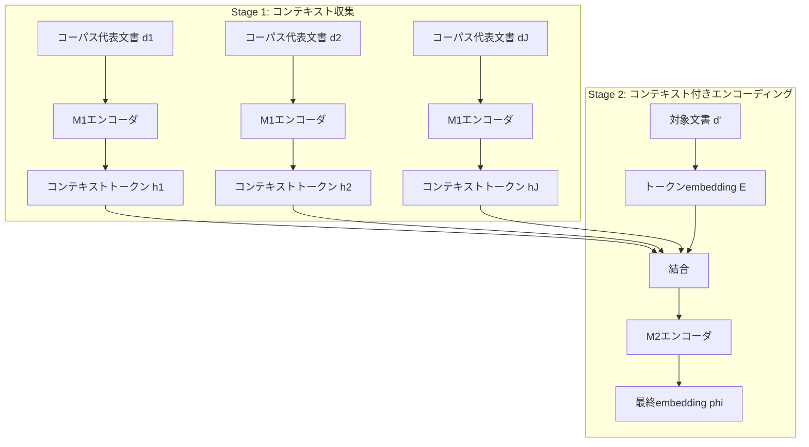

本記事は [Contextual Document Embeddings](https://arxiv.org/abs/2410.02525) の解説記事です。

## 論文概要（Abstract）

標準的なdocument embeddingはBi-Encoderにより各文書を独立にベクトル化するため、コーパス内での文書間の関係性が表現に反映されない。著者らはこの問題を「文書が暗黙的にout-of-contextである」と定式化し、2つの相補的手法を提案している。第1に、隣接文書をバッチ構成に組み込む修正コントラスティブ学習目的関数、第2に、隣接文書の情報をfinal representationに明示的にエンコードするコンテキストアーキテクチャである。著者らは、ハードネガティブマイニング、スコア蒸留、データセット固有命令、大規模バッチサイズのいずれも用いずにMTEBベンチマークで当時のSOTAを達成したと報告している。

この記事は [Zenn記事: Gemini Embedding×Contextual Retrieval×クエリ拡張でセマンティック検索精度を段階的に改善する](https://zenn.dev/0h_n0/articles/bd095b4bd8a798) の深掘りです。

## 情報源

- **arXiv ID**: 2410.02525
- **URL**: [https://arxiv.org/abs/2410.02525](https://arxiv.org/abs/2410.02525)
- **著者**: John X. Morris, Alexander M. Rush
- **発表年**: 2024年（初版: 2024年10月3日、最終改訂: 2024年11月8日）
- **分野**: cs.CL（計算言語学）, cs.AI（人工知能）

## 背景と動機（Background & Motivation）

Bi-Encoderによる密検索では、各文書をTransformerエンコーダで独立にベクトル化する。この方式は計算効率に優れるが、著者らはコーパス内での文書間の関係性がembeddingに反映されないという問題を指摘している。Contextualized Word Embeddings（ELMo, BERT等）が単語の周辺文脈で精度を改善した歴史を踏まえ、document embeddingにもコーパスレベルの文脈を組み込むべきだと主張している。

関連するアプローチとして、Anthropicの**Contextual Retrieval**はチャンクにLLM生成のテキスト文脈を付与し、Jina AIの**Late Chunking**はTransformer出力層でチャンク境界分割する。本論文のCDEはこれらと異なり、**学習目的関数とモデルアーキテクチャの両方**を修正することで、embeddingの計算過程そのものにコーパスレベルの文脈を組み込む。

## 主要な貢献（Key Contributions）

- **貢献1: 修正コントラスティブ学習目的関数** -- コーパス全体をクラスタリングし、類似文書同士でバッチを構成することで、ハードネガティブマイニングを用いずに困難な識別問題を自然に生成する手法
- **貢献2: コンテキストアーキテクチャ（CDE）** -- 2段階のエンコーダにより、対象文書だけでなくコーパスの代表的な文書群の情報をembeddingに明示的に反映するアーキテクチャ
- **貢献3: MTEB SOTAの達成** -- 250Mパラメータ以下のモデルカテゴリでMTEB平均スコア65.00を達成し、ハードネガティブマイニング・スコア蒸留・データセット固有命令・大規模バッチなしで当時のSOTAを更新

## 技術的詳細（Technical Details）

### 標準コントラスティブ学習の課題

標準的なBi-Encoderの学習ではInfoNCE損失関数を用いる。クエリ$q$と正例文書$d$のペアに対し、バッチ内の他の文書$d'$を負例として以下を最大化する:

$$
\log p(d \mid q) = \log \frac{\exp f(d, q)}{\sum_{d' \in \mathcal{B}} \exp f(d', q)}
$$

ここで、$f(d, q) = \phi(d) \cdot \psi(q)$はエンコーダ$\phi$（文書側）と$\psi$（クエリ側）による内積スコア、$\mathcal{B}$はミニバッチ内の全文書である。

この定式化では、バッチサイズを大きくするほど多様な負例が含まれ学習が改善されるため、先行研究では数千〜数万のバッチサイズが使用されてきた。しかし著者らは、**大規模バッチでは大半の負例が容易に識別可能であり、困難な負例（hard negatives）が偶然含まれることに依存している**と指摘している。

### 手法1: 修正コントラスティブ学習（Adversarial Contrastive Training）

#### クラスタリングによるバッチ構成

著者らは、類似した文書-クエリペアを同一バッチに集約することで、意図的に困難な識別問題を構成する。具体的には、コーパス全体の文書-クエリペアをK-Meansでクラスタリングし、同一クラスタ内のペアでバッチを構成する。

クラスタリングの距離関数は以下のように定義される:

$$
m\bigl((d, q),\; (d', q')\bigr) = \|\phi(d) - \psi(q')\| + \|\phi(d') - \psi(q)\|
$$

ここで、$\phi(d)$は文書のembedding、$\psi(q)$はクエリのembeddingである。この距離は「ペア$(d,q)$の文書が別のペア$(d',q')$のクエリにどれだけ近いか」を測定している。距離が小さいペア同士を同一クラスタに集約すると、バッチ内の負例が互いに「紛らわしい」ものになり、ハードネガティブマイニングと同等の効果が得られる。

修正後の目的関数は以下の通りである:

$$
\max_{\phi, \psi} \sum_{b} \sum_{(d,q) \in \mathcal{B}^b} \log \frac{\exp f(d, q)}{\sum_{(d', \cdot) \in \mathcal{B}^b} \exp f(d', q)}
$$

ここで、$\mathcal{B}^b$はクラスタ$b$から構成されたバッチである。

#### 偽陰性フィルタリング

類似文書を同一バッチに集約すると、負例として扱われる文書の中にクエリの正解となりうるもの（偽陰性）が含まれるリスクが高まる。著者らの報告では、MS MARCOにおいて上位検索結果の約70%が偽陰性であったとされている。

この問題に対し、等価クラス$S(q, d)$を定義してフィルタリングを行う:

$$
S(q, d) = \{d' \in \mathcal{D} \mid f(q, d') \geq f(q, d)\}
$$

フィルタリング後の損失関数は:

$$
\log p(d \mid q) = \log \frac{\exp f(d, q)}{\exp f(d, q) + \sum_{d' \notin S(q, d)} \exp f(d', q)}
$$

つまり、現在の正例文書$d$よりもスコアが高い文書を負例から除外する。論文のTable 1（後述）では、このフィルタリングの有無がベンチマーク性能に大きく影響することが示されている。

### 手法2: コンテキストアーキテクチャ（CDE）

バッチ構成の工夫は学習時にのみ有効であり、推論時のembedding自体にはコーパスの文脈が反映されない。この限界を補うため、著者らは2段階のエンコーダアーキテクチャを提案している。



#### Stage 1: コンテキスト収集

コーパスから代表的な$J$個の文書$d^1, \ldots, d^J$を選択し、第1段階エンコーダ$M_1$でそれぞれをベクトル化する。著者らの実装では$J = 512$（コンテキストトークン数512）を使用している。

#### Stage 2: コンテキスト付きエンコーディング

対象文書$d'$のembeddingを、第1段階で得たコンテキストトークンと結合して第2段階エンコーダ$M_2$に入力する:

$$
\phi(d';\; \mathcal{D}) = M_2\bigl(M_1(d^1),\; \ldots,\; M_1(d^J),\; E(d'_1),\; \ldots,\; E(d'_T)\bigr)
$$

クエリ側も同様に、文書側のコンテキストを共有してエンコードする:

$$
\psi(q;\; \mathcal{D}) = M_2\bigl(M_1(d^1),\; \ldots,\; M_1(d^J),\; E(q_1),\; \ldots,\; E(q_T)\bigr)
$$

ここで、$E$はトークンembedding層、$T$はトークン系列長である。

#### 設計上の工夫

- **Sequence Dropout**: コンテキストトークンを確率$p = 0.005$でnullトークン$v_\emptyset$に置換し、コンテキストがない場合にも頑健に動作するようにしている
- **Position-Agnostic Embeddings**: コンテキスト位置にはRotary Embeddingsの位置情報を付与せず、コンテキスト文書の順序に依存しない設計としている
- **2段階Gradient Caching**: $M_1$と$M_2$の勾配計算を分離し、メモリ使用量を削減している

### 実装コード例

以下は、CDE-small-v1モデルを用いた2段階embeddingの実装例である。

```python
"""CDE 2段階推論パイプライン（arXiv:2410.02525）."""

import torch
import transformers
from torch import Tensor


def embed_with_context(
    model: transformers.PreTrainedModel,
    tokenizer: transformers.PreTrainedTokenizer,
    corpus_samples: list[str],
    target_texts: list[str],
    prefix: str = "search_document: ",
    max_length: int = 512,
) -> Tensor:
    """コーパスコンテキストを反映した2段階embeddingを生成する.

    Args:
        model: CDEモデル（trust_remote_code=Trueでロード）
        tokenizer: トークナイザ
        corpus_samples: コーパスの代表文書リスト（Stage 1入力、512件推奨）
        target_texts: embeddingを生成する対象テキストリスト
        prefix: タスク固有プレフィックス
        max_length: 最大トークン長

    Returns:
        正規化済みembeddingテンソル (len(target_texts), hidden_dim)
    """
    # Stage 1: コーパス代表文書をエンコード
    corpus_inputs = tokenizer(
        [f"{prefix}{doc}" for doc in corpus_samples],
        padding=True, truncation=True,
        max_length=max_length, return_tensors="pt",
    )
    with torch.no_grad():
        corpus_emb = model.first_stage_model(**corpus_inputs)

    # Stage 2: コンテキスト付きでエンコード
    target_inputs = tokenizer(
        [f"{prefix}{t}" for t in target_texts],
        padding=True, truncation=True,
        max_length=max_length, return_tensors="pt",
    )
    with torch.no_grad():
        target_emb = model.second_stage_model(
            input_ids=target_inputs["input_ids"],
            attention_mask=target_inputs["attention_mask"],
            dataset_embeddings=corpus_emb,
        )

    return torch.nn.functional.normalize(target_emb, p=2, dim=-1)
```

## 実装のポイント（Implementation）

**コーパスサンプリング**: Stage 1に入力する代表文書$J$個の選択が性能に影響する。著者らの実装では$J = 512$を使用しており、対象コーパスからランダムに抽出する方法が基本である。論文の実験（Table 10.12の分析）では、同一ドメインのコンテキストが最も高い性能を示し、異なるドメインのコンテキストでは$\pm 1$ポイント程度のNDCG@10の変動が生じると報告されている。

**推論時のコンテキストキャッシュ**: Stage 1のコーパスembeddingはコーパスごとに1回計算すれば再利用できる。検索インデックスを構築する際にコーパス全体を一度Stage 1に通し、結果をキャッシュしておくことで推論時のオーバーヘッドを最小化できる。

**Fallback設計**: コーパス情報なしではMTEBスコアが65.0から63.8へ約1.2ポイント低下する（Table 2）。本番環境ではfallback精度の許容範囲を事前に検証する必要がある。

**ベースモデル**: CDE-small-v1はNomicBERT（137M）ベースでFlash Attentionを利用。GPU環境が推奨される。

## Production Deployment Guide

以下にAWS上でのCDE推論パイプラインの実装パターンを示す。

### AWS実装パターン（コスト最適化重視）

CDEモデル（137Mパラメータ）は軽量であり、GPU推論が望ましいものの、CPUでも動作可能である。トラフィック量別の推奨構成を以下に示す。

| 構成 | トラフィック | AWSサービス | 月額コスト概算 |
|------|------------|------------|--------------|
| Small | ~100 req/日 | Lambda + ECR + DynamoDB | $50-150 |
| Medium | ~1,000 req/日 | ECS Fargate (GPU) + ElastiCache | $300-800 |
| Large | 10,000+ req/日 | EKS + Karpenter + Spot Instances | $2,000-5,000 |

**Small構成の詳細**: Lambda（メモリ3008MB、タイムアウト60秒）でCPU推論を行う。Stage 1のコーパスembeddingはDynamoDBにキャッシュし、文書更新時のみ再計算する。バッチ的なインデックス構築用途に適する。

**Medium構成の詳細**: ECS FargateでGPUタスクを実行。ElastiCacheにStage 1キャッシュし、Stage 2推論のみをGPUで実行。

**Large構成の詳細**: EKS + KarpenterでSpot Instances自動スケーリング。バッチ推論にはAWS Batch + Spotも有効。

**コスト削減テクニック**:
- Spot Instancesの活用でGPUコストを最大70%削減
- Reserved Instances（1年コミット）でオンデマンド比最大40%削減
- Stage 1コーパスembeddingのキャッシュによりGPU推論回数を50%以上削減
- バッチインデックス構築はオフピーク時間帯にスケジュール

> **注意**: 上記コスト試算は2026年7月時点のAWS ap-northeast-1（東京）リージョンの概算値である。実際のコストはトラフィックパターン、インスタンスの可用性、リージョンにより変動する。最新料金は[AWS料金計算ツール](https://calculator.aws/)で確認を推奨する。

### Terraformインフラコード

#### Small構成（Serverless: Lambda + DynamoDB）

```hcl
# CDE embedding推論用Lambda + キャッシュ用DynamoDB
# 2026-07時点のTerraform AWS Provider ~> 5.x 対応

resource "aws_dynamodb_table" "corpus_cache" {
  name         = "cde-corpus-embeddings"
  billing_mode = "PAY_PER_REQUEST"
  hash_key     = "corpus_id"

  attribute {
    name = "corpus_id"
    type = "S"
  }

  server_side_encryption {
    enabled = true  # KMS暗号化
  }
}

resource "aws_lambda_function" "cde_inference" {
  function_name = "cde-embedding-inference"
  role          = aws_iam_role.lambda_cde.arn
  package_type  = "Image"
  image_uri     = "${aws_ecr_repository.cde.repository_url}:latest"
  memory_size   = 3008  # CPU推論に十分なメモリ
  timeout       = 60

  environment {
    variables = {
      CORPUS_CACHE_TABLE = aws_dynamodb_table.corpus_cache.name
      MODEL_NAME         = "jxm/cde-small-v1"
    }
  }

  tracing_config {
    mode = "Active"  # X-Ray有効化
  }
}
```

#### Large構成（Container: EKS + Karpenter + Spot）

```hcl
# EKS + Karpenter によるGPU推論クラスタ

module "eks" {
  source  = "terraform-aws-modules/eks/aws"
  version = "~> 20.0"

  cluster_name    = "cde-embedding-cluster"
  cluster_version = "1.31"
  vpc_id          = module.vpc.vpc_id
  subnet_ids      = module.vpc.private_subnets

  cluster_endpoint_public_access = false  # プライベートエンドポイント

  eks_managed_node_groups = {
    system = {
      instance_types = ["m6i.large"]
      min_size = 2
      max_size = 3
    }
  }
}

# Karpenter: Spot優先でGPUノードを自動スケーリング
resource "kubectl_manifest" "karpenter_provisioner" {
  yaml_body = yamlencode({
    apiVersion = "karpenter.sh/v1"
    kind       = "NodePool"
    metadata   = { name = "gpu-spot" }
    spec = {
      template = {
        spec = {
          requirements = [
            { key = "karpenter.sh/capacity-type", operator = "In", values = ["spot", "on-demand"] },
            { key = "node.kubernetes.io/instance-type", operator = "In", values = ["g5.xlarge", "g5.2xlarge"] },
          ]
        }
      }
      limits = { "nvidia.com/gpu" = "8" }
      disruption = { consolidationPolicy = "WhenEmpty", consolidateAfter = "30s" }
    }
  })
}
```

### 運用・監視設定

#### 運用・監視設定

**CloudWatch Logs Insights** -- 推論レイテンシP95/P99を1時間単位で集計し、Stage 1キャッシュヒット率を監視する。

**CloudWatchアラーム** -- Lambda Duration P99がタイムアウトの75%（45秒）を超えた場合にSNS通知。エラー率が閾値を超えた場合のアラートも設定する。

**X-Ray** -- `aws_xray_sdk`の`patch_all()`でboto3を自動計装し、`corpus_id`と`cache_hit`をアノテーションとして記録する。

**Cost Explorer日次レポート** -- Projectタグでフィルタしたサービス別日次コストを集計し、閾値（$100/日）超過時にSNS通知を送信する。

### コスト最適化チェックリスト

**アーキテクチャ選択**: トラフィック量でServerless/Fargate/EKSを選択、バッチ構築とオンライン推論の分離設計、Stage 1キャッシュ戦略の定義

**リソース最適化**: GPU Spot Instances優先、Reserved Instances 1年コミット、Savings Plans検討、Lambdaメモリ最適化（Power Tuning）、ECS/EKSアイドル時スケールダウン

**モデル推論コスト削減**: Stage 1キャッシュ（DynamoDB/ElastiCache）、SageMaker Batch Transform、INT8量子化、ONNX Runtime変換

**監視・アラート**: AWS Budgets月次アラート、CloudWatch P99レイテンシ監視、Cost Anomaly Detection、日次コストレポートSNS通知、X-Rayボトルネック可視化

**リソース管理**: ECRライフサイクルポリシー、Projectタグ戦略、S3ライフサイクル、開発環境夜間停止、CloudWatch Logs保持期間設定（30-90日）

## 実験結果（Results）

### BEIR上のアブレーション（論文Table 1より）

著者らは、提案する2つの手法（コンテキストバッチ構成とコンテキストアーキテクチャ）の個別・組合せの効果をBEIRベンチマーク（NDCG@10）で検証している。

| 構成 | コンテキストバッチ | コンテキストアーキテクチャ | バッチサイズ | NDCG@10 |
|------|:--:|:--:|:--:|:--:|
| ベースライン | -- | -- | 16,384 | 59.9 |
| バッチのみ | あり | -- | 512 | 61.7 |
| アーキテクチャのみ | -- | あり | 16,384 | 62.4 |
| 両方 | あり | あり | 512 | **63.1** |

注目すべき点として、バッチサイズ512の修正コントラスティブ学習（61.7）がバッチサイズ16,384のベースライン（59.9）を上回っている。これは、バッチの「難しさ」がバッチの「大きさ」よりも重要であることを示唆している。2つの手法を組み合わせると63.1を達成し、ベースラインから+3.2ポイントの改善が得られている。

### MTEB（250Mパラメータ以下、論文Table 2より）

| モデル | Clssfctn | Cluster | PairCls | Rerank | Retrieval | STS | Summary | Mean |
|--------|:--:|:--:|:--:|:--:|:--:|:--:|:--:|:--:|
| nomic-embed-v1 | 74.1 | 43.9 | 85.2 | 55.7 | 52.8 | 82.1 | 30.1 | 62.39 |
| bge-base | 75.5 | 45.8 | 86.6 | 58.9 | 53.3 | 82.4 | 31.1 | 63.56 |
| gte-base | 77.2 | 46.8 | 85.3 | 57.7 | 54.1 | 82.0 | 31.2 | 64.11 |
| CDE-small（ランダムコンテキスト） | 81.3 | 46.6 | 84.1 | 55.3 | 51.1 | 81.4 | 31.6 | 63.81 |
| **CDE-small（コンテキスト付き）** | **81.7** | **48.3** | **84.7** | **56.7** | **53.3** | **81.6** | **31.2** | **65.00** |

CDE-smallはコンテキスト付きで平均65.00を達成し、250Mパラメータ以下カテゴリで当時最高スコアであったと著者らは報告している。ランダムコンテキスト（63.81）との差+1.19はコンテキスト選択の重要性を示している。

### クラスタサイズとフィルタリングの影響

論文Figure 3およびFigure 4の分析では、クラスタサイズが小さいほど（バッチがより困難になるほど）下流タスクのNDCG@10が向上する傾向が確認されている。ただし、この傾向は偽陰性フィルタリングが有効な場合にのみ顕著であり、フィルタリングなしではクラスタサイズによる差が縮小すると報告されている。

## 実運用への応用（Practical Applications）

CDEの2段階アーキテクチャは、RAGパイプラインの**Layer 2: インデックス改善**として活用できる。Contextual Retrievalと比較して、LLMによる文脈テキスト生成コスト（$1.02/M tokens）が不要である。

**実用上の考慮点**:

- **ドメイン特化検索**: 法律文書や医療文献など特定ドメインでは、コンテキスト文書がドメイン固有の語彙分布を反映するため高精度が期待できる
- **インデックス更新**: コンテキスト選択が性能に$\pm 1$ポイント程度影響するため、大幅なコーパス変更時にはStage 1の再計算を推奨する
- **ハイブリッド活用**: CDEでembedding品質を向上させつつ、BM25側にContextual Retrievalの文脈テキストを付与する組み合わせも可能
- **モデルサイズ**: CDE-small（137M）は軽量でGPU推論は数十ms、CPUでもServerless運用が現実的

## 関連研究（Related Work）

- **Sentence-BERT** (Reimers & Gurevych, 2019): CDEが基盤とするBi-Encoder方式の基礎を確立した先駆的研究
- **Late Chunking** (Jina AI, 2024): 長文脈Transformerの出力層でチャンク分割しembeddingに文脈を反映。CDEとはアプローチが異なる
- **Contextual Retrieval** (Anthropic, 2024): LLMでチャンクにテキスト文脈を付与。CDEは学習・推論パイプライン自体に文脈を組み込む点で異なる
- **InstructOR** (Su et al., 2023): タスク固有命令をembeddingに組み込む手法。CDEは命令**不要**で同等以上の性能を達成
- **ColBERT** (Khattab & Zaharia, 2020): Late Interaction方式。out-of-domain再現率に優れるがインデックスサイズが大きい

## まとめと今後の展望

本論文は、クラスタリングベースのバッチ構成と2段階コンテキストアーキテクチャにより、document embeddingにコーパスレベルの文脈を導入した。バッチサイズ512でも16,384のベースラインを上回り、両手法の組み合わせでBEIR NDCG@10を59.9から63.1へ改善している。著者らはコンテキストの動的選択や大規模モデルへのスケーリングを今後の方向として示唆している。CDEの考え方はRAGパイプラインのembedding品質改善に直接応用でき、Contextual RetrievalやLate Chunkingと相補的に活用可能である。

## 参考文献

- **arXiv**: [https://arxiv.org/abs/2410.02525](https://arxiv.org/abs/2410.02525)
- **Code**: [https://github.com/jxmorris12/cde](https://github.com/jxmorris12/cde)
- **Model**: [https://huggingface.co/jxm/cde-small-v1](https://huggingface.co/jxm/cde-small-v1)
- **Related Zenn article**: [https://zenn.dev/0h_n0/articles/bd095b4bd8a798](https://zenn.dev/0h_n0/articles/bd095b4bd8a798)
- **Contextual Retrieval (Anthropic)**: [https://www.anthropic.com/engineering/contextual-retrieval](https://www.anthropic.com/engineering/contextual-retrieval)
- **Late Chunking (Jina AI)**: [https://arxiv.org/abs/2409.04701](https://arxiv.org/abs/2409.04701)

---

> この記事はAI（Claude Code）により自動生成されました。内容の正確性については複数の情報源で検証していますが、実際の利用時は公式ドキュメントおよび原論文もご確認ください。
