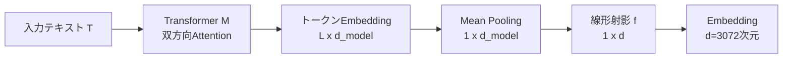

本記事は [Gemini Embedding: Generalizable Embeddings from Gemini](https://arxiv.org/abs/2503.07891) の解説記事です。

## 論文概要（Abstract）

Gemini Embeddingは、GoogleのGemini LLMを基盤として構築された汎用テキストEmbeddingモデルである。著者らは、Geminiの多言語・コード理解能力を活用し、検索・分類・クラスタリング・類似度計算など多様なタスクに対応する統一的なEmbeddingを生成する手法を提案している。Massive Multilingual Text Embedding Benchmark（MMTEB）において250以上の言語にわたる100以上のタスクで評価を行い、MTEB（Multilingual）でTask Mean 68.32、MTEB（Eng, v2）で73.30、MTEB（Code）で74.66を達成し、いずれも発表時点で1位を記録したと報告されている。

この記事は [Zenn記事: Gemini Embedding×Contextual Retrieval×クエリ拡張でセマンティック検索精度を段階的に改善する](https://zenn.dev/0h_n0/articles/bd095b4bd8a798) の深掘りです。

## 情報源

- **arXiv ID**: 2503.07891
- **URL**: [https://arxiv.org/abs/2503.07891](https://arxiv.org/abs/2503.07891)
- **著者**: Jinhyuk Lee, Feiyang Chen, Sahil Dua, Daniel Cer, Madhuri Shanbhogue et al.（Google, 47名）
- **発表年**: 2025年
- **分野**: cs.CL, cs.AI

## 背景と動機（Background & Motivation）

テキストEmbeddingは、検索・分類・クラスタリングなど多くのNLPタスクの基盤技術として広く利用されている。しかし従来のEmbeddingモデルには以下の課題があった。

第一に、**ドメイン特化の問題**である。英語中心のモデルは多言語タスクで性能が低下し、コード検索に特化したモデルは自然言語タスクで精度が出ない。タスクごとに異なるモデルを使い分ける必要があり、運用コストが増大していた。

第二に、**LLMの知識活用の不十分さ**である。大規模言語モデル（LLM）は多言語・多ドメインの知識を獲得しているにもかかわらず、その知識をEmbeddingに効果的に転移する方法が確立されていなかった。

第三に、**次元数の柔軟性の欠如**である。固定次元のEmbeddingは、レイテンシやストレージのトレードオフに対応できなかった。

Gemini Embeddingはこれらの課題に対し、Gemini LLMを基盤とした単一モデルで多言語・コード・多タスクを統一的にカバーするアプローチを提案している。

## 主要な貢献（Key Contributions）

- **MTEBベンチマークでの総合1位達成**: MTEB（Multilingual）でTask Mean 68.32、MTEB（Eng, v2）で73.30、MTEB（Code）で74.66を達成（論文Table 2, 3, 4より）
- **task_typeパラメータによるタスク最適化**: 8種類のタスクタイプ（RETRIEVAL_QUERY, RETRIEVAL_DOCUMENT, SEMANTIC_SIMILARITY, CLASSIFICATION, CLUSTERING, CODE_RETRIEVAL_QUERY, QUESTION_ANSWERING, FACT_VERIFICATION）を指定可能にし、同一モデルでタスク別のEmbedding最適化を実現
- **Matryoshka Representation Learning（MRL）対応**: 3072次元（デフォルト）から768・1536次元への柔軟な次元削減を、性能劣化を抑えつつ実現
- **合成データとモデルスープによる学習パイプライン**: Gemini自身による合成データ生成・品質フィルタリングと、複数チェックポイントのパラメータ平均化を組み合わせた効率的な学習手法を提案

## 技術的詳細（Technical Details）

### アーキテクチャ

Gemini Embeddingは、Gemini LLMから初期化されたTransformerを双方向Attentionに変換して使用する。入力テキスト$T$の$L$トークンをTransformerモデル$M$に入力し、トークンEmbeddingを取得した後、平均プーリング（Mean Pooling）とランダム線形射影を適用してEmbeddingベクトルを生成する。



具体的には、トークンEmbedding $\mathbf{h}_1, \mathbf{h}_2, \ldots, \mathbf{h}_L$ に対して平均プーリングを適用する。

$$
\bar{\mathbf{h}} = \frac{1}{L} \sum_{i=1}^{L} \mathbf{h}_i
$$

ここで、
- $L$: 入力トークン数
- $\mathbf{h}_i$: $i$番目のトークンのEmbedding（$\mathbb{R}^{d_{\text{model}}}$）
- $\bar{\mathbf{h}}$: プーリング後のベクトル

その後、ランダムに初期化された線形射影 $f: \mathbb{R}^{d_{\text{model}}} \rightarrow \mathbb{R}^{d}$ を適用し、$d = 3{,}072$ 次元のEmbeddingベクトルを得る。

### task_typeパラメータ

Gemini Embeddingの特徴的な設計として、学習時にタスク文字列 $t$ をクエリに付与する仕組みがある。論文では「Each example also has a prescribed task string $t$, for example 'question answering' or 'fact checking'」と記述されている。これにより、同一モデルでありながらタスクに応じた最適なEmbedding空間を選択的に利用できる。

API経由で利用可能なtask_typeは以下の8種類である。

| task_type | 用途 | 使用場面 |
|-----------|------|----------|
| `RETRIEVAL_QUERY` | 検索クエリの埋め込み | RAGのクエリ側 |
| `RETRIEVAL_DOCUMENT` | 検索対象文書の埋め込み | RAGのドキュメント側 |
| `SEMANTIC_SIMILARITY` | テキスト間の類似度計算 | 重複検出、パラフレーズ判定 |
| `CLASSIFICATION` | テキスト分類 | 感情分析、トピック分類 |
| `CLUSTERING` | クラスタリング | 文書群の自動グルーピング |
| `CODE_RETRIEVAL_QUERY` | コード検索 | 自然言語からのコード検索 |
| `QUESTION_ANSWERING` | 質問応答 | QAシステム |
| `FACT_VERIFICATION` | 事実検証 | ファクトチェック |

### コントラスティブ損失関数

学習にはコントラスティブ損失関数が使用される。バッチ$\mathcal{B}$内のクエリ$q_i$、正例$p_i^+$、ハードネガティブ$p_i^-$に対して、以下の損失が定義される（論文Equation 2）。

$$
\mathcal{L} = \frac{1}{B} \sum_{i=1}^{B} \left[ -\log \frac{e^{\text{sim}(q_i, p_i^+) / \tau}}{e^{\text{sim}(q_i, p_i^-) / \tau} + \sum_{j \neq i} m(i,j) \cdot e^{\text{sim}(q_i, p_j^+) / \tau}} \right]
$$

ここで、
- $B$: バッチサイズ
- $\text{sim}(x, y) = \frac{x^\top y}{\|x\| \|y\|}$: コサイン類似度
- $\tau$: 温度パラメータ
- $m(i, j)$: バッチ内の重複を除外するマスク関数

論文では、同一タワーからのネガティブサンプル（same-tower negatives）を損失から除外することで性能が向上したと報告されている。

### Matryoshka Representation Learning（MRL）

MRL（Kusupati et al., 2022）は、単一のモデルから複数の次元数のEmbeddingを同時に学習する手法である。Gemini Embeddingでは、上記のコントラスティブ損失を$k$個のサブ次元に対して拡張する。

$$
\mathcal{L}_{\text{MRL}} = \sum_{j=1}^{k} \mathcal{L}_{d_j}
$$

ここで、
- $k = 3$: サブ次元の数
- $d_1 = 768, d_2 = 1{,}536, d_3 = 3{,}072$: 各サブ次元
- $\mathcal{L}_{d_j}$: $d_j$次元に切り詰めたEmbeddingに対するコントラスティブ損失

3072次元ベクトルの先頭768次元や1536次元を切り出しても高い性能を維持できるため、ストレージコストとレイテンシを柔軟に調整できる。

### 学習パイプライン（Multi-Task Learning）

学習は2段階で構成される。

**Stage 1: Pre-finetuning**
- **データ**: 数十億規模のWebコーパスから抽出したタイトル-パッセージペア
- **特徴**: ハードネガティブを使用せず、ノイズの多いデータに対して大きなバッチサイズで安定した勾配を確保
- **目的**: 広範なドメイン知識をEmbeddingに転移

**Stage 2: Fine-tuning**
- **データ**: タスク固有のデータセット（クエリ, 正例, ハードネガティブ）のトリプレット
- **特徴**: 小バッチサイズ（1024未満）で、各バッチを単一データセットに限定
- **最適化**: ハイパーパラメータのグリッドサーチ

さらに、**Model Soup**（モデルスープ）技法を採用し、複数のFine-tuningチェックポイントのパラメータを平均化することで、個別タスクへの過学習を防ぎつつ汎化性能を向上させている。

**合成データ生成**も重要な要素である。Gemini自身をfew-shotプロンプティングで活用し、Webパッセージに対する合成クエリを生成した後、Gemini auto-raterで品質フィルタリングを行う。分類タスクでは、合成的な反事実・感情・レビュー分類データセットを英語で生成し、性能を+17.6ポイント向上させたと報告されている（論文Table 7より）。

## 実装のポイント（Implementation）

### google-genai SDKによる基本的な利用

```python
from google import genai
from google.genai import types

client = genai.Client()

# 検索クエリのEmbedding（task_type指定）
query_result = client.models.embed_content(
    model="gemini-embedding-001",
    contents=["RAGパイプラインの最適化方法は？"],
    config=types.EmbedContentConfig(
        task_type="RETRIEVAL_QUERY",
    ),
)
query_embedding = query_result.embeddings[0].values  # 3072次元

# ドキュメント側のEmbedding
doc_result = client.models.embed_content(
    model="gemini-embedding-001",
    contents=[
        "RAGではチャンク分割とリランキングが重要である...",
        "Contextual Retrievalは検索失敗率を49%削減する...",
    ],
    config=types.EmbedContentConfig(
        task_type="RETRIEVAL_DOCUMENT",
    ),
)
doc_embeddings = [e.values for e in doc_result.embeddings]
```

### MRLによる次元削減の活用

```python
# 768次元に削減（ストレージ75%削減）
result_768 = client.models.embed_content(
    model="gemini-embedding-001",
    contents=["テスト文"],
    config=types.EmbedContentConfig(
        task_type="SEMANTIC_SIMILARITY",
        output_dimensionality=768,  # 768, 1536, 3072から選択
    ),
)
embedding_768 = result_768.embeddings[0].values
assert len(embedding_768) == 768
```

### task_type使い分けの実装例

```python
import numpy as np

def compute_similarity(
    query: str,
    documents: list[str],
    client: genai.Client,
    top_k: int = 5,
) -> list[tuple[int, float]]:
    """task_typeを適切に使い分けた類似度検索

    Args:
        query: 検索クエリ
        documents: 検索対象ドキュメントのリスト
        client: google-genai クライアント
        top_k: 返却件数

    Returns:
        (ドキュメントインデックス, コサイン類似度) のリスト
    """
    q_result = client.models.embed_content(
        model="gemini-embedding-001",
        contents=[query],
        config=types.EmbedContentConfig(
            task_type="RETRIEVAL_QUERY",
            output_dimensionality=768,
        ),
    )
    d_result = client.models.embed_content(
        model="gemini-embedding-001",
        contents=documents,
        config=types.EmbedContentConfig(
            task_type="RETRIEVAL_DOCUMENT",
            output_dimensionality=768,
        ),
    )

    q_vec = np.array(q_result.embeddings[0].values)
    d_vecs = np.array([e.values for e in d_result.embeddings])

    # コサイン類似度計算
    similarities = d_vecs @ q_vec / (
        np.linalg.norm(d_vecs, axis=1) * np.linalg.norm(q_vec)
    )
    top_indices = np.argsort(similarities)[::-1][:top_k]
    return [(int(i), float(similarities[i])) for i in top_indices]
```

**注意点**:
- クエリ側とドキュメント側で**異なるtask_type**を指定する。RETRIEVAL_QUERYとRETRIEVAL_DOCUMENTのペアで使用することで、非対称検索に最適化されたEmbeddingが得られる
- `output_dimensionality`は768, 1536, 3072のいずれかを推奨。これらはMRL学習で明示的に最適化された次元数である
- APIの料金は$0.15/1Mトークン（2025年3月時点）

## Production Deployment Guide

### AWS実装パターン（コスト最適化重視）

Gemini Embedding APIをRAGパイプラインに組み込む場合のAWS構成を、トラフィック量別に示す。

| 構成 | トラフィック | 主要サービス | 月額概算 |
|------|-------------|-------------|---------|
| Small | ~100 req/日 | Lambda + API Gateway + OpenSearch Serverless | $50-150 |
| Medium | ~1,000 req/日 | ECS Fargate + OpenSearch + ElastiCache | $300-800 |
| Large | 10,000+ req/日 | EKS + Karpenter + OpenSearch + ElastiCache | $2,000-5,000 |

**Small構成の詳細（~100 req/日）**:
- Lambda (256MB, 30秒タイムアウト): Gemini API呼び出し + ベクトル化
- API Gateway: RESTエンドポイント
- OpenSearch Serverless: ベクトルストア（k-NN）
- DynamoDB On-Demand: メタデータ・キャッシュ
- 月額内訳: Lambda $5 + API Gateway $5 + OpenSearch Serverless $30-80 + DynamoDB $5 + その他 $5-55

**コスト削減テクニック**:
- Gemini API Batch処理で50%削減（インデックス構築時）
- OpenSearch ServerlessのOCU最小構成（2 OCU）で起動
- Embeddingキャッシュ（DynamoDB/ElastiCache）で同一クエリの再計算を回避
- MRLで768次元に削減し、ベクトルストレージを75%削減

**コスト試算の注意事項**: 上記は2026年7月時点のAWS ap-northeast-1（東京）リージョン料金に基づく概算値である。実際のコストはトラフィックパターン、バースト使用量により変動する。最新料金はAWS料金計算ツールで確認を推奨する。

### Terraformインフラコード

**Small構成（Serverless）**:

```hcl
# Gemini Embedding RAG Pipeline - Small構成
terraform {
  required_version = ">= 1.12"
  required_providers {
    aws = {
      source  = "hashicorp/aws"
      version = "~> 5.80"
    }
  }
}

provider "aws" {
  region = "ap-northeast-1"
}

# --- IAM Role (最小権限) ---
resource "aws_iam_role" "embedding_lambda" {
  name = "gemini-embedding-lambda-role"
  assume_role_policy = jsonencode({
    Version = "2012-10-17"
    Statement = [{
      Action = "sts:AssumeRole"
      Effect = "Allow"
      Principal = { Service = "lambda.amazonaws.com" }
    }]
  })
}

resource "aws_iam_role_policy" "lambda_policy" {
  name = "gemini-embedding-lambda-policy"
  role = aws_iam_role.embedding_lambda.id
  policy = jsonencode({
    Version = "2012-10-17"
    Statement = [
      {
        Effect   = "Allow"
        Action   = ["logs:CreateLogGroup", "logs:CreateLogStream", "logs:PutLogEvents"]
        Resource = "arn:aws:logs:*:*:*"
      },
      {
        Effect   = "Allow"
        Action   = ["secretsmanager:GetSecretValue"]
        Resource = aws_secretsmanager_secret.gemini_api_key.arn
      },
      {
        Effect   = "Allow"
        Action   = ["dynamodb:GetItem", "dynamodb:PutItem", "dynamodb:Query"]
        Resource = aws_dynamodb_table.embedding_cache.arn
      }
    ]
  })
}

# --- Secrets Manager (Gemini API Key) ---
resource "aws_secretsmanager_secret" "gemini_api_key" {
  name                    = "gemini-embedding/api-key"
  recovery_window_in_days = 7
}

# --- DynamoDB (Embeddingキャッシュ, On-Demand) ---
resource "aws_dynamodb_table" "embedding_cache" {
  name         = "gemini-embedding-cache"
  billing_mode = "PAY_PER_REQUEST"
  hash_key     = "content_hash"

  attribute {
    name = "content_hash"
    type = "S"
  }

  ttl {
    attribute_name = "expires_at"
    enabled        = true
  }

  server_side_encryption {
    enabled = true  # KMS暗号化
  }
}

# --- Lambda関数 ---
resource "aws_lambda_function" "embedding" {
  function_name = "gemini-embedding-handler"
  role          = aws_iam_role.embedding_lambda.arn
  handler       = "handler.lambda_handler"
  runtime       = "python3.13"
  timeout       = 30
  memory_size   = 256

  environment {
    variables = {
      GEMINI_SECRET_ARN     = aws_secretsmanager_secret.gemini_api_key.arn
      CACHE_TABLE           = aws_dynamodb_table.embedding_cache.name
      OUTPUT_DIMENSIONALITY = "768"  # MRLで次元削減
    }
  }

  filename = "lambda_package.zip"
}

# --- CloudWatch アラーム (コスト監視) ---
resource "aws_cloudwatch_metric_alarm" "lambda_duration" {
  alarm_name          = "gemini-embedding-high-duration"
  comparison_operator = "GreaterThanThreshold"
  evaluation_periods  = 3
  metric_name         = "Duration"
  namespace           = "AWS/Lambda"
  period              = 300
  statistic           = "Average"
  threshold           = 10000  # 10秒超過で警告
  alarm_actions       = []     # SNS ARNを設定

  dimensions = {
    FunctionName = aws_lambda_function.embedding.function_name
  }
}
```

**Large構成（Container）**:

```hcl
# Gemini Embedding RAG Pipeline - Large構成
module "eks" {
  source          = "terraform-aws-modules/eks/aws"
  version         = "~> 20.31"
  cluster_name    = "gemini-embedding-cluster"
  cluster_version = "1.32"

  vpc_id     = module.vpc.vpc_id
  subnet_ids = module.vpc.private_subnets

  # Karpenter用IRSA
  enable_cluster_creator_admin_permissions = true
}

# --- Karpenter Provisioner (Spot優先) ---
resource "kubectl_manifest" "karpenter_nodepool" {
  yaml_body = yamlencode({
    apiVersion = "karpenter.sh/v1"
    kind       = "NodePool"
    metadata   = { name = "embedding-workers" }
    spec = {
      template = {
        spec = {
          requirements = [
            { key = "karpenter.sh/capacity-type", operator = "In", values = ["spot", "on-demand"] },
            { key = "node.kubernetes.io/instance-type", operator = "In",
              values = ["c7i.xlarge", "c7i.2xlarge", "c6i.xlarge", "c6i.2xlarge"] },
          ]
        }
      }
      limits   = { cpu = "100", memory = "200Gi" }
      disruption = {
        consolidationPolicy = "WhenEmptyOrUnderutilized"
        consolidateAfter    = "30s"
      }
    }
  })
}

# --- AWS Budgets (予算アラート) ---
resource "aws_budgets_budget" "embedding_monthly" {
  name         = "gemini-embedding-monthly"
  budget_type  = "COST"
  limit_amount = "5000"
  limit_unit   = "USD"
  time_unit    = "MONTHLY"

  notification {
    comparison_operator       = "GREATER_THAN"
    threshold                 = 80
    threshold_type            = "PERCENTAGE"
    notification_type         = "ACTUAL"
    subscriber_email_addresses = ["ops@example.com"]
  }
}
```

### 運用・監視設定

**CloudWatch Logs Insights クエリ**（コスト異常検知）:

```
fields @timestamp, @message
| filter @message like /embedding/
| stats count() as request_count,
        sum(tokens_used) as total_tokens,
        avg(latency_ms) as avg_latency
  by bin(1h)
| filter total_tokens > 100000
| sort @timestamp desc
```

**CloudWatch アラーム設定（Python）**:

```python
import boto3

cloudwatch = boto3.client("cloudwatch", region_name="ap-northeast-1")

cloudwatch.put_metric_alarm(
    AlarmName="GeminiEmbeddingTokenSpike",
    MetricName="TokensUsed",
    Namespace="GeminiEmbedding/Custom",
    Statistic="Sum",
    Period=3600,
    EvaluationPeriods=1,
    Threshold=500000,
    ComparisonOperator="GreaterThanThreshold",
    AlarmActions=["arn:aws:sns:ap-northeast-1:ACCOUNT:ops-alerts"],
)
```

**X-Ray トレーシング設定（Python）**:

```python
from aws_xray_sdk.core import xray_recorder, patch_all

patch_all()  # boto3, requests等を自動計装

@xray_recorder.capture("gemini_embed")
def embed_with_tracing(
    text: str,
    task_type: str = "RETRIEVAL_QUERY",
) -> list[float]:
    """X-Rayトレース付きEmbedding取得"""
    subsegment = xray_recorder.current_subsegment()
    subsegment.put_annotation("task_type", task_type)
    subsegment.put_metadata("text_length", len(text))

    result = client.models.embed_content(
        model="gemini-embedding-001",
        contents=[text],
        config=types.EmbedContentConfig(task_type=task_type),
    )
    subsegment.put_metadata("dimensions", len(result.embeddings[0].values))
    return result.embeddings[0].values
```

**Cost Explorer 日次レポート（Python）**:

```python
import boto3
from datetime import datetime, timedelta

ce = boto3.client("ce", region_name="us-east-1")
sns = boto3.client("sns", region_name="ap-northeast-1")

def daily_cost_report() -> dict:
    """日次コストレポート取得・通知"""
    today = datetime.utcnow().strftime("%Y-%m-%d")
    yesterday = (datetime.utcnow() - timedelta(days=1)).strftime("%Y-%m-%d")

    response = ce.get_cost_and_usage(
        TimePeriod={"Start": yesterday, "End": today},
        Granularity="DAILY",
        Metrics=["UnblendedCost"],
        GroupBy=[{"Type": "DIMENSION", "Key": "SERVICE"}],
    )
    total = sum(
        float(g["Metrics"]["UnblendedCost"]["Amount"])
        for group in response["ResultsByTime"]
        for g in group["Groups"]
    )
    if total > 100:
        sns.publish(
            TopicArn="arn:aws:sns:ap-northeast-1:ACCOUNT:cost-alert",
            Subject=f"Daily cost alert: ${total:.2f}",
            Message=f"Embedding pipeline cost exceeded $100/day: ${total:.2f}",
        )
    return {"date": yesterday, "total_cost": total}
```

### コスト最適化チェックリスト

**アーキテクチャ選択**:
- [ ] トラフィック量に応じた構成選択（Small: Serverless / Medium: Hybrid / Large: Container）
- [ ] OpenSearch ServerlessのOCU数を最小構成から開始

**リソース最適化**:
- [ ] EC2/EKS: Spot Instances優先（Karpenterでspot, on-demand順に指定）
- [ ] Reserved Instances: 1年コミットで最大72%削減
- [ ] Savings Plans: Compute Savings Plansの検討
- [ ] Lambda: メモリサイズ最適化（256MB推奨、Power Tuningで検証）
- [ ] ECS/EKS: アイドル時の自動スケールダウン設定

**Embedding APIコスト削減**:
- [ ] Gemini API Batch処理でインデックス構築時50%削減
- [ ] MRLで768次元に削減（ストレージ75%削減、レイテンシ改善）
- [ ] Embeddingキャッシュ（DynamoDB TTL付き）で同一テキストの再計算回避
- [ ] トークン数制限（入力2048トークン上限の活用）

**監視・アラート**:
- [ ] AWS Budgets: 月次予算設定（80%到達で通知）
- [ ] CloudWatch アラーム: トークン使用量スパイク検知
- [ ] Cost Anomaly Detection: 異常コスト自動検知
- [ ] 日次コストレポート: SNS経由で自動通知

**リソース管理**:
- [ ] 未使用OpenSearchインデックスの削除
- [ ] タグ戦略: `project`, `environment`, `cost-center`の3タグ必須
- [ ] DynamoDB TTLによるキャッシュの自動ライフサイクル管理
- [ ] 開発環境のOpenSearch/EKSを夜間停止
- [ ] CloudTrail/Config有効化による監査ログ確保

## 実験結果（Results）

### MTEB（Multilingual）

論文Table 2より、MTEB（Multilingual）における主要モデルとの比較を示す。

| モデル | Task Mean | Type Mean | Classification | Clustering | Retrieval |
|--------|-----------|-----------|---------------|-----------|-----------|
| **Gemini Embedding** | **68.32** | **59.64** | **71.84** | **54.99** | **67.71** |
| multilingual-e5-large-instruct | 63.23 | 55.17 | 64.94 | 51.54 | 57.12 |

著者らは、Gemini EmbeddingがTask Meanで2位モデルに対し+5.09ポイントの差をつけていると報告している。

### MTEB（Eng, v2）

論文Table 3より、英語タスクにおける比較を示す。

| モデル | Task Mean | Type Mean |
|--------|-----------|-----------|
| **Gemini Embedding** | **73.30** | **67.67** |
| Linq-Embed-Mistral | 69.80 | 65.30 |

### MTEB（Code）

論文Table 4より、コードタスクにおける比較を示す。

| モデル | Mean Score |
|--------|-----------|
| **Gemini Embedding** | **74.66** |
| text-embedding-005 | 63.33 |

### クロスリンガル検索

論文Table 5より、多言語検索の結果を示す。

| ベンチマーク | Gemini Embedding | Cohere-embed-multilingual-v3 |
|-------------|-----------------|------------------------------|
| XOR-Retrieve (Recall@5kt) | **90.42** | 68.76 |
| XTREME-UP (MRR@10) | **64.33** | - |

### アブレーション研究

論文Table 6より、学習段階ごとの効果を示す。

| 構成 | MTEB（Multilingual） |
|------|---------------------|
| 学習なし（Gemini初期化のみ） | 30.55 |
| Pre-finetuningのみ | 48.89 |
| **Full model（2段階学習）** | **68.32** |

Pre-finetuningだけで+18.34ポイント、Fine-tuningでさらに+19.43ポイントの改善が得られており、2段階学習パイプラインの有効性が示されている。また、合成データ生成により分類タスクで+17.6ポイント（57.57→75.17、論文Table 7より）、データフィルタリングによりMIRACLで平均+3.9ポイント（論文Table 8より）の改善が報告されている。

## 実運用への応用（Practical Applications）

### RAGパイプラインでの活用

関連Zenn記事で解説した3層改善アーキテクチャ（クエリ最適化・インデックス改善・検索リランキング）において、Gemini Embeddingは以下のように活用できる。

**Layer 1（クエリ最適化）**: `task_type="RETRIEVAL_QUERY"` を指定し、LLMクエリ拡張後の拡張クエリをEmbedding化する。クエリ側専用の最適化が適用されるため、従来のtask_type未指定のモデルと比較して検索精度の向上が期待できる。

**Layer 2（インデックス改善）**: `task_type="RETRIEVAL_DOCUMENT"` でドキュメントをEmbedding化し、Contextual Retrievalで文脈付与したチャンクとの組み合わせで検索失敗率の削減を狙う。MRLで768次元に削減すれば、ベクトルストレージコストを75%削減できる。

**Layer 3（リランキング）**: Embedding段階での高い検索精度により、後段のCross-Encoderリランキングの効果を最大化できる。

### Ruri v3との使い分け

日本語特化のタスクでは、Ruri v3（cl-nagoya/ruri-v3-310m）も有力な選択肢である。315Mパラメータ、768次元出力で、JMTEBにおいてRetrieval 81.89、STS 81.22を達成している。

| 観点 | Gemini Embedding | Ruri v3-310m |
|------|-----------------|-------------|
| 多言語対応 | 100言語以上 | 日本語特化 |
| 次元数 | 768-3072（MRL） | 768（固定） |
| 最大トークン | 2048 | 8192 |
| 実行環境 | API（Google Cloud） | ローカル（Apache 2.0） |
| コスト | $0.15/1Mトークン | GPU推論コストのみ |
| 日本語精度 | MTEB多言語1位 | JMTEB特化で高精度 |

**使い分け指針**: 多言語・多タスクを統一的に扱うプロダクション環境ではGemini Embedding、日本語特化のオフライン処理やコスト制約が厳しい場合はRuri v3が適している。

## 関連研究（Related Work）

- **Voyage-3.5**（Voyage AI）: 検索特化タスクで高い性能を持つ商用Embeddingモデル。Gemini Embeddingと比較して検索タスクに強みがある一方、多言語対応範囲はGeminiが広い
- **Cohere Embed v4**（Cohere）: テキストと画像のネイティブマルチモーダル対応が特徴。128Kコンテキストウィンドウをサポートし、長文書の処理に強みを持つ
- **Qwen3-Embedding-8B**（Alibaba）: オープンウェイトのLLMベースEmbeddingモデル。MTEB（Code）で80.68を達成し、コードタスクでGemini Embeddingを上回る性能が報告されている。32Kコンテキスト対応で、セルフホスティングが可能
- **Ruri v3**（名古屋大学cl-nagoya）: ModernBERT-Jaベースの日本語特化Embeddingモデル。315Mパラメータで軽量ながら、JMTEBで高い性能を達成。SentencePieceのみで前処理が完結し、8192トークンの長文をサポート

## まとめと今後の展望

Gemini Embeddingは、LLMの多言語・多ドメイン知識をEmbeddingに効果的に転移する手法を示した。task_typeパラメータによるタスク最適化、MRLによる柔軟な次元削減、合成データ生成とモデルスープを組み合わせた学習パイプラインにより、MTEB多言語・英語・コードの3ベンチマークで同時に1位を達成している。

実務面では、$0.15/1Mトークンという価格設定とMRLによるストレージ削減により、RAGパイプラインへの導入コストを抑えられる点が注目される。一方で、Qwen3-Embedding-8Bのようなオープンウェイトモデルがコードタスクで上回る性能を示すなど、競争は激化している。今後は、Gemini Embedding 2で導入されたマルチモーダル対応（テキスト・画像・動画・音声・PDF）の発展や、より長いコンテキストウィンドウへの対応が重要な研究方向になると考えられる。

## 参考文献

- **arXiv**: [https://arxiv.org/abs/2503.07891](https://arxiv.org/abs/2503.07891)
- **Google Developers Blog**: [Gemini Embedding now generally available in the Gemini API](https://developers.googleblog.com/gemini-embedding-available-gemini-api/)
- **google-genai SDK**: [https://github.com/googleapis/python-genai](https://github.com/googleapis/python-genai)
- **MTEB Leaderboard**: [https://huggingface.co/spaces/mteb/leaderboard](https://huggingface.co/spaces/mteb/leaderboard)
- **Ruri v3**: [https://huggingface.co/cl-nagoya/ruri-v3-310m](https://huggingface.co/cl-nagoya/ruri-v3-310m)
- **Related Zenn article**: [https://zenn.dev/0h_n0/articles/bd095b4bd8a798](https://zenn.dev/0h_n0/articles/bd095b4bd8a798)
