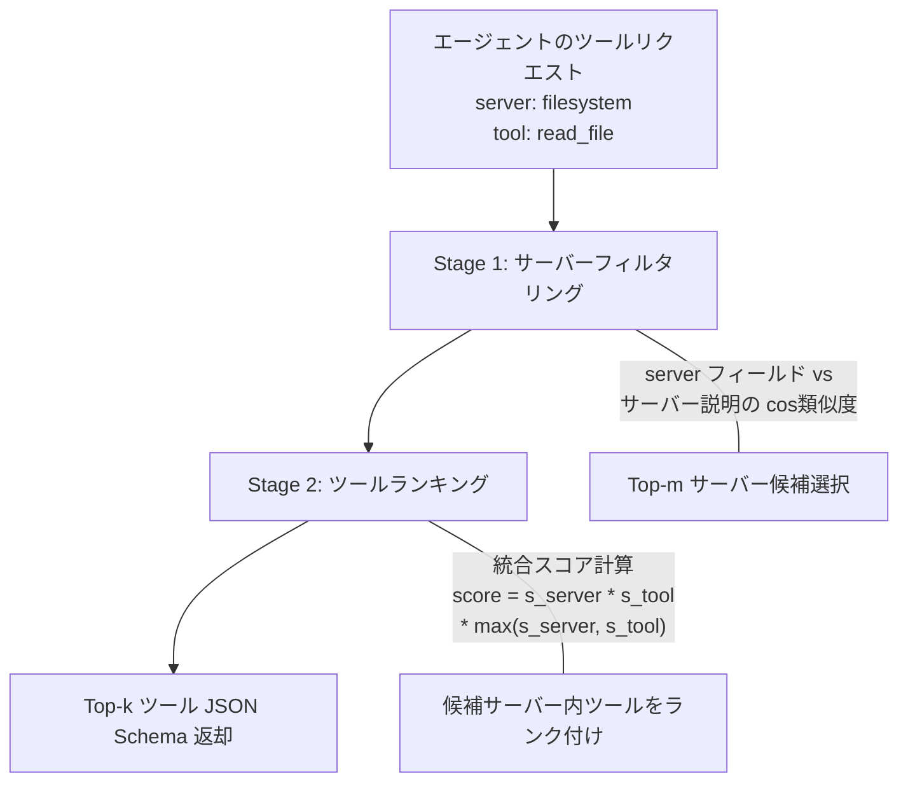

## 論文概要

本記事は [論文 MCP-Zero (arXiv:2506.01056)](https://arxiv.org/abs/2506.01056) の解説記事です。

MCP-Zero は、LLM エージェントにおけるツール選択の根本的な課題に取り組むフレームワークである。現在の主流設計では、利用可能なツールのスキーマをすべてコンテキストに事前注入し、モデルがその中から受動的に選択する。ツール数が増加するとコンテキスト長が爆発し、注意の希薄化（attention dilution）により選択精度が低下する。著者らは、エージェント自身が「能力ギャップを自律的に特定し、必要なツールをオンデマンドで要求する」能動的探索パラダイムを提案している。3つのメカニズム -- (1) 自律的ツールリクエスト生成、(2) 階層的意味ルーティング、(3) 反復的能力構築 -- により、APIBank ベンチマークで 98% のトークン削減を達成しつつ、約 3,000 ツール候補からの選択精度を維持したと報告されている。

この記事は [Zenn記事: MCPサーバー自作でトークン消費94%削減：ツール定義設計の実装パターン](https://zenn.dev/0h_n0/articles/81a560d7731697) の深掘りです。

## 情報源

| 項目 | 内容 |
|------|------|
| **タイトル** | MCP-Zero: Active Tool Discovery for Autonomous LLM Agents |
| **著者** | Xiang Fei, Xiawu Zheng, Hao Feng |
| **arXiv ID** | 2506.01056 |
| **URL** | [https://arxiv.org/abs/2506.01056](https://arxiv.org/abs/2506.01056) |
| **投稿日** | 2025年6月1日（v4: 2025年6月24日） |
| **分野** | cs.AI（人工知能）, cs.SE（ソフトウェア工学） |
| **コード** | [https://github.com/xfey/MCP-Zero](https://github.com/xfey/MCP-Zero) |

## Zenn記事との関連

Zenn記事「MCPサーバー自作でトークン消費94%削減」では、MCPツール定義がコンテキストに注入されることでトークンコストが膨張する問題を取り上げ、ツール定義の設計パターンによる削減手法を解説した。この問題に対し、MCP-Zero は「全スキーマの事前注入」というアーキテクチャ自体を転換し、**エージェントが必要なツールだけをオンデマンドで取得する**方式を提案している。Zenn記事が「定義をコンパクトにする」静的最適化であるのに対し、MCP-Zero は「そもそも不要な定義を注入しない」動的最適化を実現するアプローチである。両者は相補的であり、MCP-Zero でオンデマンド取得したツール定義に対して Zenn記事の設計パターンを適用すれば、さらなるトークン削減が見込める。

## 背景と動機

現在の LLM エージェントフレームワーク（LangChain, AutoGen 等）では、エージェントが利用可能なツールの JSON Schema を**すべてシステムプロンプトに注入する**設計が一般的である。ツール数が少ない場合は問題にならないが、MCP エコシステムの成長に伴いツール数が数百から数千に達すると、以下の問題が顕在化する。

第一に、**コンテキスト長の爆発**である。著者らが構築した MCP-Tools データセット（308 サーバー、2,797 ツール）では、全ツールスキーマの合計が 248.1k トークンに達する。GPT-4.1 の 128k コンテキストウィンドウでも収まりきらない規模である。第二に、**注意の希薄化**である。コンテキスト内にツール定義が大量に存在すると、モデルの注意が分散し、適切なツールの選択精度が低下する。著者らの実験では、Claude-3.5 の選択精度がドメイン限定（53ツール）の 97.60% から全ツール（2,797ツール）では 69.23% に低下した（APIBank, Table 2）。第三に、**スケーラビリティの欠如**である。MCP サーバーは日々増加しており、事前注入方式ではエコシステムの成長に追従できない。

既存のツール検索手法（Gorilla, ToolRerank, RAG-MCP 等）は、ユーザクエリを用いてツールを検索するアプローチを採用しているが、著者らはユーザクエリとツール説明の間の**意味的ギャップ**が検索精度を制限していると指摘している。ユーザの自然言語クエリはタスクレベルの記述であり、ツールのAPI仕様とは抽象度が異なるためである。

## 主要な貢献

著者らが報告している MCP-Zero の主要な貢献は以下のとおりである。

- **受動的選択から能動的探索へのパラダイム転換**: エージェントが事前定義されたツールリストから選択する従来方式を廃し、能力ギャップを自律的に特定してオンデマンドでツールを要求する設計を提案
- **階層的意味ルーティング**: サーバーレベル（粗粒度）とツールレベル（細粒度）の2段階マッチングにより、計算量を $O(n)$ から $O(m + k)$ に削減（$n$: 全ツール数、$m$: サーバー数、$k$: サーバー内ツール数）
- **MCP-Tools データセット**: 308 MCP サーバー、2,797 ツールからなるベンチマークデータセットの構築。公式 MCP リポジトリ（2025年4月28日時点）の 396 サーバーからフィルタリング
- **98% のトークン削減**: APIBank ベンチマークで全ツール注入時（6,308 トークン）に対し MCP-Zero（111 トークン）で 98.24% 削減。精度を維持しつつコンテキスト効率を大幅に改善
- **スケーラビリティの実証**: ツール数が 40 倍に増加しても選択精度を 90% 以上に維持

## 技術的詳細

### 自律的ツールリクエスト生成

MCP-Zero の中核となるメカニズムは、エージェント自身が構造化されたツールリクエストを生成する点にある。タスク実行中にエージェントが「現在の能力では解決できない」と判断した場合、以下の形式でリクエストを出力する。

```xml
<tool_assistant>
   server: filesystem  <!-- プラットフォーム/権限ドメイン -->
   tool: read_file     <!-- 操作タイプ + 対象 -->
</tool_assistant>
```

このリクエストは、ユーザのタスク記述よりもツールの仕様記述に近い語彙・抽象度で生成される。著者らは、この**意味的整合性**がツール検索の精度を向上させる要因であると分析している。Query-Only アプローチ（ユーザクエリでツールを直接検索）が APIBank で 65-72% の精度に留まるのに対し、モデル生成リクエストを用いた MCP-Zero は 90-96% の精度を達成している（論文 Table 2）。

システムプロンプトに以下のような指示を追加するだけで、既存のモデルで動作する。

```
If the current task cannot be solved with your own knowledge,
emit a <tool_assistant> block specifying the server domain
and the tool operation you require.
```

1つの ICL（In-Context Learning）例を追加することで、モデルが「filesystem_read」のような適切な粒度のリクエストを生成しやすくなると報告されている。

### 階層的意味ルーティング

ツールリクエストから実際のツールを特定するために、2段階の粗粒度-細粒度（coarse-to-fine）検索が行われる。エンべディングには OpenAI text-embedding-3-large が使用される。



**Stage 1: サーバーフィルタリング**

リクエストの `server` フィールドを、各 MCP サーバーの説明文（原文 + LLM生成の拡張サマリ）と照合し、コサイン類似度が高い上位 $m$ 件のサーバーを選択する。拡張サマリは Qwen2.5-72B-Instruct で事前生成されており、サーバーの機能を凝縮した記述を提供する。2つの類似度（原文との類似度、拡張サマリとの類似度）のうち高い方を採用する。

$$
s_{\text{server}} = \max\bigl(\cos(\mathbf{e}_{\text{req.server}},\; \mathbf{e}_{\text{desc}}),\;\cos(\mathbf{e}_{\text{req.server}},\; \mathbf{e}_{\text{summary}})\bigr)
$$

ここで、
- $\mathbf{e}_{\text{req.server}}$: リクエストの `server` フィールドの埋め込みベクトル
- $\mathbf{e}_{\text{desc}}$: サーバー原文説明の埋め込みベクトル
- $\mathbf{e}_{\text{summary}}$: LLM生成拡張サマリの埋め込みベクトル

**Stage 2: ツールランキング**

選択されたサーバー内のツールに対し、以下の統合スコアで順位付けする。

$$
\text{score} = (s_{\text{server}} \times s_{\text{tool}}) \times \max(s_{\text{server}},\; s_{\text{tool}})
$$

ここで、$s_{\text{tool}}$ はリクエストの `tool` フィールドとツール説明間のコサイン類似度である。この式は、サーバーレベルとツールレベルの**いずれか一方でも高い類似度があれば最終スコアに寄与する**設計となっている。実験では $k=1$（Top-1）で高い精度を達成している。

### 反復的能力構築

MCP-Zero はシングルラウンドの検索に限定されない。タスク実行中に取得したツールが不十分であれば、エージェントはリクエストを洗練（refine）して再検索を行う。著者らはこれを**自然な耐障害性と自己修正能力**と表現している。

情報理論的には、最適なツールリクエスト $r^*$ は相互情報量の最大化として定式化される。

$$
r^* = \arg\max_{r}\; I(T^*;\; r \mid s_t)
$$

ここで、$T^*$ は最適なツール、$s_t$ はタスクの現在の状態、$I(\cdot)$ は相互情報量である。$k$ 回の反復における累積情報利得は以下のとおりである。

$$
I_{\text{total}} = \sum_{i=1}^{k} I(T^*;\; r_i \mid s_{i-1}) - \lambda \cdot \text{Cost}(r_i)
$$

$\lambda$ はコスト正則化項であり、不要な検索ラウンドを抑制する。

### MCP-Tools データセットの構成

著者らは公式 MCP リポジトリ（2025年4月28日タグ）から 396 サーバーを収集し、以下のフィルタリングを適用して 308 サーバー、2,797 ツールのデータセットを構築した。

| 統計量 | 値 |
|--------|------|
| サーバー数 | 308 |
| ツール総数 | 2,797 |
| 平均ツール数/サーバー | 9.08 |
| 中央値ツール数/サーバー | 5.0 |
| 標準偏差 | 11.40 |
| 全スキーマ合計トークン | 248.1k |

分布は右に裾が長く、162 サーバーが 5 ツール以下である一方、専門的なサーバーは 60 以上のツールを持つ。

## 実装のポイント

MCP-Zero の実装は比較的軽量であり、既存のエージェントフレームワークへの統合が容易である。著者らが示す統合手順は以下の3ステップに集約される。

**Step 1: システムプロンプトの追加**。エージェントのシステムプロンプトに「現在の知識で解決できない場合は `<tool_assistant>` ブロックを出力せよ」という指示を追加する。1つの ICL 例を添えると、モデルが適切な粒度のリクエストを生成しやすくなる。

**Step 2: ツールインデックスの構築**。各 MCP サーバーのツール名、説明文、LLM生成の拡張サマリ、事前計算済みエンべディングを格納した軽量インデックスを構築する。エンべディングは OpenAI text-embedding-3-large で事前計算するため、リアルタイムのエンべディング生成は不要である。

**Step 3: ルーティングの実行**。エージェント出力に `<tool_assistant>` ブロックが検出された場合、Stage 1 でサーバー候補を絞り込み、Stage 2 でツールをランク付けし、Top-k の JSON Schema をエージェントに返却する。

```python
from typing import Any
import numpy as np

def hierarchical_route(
    request: dict[str, str],
    server_index: list[dict[str, Any]],
    top_m: int = 5,
    top_k: int = 1,
) -> list[dict[str, Any]]:
    """MCP-Zero の階層的意味ルーティング（簡略化実装）

    Args:
        request: {"server": "...", "tool": "..."} 形式のリクエスト
        server_index: サーバー情報とエンべディングのリスト
        top_m: Stage 1 で選択するサーバー数
        top_k: Stage 2 で返却するツール数

    Returns:
        Top-k ツールの JSON Schema リスト
    """
    req_server_emb = get_embedding(request["server"])
    req_tool_emb = get_embedding(request["tool"])

    # Stage 1: サーバーフィルタリング
    server_scores: list[tuple[float, dict[str, Any]]] = []
    for server in server_index:
        s_desc = cosine_sim(req_server_emb, server["desc_emb"])
        s_summary = cosine_sim(req_server_emb, server["summary_emb"])
        s_server = max(s_desc, s_summary)
        server_scores.append((s_server, server))
    server_scores.sort(key=lambda x: x[0], reverse=True)
    top_servers = server_scores[:top_m]

    # Stage 2: ツールランキング
    tool_scores: list[tuple[float, dict[str, Any]]] = []
    for s_server, server in top_servers:
        for tool in server["tools"]:
            s_tool = cosine_sim(req_tool_emb, tool["emb"])
            score = (s_server * s_tool) * max(s_server, s_tool)
            tool_scores.append((score, tool["schema"]))
    tool_scores.sort(key=lambda x: x[0], reverse=True)

    return [schema for _, schema in tool_scores[:top_k]]
```

注意すべき点として、エンべディングモデルの選択がルーティング精度に直接影響する。著者らは OpenAI text-embedding-3-large を使用しているが、コストやレイテンシの制約がある場合は、オンプレミスのエンべディングモデル（e5-large-v2 等）への置き換えを検討する必要がある。

## Production Deployment Guide

MCP-Zero をプロダクション環境にデプロイする場合、ツールインデックスの構築、エンべディング計算、ルーティング処理、エージェントとの統合を含むシステム全体を設計する必要がある。以下では AWS 上での実装パターンを示す。

### AWS実装パターン（コスト最適化重視）

MCP-Zero のコアは「エンべディング事前計算 + 類似度検索」であり、推論時のLLM呼び出しは不要（ツールリクエスト生成はエージェント側で行う）。このため、ルーティング部分は軽量なベクトル検索として実装できる。

| 構成 | トラフィック | 主要サービス | 月額概算 |
|------|------------|-------------|---------|
| **Small** | ~100 req/日 | Lambda + DynamoDB + S3 | $30-80 |
| **Medium** | ~1,000 req/日 | ECS Fargate + ElastiCache (Redis) + S3 | $250-600 |
| **Large** | 10,000+ req/日 | EKS + OpenSearch Serverless + S3 | $1,500-4,000 |

**Small構成**: Lambda でルーティングリクエストを処理。エンべディングベクトル（308サーバー x 2,797ツール）は S3 に格納し、Lambda 起動時に numpy 配列として読み込む。DynamoDB にツール JSON Schema を格納。コールドスタートを考慮し、Provisioned Concurrency を 1-2 に設定する。月額内訳: Lambda $5-15、DynamoDB On-Demand $10-30、S3 $1-5、CloudWatch $5-10。

**Medium構成**: ECS Fargate（0.5 vCPU, 1GB RAM）でルーティングサービスを常時稼働。エンべディングはメモリ上に保持し、ElastiCache (Redis) でキャッシュ層を追加。サーバー・ツールのメタデータ更新は EventBridge + Step Functions でバッチ処理。月額内訳: Fargate $80-150、ElastiCache $50-100、S3 $5-10、その他 $50-100。

**Large構成**: EKS + Karpenter で自動スケーリング。OpenSearch Serverless を k-NN ベクトル検索エンジンとして使用し、数万ツール規模にも対応。Spot Instances 優先で 60-70% のコスト削減。月額内訳: EKS コントロールプレーン $73、EC2 Spot $300-1,000、OpenSearch Serverless $500-1,500、その他 $200-500。

**コスト試算の注意事項**: 上記は2026年7月時点の AWS ap-northeast-1（東京）リージョン料金に基づく概算値である。実際のコストはトラフィックパターン、バースト使用量、リージョンにより変動する。最新料金は [AWS Pricing Calculator](https://calculator.aws/) で確認されたい。

### Terraformインフラコード

#### Small構成（Serverless）

```hcl
# MCP-Zero Routing Service - Small Configuration
# Lambda + DynamoDB + S3

terraform {
  required_version = ">= 1.9"
  required_providers {
    aws = {
      source  = "hashicorp/aws"
      version = "~> 5.60"
    }
  }
}

provider "aws" {
  region = "ap-northeast-1"
}

# --- S3: エンべディングベクトル格納 ---
resource "aws_s3_bucket" "embeddings" {
  bucket = "mcp-zero-embeddings-${data.aws_caller_identity.current.account_id}"
}

resource "aws_s3_bucket_server_side_encryption_configuration" "embeddings" {
  bucket = aws_s3_bucket.embeddings.id
  rule {
    apply_server_side_encryption_by_default {
      sse_algorithm = "aws:kms"
    }
  }
}

resource "aws_s3_bucket_public_access_block" "embeddings" {
  bucket                  = aws_s3_bucket.embeddings.id
  block_public_acls       = true
  block_public_policy     = true
  ignore_public_acls      = true
  restrict_public_buckets = true
}

# --- DynamoDB: ツール JSON Schema 格納 ---
resource "aws_dynamodb_table" "tool_schemas" {
  name         = "mcp-zero-tool-schemas"
  billing_mode = "PAY_PER_REQUEST"  # On-Demand でコスト最適化
  hash_key     = "server_id"
  range_key    = "tool_id"

  attribute {
    name = "server_id"
    type = "S"
  }
  attribute {
    name = "tool_id"
    type = "S"
  }

  server_side_encryption {
    enabled = true
  }

  point_in_time_recovery {
    enabled = true
  }
}

# --- IAM: Lambda 実行ロール（最小権限） ---
resource "aws_iam_role" "lambda_role" {
  name = "mcp-zero-routing-lambda"
  assume_role_policy = jsonencode({
    Version = "2012-10-17"
    Statement = [{
      Action = "sts:AssumeRole"
      Effect = "Allow"
      Principal = { Service = "lambda.amazonaws.com" }
    }]
  })
}

resource "aws_iam_role_policy" "lambda_policy" {
  name = "mcp-zero-lambda-access"
  role = aws_iam_role.lambda_role.id
  policy = jsonencode({
    Version = "2012-10-17"
    Statement = [
      {
        Effect   = "Allow"
        Action   = ["s3:GetObject"]
        Resource = "${aws_s3_bucket.embeddings.arn}/*"
      },
      {
        Effect   = "Allow"
        Action   = ["dynamodb:GetItem", "dynamodb:Query"]
        Resource = aws_dynamodb_table.tool_schemas.arn
      },
      {
        Effect   = "Allow"
        Action   = ["logs:CreateLogGroup", "logs:CreateLogStream", "logs:PutLogEvents"]
        Resource = "arn:aws:logs:*:*:*"
      }
    ]
  })
}

# --- Lambda: ルーティング関数 ---
resource "aws_lambda_function" "routing" {
  function_name = "mcp-zero-routing"
  runtime       = "python3.12"
  handler       = "handler.lambda_handler"
  role          = aws_iam_role.lambda_role.arn
  timeout       = 30
  memory_size   = 512  # エンべディング配列をメモリに展開

  filename         = "lambda_package.zip"
  source_code_hash = filebase64sha256("lambda_package.zip")

  environment {
    variables = {
      EMBEDDINGS_BUCKET = aws_s3_bucket.embeddings.id
      TOOL_TABLE_NAME   = aws_dynamodb_table.tool_schemas.name
      TOP_M_SERVERS     = "5"
      TOP_K_TOOLS       = "1"
    }
  }

  tracing_config {
    mode = "Active"  # X-Ray トレーシング有効化
  }
}

# --- CloudWatch アラーム: コスト監視 ---
resource "aws_cloudwatch_metric_alarm" "lambda_duration" {
  alarm_name          = "mcp-zero-lambda-high-duration"
  comparison_operator = "GreaterThanThreshold"
  evaluation_periods  = 3
  metric_name         = "Duration"
  namespace           = "AWS/Lambda"
  period              = 300
  statistic           = "p99"
  threshold           = 10000  # 10秒超過で警告
  alarm_actions       = []     # SNS ARN を設定

  dimensions = {
    FunctionName = aws_lambda_function.routing.function_name
  }
}

data "aws_caller_identity" "current" {}
```

#### Large構成（Container + ベクトル検索）

```hcl
# MCP-Zero Routing Service - Large Configuration
# EKS + Karpenter + OpenSearch Serverless

# --- EKS クラスタ ---
module "eks" {
  source  = "terraform-aws-modules/eks/aws"
  version = "~> 20.24"

  cluster_name    = "mcp-zero-routing"
  cluster_version = "1.31"

  vpc_id     = module.vpc.vpc_id
  subnet_ids = module.vpc.private_subnets

  cluster_endpoint_public_access = false  # プライベートアクセスのみ

  eks_managed_node_groups = {
    system = {
      instance_types = ["t3.medium"]
      min_size       = 1
      max_size       = 2
      desired_size   = 1
    }
  }
}

# --- Karpenter: Spot 優先の自動スケーリング ---
resource "kubectl_manifest" "karpenter_nodepool" {
  yaml_body = yamlencode({
    apiVersion = "karpenter.sh/v1"
    kind       = "NodePool"
    metadata   = { name = "mcp-zero-routing" }
    spec = {
      template = {
        spec = {
          requirements = [
            { key = "karpenter.sh/capacity-type", operator = "In", values = ["spot", "on-demand"] },
            { key = "node.kubernetes.io/instance-type", operator = "In",
              values = ["c6i.large", "c6a.large", "c7i.large"] },
          ]
          nodeClassRef = { name = "default" }
        }
      }
      limits   = { cpu = "32" }
      disruption = {
        consolidationPolicy = "WhenEmptyOrUnderutilized"
        consolidateAfter    = "30s"
      }
    }
  })
}

# --- OpenSearch Serverless: k-NN ベクトル検索 ---
resource "aws_opensearchserverless_collection" "tools" {
  name = "mcp-zero-tools"
  type = "VECTORSEARCH"
}

resource "aws_opensearchserverless_security_policy" "encryption" {
  name = "mcp-zero-encryption"
  type = "encryption"
  policy = jsonencode({
    Rules = [{ ResourceType = "collection", Resource = ["collection/mcp-zero-tools"] }]
    AWSOwnedKey = true
  })
}

# --- AWS Budgets: 予算アラート ---
resource "aws_budgets_budget" "monthly" {
  name         = "mcp-zero-monthly"
  budget_type  = "COST"
  limit_amount = "4000"
  limit_unit   = "USD"
  time_unit    = "MONTHLY"

  notification {
    comparison_operator       = "GREATER_THAN"
    threshold                 = 80
    threshold_type            = "PERCENTAGE"
    notification_type         = "ACTUAL"
    subscriber_email_addresses = ["ops@example.com"]
  }
}
```

### 運用・監視設定

**CloudWatch Logs Insights クエリ**: ルーティングのレイテンシとヒット率を分析する。

```
# ルーティングレイテンシ分析（P95, P99）
fields @timestamp, @message
| filter event = "routing_complete"
| stats
    avg(duration_ms) as avg_ms,
    percentile(duration_ms, 95) as p95_ms,
    percentile(duration_ms, 99) as p99_ms,
    count(*) as total_requests
  by bin(1h)
| sort @timestamp desc
```

```
# Top-1 ヒット率の監視
fields @timestamp, @message
| filter event = "tool_selected"
| stats
    sum(case when rank = 1 then 1 else 0 end) / count(*) * 100 as hit_rate_pct
  by bin(1d)
```

**CloudWatch アラーム設定（Python）**:

```python
import boto3

cloudwatch = boto3.client("cloudwatch", region_name="ap-northeast-1")

def create_routing_alarms() -> None:
    """MCP-Zero ルーティングの監視アラームを作成"""
    # ルーティングレイテンシ異常検知
    cloudwatch.put_metric_alarm(
        AlarmName="mcp-zero-routing-high-latency",
        MetricName="RoutingDuration",
        Namespace="MCPZero/Routing",
        Statistic="p99",
        Period=300,
        EvaluationPeriods=3,
        Threshold=500,  # 500ms 超過で警告
        ComparisonOperator="GreaterThanThreshold",
        AlarmActions=["arn:aws:sns:ap-northeast-1:ACCOUNT:ops-alerts"],
    )
    # ルーティング失敗率
    cloudwatch.put_metric_alarm(
        AlarmName="mcp-zero-routing-failure-rate",
        MetricName="RoutingFailures",
        Namespace="MCPZero/Routing",
        Statistic="Sum",
        Period=300,
        EvaluationPeriods=2,
        Threshold=10,
        ComparisonOperator="GreaterThanThreshold",
        AlarmActions=["arn:aws:sns:ap-northeast-1:ACCOUNT:ops-alerts"],
    )
```

**X-Ray トレーシング設定**:

```python
from aws_xray_sdk.core import xray_recorder, patch_all

patch_all()  # boto3, requests 等の自動計装

@xray_recorder.capture("route_tool_request")
def route_tool_request(request: dict[str, str]) -> dict:
    """ツールリクエストのルーティング（X-Ray 計装付き）"""
    subsegment = xray_recorder.current_subsegment()
    subsegment.put_annotation("server_field", request.get("server", ""))
    subsegment.put_annotation("tool_field", request.get("tool", ""))

    result = hierarchical_route(request, server_index)

    subsegment.put_metadata("selected_tools", result)
    subsegment.put_metadata("candidate_count", len(server_index))
    return result
```

**Cost Explorer 自動レポート（Python）**:

```python
import boto3
from datetime import date, timedelta

ce = boto3.client("ce", region_name="us-east-1")
sns = boto3.client("sns", region_name="ap-northeast-1")

def daily_cost_report() -> None:
    """MCP-Zero 関連の日次コストレポート"""
    end = date.today().isoformat()
    start = (date.today() - timedelta(days=1)).isoformat()

    response = ce.get_cost_and_usage(
        TimePeriod={"Start": start, "End": end},
        Granularity="DAILY",
        Metrics=["UnblendedCost"],
        Filter={
            "Tags": {
                "Key": "Project",
                "Values": ["mcp-zero"],
            }
        },
        GroupBy=[{"Type": "DIMENSION", "Key": "SERVICE"}],
    )

    total = sum(
        float(g["Metrics"]["UnblendedCost"]["Amount"])
        for r in response["ResultsByTime"]
        for g in r["Groups"]
    )
    if total > 100:
        sns.publish(
            TopicArn="arn:aws:sns:ap-northeast-1:ACCOUNT:cost-alerts",
            Subject=f"MCP-Zero daily cost alert: ${total:.2f}",
            Message=f"Daily cost exceeded $100 threshold: ${total:.2f}",
        )
```

### コスト最適化チェックリスト

**アーキテクチャ選択**:
- [ ] トラフィック ~100 req/日 → Serverless (Lambda + DynamoDB)
- [ ] トラフィック ~1,000 req/日 → Hybrid (ECS Fargate + ElastiCache)
- [ ] トラフィック 10,000+ req/日 → Container (EKS + OpenSearch Serverless)

**リソース最適化**:
- [ ] EC2/Fargate: Spot Instances 優先（最大 90% 削減）
- [ ] Reserved Instances: 1年コミットで最大 72% 削減
- [ ] Savings Plans: Compute Savings Plans 検討
- [ ] Lambda: メモリサイズ最適化（512MB でエンべディング配列を展開可能か検証）
- [ ] EKS: Karpenter の consolidationPolicy で未使用ノード自動削除

**ベクトル検索コスト削減**:
- [ ] エンべディング事前計算（ルーティング時の API 呼び出し不要）
- [ ] OpenSearch Serverless の OCU 最小化（2 OCU から開始）
- [ ] エンべディング次元削減（text-embedding-3-large の dimensions パラメータ活用）
- [ ] ルーティング結果のキャッシュ（同一リクエストパターンの再計算回避）

**監視・アラート**:
- [ ] AWS Budgets で月次予算上限設定
- [ ] CloudWatch アラームでレイテンシ・失敗率監視
- [ ] Cost Anomaly Detection 有効化
- [ ] 日次コストレポート（SNS 通知）

**リソース管理**:
- [ ] 未使用の OpenSearch コレクション削除
- [ ] タグ戦略: `Project=mcp-zero`, `Environment=prod/dev`
- [ ] S3 ライフサイクルポリシー（古いエンべディングバージョンの自動削除）
- [ ] 開発環境の夜間・休日停止（ECS/EKS）
- [ ] Lambda Provisioned Concurrency の時間帯別設定

## 実験結果

### APIBank ベンチマークでの性能

著者らは APIBank ベンチマークを用いて、MCP-Zero と従来の全ツール注入方式（Standard）を比較している（論文 Table 2）。評価は Claude-3.5、GPT-4.1、Gemini-2.5 の3モデルで実施された。

**コンテキスト効率**: MCP-Zero はプロンプト長を 60-98% 削減している。Full Single-turn 設定では 6,308 トークンから 111 トークンへの 98.24% 削減、Full Multi-turn 設定では 6,402 トークンから 159 トークンへの 97.52% 削減を達成した。

| 設定 | 方式 | Claude-3.5 | GPT-4.1 | Gemini-2.5 |
|------|------|-----------|---------|-----------|
| Single-turn Domain | Standard | 97.60% | 98.08% | 92.79% |
| Single-turn Domain | MCP-Zero | 96.15% | 96.62% | 97.12% |
| Single-turn Full | Standard | 69.23% | 94.71% | 94.23% |
| Single-turn Full | **MCP-Zero** | **95.19%** | **95.19%** | **96.63%** |
| Multi-turn Domain | Standard | 100.00% | 99.46% | 91.40% |
| Multi-turn Domain | MCP-Zero | 91.40% | 93.01% | 93.01% |
| Multi-turn Full | Standard | 60.22% | 93.01% | 92.47% |
| Multi-turn Full | **MCP-Zero** | **90.32%** | **92.47%** | **94.62%** |

注目すべきは、ツール数を Domain（約 53 ツール）から Full（約 2,797 ツール）に 40 倍拡大した際の精度変化である。Standard 方式の Claude-3.5 は Single-turn で 97.60% → 69.23%、Multi-turn で 100% → 60.22% と大幅に低下した。一方、MCP-Zero は Single-turn で 96.15% → 95.19%、Multi-turn で 91.40% → 90.32% と精度をほぼ維持している。

### Query-Only との比較

ユーザクエリを直接用いたツール検索（Query-Only）は 65-72% の精度に留まっている。モデルが生成する構造化リクエストがツール説明との意味的整合性において優れていることが示されている。

## 実運用への応用

MCP-Zero の設計は、以下のプロダクションシナリオで有用である。

**IDE統合エージェント**: VSCode や JetBrains 等の IDE プラグインとして動作するコーディングエージェントでは、ファイルシステム操作、Git 操作、デバッガ、テストランナー等の多数のツールが利用可能である。MCP-Zero により、タスクに応じて必要なツールだけを動的に取得できる。例えば「src/train.py をデバッグ」というタスクに対し、ファイル読み取り→コード解析→修正→検証の各段階で異なるドメインのツールを段階的にリクエストする。

**マルチテナント SaaS**: 顧客ごとに利用可能な MCP サーバーが異なる環境では、全顧客のツールを事前注入することは現実的でない。MCP-Zero のオンデマンド方式なら、エージェントが必要に応じてテナント固有のツールを取得できる。

**エッジデバイス**: コンテキストウィンドウが限られたオンデバイスモデル（Phi-3-mini 等）では、98% のトークン削減が動作可能性の分かれ目となる。6,000 トークンのツール定義を 100 トークンに圧縮できれば、限られたコンテキスト内でツール利用が可能になる。

**制約と課題**: MCP-Zero の評価は主に APIBank と MCP-Tools データセットに限定されている。また、エンべディングベースの意味的マッチングはテキスト情報のみを利用しており、コード例やスキーマ構造といったマルチモーダルな情報は活用されていない。

## 関連研究

- **Gorilla** (Patil et al., 2023): LLM を API ドキュメントで fine-tune し、1,600 以上の API を正確に呼び出す手法。MCP-Zero が学習不要の検索ベース手法であるのに対し、Gorilla はモデルの内在的能力を向上させるアプローチである
- **ToolRerank** (Li et al., 2024): 適応的かつ階層的なリランキングにより、シングルツール・マルチツールクエリそれぞれに最適な検索結果を提供する。MCP-Zero の Stage 2 に相当する処理を独立したリランキングモジュールとして実現している
- **RAG-MCP** (fintools-ai, 2025): MCP メタデータのベクトルインデックスを構築し、RAG 原則でツール選択を行うライブラリ。ユーザクエリで直接検索する点で MCP-Zero の「エージェント生成リクエスト」方式とは異なる
- **AnyTool** / **Re-Invoke**: ツール検索の一般化を目指す関連研究。MCP-Zero は MCP プロトコル固有のサーバー-ツール階層を活用する点で差別化されている

## まとめと今後の展望

MCP-Zero は、LLM エージェントのツール利用を「受動的選択」から「能動的探索」へ転換するフレームワークである。3つのメカニズム（自律的リクエスト生成、階層的ルーティング、反復的能力構築）により、98% のトークン削減とスケーラブルなツール選択を実現したと著者らは報告している。

今後の研究方向として、著者らはコード例や使用パターンを含む**マルチモーダルなツール記述**の活用、ツールの共起パターン分析による**コンテキスト理解の強化**、MCP-Zero 自体を専用の「メタサーバー」としてパッケージ化する構想、**マルチエージェント協調**でのツール共有などを挙げている。

## 参考文献

- **arXiv**: [https://arxiv.org/abs/2506.01056](https://arxiv.org/abs/2506.01056)
- **GitHub**: [https://github.com/xfey/MCP-Zero](https://github.com/xfey/MCP-Zero)
- **Related Zenn article**: [https://zenn.dev/0h_n0/articles/81a560d7731697](https://zenn.dev/0h_n0/articles/81a560d7731697)
- **Gorilla**: [https://arxiv.org/abs/2305.15334](https://arxiv.org/abs/2305.15334)
- **ToolRerank**: [https://arxiv.org/abs/2403.06551](https://arxiv.org/abs/2403.06551)
- **MCP Specification**: [https://modelcontextprotocol.io/](https://modelcontextprotocol.io/)
