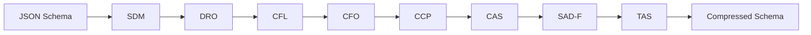

## 論文概要

本記事は [論文 Tool-Schema Compression (arXiv:2605.26165)](https://arxiv.org/abs/2605.26165) の解説記事です。

エージェンティックRAGシステムでは、ツール定義（JSONスキーマ）と検索拡張生成（RAG）のリトリーバルチャンクが同一のコンテキストウィンドウを奪い合う。著者のFurkan Sakizliは、14モデル（1.5B-32Bのローカルモデル + Claude Sonnet 4）を3つのコンテキスト予算（8K, 16K, 32K）で6,566回のAPIコールにより体系的に評価した。TSCG（Tool-Schema Compression Generator）のconservative-profileを適用すると、スキーマトークンが44-50%削減され、8K環境でExact Match（EM）が平均+20.5ppの改善を示した。スケーラビリティ評価ではJSONスキーマが約494ツールでオーバーフローするのに対し、圧縮スキーマは800ツール超でも機能することが実証されている。

この記事は [Zenn記事: MCPサーバー自作でトークン消費94%削減：ツール定義設計の実装パターン](https://zenn.dev/0h_n0/articles/81a560d7731697) の深掘りです。

## Zenn記事との関連

Zenn記事ではMCPサーバーのツール定義が毎リクエストでコンテキストに注入されるコスト構造を解説し、設計パターンによるトークン削減を実践的に示した。本論文はこの問題を学術的に定式化し、「ツール定義がRAGのリトリーバルコンテキストと有限ウィンドウを競合する」という構造的課題を14モデルで初めて定量評価した研究である。Zenn記事の94%削減という実装成果と、本論文の44-50%削減（conservative-profile）という制御された実験結果を対比することで、ツールスキーマ最適化の理論的裏付けと実践的指針の両面を理解できる。

## 情報源

- **arXiv ID**: 2605.26165
- **URL**: [arXiv:2605.26165](https://arxiv.org/abs/2605.26165)
- **著者**: Furkan Sakizli
- **投稿日**: 2026年5月24日
- **分野**: Software Engineering (cs.SE), Artificial Intelligence (cs.AI), Computation and Language (cs.CL)
- **コード**: [https://github.com/SKZL-AI/tscg](https://github.com/SKZL-AI/tscg)（MIT License）

## 背景と動機

LLMエージェントがツールを呼び出す際、ツール定義はJSONスキーマとしてシステムプロンプトに含められる。28個のツール定義を標準的なJSONスキーマで記述すると約11,000トークンを消費する。一方、RAGシステムのリトリーバルチャンクは1チャンクあたり平均350トークンを必要とする。

8Kトークンのコンテキスト予算では、システムプロンプト（350トークン）、会話履歴（1,500トークン）、出力生成（512トークン）を差し引くと、ツール定義とRAGチャンクに割り当て可能な残余予算は約5,600トークンとなる。JSONスキーマの11,000トークンはこの予算を大幅に超過し、RAGチャンクを1つも配置できない状態（コンテキストオーバーフロー）が発生する。

この問題はモデルサイズの拡大やコンテキストウィンドウの拡張だけでは根本的に解決されない。エッジデバイスやコスト制約のある環境では、小さいコンテキスト予算で多数のツールとRAGを同時運用する必要がある。著者はこの「ツール定義 vs RAGコンテキスト」の競合を体系的に分析した初の研究として本論文を位置づけている。

## 主要な貢献

1. **初の体系的評価**: ツールスキーマ形式がAgentic RAG精度に与える影響を、14モデル・3コンテキスト予算・6,566 APIコールで制御実験。従来研究では未検証の問題領域
2. **バイナリ有効化効果の発見**: 8Kトークンでは非圧縮スキーマがEM 2.6%（実質的な完全失敗）であるのに対し、圧縮版はEM 23.1%に回復。この効果は「精度向上」ではなく「機能そのものの有効化」である
3. **スケーラビリティ実証**: フロンティアモデル（Claude Sonnet 4, 200Kコンテキスト）でもJSONスキーマは約494ツールでオーバーフローするが、圧縮スキーマは803ツールまで機能（63%のレンジ拡張）
4. **外部データセットでの検証**: HotpotQAで+48pp EMの改善を確認し、ベンチマーク固有の効果でないことを実証
5. **再現性の担保**: コード、データ、チェックポイントをCC BY 4.0で公開

## 技術的詳細

### コンテキスト予算モデル

著者は以下の数式でコンテキスト配分を定式化している。

$$
B_{\text{RAG}} = B - B_{\text{sys}} - B_{\text{schema}}(f, n) - B_{\text{hist}} - B_{\text{out}}
$$

ここで、$B$ は総コンテキスト予算、$B_{\text{sys}}$ はシステムプロンプト（約350トークン）、$B_{\text{schema}}(f, n)$ はスキーマ形式 $f$ と ツール数 $n$ に依存するスキーマコスト、$B_{\text{hist}}$ は会話履歴（1,500トークン）、$B_{\text{out}}$ は出力予約（512トークン）である。$B_{\text{RAG}} > 0$ のとき、$k = \lfloor B_{\text{RAG}} / 350 \rfloor$ 個のリトリーバルチャンクを配置できる。

28ツールの場合、各予算でのチャンク配置数は以下のとおりである。

| 予算 | JSON $B_{\text{schema}}$ | TSCG $B_{\text{schema}}$ | JSON $k$ | TSCG $k$ |
|------|-------------------------|-------------------------|-----------|-----------|
| 8K | 11,295 | 5,670 | 0 (overflow) | 1 |
| 16K | 11,295 | 5,670 | 9 | 26 |
| 32K | 11,295 | 5,670 | 55+ | 55+ |

### TSCG conservative-profileの圧縮手法

TSCGは8つの決定論的変換オペレータを順次適用する規則ベースの圧縮エンジンである。conservative-profileでは説明文を保持しつつスキーマの冗長性を除去する。



主要なオペレータの役割は以下のとおりである。

| オペレータ | 正式名称 | 機能 |
|-----------|---------|------|
| SDM | Semantic Density Maximization | 104以上のフィラーパターン（"This field is used for..."等）を除去 |
| DRO | Delimiter-Role Optimization | 冗長な区切り文字を圧縮し、トークン効率を向上 |
| CFL | Constraint-First Layout | パラメータ制約をスキーマ先頭に配置し、アテンションシンクを活用 |
| TAS | Tokenizer-Aligned Syntax | BPE境界に最適化した構文を生成し、トークン化効率を改善 |

conservative-profileは1ツールあたり平均393トークンを197トークンに圧縮する（約50%削減）。型情報、パラメータ名、列挙値、説明文はすべて保持されるため、モデルのツール理解精度に影響を与えない設計となっている。

### Exact Match (EM) メトリクス

EMは「モデルの最終回答が正規化後にゴールドアンサーまたはそのエイリアスと完全一致するか」を判定するバイナリ指標（0 or 1）である。補助指標としてToken F1（トークンレベルの適合率と再現率の調和平均）も報告されている。統計検定にはWilcoxon符号付き順位検定（非パラメトリック）を使用し、効果量はCohen's dで算出、95%信頼区間は10,000回のブートストラップ（seed=42）で構成されている。

### コンテキスト利用の飽和モデル

著者は4,700データポイントからコンテキスト利用率 $C(k)$ を以下のように回帰している。

$$
C(k) = C_{\max}(1 - e^{-\lambda k}) + C_0
$$

フィッティングの結果、$C_{\max} = 0.18$, $\lambda = 25.9$, $C_0 = 0.095$ ($R^2 = 0.011$) となった。$\lambda$ の高い値はほぼステップ関数的な振る舞いを示し、最初の1チャンクが最大の限界利得をもたらすことを意味する。$k = 0 \to 1$ の遷移（つまりRAGチャンクが0個から1個に増えること）が精度改善の主要因であり、これが8Kでの圧縮効果を説明する。

## 実装のポイント

TSCGはnpmパッケージとして公開されており、導入は容易である。

```typescript
import { compress } from '@tscg/core';

// ツール定義の配列を圧縮
const result = compress(tools, {
  model: 'claude-sonnet',  // トークナイザ最適化のターゲットモデル
  profile: 'conservative',  // 説明文保持、50%削減
});

console.log(result.metrics.tokens.savingsPercent);
// => 49.8
console.log(result.compressionTimeMs);
// => 2.4 (50ツール時)
```

MCPプロキシとしての利用も可能で、既存のMCPサーバーを透過的に圧縮できる。

```bash
npx @tscg/mcp-proxy \
  --target=claude-sonnet \
  --profile=conservative \
  --server="node my-mcp-server.js"
```

LangChainやVercel AI SDKとの統合も提供されている。

```typescript
// LangChain統合
import { withTSCG } from '@tscg/tool-optimizer/langchain';
const optimizedAgent = withTSCG(agent);

// Vercel AI SDK統合
import { tscgMiddleware } from '@tscg/tool-optimizer/vercel';
```

論文で使用された評価環境は2x RTX 5070 Ti（Ollama経由）と$107のAPIコストで構成されており、合計約10時間のGPU時間で6,566コールを完了している。

## Production Deployment Guide

ここではツールスキーマ圧縮をAgentic RAGパイプラインに組み込むAWSインフラ設計パターンを示す。

### AWS実装パターン（MCP + RAG統合環境）

**トラフィック量別の推奨構成**:

| 構成 | トラフィック | アーキテクチャ | 月額概算 |
|------|-------------|---------------|---------|
| Small | ~100 req/日 | Lambda + Bedrock + S3 + TSCG Layer | $80-200 |
| Medium | ~1,000 req/日 | ECS Fargate + Bedrock + OpenSearch Serverless | $500-1,200 |
| Large | 10,000+ req/日 | EKS + vLLM (Self-hosted) + OpenSearch + TSCG Sidecar | $3,000-8,000 |

> **注意**: 上記は2026年7月時点のAWS ap-northeast-1（東京）リージョン料金に基づく概算値です。実際のコストはトラフィックパターン、モデル選択、リージョンにより変動します。最新料金は [AWS料金計算ツール](https://calculator.aws/) で確認してください。

**Small構成の詳細**:
- Lambda関数でMCPサーバーを実行し、TSCGをLambda Layerとして組み込み
- Bedrock（Claude Sonnet）でツール呼び出し + RAG生成を処理
- S3にRAGドキュメントを保存、Bedrock Knowledge Baseで検索
- 8Kコンテキスト制約下でもTSCG圧縮によりRAGチャンク配置を確保
- 月額内訳: Lambda $10 + Bedrock $50-150 + S3 $5 + Knowledge Base $15

**Large構成の詳細**:
- EKS上でvLLM（Phi-4 14B/Mistral-Small 24B）をセルフホスト
- TSCGをサイドカーコンテナとして各Pod内に配置、スキーマ圧縮をリアルタイム実行
- OpenSearch Serviceでベクトル検索（RAGリトリーバル）
- 8K-16Kコンテキストのローカルモデルでもツール数28以上を運用可能
- 月額内訳: EKS $73 + EC2 g6.2xlarge x2 $2,400 + OpenSearch $300 + ALB $30

**コスト削減テクニック**:
- TSCG圧縮によりBedrock APIのinputトークンを44-50%削減 → API課金を直接削減
- Spot Instances活用でGPUインスタンスコストを最大70%削減
- コンテキスト予算の縮小により、より小型のモデル（8B-14B）でも機能維持 → GPU要件を大幅に引き下げ

### Terraformインフラコード

**Medium構成（ECS Fargate + Bedrock + TSCG）** の主要部分を示す。

```hcl
# medium_agentic_rag.tf -- Agentic RAG with TSCG on ECS Fargate

module "vpc" {
  source  = "terraform-aws-modules/vpc/aws"
  version = "~> 5.16"
  name    = "agentic-rag-vpc"
  cidr    = "10.0.0.0/16"

  azs             = ["ap-northeast-1a", "ap-northeast-1c"]
  private_subnets = ["10.0.1.0/24", "10.0.2.0/24"]
  public_subnets  = ["10.0.101.0/24", "10.0.102.0/24"]

  enable_nat_gateway   = true
  single_nat_gateway   = true  # コスト削減: 本番では冗長NAT推奨
  enable_dns_hostnames = true
}

resource "aws_ecs_cluster" "rag" {
  name = "agentic-rag-cluster"

  setting {
    name  = "containerInsights"
    value = "enabled"
  }
}

resource "aws_ecs_task_definition" "mcp_agent" {
  family                   = "mcp-agent-tscg"
  requires_compatibilities = ["FARGATE"]
  network_mode             = "awsvpc"
  cpu                      = 1024
  memory                   = 2048

  container_definitions = jsonencode([
    {
      name  = "mcp-agent"
      image = "${aws_ecr_repository.mcp_agent.repository_url}:latest"
      portMappings = [{ containerPort = 8080, protocol = "tcp" }]
      environment = [
        { name = "TSCG_PROFILE", value = "conservative" },
        { name = "TSCG_MODEL_TARGET", value = "claude-sonnet" },
        { name = "CONTEXT_BUDGET", value = "16384" },
        { name = "RAG_CHUNK_SIZE", value = "350" },
      ]
      logConfiguration = {
        logDriver = "awslogs"
        options = {
          "awslogs-group"         = "/ecs/mcp-agent-tscg"
          "awslogs-region"        = "ap-northeast-1"
          "awslogs-stream-prefix" = "mcp"
        }
      }
    }
  ])

  tags = { Project = "agentic-rag", Component = "mcp-tscg" }
}

resource "aws_ecs_service" "mcp_agent" {
  name            = "mcp-agent-service"
  cluster         = aws_ecs_cluster.rag.id
  task_definition = aws_ecs_task_definition.mcp_agent.arn
  desired_count   = 2
  launch_type     = "FARGATE"

  network_configuration {
    subnets         = module.vpc.private_subnets
    security_groups = [aws_security_group.ecs.id]
  }

  load_balancer {
    target_group_arn = aws_lb_target_group.mcp.arn
    container_name   = "mcp-agent"
    container_port   = 8080
  }
}

# AWS Budgets（月額アラート）
resource "aws_budgets_budget" "rag_monthly" {
  name         = "agentic-rag-monthly"
  budget_type  = "COST"
  limit_amount = "800"
  limit_unit   = "USD"
  time_unit    = "MONTHLY"

  notification {
    comparison_operator        = "GREATER_THAN"
    threshold                  = 80
    threshold_type             = "PERCENTAGE"
    notification_type          = "ACTUAL"
    subscriber_email_addresses = ["ops-team@example.com"]
  }
}
```

### 運用・監視設定

**CloudWatch Logs Insights -- スキーマ圧縮効果の監視**:

```
fields @timestamp, @message
| filter @message like /tscg_compression/
| stats avg(schema_tokens_before) as avg_before,
        avg(schema_tokens_after) as avg_after,
        avg(savings_percent) as avg_savings,
        avg(rag_chunks_placed) as avg_chunks
  by bin(1h)
| sort @timestamp desc
```

**X-Rayトレーシング + TSCG圧縮の計装（Python）**:

```python
from aws_xray_sdk.core import xray_recorder, patch_all
import json

patch_all()


@xray_recorder.capture("tscg_compress_and_invoke")
def compress_and_invoke(
    tools: list[dict],
    query: str,
    context_budget: int = 16384,
) -> dict:
    """TSCGでツールスキーマを圧縮し、Bedrockを呼び出す。

    Args:
        tools: ツール定義のリスト（JSON Schema形式）
        query: ユーザークエリ
        context_budget: コンテキスト予算（トークン数）

    Returns:
        Bedrockのレスポンス
    """
    subsegment = xray_recorder.current_subsegment()

    # スキーマ圧縮メトリクスを記録
    original_tokens = sum(len(json.dumps(t).split()) for t in tools)
    subsegment.put_annotation("tool_count", len(tools))
    subsegment.put_annotation("context_budget", context_budget)
    subsegment.put_metadata("original_schema_tokens", original_tokens)

    # TSCG圧縮（実際のTSCG呼び出しに置き換え）
    compressed = compress_schemas(tools, profile="conservative")
    compressed_tokens = compressed["metrics"]["tokens"]["after"]
    savings = compressed["metrics"]["tokens"]["savingsPercent"]

    subsegment.put_metadata("compressed_tokens", compressed_tokens)
    subsegment.put_metadata("savings_percent", savings)

    # RAGチャンク配置可能数を計算
    remaining = context_budget - 350 - compressed_tokens - 1500 - 512
    chunks_available = max(0, remaining // 350)
    subsegment.put_annotation("rag_chunks_available", chunks_available)

    return invoke_bedrock(compressed["schemas"], query, chunks_available)
```

Container Insightsを有効化し、ECSタスクのCPU 80%超・メモリ85%超でSNS通知するCloudWatchアラームを設定する。TSCG圧縮処理は50ツールで2.4msと軽量だが、ツール数が100を超える場合はレイテンシ監視を追加する。Cost Explorer APIで`Project=agentic-rag`タグの日次コストを集計し、Bedrock APIコストの推移をトラッキングする構成を推奨する。

### コスト最適化チェックリスト

**アーキテクチャ選択**:
- [ ] トラフィック量を計測しSmall/Medium/Large構成を判断済み
- [ ] コンテキスト予算（8K/16K/32K）を検証し、TSCG圧縮の効果を試算済み
- [ ] Bedrockモデル vs セルフホストモデルのコスト比較を完了

**トークンコスト削減**:
- [ ] TSCGプロファイル（conservative/balanced/aggressive）をワークロードに応じて選択
- [ ] conservative-profileで44-50%のスキーマトークン削減を確認
- [ ] Bedrock inputトークン課金の削減額を月次で算出
- [ ] 不要なツール定義を事前にフィルタリング（ルーティング層で必要ツールのみ注入）

**リソース最適化**:
- [ ] ECS Fargate Spot活用で最大70%コスト削減
- [ ] セルフホスト時はEC2 Spot Instances + Karpenter
- [ ] Lambda Power Tuningでメモリサイズ最適化（Small構成）
- [ ] コンテキスト予算の縮小により小型モデルへの移行可能性を検討

**監視・アラート**:
- [ ] AWS Budgets月額アラート設定済み
- [ ] Container InsightsでECSタスクのリソース監視
- [ ] TSCG圧縮率のCloudWatchカスタムメトリクス
- [ ] RAGチャンク配置数の推移モニタリング
- [ ] Cost Anomaly Detection有効化

**リソース管理**:
- [ ] Projectタグによるコスト配分（agentic-rag）
- [ ] 開発環境の夜間スケールダウン
- [ ] Terraform Stateの定期バックアップ
- [ ] ECRイメージのライフサイクルポリシー

## 実験結果

### 8Kコンテキストでのバイナリ有効化効果

8Kトークンでは、JSONスキーマがコンテキストを完全にオーバーフローさせるため、RAGチャンクを1つも配置できない。著者らは以下の結果を報告している。

| モデル | Tier | JSON EM | TSCG EM | 改善幅 | p値 |
|--------|------|---------|---------|--------|-----|
| Llama 3.1:8B | A | 1% | 34% | +33pp | p<0.01 |
| Phi-4 14B | A | 2% | 33% | +31pp | p<0.01 |
| Mistral-Small 24B | B | 4% | 33% | +29pp | p<0.01 |
| Claude Sonnet 4 | API | 10% | 36% | +26pp | p<0.01 |
| Qwen2.5-Coder 32B | B | 3% | 18% | +15pp | p<0.01 |
| Gemma3:12B | A | 1% | 15% | +14pp | p<0.01 |
| Qwen3:14B | A | 0% | 12% | +12pp | p<0.01 |
| Gemma4:26B | B | 0% | 4% | +4pp | ns |
| **平均** | - | **2.6%** | **23.1%** | **+20.5pp** | - |

### 16K・32Kコンテキストでの結果

16Kでは両形式がオーバーフローせずに収まるため、EM差は中央値-1pp（範囲: -8 to +2pp）にとどまった。TSCGは26チャンク（JSON: 9チャンク）を配置できるが、著者らはこれを「チャンク解放の飽和」と表現している。32KではほとんどのモデルでEM差が1pp以内に収まり、圧縮効果がコンテキスト予算に依存することが確認された。

### フロンティアモデルのスケーラビリティ

Claude Sonnet 4（200Kコンテキスト）で500ツール以上をテストした結果、JSONスキーマは約494ツールでオーバーフローしEM 0%に低下する一方、TSCGは800ツールでEM 100%を維持した。

### HotpotQA外部検証

Phi-4 14Bを用いた8Kコンテキストでの検証で、JSONスキーマはEM 0%、TSCGはEM 48%（+48pp）を達成した。NovaTech-28での+31ppを上回る改善はHotpotQAのゴールドパッセージが短い（150-250トークン）ことに起因すると著者らは分析している。

## 実運用への応用

本論文の結果は以下の実務シナリオに直接適用可能である。

**エッジデバイス・コスト制約環境**: 8Bパラメータクラスのモデルを8Kコンテキストで運用する場合でも、TSCG圧縮によりRAG機能を維持できる。Phi-4 14BでEM 33%を達成した結果は、ローカルLLMでのエージェント構築が実用水準に達しうることを示している。

**大規模ツールカタログの管理**: MCPサーバー群を統合すると数百のツール定義が発生し得るが、圧縮なしではフロンティアモデル（200K）でも494ツールが上限となる。TSCGの適用により800ツール超の運用が可能となり、ツールカタログの分割やルーティング層の複雑性を低減できる。

**APIコスト最適化**: Bedrock等の従量課金モデルでは、inputトークン数がコストに直結する。28ツールで5,625トークンの削減は、1日1,000コール・月30,000コールで年間数百ドルのコスト削減に相当し得る。ツール数が多い環境ほど効果は拡大する。

**Distractor Dilution（妨害希釈）への注意**: 著者らは小型モデル（8B以下）でリトリーバルチャンクを増やすとEMが低下する現象を報告しており（Qwen3:4Bで-8pp）、チャンク数の増加が常に精度向上につながるわけではないことに留意が必要である。

## 関連研究

ツールスキーマ圧縮の研究は、プロンプト圧縮（Jiang et al., 2023のLLMLingua）、APIツール呼び出しのスケーリング（Patil et al., 2024のGorilla）、RAGの基盤研究（Lewis et al., 2020）の交差点に位置する。コンテキスト内の情報配置については「Lost in the Middle」現象（Liu et al., 2024）が知られており、TSCGのCFL（Constraint-First Layout）オペレータはこの知見を活用している。本論文はこれらの個別研究を統合し、「ツール定義がRAGコンテキストを圧迫する」という具体的なシナリオで初めて定量評価を行った点に独自性がある。HotpotQA（Yang et al., 2018）を外部検証データセットとして使用し、ベンチマーク固有のバイアスの排除も試みている。

## まとめと今後の展望

本論文は、ツール定義とRAGコンテキストの競合がAgentic RAGシステムの性能を根本的に制約することを6,566コールの制御実験で実証した。TSCG conservative-profileの適用は8Kトークン環境でEM +20.5ppの改善をもたらし、これは「精度向上」ではなく「機能の有効化」として位置づけられる。

ただし、論文にはいくつかの制約がある。評価ベンチマーク（NovaTech-28）は合成データセットであり、実環境の多様性を完全には反映していない。Tier Cモデル（7B以下）は16Kでのみテストされ、8Kでの挙動は未検証である。フロンティアスケーリングはClaude Sonnet 4のみで検証されており、他のフロンティアモデルでの再現性は今後の課題である。動的なコンテキスト配分（ツール数やクエリに応じた適応的予算割り当て）も未探索の研究方向として著者自身が言及している。

## 参考文献

- Sakizli, F. (2026). Tool-Schema Compression Enables Agentic RAG Under Constrained Context Budgets. arXiv:2605.26165
- Lewis, P. et al. (2020). Retrieval-Augmented Generation for Knowledge-Intensive NLP Tasks. NeurIPS 2020
- Jiang, Z. et al. (2023). LLMLingua: Compressing Prompts for Accelerated Inference of Large Language Models. EMNLP 2023
- Patil, S. et al. (2024). Gorilla: Large Language Model Connected with Massive APIs. arXiv:2305.15334
- Liu, N. et al. (2024). Lost in the Middle: How Language Models Use Long Contexts. TACL
- Yang, Z. et al. (2018). HotpotQA: A Dataset for Diverse, Explainable Multi-hop Question Answering. EMNLP 2018
- TSCG GitHub Repository: [https://github.com/SKZL-AI/tscg](https://github.com/SKZL-AI/tscg)
