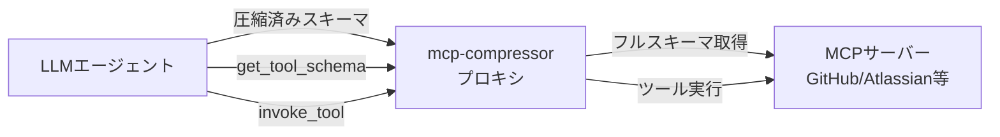
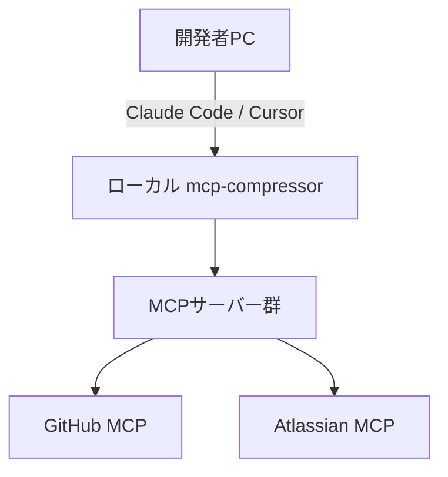
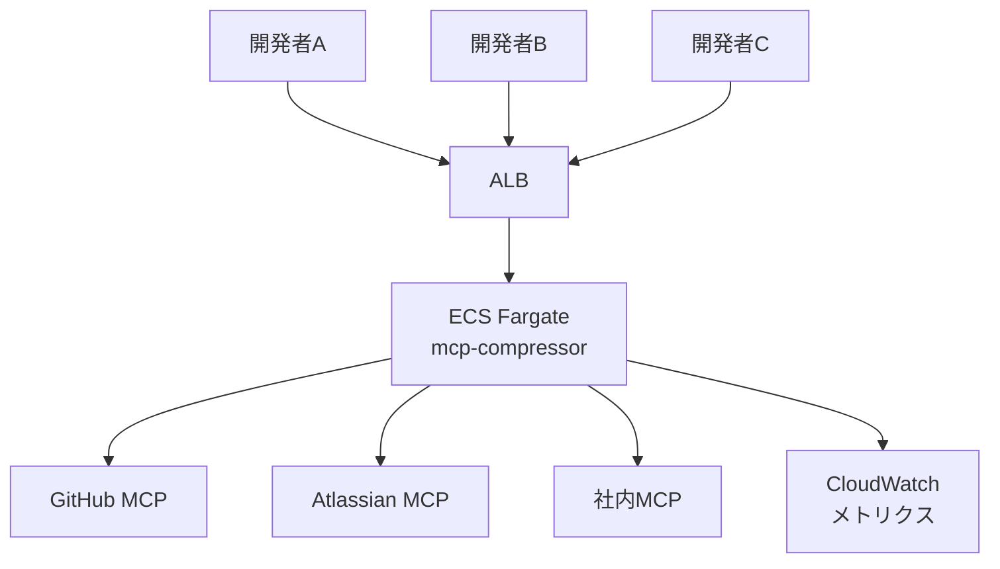
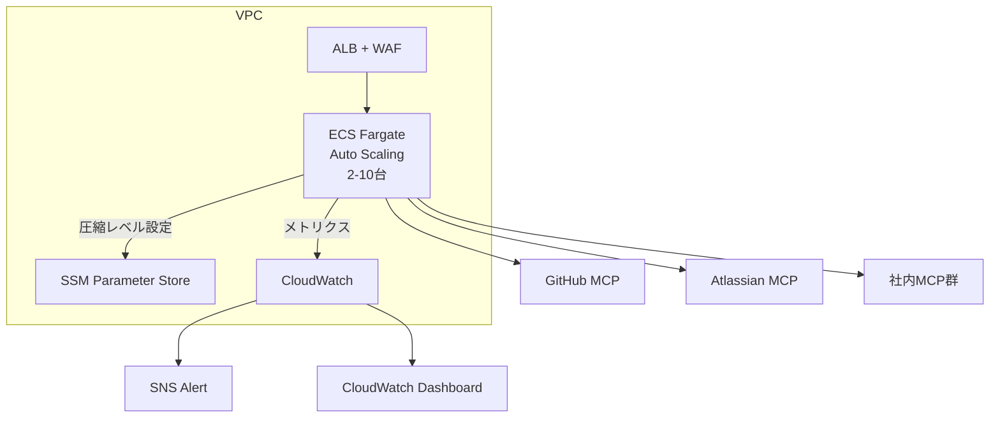

## ブログ概要

本記事は [Atlassian Labs: MCP Compression: Preventing Tool Bloat in AI Agents](https://www.atlassian.com/blog/development/mcp-compression-preventing-tool-bloat-in-ai-agents) の解説記事です。

Atlassian LabsのTim Esler氏（Senior Principal Machine Learning Engineer）が2026年3月29日に公開したこのブログ記事では、MCPサーバーのツール定義がエージェントのコンテキストウィンドウを圧迫する「Tool Bloat」問題に対し、プロキシベースの圧縮ソリューション**mcp-compressor**を提案している。mcp-compressorは既存のMCPサーバーとエージェント間に配置され、94ツールで約17,600トークンを消費するGitHub MCPサーバーに対して、圧縮レベルに応じて500-3,900トークンまで削減（70-97%削減）する。Apache-2.0ライセンスのオープンソースとして公開されており、Python/TypeScript/Rustの3言語で実装が提供されている。

## Zenn記事との関連

この記事は [Zenn記事: MCPサーバー自作でトークン消費94%削減：ツール定義設計の実装パターン](https://zenn.dev/0h_n0/articles/81a560d7731697) の深掘りです。

Zenn記事ではMCPツール定義のトークンコスト構造を分析し、JSON Schemaのフィールド記述やenum定義が大量のトークンを消費する実態を報告している。Atlassian Labsのmcp-compressorは、そのコスト問題に対する実践的なプロキシソリューションであり、ツール定義自体を書き換える代わりに、プロキシレイヤーでスキーマ全体を圧縮する異なるアプローチを採用している。Zenn記事がツール設計者の視点からの最適化であるのに対し、mcp-compressorはツール利用者の視点から既存サーバーに変更を加えずにトークン消費を削減できる点で相補的な関係にある。

## 情報源

- **種別**: 企業テックブログ（Atlassian Labs / Inside Atlassian）
- **URL**: [MCP Compression: Preventing Tool Bloat in AI Agents](https://www.atlassian.com/blog/development/mcp-compression-preventing-tool-bloat-in-ai-agents)
- **組織**: Atlassian Labs -- Tim Esler, Senior Principal Machine Learning Engineer
- **発表日**: 2026年3月29日
- **GitHub**: [atlassian-labs/mcp-compressor](https://github.com/atlassian-labs/mcp-compressor)（Apache-2.0、v0.31.5、2026年7月時点で97 stars）

## 技術的背景

### MCPにおけるTool Bloat問題

Model Context Protocol（MCP）では、エージェントが利用可能なツールの全定義をJSON Schema形式でコンテキストウィンドウに注入する。ツール数が増加するとトークン消費が急激に増大し、本来のタスク遂行に使えるコンテキスト容量を圧迫する。Atlassian Labsのブログでは、以下の具体的な数値を報告している。

- **GitHub MCPサーバー**: 94ツール、約**17,600トークン**を消費
- **Atlassian MCPサーバー**: Jira/Confluenceツール群で約**10,000トークン**を消費

これらのトークンはリクエストごとに送信されるため、セッション全体でのコスト影響は甚大である。例えばClaude Code等のエージェントが複数のMCPサーバーを同時に利用する場合、ツール定義だけでコンテキストの40-50%を占有する事態が発生する。MCPの公式Issue（[#2808](https://github.com/modelcontextprotocol/modelcontextprotocol/issues/2808)）でも、1ツールあたり約1,000トークンのオーバーヘッドが報告されており、プロトコルレベルの課題として認識されている。

この問題に対する代表的なアプローチとしては、（1）スキーマ圧縮（mcp-compressor）、（2）検索ベースのツール選択（Tool Search）、（3）レスポンスフィルタリング、（4）コードモード実行の4種類が存在する。mcp-compressorは（1）のスキーマ圧縮に特化したソリューションである。

## 実装アーキテクチャ

### プロキシ方式によるトークン圧縮

mcp-compressorはMCPプロキシとして動作する。既存のMCPサーバーとエージェント間に配置し、元のツール定義群を圧縮したラッパーインターフェースに置き換える。エージェント側・サーバー側のコード変更は不要であり、設定ファイルの変更のみで導入できる点が特徴である。



### 3つのラッパーツール

mcp-compressorはバックエンドのMCPサーバーが提供する全ツールを、以下の3つの汎用ラッパーツールに集約する。

| ラッパーツール | 役割 | 引数 |
|---|---|---|
| `get_tool_schema(tool_name)` | 指定ツールの完全なJSON Schemaを取得 | ツール名 |
| `invoke_tool(tool_name, tool_input)` | 指定ツールを実行 | ツール名、入力パラメータ |
| `list_tools()` | 利用可能なツール一覧を取得（Max圧縮時） | なし |

エージェントはまず圧縮されたツール一覧を確認し、必要なツールの完全スキーマを`get_tool_schema`で取得してから`invoke_tool`で実行する。この「オンデマンドスキーマ探索」パターンにより、初期のコンテキスト消費を大幅に削減できる。

### 4つの圧縮レベル

mcp-compressorは4段階の圧縮レベル（ブログ記事での表記はFull/Low/Moderate/Strong/Maxの5段階だが、実装では`low`/`medium`/`high`/`max`の4段階）を提供する。GitHub MCPサーバー（94ツール）での測定値を以下に示す。

| 圧縮レベル | トークン数 | 削減率 | 含まれる情報 |
|---|---|---|---|
| Baseline（Full） | 17,600 | -- | 全スキーマ（圧縮なし） |
| Low | 3,900 | 78% | ツール名、引数名、詳細な説明 |
| Medium | 3,300 | 81% | ツール名、引数名、短い1行説明 |
| High | 2,200 | 88% | ツール名と引数名のみ |
| Max | 500 | 97% | ツール一覧なし（`list_tools()`で取得） |

Atlassian Labsのブログでは、圧縮レベルが上がるにつれてツールの「発見可能性」（discoverability）が低下するトレードオフがあると報告している。しかし、`get_tool_schema`によるオンデマンドスキーマアクセスが利用可能な場合、E2E品質への影響はほぼないとしている。

### 名前空間設計とプロンプトキャッシュ安定性

mcp-compressorでは`mcp__atlassian__*`のような名前空間プレフィックスを用いて、圧縮されたツール名を元のサーバーと対応付ける。これにより複数のMCPサーバーを同時に圧縮しても名前の衝突が発生しない。

また、圧縮後のラッパーインターフェースは会話ターンをまたいで安定しているため、LLMプロバイダーのプロンプトキャッシュ機構と親和性が高い。トークン数の削減に加えて、キャッシュヒット率の向上による間接的なコスト削減効果もAtlassianは指摘している。

### 設定例

Claude Codeなどで利用する場合の設定例を以下に示す。

```json
{
  "mcpServers": {
    "github": {
      "command": "uvx",
      "args": [
        "mcp-compressor",
        "https://api.githubcopilot.com/mcp/",
        "--server-name",
        "github"
      ]
    }
  }
}
```

圧縮レベルを指定する場合は`-c`オプションを使用する。

```bash
mcp-compressor -c medium -- python server.py
```

CLI/コードモードでの直接呼び出しも可能である。

```bash
mcp-compressor --cli-mode --server-name atlassian \
  -- https://mcp.atlassian.com/v1/mcp \
  atlassian get-accessible-atlassian-resources
```

## Production Deployment Guide

mcp-compressorを本番環境に導入する際のAWSベースの構成パターンを、規模別に整理する。以下はブログの設計原則を踏まえた実装ガイドであり、Atlassian Labsが直接公開した構成ではない点に注意されたい。

### Small構成（個人/小規模チーム向け）

開発者1-5名程度のチームで、MCPサーバーが1-3台の場合の構成。



**特徴**: 各開発者のローカル環境でmcp-compressorを実行する。追加インフラは不要。

```bash
# 各開発者の.claude/settings.jsonに追加
pip install mcp-compressor
# または
cargo install mcp-compressor
```

**コスト試算**:
- 追加インフラコスト: $0/月
- トークン削減効果（94ツール、1日100リクエスト想定）:
  - 圧縮前: 17,600 tok/req x 100 req = 1,760,000 tok/日
  - Medium圧縮後: 3,300 tok/req x 100 req = 330,000 tok/日
  - 日次削減: 約1,430,000トークン（81%削減）

### Medium構成（チーム共有プロキシ）

開発者10-50名のチームで、MCPサーバーが5-10台の場合の構成。共有プロキシとして中央集権的に管理する。



**Terraformコード（ECS Fargate）**:

```hcl
# mcp-compressor ECS Service
resource "aws_ecs_task_definition" "mcp_compressor" {
  family                   = "mcp-compressor"
  requires_compatibilities = ["FARGATE"]
  network_mode             = "awsvpc"
  cpu                      = 256
  memory                   = 512

  container_definitions = jsonencode([{
    name  = "mcp-compressor"
    image = "ghcr.io/atlassian-labs/mcp-compressor:v0.31.5"
    portMappings = [{
      containerPort = 8080
      protocol      = "tcp"
    }]
    environment = [
      { name = "COMPRESSION_LEVEL", value = "medium" },
      { name = "SERVER_NAME",       value = "shared-proxy" }
    ]
    logConfiguration = {
      logDriver = "awslogs"
      options = {
        "awslogs-group"         = "/ecs/mcp-compressor"
        "awslogs-region"        = "ap-northeast-1"
        "awslogs-stream-prefix" = "ecs"
      }
    }
  }])
}

resource "aws_ecs_service" "mcp_compressor" {
  name            = "mcp-compressor"
  cluster         = aws_ecs_cluster.main.id
  task_definition = aws_ecs_task_definition.mcp_compressor.arn
  desired_count   = 2
  launch_type     = "FARGATE"

  network_configuration {
    subnets          = var.private_subnet_ids
    security_groups  = [aws_security_group.mcp_compressor.id]
    assign_public_ip = false
  }

  load_balancer {
    target_group_arn = aws_lb_target_group.mcp_compressor.arn
    container_name   = "mcp-compressor"
    container_port   = 8080
  }
}

resource "aws_security_group" "mcp_compressor" {
  name_prefix = "mcp-compressor-"
  vpc_id      = var.vpc_id

  ingress {
    from_port       = 8080
    to_port         = 8080
    protocol        = "tcp"
    security_groups = [aws_security_group.alb.id]
  }

  egress {
    from_port   = 0
    to_port     = 0
    protocol    = "-1"
    cidr_blocks = ["0.0.0.0/0"]
  }
}
```

**コスト試算**（ap-northeast-1）:
- ECS Fargate（0.25 vCPU, 0.5 GB x 2台）: 約$15/月
- ALB: 約$22/月
- CloudWatch Logs: 約$3/月
- **合計: 約$40/月**
- トークン削減効果（50名 x 1日50リクエスト x 5サーバー）:
  - 圧縮前: 10,000 tok/srv x 5 srv x 50 req x 50名 = 125,000,000 tok/日
  - Medium圧縮後: 約24,000,000 tok/日（81%削減）
  - Claude Sonnet 4 入力トークン単価 $3/MTok で約$303/日の削減

### Large構成（組織全体デプロイ）

開発者100名以上で、MCPサーバーが10台以上の場合の構成。マルチテナント対応と監視を強化する。



**追加のTerraformリソース（Auto Scaling）**:

```hcl
resource "aws_appautoscaling_target" "mcp_compressor" {
  max_capacity       = 10
  min_capacity       = 2
  resource_id        = "service/${aws_ecs_cluster.main.name}/${aws_ecs_service.mcp_compressor.name}"
  scalable_dimension = "ecs:service:DesiredCount"
  service_namespace  = "ecs"
}

resource "aws_appautoscaling_policy" "mcp_compressor_cpu" {
  name               = "mcp-compressor-cpu-scaling"
  policy_type        = "TargetTrackingScaling"
  resource_id        = aws_appautoscaling_target.mcp_compressor.resource_id
  scalable_dimension = aws_appautoscaling_target.mcp_compressor.scalable_dimension
  service_namespace  = aws_appautoscaling_target.mcp_compressor.service_namespace

  target_tracking_scaling_policy_configuration {
    predefined_metric_specification {
      predefined_metric_type = "ECSServiceAverageCPUUtilization"
    }
    target_value       = 70.0
    scale_in_cooldown  = 300
    scale_out_cooldown = 60
  }
}
```

**コスト試算**（ap-northeast-1）:
- ECS Fargate（0.5 vCPU, 1 GB x 2-10台）: 約$30-150/月
- ALB + WAF: 約$30/月
- CloudWatch（メトリクス + ダッシュボード + アラーム）: 約$10/月
- SSM Parameter Store: $0（Standard）
- **合計: 約$70-190/月**

### 運用・監視設定

mcp-compressorの本番運用では以下のメトリクスを監視することが重要である。

```hcl
# CloudWatch メトリクスフィルタとアラーム
resource "aws_cloudwatch_log_metric_filter" "compression_errors" {
  name           = "mcp-compressor-errors"
  pattern        = "\"level\":\"ERROR\""
  log_group_name = "/ecs/mcp-compressor"

  metric_transformation {
    name      = "CompressionErrors"
    namespace = "MCP/Compressor"
    value     = "1"
  }
}

resource "aws_cloudwatch_metric_alarm" "high_error_rate" {
  alarm_name          = "mcp-compressor-high-error-rate"
  comparison_operator = "GreaterThanThreshold"
  evaluation_periods  = 2
  metric_name         = "CompressionErrors"
  namespace           = "MCP/Compressor"
  period              = 300
  statistic           = "Sum"
  threshold           = 10
  alarm_description   = "mcp-compressor error rate exceeded threshold"
  alarm_actions       = [aws_sns_topic.alerts.arn]
}
```

**監視すべきメトリクス**:

| メトリクス | 閾値 | 対応 |
|---|---|---|
| エラー率 | >1%/5min | 圧縮レベル引き下げ、MCPサーバー接続確認 |
| レイテンシ（P99） | >500ms | スケールアウト、キャッシュ確認 |
| タスク数 | 最大値到達 | max_capacity引き上げ検討 |
| メモリ使用率 | >80% | タスク定義のメモリ増設 |

### コスト最適化チェックリスト

本番導入時に確認すべき項目を以下に整理する。

- [ ] **圧縮レベルの選定**: ユースケースに応じた圧縮レベルを選択（後述のベンチマーク結果を参考に、品質への影響が許容範囲内か確認）
- [ ] **Fargate Spot活用**: 開発/ステージング環境ではSpotインスタンスで最大70%のコスト削減
- [ ] **ECS タスクサイズの最適化**: mcp-compressorはCPU/メモリ消費が軽量なため、最小サイズ（0.25 vCPU, 0.5 GB）から開始
- [ ] **CloudWatch Logs保持期間**: 本番30日、開発7日に設定してログコストを抑制
- [ ] **複数MCPサーバーの集約**: 1つのmcp-compressorインスタンスで複数のバックエンドを処理できるか検討
- [ ] **プロンプトキャッシュの活用**: 圧縮後のスキーマが安定するため、LLMプロバイダーのキャッシュ割引を最大化
- [ ] **トークン消費量のモニタリング**: 導入前後でLLM APIコストを比較し、ROIを定量的に評価

## パフォーマンス最適化

### 圧縮レベル別のトークン数と品質影響

Atlassian Labsのブログでは、GitHub MCPサーバー（94ツール）を対象とした測定で以下の結果を報告している。

$$
\text{削減率} = \frac{T_{\text{baseline}} - T_{\text{compressed}}}{T_{\text{baseline}}} \times 100
$$

| 圧縮レベル | $T_{\text{compressed}}$ (トークン) | 削減率 | 品質影響 |
|---|---|---|---|
| Baseline | 17,600 | -- | -- |
| Low | 3,900 | 78% | ほぼなし |
| Medium | 3,300 | 81% | ほぼなし |
| High | 2,200 | 88% | 発見可能性が低下 |
| Max | 500 | 97% | `list_tools()`が必須 |

Atlassian Labsは「ツール圧縮はE2E品質にほぼ影響しなかった」と報告している。ただし、この評価はオンデマンドスキーマアクセス（`get_tool_schema`）が利用可能な場合に限定される点に注意が必要である。Max圧縮ではツール一覧自体が埋め込まれないため、エージェントが`list_tools()`を呼び出す追加ラウンドトリップが発生する。

### 他アプローチとの比較

StackOneの比較記事では、MCP Token Optimization手法を4カテゴリに分類している。

| アプローチ | 代表的ツール | 削減率 | 特徴 |
|---|---|---|---|
| スキーマ圧縮 | mcp-compressor | 78-97% | ドロップイン導入、コード変更不要 |
| 検索ベースツール選択 | Claude Code Tool Search | 91-98.5% | 大規模カタログ向け、精度も向上 |
| レスポンスフィルタリング | 各種実装 | 約95% | 大量ペイロード返却API向け |
| コードモード実行 | StackOne Code Mode | 96-99% | スキーマとレスポンス両方に対応 |

mcp-compressorの利点は「ドロップイン」で導入できる点にある。既存のMCPサーバーにもエージェントにも変更を加えず、設定ファイルの`command`をラップするだけで即座にトークン削減が実現する。一方、大規模ツールカタログ（50ツール以上）ではTool Searchとの併用が推奨されている。

## 運用での学び

### 設計原則

Atlassian Labsのブログでは、mcp-compressorの開発過程で得られた4つの設計原則を報告している。

1. **構造保持**: 圧縮はツール定義の構造を保持しながら行う。情報を削除するのではなく、段階的に詳細度を下げる
2. **名前空間による安全な合成**: `mcp__atlassian__*`のような名前空間プレフィックスにより、複数サーバーの安全な合成を実現する
3. **キャッシュ親和性**: 生のトークン削減だけでなく、プロンプトキャッシュの安定性も設計目標とする。圧縮後のインターフェースがターン間で変化しないことで、キャッシュヒット率が向上する
4. **明示的な探索パス**: モデルがツールを発見するための明示的なパスを提供する。暗黙的な推測に頼らず、`get_tool_schema`による明示的なスキーマ取得を促す

これらの原則は、AtlassianのRovo Devエージェント（Jira/Confluenceを操作するAIエージェント）の本番運用から得られた知見に基づいている。

### Code ModeとSchema Compressionの違い

ブログでは、mcp-compressorのスキーマ圧縮アプローチとCode Mode（コード生成・実行によるツール呼び出し）を対比している。スキーマ圧縮は既存のツール呼び出しパターンを維持しながらトークンを削減する手法であり、Code Modeはコード生成・実行の依存関係を導入する代わりにスキーマとレスポンスの両方を最適化できる手法である。Atlassian Labsはこれらを「対立する解ではなく、相補的なアプローチ」と位置づけている。

## 学術研究との関連

mcp-compressorの技術的背景に関連する学術研究として、TSCG（Tool Schema Compilation and Generation）が挙げられる。Sakizli（2026）による[TSCG: Deterministic Tool-Schema Compilation for Agentic LLM Deployments](https://arxiv.org/abs/2605.04107)は、JSON SchemaをLLMが効率的に解釈できるトークン効率の高い構造化テキストに変換する決定論的コンパイラである。TSCGは8つの合成可能な演算子を用いて52-57%のトークン削減を達成し、特に小型モデル（4B-14B）でのツール利用精度を大幅に向上させている（Phi-4 14Bで0%から84.4%へ）。

mcp-compressorがプロキシベースのランタイム圧縮であるのに対し、TSCGはスキーマフォーマット自体の静的な最適化というアプローチの違いがある。また、ToolWeaver（2026, arXiv:2601.21947）は階層的なツール検索によるスケーラブルなツール利用を提案しており、mcp-compressorの検索ベースアプローチ（`list_tools` + `get_tool_schema`）と概念的に共通する部分がある。

## まとめと実践への示唆

Atlassian Labsのmcp-compressorは、MCPのTool Bloat問題に対する実用的なソリューションである。ドロップインで導入でき、設定変更のみで70-97%のトークン削減を実現する点は、すぐに導入効果を得たいチームにとって有用である。ただし、大規模ツールカタログではTool Searchやレスポンスフィルタリングとの併用を検討すべきである。本番導入に際しては、圧縮レベルの選定と品質モニタリングの仕組みを整備した上で、段階的にロールアウトすることを推奨する。

## 参考文献

- Tim Esler, "MCP Compression: Preventing Tool Bloat in AI Agents," Inside Atlassian, 2026年3月29日. [https://www.atlassian.com/blog/development/mcp-compression-preventing-tool-bloat-in-ai-agents](https://www.atlassian.com/blog/development/mcp-compression-preventing-tool-bloat-in-ai-agents)
- atlassian-labs/mcp-compressor, GitHub. [https://github.com/atlassian-labs/mcp-compressor](https://github.com/atlassian-labs/mcp-compressor)
- mcp-compressor Documentation. [https://atlassian-labs.github.io/mcp-compressor/](https://atlassian-labs.github.io/mcp-compressor/)
- Furkan Sakizli, "TSCG: Deterministic Tool-Schema Compilation for Agentic LLM Deployments," arXiv:2605.04107, 2026年5月. [https://arxiv.org/abs/2605.04107](https://arxiv.org/abs/2605.04107)
- "MCP Token Optimization: 4 Approaches Compared," StackOne Blog. [https://www.stackone.com/blog/mcp-token-optimization/](https://www.stackone.com/blog/mcp-token-optimization/)
- "MCP spec should address tool schema token overhead," modelcontextprotocol Issue #2808. [https://github.com/modelcontextprotocol/modelcontextprotocol/issues/2808](https://github.com/modelcontextprotocol/modelcontextprotocol/issues/2808)
- "ToolWeaver: Weaving Collaborative Semantics for Scalable Tool Use in Large Language Models," arXiv:2601.21947, 2026年1月. [https://arxiv.org/abs/2601.21947](https://arxiv.org/abs/2601.21947)

---

*本記事はAIによって生成されました。内容の正確性については原典を参照してください。*
