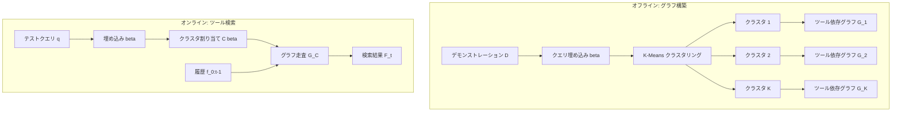

## 論文概要（Abstract）

本記事は [Dynamic Tool Dependency Retrieval for Lightweight Function Calling](https://arxiv.org/abs/2512.17052) の解説記事です。

LLMベースのFunction Callingエージェントにおいて、利用可能なツール数が増大すると、プロンプト長の肥大化とツール選択精度の低下が課題となる。著者らは、クエリだけでなく進行中のツール呼び出し計画（履歴）にも条件付けして関連ツールを動的に選択するDynamic Tool Dependency Retrieval（DTDR）を提案している。DTDRはデモンストレーションからツール間の依存関係をモデル化し、実行計画の進行に応じてツール検索を適応させる。著者らの報告では、複数のデータセットおよびLLMバックボーンにおいて、既存の静的検索手法に対しFunction Calling成功率を23-104%改善し、プロンプト長を最大73%削減している。

この記事は [Zenn記事: Function Callingコスト最適化入門：トークン消費を70%削減する5つの実装テクニック](https://zenn.dev/0h_n0/articles/d16764d2f38be3) の深掘りです。

## 情報源

- **arXiv ID**: 2512.17052
- **URL**: [https://arxiv.org/abs/2512.17052](https://arxiv.org/abs/2512.17052)
- **著者**: Bhrij Patel, Davide Belli, Amir Jalalirad, et al.
- **発表年**: 2025年（v4: 2026年4月）
- **分野**: cs.LG（Machine Learning）

## 背景と動機

### ツール検索の課題

LLMベースのFunction Callingエージェントをエッジデバイスにデプロイする場合、メモリとレイテンシの制約が厳しく、すべてのツール定義をプロンプトに含めることは現実的でない。ツール検索（Tool Retrieval）によってクエリに関連するツールのみをプロンプトに含める手法が提案されてきたが、既存手法には以下の限界がある。

**静的クエリベース手法**: BM-25やDense Retrieval（DR）など、クエリとツール説明文の類似度のみで検索する手法は、マルチステップのツール呼び出しにおけるツール間の依存関係を考慮できない。例えば「メールを送信する」タスクでは、`get_contacts` → `compose_email` → `send_email`という順序依存があるが、クエリとの類似度だけでは`compose_email`の後に`send_email`が必要であることを捉えられない。

**静的グラフベース手法**: ToolNetのように、デモンストレーションからツール依存グラフを事前構築する手法は、クエリの文脈を無視する。同じ`getEmailAddress`関数でも、複数宛先への送信（連続呼び出し）と単一宛先への送信（1回呼び出し）では後続ツールが異なるが、すべてのデモンストレーションを集約した遷移確率では区別できない。

著者らはこれらを「一次マルコフ問題」および「分岐依存問題」と定式化し、クエリと呼び出し履歴の両方に条件付けした動的検索の必要性を主張している。

## 主要な貢献

著者らは以下の3点を主要な貢献として報告している。

- **動的ツール依存検索フレームワーク（DTDR）の提案**: クエリとツール呼び出し履歴の両方に条件付けして次のツールを予測する2つのバリアント（DTDR-CとDTDR-L）を設計。文埋め込みモデルのみを使用し、LLMプロンプティングに比べて計算コストが無視可能な軽量手法
- **包括的な評価**: 検索指標（MRR, F1）、下流タスク性能（FSA, SR）、効率性（トークン数, パラメータ数）を4データセット×7モデルで評価。既存手法が満たさなかった5つの要件（ツール依存認識、ツール説明非依存、クエリ認識、マルチステップ履歴認識、小型モデル互換性）をすべて満たす唯一の手法であることを実証
- **ICLエンコーディング戦略の分析**: 検索結果をLLMプロンプトに反映する5つの手法を比較し、小型モデルではHard Masking（非検索ツールを除去）が最も効果的であることを特定

## 技術的詳細

### 問題定式化

Function Callingにおけるツール検索は、以下のように定式化される。利用可能なツール集合を$\mathcal{F}$、自然言語クエリを$q$、時刻$t$までに選択されたツール列を$f_{0:t-1}$、正解ツール集合を$\mathcal{F}_t^*$とする。検索モジュール$\omega(\cdot)$は$\mathcal{F}_t \subseteq \mathcal{F}$を出力し、最適化目標は以下の通りである。

$$
\max_{\omega \in \Omega} \sum_{q \in Q} \sum_{t=0}^{T} \mathbb{E}_{f_t \sim \pi(\cdot \mid p)} \left[ \mathbf{1}_{f_t \in \mathcal{F}_t^*} \right]
$$

ここで、
- $Q$: クエリ集合
- $T$: 最大計画長
- $\pi(\cdot \mid p)$: LLMの関数選択ポリシー（プロンプト$p$に条件付け）
- $\mathbf{1}_{f_t \in \mathcal{F}_t^*}$: 選択されたツール$f_t$が正解集合に含まれるかの指示関数

最適な検索モジュール$\omega^*$は、$\{\} \subset \omega^*(\cdot) = \mathcal{F}_t \subseteq \mathcal{F}_t^*$を満たす。すなわち、正解ツールのサブセットのみを返し、不要なツールを含めない。

### DTDR-C: クラスタリングベース

DTDR-Cは、デモンストレーションクエリのクラスタリングとクラスタ別ツール依存グラフの走査を組み合わせた手法である。



**手順**:

1. **クエリ埋め込み**: デモンストレーションクエリ$Q_D$を事前学習済み埋め込みモデルで埋め込み$\beta$に変換
2. **クラスタリング**: K-Meansで$K$個のクラスタ$C$に分割
3. **グラフ構築**: 各クラスタ$k$に属するデモンストレーション$D_k$から、ツール間の遷移頻度を重み付き有向グラフ$G_k$として構築
4. **推論**: テストクエリ$q$の埋め込み$\beta$を最近傍クラスタ$C(\beta)$に割り当て、対応するグラフ$G_{C(\beta)}$を履歴$f_{0:t-1}$で走査

検索結果は以下の式で表される。

$$
\mathcal{F}_t = G_{C(\beta)}(f_{0:t-1})
$$

ここで、
- $G_{C(\beta)}$: クエリ$q$が割り当てられたクラスタのツール依存グラフ
- $f_{0:t-1}$: 時刻$t$までの呼び出し履歴
- $\mathcal{F}_t$: 時刻$t$で検索されたツール集合

**パラメータ数**: $e \cdot K$（$e$: 埋め込み次元数、$K$: クラスタ数）。クラスタ中心のみを保持するため非常に軽量である。

### DTDR-L: 線形分類器ベース

DTDR-Lは、凍結された埋め込みモデルの上に単一の線形レイヤーを追加し、クエリと呼び出し履歴の連結埋め込みから次のツールを予測する。

**手順**:

1. **入力の連結**: クエリ$q$と呼び出し履歴$f_{0:t-1}$をテキストとして連結し、埋め込みを計算

$$
\zeta = \text{embed}(q \oplus f_{0:t-1})
$$

2. **線形分類**: 学習可能な線形レイヤー$\phi$で各ツールのスコアを計算

$$
P(f \mid \zeta) = \text{softmax}(\phi(\zeta))
$$

3. **閾値フィルタリング**: スコアが閾値$\alpha$を超えるツールを検索結果とする

$$
\mathcal{F}_t = \{f \mid f \in \mathcal{F},\; \phi(\zeta) > \alpha\}
$$

ここで、
- $\zeta$: クエリと履歴の連結埋め込み（$\oplus$はテキスト連結）
- $\phi$: 学習可能な線形レイヤー（重み行列$W \in \mathbb{R}^{e \times |\mathcal{F}|}$）
- $\alpha$: 検索閾値

**パラメータ数**: $e \cdot |\mathcal{F}|$（$e$: 埋め込み次元数、$|\mathcal{F}|$: ツール数）。例えば$e=384, |\mathcal{F}|=41$の場合、約15,700パラメータとなり、LLMの数億パラメータと比較して無視可能なサイズである。

**DTDR-CとDTDR-Lの比較**: DTDR-Cはグラフ走査に基づくため、学習データに存在する遷移パターンのみを再現できる。一方、DTDR-Lは線形レイヤーの汎化能力により、未見の遷移パターンにも対応可能であり、特に長い計画長での性能維持に優れることが報告されている。

### ICLエンコーディング手法

検索されたツール集合$\mathcal{F}_t$をLLMプロンプトにどう反映するかについて、著者らは5つの手法を比較している。

1. **No ICL**: 初期デモンストレーションのみ提供（ベースライン）
2. **Raw Demonstrations**: 検索ツールを含むデモンストレーションを最大5つ追加（情報量は多いがプロンプトが長大化）
3. **Hard Masking**: 非検索ツールをツールリストから除去し、検索されたツールのみを提示
4. **Soft Masking**: 全ツールを提示しつつ、検索ツールを強調
5. **Weighted Hard/Soft Masking**: 検索スコア（信頼度）を付加

著者らの実験では、小型モデル（0.6B-4B）ではHard Maskingが最も効果的であり、これはツールリストを直接削減することで小型モデルの選択負荷を軽減するためと考えられている。大型モデルではRaw Demonstrationsも競合的な性能を示している。

### 擬似コードによる実装イメージ

```python
import numpy as np
from sklearn.cluster import KMeans
from sentence_transformers import SentenceTransformer


class DTDRRetriever:
    """Dynamic Tool Dependency Retrieval の統合インターフェース

    DTDR-C（クラスタリング）とDTDR-L（線形分類器）の両方を提供する。
    """

    def __init__(
        self,
        tools: list[str],
        embedding_model: str = "all-MiniLM-L6-v2",
        n_clusters: int = 10,
    ):
        self.tools = tools
        self.encoder = SentenceTransformer(embedding_model)
        self.n_clusters = n_clusters
        self.cluster_graphs: dict[int, dict[str, dict[str, float]]] = {}
        self.kmeans: KMeans | None = None

    def fit_dtdr_c(
        self,
        demo_queries: list[str],
        demo_trajectories: list[list[str]],
    ) -> None:
        """DTDR-Cの学習: クエリクラスタリング + クラスタ別グラフ構築

        Args:
            demo_queries: デモンストレーションクエリのリスト
            demo_trajectories: 各クエリに対応するツール呼び出し列
        """
        embeddings = self.encoder.encode(demo_queries)
        self.kmeans = KMeans(n_clusters=self.n_clusters, random_state=42)
        labels = self.kmeans.fit_predict(embeddings)

        # クラスタ別にツール依存グラフを構築
        for k in range(self.n_clusters):
            cluster_trajs = [
                t for t, l in zip(demo_trajectories, labels) if l == k
            ]
            self.cluster_graphs[k] = self._build_graph(cluster_trajs)

    def retrieve_dtdr_c(
        self,
        query: str,
        history: list[str],
    ) -> list[str]:
        """DTDR-Cでツールを検索する

        Args:
            query: ユーザークエリ
            history: これまでの呼び出し履歴

        Returns:
            検索されたツール名のリスト
        """
        embedding = self.encoder.encode([query])
        cluster_id = self.kmeans.predict(embedding)[0]
        graph = self.cluster_graphs.get(cluster_id, {})

        if not history:
            # 履歴がない場合: クラスタ内の全初期ツールを返す
            return list(graph.get("__START__", {}).keys())

        last_tool = history[-1]
        return list(graph.get(last_tool, {}).keys())

    @staticmethod
    def _build_graph(
        trajectories: list[list[str]],
    ) -> dict[str, dict[str, float]]:
        """ツール呼び出し列から重み付き依存グラフを構築する

        Args:
            trajectories: ツール呼び出し列のリスト

        Returns:
            隣接リスト形式のグラフ（遷移確率付き）
        """
        graph: dict[str, dict[str, int]] = {}
        for traj in trajectories:
            prev = "__START__"
            for tool in traj:
                if prev not in graph:
                    graph[prev] = {}
                graph[prev][tool] = graph[prev].get(tool, 0) + 1
                prev = tool

        # カウントを確率に変換
        prob_graph: dict[str, dict[str, float]] = {}
        for src, dests in graph.items():
            total = sum(dests.values())
            prob_graph[src] = {d: c / total for d, c in dests.items()}
        return prob_graph
```

## 実装のポイント

### 軽量性とオンデバイス適用

DTDRの計算コストは文埋め込みエンコーダの推論のみであり、LLMプロンプティングによる検索手法と比較して桁違いに軽量である。DTDR-Lのパラメータ数は$e \cdot |\mathcal{F}|$であり、例えばMiniLM（$e=384$）と41ツールの組み合わせでは約15,700パラメータに収まる。これにより、スマートフォンやIoTデバイスでのオンデバイス推論が実現可能となる。

### 履歴長のチューニング

アブレーション実験から、呼び出し履歴の長さ$l$は3が最適であると報告されている。$l=0$（履歴なし）では頻出ツールへの過学習が発生し、$l > 3$では収益逓減となる。実装時には直近3ステップの履歴をテキスト連結して埋め込みモデルに入力するのが推奨される。

### OOD検知とフォールバック

著者らは、分布外（OOD）クエリに対する安全策として、信頼度が低い場合に全ツールを提示するフォールバック機構を提案している。DTDR-Cではクラスタ割り当ての尤度を、DTDR-Lではマハラノビス距離をOOD検知の指標として使用する。

### 学習データ量の影響

DTDR-Lは1,000サンプル未満で急激な精度低下（過学習）が発生するため、最低1,000件のデモンストレーションが必要である。一方、DTDR-Cは限られたデータに対してより頑健であり、小規模なデータセットではDTDR-Cの採用が推奨される。

## Production Deployment Guide

DTDRのツール依存検索システムをAWS上にデプロイする場合のアーキテクチャと設定を示す。DTDRの推論コストは文埋め込みのみであり、LLM呼び出しを含まないため、ツール検索部分のコストは極めて低い。

### AWS実装パターン（コスト最適化重視）

**トラフィック量別の推奨構成**:

| 構成 | トラフィック | 主要サービス | 月額概算 |
|------|-----------|-----------|---------|
| Small | ~100 req/日 | Lambda + SageMaker Serverless + DynamoDB | $40-120 |
| Medium | ~1,000 req/日 | ECS Fargate + SageMaker Endpoint + ElastiCache | $250-700 |
| Large | 10,000+ req/日 | EKS + Spot + SageMaker Multi-Model + ElastiCache | $1,800-4,500 |

**Small構成（Serverless）の詳細**:
- **Lambda**（256MB, ARM64）: DTDR-L推論（埋め込み計算 + 線形分類）およびICLプロンプト構築
- **SageMaker Serverless Inference**: MiniLM等の文埋め込みモデルのホスティング（アイドル時課金なし）
- **DynamoDB**（On-Demand）: クラスタ中心ベクトル、グラフ構造、線形レイヤー重みの格納
- **Amazon Bedrock**（Claude 3.5 Haiku）: Function Calling本体のLLM推論
- **S3**: デモンストレーションデータと学習済みモデルの保存

**Large構成（Container）の詳細**:
- **EKS**（Karpenter + Spot Instances）: DTDR推論サービスのオートスケーリング
- **SageMaker Multi-Model Endpoint**（ml.g5.xlarge）: 複数の埋め込みモデルを1つのエンドポイントで提供
- **ElastiCache for Redis**（cache.r7g.large）: 埋め込みキャッシュおよび検索結果キャッシュ
- **Bedrock Batch API**: 大量リクエストのバッチ処理で50%コスト削減

**コスト削減テクニック**:
- Spot Instances活用: EKSワーカーノードで最大90%削減
- SageMaker Serverless: アイドル時課金なしで低トラフィック環境に最適
- Prompt Caching: ICLエンコーディングのシステムプロンプトキャッシュで30-90%削減
- Hard Masking: プロンプト長を最大73%削減し、LLMトークンコストを直接削減

**コスト試算の注意事項**: 上記は2026年7月時点のAWS ap-northeast-1（東京）リージョン料金に基づく概算値である。実際のコストはトラフィックパターン、リージョン、バースト使用量により変動するため、最新料金は[AWS料金計算ツール](https://calculator.aws/)で確認を推奨する。

### Terraformインフラコード

**Small構成（Serverless）**:

```hcl
# DTDR Tool Dependency Retrieval - Small構成 (Serverless)
# Lambda + SageMaker Serverless + DynamoDB

terraform {
  required_version = ">= 1.9"
  required_providers {
    aws = {
      source  = "hashicorp/aws"
      version = "~> 5.60"
    }
  }
}

provider "aws" {
  region = "ap-northeast-1"
}

# --- IAM Role (最小権限) ---
resource "aws_iam_role" "dtdr_lambda" {
  name = "dtdr-retriever-lambda-role"
  assume_role_policy = jsonencode({
    Version = "2012-10-17"
    Statement = [{
      Action = "sts:AssumeRole"
      Effect = "Allow"
      Principal = { Service = "lambda.amazonaws.com" }
    }]
  })
}

resource "aws_iam_role_policy" "dtdr_policy" {
  name = "dtdr-retriever-policy"
  role = aws_iam_role.dtdr_lambda.id
  policy = jsonencode({
    Version = "2012-10-17"
    Statement = [
      {
        Effect = "Allow"
        Action = [
          "sagemaker:InvokeEndpoint"  # 埋め込みモデル推論
        ]
        Resource = aws_sagemaker_endpoint.embedding.arn
      },
      {
        Effect = "Allow"
        Action = [
          "bedrock:InvokeModel",      # Function Calling LLM
          "bedrock:InvokeModelWithResponseStream"
        ]
        Resource = [
          "arn:aws:bedrock:ap-northeast-1::foundation-model/anthropic.claude-3-5-haiku-*"
        ]
      },
      {
        Effect   = "Allow"
        Action   = ["dynamodb:GetItem", "dynamodb:PutItem", "dynamodb:Query", "dynamodb:BatchGetItem"]
        Resource = aws_dynamodb_table.dtdr_state.arn
      },
      {
        Effect   = "Allow"
        Action   = ["s3:GetObject"]
        Resource = "${aws_s3_bucket.dtdr_models.arn}/*"
      },
      {
        Effect   = "Allow"
        Action   = ["logs:CreateLogGroup", "logs:CreateLogStream", "logs:PutLogEvents"]
        Resource = "arn:aws:logs:*:*:*"
      }
    ]
  })
}

# --- DynamoDB (DTDR状態管理) ---
resource "aws_dynamodb_table" "dtdr_state" {
  name         = "dtdr-retriever-state"
  billing_mode = "PAY_PER_REQUEST"  # On-Demand: 低トラフィック向けコスト最適化
  hash_key     = "session_id"
  range_key    = "step"

  attribute {
    name = "session_id"
    type = "S"
  }

  attribute {
    name = "step"
    type = "N"
  }

  ttl {
    attribute_name = "expires_at"
    enabled        = true  # セッション自動削除
  }

  server_side_encryption {
    enabled = true  # KMS暗号化
  }

  point_in_time_recovery {
    enabled = true
  }
}

# --- S3 (モデルアーティファクト) ---
resource "aws_s3_bucket" "dtdr_models" {
  bucket = "dtdr-retriever-models"
}

resource "aws_s3_bucket_server_side_encryption_configuration" "dtdr_models" {
  bucket = aws_s3_bucket.dtdr_models.id
  rule {
    apply_server_side_encryption_by_default {
      sse_algorithm = "aws:kms"
    }
  }
}

# --- Lambda関数 ---
resource "aws_lambda_function" "dtdr_retriever" {
  function_name = "dtdr-retriever"
  role          = aws_iam_role.dtdr_lambda.arn
  handler       = "handler.lambda_handler"
  runtime       = "python3.12"
  architectures = ["arm64"]  # Graviton: 20%コスト削減
  memory_size   = 256
  timeout       = 30

  filename = "lambda_package.zip"

  environment {
    variables = {
      DYNAMODB_TABLE     = aws_dynamodb_table.dtdr_state.name
      SAGEMAKER_ENDPOINT = aws_sagemaker_endpoint.embedding.name
      BEDROCK_MODEL_ID   = "anthropic.claude-3-5-haiku-20241022-v1:0"
      RETRIEVAL_MODE     = "dtdr_l"        # dtdr_c or dtdr_l
      HISTORY_LENGTH     = "3"             # 推奨値
      THRESHOLD_ALPHA    = "0.1"           # 検索閾値
      ICL_ENCODING       = "hard_masking"  # 小型モデル向け推奨
    }
  }

  tracing_config {
    mode = "Active"  # X-Ray有効化
  }
}

# --- CloudWatch アラーム (コスト監視) ---
resource "aws_cloudwatch_metric_alarm" "lambda_duration" {
  alarm_name          = "dtdr-lambda-duration-high"
  comparison_operator = "GreaterThanThreshold"
  evaluation_periods  = 3
  metric_name         = "Duration"
  namespace           = "AWS/Lambda"
  period              = 300
  statistic           = "p95"
  threshold           = 20000  # 20秒（埋め込み推論含む）
  alarm_description   = "Lambda実行時間P95が20秒超過"

  dimensions = {
    FunctionName = aws_lambda_function.dtdr_retriever.function_name
  }
}
```

**Large構成（Container）**:

```hcl
# DTDR Tool Dependency Retrieval - Large構成 (Container)
# EKS + Karpenter + Spot Instances

# --- EKSクラスタ ---
module "eks" {
  source  = "terraform-aws-modules/eks/aws"
  version = "~> 20.24"

  cluster_name    = "dtdr-retriever-cluster"
  cluster_version = "1.31"

  vpc_id     = module.vpc.vpc_id
  subnet_ids = module.vpc.private_subnets

  cluster_endpoint_public_access = false  # セキュリティ: パブリックアクセス無効

  eks_managed_node_groups = {
    system = {
      instance_types = ["m7g.medium"]  # Graviton: コスト最適化
      min_size       = 1
      max_size       = 3
      desired_size   = 2
    }
  }
}

# --- Karpenter Provisioner (Spot優先) ---
resource "kubectl_manifest" "karpenter_nodepool" {
  yaml_body = yamlencode({
    apiVersion = "karpenter.sh/v1"
    kind       = "NodePool"
    metadata   = { name = "dtdr-spot" }
    spec = {
      template = {
        spec = {
          requirements = [
            { key = "karpenter.sh/capacity-type", operator = "In", values = ["spot", "on-demand"] },
            { key = "node.kubernetes.io/instance-type", operator = "In",
              values = ["m7g.medium", "m7g.large", "c7g.medium", "c7g.large"] },
          ]
          nodeClassRef = { name = "default" }
        }
      }
      limits   = { cpu = "100", memory = "200Gi" }
      disruption = {
        consolidationPolicy = "WhenEmptyOrUnderutilized"
        consolidateAfter    = "30s"
      }
    }
  })
}

# --- Secrets Manager (モデル設定) ---
resource "aws_secretsmanager_secret" "dtdr_config" {
  name = "dtdr-retriever-config"
}

resource "aws_secretsmanager_secret_version" "dtdr_config" {
  secret_id     = aws_secretsmanager_secret.dtdr_config.id
  secret_string = jsonencode({
    embedding_model    = "all-MiniLM-L6-v2"
    bedrock_model_id   = "anthropic.claude-3-5-haiku-20241022-v1:0"
    retrieval_mode     = "dtdr_l"
    history_length     = 3
    threshold_alpha    = 0.1
  })
}

# --- AWS Budgets (予算アラート) ---
resource "aws_budgets_budget" "dtdr_monthly" {
  name         = "dtdr-retriever-monthly"
  budget_type  = "COST"
  limit_amount = "5000"
  limit_unit   = "USD"
  time_unit    = "MONTHLY"

  notification {
    comparison_operator       = "GREATER_THAN"
    threshold                 = 80
    threshold_type            = "PERCENTAGE"
    notification_type         = "FORECASTED"
    subscriber_email_addresses = ["ops-team@example.com"]
  }
}
```

### 運用・監視設定

**CloudWatch Logs Insights クエリ（コスト異常検知）**:

```
# 1時間あたりのDTDR検索回数と埋め込み呼び出し回数
fields @timestamp, @message
| filter event = "dtdr_retrieval"
| stats count() as retrieval_count,
        sum(embedding_calls) as total_embedding_calls,
        avg(retrieved_tools) as avg_tools_retrieved
  by bin(1h)
| sort @timestamp desc
```

```
# Function Callingレイテンシ分析（P95, P99）
fields @timestamp, duration_ms, retrieval_ms, llm_ms
| filter event = "function_calling"
| stats avg(duration_ms) as avg_total,
        percentile(duration_ms, 95) as p95_total,
        percentile(retrieval_ms, 95) as p95_retrieval,
        percentile(llm_ms, 95) as p95_llm,
        count() as requests
  by bin(1h)
```

**CloudWatch アラーム設定（Python）**:

```python
import boto3

cloudwatch = boto3.client("cloudwatch", region_name="ap-northeast-1")


def create_retrieval_latency_alarm(
    function_name: str,
    threshold: float = 500,
    sns_topic_arn: str = "",
) -> dict:
    """DTDR検索レイテンシ異常検知アラームを作成する

    Args:
        function_name: Lambda関数名
        threshold: レイテンシ閾値（ミリ秒、デフォルト: 500ms）
        sns_topic_arn: 通知先SNSトピックARN

    Returns:
        CloudWatch PutMetricAlarm APIレスポンス
    """
    return cloudwatch.put_metric_alarm(
        AlarmName=f"{function_name}-dtdr-retrieval-latency",
        MetricName="Duration",
        Namespace="AWS/Lambda",
        Statistic="p95",
        Period=300,
        EvaluationPeriods=2,
        Threshold=threshold,
        ComparisonOperator="GreaterThanThreshold",
        AlarmActions=[sns_topic_arn] if sns_topic_arn else [],
    )
```

**X-Rayトレーシング設定（Python）**:

```python
from aws_xray_sdk.core import xray_recorder, patch_all

# boto3の自動計装
patch_all()


def trace_dtdr_retrieval(
    query: str,
    history: list[str],
    retrieved_tools: list[str],
) -> None:
    """DTDR検索のトレーシングにアノテーションとメタデータを記録する

    Args:
        query: ユーザークエリ
        history: ツール呼び出し履歴
        retrieved_tools: 検索されたツールリスト
    """
    subsegment = xray_recorder.begin_subsegment("dtdr_retrieval")
    subsegment.put_annotation("history_length", len(history))
    subsegment.put_annotation("retrieved_count", len(retrieved_tools))
    subsegment.put_annotation("retrieval_mode", "dtdr_l")
    subsegment.put_metadata("query", query, "dtdr")
    subsegment.put_metadata("history", history, "dtdr")
    subsegment.put_metadata("retrieved_tools", retrieved_tools, "dtdr")
    xray_recorder.end_subsegment()
```

**Cost Explorer自動レポート（Python）**:

```python
import boto3
from datetime import datetime, timedelta


def get_daily_cost_report(
    service_filter: list[str] | None = None,
    alert_threshold: float = 100.0,
    sns_topic_arn: str = "",
) -> dict:
    """日次コストレポートを取得し、閾値超過時にSNS通知する

    Args:
        service_filter: 対象サービス名リスト（デフォルト: Bedrock, Lambda, SageMaker）
        alert_threshold: アラート閾値（USD/日、デフォルト: $100）
        sns_topic_arn: 通知先SNSトピックARN

    Returns:
        サービス別コスト辞書
    """
    if service_filter is None:
        service_filter = [
            "Amazon Bedrock", "AWS Lambda", "Amazon SageMaker",
            "Amazon ElastiCache",
        ]

    ce = boto3.client("ce", region_name="us-east-1")
    today = datetime.utcnow().strftime("%Y-%m-%d")
    yesterday = (datetime.utcnow() - timedelta(days=1)).strftime("%Y-%m-%d")

    response = ce.get_cost_and_usage(
        TimePeriod={"Start": yesterday, "End": today},
        Granularity="DAILY",
        Metrics=["UnblendedCost"],
        Filter={
            "Dimensions": {
                "Key": "SERVICE",
                "Values": service_filter,
            }
        },
        GroupBy=[{"Type": "DIMENSION", "Key": "SERVICE"}],
    )

    costs: dict[str, float] = {}
    total = 0.0
    for group in response["ResultsByTime"][0]["Groups"]:
        service = group["Keys"][0]
        amount = float(group["Metrics"]["UnblendedCost"]["Amount"])
        costs[service] = amount
        total += amount

    if total > alert_threshold and sns_topic_arn:
        sns = boto3.client("sns", region_name="ap-northeast-1")
        sns.publish(
            TopicArn=sns_topic_arn,
            Subject=f"DTDR Cost Alert: ${total:.2f}/day",
            Message=f"Daily cost ${total:.2f} exceeded ${alert_threshold}",
        )

    return costs
```

### コスト最適化チェックリスト

**アーキテクチャ選択**:
- [ ] トラフィック量に応じた構成選択（~100 req/日: Serverless、~1000 req/日: Hybrid、10000+ req/日: Container）
- [ ] 埋め込みモデルのホスティング方式選択（SageMaker Serverless vs Managed Endpoint vs Lambda内蔵）

**リソース最適化**:
- [ ] EC2/EKS: Spot Instances優先（最大90%削減）
- [ ] Reserved Instances: 1年コミットで最大72%削減
- [ ] Savings Plans: コンピューティング全体での割引
- [ ] Lambda: ARM64（Graviton）+ メモリサイズ最適化
- [ ] EKS: Karpenterによるアイドル時スケールダウン
- [ ] SageMaker: Serverless Inferenceでアイドル時課金なし

**LLMコスト削減**:
- [ ] Hard Masking: プロンプト長を最大73%削減し、LLMトークンコストを直接削減
- [ ] Bedrock Batch API: 大量リクエストのバッチ処理で50%削減
- [ ] Prompt Caching: ICLプロンプトのシステム部分キャッシュで30-90%削減
- [ ] モデル選択ロジック: 検索結果の信頼度に応じてHaiku/Sonnetを使い分け
- [ ] トークン数制限: 検索されたツール数の上限設定（Top-k）

**監視・アラート**:
- [ ] AWS Budgets: 月次予算アラート設定（80%/100%/120%）
- [ ] CloudWatch アラーム: 埋め込み推論レイテンシ、Lambda実行時間
- [ ] Cost Anomaly Detection: MLベースのコスト異常検知を有効化
- [ ] 日次コストレポート: Cost Explorer APIで自動取得、SNS通知

**リソース管理**:
- [ ] 未使用リソース: 使われていないSageMaker Endpoint・Lambda関数の削除
- [ ] タグ戦略: `project:dtdr-retriever`タグで全リソースを追跡
- [ ] ライフサイクルポリシー: DynamoDB TTLでセッションデータを自動削除
- [ ] 開発環境: 夜間・休日のEKSノード縮退（Karpenter disruption設定）
- [ ] ログ保持: CloudWatch Logsの保持期間設定（本番30日、開発7日）

## 実験結果

### データセットとモデル

著者らは4つのFunction Callingベンチマークで評価を行っている。

| データセット | 計画数 | ツール数 | 平均呼び出し数 | 平均依存数 |
|------------|-------|---------|-------------|----------|
| TinyAgent (TA) | 39,874 | 17 | 4.5 | 1.9 |
| TaskBench DailyLife (TB-DL) | 3,860 | 41 | 4.1 | 0.1 |
| TaskBench HuggingFace (TB-HF) | 4,959 | 24 | 3.2 | 1.1 |
| TaskBench Multimedia (TB-MM) | 4,310 | 41 | 3.6 | 1.5 |

LLMバックボーンとして、Qwen 3ファミリー（0.6B, 1.7B, 4B, 8B, 14B）、GPT-4o、Gorilla-V2が使用されている。

### ツール検索精度の比較

論文Table 2より、ツール検索の精度を既存手法と比較した結果を示す。

| 手法 | TA FSA | TA MRR | TA F1 | TB-HF FSA | TB-HF MRR |
|------|--------|--------|-------|----------|----------|
| BM-25 | 23.1% | 0.35 | 0.30 | 8.3% | 0.30 |
| QTS (Gao et al.) | 21.5% | 0.18 | 0.21 | 14.6% | 0.33 |
| DR (ToolNet) | 30.7% | 0.70 | 0.42 | 17.1% | 0.50 |
| LR | 25.6% | 0.50 | 0.31 | 14.2% | 0.37 |
| **DTDR-C** | **43.3%** | **0.78** | **0.48** | **27.5%** | **0.72** |
| **DTDR-L** | **65.1%** | **0.93** | **0.55** | **27.8%** | **0.75** |

DTDR-Lは、TinyAgentにおいてLRに対しFSAを154%改善（25.6% → 65.1%）、DRに対し112%改善（30.7% → 65.1%）している。MRR 0.93は、検索された最上位ツールが高い確率で正解であることを示す。

### Function Selection Accuracy（エンドツーエンド）

論文Table 3より、Qwen 3 4Bバックボーンでの各データセットにおけるFSAを示す。

| 手法 | TA FSA | TB-DL FSA | TB-HF FSA | TB-MM FSA |
|------|--------|----------|----------|----------|
| No ICL | 59.6% | 83.5% | 45.8% | 54.3% |
| DR | 62.7% | 64.7% | 52.8% | 51.8% |
| LR | 52.2% | 60.4% | 56.9% | 58.2% |
| **DTDR-C** | **68.1%** | 64.7% | **56.0%** | 52.4% |
| **DTDR-L** | **80.7%** | **89.0%** | **60.5%** | **64.1%** |

DTDR-LはTinyAgentでNo ICLに対し35%改善（59.6% → 80.7%）、TaskBench-DLで7%改善（83.5% → 89.0%）を達成している。特にツール依存性が高いデータセット（TA, TB-HF, TB-MM）での改善が顕著である。

著者らは、DTDR-L on Qwen 3 4B（80.7%）がNo ICL Qwen 3 14B（推定値）およびGPT-4oを上回る性能を示したと報告しており、適切なツール検索が小型モデルの性能を大型モデル以上に引き上げ得ることを示唆している。

### 計画長と精度の関係

論文Table 4より、TinyAgentにおける計画長別のFSAを示す。

| 計画長 | DR | LR | DTDR-C | DTDR-L |
|--------|-----|-----|--------|--------|
| 2 | 44.6% | 50.0% | 88.6% | **96.3%** |
| 5 | 53.7% | 21.7% | 60.3% | **88.5%** |
| 8 | 50.6% | 12.9% | 49.7% | **85.1%** |

DTDR-Lは計画長が増加しても精度の低下が緩やかであり、計画長2の96.3%から計画長8の85.1%まで11%ポイントの低下に留まっている。一方、LRは計画長が増すにつれて頻出ツールへの過学習が顕在化し、計画長8では12.9%まで低下する。DTDR-Cも計画長5以上で性能が低下するが、これはクラスタ内グラフの疎性に起因すると報告されている。

### プロンプト長の削減

著者らは論文Figure 5において、Hard Maskingを使用した場合のプロンプト長削減効果を報告している。

- **総プロンプト長**: 最大73%削減
- **可変部分（ツール定義）**: 最大48%削減

これにより、LLMのprefillレイテンシが大幅に短縮され、エッジデバイスでのリアルタイム推論が実現可能となる。

## 実運用への応用

### Zenn記事の動的ツールローディングとの関連

Zenn記事「Function Callingコスト最適化入門」のテクニック3「動的ツールローディング」は、ユーザークエリに基づいて必要なツール定義のみをプロンプトに含める手法を解説している。DTDRはこの動的ツールローディングの学術的基盤を提供するものであり、以下の点で直接的な関連がある。

- **クエリベースの検索から履歴ベースの検索へ**: Zenn記事のテクニック3はクエリとツール説明文のセマンティック類似度に基づく検索を採用しているが、DTDRはこれに加えてツール呼び出し履歴を考慮する。マルチステップのFunction Callingでは、2回目以降の呼び出しで検索精度が向上する
- **プロンプト長削減とコスト削減の両立**: Hard Maskingによるプロンプト長73%削減は、Zenn記事が目標とする「トークン消費70%削減」と整合する。DTDRはこの削減を精度低下なしに実現する手法を提供する
- **小型モデルへの適用**: DTDRはQwen 3 0.6Bのような小型モデルでも動作するため、エッジデバイスでのFunction Callingコスト最適化に直結する

### プロダクション適用時の考慮事項

1. **デモンストレーションデータの収集**: DTDRは正解のツール呼び出し列（デモンストレーション）を学習データとして必要とする。既存のFunction Callingログから自動抽出するパイプラインの構築が実運用の鍵となる
2. **ツール追加時の更新**: 新しいツールが追加された場合、DTDR-Cではクラスタリングとグラフの再構築、DTDR-Lでは線形レイヤーの再学習が必要となる。インクリメンタル学習の仕組みは現時点では提案されていない
3. **レイテンシ**: DTDR自体の推論は埋め込み計算のみで数ミリ秒だが、SageMaker等の外部サービスを経由する場合はネットワークレイテンシが追加される。Lambda内蔵の軽量モデル（ONNX Runtime等）の利用を検討する価値がある

## 関連研究

- **ToolNet**（Du et al., 2024）: デモンストレーションからツール依存グラフを構築し、グラフ走査でツールを検索する手法。DTDRとの主な違いは、ToolNetがクエリに非依存な単一のグローバルグラフを使用する点であり、異なるクエリ文脈での依存パターンの違いを区別できない。DTDRはクエリ条件付きのクラスタ別グラフ（DTDR-C）または学習可能な線形分類器（DTDR-L）でこの限界を克服している
- **TinyAgent**（Erdogan et al., 2024）: LLMAgent用の軽量Function Callingフレームワーク。小型モデルでの動作を目指す点でDTDRと目標を共有するが、ツール検索においてクエリ認識や呼び出し履歴認識の仕組みを持たない。DTDRのデータセットの1つとしてTinyAgentが使用されている
- **ToolGraph Retriever**（Wang et al., 2024）: ツール間の依存関係とクエリの両方を考慮するグラフベースの検索手法。DTDRとの違いは、マルチステップの呼び出し履歴を考慮しない点である。論文Table 1の比較では、DTDRのみが5つの要件（ツール依存認識、ツール説明非依存、クエリ認識、履歴認識、小型モデル互換性）をすべて満たしている

## まとめと今後の展望

DTDRは、Function Callingエージェントのツール検索において、クエリとツール呼び出し履歴の両方に条件付けすることで、静的検索手法を大幅に上回る性能を達成している。特にDTDR-Lは、計画長8でもFSA 85.1%を維持し、小型モデル（Qwen 3 4B）に適用した場合に大型モデル（GPT-4o）を凌駕する性能を示している点が注目に値する。

実務への示唆として、DTDRの文埋め込みのみを使用する軽量性は、エッジデバイスやコスト制約の厳しい環境でのFunction Callingに直接応用可能である。Hard Maskingによるプロンプト長73%削減は、LLMのトークンコストとレイテンシの両面で実運用上の恩恵をもたらす。

今後の課題として、著者らはOODクエリへの対応、デモンストレーションなしでの学習（ゼロショット設定）、ツール追加時のインクリメンタル学習を挙げている。

## 参考文献

- **arXiv**: [https://arxiv.org/abs/2512.17052](https://arxiv.org/abs/2512.17052)
- **Related Zenn article**: [https://zenn.dev/0h_n0/articles/d16764d2f38be3](https://zenn.dev/0h_n0/articles/d16764d2f38be3)
- Du et al. (2024), "ToolNet: Connecting Large Language Models with Massive Tools via Tool Graph"
- Erdogan et al. (2024), "TinyAgent: Function Calling at the Edge"
- Wang et al. (2024), "ToolGraph Retriever"
- Gao et al. (2022), "HyDE: Hypothetical Document Embeddings"
