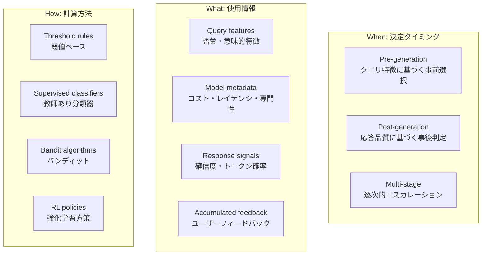
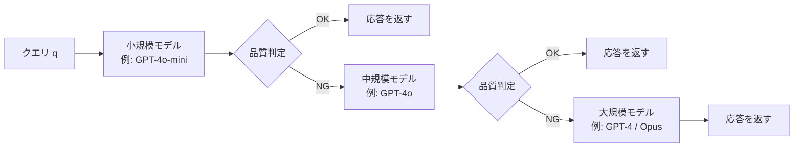

本記事は [Dynamic Model Routing and Cascading for Efficient LLM Inference: A Survey (arXiv:2603.04445)](https://arxiv.org/abs/2603.04445) の解説記事です。

## 論文概要（Abstract）

複数のLLMが利用可能な推論環境において、クエリ特性に応じて最適なモデルを動的に選択する「モデルルーティング」の研究を包括的にサーベイした論文です。著者らは、単純なクエリには小規模モデルで十分である一方、複雑なタスクにはより能力の高いモデルが必要であるにもかかわらず、静的デプロイメントではクエリ特性を考慮できないという課題を指摘しています。本サーベイでは、Mixture-of-Experts（MoE）アーキテクチャとは異なるマルチLLMルーティングアプローチを6つのパラダイムに分類し、3次元の設計空間フレームワークを提案しています。

この記事は [Zenn記事: Function Callingコスト最適化入門：トークン消費を70%削減する5つの実装テクニック](https://zenn.dev/0h_n0/articles/d16764d2f38be3) の深掘りです。Zenn記事ではFunction Callingのコスト最適化テクニックとしてハイブリッドルーティング（テクニック4）を実装面から紹介していますが、本サーベイはルーティング手法全体を学術的に体系化し、各パラダイムの理論的基盤と定量的評価を網羅しています。

## 情報源

- **arXiv ID**: 2603.04445
- **URL**: [https://arxiv.org/abs/2603.04445](https://arxiv.org/abs/2603.04445)
- **著者**: Yasmin Moslem, John D. Kelleher
- **発表年**: 2026年（v1: 2月、v2: 4月）
- **分野**: cs.NI（Networking and Internet Architecture）, cs.CL（Computation and Language）, cs.PF（Performance）
- **支援**: ADAPT Centre（Trinity College Dublin）, Huawei Ireland

## 背景と動機（Background & Motivation）

LLMの推論コストは、モデルの能力に応じて大幅に異なります。GPT-4クラスのフロンティアモデルは高品質な応答を生成する一方で、APIコストが高く、レイテンシも大きくなります。逆に、小規模モデル（GPT-4o-mini、DeepSeek等）はコスト効率に優れますが、複雑なタスクでは精度が低下します。

従来の静的デプロイメントでは、すべてのクエリを同一モデルで処理するため、以下の非効率が生じます。

- **過剰割当**: 単純なクエリにフロンティアモデルを使用し、不必要なコストが発生する
- **能力不足**: 複雑なクエリを小規模モデルで処理し、品質が低下する
- **一律のレイテンシ**: リアルタイム性が求められるクエリにも大規模モデルの推論時間が適用される

モデルルーティングは、この課題に対して「適切なクエリに適切なモデルを」という原則で、コスト・品質・レイテンシの三者間トレードオフを動的に最適化するアプローチです。著者らは、MoEアーキテクチャ（単一モデル内のエキスパート切り替え）とは区別し、独立した複数LLM間のインテリジェントな選択に焦点を当てています。

## 主要な貢献（Key Contributions）

- **6つのルーティングパラダイムの体系化**: Difficulty-aware、Human preference-aligned、Clustering-based、Reinforcement learning、Uncertainty-based、Cascadingの6分類
- **3次元設計空間フレームワーク**: When（決定タイミング）/ What（使用情報）/ How（計算方法）の3軸でルーティングシステムを特徴づける概念的枠組み
- **専用ベンチマークの整理**: RouterBench、RouterEval、LLMRouterBenchなど、ルーティング評価基盤の包括的なレビュー
- **定量的コスト削減効果の横断比較**: 各手法のコスト削減率と品質維持率の体系的な比較
- **5つの未解決課題の提示**: 汎化性能、マルチステージカスケード、マルチモーダリティ、オンライン適応、多目的最適化

## 技術的詳細（Technical Details）

### 3次元設計空間フレームワーク

著者らは、ルーティングシステムを以下の3つの直交する次元で特徴づけるフレームワークを提案しています。



このフレームワークにより、既存手法を統一的に比較・位置づけることが可能になります。例えばFrugalGPTはWhenがMulti-stage、Whatがresponse signals、HowがThreshold rulesに分類されます。

### パラダイム1: Difficulty-Aware Routing

クエリの複雑度を推定し、適切なモデルにルーティングするアプローチです。

**代表手法**:

| 手法 | ルーターモデル | 特徴 |
|------|-------------|------|
| **BEST-Route** | DeBERTa-v3-small | マルチヘッドルーターでクエリ難易度を推定、best-of-nnサンプリングで最適モデル選択。60%コスト削減 |
| **vLLM Semantic Router** | ModernBERT | Chain-of-Thought推論が必要なクエリを分類器で識別 |
| **GraphRouter** | GNN | タスク・クエリ・LLM間の関係をグラフニューラルネットワークでモデル化 |
| **EmbedLLM** | 行列分解 | モデル特性をコンパクトなベクトル埋め込みに圧縮し、効率的なマッチング |
| **IRT-Router** | IRT | 項目応答理論でLLMの能力とクエリ難易度を同時にモデル化 |
| **ICL-Router** | LLM | in-contextの能力ベクトルにより、再訓練なしでルーターの汎化を実現 |

ルーティングの基本的な定式化として、クエリ $q$ に対するモデル $m_i$ の選択は以下のように表現されます。

$$
m^* = \arg\max_{m_i \in \mathcal{M}} \; \text{score}(q, m_i) \quad \text{s.t.} \quad \text{cost}(m_i) \leq B
$$

ここで、$\mathcal{M}$ は利用可能なモデル集合、$B$ はコスト予算、$\text{score}(q, m_i)$ はクエリ $q$ に対するモデル $m_i$ の推定性能です。

### パラダイム2: Human Preference-Aligned Routing

人間のフィードバックデータ（Chatbot Arenaの対戦結果等）を活用してルーターを訓練するアプローチです。

**代表手法**:

| 手法 | 特徴 |
|------|------|
| **RouteLLM** | Chatbot Arenaデータからwin prediction modelを訓練し、strong/weak LLM間のトレードオフを最適化 |
| **Arch-Router** | 1.5Bパラメータモデル。ユーザーがドメイン・アクションのルーティングポリシーを再訓練なしに定義可能 |
| **Eagle** | 訓練不要。ELOランキングシステムでグローバル・ローカル能力を組み合わせてモデル選択 |
| **P2L** | プロンプト固有のBradley-Terry係数を動的に生成し、モデルをランキング |
| **Zooter** | QwenRMラベルによるreward-guided教師あり学習。mDeBERTa-v3-baseをルーターとして使用 |

RouteLLMのようなアプローチでは、モデル対 $(m_i, m_j)$ に対する勝率予測を以下で定式化しています。

$$
P(\text{win}(m_i) \mid q) = \sigma(f_\theta(q, m_i) - f_\theta(q, m_j))
$$

ここで $\sigma$ はシグモイド関数、$f_\theta$ はルーターの予測関数です。

### パラダイム3: Clustering-Based Routing

教師なしクラスタリングにより類似クエリをグループ化し、各クラスタに最適なモデルを割り当てるアプローチです。

- **UniRoute**: K-meansクラスタリングをラベルなしデータセットに適用し、コスト調整済みのクラスタ性能評価でモデルを割り当てる
- **Avengers-Pro**: 戦略的クラスタリングでコスト・性能のPareto最適フロンティアを確立し、最適配置を決定

### パラダイム4: Reinforcement Learning Routing

#### 方策最適化手法

強化学習（RL）の方策最適化アルゴリズムを用いてルーティングポリシーを学習するアプローチです。

| 手法 | アルゴリズム | 主要成果 |
|------|-----------|---------|
| **Router-R1** | PPO（Qwen2.5-3B / LLaMA-3.2-3B） | 内部推論（"think"アクション）とモデル選択（"route"アクション）を交互実行 |
| **R2-Reasoner** | GRPO | Task DecomposerとSubtask Allocatorで複雑タスクを分解。84.46%のAPIコスト削減 |
| **SCOPE** | GRPO + モデルフィンガープリント | 未知モデルへの汎化を実現する性能推定器 |

R2-Reasonerの報酬関数は、著者らによると品質とコストの二項対立を以下のように定式化しています。

$$
R = \alpha \cdot \text{Quality}(y, y^*) - (1 - \alpha) \cdot \frac{\text{Cost}(m_i)}{\text{Cost}_{\max}}
$$

ここで $y$ はモデル出力、$y^*$ は正解、$\alpha$ は品質重視度のハイパーパラメータ、$\text{Cost}(m_i)$ はモデル $m_i$ の使用コストです。

#### バンディット手法

オンライン学習の枠組みで、継続的な探索・活用のトレードオフを扱うアプローチです。

| 手法 | アルゴリズム | 主要成果 |
|------|-----------|---------|
| **MetaLLM** | Multi-Armed Bandit | 正解を返す最も安価なモデルを選択 |
| **MixLLM** | Contextual Bandit + Policy Gradient | GPT-4品質の97.25%を24.18%のコストで達成（時間制約下） |
| **PILOT** | LinUCB + コスト制約 | オフライン選好データとオンラインバイナリフィードバックを統合 |
| **GreenServ** | Energy-efficient Contextual Bandit | 22%精度向上かつ31%エネルギー消費削減 |

MixLLMのcontextual banditの定式化では、各ラウンド $t$ において文脈 $c_t$（クエリ特徴）を観測し、アーム $a_t$（モデル選択）を引くことで報酬 $r_t$ を得ます。

$$
a_t = \arg\max_{a \in \mathcal{A}} \; \hat{\mu}_a(c_t) + \beta \cdot \hat{\sigma}_a(c_t) \quad \text{s.t.} \quad \text{cost}(a) \leq B_t
$$

ここで $\hat{\mu}_a(c_t)$ は推定報酬、$\hat{\sigma}_a(c_t)$ は不確実性、$\beta$ は探索パラメータ、$B_t$ は時刻 $t$ の残り予算です。

### パラダイム5: Uncertainty-Based Routing

モデルの確信度や不確実性を推定し、確信度が低い場合により能力の高いモデルにエスカレーションするアプローチです。

- **CP-Router**: Conformal Predictionをロジットに適用し、LLMとLarge Reasoning Model間のルーティングを統計的保証付きで実行する。信頼区間 $1 - \alpha$ の下でのカバレッジ保証を提供
- **Probeベース手法**: 隠れ状態に分類器を設置し、確信度推定の信頼性を向上
- **AutoMix**: Few-shot自己検証によりPOMDP（部分観測マルコフ決定過程）ベースのルーティング決定を実現。ファインチューニング不要
- **Self-REF**: 軽量ファインチューニングで確信度トークンを導入し、下流のルーティング判定に活用

### パラダイム6: Cascading

複数モデルを逐次的に試行し、品質基準を満たした時点で停止する段階的エスカレーション戦略です。



**代表手法**:

| 手法 | 構成 | 特徴 |
|------|------|------|
| **FrugalGPT** | LLMルーター + DistilBERT品質推定器 + コスト考慮停止判定 | 3コンポーネント構成の先駆的カスケードシステム |
| **Cascade Routing** | 統一フレームワーク | 各ステップで最適モデルを反復的に選択 |
| **LM-Blender** | Pair Ranker + Gen Fuser | 複数モデルの出力をランキング・融合するアンサンブルフレームワーク |

FrugalGPTのカスケード判定は以下のように定式化されています。

$$
\text{STOP}(y_k) = \mathbb{1}\left[\hat{q}(y_k) \geq \tau_k \;\land\; \sum_{j=1}^{k} c_j \leq B\right]
$$

ここで $y_k$ はモデル $k$ の出力、$\hat{q}(y_k)$ は品質推定値、$\tau_k$ はモデル $k$ の品質閾値、$c_j$ はモデル $j$ のコスト、$B$ は総予算です。

### 本番システムの典型的な3段階パイプライン

著者らは、実運用システムが複数パラダイムを組み合わせた3段階の制御パイプラインを構成する傾向にあると指摘しています。

1. **Pre-router**: クエリ特徴・メタデータに基づく低コストな初期モデル選択
2. **Post-generation Verifier**: 効率モデルの出力に対する品質・不確実性推定
3. **Escalation Policy**: 受理・修正・拒否・上位モデルへの委譲を決定

## 実装のポイント（Implementation）

サーベイ論文の知見に基づく、ルーター設計のベストプラクティスを以下に整理します。

### ルーター選択の指針

```python
from dataclasses import dataclass
from enum import Enum


class RoutingParadigm(Enum):
    """6つのルーティングパラダイム"""
    DIFFICULTY_AWARE = "difficulty_aware"
    PREFERENCE_ALIGNED = "preference_aligned"
    CLUSTERING = "clustering"
    RL = "reinforcement_learning"
    UNCERTAINTY = "uncertainty"
    CASCADING = "cascading"


@dataclass
class RoutingRequirements:
    """ルーティング要件の定義"""
    has_labeled_data: bool
    has_preference_data: bool
    budget_constraint: float  # 0.0-1.0（コスト削減目標）
    latency_sensitive: bool
    model_count: int


def select_paradigm(req: RoutingRequirements) -> RoutingParadigm:
    """要件に基づいてルーティングパラダイムを選択する

    Args:
        req: ルーティング要件

    Returns:
        推奨されるルーティングパラダイム
    """
    # レイテンシ重視 → Pre-generation系が必須
    if req.latency_sensitive and req.has_labeled_data:
        return RoutingParadigm.DIFFICULTY_AWARE

    # 人間フィードバックデータあり → Preference-aligned
    if req.has_preference_data:
        return RoutingParadigm.PREFERENCE_ALIGNED

    # ラベルなし・コスト重視 → Clustering
    if not req.has_labeled_data and req.budget_constraint > 0.5:
        return RoutingParadigm.CLUSTERING

    # 高コスト削減目標 → Cascading
    if req.budget_constraint > 0.7:
        return RoutingParadigm.CASCADING

    # 継続的な最適化 → RL
    return RoutingParadigm.RL
```

### 設計上の考慮事項

著者らのサーベイから導出される実装上の重要な考慮事項は以下の通りです。

- **ルーター自体のコスト**: ルーターの推論コストがルーティングによる削減効果を上回らないこと。DeBERTa-v3-small（BEST-Route）やmDeBERTa-v3-base（Zooter）のような小規模分類器が好まれる理由はここにある
- **コールドスタート問題**: Banditベースの手法（MixLLM、PILOT）は初期段階で探索が必要。十分なデータが蓄積されるまでの性能低下に対処するため、オフライン選好データとの併用（PILOTのアプローチ）が有効
- **フォールバック戦略**: カスケードシステムでは、エスカレーション回数の上限設定と、最終モデルの品質保証が必要。FrugalGPTの3コンポーネント設計はこの要件を満たす参考例
- **モデル追加時の再訓練**: 新しいLLMがリリースされた際にルーターの再訓練が必要かどうかは実運用上の大きな制約。ICL-Routerのように再訓練なしで汎化するアプローチが注目される

## 実験結果（Results）

### 主要手法のコスト削減効果比較

著者らがサーベイした各手法の報告値を以下にまとめます。

| 手法 | パラダイム | コスト削減 | 品質維持率 | 特筆事項 |
|------|----------|----------|----------|---------|
| **MixLLM** | RL（Bandit） | 75.82% | GPT-4の97.25% | 時間制約下でのcontextual bandit |
| **R2-Reasoner** | RL（GRPO） | 84.46% | 推論精度維持 | タスク分解による効率化 |
| **GreenServ** | RL（Bandit） | エネルギー31%削減 | +22%精度向上 | エネルギー効率に焦点 |
| **BEST-Route** | Difficulty-aware | 60% | <1%性能低下 | DeBERTaベースの軽量ルーター |
| **FrugalGPT** | Cascading | 大幅削減 | 品質維持 | 3コンポーネントカスケード |
| **RouteLLM** | Preference | 設定可能 | Chatbot Arena準拠 | 人間選好データ活用 |

著者らは、MixLLMがGPT-4の品質の97.25%を24.18%のコストで達成したと報告しています。また、R2-Reasonerは複雑な推論タスクをサブタスクに分解することで、84.46%のAPIコスト削減を維持しつつ推論精度を保っていると報告されています。

### ベンチマーク比較

ルーティング手法の評価基盤として、著者らは以下の3つの主要ベンチマークを整理しています。

| ベンチマーク | 規模 | モデル数 | タスク | 特徴 |
|------------|------|--------|-------|------|
| **RouterBench** | 405k+事前計算出力 | 11 LLM | 7タスク（MMLU, MT-Bench, MBPP等） | 事前計算出力による効率的評価 |
| **RouterEval** | 200M+性能レコード | 8,500+ LLM | 12ベンチマーク | m-way分類（m=3,5,10,100,1000）に対応 |
| **LLMRouterBench** | 400k+インスタンス | 33モデル | 21データセット | 10ルーターベースライン付き |

RouterEvalが8,500以上のLLMをカバーしている点は注目に値します。モデル数が増加する実運用環境では、大規模なモデルプールからの選択が必要となるため、スケーラビリティの検証に重要な役割を果たしています。

### 評価指標の分類

著者らは評価指標を以下の2カテゴリに整理しています。

**性能指標**:
- ルーティング精度（正しいモデルを選択した割合）
- タスク性能（accuracy / BLEU / pass@k）
- Win rate（ベースラインに対する勝率）
- AUC

**効率指標**:
- レイテンシ（TTFT: Time-To-First-Token、TPOT: Time-Per-Output-Token）
- スループット（TPS: Tokens-Per-Second、QPS: Queries-Per-Second）
- Goodput（有効スループット）
- トークンあたりエネルギー消費
- カーボンフットプリント

GreenServのようなエネルギー効率を明示的に最適化する手法の登場は、LLM推論の環境負荷に対する学術的関心の高まりを反映しています。

## 実運用への応用（Practical Applications）

### Zenn記事のハイブリッドルーティングとの関連

Zenn記事（テクニック4）では、Function Callingのコスト最適化としてタスク複雑度に基づくハイブリッドルーティングを紹介しています。この手法は、本サーベイの分類ではDifficulty-aware routingに該当します。Zenn記事のルーティング実装（ツール数・ネストパラメータの有無・マルチステップ要否による3段階分類）は、BEST-RouteやvLLM Semantic Routerと同様の設計思想に基づいています。

本サーベイの知見を活用すると、Zenn記事のハイブリッドルーティングを以下のように拡張できる可能性があります。

- **RL-based最適化の導入**: 静的なルールベース（ツール数閾値）から、MixLLMのようなcontextual banditに移行することで、クエリ特徴に応じた動的な最適化が可能
- **カスケードとの併用**: FrugalGPTのような品質推定器を追加し、バジェットモデルの出力品質が低い場合にのみ上位モデルにエスカレーション
- **Conformal Predictionの活用**: CP-Routerのアプローチで、統計的保証付きのルーティング判定を実現

### 実装上のトレードオフ

各パラダイムの実運用適性を以下に整理します。

| 観点 | Difficulty-aware | Cascading | RL (Bandit) |
|------|-----------------|-----------|-------------|
| **初期コスト** | 訓練データ+分類器構築 | 品質推定器構築 | 探索フェーズのコスト |
| **運用負荷** | モデル追加時に再訓練 | 閾値チューニング | 自動適応 |
| **レイテンシ** | 低（Pre-generation） | 高（逐次試行） | 低（即時選択） |
| **コスト削減** | 中（~60%） | 高（タスク依存） | 高（~75-85%） |
| **品質保証** | ルーター精度に依存 | 最終モデルで保証可能 | 探索期間中は不安定 |

## 関連研究（Related Work）

- **Mixture-of-Experts (MoE)**: 単一モデル内でエキスパートモジュールを切り替えるアーキテクチャ。本サーベイが扱うモデル間ルーティングとは異なり、モデル内部のスパースアクティベーションに焦点を当てている。GShard、Switch Transformerが代表的
- **Prompt Optimization (DSPy, OPRO)**: プロンプトの最適化によりLLMの性能を向上させるアプローチ。モデルルーティングとは相補的であり、ルーティング先のモデルに対してプロンプト最適化を適用することで、さらなる効率化が期待できる
- **TSCG (Tool-Schema Compilation for Generation)**: JSONツールスキーマを構造化テキストに変換する決定論的コンパイラ（arXiv:2605.04107）。ルーティングとは異なるアプローチだが、52-57%のトークン削減により小規模モデルの精度回復（0% → 84.4%）を実現しており、ルーティングと組み合わせることでコスト削減効果を増幅できる可能性がある
- **LLMLingua / LLMLingua-2**: パープレキシティベースのプロンプト圧縮。2-5倍の圧縮を実現するがGPUを必要とし、ルーティングの前段階でプロンプトを圧縮する用途に適している

## まとめと今後の展望

本サーベイは、LLM推論の動的モデルルーティングを6つのパラダイムと3次元設計空間フレームワークで体系化した包括的なレビューです。MixLLMの97.25%品質維持・75.82%コスト削減、R2-Reasonerの84.46%コスト削減といった報告値は、ルーティング技術の実用的な価値を示しています。

著者らが指摘する未解決課題のうち、特に以下の3点が実務上のインパクトが大きいと考えられます。

1. **汎化性能**: 新しいLLMが頻繁にリリースされる中、再訓練なしでルーターが機能する汎化手法の確立
2. **マルチモーダルルーティング**: 画像・音声を含むマルチモーダルタスクへの拡張。ReLoPeやMMR-Benchが先駆的な取り組みだが、まだ研究の初期段階
3. **多目的最適化の統一フレームワーク**: 品質・コスト・レイテンシ・エネルギー効率を統一的に最適化する手法。現状の手法は1-2目的に限定されている

Function Callingのコスト最適化（Zenn記事）において、静的なルールベースのルーティングから、本サーベイで紹介されているbanditベースやカスケードベースの動的ルーティングへの移行は、次の実践的なステップとなり得ます。

## 参考文献

- **arXiv**: [Dynamic Model Routing and Cascading for Efficient LLM Inference: A Survey (arXiv:2603.04445)](https://arxiv.org/abs/2603.04445)
- **Related Zenn article**: [Function Callingコスト最適化入門：トークン消費を70%削減する5つの実装テクニック](https://zenn.dev/0h_n0/articles/d16764d2f38be3)
- **RouterBench**: [RouteLLM: Learning to Route LLMs with Preference Data](https://arxiv.org/abs/2406.18665)
- **FrugalGPT**: [FrugalGPT: How to Use Large Language Models While Reducing Cost and Improving Performance](https://arxiv.org/abs/2305.05176)
- **MixLLM**: [MixLLM: LLM Quantization with Global Mixed-precision between Output-channel and Token-level](https://arxiv.org/abs/2405.17846)
- **TSCG**: [Deterministic Tool-Schema Compilation for Agentic LLM Deployments (arXiv:2605.04107)](https://arxiv.org/abs/2605.04107)
