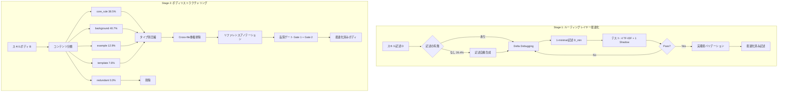

## 論文概要（Abstract）

本記事は [SkillReducer: Optimizing LLM Agent Skills for Token Efficiency](https://arxiv.org/abs/2603.29919) の解説記事です。

LLMエージェントにおいて、スキル（ツール定義・プロンプト内命令）はコンテキストウィンドウの大部分を消費するにもかかわらず、その構造的な非効率性はこれまで体系的に分析されてこなかった。著者らは55,315のLLMエージェントスキルを対象に大規模な実証分析を実施し、26.4%のスキルにルーティング記述が欠如していること、60%以上のボディコンテンツが非アクション可能であること、リファレンスファイルが1回の呼び出しで数万トークンを注入しうることを明らかにしている。これらの知見に基づき、ルーティングレイヤー最適化とボディリストラクチャリングの2段階からなる最適化フレームワーク「SkillReducer」を提案し、記述を48.0%、ボディを39.0%圧縮しつつ、機能品質を2.8%向上させたと報告している。

この記事は [Zenn記事: Function Callingコスト最適化入門：トークン消費を70%削減する5つの実装テクニック](https://zenn.dev/0h_n0/articles/d16764d2f38be3) の深掘りです。

## 情報源

- **arXiv ID**: 2603.29919
- **URL**: [https://arxiv.org/abs/2603.29919](https://arxiv.org/abs/2603.29919)
- **著者**: Yudong Gao, Zongjie Li, Yuanyuan Yuan, et al.
- **発表年**: 2026年
- **分野**: cs.SE（Software Engineering）

## 背景と動機

### LLMエージェントスキルのトークン非効率性

LLMベースのエージェント（Claude Code、Cursor、Windsurf等）は、ツール定義やプロンプト命令を「スキル」としてコンテキストウィンドウに注入して動作する。スキルは、ユーザーの指示に応じて適切なツールや動作を選択するための「ルーティング記述」と、実際の処理ロジックを含む「ボディ」の2層で構成される。

しかし、エージェントの機能が拡充されるにつれ、スキルの数と複雑さが増大し、コンテキストウィンドウの大部分がスキル定義で消費される問題が顕在化している。APIコスト増加の直接的要因となるだけでなく、重要な情報がスキル定義に埋もれてモデルの注意が散逸する問題（attention dilution）も指摘されている。

### 55,315スキルの実証分析

著者らは、Claude Code、Cursor、Windsurf、Cline、Roo Code等の主要LLMエージェントプラットフォームから55,315のスキルを収集し、以下の3つの構造的非効率性を特定している。

1. **ルーティング記述の欠如（26.4%）**: 全スキルの約4分の1にルーティング記述（いつ・どの条件でそのスキルを起動すべきかの説明）が存在しない。記述がないスキルは、LLMがユーザーの指示とスキルのマッチングを行う際に精度が低下する原因となる

2. **非アクション可能なボディコンテンツ（60%以上）**: スキルボディの内容を分類すると、背景説明（40.7%）が最も大きな割合を占め、続いて例示（12.9%）、テンプレート（7.6%）となっている。実際の動作に直結するコアルール（core_rule）は38.5%に過ぎず、残りの61.5%は即座にアクションに変換できないコンテンツである

3. **リファレンスファイルの過大注入**: 一部のスキルは外部ファイルを丸ごとコンテキストに読み込むため、1回の呼び出しで数万トークンが消費される。これらのリファレンスはスキルの一部のタスクにしか必要でないケースが多い

### 既存圧縮手法の限界

プロンプト圧縮の先行研究（LLMLingua、Gisting等）は汎用テキスト圧縮を目的としており、スキルの内部構造（ルーティング記述とボディの分離、コンテンツの機能的分類）を考慮していない。著者らの実験では、LLMLinguaをスキルに適用した場合、元の機能品質の82.0%しか保持できないと報告されている（論文Table 7より）。これは、スキル特有の構造を無視した一律圧縮が、ルーティングに不可欠なキーワードや動作指示を損傷するためと考えられる。

## 主要な貢献

著者らは以下の4点を主要な貢献として報告している。

- **大規模実証分析**: 55,315スキルを対象とした初の体系的分析により、スキルの構造的非効率性を定量化。ルーティング記述欠如（26.4%）、非アクション可能コンテンツ（60%超）、リファレンス過大注入の3種類の非効率性を特定
- **2段階最適化フレームワーク**: スキル構造に特化したルーティングレイヤー最適化（Stage 1）とボディリストラクチャリング（Stage 2）の2段階パイプラインを設計。汎用圧縮手法を大幅に上回る圧縮率と品質保持を実現
- **Less-is-More効果の発見**: 圧縮されたスキルがオリジナルより機能品質が2.8%向上するという反直感的な結果を報告。非本質的コンテンツの除去がコンテキストウィンドウ内のノイズを減少させ、モデルの注意集中を改善する
- **クロスモデル汎化の検証**: 5モデル（4ファミリー）での評価と外部ベンチマーク（SkillsBench）での検証により、フレームワークの汎化性能を確認

## 技術的詳細

### SkillReducerの全体アーキテクチャ

SkillReducerは、スキルの2層構造（ルーティング記述 + ボディ）に対応する2段階の最適化パイプラインで構成される。



### Stage 1: ルーティングレイヤー最適化

ルーティング記述は、LLMがユーザーの指示を受け取った際にどのスキルを起動すべきかを判断するための情報である。Stage 1では、この記述を最小限かつ正確に圧縮する。

#### Delta Debugging による1-minimal圧縮

著者らは、ソフトウェアテストの分野で確立されたDelta Debuggingアルゴリズムをスキル記述の圧縮に応用している。Delta Debuggingは、テストの失敗を引き起こす最小限の入力を特定するための二分探索ベースの手法であり、SkillReducerではこれを「ルーティングの正確性を維持する最小限の記述」を特定する問題に転用している。

スキル記述 $D$ をトークン列 $D = \{t_1, t_2, \ldots, t_n\}$ とする。Delta Debuggingは以下の性質を満たす部分集合 $D_{\min} \subseteq D$ を求める。

$$
D_{\min} = \arg\min_{D' \subseteq D} |D'| \quad \text{s.t.} \quad \text{RouteTest}(D') = \text{PASS}
$$

ここで、
- $D$: 元のスキル記述のトークン列
- $D_{\min}$: 1-minimal（どの1トークンを除去してもテストが失敗する）な最小記述
- $|D'|$: 部分集合 $D'$ のトークン数
- $\text{RouteTest}(D')$: 圧縮記述 $D'$ でルーティングが正しく機能するかのテスト

1-minimal性は以下の条件で定義される。

$$
\forall t_i \in D_{\min}: \text{RouteTest}(D_{\min} \setminus \{t_i\}) = \text{FAIL}
$$

すなわち、$D_{\min}$ からどの1トークンを取り除いてもルーティングテストが失敗する、これ以上削れない最小の記述である。

#### シミュレーテッドオラクルによるルーティングテスト

Delta Debuggingの各反復で実行されるルーティングテストには、コスト効率と精度のバランスを考慮した「シミュレーテッドオラクル」が用いられる。テストセットは以下の5つのディストラクタスキルで構成される。

- **4つのTF-IDFディストラクタ**: TF-IDFベクトル空間でターゲットスキルに最も類似する4スキルを選択。意味的に近い紛らわしいスキルとの識別能力を検証する
- **1つのAdversarial "Shadow"スキル**: LLMを使ってターゲットスキルの記述を言い換えた偽スキルを生成。記述が類似していてもルーティングが正しく機能するかを検証する

テストは以下の手順で実行される。

1. 圧縮候補の記述 $D'$ をターゲットスキルのルーティング記述として設定
2. 5つのディストラクタスキルとともにLLMに提示
3. テストクエリに対してLLMが正しいスキルを選択するかを検証
4. 全テストケースでpassすれば $\text{RouteTest}(D') = \text{PASS}$

#### 記述欠如スキルへの自動生成

26.4%のスキルにはルーティング記述が存在しないため、Delta Debuggingの前段階として記述の自動生成を行う。スキルのボディコンテンツからLLMを用いて「いつこのスキルを使うべきか」を要約した記述を生成し、その後Delta Debuggingで圧縮する。

#### 実環境バリデーション

シミュレーテッドオラクルでpassした圧縮記述は、最終段階としてClaude Code CLI上で実環境バリデーションを行う。これにより、シミュレーション環境と実際のエージェント動作の差異による品質低下を防止している。著者らは536スキルの評価で100%のルーティング保存率を達成したと報告している。

### Stage 2: ボディリストラクチャリング（Progressive Disclosure）

Stage 2では、スキルボディの内容を機能的に分類し、タイプごとに異なる圧縮戦略を適用する。著者らはこのアプローチを「Progressive Disclosure」と呼んでおり、必要な情報を必要な時にのみ提示する設計原則に基づいている。

#### コンテンツ分類

スキルボディの各セクションを以下の5カテゴリに分類する。

| カテゴリ | 割合 | 説明 |
|---------|------|------|
| core_rule | 38.5% | スキルの動作を直接規定するルール・制約 |
| background | 40.7% | 背景説明・動機・文脈情報 |
| example | 12.9% | 入出力例・使用例 |
| template | 7.6% | コード・設定のテンプレート |
| redundant | 0.3% | 重複・冗長なコンテンツ |

#### タイプ別圧縮戦略

各カテゴリに対して以下の圧縮戦略を適用する。

- **core_rule（マージ）**: 意味的に重複するルールをLLMで統合し、矛盾がないことを検証する。ルール間の論理的整合性を保ちつつ、冗長な表現を排除する
- **example（代表例選択）**: 複数の使用例が含まれるスキルでは、カバレッジが最大となる代表例のみを残す。類似例の除去により平均12.9%のトークンを削減する
- **template（重複排除）**: 同一パターンのテンプレートが複数存在する場合、パラメータ化された単一テンプレートに統合する
- **background（要約）**: 背景説明をLLMで要約する。最も大きな割合（40.7%）を占めるため、圧縮効果が最も高い
- **redundant（削除）**: 完全に冗長なコンテンツは削除する

#### Cross-file重複排除

複数のスキルが同一のリファレンスファイルを参照するケースでは、重複するコンテンツをスキル間で共有する形にリストラクチャリングする。著者らのアブレーション実験では、この重複排除が最も安全な圧縮操作であり、Retention 1.000（品質低下なし）を達成したと報告されている。

#### リファレンスアノテーション

リファレンスファイルの無条件注入を避けるため、各リファレンスに「when句」（いつ必要か）と「キーワード」（どのトピックに関連するか）のアノテーションを付与する。これにより、タスクに関連するリファレンスのみが動的にロードされる。

```python
# リファレンスアノテーションの概念的な構造
from dataclasses import dataclass


@dataclass
class AnnotatedReference:
    """アノテーション付きリファレンスの定義

    Attributes:
        file_path: リファレンスファイルのパス
        when_clause: このリファレンスが必要になる条件
        keywords: 関連キーワードのリスト
        content: リファレンスの内容
    """
    file_path: str
    when_clause: str
    keywords: list[str]
    content: str


def should_load_reference(
    ref: AnnotatedReference,
    task_description: str,
    task_keywords: list[str],
) -> bool:
    """タスクに基づいてリファレンスをロードすべきか判定する

    Args:
        ref: アノテーション付きリファレンス
        task_description: 現在のタスクの説明
        task_keywords: タスクから抽出されたキーワード

    Returns:
        リファレンスをロードすべきならTrue
    """
    keyword_overlap = set(ref.keywords) & set(task_keywords)
    return len(keyword_overlap) > 0
```

### 品質ゲート

圧縮されたスキルの品質を保証するため、2段階の品質ゲートを設けている。

**Gate 1（忠実性検証）**: 圧縮後のスキルが元のスキルの意味を正確に保持しているかをLLMで検証する。元のスキルと圧縮後のスキルをペアで比較し、情報の欠落や意味の変質がないことを確認する。

**Gate 2（タスクベース評価）**: 圧縮後のスキルを使って実際のタスクを実行し、元のスキルと同等の品質で完了できるかを検証する。パス率86.0%（つまり86%のタスクで圧縮後も品質を維持）が報告されている。

## 実装のポイント

### 使用モデルと設定

著者らの実装では、以下のモデルが使用されている。

- **DeepSeek-V3**: コンテンツ分類、タイプ別圧縮、品質ゲート1（忠実性検証）に使用。コスト効率に優れた大規模モデルとして選択
- **DeepSeek-R1**: 品質ゲート2（タスクベース評価）やAdversarial Shadowスキル生成等、推論能力を要するタスクに使用
- **Claude Code CLI**: 実環境バリデーションに使用。Stage 1のルーティング最適化結果を実際のエージェント環境で検証する

### Delta Debugging の計算量

Delta Debuggingの最悪計算量は $O(n \log n)$（$n$: トークン数）であるが、スキル記述の平均長は比較的短い（圧縮前で数百トークン程度）ため、実用上の計算コストは許容範囲内である。著者らは、1スキルあたりの平均処理時間については言及していないが、オフラインバッチ処理として実行される設計のため、リアルタイム性は要求されない。

### 分類駆動圧縮の重要性

アブレーション実験（論文の結果より）では、コンテンツ分類を省略して一律に圧縮した場合、Retentionが0.919まで低下する（分類ありの場合は0.949）。6.8ポイントの差は、core_ruleとbackgroundを区別せずに圧縮するとコア動作に必要な情報まで損傷されることを意味している。分類駆動圧縮がSkillReducerの性能の鍵であることを示す結果である。

## Production Deployment Guide

SkillReducerのスキル圧縮パイプラインをAWS上にデプロイする場合のアーキテクチャと設定を示す。SkillReducerはオフラインのバッチ処理（スキル圧縮）とオンラインの動的参照ロード（リファレンスアノテーション）の2つの動作モードを持つため、それぞれに適した構成を設計する。

### AWS実装パターン（コスト最適化重視）

**トラフィック量別の推奨構成**:

| 構成 | トラフィック | 主要サービス | 月額概算 |
|------|-----------|-----------|---------|
| Small | ~100スキル/月 | Lambda + Bedrock + S3 | $60-150 |
| Medium | ~1,000スキル/月 | ECS Fargate + Bedrock + DynamoDB | $350-800 |
| Large | 10,000+スキル/月 | EKS + Spot + DynamoDB + ElastiCache | $2,200-5,000 |

**Small構成（Serverless）の詳細**:
- **Lambda**（512MB, ARM64, タイムアウト900秒）: Delta Debuggingの反復処理とコンテンツ分類のバッチ実行。ARM64 Graviton2で同等性能を20%低コストで実現
- **Amazon Bedrock**（Claude 3.5 Haiku）: コンテンツ分類・タイプ別圧縮・忠実性検証。Batch API使用で50%コスト削減
- **S3**（Intelligent-Tiering）: 元スキルファイル・圧縮済みスキル・アノテーション付きリファレンスの保存
- **DynamoDB**（On-Demand）: スキルメタデータとリファレンスアノテーションのインデックス

**Medium構成（Hybrid）の詳細**:
- **ECS Fargate**（2 vCPU, 4GB RAM）: Delta Debuggingの並列実行。タスク定義でスキル単位の並列度を制御
- **Bedrock**（Claude 3.5 Sonnet + Haiku）: 複雑な分類にはSonnet、定型的な圧縮にはHaikuを使い分け
- **Step Functions**: スキル圧縮パイプラインのオーケストレーション（分類→圧縮→品質ゲート→バリデーション）

**コスト削減テクニック**:
- Bedrock Batch API使用で50%削減（オフラインのDelta Debugging反復に最適）
- Prompt Caching有効化で30-90%削減（同一スキルの反復テストでキャッシュヒット率が高い）
- Spot Instances活用で最大90%削減（Large構成のEKSワーカーノード）
- Reserved Instances購入で最大72%削減（Medium/Large構成の常時稼働コンポーネント）

**コスト試算の注意事項**: 上記は2026年7月時点のAWS ap-northeast-1（東京）リージョン料金に基づく概算値である。実際のコストはスキルの平均長、Delta Debuggingの反復回数、Bedrockモデルの選択により大幅に変動する。最新料金はAWS料金計算ツールで確認を推奨する。

### Terraformインフラコード

**Small構成（Serverless）: Lambda + Bedrock + DynamoDB**

```hcl
# SkillReducer Small構成 - Serverless
# 2026年7月時点の最新Terraformプロバイダ・モジュール使用

terraform {
  required_version = ">= 1.9"
  required_providers {
    aws = {
      source  = "hashicorp/aws"
      version = "~> 5.60"
    }
  }
}

provider "aws" {
  region = "ap-northeast-1"
}

# --- IAMロール（最小権限） ---
resource "aws_iam_role" "skill_reducer_lambda" {
  name = "skill-reducer-lambda-role"
  assume_role_policy = jsonencode({
    Version = "2012-10-17"
    Statement = [{
      Action = "sts:AssumeRole"
      Effect = "Allow"
      Principal = { Service = "lambda.amazonaws.com" }
    }]
  })
}

resource "aws_iam_role_policy" "skill_reducer_policy" {
  name = "skill-reducer-policy"
  role = aws_iam_role.skill_reducer_lambda.id
  policy = jsonencode({
    Version = "2012-10-17"
    Statement = [
      {
        # Bedrock: 推論のみ許可
        Effect   = "Allow"
        Action   = ["bedrock:InvokeModel", "bedrock:InvokeModelWithResponseStream"]
        Resource = "arn:aws:bedrock:ap-northeast-1::foundation-model/anthropic.claude-3-5-haiku-*"
      },
      {
        # DynamoDB: スキルメタデータの読み書き
        Effect   = "Allow"
        Action   = ["dynamodb:GetItem", "dynamodb:PutItem", "dynamodb:Query", "dynamodb:UpdateItem"]
        Resource = aws_dynamodb_table.skill_metadata.arn
      },
      {
        # S3: スキルファイルの読み書き
        Effect   = "Allow"
        Action   = ["s3:GetObject", "s3:PutObject", "s3:ListBucket"]
        Resource = [aws_s3_bucket.skill_store.arn, "${aws_s3_bucket.skill_store.arn}/*"]
      },
      {
        # CloudWatch Logs
        Effect   = "Allow"
        Action   = ["logs:CreateLogGroup", "logs:CreateLogStream", "logs:PutLogEvents"]
        Resource = "arn:aws:logs:ap-northeast-1:*:*"
      }
    ]
  })
}

# --- S3: スキルファイル保存 ---
resource "aws_s3_bucket" "skill_store" {
  bucket = "skill-reducer-store-${data.aws_caller_identity.current.account_id}"
}

resource "aws_s3_bucket_server_side_encryption_configuration" "skill_store" {
  bucket = aws_s3_bucket.skill_store.id
  rule {
    apply_server_side_encryption_by_default {
      sse_algorithm = "aws:kms"
    }
  }
}

resource "aws_s3_bucket_intelligent_tiering_configuration" "skill_store" {
  bucket = aws_s3_bucket.skill_store.id
  name   = "skill-tiering"
  tiering {
    access_tier = "ARCHIVE_ACCESS"
    days        = 90
  }
}

# --- DynamoDB: スキルメタデータ ---
resource "aws_dynamodb_table" "skill_metadata" {
  name         = "skill-reducer-metadata"
  billing_mode = "PAY_PER_REQUEST"  # On-Demand: 低トラフィック向けコスト最適
  hash_key     = "skill_id"

  attribute {
    name = "skill_id"
    type = "S"
  }

  server_side_encryption {
    enabled = true  # KMS暗号化
  }

  point_in_time_recovery {
    enabled = true
  }
}

# --- Lambda: スキル圧縮処理 ---
resource "aws_lambda_function" "skill_reducer" {
  function_name = "skill-reducer-processor"
  role          = aws_iam_role.skill_reducer_lambda.arn
  runtime       = "python3.12"
  handler       = "handler.lambda_handler"
  architectures = ["arm64"]  # Graviton2で20%コスト削減
  memory_size   = 512
  timeout       = 900  # Delta Debuggingの反復に十分な時間

  environment {
    variables = {
      SKILL_TABLE   = aws_dynamodb_table.skill_metadata.name
      SKILL_BUCKET  = aws_s3_bucket.skill_store.id
      BEDROCK_MODEL = "anthropic.claude-3-5-haiku-20241022-v1:0"
    }
  }

  tracing_config {
    mode = "Active"  # X-Ray有効化
  }

  filename         = "lambda_package.zip"
  source_code_hash = filebase64sha256("lambda_package.zip")
}

# --- CloudWatchアラーム: コスト監視 ---
resource "aws_cloudwatch_metric_alarm" "lambda_duration" {
  alarm_name          = "skill-reducer-duration-high"
  comparison_operator = "GreaterThanThreshold"
  evaluation_periods  = 3
  metric_name         = "Duration"
  namespace           = "AWS/Lambda"
  period              = 300
  statistic           = "Average"
  threshold           = 600000  # 10分超過で警告
  alarm_description   = "Lambda実行時間が10分を超過"
  dimensions = {
    FunctionName = aws_lambda_function.skill_reducer.function_name
  }
}

data "aws_caller_identity" "current" {}
```

**Large構成（Container）: EKS + Karpenter + Spot Instances**

```hcl
# SkillReducer Large構成 - Container
# EKS 1.31 + Karpenter v1.1

module "eks" {
  source          = "terraform-aws-modules/eks/aws"
  version         = "~> 20.24"
  cluster_name    = "skill-reducer-cluster"
  cluster_version = "1.31"

  vpc_id     = module.vpc.vpc_id
  subnet_ids = module.vpc.private_subnets

  # パブリックアクセス最小化
  cluster_endpoint_public_access = false
  cluster_endpoint_private_access = true

  # KMS暗号化
  cluster_encryption_config = {
    provider_key_arn = aws_kms_key.eks.arn
    resources        = ["secrets"]
  }
}

# --- Karpenter: Spot優先の自動スケーリング ---
resource "kubectl_manifest" "karpenter_nodepool" {
  yaml_body = yamlencode({
    apiVersion = "karpenter.sh/v1"
    kind       = "NodePool"
    metadata   = { name = "skill-reducer-pool" }
    spec = {
      template = {
        spec = {
          requirements = [
            { key = "karpenter.sh/capacity-type", operator = "In", values = ["spot", "on-demand"] },
            { key = "node.kubernetes.io/instance-type", operator = "In",
              values = ["m7i.xlarge", "m7a.xlarge", "m6i.xlarge", "c7i.xlarge"] },
          ]
          nodeClassRef = { group = "karpenter.k8s.aws", kind = "EC2NodeClass", name = "default" }
        }
      }
      limits   = { cpu = "64", memory = "128Gi" }  # 予算上限
      disruption = {
        consolidationPolicy = "WhenEmptyOrUnderutilized"
        consolidateAfter    = "30s"
      }
    }
  })
}

# --- Secrets Manager: Bedrock設定 ---
resource "aws_secretsmanager_secret" "bedrock_config" {
  name       = "skill-reducer/bedrock-config"
  kms_key_id = aws_kms_key.eks.arn
}

# --- AWS Budgets: 予算アラート ---
resource "aws_budgets_budget" "skill_reducer" {
  name         = "skill-reducer-monthly"
  budget_type  = "COST"
  limit_amount = "5000"
  limit_unit   = "USD"
  time_unit    = "MONTHLY"

  notification {
    comparison_operator       = "GREATER_THAN"
    threshold                 = 80
    threshold_type            = "PERCENTAGE"
    notification_type         = "ACTUAL"
    subscriber_email_addresses = ["ops@example.com"]
  }
}
```

### 運用・監視設定

**CloudWatch Logs Insights クエリ**: Delta Debuggingの反復回数とトークン使用量を追跡する。

```
# コスト異常検知: 1時間あたりのBedrockトークン使用量
fields @timestamp, @message
| filter @message like /bedrock_invoke/
| stats sum(input_tokens) as total_input, sum(output_tokens) as total_output by bin(1h)
| filter total_input > 500000
| sort @timestamp desc

# レイテンシ分析: Delta Debugging反復あたりの処理時間
fields @timestamp, skill_id, iteration_count, duration_ms
| filter event = "delta_debugging_complete"
| stats avg(duration_ms) as avg_ms, pct(duration_ms, 95) as p95_ms, pct(duration_ms, 99) as p99_ms
```

**CloudWatch アラーム設定（Python）**:

```python
import boto3


def create_token_spike_alarm(function_name: str, sns_topic_arn: str) -> None:
    """Bedrockトークン使用量スパイク検知アラームを作成する

    Args:
        function_name: Lambda関数名
        sns_topic_arn: 通知先SNSトピックARN
    """
    client = boto3.client("cloudwatch", region_name="ap-northeast-1")
    client.put_metric_alarm(
        AlarmName=f"{function_name}-token-spike",
        MetricName="InputTokenCount",
        Namespace="AWS/Bedrock",
        Statistic="Sum",
        Period=3600,
        EvaluationPeriods=1,
        Threshold=1000000,
        ComparisonOperator="GreaterThanThreshold",
        AlarmActions=[sns_topic_arn],
        AlarmDescription="Bedrockトークン使用量が100万/時を超過",
    )
```

**X-Ray トレーシング設定（Python）**:

```python
from aws_xray_sdk.core import xray_recorder, patch_all


def configure_xray_tracing() -> None:
    """X-Rayトレーシングを設定する"""
    xray_recorder.configure(service="skill-reducer")
    patch_all()  # boto3自動計装


def trace_delta_debugging(skill_id: str, iteration: int, tokens_used: int) -> None:
    """Delta Debuggingの反復をトレースする

    Args:
        skill_id: 処理中のスキルID
        iteration: 現在の反復回数
        tokens_used: 使用トークン数
    """
    subsegment = xray_recorder.begin_subsegment("delta_debugging_iteration")
    subsegment.put_annotation("skill_id", skill_id)
    subsegment.put_metadata("iteration", iteration)
    subsegment.put_metadata("tokens_used", tokens_used)
    xray_recorder.end_subsegment()
```

**Cost Explorer自動レポート（Python）**:

```python
import datetime

import boto3


def get_daily_cost_report() -> dict:
    """日次コストレポートを取得する

    Returns:
        Bedrock・Lambda・EKSのコスト内訳
    """
    client = boto3.client("ce", region_name="us-east-1")
    today = datetime.date.today()
    yesterday = today - datetime.timedelta(days=1)

    response = client.get_cost_and_usage(
        TimePeriod={"Start": yesterday.isoformat(), "End": today.isoformat()},
        Granularity="DAILY",
        Metrics=["UnblendedCost"],
        GroupBy=[{"Type": "DIMENSION", "Key": "SERVICE"}],
        Filter={
            "Or": [
                {"Dimensions": {"Key": "SERVICE", "Values": ["Amazon Bedrock"]}},
                {"Dimensions": {"Key": "SERVICE", "Values": ["AWS Lambda"]}},
                {"Dimensions": {"Key": "SERVICE", "Values": ["Amazon Elastic Kubernetes Service"]}},
            ]
        },
    )

    costs = {}
    for group in response["ResultsByTime"][0]["Groups"]:
        service = group["Keys"][0]
        amount = float(group["Metrics"]["UnblendedCost"]["Amount"])
        costs[service] = amount

    total = sum(costs.values())
    if total > 100:
        sns = boto3.client("sns", region_name="ap-northeast-1")
        sns.publish(
            TopicArn="arn:aws:sns:ap-northeast-1:ACCOUNT:skill-reducer-alerts",
            Message=f"日次コスト ${total:.2f} が $100 を超過: {costs}",
            Subject="SkillReducer コスト超過アラート",
        )

    return costs
```

### コスト最適化チェックリスト

**アーキテクチャ選択**:
- [ ] スキル処理量に応じた構成を選択（~100/月: Serverless、~1,000/月: Hybrid、10,000+/月: Container）
- [ ] Delta Debuggingのバッチ処理にはServerless構成が最もコスト効率が高い
- [ ] リアルタイムのリファレンスアノテーション判定にはDynamoDB + Lambda構成を検討

**リソース最適化**:
- [ ] EC2/EKS: Spot Instances優先（Karpenter `spot` を `on-demand` より前に指定）
- [ ] Reserved Instances: 1年コミットで常時稼働コンポーネントのコスト削減
- [ ] Savings Plans: Compute Savings Plansで Lambda + Fargate を横断的に割引
- [ ] Lambda: ARM64（Graviton2）で20%コスト削減、メモリサイズは512MBを基準に調整
- [ ] ECS/EKS: Karpenter consolidationPolicy で未使用ノードを自動縮退

**LLMコスト削減**:
- [ ] Bedrock Batch API: Delta Debuggingの反復はリアルタイム性不要のため50%削減
- [ ] Prompt Caching: 同一スキルの反復テストでキャッシュヒット率80%以上を目標
- [ ] モデル選択ロジック: 分類・圧縮にはHaiku、品質ゲートにはSonnetを使い分け
- [ ] トークン数制限: 入力スキルの最大長を制限し、超過時は事前分割

**監視・アラート**:
- [ ] AWS Budgets: 月額予算の80%到達で通知設定
- [ ] CloudWatch アラーム: Bedrockトークン使用量・Lambda実行時間の異常検知
- [ ] Cost Anomaly Detection: サービスレベルの異常検知を有効化
- [ ] 日次コストレポート: Cost Explorer APIで自動集計・SNS通知

**リソース管理**:
- [ ] 未使用リソース: 圧縮済みの元スキルファイルをS3 Intelligent-Tieringでアーカイブ
- [ ] タグ戦略: `project:skill-reducer`、`env:prod/dev`、`cost-center:agent-ops` を全リソースに付与
- [ ] ライフサイクルポリシー: CloudWatch Logsの保持期間を90日に設定
- [ ] 開発環境夜間停止: EKS開発クラスタのノード数を0にスケールダウン（Karpenter limits調整）

## 実験結果

### 圧縮率と品質評価

著者らは、SkillReducerの評価結果を以下のように報告している。

| 指標 | 値 | 95%信頼区間 |
|------|-----|-----------|
| 記述圧縮率 | 48.0% | [45.2%, 50.8%] |
| ボディ圧縮率 | 39.0% | [36.2%, 41.8%] |
| 機能品質変化 | +2.8%向上 | — |
| 品質ゲートパス率 | 86.0% | — |
| ルーティング保存率 | 100% (536/536) | — |

記述圧縮率48.0%は、Delta Debuggingにより平均して元の記述の約半分のトークンでルーティングが正しく機能することを意味する。ボディ圧縮率39.0%は、コンテンツ分類に基づく選択的圧縮により、約4割のトークンを削減しつつコア動作を維持できることを示している。

### ベースライン比較

著者らは、50スキルを対象に以下のベースライン手法との比較を報告している（論文Table 7より）。

| 手法 | スコア | Retention |
|------|-------|-----------|
| Original（圧縮なし） | 0.921 | — |
| **SkillReducer** | **0.909** | **0.949** |
| LLM direct（LLMに直接圧縮を指示） | 0.866 | 0.918 |
| Truncation（末尾切り捨て） | 0.791 | 0.845 |
| LLMLingua（トークンレベル圧縮） | 0.767 | 0.820 |
| Random（ランダム削除） | 0.694 | 0.750 |

SkillReducerのRetention 0.949は、2位のLLM direct（0.918）を3.1ポイント上回っている。LLMLinguaは汎用テキスト圧縮手法であるためスキル構造を考慮できず、Retention 0.820にとどまっている。Truncationはスキルの末尾にある例示やテンプレートを無差別に切り捨てるため、重要な動作ルールが後半に配置されているスキルで大きく品質が低下する。

### クロスモデル・フレームワーク汎化

著者らは、SkillReducerで圧縮されたスキルの汎化性能を5モデル（4ファミリー）で検証している。平均Retention 0.965が報告されており、特定のモデルに過適合していないことが確認されている。

さらに、外部ベンチマーク「SkillsBench」での検証では、87タスク全てでpassが確認され、圧縮による回帰がゼロであることが報告されている。これは、SkillReducerの圧縮がスキルのコア動作を損なわず、異なるタスク・モデルの組み合わせでも安定して機能することを示唆している。

### Less-is-More効果の分析

著者らが報告している最も注目すべき結果は、圧縮されたスキルがオリジナルよりも2.8%高い機能品質を達成したことである。この「Less-is-More」効果について、著者らは以下の仮説を提示している。

- **Attention Dilution の軽減**: 非本質的なコンテンツ（背景説明40.7%、冗長コンテンツ0.3%等）の除去により、LLMの注意がコアルールに集中する
- **ノイズ除去**: 曖昧な例示や重複テンプレートが、モデルの動作判断を混乱させる要因（ディストラクタ）として機能していた可能性がある

この効果は、先行研究におけるプロンプトエンジニアリングの知見（簡潔なプロンプトが冗長なプロンプトを上回るケースがある）と整合的である。

### アブレーション実験

著者らのアブレーション実験から、各コンポーネントの寄与が明らかにされている。

| コンポーネント | Retention | 備考 |
|-------------|-----------|------|
| 全コンポーネント | 0.949 | ベースライン |
| 分類駆動圧縮なし | 0.919 | -6.8pp、最大の品質低下 |
| リファレンス重複排除のみ | 1.000 | 最も安全な操作 |

分類駆動圧縮が最も重要なコンポーネントであり、これを省略すると6.8ポイントのRetention低下が発生する。一方、Cross-fileリファレンス重複排除は品質低下なし（Retention 1.000）で圧縮を実現でき、最もリスクの低い最適化手段である。

## 実運用への応用

### Zenn記事との関連

関連Zenn記事「[Function Callingコスト最適化入門：トークン消費を70%削減する5つの実装テクニック](https://zenn.dev/0h_n0/articles/d16764d2f38be3)」で紹介されているテクニック2「スキーマ圧縮」は、SkillReducerのStage 2（ボディリストラクチャリング）と密接に関連している。

Zenn記事のスキーマ圧縮はFunction Callingのツール定義（JSON Schema）からdescriptionフィールドの冗長な記述を削減する手法であるが、SkillReducerはこれをさらに体系化し、コンテンツを5カテゴリに分類した上でタイプ別の圧縮戦略を適用する。特に、背景説明（background）の要約と例示（example）の代表例選択は、手動のスキーマ圧縮では見落としがちな最適化ポイントである。

### プロダクション適用のポイント

SkillReducerを実運用のLLMエージェントに適用する際は、以下の点を考慮する必要がある。

1. **段階的適用**: まずリスクの低いリファレンス重複排除（Retention 1.000）から着手し、効果を測定した上でボディリストラクチャリング、ルーティング最適化の順に適用する
2. **品質モニタリング**: 圧縮前後でスキルのルーティング精度とタスク完了率を継続的に計測し、回帰が発生した場合は圧縮を巻き戻す仕組みが必要
3. **コスト効果**: 記述48%・ボディ39%の圧縮は、LLM APIの入力トークンコストの直接的な削減につながる。1リクエストあたり数十スキルが注入される大規模エージェントでは、月間コストの大幅な削減が期待できる

## 関連研究

- **TSCG（Task-Specific Prompt Compression via Gisting）**: タスク固有のGistトークンを学習し、プロンプトを圧縮する手法。モデルの追加学習が必要であるため、スキル更新のたびに再学習コストが発生する。SkillReducerはモデル非依存のテキストレベル圧縮であり、スキルの追加・更新が頻繁な実運用環境に適している
- **LLMLingua / LongLLMLingua**: トークンレベルのperplexityに基づいて重要でないトークンを除去する汎用プロンプト圧縮手法。SkillReducerとの比較でRetention 0.820にとどまり（SkillReducerは0.949）、スキル特有の構造（ルーティング記述とボディの分離）を考慮しないことが品質低下の要因と考えられる
- **Gisting（Mu et al., 2024）**: プロンプト全体を少数のGistトークンに圧縮するアプローチ。圧縮率は高いが、圧縮後のスキルが人間にとって解釈不能となるため、デバッグや監査が困難である。SkillReducerは自然言語テキストとしてのスキルを維持するため、圧縮後も人間による検証・編集が可能

## まとめと今後の展望

SkillReducerは、55,315スキルの実証分析に基づき、LLMエージェントスキルの構造的非効率性を体系的に特定し、スキル構造に特化した2段階最適化フレームワークを提案した研究である。記述48.0%・ボディ39.0%の圧縮を達成しつつ、機能品質を2.8%向上させる「Less-is-More」効果を報告している点が注目に値する。

実務への示唆として、スキルの設計段階からコンテンツの機能的分類を意識し、コアルールと背景情報を明確に分離することで、後段の最適化が容易になる。また、リファレンスファイルの無条件注入を避け、アノテーションベースの動的ロードを採用することで、トークンコストとモデル精度の両方を改善できる可能性がある。

今後の研究方向として、著者らはスキルの動的圧縮（タスクの複雑さに応じて圧縮レベルを調整する適応的アプローチ）や、複数エージェント間でのスキル共有・再利用の最適化を挙げている。

## 参考文献

- **arXiv**: [https://arxiv.org/abs/2603.29919](https://arxiv.org/abs/2603.29919)
- **Related Zenn article**: [https://zenn.dev/0h_n0/articles/d16764d2f38be3](https://zenn.dev/0h_n0/articles/d16764d2f38be3)
