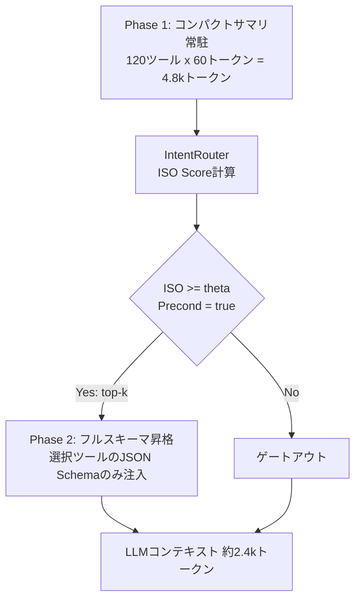

## 論文概要（Abstract）

本記事は [Tool Attention Is All You Need](https://arxiv.org/abs/2604.21816) の解説記事です。

Tool Attentionは、MCPシステムが毎ターンすべてのツールスキーマをコンテキストに再注入する「Tools Tax」（10k-60kトークン）を排除するミドルウェア機構である。Intent-Schema Overlap（ISO）スコアによる動的ゲーティングと二段階のLazy Schema Loadingを組み合わせ、120ツール環境でトークン消費を95%削減、タスク成功率を72%から94%に改善したと著者らは報告している。

この記事は [Zenn記事: Function Callingコスト最適化入門：トークン消費を70%削減する5つの実装テクニック](https://zenn.dev/0h_n0/articles/d16764d2f38be3) の深掘りです。

## 情報源

- **arXiv ID**: 2604.21816
- **URL**: [https://arxiv.org/abs/2604.21816](https://arxiv.org/abs/2604.21816)
- **著者**: Anuj Sadani, Deepak Kumar
- **発表年**: 2026
- **分野**: cs.AI

## 背景と動機（Background & Motivation）

LLMエージェントの実用化にともない、ツール統合プロトコルとしてMCPが広く普及しつつある。しかし、MCPの標準的な実装では、LLMがツールを呼び出す際に利用可能なすべてのJSON Schemaをシステムプロンプトに注入するため、ツール数に比例してトークン消費が線形に増大する。著者らはこの問題を**Tools Tax**と名付けている。

Tools Taxの経済的影響は深刻である。著者らの報告によれば、同一操作のコストがCLIワークフローで$3.20に対し、MCP経由では$55.20と**17倍のコスト差**が発生する。120ツール環境では1ターンあたり47,312トークンがスキーマだけで消費され、コンテキスト利用率はわずか24%にとどまる。

大量のスキーマはコスト以外にも問題を引き起こす。LLMの注意機構が無関係なスキーマに分散し、ツール選択精度の低下やレイテンシ増大を招く。従来の手動グルーピングや固定フィルタリングでは動的なクエリ意図への適応が困難であり、精度と効率のトレードオフを解消できていなかった。

## 主要な貢献（Key Contributions）

- **Intent-Schema Overlap（ISO）スコア**: コサイン類似度ベースの意図-スキーマ関連度スコアリング機構
- **State-Aware Gating Function**: ISO閾値と前提条件チェック（認証要件、ワークフローマイルストーン）を組み合わせた状態認識型ゲーティング
- **Two-Phase Lazy Loading**: コンパクトサマリ常駐とフルスキーマオンデマンド昇格の二段階ロード戦略
- **TAE形式主義との統合**: MindGuardのTotal Attention Energy概念を活用し、効率性とセキュリティの双方を実現
- **500タスクベンチマーク**: 120ツール環境でトークン95%削減・成功率+22pp改善を実証

## 技術的詳細（Technical Details）

### Intent-Schema Overlap（ISO）スコア

ISOスコアはTool Attentionの中核をなすスコアリング関数であり、ユーザークエリの意図とツールサマリの意味的重複度を定量化する。

$$
\text{ISO}(q, t_i) = \cos\bigl(\mathbf{e}_q,\; \mathbf{e}_{t_i}\bigr) = \frac{\mathbf{e}_q \cdot \mathbf{e}_{t_i}}{\|\mathbf{e}_q\| \cdot \|\mathbf{e}_{t_i}\|}
$$

ここで、
- $q$: ユーザークエリ、$t_i$: $i$番目のツールのコンパクトサマリ（約60トークン）
- $\mathbf{e}_q, \mathbf{e}_{t_i} \in \mathbb{R}^{384}$: `sentence-transformers/all-MiniLM-L6-v2`による埋め込みベクトル

アブレーション実験では、TF-IDFベースのスパースエンコーダと比較してMiniLMが**+8.1pp**の成功率改善をもたらしたと報告されている。n-gramベースの語彙的類似度ではツールサマリ間の意味的近接性を捉えきれず、文レベルの意味理解が必要であることを示唆している。

### State-Aware Gating Function

ISOスコアだけでは認証状態やワークフロー進行状況といった実行時コンテキストを考慮できない。State-Aware Gating Functionはこの問題を解決する。

$$
G(q, t_i, s) =
\begin{cases}
1 & \text{if } \text{ISO}(q, t_i) \geq \theta \;\land\; \text{Precond}(t_i, s) = \text{true} \\
0 & \text{otherwise}
\end{cases}
$$

ここで、$\theta \approx 0.28$はキャリブレーション済みのISO閾値、$s$は現在のセッション状態、$\text{Precond}(t_i, s)$はツールの前提条件充足判定関数である。OAuth未認証ユーザーへのAPI呼び出しツール除外や、DB未接続時のクエリツールゲートアウトといった制御が行われる。前提条件チェックは**+3.6pp**の成功率改善に寄与している。

さらに**Hallucination Gate**が追加され、閾値を超えるツールが存在しない場合に「ツールなし」判定を行い、不適切なツール呼び出しを防止する（**+3.2pp**改善）。

### Two-Phase Lazy Loading



**Phase 1（常駐サマリ）**: 全ツールのコンパクトサマリ（ツール名、1行説明、主要パラメータ名）を常時コンテキストに保持する。120ツールで約4,800トークン。

**Phase 2（オンデマンド昇格）**: ゲーティング関数を通過したtop-kツール（$k=3\sim5$推奨）のフルJSON Schemaのみをコンテキストに昇格する。最終的に約2,368トークン/ターンとなり、**95.0%のトークン削減**を実現している。

### 計算量分析

1. **埋め込み計算**: $O(N)$ -- ツールサマリは事前計算、クエリのみ毎ターン計算
2. **ISOスコア計算**: $O(N)$ -- 全ツールへのコサイン類似度
3. **top-kゲーティング**: $O(N \log N)$ -- ソートによるtop-k選択
4. **スキーマ昇格**: $O(k)$ -- 選択kツールのスキーマ取得

全体計算量は**$O(N \log N)$**であり、$N = 120$で30-60msのオーバーヘッドに収まると著者らは報告している。

### Total Attention Energy（TAE）形式主義

著者らはMindGuardのTAE形式主義を活用し、ISOベースゲーティングの理論的正当化を行っている。

$$
\text{TAE}(t_i) = \sum_{l=1}^{L} \sum_{h=1}^{H} A_{l,h}(t_i)
$$

$L$はTransformerレイヤー数、$H$はアテンションヘッド数、$A_{l,h}(t_i)$はレイヤー$l$・ヘッド$h$におけるツール$t_i$トークン群が受けるアテンション重みである。TAEが高いトークン群は最終出力への因果的影響が大きく、低TAEトークン群は除外しても意思決定に影響しない。

著者らは、ISOスコアが低いツール（$\text{ISO}(q, t_i) < \theta$）はTAEも低い傾向にあることを実験的に確認している。この関係は二重の恩恵をもたらす。低TAEツール除外による**効率性向上**と、poisoned schemaがクエリと無関係であれば自動ゲートアウトされる**攻撃面縮小**である。

## 実装のポイント（Implementation）

### 4モジュール構成

著者らはGitHubで実装を公開しており、IntentRouter（ISO計算）、ToolVectorStore（埋め込み管理）、LazySchemaLoader（二段階ロード）、ToolAttention（オーケストレータ）の4モジュールから構成される。

```python
from tool_attention import IntentRouter, ToolVectorStore, LazySchemaLoader, ToolAttention

class ToolAttention:
    """4モジュールを統合するオーケストレータ。
    State-Aware Gating、Hallucination Gate、前提条件チェックを管理。
    """
    def select_tools(
        self, query: str, session_state: dict, threshold: float = 0.28
    ) -> list[dict]:
        # 1. クエリ埋め込み計算（MiniLM, ~30ms）
        query_emb = self.intent_router.encode(query)
        # 2. ISO スコア計算 + top-k 選択
        candidates = self.vector_store.search(query_emb, k=self.top_k)
        # 3. State-Aware Gating（前提条件チェック）
        gated = [t for t in candidates
                 if t.iso_score >= threshold
                 and self.check_preconditions(t, session_state)]
        # 4. Hallucination Gate
        if not gated:
            return []  # ツールなし判定
        # 5. フルスキーマ昇格（Phase 2）
        return self.schema_loader.load_full_schema([t.id for t in gated])
```

### 閾値キャリブレーション

閾値 $\theta$ はツールセットごとのキャリブレーションが必要である。著者らは代表的クエリセット（50-100件）に正解ツールをラベル付けし、ROC曲線からF1最大の閾値を選択する手順を推奨している。実験では$\theta \approx 0.28$が最適であったが、ツールセットの性質により0.20-0.35で変動し得る。

コンパクトサマリの品質がISO精度を直接左右するため、ツール名と主要パラメータを含む簡潔かつ具体的なサマリ設計が重要である。ベクトルストアの初期化は120ツールで約1-2秒。

## Production Deployment Guide

本論文はGitHubに実装を公開しており、プロダクション適用が現実的である。以下のコスト試算は2026年7月時点のAWS東京リージョン（ap-northeast-1）概算値であり、トラフィックパターンやリージョンにより変動する。

### AWS実装パターン（コスト最適化重視）

| 構成 | トラフィック | 主要サービス | 月額概算 |
|------|------------|-------------|---------|
| Small | ~100 req/日 | Lambda + DynamoDB + S3 | $50-120 |
| Medium | ~1,000 req/日 | ECS Fargate + ElastiCache + DynamoDB | $350-700 |
| Large | 10,000+ req/日 | EKS + Karpenter + Spot + ElastiCache | $2,200-4,500 |

**Small**: Lambda 512MB月額$5-15、DynamoDB On-Demand $5-10、Bedrock（平均2kトークン/req）$30-80。Lambda ColdスタートでMiniLMロード約2秒のため、Provisioned Concurrency（+$20/月）を検討。**Medium**: ECS Fargate 0.5vCPU/1GB 2タスク $60-80、ElastiCache cache.t3.micro $15-25、Bedrock $200-500。MiniLM常駐でColdスタート回避。**Large**: EKS $75、EC2 Spot m5.large 3-8台 $150-400、ElastiCache cache.r6g.large $120-200、Bedrock $1,500-3,000。Spot活用で最大90%コンピュート削減。

### Terraformインフラコード

**Small構成（Serverless）**:

```hcl
# Tool Attention Small構成 - 2026-07 ap-northeast-1 概算: $50-120/月
terraform {
  required_version = ">= 1.9"
  required_providers { aws = { source = "hashicorp/aws", version = "~> 5.60" } }
}
provider "aws" { region = "ap-northeast-1" }

resource "aws_iam_role" "lambda" {
  name               = "tool-attention-lambda"
  assume_role_policy = jsonencode({
    Version = "2012-10-17"
    Statement = [{ Action = "sts:AssumeRole", Effect = "Allow",
                    Principal = { Service = "lambda.amazonaws.com" } }]
  })
}
resource "aws_iam_role_policy" "lambda_perms" {
  name = "tool-attention-perms"
  role = aws_iam_role.lambda.id
  policy = jsonencode({
    Version = "2012-10-17"
    Statement = [
      { Effect = "Allow", Action = ["dynamodb:GetItem","dynamodb:PutItem","dynamodb:Query"],
        Resource = aws_dynamodb_table.schemas.arn },
      { Effect = "Allow", Action = ["bedrock:InvokeModel"],
        Resource = "arn:aws:bedrock:ap-northeast-1::foundation-model/anthropic.claude-*" },
      { Effect = "Allow", Action = ["logs:CreateLogGroup","logs:CreateLogStream","logs:PutLogEvents"],
        Resource = "arn:aws:logs:ap-northeast-1:*:*" }
    ]
  })
}
resource "aws_dynamodb_table" "schemas" {
  name = "tool-attention-schemas"; billing_mode = "PAY_PER_REQUEST"; hash_key = "tool_id"
  attribute { name = "tool_id"; type = "S" }
  server_side_encryption { enabled = true }
  tags = { Service = "tool-attention" }
}
resource "aws_lambda_function" "router" {
  function_name = "tool-attention-router"; runtime = "python3.12"
  handler = "handler.lambda_handler"; role = aws_iam_role.lambda.arn
  timeout = 30; memory_size = 512  # MiniLMロードに必要
  filename = "lambda_package.zip"; source_code_hash = filebase64sha256("lambda_package.zip")
  environment { variables = { TOOL_TABLE = aws_dynamodb_table.schemas.name,
    ISO_THRESHOLD = "0.28", TOP_K = "5" } }
  tracing_config { mode = "Active" }
}
resource "aws_cloudwatch_metric_alarm" "latency" {
  alarm_name = "tool-attention-high-latency"; comparison_operator = "GreaterThanThreshold"
  evaluation_periods = 3; metric_name = "Duration"; namespace = "AWS/Lambda"
  period = 300; statistic = "p95"; threshold = 5000
  dimensions = { FunctionName = aws_lambda_function.router.function_name }
}
```

**Large構成（Container）**:

```hcl
# Tool Attention Large構成 - 2026-07 ap-northeast-1 概算: $2,200-4,500/月
module "eks" {
  source = "terraform-aws-modules/eks/aws"; version = "~> 20.24"
  cluster_name = "tool-attention"; cluster_version = "1.31"
  vpc_id = module.vpc.vpc_id; subnet_ids = module.vpc.private_subnets
  cluster_endpoint_public_access = false
  eks_managed_node_groups = {
    system = { instance_types = ["m5.large"]; min_size = 1; max_size = 2; desired_size = 1 }
  }
}
resource "kubectl_manifest" "karpenter_spot" {
  yaml_body = yamlencode({
    apiVersion = "karpenter.sh/v1"; kind = "NodePool"
    metadata = { name = "tool-attention-spot" }
    spec = { template = { spec = {
      requirements = [
        { key = "karpenter.sh/capacity-type", operator = "In", values = ["spot","on-demand"] },
        { key = "node.kubernetes.io/instance-type", operator = "In",
          values = ["m5.large","m5.xlarge","m5a.large","m5a.xlarge"] }
      ] } }
      limits = { cpu = "32" }
      disruption = { consolidationPolicy = "WhenEmptyOrUnderutilized", consolidateAfter = "30s" }
    }
  })
}
resource "aws_budgets_budget" "monthly" {
  name = "tool-attention-monthly"; budget_type = "COST"
  limit_amount = "5000"; limit_unit = "USD"; time_unit = "MONTHLY"
  notification { comparison_operator = "GREATER_THAN"; threshold = 80
    threshold_type = "PERCENTAGE"; notification_type = "ACTUAL"
    subscriber_email_addresses = ["ops-team@example.com"] }
}
```

### 運用・監視設定

**CloudWatch Logs Insights**（トークン消費・レイテンシ監視）:

```
fields @timestamp, duration_ms, tool_count
| stats sum(input_tokens) as total_input, pct(duration_ms, 95) as p95_latency by bin(1h)
| sort bin desc | limit 24
```

**X-Ray トレーシング + Cost Explorer自動通知**:

```python
from aws_xray_sdk.core import xray_recorder, patch_all
import boto3

patch_all()  # boto3自動計装

@xray_recorder.capture("tool_attention_select")
def select_tools_traced(query: str, state: dict) -> list[dict]:
    """X-Rayトレース付きツール選択。アノテーションでISO閾値・選択数を記録。"""
    sub = xray_recorder.current_subsegment()
    sub.put_annotation("iso_threshold", 0.28)
    result = tool_attention.select_tools(query, state)
    sub.put_annotation("tools_selected", len(result))
    return result

def daily_cost_alert(sns_arn: str, threshold: float = 100.0) -> None:
    """日次コスト確認。$100/日超過でSNS通知。"""
    from datetime import datetime, timedelta
    ce = boto3.client("ce", region_name="ap-northeast-1")
    end = datetime.utcnow().strftime("%Y-%m-%d")
    start = (datetime.utcnow() - timedelta(days=1)).strftime("%Y-%m-%d")
    resp = ce.get_cost_and_usage(
        TimePeriod={"Start": start, "End": end}, Granularity="DAILY",
        Metrics=["UnblendedCost"],
        Filter={"Tags": {"Key": "Service", "Values": ["tool-attention"]}})
    cost = sum(float(g["Metrics"]["UnblendedCost"]["Amount"])
               for r in resp["ResultsByTime"] for g in r["Groups"])
    if cost > threshold:
        boto3.client("sns").publish(TopicArn=sns_arn,
            Subject="Tool Attention日次コスト超過", Message=f"${cost:.2f} > ${threshold}")
```

### コスト最適化チェックリスト

**アーキテクチャ選択**: ~100 req/日 → Serverless / ~1,000 req/日 → Hybrid / 10,000+ → Container

**リソース最適化**: Spot Instances優先（最大90%削減）、Reserved Instances 1年コミット（最大72%削減）、Savings Plans検討、Lambda Power Tuningでメモリ最適化、Karpenter consolidationでアイドルノード回収

**LLMコスト削減**: Bedrock Batch API（50%削減）、Prompt Caching（30-90%削減、Tool Attentionと相乗効果）、モデル動的選択（簡易クエリにHaiku/複雑タスクにSonnet）、max_tokens制限、Tool Attention自体のトークン95%削減

**監視・アラート**: AWS Budgets月次上限、CloudWatchトークンスパイク検知、Cost Anomaly Detection有効化、日次Cost Explorerレポート

**リソース管理**: Trusted Advisorで未使用リソース定期チェック、`Service=tool-attention`タグ全リソース付与、CloudWatch Logs保持30日、EventBridge夜間スケールダウン、開発環境ElastiCache停止

## 実験結果（Results）

### ベンチマーク結果

著者らは120ツール環境で500タスクのベンチマークを実施している（論文Table 1より）。

| 指標 | Full-Schema Baseline | Tool Attention | 改善 |
|------|---------------------|---------------|------|
| トークン/ターン | 47,312 | 2,368 | **95.0%削減** |
| コンテキスト利用率 | 0.24 | 0.91 | **3.8倍** |
| タスク成功率 | ~72% | ~94% | **+22pp** |
| P50レイテンシ | ~4.2s | ~2.0s | **52%削減** |
| コスト/タスク | ~$0.21 | ~$0.03 | **86%削減** |

### アブレーション実験

各コンポーネントの寄与（論文Table 3より）:

| コンポーネント | 成功率への寄与 |
|-------------|-------------|
| Lazy Loading（Two-Phase） | **+10.3pp** |
| 前提条件チェック | **+3.6pp** |
| Hallucination Gate | **+3.2pp** |
| MiniLM vs TF-IDF | **MiniLMが+8.1pp優位** |

Lazy Loadingの寄与が最大であり、LLMがフルスキーマの情報量に圧倒されず必要なツールに集中できる効果が確認されている。

### Tools Taxの経済的比較

| ワークフロー | CLI | MCP（Full-Schema） | Tool Attention |
|------------|-----|-------------------|---------------|
| コスト | $3.20 | $55.20 | $3.84 |
| 対CLI比 | 1x | **17.3x** | **1.2x** |

## 実運用への応用（Practical Applications）

Tool Attentionは、関連Zenn記事で紹介されているFunction Callingコスト最適化テクニックを体系化し、プロトコルレベルで自動化するミドルウェアとして位置付けられる。

**適用が有効なシナリオ**: 50ツール以上のMCPサーバ統合環境、15-40ターンの複雑なマルチステップワークフロー、レイテンシ制約のあるチャットボットやIDE統合エージェント。

**導入時の考慮事項**: ISO閾値はツールセットごとにキャリブレーションが必要。コンパクトサマリの品質がシステム精度を規定する。ツール追加・変更時のベクトルストア再構築を自動化する仕組みの整備が望ましい。

## 関連研究（Related Work）

- **Gorilla (Patil et al., 2023)**: LLMにAPI呼び出しを学習させるfine-tuningアプローチ。Tool Attentionはfine-tuning不要で任意のLLMに適用可能な点で異なる
- **ToolLLM / ToolBench (Qin et al., 2024)**: 16,000以上のAPIを対象としたベンチマーク。ツール数スケーラビリティの評価だがトークン効率最適化は主眼としていない
- **MindGuard (2025)**: アテンションパターン分析によるprompt injection検出フレームワーク。Tool AttentionはそのTAE形式主義を効率性の文脈に転用している

## まとめと今後の展望

Tool Attentionは、MCPのTools Tax問題に対してISOスコアによる意味的ゲーティング、State-Aware前提条件チェック、Two-Phase Lazy Loadingの3機構を組み合わせた実用的解決策を提示した。120ツール・500タスクのベンチマークで、トークン95%削減、成功率+22pp、コスト86%削減という改善が報告されている。

今後の研究方向として、マルチモーダルツール対応、クエリ曖昧さに応じた動的閾値調整、分散エージェント環境でのスキーマ共有プロトコル標準化が挙げられている。ツール統合が数百から数千規模に拡大する今後の展開において、このようなトークン効率最適化ミドルウェアの重要性はさらに高まると考えられる。

## 参考文献

- **arXiv**: [https://arxiv.org/abs/2604.21816](https://arxiv.org/abs/2604.21816)
- **Related Zenn article**: [https://zenn.dev/0h_n0/articles/d16764d2f38be3](https://zenn.dev/0h_n0/articles/d16764d2f38be3)
