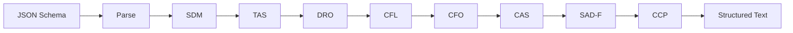

本記事は [TSCG: Deterministic Tool-Schema Compilation for Agentic LLM Deployments](https://arxiv.org/abs/2605.04107) の解説記事です。

## 論文概要（Abstract）

TSCG（Tool-Schema Compilation for Generation）は、JSON SchemaベースのLLMツール定義をトークン効率の高い構造化テキストに変換する決定論的コンパイラである。モデルアクセス、ファインチューニング、ランタイム検索のいずれも不要で、APIバウンダリで動作する。著者は8つの形式的に定義されたオペレータを組み合わせたパイプラインにより、整形スキーマに対して51%以上のトークン削減を数学的に保証している（Theorem 3.1）。TSCG-Agentic-Bench（約19,000 APIコール、12モデル、5シナリオ）の評価により、Phi-4 14Bの精度を0%から84.4%に回復し、フロンティアモデルでも50%超のトークン削減と精度向上の両立を達成したと報告されている。

この記事は [Zenn記事: Function Callingコスト最適化入門](https://zenn.dev/0h_n0/articles/d16764d2f38be3) の深掘りです。Zenn記事ではFunction Callingのトークン消費を実装テクニックで削減するアプローチを解説していますが、本論文はスキーマ表現そのものを学術的・体系的に最適化し、なぜJSON形式がLLMにとって非効率なのかの理論的根拠と、決定論的な解決策を提示しています。

## 情報源

- **arXiv ID**: 2605.04107
- **URL**: [https://arxiv.org/abs/2605.04107](https://arxiv.org/abs/2605.04107)
- **著者**: Furkan Sakizli
- **発表年**: 2026年5月
- **分野**: cs.SE（ソフトウェア工学）, cs.AI（人工知能）, cs.CL（計算言語学）

## 背景と動機（Background & Motivation）

現代のエージェントLLMフレームワーク（OpenAI Function Calling、Anthropic Tool Use、MCP等）は、外部ツールの定義をJSON Schemaとしてプロンプトに埋め込む。しかしJSON Schemaは本来、マシン間のデータ交換を目的に設計されたフォーマットであり、LLMのBPEトークナイザやTransformerのアテンション機構との相性が悪い。

この「プロトコルミスマッチ」は2つの面で問題を生じさせる。第一に、JSONの構造的冗長性（波括弧、引用符、キー名の反復）がトークンを浪費し、APIコストを押し上げる。第二に、特に4B-14Bクラスの小規模モデルにおいて、ツール数が増加するとツール選択精度が急激に劣化する。著者によれば、Phi-4 14Bは20ツール環境でJSON形式のまま送信すると精度が0%に低下する。

MCP（Model Context Protocol）の普及により、単一エージェントが接続するツール数は数十から百を超える規模へと拡大しつつある。この環境下でJSON Schemaをそのまま送信し続けることは、コストと精度の両面で持続可能ではない。既存のプロンプト圧縮手法（LLMLingua等）はGPU上でのモデル推論を必要とし42.5秒のレイテンシを伴うため、リアルタイムのAPI呼び出しには適用が困難である。TSCGはこの問題に対し、モデル非依存の決定論的変換という異なるアプローチで解決を試みている。

## 主要な貢献（Key Contributions）

- **決定論的コンパイラアーキテクチャ**: JSON Schemaを構造化テキストに変換する10パスパイプライン。モデルアクセス不要、実行時間1ms未満
- **8つの合成可能なオペレータ**: トークン削減（TAS, DRO, SDM, CFL）、構造再配置（CFO, CAS）、トークン拡張（SAD-F, CCP）の3カテゴリで構成
- **形式圧縮限界の証明**: 整形スキーマに対して51%以上の圧縮を保証するTheorem 3.1
- **Format vs Compression分離の発見**: 精度向上の主因がトークン圧縮ではなくフォーマット変換にあることの実証（$R^2$が0.88から0.03に崩壊）
- **TABベンチマーク**: 約19,000 APIコール、12モデル、5シナリオの包括的評価基盤
- **3つのオペレータ応答アーキタイプ**: HUNGRY / SENSITIVE / ROBUSTの分類とモデル別デプロイガイダンス

## 技術的詳細（Technical Details）

### パイプライン構成

TSCGの変換パイプラインは純粋関数合成 $\Pi = \tau_{10} \circ \cdots \circ \tau_1$ として定義される。同一入力に対して常に同一出力を返す決定論的動作が保証されるため、キャッシュ・テスト・再現性の面で有利である。



### 8つのオペレータの詳細

#### トークン削減オペレータ（4つ）

**SDM（Semantic Density Maximization）** は、104以上のフィラーパターン（"The following parameters are required:", "This field represents the..." 等）を除去し、セマンティック密度を最大化する。密度関数は以下で定義される。

$$
D(p) = \frac{|\text{sem}(p)|}{|\text{tok}(p)|}
$$

ここで $\text{sem}(p)$ は意味的に必要なトークン集合、$\text{tok}(p)$ は全トークン集合である。SDMはこの比率を1.0に近づけるよう動作する。

**TAS（Tokenizer-Aligned Syntax）** は、BPEトークナイザの学習済みマージテーブルを参照し、トークン数が最小となるデリミタを選択する。例えば `:` は多くのトークナイザで1トークンに符号化されるが、`"type":` のような組み合わせではトークン境界が分割される場合がある。TASはこのような分割を回避するデリミタを決定論的に選択する。

**DRO（Delimiter-Role Optimization）** は、冗長な構造フレーズ（"the following items", "must be one of" 等）をコンパクトなデリミタに置換する。例えば `"required": ["query", "path"]` は `query:str! path:str!` のような形式に変換される。

**CFL（Constraint-First Layout）** は、出力制約（enum値、required指定、型情報等）をプロンプト内のポジション0に再配置する。これはTransformerの「attention sink」現象を利用したものである。先行研究により、多くのLLMは入力シーケンスの先頭トークンに対して不均衡に高いアテンション重みを割り当てることが知られており、CFLはこの性質を活用して重要な制約情報の参照確率を高める。

#### 構造再配置オペレータ（2つ）

**CFO（Causal-Forward Ordering）** は、ツール間の依存関係をトポロジカル順序に並べ替える。例えば `search_users` → `get_user_details` → `send_message` のように、前段ツールの出力が後段ツールの入力となる関係を因果的順序で配置する。これにより、モデルがツール連鎖を理解しやすくなると著者は述べている。ただし、GPT-5.2ではCFO適用が-5ppの精度低下を引き起こすことが報告されており、モデルによって効果が異なる点には注意が必要である。

**CAS（Causal Access Score）** は、各アトム（ツール定義の最小単位）の「脆弱性」を定量化し、脆弱性の高いアトムをアテンション重みが高くなる位置に再配置する。脆弱性スコア $F(a)$ は以下で定義される。

$$
F(a) = \text{importance}(a) - A(a)
$$

$$
A(a) = \frac{1}{L} \sum_{\ell=1}^{L} \text{Attn}^{(\ell)}(n, i)
$$

ここで $A(a)$ は因果的アクセス可能性（Causal Accessibility）であり、$L$ はレイヤ数、$\text{Attn}^{(\ell)}(n, i)$ はレイヤ $\ell$ における生成位置 $n$ からアトム位置 $i$ へのアテンション重みである。重要度が高いにもかかわらずアクセス可能性が低いアトム（$F(a)$ が大きい）を、ポジション0（attention sink）とポジション $n$（recency bias）に優先配置する。これはTransformerのアテンション分布がU字型であるという実証的知見に基づいている。

#### トークン拡張オペレータ（2つ）

**SAD-F（Selective Anchor Duplication with Fragility）** は、脆弱性/トークン比の高い上位 $k$ 個のアトムを、予算 $B$ トークン以内で複製配置する。圧縮により失われる可能性のある重要情報を冗長化によって補強する役割を果たす。

**CCP（Causal Closure Principle）** は、ポジション $n$（シーケンス末尾）に要約ブロックを追加する。recency biasを利用し、ツール名・必須パラメータ・型制約などのキー情報を末尾で再提示する。

### Theorem 3.1: 形式圧縮限界の証明

著者は以下の定理を証明している。

$$
|\text{tok}(\Pi(S))| \leq |\text{tok}(S)| \cdot \left(1 - \sum_{i} r_i \cdot f_i(S)\right)
$$

ここで、
- $\Pi(S)$: TSCGパイプライン適用後のスキーマ
- $S$: 入力JSON Schema
- $r_i$: オペレータ $T_i$ のトークンあたり削減率
- $f_i(S)$: オペレータ $T_i$ が影響するトークンの割合

証明の核心は、4つのトークン削減オペレータ（SDM, TAS, DRO, CFL）がそれぞれ素なトークン部分集合に作用するという点にある。SDMはフィラーパターン、TASはデリミタ、DROは構造フレーズ、CFLは制約記述とそれぞれ異なる対象を持つため、削減効果は加法的に合成される。著者はこの素集合条件の下で、整形されたJSON Schemaに対する最低圧縮率が51%であることを証明している。

実測値はこの理論的下限を10-24ポイント上回っている（シナリオAで61%、BFCLで66%、description圧縮で75%）。これは素集合仮定が保守的であり、実際にはオペレータ間の相乗効果が存在することを示唆している。

## 実装のポイント（Implementation）

TSCGは1,200行のTypeScriptで実装されており、外部依存はゼロである。処理速度は50ツールで2.4ms、4,096トークン以下のスキーマで1ms未満と報告されている。

### 4つの最適化プロファイル

著者はモデル特性に応じた4つのプロファイルを定義している。

```typescript
import { compress } from "@tscg/core";

const tools = [/* JSON Schema形式のツール定義配列 */];

// conservative: SDMのみ（安全策、Class 3/4モデル向け）
const conservative = compress(tools, { profile: "conservative" });

// balanced: SDM+CAS+CFO+DRO+TAS+CCP（標準構成）
const balanced = compress(tools, { profile: "balanced" });

// aggressive: 全8オペレータ（HUNGRY型モデル向け）
const aggressive = compress(tools, { profile: "aggressive" });

// auto: ツール数とモデル名に基づく自動選択
const auto = compress(tools, { profile: "auto" });
```

### 変換例

約120トークンのJSON Schemaが約45トークンに圧縮される（62.5%削減）。

**変換前**:
```json
{
  "type": "function",
  "function": {
    "name": "get_weather",
    "description": "Get current weather for a location",
    "parameters": {
      "type": "object",
      "properties": {
        "location": { "type": "string", "description": "City name" },
        "units": { "type": "string", "enum": ["celsius", "fahrenheit"] }
      },
      "required": ["location"]
    }
  }
}
```

**変換後（balanced）**:
```
get_weather(location:str! units?:str[celsius|fahrenheit])|Get current weather for a location
```

## Production Deployment Guide

### AWS実装パターン（コスト最適化重視）

TSCGは1ms未満で動作する軽量コンパイラであるため、専用の大規模インフラは不要である。以下はTSCGをFunction Callingのプロキシとして組み込む3つの構成パターンである。

| 規模 | リクエスト量 | 推奨構成 | 月額コスト概算 | 主要サービス |
|------|------------|---------|-------------|------------|
| **Small** | ~100 req/日 | Serverless | $50-150 | Lambda + API Gateway + Bedrock + DynamoDB |
| **Medium** | ~1,000 req/日 | Hybrid | $300-800 | Lambda + ECS Fargate + ElastiCache + Bedrock |
| **Large** | 10,000+ req/日 | Container | $2,000-5,000 | EKS + Karpenter + Spot Instances + ElastiCache |

**コスト削減テクニック**:

- **TSCG圧縮によるLLM API費用直接削減**: 入力トークン課金のため、52-57%のトークン削減はそのままAPI利用料の削減に直結する。Bedrockの場合、Claude Sonnet 4の入力トークン単価は$3/MTokであり、月間100万トークンの入力で$1.50-$1.71の直接削減となる
- **スキーマキャッシュ**: TSCGの出力は決定論的であるため、同一スキーマの圧縮結果をDynamoDBまたはElastiCacheにキャッシュできる。TTLは長めに設定可能
- **小規模モデルへのルーティング**: TSCGによりPhi-4 14Bが84.4%の精度を達成するため、単純なツール選択タスクをフロンティアモデルから小規模モデルに切り替え可能。Bedrockの場合、Mistral 7Bの入力単価はClaude Sonnet 4の約1/10
- **Spot Instances活用**: EKS構成ではKarpenterによるSpot優先スケジューリングで最大90%のコンピュート費用削減
- **Bedrock Batch API**: 非リアルタイム処理では50%の割引が適用される

**コスト試算の注意事項**: 上記は2026年7月時点のAWS ap-northeast-1（東京）リージョン料金に基づく概算値です。実際のコストはトラフィックパターン、リージョン、バースト使用量により変動します。最新料金は[AWS料金計算ツール](https://calculator.aws/)で確認してください。

### Terraformインフラコード

#### Small構成（Serverless: Lambda + Bedrock + DynamoDB）

```hcl
# TSCG Function Calling Proxy - Serverless構成
# TSCGでツールスキーマを圧縮し、Bedrockに転送

resource "aws_lambda_function" "tscg_proxy" {
  filename      = "tscg_proxy.zip"
  function_name = "tscg-fc-proxy"
  role          = aws_iam_role.lambda_tscg.arn
  handler       = "index.handler"
  runtime       = "nodejs20.x"
  timeout       = 30
  memory_size   = 256  # TSCG処理は<1ms、メモリは最小限

  environment {
    variables = {
      TSCG_PROFILE     = "balanced"
      BEDROCK_MODEL_ID = "anthropic.claude-sonnet-4-20250514-v1:0"
      CACHE_TABLE      = aws_dynamodb_table.tscg_cache.name
      ENABLE_METRICS   = "true"
    }
  }
}

# 圧縮結果キャッシュ（決定論的出力のため長TTL可能）
resource "aws_dynamodb_table" "tscg_cache" {
  name         = "tscg-schema-cache"
  billing_mode = "PAY_PER_REQUEST"  # On-Demand: 低トラフィック時のコスト最適
  hash_key     = "schema_hash"

  attribute {
    name = "schema_hash"
    type = "S"
  }

  ttl {
    attribute_name = "expire_at"
    enabled        = true
  }

  server_side_encryption {
    enabled = true  # KMS暗号化
  }
}

# IAMロール（最小権限）
resource "aws_iam_role" "lambda_tscg" {
  name = "tscg-lambda-role"

  assume_role_policy = jsonencode({
    Version = "2012-10-17"
    Statement = [{
      Action    = "sts:AssumeRole"
      Effect    = "Allow"
      Principal = { Service = "lambda.amazonaws.com" }
    }]
  })
}

resource "aws_iam_role_policy" "lambda_tscg_policy" {
  name = "tscg-lambda-policy"
  role = aws_iam_role.lambda_tscg.id

  policy = jsonencode({
    Version = "2012-10-17"
    Statement = [
      {
        Effect   = "Allow"
        Action   = ["bedrock:InvokeModel", "bedrock:InvokeModelWithResponseStream"]
        Resource = "arn:aws:bedrock:ap-northeast-1::foundation-model/*"
      },
      {
        Effect   = "Allow"
        Action   = ["dynamodb:GetItem", "dynamodb:PutItem"]
        Resource = aws_dynamodb_table.tscg_cache.arn
      },
      {
        Effect   = "Allow"
        Action   = ["logs:CreateLogGroup", "logs:CreateLogStream", "logs:PutLogEvents"]
        Resource = "arn:aws:logs:ap-northeast-1:*:*"
      }
    ]
  })
}

# CloudWatchアラーム: Bedrockトークン使用量監視
resource "aws_cloudwatch_metric_alarm" "bedrock_token_spike" {
  alarm_name          = "tscg-bedrock-token-spike"
  comparison_operator = "GreaterThanThreshold"
  evaluation_periods  = 2
  metric_name         = "InputTokenCount"
  namespace           = "AWS/Bedrock"
  period              = 3600
  statistic           = "Sum"
  threshold           = 500000
  alarm_actions       = [var.sns_topic_arn]
}
```

#### Large構成（Container: EKS + Karpenter + Spot）

```hcl
# TSCG Function Calling Proxy - EKS構成
# 高トラフィック環境向け、Spot Instancesでコスト最適化

module "eks" {
  source          = "terraform-aws-modules/eks/aws"
  version         = "~> 20.0"
  cluster_name    = "tscg-proxy-cluster"
  cluster_version = "1.31"
  vpc_id          = var.vpc_id
  subnet_ids      = var.private_subnet_ids

  cluster_endpoint_public_access = false  # プライベートアクセスのみ
}

# Karpenter: Spot優先の自動スケーリング
resource "kubectl_manifest" "karpenter_nodepool" {
  yaml_body = yamlencode({
    apiVersion = "karpenter.sh/v1"
    kind       = "NodePool"
    metadata   = { name = "tscg-spot" }
    spec = {
      template = {
        spec = {
          requirements = [
            { key = "karpenter.sh/capacity-type", operator = "In", values = ["spot", "on-demand"] },
            { key = "node.kubernetes.io/instance-type", operator = "In",
              values = ["m7i.large", "m6i.large", "c7i.large"] }
          ]
        }
      }
      limits   = { cpu = "32", memory = "64Gi" }
      disruption = {
        consolidationPolicy = "WhenEmptyOrUnderutilized"
        consolidateAfter    = "30s"
      }
    }
  })
}

# Secrets Manager（Bedrock設定）
resource "aws_secretsmanager_secret" "tscg_config" {
  name                    = "tscg/proxy-config"
  recovery_window_in_days = 7
}

# AWS Budgets: 月額予算アラート
resource "aws_budgets_budget" "tscg_monthly" {
  name         = "tscg-monthly-budget"
  budget_type  = "COST"
  limit_amount = "5000"
  limit_unit   = "USD"
  time_unit    = "MONTHLY"

  notification {
    comparison_operator       = "GREATER_THAN"
    threshold                 = 80
    threshold_type            = "PERCENTAGE"
    notification_type         = "ACTUAL"
    subscriber_email_addresses = [var.alert_email]
  }
}
```

### 運用・監視設定

**CloudWatch Logs Insights クエリ**: TSCGの圧縮効率とBedrockコストを監視する。

```
# 1時間あたりのトークン削減効果（コスト異常検知）
fields @timestamp, token_savings_percent, input_tokens, output_tokens, tool_count
| filter event = "tscg_compression"
| stats avg(token_savings_percent) as avg_savings,
        sum(input_tokens - output_tokens) as total_saved,
        count(*) as call_count
  by bin(1h)
| sort @timestamp desc

# レイテンシ分析（P95, P99）
fields @timestamp, duration_ms
| filter event = "tscg_compression"
| stats percentile(duration_ms, 95) as p95,
        percentile(duration_ms, 99) as p99
  by bin(5m)
```

**X-Ray トレーシング設定**:

```python
import boto3
from aws_xray_sdk.core import xray_recorder, patch_all

patch_all()  # boto3自動計装

@xray_recorder.capture("tscg_compress")
def compress_and_invoke(tools: list[dict], prompt: str) -> dict:
    """TSCGで圧縮してBedrockを呼び出す

    Args:
        tools: JSON Schema形式のツール定義
        prompt: ユーザプロンプト

    Returns:
        Bedrockの応答
    """
    subsegment = xray_recorder.current_subsegment()
    subsegment.put_annotation("tool_count", len(tools))

    # TSCG圧縮（<1ms）
    compressed = tscg_compress(tools)
    subsegment.put_metadata("savings_percent", compressed["savings"])

    # Bedrock呼び出し
    client = boto3.client("bedrock-runtime", region_name="ap-northeast-1")
    response = client.invoke_model(
        modelId="anthropic.claude-sonnet-4-20250514-v1:0",
        body=build_request(compressed["text"], prompt),
    )
    return response
```

**Cost Explorer自動レポート**:

```python
import boto3
from datetime import datetime, timedelta

def daily_cost_report() -> dict[str, float]:
    """日次Bedrockコストレポートを取得しSNS通知

    Returns:
        サービス別コスト辞書
    """
    ce = boto3.client("ce")
    today = datetime.now().strftime("%Y-%m-%d")
    yesterday = (datetime.now() - timedelta(days=1)).strftime("%Y-%m-%d")

    result = ce.get_cost_and_usage(
        TimePeriod={"Start": yesterday, "End": today},
        Granularity="DAILY",
        Metrics=["UnblendedCost"],
        Filter={"Dimensions": {"Key": "SERVICE", "Values": [
            "Amazon Bedrock", "AWS Lambda", "Amazon EKS"
        ]}},
        GroupBy=[{"Type": "DIMENSION", "Key": "SERVICE"}],
    )

    costs = {}
    for group in result["ResultsByTime"][0]["Groups"]:
        service = group["Keys"][0]
        amount = float(group["Metrics"]["UnblendedCost"]["Amount"])
        costs[service] = amount

    # $100/日超過でアラート
    total = sum(costs.values())
    if total > 100:
        sns = boto3.client("sns")
        sns.publish(
            TopicArn="arn:aws:sns:ap-northeast-1:ACCOUNT:tscg-cost-alert",
            Subject=f"TSCG Cost Alert: ${total:.2f}/day",
            Message=f"Daily cost exceeded $100: {costs}",
        )
    return costs
```

### コスト最適化チェックリスト

**アーキテクチャ選択**:
- [ ] トラフィック量に応じた構成選択（~100/日: Serverless、~1,000/日: Hybrid、10,000+/日: Container）
- [ ] TSCGプロファイルの最適選択（モデルのoperator-response profileに基づく）
- [ ] キャッシュ戦略の選定（DynamoDB vs ElastiCache、トラフィック量で判断）

**リソース最適化**:
- [ ] EC2/EKS: Spot Instances優先（Karpenterで自動切り替え）
- [ ] Reserved Instances: 1年コミットで最大72%削減
- [ ] Savings Plans: コンピュートへの柔軟なコミット
- [ ] Lambda: メモリサイズ最適化（TSCGは256MBで十分）
- [ ] EKS: アイドル時のKarpenterコンソリデーション

**LLMコスト削減**:
- [ ] TSCG圧縮の適用（52-57%の入力トークン削減）
- [ ] Bedrock Batch API使用（非リアルタイムで50%割引）
- [ ] Prompt Caching有効化（Anthropicモデルで30-90%削減）
- [ ] モデル選択ロジック（TSCG後のPhi-4で単純タスクを処理）
- [ ] トークン数制限（max_tokens設定の最適化）

**監視・アラート**:
- [ ] AWS Budgets設定（月額上限アラート）
- [ ] CloudWatch アラーム（Bedrockトークンスパイク検知）
- [ ] Cost Anomaly Detection有効化
- [ ] 日次コストレポート（Cost Explorer + SNS通知）
- [ ] TSCG圧縮率の継続監視（40%未満でアラート）

**リソース管理**:
- [ ] 未使用リソース定期削除（DynamoDBの期限切れアイテム等）
- [ ] タグ戦略（Project/Environment/CostCenterタグの統一）
- [ ] ライフサイクルポリシー（CloudWatch Logsの保持期間設定）
- [ ] 開発環境の夜間・週末停止（EKSクラスタのスケールダウン）
- [ ] TSCG導入前後のBedrock費用比較レポート

## 実験結果（Results）

### TSCG-Agentic-Bench（TAB）

著者は5つのシナリオで包括的な評価を実施している。評価指標は複合精度 $\text{Overall} = 0.6 \times \text{TSA} + 0.4 \times \text{Parameter\_F1}$ であり、TSA（Tool Selection Accuracy）とパラメータ抽出のF1スコアを加重平均している。統計手法として、各セル $n=20$ タスク $\times 3$ シード $= 60$ コール、ブートストラップCI（1,000反復）、Holm-Bonferroni補正済みMcNemar検定（$\alpha=0.05$、107比較）を使用している。

| シナリオ | ツール数 | タスク数 | 評価対象 |
|---------|---------|---------|---------|
| A: Claude Code Catalog | 16 | 20 | 実プロダクションツール |
| B: MCP Server Collection | 43 | 100 | MCP標準サーバ群 |
| C: Scaling Stress | 25-100 | 20 | スケール限界 |
| D: Small Model Threshold | 3-50 | 20 | 小規模モデル閾値 |
| E: Multi-Collection Stress | 57 | 20 | 複合コレクション |

### 主要な実験結果

著者が報告している主要な結果を以下に示す（論文Table 2, Table 3より）。

**フロンティアモデル（Scenario A）**:

| モデル | Natural (JSON) | TSCG | 改善幅 | トークン削減 |
|--------|----------------|------|--------|------------|
| Claude Sonnet 4 | 74.0% | 85.2% | +11.2pp | 50.1% |
| GPT-5.2 | 51.9% | 81.6% | +29.7pp | - |
| Opus 4.7 | 83.5% | 86.0% | +2.5pp | - |

**小規模モデルの精度回復（Scenario D, 20ツール時）**:

| モデル | Natural (JSON) | TSCG | 改善幅 |
|--------|----------------|------|--------|
| Phi-4 14B | 0.0% | 84.4% | +84.4pp |
| Mistral 7B | 35.0% | 80.1% | +45.1pp |
| Gemma 4B | 0.0% | 65.0%+ | +65pp+ |

**BFCL外部検証**（論文Table 5より、Claude Sonnet 4、$n=60$、3回実行）:

| 条件 | 複合精度 | ツール選択 | パラメータF1 | トークン削減 |
|------|---------|-----------|------------|------------|
| Natural | 85.7% | 86.7% | 84.2% | - |
| TSCG | 93.2% | 95.0% | 91.7% | 46.8% |

精度保持率（ARR: Accuracy-Retained Ratio）は108-181%であり、トークン削減と精度向上が同時に達成されると著者は報告している。

### 4クラス行動分類

著者はFormat vs Compression分離分析の結果、12モデルを4つのクラスに分類している。

**Class 1（Format-dominated）**: Phi-4, Mistral 7B, Gemma 4B。JSON形式からテキスト形式への変換だけで劇的な精度改善が得られる。JSON baselineに対する回帰で $R^2 = 0.88$ の強い相関を示す一方、テキストbaselineに対しては $R^2 = 0.03$ に崩壊する。精度向上の主因はトークン圧縮ではなくフォーマット変換であることを意味している。

**Class 2（Compression）**: Claude Sonnet 4, GPT-4o, GPT-5.2。テキストbaselineに対しても+5-11ppの改善が見られ、フォーマット変換だけでは説明できない真の圧縮効果が存在する。

**Class 3（Neutral）**: Llama 8B, Gemma 12B。TSCGによる改善は限定的であり、conservativeプロファイルが推奨される。

**Class 4（Conservative-only）**: Qwen3 14B, Qwen2.5-Coder 32B。conservative設定（SDMのみ）でのみ+4.4ppの改善が得られ、より積極的なプロファイルでは精度が低下するリスクがある。

### 3つのOperator-Response Profile

Leave-one-in方式の分析（8オペレータ x 3フロンティアモデル、各セル $n=40$、2シード）により、著者は3つの応答プロファイルを発見している（論文Section 4.4より）。

| プロファイル | 対象モデル | 特徴 | 推奨構成 |
|------------|----------|------|---------|
| **HUNGRY** | Opus 4.7 | 全オペレータが個別に精度改善に貢献。CCP単独で+20pp | aggressive（全8オペレータ） |
| **SENSITIVE** | GPT-5.2 | CFO適用で-5pp。全8オペレータでは-10pp | CFOを除外した構成 |
| **ROBUST** | Sonnet 4 | 6/7条件で80.0%の同一精度。CFOのみ-2.5pp | 任意の安全構成 |

## 実運用への応用（Practical Applications）

### Zenn記事との関連

[Zenn記事: Function Callingコスト最適化入門](https://zenn.dev/0h_n0/articles/d16764d2f38be3) では、Function Callingのトークン消費を削減する5つの実装テクニック（パラメータ名の最適化、description圧縮、enum型の活用、nested objectの平坦化、動的ツール選択）が解説されている。TSCGはこれらの手動テクニックを学術的に体系化し、自動化したものと位置づけられる。

特にZenn記事で言及されているdescription圧縮はTSCGのSDMオペレータに対応し、パラメータ名最適化はDROに対応する。Zenn記事の手動アプローチとTSCGの自動アプローチは排他的ではなく、TSCGのautoプロファイルを適用した上で、さらにドメイン固有の最適化を手動で行うという組み合わせが実用的である。

### プロダクション統合パターン

TSCGの1ms未満の処理速度と決定論的動作は、以下のプロダクション統合パターンを可能にする。

1. **APIゲートウェイプロキシ**: Lambda@Edgeまたはゲートウェイ統合でツールスキーマを透過的に圧縮
2. **MCPプロキシ**: MCPサーバとクライアント間に挿入し、ツール定義のトークンを自動削減
3. **モデルルーター**: TSCGの4クラス分類に基づき、タスク難易度に応じてフロンティアモデルと小規模モデルを自動切り替え

### コスト削減効果の試算

月間100万回のFunction Calling呼び出し（平均20ツール、1コールあたり入力トークン約2,000）を想定した場合、TSCGの50%圧縮により月間約10億入力トークンが削減される。Claude Sonnet 4（$3/MTok）を使用する場合、月間約$3,000のAPI費用削減となる。さらに、小規模モデルへのルーティングを組み合わせれば、追加の削減が見込まれる。

## 関連研究（Related Work）

- **NTILC（Non-Textual In-Line Compression）**: プロンプト圧縮のためにLLMの推論を利用するアプローチ。モデル依存であり、TSCGのモデル非依存・決定論的特性とは対照的である
- **SkillReducer（Li et al., 2025）**: ユーザクエリの意味に基づいてツール数を動的に削減する検索ベースの手法。TSCGがスキーマ表現の最適化に焦点を当てるのに対し、SkillReducerはツール選択の最適化に焦点を当てており、両者は直交する関係にある
- **mcp-compressor（Atlassian Labs）**: ラッパーツールによる70-97%の圧縮を実現するが、アーキテクチャの置換を伴う。TSCGはスキーマ形式の変換のみで既存のFunction Callingアーキテクチャを維持できる点が異なる
- **LLMLingua / LLMLingua-2**: パープレキシティベースのプロンプト圧縮。2-5倍の圧縮を達成するがGPU推論が必要であり、42.5秒のレイテンシを伴う。TSCGは約40,000倍高速に動作する

## まとめと今後の展望

TSCGは、LLMのツール定義送信における「JSONプロトコルミスマッチ」に対し、理論的根拠のある決定論的解決策を提示した論文である。8つの合成可能なオペレータにより51%以上のトークン削減を数学的に保証し、12モデル・19,000コールの評価で有効性を実証している。特に小規模モデルの精度回復（0% -> 84.4%）はエッジデプロイメントやコスト制約環境への応用可能性を示している。

今後の研究方向として、著者はモデル固有のoperator-response profileの自動検出、マルチモーダルツールスキーマ（画像・音声パラメータを含むスキーマ）への拡張、そしてTSCGとツール選択最適化（SkillReducer等）の統合を挙げている。Function Callingのコスト最適化は、MCP環境の拡大とともに重要性が増しており、TSCGのような体系的アプローチの実用価値は高い。

## 参考文献

- **arXiv**: [TSCG: Deterministic Tool-Schema Compilation for Agentic LLM Deployments (arXiv:2605.04107)](https://arxiv.org/abs/2605.04107)
- **GitHub**: [SKZL-AI/tscg](https://github.com/SKZL-AI/tscg)
- **Related Zenn article**: [Function Callingコスト最適化入門：トークン消費を70%削減する5つの実装テクニック](https://zenn.dev/0h_n0/articles/d16764d2f38be3)
- **BFCL**: [Berkeley Function Calling Leaderboard](https://gorilla.cs.berkeley.edu/leaderboard.html)
- **LLMLingua**: [LLMLingua: Compressing Prompts for Accelerated Inference (arXiv:2310.05736)](https://arxiv.org/abs/2310.05736)
