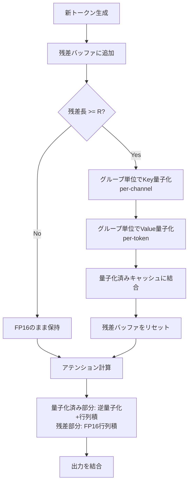

## 論文概要（Abstract）

KIVIは、LLM推論時のKVキャッシュを**チューニング不要**で2ビットまで圧縮する非対称量子化手法である。Key Cacheにはper-channel量子化、Value Cacheにはper-token量子化を適用する非対称設計により、ピークメモリ2.6倍削減、バッチサイズ最大4倍拡大、スループット2.35〜3.47倍向上を達成したと著者らは報告している。

本記事は [https://arxiv.org/abs/2402.02750](https://arxiv.org/abs/2402.02750) の解説記事です。

この記事は [Zenn記事: LLMの長いコンテキストを活かす最適解](https://zenn.dev/0h_n0/articles/ba05271cd9ca43) の深掘りです。

## 情報源

- **会議名**: ICML 2024（International Conference on Machine Learning）
- **URL**: [https://arxiv.org/abs/2402.02750](https://arxiv.org/abs/2402.02750)
- **著者**: Zirui Liu, Jiayi Yuan, Hongye Jin, Shaochen Zhong, Zhaozhuo Xu, Vladimir Braverman, Beidi Chen, Xia Hu
- **GitHub**: [https://github.com/jy-yuan/KIVI](https://github.com/jy-yuan/KIVI)

## カンファレンス情報

ICML（International Conference on Machine Learning）は、機械学習分野の最高峰国際会議の1つである。2024年はオーストリア・ウィーンで7月21〜27日に開催された。採択率は例年25〜30%程度であり、NeurIPS・ICLRと並ぶトップ3会議として認知されている。

## 背景と動機

Transformer系LLMの自己回帰推論では、過去トークンのKeyとValueテンソル（KVキャッシュ）を保持する必要がある。KVキャッシュのサイズは $$ \text{KV size} = 2 \times b \times l \times n_{\text{heads}} \times d_{\text{head}} \times \text{precision} $$ で与えられる（$b$: バッチサイズ、$l$: シーケンス長、$n_{\text{heads}}$: ヘッド数、$d_{\text{head}}$: ヘッド次元）。長コンテキスト・大バッチではKVキャッシュだけで数十GBに達し、メモリボトルネックとなる。

モデル重みの量子化（GPTQ, AWQ等）は成熟した技術だが、KVキャッシュの量子化は十分に研究されていなかった。著者らの予備実験では、2ビットのper-channel量子化をKey・Value両方に適用した場合、CoQAスコアが66.37から2.88に崩壊したと報告されている（Table 1, Llama-2-13B）。

## 主要な貢献

1. **非対称量子化の発見**: Key CacheとValue Cacheで最適な量子化軸が異なることを実証的に示した。Keyはper-channel、Valueはper-tokenで量子化すべきという知見
2. **チューニング不要の2ビット量子化**: キャリブレーションデータやファインチューニングなしで、プラグアンドプレイで適用可能な量子化アルゴリズムの設計
3. **実用的なシステム最適化**: 逆量子化と行列積を融合したCUDAカーネルにより、ハードウェア親和性の高い実装を実現し、実ワークロードで2.35〜3.47倍のスループット向上を達成

## 技術的詳細

### Key CacheとValue Cacheの要素分布の違い

KIVIの中核的発見は、KVキャッシュの2つの構成要素が**根本的に異なる外れ値パターン**を持つという点である。

- **Key Cache**: 特定のチャネル（次元）に外れ値が集中する。トークンに依存せず、同じチャネルに外れ値が現れる
- **Value Cache**: チャネル方向には外れ値パターンがなく、特定のトークン位置が異なるスケールを持つ

この分布の違いが、量子化戦略を分ける根本的な理由となる。

### なぜ非対称量子化が必要か

#### Keyに対するPer-Channel量子化

Per-channel量子化では、各チャネルごとに独立したスケールファクタとゼロポイントを計算する。外れ値チャネルは独自のスケーリングを持つため、そのチャネルの量子化誤差が他チャネルに波及しない。

著者らの実験によると、Llama-2-13Bにおける2ビット量子化の相対再構成誤差は以下の通りである（Table 2）:

| 量子化軸 | Key再構成誤差 | アテンション誤差率 |
|:---:|:---:|:---:|
| Per-Token | 13.67 | 47.00% |
| Per-Channel | 4.55 | 9.60% |

Per-channel量子化により、Key Cacheの再構成誤差が約3倍改善し、アテンション計算への影響も47%から9.6%に大幅低減している。

#### Valueに対するPer-Token量子化

Value Cacheにはチャネル方向の外れ値がないため、per-channel量子化のメリットが薄い。一方、アテンション重みの疎性（著者らの報告では84.3%が疎）を活用すると、per-token量子化が有効となる。

アテンション重みが疎な場合、大半のトークンのValue行は非常に小さいアテンション重みで掛けられるため、その量子化誤差が最終出力に与える影響は小さい。Table 2のValue Cache側の結果:

| 量子化軸 | Value再構成誤差 | 出力誤差 $\Delta$ |
|:---:|:---:|:---:|
| Per-Token | 4.57 | 3.55 |
| Per-Channel | 3.73 | 49.89 |

再構成誤差自体はper-channelの方が小さいにもかかわらず、最終出力への影響（$\Delta$）ではper-tokenが圧倒的に優れている。これはアテンションの疎性により、per-token誤差がうまく減衰されるためである。

### 量子化の数式

KIVIは**一様非対称量子化**（uniform asymmetric quantization）を採用している。

#### 量子化

入力テンソル $X$ に対して、$B$ビットの量子化は以下で定義される:

$$Q(X) = \left\lfloor \frac{X - z_X}{s_X} \right\rceil$$

ここで:
- $z_X = \min(X)$ : ゼロポイント（量子化範囲の下限）
- $s_X = \frac{\max(X) - \min(X)}{2^B - 1}$ : スケールファクタ
- $\lfloor \cdot \rceil$ : 最近接整数への丸め
- $B$ : ビット幅（KIVIでは $B = 2$）

$B = 2$ の場合、$2^B - 1 = 3$ であり、量子化後の値は $\{0, 1, 2, 3\}$ の4レベルに写像される。

#### 逆量子化

量子化された値 $Q(X)$ から近似的に元の値を復元する:

$$\hat{X} = Q(X) \cdot s_X + z_X$$

#### Per-ChannelとPer-Tokenの違い

Per-channel量子化では $s_X$ と $z_X$ をチャネル（次元）ごとに計算し、per-token量子化ではトークン（行）ごとに計算する。グループサイズ $G$ を導入することで、チャネルを $G$ 個ずつのグループに分割し、グループごとに独立したパラメータを持たせる:

$$s_{X,g} = \frac{\max(X_g) - \min(X_g)}{2^B - 1}, \quad z_{X,g} = \min(X_g)$$

ここで $X_g$ は $g$ 番目のグループのサブテンソルである。

#### 量子化誤差の伝播

Key側の量子化誤差 $\epsilon_K$ がアテンション出力 $\text{softmax}(QK^\top)V$ に伝播する際、per-channel量子化では誤差が独立チャネルに閉じ込められsoftmax後の誤差が抑制される。per-token量子化ではチャネル間で誤差が相関し、softmax入力ロジットに大きな偏りを生じさせる。

### ストリーミング量子化アルゴリズム

自己回帰生成では1トークンずつKVキャッシュが追加されるため、**残差バッファ**（residual buffer）を導入している。



残差バッファが $R$ トークンに達すると、$G$ トークンずつのグループに分割して量子化し、量子化済みキャッシュに連結する。

## アルゴリズム

```python
import torch
from dataclasses import dataclass


@dataclass
class KIVIConfig:
    """KIVI量子化の設定パラメータ"""
    k_bits: int = 2
    v_bits: int = 2
    group_size: int = 32
    residual_length: int = 128


def uniform_quantize(
    x: torch.Tensor, bits: int, axis: int, group_size: int
) -> tuple[torch.Tensor, torch.Tensor, torch.Tensor]:
    """一様非対称量子化

    Args:
        x: 入力テンソル (batch, seq_len, head_dim)
        bits: 量子化ビット数 (2 or 4)
        axis: 量子化軸 (0=per-token, 1=per-channel)
        group_size: グループサイズ

    Returns:
        (quantized, scales, zeros) のタプル
    """
    max_val = 2 ** bits - 1  # 2bit -> 3
    if axis == 1:  # per-channel
        x_grouped = x.reshape(*x.shape[:-1], -1, group_size)
        z = x_grouped.min(dim=-1, keepdim=True).values
        s = (x_grouped.max(dim=-1, keepdim=True).values - z) / max_val
        s = s.clamp(min=1e-10)
        quantized = ((x_grouped - z) / s).round().clamp(0, max_val).to(torch.uint8)
    else:  # per-token
        z = x.min(dim=-1, keepdim=True).values
        s = ((x.max(dim=-1, keepdim=True).values - z) / max_val).clamp(min=1e-10)
        quantized = ((x - z) / s).round().clamp(0, max_val).to(torch.uint8)
    return quantized, s, z


def dequantize(
    quantized: torch.Tensor, scales: torch.Tensor, zeros: torch.Tensor
) -> torch.Tensor:
    """逆量子化: Q(X) * s + z でFP16近似値を復元"""
    return quantized.float() * scales + zeros


class KIVICache:
    """KIVIストリーミングKVキャッシュ

    Key=Per-Channel, Value=Per-Tokenで非対称2ビット量子化。
    残差バッファがR個に達したら量子化してキャッシュに追加する。
    """

    def __init__(self, config: KIVIConfig) -> None:
        self.config = config
        self.key_quantized: list[tuple[torch.Tensor, ...]] = []
        self.value_quantized: list[tuple[torch.Tensor, ...]] = []
        self.key_residual: torch.Tensor | None = None
        self.value_residual: torch.Tensor | None = None

    def update(self, new_key: torch.Tensor, new_value: torch.Tensor) -> None:
        """新トークンのKey/Valueを残差バッファに追加"""
        if self.key_residual is None:
            self.key_residual, self.value_residual = new_key, new_value
        else:
            self.key_residual = torch.cat([self.key_residual, new_key], dim=1)
            self.value_residual = torch.cat([self.value_residual, new_value], dim=1)
        if self.key_residual.shape[1] >= self.config.residual_length:
            self._quantize_residual()

    def _quantize_residual(self) -> None:
        """残差バッファを量子化してキャッシュに結合"""
        cfg = self.config
        self.key_quantized.append(
            uniform_quantize(self.key_residual, cfg.k_bits, axis=1, group_size=cfg.group_size)
        )
        self.value_quantized.append(
            uniform_quantize(self.value_residual, cfg.v_bits, axis=0, group_size=cfg.group_size)
        )
        self.key_residual = self.value_residual = None

    def compute_attention(self, query: torch.Tensor) -> torch.Tensor:
        """量子化+残差キャッシュでScaled Dot-Product Attentionを計算"""
        keys = torch.cat(
            [dequantize(*kv) for kv in self.key_quantized]
            + ([self.key_residual] if self.key_residual is not None else []),
            dim=1,
        )
        values = torch.cat(
            [dequantize(*kv) for kv in self.value_quantized]
            + ([self.value_residual] if self.value_residual is not None else []),
            dim=1,
        )
        d_k = query.shape[-1]
        attn = torch.softmax(query @ keys.transpose(-2, -1) / d_k**0.5, dim=-1)
        return attn @ values
```

## 実装のポイント

### グループサイズ $G$ の選択

著者らの実験では、グループサイズ $G = 32$ がデフォルトとして推奨されている。Llama-2-13BのGSM8Kベンチマークでの結果:

| グループサイズ $G$ | GSM8Kスコア |
|:---:|:---:|
| 32 | 20.77 |
| 64 | 21.00 |
| 128 | 17.29 |

$G = 128$ では顕著な精度低下が観測されている。グループが大きいほどオーバーヘッドは減るが、チャネルの分布を捉えきれなくなるトレードオフがある。

### 残差長 $R$ のチューニング

著者らのデフォルトは $R = 128$ である。

| 残差長 $R$ | GSM8Kスコア |
|:---:|:---:|
| 32 | 20.62 |
| 64 | 19.86 |
| 96 | 20.55 |
| 128 | 20.77 |

GSM8Kのような推論タスクでは $R = 128$ が最も安定し、メモリ優先なら $R = 32$ でも実用的な精度を維持できる。

### ハードウェア要件

- **GPU**: NVIDIA A100（80GB）。計算能力8.0以上推奨
- **CUDAカーネル**: 逆量子化+行列積融合カーネル（CUDA）、グループ量子化（Triton）
- **フレームワーク**: Hugging Face Transformers 4.43+、Python 3.10

## Production Deployment Guide

### AWS実装パターン

KIVIを本番環境で活用するための3つのAWS構成パターンを示す。

| 構成 | ユースケース | 推奨インスタンス | 特徴 |
|:---:|:---:|:---:|:---:|
| EC2直接デプロイ | リアルタイムAPI | p4d.24xlarge / g5.xlarge | 低レイテンシ、シンプル |
| ECS + Auto Scaling | マイクロサービス | GPU対応EC2 + ECS | リクエスト量に応じたスケーリング |
| SageMaker Endpoint | MLOps統合 | ml.g5.2xlarge | モデルバージョニング、A/Bテスト |

#### Terraformによるデプロイ例（ECS + Auto Scaling）

```hcl
resource "aws_ecs_task_definition" "kivi_task" {
  family                   = "kivi-inference"
  requires_compatibilities = ["EC2"]
  network_mode             = "awsvpc"
  cpu                      = 16384
  memory                   = 65536

  container_definitions = jsonencode([{
    name  = "kivi-server"
    image = "${var.ecr_repo_url}:latest"
    resourceRequirements = [{ type = "GPU", value = "1" }]
    environment = [
      { name = "K_BITS", value = "2" },
      { name = "V_BITS", value = "2" },
      { name = "GROUP_SIZE", value = "32" },
      { name = "RESIDUAL_LENGTH", value = "128" }
    ]
    portMappings = [{ containerPort = 8080, protocol = "tcp" }]
  }])
}

resource "aws_appautoscaling_policy" "kivi_gpu_scaling" {
  name        = "kivi-gpu-utilization"
  policy_type = "TargetTrackingScaling"
  # ... (resource_id, scalable_dimension, service_namespace 省略)

  target_tracking_scaling_policy_configuration {
    target_value = 70.0
    customized_metric_specification {
      metric_name = "GPUUtilization"
      namespace   = "Custom/KIVI"
      statistic   = "Average"
    }
    scale_in_cooldown  = 300
    scale_out_cooldown = 60
  }
}
```

### 監視設定

CloudWatchで以下のメトリクスを監視する:

- **GPUMemoryUtilization**: 閾値85%でアラート。KIVIのメモリ削減効果が期待通りか確認
- **InferenceLatencyP99**: 閾値2秒。量子化による計算オーバーヘッドの監視
- **BatchSize**: 実行時バッチサイズの推移。KIVIの4倍バッチ拡大が活用されているか確認

### コスト最適化チェックリスト

- **Spot Instances活用**: ステートレス推論ならSpot Instancesで最大70%削減
- **適切なインスタンスタイプ**: 7Bモデル+KIVIならg5.xlarge（A10G 24GB）で十分。70Bモデルはp4d.24xlarge
- **バッチサイズ最適化**: KIVIの4倍バッチ拡大を活かし、リクエストをバッチングしてスループット向上
- **残差長調整**: メモリ優先なら $R = 32$、精度優先なら $R = 128$

## 実験結果

### 生成タスクでのベンチマーク

著者らはLlama-2（7B, 13B）、Falcon-7B、Mistral-7Bで評価を行っている（Table 3）。

**Llama-2-7B**:

| 手法 | CoQA | TruthfulQA | GSM8K |
|:---:|:---:|:---:|:---:|
| 16bit (ベースライン) | 63.88 | 30.76 | 13.50 |
| KIVI-4bit | 63.78 | 30.80 | 13.80 |
| KIVI-2bit | 63.05 | 33.95 | 12.74 |

**Mistral-7B**:

| 手法 | CoQA | TruthfulQA | GSM8K |
|:---:|:---:|:---:|:---:|
| 16bit (ベースライン) | 67.40 | 30.45 | 38.36 |
| KIVI-4bit | 66.95 | 30.49 | 37.30 |
| KIVI-2bit | 66.35 | 32.17 | 36.01 |

KIVI-2bitでもCoQAで1〜2ポイント程度の低下に抑えられている。

### 長文コンテキスト（LongBench）

| モデル | 16bit | KIVI-2bit |
|:---:|:---:|:---:|
| Llama-2-7B | 44.52 | 44.27 |
| Llama-2-13B | 44.85 | 44.69 |
| Mistral-7B | 46.58 | 45.85 |

KIVI-2bitと16bitの差は0.2〜0.7ポイント程度であり、長文理解タスクでも品質が維持されている。

### メモリ削減とスループット向上

NVIDIA A100 80GB上でのLlama-2-7B実測値:

- **ピークメモリ**: FP16比で**2.6倍削減**（モデル重み含む）
- **最大バッチサイズ**: FP16比で**最大4倍拡大**
- **スループット**: ShareGPTデータセット（平均入力161トークン、出力338トークン）で**2.35〜3.47倍向上**

KVキャッシュ部分は8倍（16bit → 2bit）に圧縮されるが、スケールファクタ・ゼロポイントのオーバーヘッドと残差バッファにより、全体では2.6倍の削減率となる。

著者らは、2ビット量子化後もNeedle-in-a-Haystackテスト（長文中の特定情報検索）で高い検索能力を維持していることも報告している（Figure 15）。

## 実運用への応用

KIVIは以下のユースケースで特に効果を発揮する: (1) RAGやドキュメントQ&Aなどの**長文コンテキスト処理**、(2) チャットサービスなどの**高スループット推論**、(3) VRAM制約の厳しい**エッジデプロイメント**。

### 制約と限界

- **精度低下**: GSM8K等の数学的推論タスクでは最大2.35ポイントの低下。高精度が必要ならKIVI-4bit推奨
- **CUDAカーネル依存**: NVIDIA GPU以外への移植にはカーネル再実装が必要
- **モデル依存性**: 検証はLlama, Falcon, Mistralに限定。MoE等は未検証
- **プリフィルオーバーヘッド**: 初期段階では量子化コストが発生するが、デコーディングで償却

## 関連研究

### SnapKV (2024)

SnapKV（[Li et al., 2024](https://arxiv.org/abs/2404.14469)）は、アテンションパターン分析に基づきKVキャッシュの重要エントリのみを保持する**枝刈り**手法である。KIVIが全トークンを低精度で保持するのに対し、SnapKVは不要トークンを捨てる。両者は相補的に組み合わせ可能である。

### H2O: Heavy-Hitter Oracle (2023)

H2O（[Zhang et al., 2024](https://arxiv.org/abs/2306.14048)）は、アテンション重みの累積に基づき「重要トークン」を特定してKVキャッシュを動的に制御する枝刈り手法であり、量子化とは直交するアプローチである。

### KVQuant (NeurIPS 2024)

KVQuant（[Hooper et al., 2024](https://arxiv.org/abs/2401.18079)）は、感度重み付き量子化でKVキャッシュを2ビット以下まで圧縮する手法である。KIVIの非対称量子化の知見を踏まえつつ、非一様量子化など追加の最適化を導入し、1000万トークンコンテキストへのスケーリングを目標としている。

### GPTQ / AWQ

GPTQ（[Frantar et al., 2022](https://arxiv.org/abs/2210.17323)）とAWQ（[Lin et al., 2024](https://arxiv.org/abs/2306.00978)）は**モデル重み**の量子化手法であり、KVキャッシュは対象外である。AWQ 4ビット重み量子化 + KIVI 2ビットKVキャッシュ量子化のように組み合わせて使用できる。

## まとめ

KIVIは、KeyとValueの分布特性の違いに着目した非対称2ビット量子化により、チューニング不要でピークメモリ2.6倍削減、スループット2.35〜3.47倍向上を達成した手法である。KVキャッシュ量子化の標準的手法として広く参照されている。

## 参考文献

1. Liu, Z., Yuan, J., Jin, H., Zhong, S., Xu, Z., Braverman, V., Chen, B., & Hu, X. (2024). KIVI: A Tuning-Free Asymmetric 2bit Quantization for KV Cache. *Proceedings of the 41st International Conference on Machine Learning (ICML 2024)*. [https://arxiv.org/abs/2402.02750](https://arxiv.org/abs/2402.02750)
2. Li, Y., et al. (2024). SnapKV: LLM Knows What You are Looking for Before Generation. [https://arxiv.org/abs/2404.14469](https://arxiv.org/abs/2404.14469)
3. Zhang, Z., et al. (2024). H2O: Heavy-Hitter Oracle for Efficient Generative Inference of Large Language Models. *NeurIPS 2023*. [https://arxiv.org/abs/2306.14048](https://arxiv.org/abs/2306.14048)
4. Hooper, C., et al. (2024). KVQuant: Towards 10 Million Context Length LLM Inference with KV Cache Quantization. *NeurIPS 2024*. [https://arxiv.org/abs/2401.18079](https://arxiv.org/abs/2401.18079)
5. Frantar, E., et al. (2022). GPTQ: Accurate Post-Training Quantization for Generative Pre-trained Transformers. [https://arxiv.org/abs/2210.17323](https://arxiv.org/abs/2210.17323)
6. Lin, J., et al. (2024). AWQ: Activation-aware Weight Quantization for LLM Compression and Acceleration. *MLSys 2024*. [https://arxiv.org/abs/2306.00978](https://arxiv.org/abs/2306.00978)
