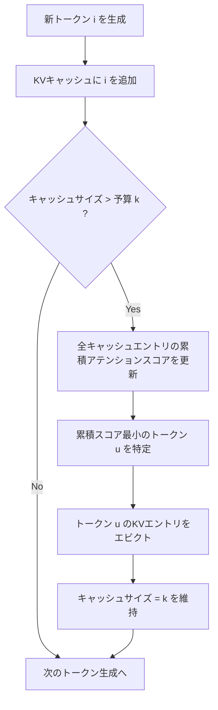

## 論文概要

H₂O（Heavy-Hitter Oracle）は、LLMの推論時に発生するKVキャッシュのメモリ消費問題に対し、**少数のトークン（Heavy Hitters）がアテンションスコアの大部分を占める**という経験的観察に基づく動的エビクション手法を提案した論文である。著者らは、累積アテンションスコアが冪乗則（power-law）に従うことを発見し、Heavy Hitterトークンと直近トークンのバランスを保つエビクションポリシーを設計した。KVキャッシュのエビクションを動的劣モジュラ最大化問題として定式化し、貪欲アルゴリズムの近似保証を理論的に証明している。OPTモデルにおいて最大29倍のスループット向上と1.9倍のレイテンシ削減を達成しつつ、生成品質を維持することが報告されている。

本記事は [H₂O: Heavy-Hitter Oracle for Efficient Generative Inference of Large Language Models](https://arxiv.org/abs/2306.14048) の解説記事です。

## 情報源

- **会議**: 37th Conference on Neural Information Processing Systems（NeurIPS 2023）
- **arXiv**: [2306.14048](https://arxiv.org/abs/2306.14048)（2023年6月投稿、2023年12月改訂 v3）
- **著者**: Zhenyu Zhang（UT Austin）, Ying Sheng（Stanford）, Tianyi Zhou（UC San Diego）, Tianlong Chen（UT Austin）, Lianmin Zheng（UC Berkeley）, Ruisi Cai（UT Austin）, Zhao Song（Adobe Research）, Yuandong Tian（Meta AI / FAIR）, Christopher Ré（Stanford）, Clark Barrett（Stanford）, Zhangyang Wang（UT Austin）, Beidi Chen（CMU / Meta AI）
- **コード**: [https://github.com/FMInference/H2O](https://github.com/FMInference/H2O)（MIT License）

## カンファレンス情報

NeurIPS（Neural Information Processing Systems）は、機械学習・人工知能分野における最高峰の国際会議の一つである。1987年に創設され、理論研究から応用まで幅広い分野をカバーする。2023年のNeurIPS（第37回）はNew Orleansで開催され、採択率は約26%であった。H₂Oは本会議のメインカンファレンスに採択されている。

## 背景と動機

LLMの推論では、自己回帰的なトークン生成のたびに過去のトークンに対するアテンション計算が必要となる。この計算の高速化のため、過去のKey・Valueベクトルを保持する**KVキャッシュ**が広く用いられている。しかし、KVキャッシュのメモリ消費量はシーケンス長とバッチサイズに比例して線形に増大する。

著者らは具体例として、300億パラメータのモデルにおいてバッチサイズ128、シーケンス長1024でKVキャッシュが**180GB**に達すると報告している（Zhang et al., 2023, Section 1）。これはモデルパラメータ自体のメモリ消費に匹敵する規模であり、特に長文生成や大バッチ推論においてデプロイのボトルネックとなる。

従来のアプローチには以下の問題があった。

- **Sparse Attention（Strided / Fixed）**: 事前学習済みLLMに直接適用すると高いキャッシュミス率が発生し、精度が大幅に低下する
- **Reformer / Flash Attention**: アテンション計算の二次計算量を軽減するが、KVキャッシュサイズの削減には直接寄与しない
- **Gisting Tokens**: KVキャッシュの圧縮を学習するが、生成時のデプロイが困難

著者らは、事前学習済みLLMのアテンション行列が**95%以上のスパース性**を持つことを実験的に確認した（Section 3.1）。この知見が、KVキャッシュの大幅な削減が品質を維持しつつ可能であるという着想の出発点となっている。

## 主要な貢献

著者らは以下の3つの貢献を報告している。

1. **Heavy Hitter現象の発見と分析**: 事前学習済みLLMのアテンションブロックにおいて、累積アテンションスコアが冪乗則に従い、少数のHeavy Hitter（H₂）トークンがアテンション計算の大部分を担うことを実験的に示した。H₂はテキスト中の頻出共起語と強い相関を持ち、H₂を除去するとモデルの機能が著しく劣化することも確認している。

2. **H₂Oエビクションポリシーの提案**: KVキャッシュのエビクションを動的劣モジュラ最大化問題として定式化し、Heavy Hitterトークンと直近トークンのバランスを保つ貪欲アルゴリズムを提案した。軽微な仮定のもとで近似保証を理論的に証明している。

3. **システム実装と大規模実験**: FlexGen上にH₂Oを実装し、OPT（6.7B/13B/30B）、LLaMA、GPT-NeoXの各モデルで評価した。20%のHeavy Hitter保持率で、DeepSpeed・Hugging Face Accelerate・FlexGenに対して最大29倍のスループット向上を達成し、同一バッチサイズでは最大1.9倍のレイテンシ削減を実現した。

## 技術的詳細

### Heavy Hitter現象の発見

著者らは、事前学習済みOPTモデルのWiki-Text-103検証セットに対するzero-shot推論で、アテンションスコア行列のスパース性を調査した。正規化アテンションスコア行列 $\text{Softmax}(QK^\top)$ の各行で、最大値の1%を閾値として設定したところ、ほぼすべてのレイヤーで**95%以上のスパース性**が観測された（Figure 2(a)）。

さらに重要な発見として、各トークンの累積アテンションスコア（全クエリ位置からのアテンション重みの合計）が**冪乗則分布**に従うことが判明した（Figure 2(b)）。すなわち、ごく少数のトークンが圧倒的に大きな累積アテンションスコアを持ち、大多数のトークンのスコアは極めて小さい。著者らはこの支配的なトークン群を**Heavy Hitters（H₂）**と命名した。

著者らはH₂の出現がテキスト中の単語の共起頻度と強い相関を持つことも報告している。Figure 2(b)では、累積アテンションスコア（赤い散布点）とデータ中の単語の共起回数（灰色の曲線）が類似したパターンを示している。

### 累積アテンションスコアによるHeavy Hitter識別

H₂の識別には**累積アテンションスコア**が用いられる。トークン位置 $j$ の累積アテンションスコアは、それまでのすべてのクエリ位置 $i > j$ からのアテンション重みの合計として定義される。

$$
\text{CumulAttn}(j) = \sum_{i=j+1}^{n} \text{Softmax}\left(\frac{Q_i K_j^\top}{\sqrt{d}}\right)
$$

ここで、$Q_i \in \mathbb{R}^{1 \times d}$ は位置 $i$ のクエリベクトル、$K_j \in \mathbb{R}^{1 \times d}$ は位置 $j$ のキーベクトル、$d$ はアテンションヘッドの次元数である。

著者らは重要な実用的知見として、**ローカル統計量**（過去のトークンのみからの累積アテンションスコア）が**グローバル統計量**（将来のトークンも含めた累積アテンションスコア）と同等の効果を持つことを実験的に確認している（Figure 2(d)）。これにより、自己回帰生成の各ステップで将来のトークンにアクセスせずとも、効果的なH₂識別が可能となる。

### H₂Oエビクションポリシー

H₂Oのエビクションポリシーは、KVキャッシュの予算 $k$ のもとで、**Heavy Hitterトークン**と**直近トークン**の両方をバランスよく保持する。著者らはまずエビクションポリシーの形式的定義を与えている。

**定義（エビクションポリシー）**:  $S_{i-1}$ をソース集合、$S_i$ をターゲット集合とする。エビクションポリシー $g: S_{i-1} \to S_i$ は以下を満たす。

- $|S_i| = k$（KVキャッシュサイズは一定）
- $|S_i \setminus S_{i-1}| \leq 1$（各ステップで最大1つのKVエントリをエビクト可能）

具体的なH₂Oエビクションポリシー（Definition 4.3）は、スコア関数 $F_{\text{score}}$ を用いて以下のように構成される。

$$
S_i \leftarrow (S_{i-1} \cup \{i\}) \setminus \{u\}, \quad u \leftarrow \arg\max_{v \in (S_{i-1} \cup \{i\})} F_{\text{score}}(S_{i-1} \cup \{i\} \setminus \{v\})
$$

ここでスコア関数はアテンションスコアの合計として定義される。

$$
F_{\text{score}}(T) := \sum_{s \in T} o_s
$$

$o_s$ は正規化されたアテンションスコアであり、以下で計算される。

$$
o_i = D_i^{-1} \cdot \left( \exp(Q_{i,*}(K_{S_{i-1},*})^\top) - \mathbf{1}_{[i] \setminus S_{i-1}} \right)
$$

ここで、$D_i$ は正規化定数であり、エビクトされたKVに対応するアテンションを0にセットした上で正規化を行う。

直感的には、各デコーディングステップにおいて新しいトークン $i$ のKVをキャッシュに追加した後、**累積アテンションスコアが最も低いトークンのKVをエビクトする**。ただし、エビクト候補の選定ではHeavy Hitter（高い累積スコアを持つトークン）と直近トークン（局所的な相関が強いトークン）の両方が自然に保持されるよう設計されている。

### 動的劣モジュラ問題としての定式化

著者らは、H₂Oのエビクションポリシーを**動的劣モジュラ最大化問題**の一種として定式化した。

**定義（動的劣モジュラフレームワーク）**: 関数 $F: 2^{[n]} \times 2^{[n]} \to \mathbb{R}$ を定義する。任意の集合 $Z \subset [n]$ に対して、$F(Z, \cdot): 2^{[n]} \to \mathbb{R}$ が $Z$ に関して劣モジュラ関数であることを仮定する。すなわち、

$$
\forall X, Y \subset [n], \; X \subset Y, \; \forall x \in [n] \setminus Y: \quad f(X \cup \{x\}) - f(X) \geq f(Y \cup \{x\}) - f(Y)
$$

ここで $f(\cdot) := F(Z, \cdot)$ である。これは収穫逓減（diminishing returns）の性質を表す。

**定理4.4**（近似保証、非公式）: 軽微な仮定のもとで、空間制約の予算を $k$ とし、各トークンに対してtop-kの選択に基づいてアテンションスコアを貪欲に計算すると、生成される集合 $\tilde{S}_i$ は以下を満たす。

$$
f(\tilde{S}_i) \geq (1 - \alpha)(1 - 1/e) \max_{|S|=k} f(S) - \beta
$$

ここで $\alpha, \beta > 0$ はパラメータである。$(1 - 1/e) \approx 0.632$ は古典的な劣モジュラ最大化における貪欲アルゴリズムの近似比であり、H₂Oの貪欲ポリシーが理論的に良い近似解を提供することを保証している。

### エビクションフローの概観

以下のMermaidダイアグラムは、H₂Oのエビクションフローを示す。



## アルゴリズム

以下は、H₂Oエビクションアルゴリズム（論文のAlgorithm 1に対応）のPython擬似コードである。

```python
import torch
from dataclasses import dataclass


@dataclass
class KVCacheEntry:
    """KVキャッシュの各エントリを表すデータクラス。

    Attributes:
        token_idx: 元のシーケンスにおけるトークン位置
        key: キーベクトル (shape: [d])
        value: バリューベクトル (shape: [d])
        cumulative_attention: 累積アテンションスコア
    """
    token_idx: int
    key: torch.Tensor
    value: torch.Tensor
    cumulative_attention: float = 0.0


def h2o_eviction(
    query: torch.Tensor,
    cache: list[KVCacheEntry],
    new_key: torch.Tensor,
    new_value: torch.Tensor,
    new_token_idx: int,
    budget_k: int,
    d_head: int,
) -> list[KVCacheEntry]:
    """H₂Oエビクションポリシーに基づくKVキャッシュ更新。

    各デコーディングステップで呼ばれ、新しいKVペアをキャッシュに追加し、
    予算を超過する場合は累積アテンションスコアが最小のエントリをエビクトする。

    Args:
        query: 現在のクエリベクトル (shape: [d])
        cache: 現在のKVキャッシュエントリのリスト
        new_key: 新しいトークンのキーベクトル (shape: [d])
        new_value: 新しいトークンのバリューベクトル (shape: [d])
        new_token_idx: 新しいトークンのシーケンス位置
        budget_k: KVキャッシュの予算（最大エントリ数）
        d_head: アテンションヘッドの次元数

    Returns:
        更新されたKVキャッシュエントリのリスト（サイズ <= budget_k）
    """
    # 1. 新しいエントリをキャッシュに追加
    new_entry = KVCacheEntry(
        token_idx=new_token_idx,
        key=new_key,
        value=new_value,
        cumulative_attention=0.0,
    )
    cache.append(new_entry)

    # 2. キャッシュが予算以内ならそのまま返す
    if len(cache) <= budget_k:
        return cache

    # 3. 現在のクエリに対する各キャッシュエントリのアテンションスコアを計算
    keys = torch.stack([entry.key for entry in cache])  # [cache_size, d]
    logits = torch.matmul(query, keys.T) / (d_head ** 0.5)  # [cache_size]
    attention_weights = torch.softmax(logits, dim=-1)  # [cache_size]

    # 4. 累積アテンションスコアを更新
    for idx, entry in enumerate(cache):
        entry.cumulative_attention += attention_weights[idx].item()

    # 5. 累積アテンションスコアが最小のエントリをエビクト
    evict_idx = min(range(len(cache)), key=lambda i: cache[i].cumulative_attention)
    cache.pop(evict_idx)

    return cache
```

## 実装のポイント

### Heavy Hitter比率の選択

著者らの実験では、KVキャッシュ予算の**50%をHeavy Hitterに、50%を直近トークンに均等配分**する設定がデフォルトとして採用されている。例えば、KVキャッシュ予算が全体の20%である場合、シーケンス長1024のうち約204エントリが保持され、そのうち約102エントリがH₂、約102エントリが直近トークンとなる。

Table 9（Appendix）では、H₂のみ・直近トークンのみ・H₂O（両方）の3つのポリシーの比較が報告されている。著者らによれば、H₂のみまたは直近トークンのみでは、フルKVエンベディング使用時と比較して2.85%から22.75%の性能劣化が生じるが、H₂Oで両方を組み合わせることでベースライン性能を維持できるとされている。

### キャッシュ予算設定

著者らの実験結果に基づく推奨設定は以下の通りである。

- **20%予算（5倍メモリ削減）**: 多くのタスクでフルKVキャッシュと同等の精度を達成（Table 1）
- **4%予算（25倍メモリ削減）**: 一部のタスクで精度低下が見られるが、依然としてLocal戦略を大幅に上回る
- 量子化（INT4等）との併用が可能であり、著者らはスパース性と量子化が直交的な最適化であることを確認している（Section 5.3, Q3）

### 実装上の注意点

著者らは効率的なシステム実装として、エビクト時にメモリスワップを行わず、エビクトされた位置に新しいKVを直接書き込む方式を採用している（Section 4.2, Implementation Details）。これによりI/O効率が向上する。

## Production Deployment Guide

### AWS実装パターン

H₂Oを本番環境に適用する際の3つのAWS構成パターンを示す。

#### パターン1: 単一GPU推論（低レイテンシ優先）

```hcl
# ECS Fargate + NVIDIA T4 / A10G
resource "aws_ecs_task_definition" "h2o_inference" {
  family                   = "h2o-llm-inference"
  requires_compatibilities = ["EC2"]
  network_mode             = "awsvpc"
  cpu                      = 4096
  memory                   = 30720

  container_definitions = jsonencode([{
    name  = "h2o-inference"
    image = "${aws_ecr_repository.h2o.repository_url}:latest"
    resourceRequirements = [{
      type  = "GPU"
      value = "1"
    }]
    environment = [
      { name = "H2O_HEAVY_HITTER_RATIO", value = "0.2" },
      { name = "H2O_CACHE_BUDGET_PERCENT", value = "20" },
      { name = "MODEL_NAME", value = "opt-6.7b" },
    ]
    logConfiguration = {
      logDriver = "awslogs"
      options = {
        "awslogs-group"  = "/ecs/h2o-inference"
        "awslogs-region" = var.region
      }
    }
  }])
}
```

#### パターン2: マルチGPUバッチ推論（高スループット優先）

```hcl
# EC2 Auto Scaling Group + g5.12xlarge (4x A10G)
resource "aws_autoscaling_group" "h2o_batch" {
  name                = "h2o-batch-inference"
  desired_capacity    = 2
  max_size            = 10
  min_size            = 1
  vpc_zone_identifier = var.private_subnet_ids

  launch_template {
    id      = aws_launch_template.h2o_gpu.id
    version = "$Latest"
  }

  tag {
    key                 = "WorkloadType"
    value               = "h2o-batch"
    propagate_at_launch = true
  }
}

resource "aws_launch_template" "h2o_gpu" {
  name_prefix   = "h2o-gpu-"
  image_id      = data.aws_ami.ecs_gpu.id
  instance_type = "g5.12xlarge"  # 4x A10G, 192GB GPU memory

  user_data = base64encode(templatefile("${path.module}/userdata.sh", {
    h2o_cache_budget = "20"
    model_parallel   = "4"
  }))
}
```

#### パターン3: SageMaker Endpoint（マネージドサービス）

```hcl
resource "aws_sagemaker_endpoint_configuration" "h2o" {
  name = "h2o-endpoint-config"

  production_variants {
    variant_name           = "h2o-variant"
    model_name             = aws_sagemaker_model.h2o.name
    initial_instance_count = 2
    instance_type          = "ml.g5.2xlarge"

    serverless_config {
      max_concurrency = 10
      memory_size_in_mb = 6144
    }
  }
}

resource "aws_sagemaker_model" "h2o" {
  name               = "h2o-opt-model"
  execution_role_arn = aws_iam_role.sagemaker.arn

  primary_container {
    image          = "${var.ecr_registry}/h2o-sagemaker:latest"
    model_data_url = "s3://${var.model_bucket}/opt-6.7b/model.tar.gz"
    environment = {
      H2O_ENABLED             = "true"
      H2O_CACHE_BUDGET        = "0.2"
      H2O_HEAVY_HITTER_RATIO  = "0.5"
    }
  }
}
```

### 監視設定

```hcl
resource "aws_cloudwatch_metric_alarm" "cache_hit_rate" {
  alarm_name          = "h2o-cache-hit-rate-low"
  comparison_operator = "LessThanThreshold"
  evaluation_periods  = 3
  metric_name         = "CacheHitRate"
  namespace           = "H2O/Inference"
  period              = 300
  statistic           = "Average"
  threshold           = 0.85
  alarm_description   = "H2O cache hit rate dropped below 85%"
  alarm_actions       = [aws_sns_topic.alerts.arn]
}

resource "aws_cloudwatch_metric_alarm" "gpu_memory" {
  alarm_name          = "h2o-gpu-memory-high"
  comparison_operator = "GreaterThanThreshold"
  evaluation_periods  = 2
  metric_name         = "GPUMemoryUtilization"
  namespace           = "H2O/Inference"
  period              = 60
  statistic           = "Maximum"
  threshold           = 90
  alarm_description   = "GPU memory utilization exceeded 90%"
  alarm_actions       = [aws_sns_topic.alerts.arn]
}
```

### コスト最適化チェックリスト

- [ ] KVキャッシュ予算を20%に設定し、フルキャッシュ比で5倍のバッチサイズ拡大が可能か検証
- [ ] INT4量子化との併用でさらなるメモリ削減を検討（H₂Oは量子化と直交的）
- [ ] Spot Instancesの活用（バッチ推論ではg5.xlargeのSpot価格が約70%割引）
- [ ] 推論リクエストのバッチ化により、H₂Oのスループット向上効果を最大化
- [ ] CloudWatch Metricsでキャッシュヒット率・GPU使用率を継続監視
- [ ] Auto Scalingポリシーでリクエスト数に応じたスケーリングを設定

## 実験結果

### End-to-End品質評価

著者らは、OPT（6.7B/13B/30B）、LLaMA、GPT-NeoX-20Bの3つのモデルファミリーで、HELM・lm-eval-harnessの8つのタスク（COPA、MathQA、OpenBookQA、PiQA、RTE、Winogrande、XSUM、CNN/Daily Mail）を評価している。

Table 1（OPT-30Bでの20%予算）の主要結果は以下の通りである。

| 手法 | PiQA | COPA | OpenBookQA | Winogrande |
|------|-------|------|------------|------------|
| Full | 80.09 | 81.00 | 44.80 | 71.51 |
| Local | 57.94 | 56.00 | 28.40 | 51.30 |
| H₂O | 79.22 | 85.00 | 43.80 | 71.67 |

著者らは以下の知見を報告している。

1. **20%予算で同等精度**: H₂Oは5倍以上のメモリ削減をしつつ、フルKVキャッシュと同等の精度を達成した
2. **Local戦略との差**: 直近トークンのみを保持するLocal戦略は60%予算で精度が崩壊するが、H₂Oは20%予算でもフルキャッシュ性能を維持した
3. **正則化効果**: 一部のタスク（COPA等）ではH₂Oがフルキャッシュを上回る性能を示し、著者らはH₂Oの正則化効果の可能性を示唆している

### スパース化手法との併用効果

Table 2では、Sparse Transformer（Strided / Fixed）とH₂の組み合わせ効果が報告されている。OPT-30B、20%KVキャッシュ予算での結果を見ると、Sparse Transformer単体ではフルキャッシュ比で最大35%の性能低下が生じるが、H₂と組み合わせることでフルKVキャッシュと同等の性能を回復することが示されている。

### スループットとレイテンシ

T4 GPU（16GB）での生成スループット（tokens/s）は以下の通り報告されている（Table 3, 4）。

| システム | OPT-6.7B (512+32) | OPT-30B (512+32) |
|----------|-------------------|-------------------|
| Accelerate | 20.4 | 0.6 |
| DeepSpeed | 10.2 | 0.6 |
| FlexGen | 20.2 | 8.1 |
| **H₂O (20%)** | **35.1** | **12.7** |

A100 GPU（80GB）でのレイテンシ評価（Table 5）では、OPT-30B、シーケンス長7000+1024で、FlexGenの57.0秒に対しH₂Oは50.4秒（約1.1倍改善）、OPT-6.7B、シーケンス長2048+2048ではFlexGenの99.5秒に対しH₂Oは53.5秒（約1.9倍改善）が報告されている。

著者らは、スループット向上の主因として以下の2点を挙げている。

1. **バッチサイズの拡大**: メモリ削減により、同一GPUメモリでより大きなバッチサイズを使用可能
2. **CPUオフロードの回避**: KVキャッシュがGPUメモリに収まることで、CPU-GPU間のデータ転送が不要に

### 無限長入力への対応

著者らは、H₂Oが**400万トークン**までのシーケンスを処理できることを実験的に示している（Figure 5）。StreamingLLMとの比較では、各キャッシュサイズにおいてH₂Oがより低いPerplexityを達成したと報告されている。

### 制約と限界

- Heavy Hitterパターンはドメインやモデルアーキテクチャによって異なる可能性がある
- エビクションポリシーの最適な比率（H₂ vs. Recent）はタスク依存であり、事前チューニングが必要
- 論文の理論的保証は劣モジュラ性の仮定に依存しており、この仮定が常に成立するわけではない
- Prefillフェーズ（プロンプト処理）のKVキャッシュ構築コストは変わらない

## 実運用への応用

H₂Oの実運用上の利点は以下の通りである。

1. **既存システムへの統合が容易**: エビクションポリシーの変更のみで適用可能であり、モデルの再学習や追加の学習データは不要
2. **量子化との併用**: INT4量子化等の直交的な最適化手法と組み合わせることで、さらなるメモリ削減が可能
3. **長文対話・ストリーミング推論**: 固定キャッシュサイズで無限長入力を処理できるため、チャットボットやリアルタイムストリーミングアプリケーションに適用可能
4. **コスト削減**: バッチサイズの拡大やGPUメモリの効率利用により、同一ハードウェアでのサービング能力が向上する

ただし、H₂のパターンがタスクやドメインに依存する可能性があるため、本番適用前にはターゲットドメインでの品質評価が必須である。

## 関連研究

### StreamingLLM（Xiao et al., 2023）

StreamingLLMは、LLMの最初の数トークン（Attention Sink）と直近のトークンを保持する固定ウィンドウ方式を提案した。H₂Oとの違いは、StreamingLLMが固定位置のトークンを保持するのに対し、H₂Oは累積アテンションスコアに基づいて動的にHeavy Hitterを識別・更新する点である。著者らの実験（Figure 5）では、H₂OがStreamingLLMよりも低いPerplexityを達成したと報告されている。

### SnapKV（Li et al., 2024）

SnapKVは、プロンプト処理フェーズ（Prefill）でアテンションパターンを分析し、重要なKVペアを選択的に保持する手法である。H₂Oがデコーディング時の動的エビクションに焦点を当てているのに対し、SnapKVはPrefill時の静的選択に焦点を当てている点が異なる。両者は相補的なアプローチであり、組み合わせることでPrefill・デコーディング双方のKVキャッシュを効率化できる可能性がある。

### PyramidKV（Cai et al., 2024）

PyramidKVは、Transformerの浅い層ではより多く、深い層ではより少ないKVキャッシュを保持する層ごとの適応的予算配分を提案した。H₂Oが全層で均一な予算を想定しているのに対し、PyramidKVは層ごとのアテンションパターンの違いを活用する。両者の知見を組み合わせ、層ごとに異なるH₂比率を設定することも有望なアプローチと考えられる。

### KIVI（Liu et al., 2024）

KIVIは、KVキャッシュの量子化に焦点を当てた手法であり、Keyを2bit、Valueを2bitに量子化することでメモリ消費を大幅に削減する。H₂Oのエビクションアプローチとは直交的な最適化であり、著者らもH₂Oと量子化の併用が有効であることを実験的に確認している（Section 5.3, Q3）。

## まとめ

H₂Oは、LLMのアテンションにおけるHeavy Hitter現象という経験的発見に基づき、KVキャッシュの効率的なエビクションポリシーを提案した研究である。動的劣モジュラ最大化問題としての理論的定式化と、実システムでの大幅なスループット向上・レイテンシ削減の両方を達成した点が評価され、NeurIPS 2023に採択されている。

KVキャッシュ効率化は2024年以降も活発な研究分野であり、SnapKV・PyramidKV・KIVIなどの後続研究が次々と提案されている。H₂Oが示した「少数のトークンがアテンションを支配する」という知見は、これらの後続研究の基盤ともなっており、LLM推論最適化における重要なマイルストーンとなっている。

## 参考文献

1. Zhang, Z., Sheng, Y., Zhou, T., Chen, T., Zheng, L., Cai, R., Song, Z., Tian, Y., Ré, C., Barrett, C., Wang, Z., & Chen, B. (2023). H₂O: Heavy-Hitter Oracle for Efficient Generative Inference of Large Language Models. *NeurIPS 2023*. [arXiv:2306.14048](https://arxiv.org/abs/2306.14048)
2. Li, Y., et al. (2024). SnapKV: LLM Knows What You are Looking for Before Generation. *arXiv:2404.14469*. [arXiv:2404.14469](https://arxiv.org/abs/2404.14469)
3. Xiao, G., et al. (2023). Efficient Streaming Language Models with Attention Sinks. *arXiv:2309.17453*. [arXiv:2309.17453](https://arxiv.org/abs/2309.17453)
4. Cai, Z., et al. (2024). PyramidKV: Dynamic KV Cache Compression based on Pyramidal Information Funneling. *arXiv:2406.02069*. [arXiv:2406.02069](https://arxiv.org/abs/2406.02069)
5. Liu, Z., et al. (2024). KIVI: A Tuning-Free Asymmetric 2bit Quantization for KV Cache. *arXiv:2402.02750*. [arXiv:2402.02750](https://arxiv.org/abs/2402.02750)
