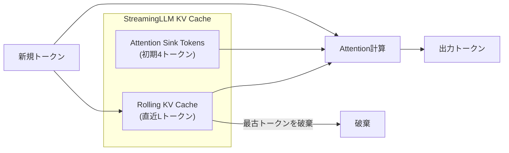
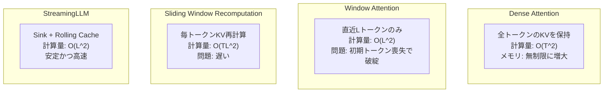

## 論文概要（Abstract）

本記事は [Efficient Streaming Language Models with Attention Sinks](https://arxiv.org/abs/2309.17453) の解説記事です。

StreamingLLMは、有限長のアテンションウィンドウで事前学習されたLLMを、ファインチューニングなしに無限長のシーケンスへ対応させるフレームワークである。著者らは「Attention Sink」現象を発見した。これは、初期トークンが意味的に重要でなくても強いアテンションスコアを集める現象であり、Softmax関数の数学的性質に起因する。初期トークンのKV状態を保持しつつローリングKVキャッシュを組み合わせることで、Llama-2、MPT、Falcon、Pythiaの各モデルにおいて400万トークン以上の安定した処理を実現し、スライディングウィンドウ再計算と比較して最大22.2倍の高速化を達成したと報告されている。

この記事は [Zenn記事: LLMの長いコンテキストを活かす最適解：Context Rot対策からハイブリッド設計まで](https://zenn.dev/0h_n0/articles/ba05271cd9ca43) の深掘りです。

## 情報源

- **会議名**: ICLR 2024（International Conference on Learning Representations）
- **年**: 2024
- **URL**: [https://arxiv.org/abs/2309.17453](https://arxiv.org/abs/2309.17453)
- **著者**: Guangxuan Xiao, Yuandong Tian, Beidi Chen, Song Han, Mike Lewis
- **所属**: MIT, Meta AI, Carnegie Mellon University, NVIDIA
- **分野**: cs.CL, cs.AI

## カンファレンス情報

**ICLRについて**: ICLR（International Conference on Learning Representations）は、深層学習・表現学習分野における最高峰の国際会議の1つである。NeurIPS、ICMLと並びAI/ML分野のトップ会議として位置付けられており、採択率は通常25-30%程度と高い競争率を持つ。StreamingLLMはICLR 2024にconference paperとして採択されている。

## 背景と動機

### ストリーミング推論の課題

LLMのデプロイにおいて、チャットボットやコーディングアシスタントのようなストリーミングアプリケーションでは、事前学習時のウィンドウ長を超える長大な入力を処理する必要がある。しかし、標準的なTransformerのアテンション機構にはいくつかの根本的な制約がある。

**Dense Attention（全トークンアテンション）** はシーケンス長$T$に対して$O(T^2)$の計算量とメモリを要し、キャッシュが無限に増大するため、長期的なストリーミング処理には不向きである。

**Window Attention（ウィンドウアテンション）** は直近の$L$トークンのみを保持する方法であるが、著者らの実験によると、最も古いトークンが削除された瞬間にperplexityが急激に悪化する（論文Table 1より、Llama-2-13Bで初期トークンなしのウィンドウアテンションではperplexityが5158.07に達する）。

**Sliding Window with Recomputation（スライディングウィンドウ再計算）** はウィンドウの位置を1トークンずつずらしながら毎回KVキャッシュを再計算する方法であるが、各トークンの生成に$O(TL^2)$の計算量を要し、実用上のスループットが大幅に低下する。

このような状況の中で、著者らは「なぜウィンドウアテンションが初期トークンを失うと破綻するのか」という疑問に取り組み、Attention Sink現象を発見した。

## 主要な貢献

著者らは以下の3点を主要な貢献として報告している。

- **Attention Sink現象の発見と分析**: 自己回帰LLMにおいて、初期トークンが意味的重要性にかかわらず全レイヤー・全ヘッドにわたって高いアテンションスコアを集める「Attention Sink」現象を発見し、これがSoftmax関数の数学的性質に起因することを分析した
- **StreamingLLMフレームワークの提案**: Attention Sinkトークン（初期4トークン）のKVキャッシュとローリングKVキャッシュを組み合わせることで、ファインチューニングなしに既存LLMを無限長シーケンスに対応させるフレームワークを設計した。Llama-2、MPT、Falcon、Pythiaの4モデルファミリーで400万トークン以上の安定処理を実証している
- **事前学習への統合**: 事前学習時に専用のAttention Sinkトークンを1つ追加する手法を提案し、下流タスクの性能を損なわずにストリーミング性能をさらに向上させることを示した

## 技術的詳細

### Attention Sink現象の発見と分析

著者らはLlama-2-7Bのアテンションパターンを可視化し、興味深い現象を発見した（論文Figure 2より）。下位2層を除くほぼすべての層とヘッドにおいて、モデルは初期トークンに対して極めて高いアテンションスコアを割り当てていた。この傾向は、初期トークンの意味的内容を改行文字（`\n`）に置換しても変わらないことが確認されている（論文Table 1より、置換後のperplexityは5.60であり、元の5.40とほぼ同等）。

この結果は、初期トークンが「意味的に重要だから」アテンションを受けているのではなく、アテンション機構の構造的な性質によってアテンションの受け皿（Sink）として機能していることを示唆している。

### Softmaxの数学的性質とAttention Sinkの関係

Attention Sink現象の根本原因は、Softmax関数の数学的性質にある。標準的なSoftmax関数は以下のように定義される：

$$
\text{Softmax}(\mathbf{x})_i = \frac{e^{x_i}}{\sum_{j=1}^{N} e^{x_j}}
$$

ここで、
- $\mathbf{x}$: アテンションスコアのベクトル（形状: $(N,)$）
- $N$: コンテキスト内のトークン数
- $x_i$: $i$番目のトークンに対するアテンションスコア（Query $\cdot$ Key）

Softmax関数の性質上、**出力の総和は必ず1になる**。つまり、現在のQueryトークンにとって意味的に関連するトークンがコンテキスト内に存在しなくても、アテンションウェイトをゼロにすることはできない。モデルは「不要なアテンション」をどこかに割り当てる必要があり、その受け皿として初期トークンが選ばれる。

初期トークンがSinkとなる理由は、自己回帰言語モデルの訓練構造にある。初期トークンは後続のほぼすべてのトークンのアテンション範囲に含まれるため、訓練過程で「余剰アテンションの受け皿」としての役割を学習しやすい。

著者らはこの問題の解決策として、**SoftMax-off-by-one（SoftMax$_1$）** という代替関数も議論している：

$$
\text{SoftMax}_1(\mathbf{x})_i = \frac{e^{x_i}}{1 + \sum_{j=1}^{N} e^{x_j}}
$$

この関数は分母に定数1を加えることで、全トークンへのアテンションウェイトの総和が1より小さくなることを許容する。これは、Key・Valueがすべてゼロであるダミートークンを暗黙的に追加することと等価であり、余剰アテンションを仮想的なゼロベクトルに割り当てることが可能となる。この手法を事前学習に適用した場合、Attention Sinkの必要性が軽減される可能性を著者らは示唆している。

### StreamingLLMのアーキテクチャ

StreamingLLMのKVキャッシュは、2つのコンポーネントから構成される（論文Figure 4より）。



**Attention Sink部分**: シーケンスの最初の数トークン（デフォルトは4トークン）のKey・Value状態を永続的に保持する。これらのトークンは、余剰アテンションウェイトの受け皿として機能し、アテンション計算の安定性を担保する。

**Rolling KV Cache部分**: 直近の$L$トークンのKey・Value状態を保持するスライディングウィンドウである。新しいトークンが生成されるたびに、最も古いトークンのKV状態が破棄され、新しいトークンのKV状態が追加される。

#### 位置エンコーディングの処理

StreamingLLMの実装において極めて重要なのが、位置エンコーディングの取り扱いである。中間トークンが破棄されると、元のテキストにおける絶対位置と、キャッシュ内の位置にギャップが生じる。著者らは、**キャッシュ内の位置に基づいて位置情報を再割り当て**する手法を採用している。

例えば、キャッシュが $[0, 1, 2, 3, 6, 7, 8]$（トークンID）の状態で9番目のトークンを生成する場合、位置エンコーディングは $[0, 1, 2, 3, 4, 5, 6, 7]$ に再割り当てされる。

**RoPE（Rotary Position Embedding）の場合**: 回転変換を適用する前のKey状態をキャッシュに保存し、各デコーディングステップでローリングキャッシュ内のKeyに対して新しい位置インデックスに基づく回転変換を再適用する。

**ALiBi（Attention with Linear Biases）の場合**: 「ジャンプする」バイアスではなく、キャッシュ内の連続した位置に基づく線形バイアスを適用する。

著者らは、この位置の再割り当てがStreamingLLMの機能において不可欠であると述べている。

### 各アプローチの比較



## アルゴリズム

以下にStreamingLLMのKVキャッシュ管理の擬似コードを示す。

```python
import torch
from dataclasses import dataclass


@dataclass
class StreamingLLMConfig:
    """StreamingLLMの設定パラメータ

    Attributes:
        num_sink_tokens: Attention Sinkとして保持する初期トークン数
        window_size: ローリングキャッシュのウィンドウサイズ
    """
    num_sink_tokens: int = 4
    window_size: int = 1020


class StreamingKVCache:
    """StreamingLLMのKVキャッシュ管理

    Attention Sinkトークンとローリングウィンドウの2つのコンポーネントで
    KVキャッシュを管理し、無限長シーケンスのストリーミング推論を実現する。

    Args:
        config: StreamingLLMの設定
        num_layers: Transformerのレイヤー数
        num_heads: アテンションヘッド数
        head_dim: ヘッドあたりの次元数
    """

    def __init__(
        self,
        config: StreamingLLMConfig,
        num_layers: int,
        num_heads: int,
        head_dim: int,
    ) -> None:
        self.config = config
        self.max_cache_size = config.num_sink_tokens + config.window_size
        # KVキャッシュ: (num_layers, 2, num_heads, cache_len, head_dim)
        # 2はKey, Valueの2種類
        self.cache: list[torch.Tensor | None] = [None] * num_layers
        self.seq_len: int = 0

    def update(
        self,
        layer_idx: int,
        new_keys: torch.Tensor,
        new_values: torch.Tensor,
    ) -> tuple[torch.Tensor, torch.Tensor]:
        """新しいトークンのKV状態をキャッシュに追加し、
        アテンション計算用のKey/Valueを返す

        Args:
            layer_idx: レイヤーインデックス
            new_keys: 新規トークンのKey (batch, num_heads, seq, head_dim)
            new_values: 新規トークンのValue (batch, num_heads, seq, head_dim)

        Returns:
            アテンション計算用の (keys, values) タプル
        """
        if self.cache[layer_idx] is None:
            # 初回: そのままキャッシュに格納
            self.cache[layer_idx] = (new_keys, new_values)
        else:
            cached_keys, cached_values = self.cache[layer_idx]
            # 既存キャッシュと新規トークンを結合
            keys = torch.cat([cached_keys, new_keys], dim=2)
            values = torch.cat([cached_values, new_values], dim=2)

            current_len = keys.shape[2]

            if current_len > self.max_cache_size:
                # キャッシュサイズ超過: Sink + 直近ウィンドウに切り詰め
                sink_keys = keys[:, :, : self.config.num_sink_tokens, :]
                sink_values = values[:, :, : self.config.num_sink_tokens, :]

                # 直近のwindow_sizeトークンを保持
                window_keys = keys[:, :, -self.config.window_size :, :]
                window_values = values[:, :, -self.config.window_size :, :]

                keys = torch.cat([sink_keys, window_keys], dim=2)
                values = torch.cat([sink_values, window_values], dim=2)

            self.cache[layer_idx] = (keys, values)

        cached_keys, cached_values = self.cache[layer_idx]
        return cached_keys, cached_values

    def get_position_ids(self, input_len: int) -> torch.Tensor:
        """キャッシュ内の位置に基づく位置IDを生成する

        中間トークンの破棄によるギャップを埋めるため、
        キャッシュ内の連続位置として再割り当てする。

        Args:
            input_len: 新規入力トークンの長さ

        Returns:
            位置IDテンソル (1, cache_len + input_len)
        """
        if self.cache[0] is None:
            return torch.arange(input_len).unsqueeze(0)

        cache_len = self.cache[0][0].shape[2]
        # キャッシュ内のトークンに連続位置を割り当て
        # [0, 1, ..., sink-1, sink, sink+1, ..., cache_len + input_len - 1]
        total_len = cache_len + input_len
        return torch.arange(total_len).unsqueeze(0)
```

## 実装のポイント

### Sink Token数の選択

著者らのablation study（論文Table 2より）では、Sink Tokenの数とperplexityの関係が調査されている。Llama-2-7Bの場合、1トークンのSinkで11.88、2トークンで10.51、4トークンで9.59、8トークンで9.54というperplexityが報告されている。4トークンを超えると改善が収束するため、著者らは**デフォルトで4トークン**を推奨している。一方、Falcon-7Bではいずれの数でもperplexityは12.12で一定であり、モデルによってSinkの挙動が異なることが示されている。

### ウィンドウサイズの選択

キャッシュサイズの拡大が必ずしも性能向上につながらない点は注意が必要である。論文Table 6より、Llama-2-7Bでは4+508（perplexity 9.73）から4+2044（9.08）へ改善するが、4+4092ではperplexityが9.59に悪化する。著者らは、ウィンドウサイズはモデルの事前学習長に依存すると述べており、事前学習長を大きく超えるウィンドウサイズは逆効果になる可能性がある。

### 事前学習への組み込み

著者らは160Mパラメータのモデルを使った実験（論文Table 3より）で、事前学習時にプレースホルダトークンを追加する手法を検証している。学習可能なSinkトークンを1つ追加した場合、1+1023のキャッシュ構成でperplexity 18.01を達成し、Vanilla設定の4+1020（perplexity 18.05）と同等以上の性能を1トークンのみで実現した。さらに、下流タスク（ARC-Challenge, HellaSwag, PIQA等）において、Sinkトークンの追加による性能低下は観察されていない（論文Table 4より）。

## Production Deployment Guide

### AWS実装パターン（コスト最適化重視）

StreamingLLMのストリーミング推論をAWS上にデプロイする際の推奨構成を以下に示す。

**コスト試算の注意事項**: 以下は2026年7月時点のAWS ap-northeast-1（東京）リージョン料金に基づく概算値である。実際のコストはトラフィックパターン、リージョン、バースト使用量により変動するため、最新料金はAWS料金計算ツールで確認することを推奨する。

| 構成 | ユースケース | 主要サービス | 月額概算 |
|------|------------|------------|---------|
| Small (~100 req/日) | 社内チャットBot | Lambda + Bedrock | $50-150 |
| Medium (~1000 req/日) | カスタマーサポート | ECS Fargate + 自前モデル | $500-1,200 |
| Large (10000+ req/日) | マルチテナントSaaS | EKS + Spot GPU Instances | $3,000-8,000 |

**Small構成**: Lambda + Bedrock。StreamingLLMのロジックはBedrock上のモデルにプロンプトエンジニアリングで適用するか、KVキャッシュ管理をDynamoDBで実装する。Bedrockのストリーミングレスポンス機能を活用。

**Medium構成**: ECS Fargate + g5.xlarge（NVIDIA A10G）。vLLM等の推論エンジンにStreamingLLM対応を組み込み、KVキャッシュのSink + Rolling管理をGPUメモリ上で直接制御。ALB + Target Group Health Checkでルーティング。

**Large構成**: EKS + Karpenter + Spot GPU Instances（g5.xlarge / g5.2xlarge）。Karpenterによる自動スケーリングでSpotインスタンスを優先割り当て。複数ノードでのモデルレプリカ管理。Prometheus + Grafanaでキャッシュヒット率・レイテンシ監視。

**コスト削減テクニック**:
- Spot Instances活用: g5.xlargeのオンデマンド$1.006/hに対しSpotで最大70-90%削減
- Reserved Instances: 1年コミットで最大40%削減
- Karpenter Consolidation: アイドルノードの自動回収
- KVキャッシュサイズ最適化: 1024トークンウィンドウで十分な場合、GPU vRAM使用量を削減

### Terraformインフラコード

#### Small構成（Serverless）

```hcl
# StreamingLLM Serverless構成
# Lambda + Bedrock + DynamoDB (KVキャッシュ状態管理)

terraform {
  required_version = ">= 1.9"
  required_providers {
    aws = {
      source  = "hashicorp/aws"
      version = "~> 5.80"
    }
  }
}

provider "aws" {
  region = "ap-northeast-1"
}

# DynamoDB: セッション別KVキャッシュ状態管理
resource "aws_dynamodb_table" "kv_cache_state" {
  name         = "streaming-llm-cache-state"
  billing_mode = "PAY_PER_REQUEST"  # On-Demandでコスト最適化
  hash_key     = "session_id"

  attribute {
    name = "session_id"
    type = "S"
  }

  ttl {
    attribute_name = "expires_at"
    enabled        = true
  }

  server_side_encryption {
    enabled = true  # KMS暗号化
  }
}

# IAM Role: 最小権限原則
resource "aws_iam_role" "lambda_role" {
  name = "streaming-llm-lambda-role"

  assume_role_policy = jsonencode({
    Version = "2012-10-17"
    Statement = [{
      Action = "sts:AssumeRole"
      Effect = "Allow"
      Principal = { Service = "lambda.amazonaws.com" }
    }]
  })
}

resource "aws_iam_role_policy" "lambda_policy" {
  name = "streaming-llm-policy"
  role = aws_iam_role.lambda_role.id

  policy = jsonencode({
    Version = "2012-10-17"
    Statement = [
      {
        Effect   = "Allow"
        Action   = ["bedrock:InvokeModelWithResponseStream"]
        Resource = "arn:aws:bedrock:ap-northeast-1::foundation-model/*"
      },
      {
        Effect   = "Allow"
        Action   = ["dynamodb:GetItem", "dynamodb:PutItem", "dynamodb:UpdateItem"]
        Resource = aws_dynamodb_table.kv_cache_state.arn
      },
      {
        Effect   = "Allow"
        Action   = ["logs:CreateLogGroup", "logs:CreateLogStream", "logs:PutLogEvents"]
        Resource = "arn:aws:logs:*:*:*"
      }
    ]
  })
}

# Lambda関数
resource "aws_lambda_function" "streaming_llm" {
  function_name = "streaming-llm-inference"
  runtime       = "python3.12"
  handler       = "handler.lambda_handler"
  role          = aws_iam_role.lambda_role.arn
  timeout       = 300
  memory_size   = 512  # Bedrock呼び出しのみなので512MBで十分

  environment {
    variables = {
      CACHE_TABLE     = aws_dynamodb_table.kv_cache_state.name
      NUM_SINK_TOKENS = "4"
      WINDOW_SIZE     = "1020"
    }
  }

  tracing_config {
    mode = "Active"  # X-Ray有効化
  }
}

# CloudWatch アラーム: コスト監視
resource "aws_cloudwatch_metric_alarm" "bedrock_cost" {
  alarm_name          = "streaming-llm-bedrock-token-spike"
  comparison_operator = "GreaterThanThreshold"
  evaluation_periods  = 1
  metric_name         = "Invocations"
  namespace           = "AWS/Bedrock"
  period              = 3600
  statistic           = "Sum"
  threshold           = 500
  alarm_description   = "Bedrock invocations spike detection"
}
```

#### Large構成（Container: EKS + Karpenter）

```hcl
# StreamingLLM Container構成
# EKS + Karpenter (Spot優先) + GPU Nodes

module "eks" {
  source  = "terraform-aws-modules/eks/aws"
  version = "~> 20.31"

  cluster_name    = "streaming-llm-cluster"
  cluster_version = "1.31"

  vpc_id     = module.vpc.vpc_id
  subnet_ids = module.vpc.private_subnets

  # Karpenter用IRSA
  enable_irsa = true

  cluster_endpoint_public_access = false  # セキュリティ: プライベートのみ
}

# Karpenter NodePool: Spot GPU優先
resource "kubectl_manifest" "karpenter_nodepool" {
  yaml_body = yamlencode({
    apiVersion = "karpenter.sh/v1"
    kind       = "NodePool"
    metadata   = { name = "gpu-streaming" }
    spec = {
      template = {
        spec = {
          requirements = [
            { key = "karpenter.sh/capacity-type", operator = "In", values = ["spot", "on-demand"] },
            { key = "node.kubernetes.io/instance-type", operator = "In", values = ["g5.xlarge", "g5.2xlarge"] },
          ]
          nodeClassRef = { name = "default" }
        }
      }
      limits   = { cpu = "100", memory = "400Gi" }
      disruption = {
        consolidationPolicy = "WhenEmpty"  # アイドルノード自動回収
        consolidateAfter    = "30s"
      }
    }
  })
}

# Secrets Manager: モデル設定
resource "aws_secretsmanager_secret" "model_config" {
  name = "streaming-llm/model-config"
}

# AWS Budgets: 月次予算アラート
resource "aws_budgets_budget" "streaming_llm" {
  name         = "streaming-llm-monthly"
  budget_type  = "COST"
  limit_amount = "5000"
  limit_unit   = "USD"
  time_unit    = "MONTHLY"

  notification {
    comparison_operator       = "GREATER_THAN"
    threshold                 = 80
    threshold_type            = "PERCENTAGE"
    notification_type         = "ACTUAL"
    subscriber_email_addresses = ["ops-team@example.com"]
  }
}
```

### 運用・監視設定

**CloudWatch Logs Insights クエリ**:

```
# KVキャッシュヒット率とレイテンシ分析
fields @timestamp, @message
| filter @message like /inference/
| stats avg(latency_ms) as avg_latency,
        pct(latency_ms, 95) as p95_latency,
        pct(latency_ms, 99) as p99_latency,
        avg(cache_hit_rate) as avg_cache_hit
  by bin(1h) as time_bucket
| sort time_bucket desc
```

**CloudWatch アラーム設定（Python）**:

```python
import boto3

cloudwatch = boto3.client("cloudwatch", region_name="ap-northeast-1")

def create_latency_alarm(function_name: str, threshold_ms: float = 5000) -> None:
    """Lambda推論レイテンシの異常検知アラームを作成する

    Args:
        function_name: Lambda関数名
        threshold_ms: アラーム閾値（ミリ秒）
    """
    cloudwatch.put_metric_alarm(
        AlarmName=f"{function_name}-latency-p95",
        MetricName="Duration",
        Namespace="AWS/Lambda",
        Statistic="p95",
        Period=300,
        EvaluationPeriods=2,
        Threshold=threshold_ms,
        ComparisonOperator="GreaterThanThreshold",
        Dimensions=[{"Name": "FunctionName", "Value": function_name}],
        AlarmActions=["arn:aws:sns:ap-northeast-1:ACCOUNT:ops-alerts"],
    )
```

**X-Ray トレーシング設定（Python）**:

```python
from aws_xray_sdk.core import xray_recorder, patch_all

patch_all()  # boto3自動計装

@xray_recorder.capture("streaming_inference")
def run_streaming_inference(session_id: str, prompt: str) -> str:
    """StreamingLLM推論をX-Rayトレーシング付きで実行する

    Args:
        session_id: セッション識別子
        prompt: 入力プロンプト

    Returns:
        生成されたテキスト
    """
    subsegment = xray_recorder.current_subsegment()
    subsegment.put_annotation("session_id", session_id)
    subsegment.put_metadata("num_sink_tokens", 4)
    subsegment.put_metadata("window_size", 1020)
    # ... 推論処理 ...
```

**Cost Explorer自動レポート（Python）**:

```python
import boto3
from datetime import datetime, timedelta


def get_daily_cost_report() -> dict[str, float]:
    """日次コストレポートを取得し、閾値超過時にSNS通知する

    Returns:
        サービス別コストの辞書
    """
    ce = boto3.client("ce", region_name="us-east-1")
    today = datetime.now().strftime("%Y-%m-%d")
    yesterday = (datetime.now() - timedelta(days=1)).strftime("%Y-%m-%d")

    response = ce.get_cost_and_usage(
        TimePeriod={"Start": yesterday, "End": today},
        Granularity="DAILY",
        Metrics=["UnblendedCost"],
        Filter={
            "Tags": {
                "Key": "Project",
                "Values": ["streaming-llm"],
            }
        },
        GroupBy=[{"Type": "DIMENSION", "Key": "SERVICE"}],
    )

    costs: dict[str, float] = {}
    for group in response["ResultsByTime"][0]["Groups"]:
        service = group["Keys"][0]
        amount = float(group["Metrics"]["UnblendedCost"]["Amount"])
        costs[service] = amount

    total = sum(costs.values())
    if total > 100.0:  # $100/日超過でアラート
        sns = boto3.client("sns", region_name="ap-northeast-1")
        sns.publish(
            TopicArn="arn:aws:sns:ap-northeast-1:ACCOUNT:cost-alerts",
            Subject="StreamingLLM Daily Cost Alert",
            Message=f"Daily cost: ${total:.2f}\n{costs}",
        )
    return costs
```

### コスト最適化チェックリスト

**アーキテクチャ選択**:
- [ ] トラフィック量に応じた構成選択（~100 req/日: Serverless、~1000: Hybrid、10000+: Container）
- [ ] ストリーミング応答が必要か、バッチ処理で十分かの判断

**リソース最適化**:
- [ ] EC2/EKS: Spot Instances優先（g5.xlarge Spotで最大70-90%削減）
- [ ] Reserved Instances: 1年コミットで最大40%削減
- [ ] Savings Plans: Compute Savings Plansの検討
- [ ] Lambda: メモリサイズ最適化（PowerTuningで最適値を特定）
- [ ] EKS: Karpenter Consolidationでアイドルノード自動回収
- [ ] DynamoDB: On-Demandモードでプロビジョニング不要

**LLMコスト削減**:
- [ ] Bedrock Batch API使用（非リアルタイム処理で50%削減）
- [ ] Prompt Caching有効化（Sink Token部分のキャッシュで30-90%削減）
- [ ] KVキャッシュウィンドウサイズ最適化（1024で十分なケースの特定）
- [ ] モデル選択ロジック（タスク複雑度に応じた軽量モデルへのルーティング）
- [ ] トークン数制限（入力・出力の上限設定）

**監視・アラート**:
- [ ] AWS Budgets: 月次予算アラート設定
- [ ] CloudWatch アラーム: Bedrock Invocations、Lambda Duration
- [ ] Cost Anomaly Detection: 異常コスト自動検知
- [ ] 日次コストレポート: Cost Explorer API + SNS通知

**リソース管理**:
- [ ] 未使用リソース削除: EBSボリューム、未アタッチENI
- [ ] タグ戦略: Project/Environment/Ownerタグ必須
- [ ] ライフサイクルポリシー: S3/ECRの自動削除設定
- [ ] 開発環境: 夜間・休日の自動停止（EventBridge Scheduler）
- [ ] GPU利用率モニタリング: 30%未満の場合はインスタンスサイズ縮小を検討

## 実験結果

### モデル別性能

著者らは4つのモデルファミリーにわたって400万トークン以上の安定性を検証している（論文Figure 5より）。以下は代表的なperplexity結果である（論文Table 2より）。

| モデル | キャッシュ構成 | Perplexity |
|--------|-------------|-----------|
| Llama-2-7B | 4+4092 | 9.59 |
| Llama-2-13B (Window 0+1024) | 0+1024 | 5158.07 |
| Llama-2-13B (StreamingLLM 4+1020) | 4+1020 | 5.40 |
| Falcon-7B | 4+2044 | 12.12 |
| MPT-7B | 4+2044 | 14.98 |

Window Attentionのみ（初期トークンなし）ではperplexityが数千に達するのに対し、わずか4トークンのSinkを追加するだけで正常なperplexityを回復できることが確認されている。

### ストリーミングQA性能

論文Table 5より、マルチラウンドQAタスク（ARC）でのStreamingLLMの性能を示す。

| モデル | 手法 | ARC-Easy | ARC-Challenge |
|--------|------|----------|---------------|
| Llama-2-7B-Chat | One-shot baseline | 71.25% | 53.16% |
| Llama-2-7B-Chat | StreamingLLM | 71.34% | 55.03% |
| Llama-2-13B-Chat | One-shot baseline | 78.16% | 63.31% |
| Llama-2-13B-Chat | StreamingLLM | 80.89% | 65.61% |
| Llama-2-70B-Chat | One-shot baseline | 91.29% | 78.50% |
| Llama-2-70B-Chat | StreamingLLM | 91.37% | 80.20% |

Window Attentionの場合、ARC-Easyで3.58%、ARC-Challengeで1.39%と著しく低い精度を示しており、Attention Sinkの有無がQA性能に決定的な影響を持つことが確認されている。Dense Attentionはメモリ不足でOut-of-Memory (OOM) エラーが発生したと報告されている。

### レイテンシ比較

著者らはNVIDIA A6000 GPUを使用したベンチマークにおいて、StreamingLLMがスライディングウィンドウ再計算と比較して**最大22.2倍のトークンあたり高速化**を達成したと報告している（論文Figure 1より）。StreamingLLMのメモリ使用量は再計算ベースラインと同等であり、キャッシュサイズの増大に伴う計算量の増加がStreamingLLMでは線形（$O(L)$追加）であるのに対し、再計算方式では二次的（$O(L^2)$）に増大することが高速化の主因とされている。

## 実運用への応用

### チャットボット・マルチターン会話

StreamingLLMは、長時間にわたるマルチターン会話（チャットボット、カスタマーサポート等）に適している。従来のDense Attentionではメモリ不足が発生する長大な会話でも、固定サイズのKVキャッシュで安定的に推論を継続できる。Zenn記事で言及されているContext Rot（コンテキストの品質劣化）に対して、Attention Sinkが会話の安定性を維持する仕組みとして有効である。

### 制約と限界

ただし、著者らはStreamingLLMの制約も明確に述べている。StreamingLLMは効率的なストリーミング処理を実現するが、**モデルのコンテキストウィンドウを拡張するものではなく、長期記憶を強化するものでもない**。モデルは現在のキャッシュ内の情報のみに基づいて動作するため、長文書のQAや要約のように、キャッシュウィンドウを超えた長距離依存が必要なタスクには適さない。著者らの実験（論文Appendix Cより）では、質問と回答の距離がキャッシュサイズを超えると精度がゼロに低下することが確認されている。

このため、プロダクション環境ではRAG（Retrieval-Augmented Generation）との併用が効果的である。StreamingLLMで会話のストリーミング処理を行いつつ、過去の会話内容はベクトルデータベースに格納し、必要に応じて検索・挿入する設計が現実的な選択肢となる。

## 関連研究

- **H2O (Heavy Hitter Oracle)**: Zhang et al. (2023) が提案したKVキャッシュ圧縮手法。蓄積アテンションスコアに基づいて「Heavy Hitter」トークンを動的に選別し、スライディングウィンドウと組み合わせて重要なトークンを保持する。StreamingLLMが位置（初期トークン）に基づく静的な選択であるのに対し、H2Oはアテンションスコアに基づく動的な選択を行う点が異なる
- **SnapKV**: Li et al. (2024) が提案した手法で、各アテンションヘッドごとにObservation Windowからのアテンション信号に基づいて重要なKV位置をクラスタリング選択する。StreamingLLMの「全ヘッド一律のSinkトークン」に対し、ヘッドごとに異なる重要トークンを選択できる柔軟性を持つ
- **Window Attention / Longformer**: Beltagy et al. (2020) が提案したローカルウィンドウアテンションとグローバルアテンションの組み合わせ。事前学習段階からウィンドウアテンションを採用するアプローチであり、StreamingLLMが既存モデルに対する推論時の工夫であるのに対し、アーキテクチャレベルでの対応を行う
- **ALiBi (Attention with Linear Biases)**: Press et al. (2022) が提案した位置エンコーディング手法。位置の明示的なエンコーディングの代わりに、距離に比例したバイアスをアテンションスコアに加算する。StreamingLLMの位置エンコーディング再割り当て処理において、ALiBiとRoPEで異なる対応が必要であることが報告されている

## まとめと今後の展望

StreamingLLMは、Attention Sink現象という興味深い発見に基づいて、既存のLLMを無限長のストリーミング処理に対応させる実用的なフレームワークである。わずか4トークンのKV状態を追加保持するだけでウィンドウアテンションの破綻を防ぐという知見は、LLMの推論最適化において重要な意味を持つ。

今後の研究方向として、著者らはSoftMax$_1$のような代替関数を事前学習に組み込むことで、Attention Sinkの必要性自体を解消するアプローチに言及している。また、StreamingLLMとRAGやKVキャッシュ圧縮手法（H2O、SnapKV等）を組み合わせることで、長期記憶を保持しつつ効率的なストリーミング処理を実現するハイブリッドアーキテクチャの可能性がある。

## 参考文献

- **Conference URL**: [https://arxiv.org/abs/2309.17453](https://arxiv.org/abs/2309.17453)
- **arXiv**: [https://arxiv.org/abs/2309.17453](https://arxiv.org/abs/2309.17453)
- **Code**: [https://github.com/mit-han-lab/streaming-llm](https://github.com/mit-han-lab/streaming-llm)
- **Project Page**: [https://hanlab.mit.edu/projects/streamingllm](https://hanlab.mit.edu/projects/streamingllm)
- **Related Zenn article**: [https://zenn.dev/0h_n0/articles/ba05271cd9ca43](https://zenn.dev/0h_n0/articles/ba05271cd9ca43)
